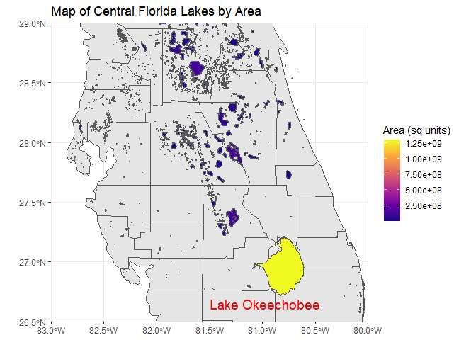

# Data Visualization and Reproducible Research

> Alec Lewis. 

Learn more about me in my [GitHub profile page](https://github.com/ABL124). 

## Project 01

In the `project_01/` folder you can find a project exploring a data set that about car manufacturers over the last two decades. It explores the how different manufacturers have improved the efficiency of their cars.

**Sample data visualization:** 

## Project 02

In this project, I explored a data set on housing in West Roxbury. Florida Lakes were also explored with a spatial visualization. Find the code and report in the `project_02/` folder.

**Sample data visualization:** 

## Project 03

In this project, I explored weather patterns at the Tampa International Airport as well as data on concrete. You can view this report and data in the `project_03/` folder.

**Sample data visualization:** 

### Moving Forward

_Please add here a short reflection on what you learned and what you plan to continue exploring in terms of data visualization, data storytelling, reproducible research, and/or related topics._

This class has taught me many things about making data visualizations. I was shocked at how much of an impact how the story is told in conjunction with proper visualizations assists in getting your point across. I have started to read articles more aware of this. I also was surprised at how much time it takes to make good data visualizations. There were many do's and don'ts in the class material that I will try to follow going forward, another thing that I started noticing in other articles I have been reading outside of class.
