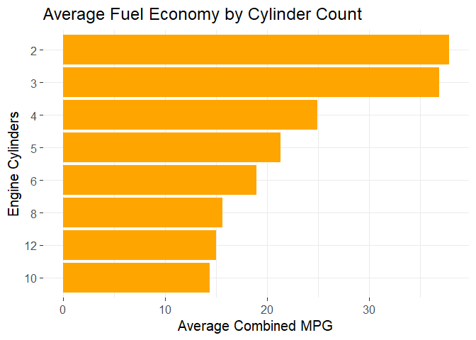

# Data Visualization Project 01

# Initial Plans

When I first looked at this data set, I was really hoping to explore how cars have become much more efficient over time. My plan was to create graphs to show how in the last two decades cars have become more efficient with the addition of new technologies. I wanted to create charts on the distribution of different propulsion types as well and how they play a role in increasing fuel economy. I found some of these charts hard to create with the data as well as present them in a meaning full way. I was hoping to show how the introduction of hybrid and electric cars would cause a shift in efficiency as well.

# Narrative

This story begins like most others...by getting our data and packages loaded into R.


```r
library(tidyverse)
```

```
## ── Attaching core tidyverse packages ──────────────────────── tidyverse 2.0.0 ──
## ✔ dplyr     1.1.4     ✔ readr     2.1.5
## ✔ forcats   1.0.0     ✔ stringr   1.5.1
## ✔ ggplot2   3.5.1     ✔ tibble    3.2.1
## ✔ lubridate 1.9.3     ✔ tidyr     1.3.1
## ✔ purrr     1.0.2     
## ── Conflicts ────────────────────────────────────────── tidyverse_conflicts() ──
## ✖ dplyr::filter() masks stats::filter()
## ✖ dplyr::lag()    masks stats::lag()
## ℹ Use the conflicted package (<http://conflicted.r-lib.org/>) to force all conflicts to become errors
```

```r
setwd( "..")
fuel <- read_csv("data/fuel.csv", col_types = cols())
```
After loading in the data and starting to explore it I decided I wanted to limit the car manufacturers. Many of the ones in this data set are either too expense for most people or they don't make enough to justify overall trends. To limit the data, I only used car manufacturers that only had 1000 or more entries in this data set. Below we also combined the city MPG and highway MPG to get an average for each car as this was missing from the data set.


```r
fuel_avg <- fuel %>% mutate(avg_mpg = (city_mpg_ft1 + highway_mpg_ft1)/2)

over1k <- fuel_avg%>%
  count(make) %>%
  filter(n >= 1000)

fuel_limited <- right_join(fuel_avg, over1k, by = "make")

fuel_limited %>%
  group_by(make) %>%
  summarise(Average_MPG = mean(avg_mpg, na.rm = TRUE),
            Average_Cylinders = mean(engine_cylinders, na.rm = TRUE),
            Max_Cylinders = max(engine_cylinders, na.rm = TRUE),
            Min_Cylinders = min(engine_cylinders, na.rm = TRUE))
```

```
## # A tibble: 10 × 5
##    make          Average_MPG Average_Cylinders Max_Cylinders Min_Cylinders
##    <chr>               <dbl>             <dbl>         <dbl>         <dbl>
##  1 BMW                  21.5              6.40            12             2
##  2 Chevrolet            19.5              6.32             8             3
##  3 Dodge                18.1              6.16            10             4
##  4 Ford                 19.5              6.06            10             3
##  5 GMC                  16.8              6.87             8             4
##  6 Mercedes-Benz        19.7              6.98            12             4
##  7 Mitsubishi           22.4              4.59             8             3
##  8 Nissan               22.1              5.24             8             4
##  9 Toyota               22.7              4.96             8             4
## 10 Volkswagen           24.9              4.58            12             4
```

We can see this left us with 10 manufacturers. Above is some general summarization data about them. We can see that about half of them had over 8-cylinder engines and only one had a two-cylinder engine. The average cylinders for each manufacturer ranged from 4.5 to 6.9. This led me to wonder if the cylinder count of an engine had any relationship to the gas mileage.


```r
avg_mpg_per_class <- fuel_limited %>%
  filter(is.na(engine_cylinders) == FALSE) %>%
  group_by(engine_cylinders) %>%
  summarize(avg_combined_mpg = mean(avg_mpg, na.rm = TRUE)) %>%
  arrange(desc(avg_combined_mpg))

ggplot(avg_mpg_per_class, aes(x = reorder(engine_cylinders, avg_combined_mpg), y = avg_combined_mpg)) +
  geom_bar(stat = 'identity', fill = 'orange') +
  coord_flip() +
  labs(title = 'Average Fuel Economy by Cylinder Count', x = 'Engine Cylinders', y = 'Average Combined MPG') +
  theme_minimal()
```

<!-- -->
Above we can see that as the cylinder count in cars goes up the fuel efficiency goes down. Between some cylinder counts there was very little variation like 8, 10, and 12. Overall the use of these larger engines is limited to large trucks and other applications with heavy loads. Next, we look at the general fuel efficiency of cars over time.


```r
avg_mpg_per_year <- fuel_limited %>%
  group_by(year) %>%
  summarize(avg_combined_mpg = mean(avg_mpg, na.rm = TRUE))

ggplot(avg_mpg_per_year, aes(x = year, y = avg_combined_mpg)) +
  geom_line(color = 'blue') +
  labs(title = 'Average Fuel Economy Over Time',
       y = 'Average Combined MPG') +
  theme_minimal() +
  theme(axis.title.x=element_blank())
```

<!-- -->
We can see that there is a decrease at the beginning of the data set then it levels off over time until a rapid increase in the last decade. This steep increase could be explained by the creation of hybrid and electric vehicles in this dataset. Although there are no exclusive electric manufacturers in our limited data set like Tesla there are still other well-known hybrids at this time like the Toyota Prius and Chevy Volt. Speaking of American manufacturers, I wanted to look at them specifically to see if they followed a similar trend line to the one above.


```r
american <- filter(fuel_avg, make %in% c("Dodge", "Ford","Chevrolet","GMC"))

p <- ggplot(filter(american, fuel_type == "Regular"), aes(x = year, y = avg_mpg
                                                          ,color = make))

p + geom_point() +
    geom_smooth() +
    labs(y = "Combined MPG",
         title = "American Car Manufacturers Gas Combined MPG Over Time") +
    theme_minimal() +
    theme(legend.position="top",
          legend.title = element_blank(),
          axis.title.x=element_blank())
```

```
## `geom_smooth()` using method = 'gam' and formula = 'y ~ s(x, bs = "cs")'
```

<!-- -->
In the above graph we can see that three out of the four American car manufacturers that we are analyzing follow almost and identical trend line. GMC is the only one out of the line but they focus more on Trucks and SUVs than any of their competitors, so this below average line makes sense. We can see that all of them follow a slight upwards curve past 2010 but not as steep as the last graph.


# Design Principles

The above graphs show a few different design principles that we learned in the week. I tried to limit the labels, when possible, like removing the year label when it was obvious that it was on the X axis. I also made sure the legend on the last graph was self-explanatory between the title and the well-known brands. I applied the minimal theme to all the graphs as I thought it had a good set of default design principles as well.

# Next Steps

This data could be explored with newer data which would assist in relieving the current impact of electric vehicles on the aver MPG today. New fully electric brands like Rivian, Lucid, and Polestar have begun to challenge older EV makers like Tesla. Most of the other car manufacturers also now offer a range of electric or hybrid models that should also increase the average MPG of cars. We could also filter out these larger brands and look at more specialized ones to see if they also follow similar trends or not.

