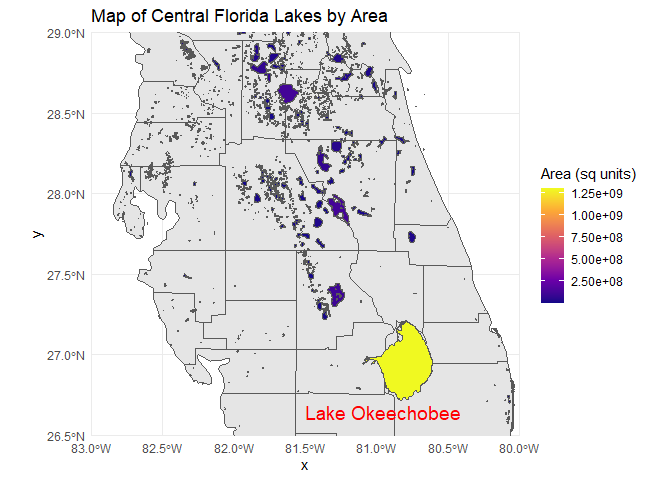
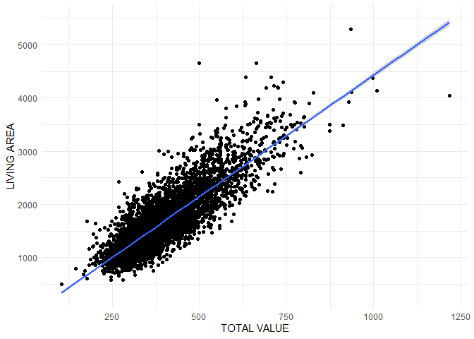

# Data Visualization Project 02

# Initial Plans

I was initially planning to explore the Florida Lakes spatial dataset more. I wanted to highlight the counties with the most area of lakes. I found it hard to try to merge the geoms and find the intersections to get this to work. I also wanted to try to show the correlation of house prices to certain futures of houses, I figured scatter plots would be the best way to visualize this.

# Narrative

We load in all of the different packages and data for our analysis in this first chunk. Sadley nothing too fun here…


```r
library(tidyverse)
```

```
## ── Attaching core tidyverse packages ──────────────────────── tidyverse 2.0.0 ──
## ✔ dplyr     1.1.4     ✔ readr     2.1.5
## ✔ forcats   1.0.0     ✔ stringr   1.5.1
## ✔ ggplot2   3.5.1     ✔ tibble    3.2.1
## ✔ lubridate 1.9.3     ✔ tidyr     1.3.1
## ✔ purrr     1.0.2     
## ── Conflicts ────────────────────────────────────────── tidyverse_conflicts() ──
## ✖ dplyr::filter() masks stats::filter()
## ✖ dplyr::lag()    masks stats::lag()
## ℹ Use the conflicted package (<http://conflicted.r-lib.org/>) to force all conflicts to become errors
```

```r
library(sf)
```

```
## Linking to GEOS 3.12.1, GDAL 3.8.4, PROJ 9.3.1; sf_use_s2() is TRUE
```

```r
library("rnaturalearth")
library("rnaturalearthdata")
```

```
## 
## Attaching package: 'rnaturalearthdata'
## 
## The following object is masked from 'package:rnaturalearth':
## 
##     countries110
```

```r
library(plotly)
```

```
## 
## Attaching package: 'plotly'
## 
## The following object is masked from 'package:ggplot2':
## 
##     last_plot
## 
## The following object is masked from 'package:stats':
## 
##     filter
## 
## The following object is masked from 'package:graphics':
## 
##     layout
```

```r
library(broom)
library(units)
```

```
## udunits database from C:/Users/codwa/AppData/Local/R/win-library/4.4/units/share/udunits/udunits2.xml
```

```r
library("tools")
library("maps")
```

```
## 
## Attaching package: 'maps'
## 
## The following object is masked from 'package:purrr':
## 
##     map
```

```r
states <- st_as_sf(map("state", plot = FALSE, fill = TRUE))
counties <- st_as_sf(map("county", plot = FALSE, fill = TRUE))


setwd( "..")
florida_lakes <- read_sf("data/Florida_Lakes/Florida_Lakes.shp")

houses <- read_csv("data/WestRoxbury.csv")
```

```
## Rows: 5802 Columns: 14
## ── Column specification ────────────────────────────────────────────────────────
## Delimiter: ","
## chr  (1): REMODEL
## dbl (13): TOTAL VALUE, TAX, LOT SQFT, YR BUILT, GROSS AREA, LIVING AREA, FLO...
## 
## ℹ Use `spec()` to retrieve the full column specification for this data.
## ℹ Specify the column types or set `show_col_types = FALSE` to quiet this message.
```

Next, we can begin to take a look at the houses dataset. I found it very interesting that the largest average house sizes per year were in the 1800s. I would like to dive more into this in the future.


```r
houses %>%
  group_by(`YR BUILT`) %>%
  summarise(Average_Size = mean(`LIVING AREA`, na.rm = TRUE),
            Average_Value = min(`TOTAL VALUE`, na.rm = TRUE),
            Average_Users_Rooms = max(ROOMS, na.rm = TRUE)) %>%
  arrange(desc(Average_Size))
```

```
## # A tibble: 149 × 4
##    `YR BUILT` Average_Size Average_Value Average_Users_Rooms
##         <dbl>        <dbl>         <dbl>               <dbl>
##  1       1881        3653           737.                  11
##  2       1851        3527           705.                   9
##  3       1848        3168           689.                  12
##  4       1884        3039.          418.                  12
##  5       1798        2953           438.                  11
##  6       2010        2952.          534                    9
##  7       1976        2944           398.                   9
##  8       2011        2885.          458.                  10
##  9       1874        2884           714.                  10
## 10       1998        2806           365.                   9
## # ℹ 139 more rows
```

Below is an interactive plot that you can use to look at the houses dataset comparing the total value of a house to its living area. Feel free to explore it and take a look at some of the outliers.


```r
plot <- ggplot(houses, aes(x = `LIVING AREA`, y = `TOTAL VALUE`, size = BEDROOMS, color = BEDROOMS)) +
  geom_point(alpha = 0.7) +
  labs(title = "Total Value vs Living Area",
       x = "Living Area (sqft)",
       y = "Total Value (in $1000s)",
       size = "Number of Bedrooms",
       color = "Number of Bedrooms") +
  scale_size_continuous(range = c(.1, 3)) +
  theme_minimal()

# Convert ggplot2 to ggplotly for interactivity
inter_plot <- ggplotly(plot)

inter_plot
```

```{=html}
<div class="plotly html-widget html-fill-item" id="htmlwidget-a07d21f590e994622e4e" style="width:672px;height:480px;"></div>
<script type="application/json" data-for="htmlwidget-a07d21f590e994622e4e">{"x":{"data":[{"x":[1352,1976,1371,2608,1438,1060,1916,1200,1092,2992,1485,1460,1290,2378,1272,864,1438,1445,1470,1632,1232,1302,1275,2054,1371,1541,927,1244,1048,808,1469,1436,1625,1620,1906,1393,1394,1452,960,1803,1792,1460,1870,1690,1391,2640,1500,1572,1326,1500,1694,1508,1560,1300,1364,1562,1440,1018,1056,1075,2051,1800,1800,1800,1800,2708,1318,1392,1763,1386,1464,1740,845,1836,2436,1350,1680,1992,1470,1265,1224,1488,1299,1306,1369,1546,1872,1265,768,1224,1680,1503,1224,1922,1306,1440,1872,1376,1304,1710,1474,1523,1630,2359,1620,2056,2494,1306,1352,1420,1911,1839,2774,1980,876,1435,1989,1625,2888,1484,3446,1150,1486,1680,2074,2282,1014,1421,1340,1400,1120,1826,1080,1387,2483,1440,1414,1636,1696,1633,1120,988,1781,1931,2416,1380,2035,2612,1347,2028,1659,1669,1590,1781,1633,900,1131,1824,1430,800,1306,1306,1208,1997,2206,900,1403,1590,1248,2009,1000,1020,1155,1082,864,1590,1800,1452,2597,1954,1216,1754,1082,1800,1632,1590,1410,1728,1204,1306,1082,1680,1590,1470,1408,1082,1568,2293,960,1650,1326,960,1800,933,1082,1228,972,900,900,1083,1487,1966,1305,1544,1871,856,1539,1744,1726,1320,1310,900,938,1000,2156,1976,1467,1380,1552,1469,1487,1469,1246,2601,1008,1276,1200,1105,1380,1976,1896,1469,984,1469,690,1350,1152,1364,1008,1684,1380,2455,1061,1510,1469,1140,1056,1075,797,1469,1008,1726,1560,912,1188,1712,1016,936,1497,1713,968,2369,1625,1577,1529,1966,2724,1008,1533,1000,1075,1075,1075,2079,2134,1378,1966,1313,1265,1426,968,1306,1506,1075,1368,1200,1469,2118,2428,1589,1487,990,2605,1368,1538,1490,1306,1966,1726,1372,600,1692,1612,1306,1842,1377,1200,970,918,1368,1980,1726,2605,1369,1350,504,2014,1529,1380,1404,1692,1387,1492,1558,1320,952,1953,1583,1404,1706,1637,1726,2188,1679,3108,1360,1306,1469,1966,1320,1726,1354,1786,1378,1536,1404,1326,1734,1726,1402,1930,1370,1632,1270,1232,1469,1609,1701,1151,1536,1726,1275,1680,1360,1320,2010,1404,1404,1930,1641,1560,1726,1247,1469,1550,1808,1637,1750,1306,1469,1940,1404,1404,1311,1726,1306,1726,1726,1320,1726,1464,1469,2059,1469,1075,1641,1939,1487,1469,1075,1726,1404,1404,1863,1109,1155,1128,1792,1125,1306,1779,1755,1870,1518,1306,1726,1435,2036,1008,1726,1469,1487,1520,1428,1726,1966,1306,1075,1075,1075,1512,1320,984,1472,1966,1870,978,1469,1008,1536,962,1354,1440,941,1428,1966,1726,1075,1006,1469,1308,1961,1726,1726,1075,1487,1133,1993,1237,1382,1456,1020,1346,1320,1220,1008,1726,1120,1306,1584,1306,1176,1313,1557,960,1536,1726,1682,1469,1469,1233,1104,1320,1008,1726,1104,1223,1134,1714,1244,1056,1075,1726,1063,882,1868,1726,1487,1598,1161,1008,1352,1260,912,1448,1726,1008,1247,1591,1859,1306,1280,1728,2953,1726,1726,1404,1761,1487,1042,1440,936,1726,1537,1908,2343,1488,1870,2196,1306,1320,1726,2390,1883,982,2168,1596,1726,1190,1354,1367,1008,2135,1008,1908,1188,1577,1528,1487,1487,1726,1474,1966,2138,1849,1692,1726,1123,1560,1836,1670,1820,1726,1081,1350,1521,1104,1680,1747,1589,1320,1487,1566,1306,1123,1726,1481,2048,1128,1350,1170,1110,1268,1432,1726,1726,1247,1368,2509,1692,1354,1354,1469,1109,1726,1726,1469,1479,754,1080,1506,1620,1302,1715,2246,1296,1613,1428,1008,1680,1726,1726,1063,1343,1726,1877,1440,1487,1726,1384,2007,1040,1469,1438,1875,2160,2511,1149,1726,1726,1937,1306,1664,1726,1280,1726,1343,1679,2087,1993,3062,1881,1704,1320,1438,2076,984,1306,1320,1350,1726,1306,748,2846,1142,1460,1636,1680,1495,2129,1726,1438,1726,2086,2166,1726,1306,1603,1872,1400,1068,1494,1088,1530,1148,1469,3494,1438,1047,966,952,1347,1692,1352,1794,1640,1741,1122,1487,1721,1346,1503,1419,1056,1123,2446,1172,1492,853,2685,1220,1081,1628,1325,1315,1216,2552,1064,1300,1270,1265,1439,1334,1584,1528,1352,1596,1430,1596,972,1456,1372,1383,3089,1306,1516,1688,1344,1317,798,1000,1596,1060,3063,1505,1346,1596,1433,1087,1306,1305,1042,1344,962,1317,3263,1596,839,1123,1162,1131,1162,1317,3011,1872,1628,1119,2944,1568,1265,1940,1205,1056,1306,1469,1248,1632,1306,1421,890,971,1578,788,1642,1414,1137,898,1403,1254,2193,1632,736,2594,1454,1387,1691,1142,4392,3013,1327,2018,1991,2021,2284,2021,1312,1379,1414,1659,1749,2585,1128,1070,1353,1352,898,1634,1444,1958,1414,1401,2655,3374,1484,1000,1352,1326,1306,1056,1320,2192,1829,1400,1176,1201,2094,1632,893,1488,1778,1950,1390,2044,1344,1311,1026,1800,1530,1485,1352,1368,1100,1692,1470,1104,1888,1590,1067,980,1200,1354,2107,1674,2311,1616,1306,1296,1676,1635,1092,988,1354,1912,1416,1566,1272,1456,1680,1306,1565,1536,1576,1674,1306,1398,1351,1584,1360,1360,1548,1918,2302,1306,1848,1351,1306,1930,1044,1506,1306,1254,1306,1736,1306,1266,1722,4658,1306,1306,1407,1360,1372,1306,1400,1434,1306,1599,1346,1326,1306,754,2908,1591,1270,1288,1671,1165,1255,1330,1306,1056,1320,1310,2017,1347,1671,1625,996,1434,1387,1711,1180,1056,1256,1183,744,1314,1739,672,2316,1419,1137,852,1377,1274,1449,1190,966,1152,1238,1968,1832,1260,1913,1035,2564,1056,1872,1249,983,1152,1225,1104,1347,1120,1648,1650,1300,1152,1408,2224,1575,1303,925,864,1333,1224,1165,1708,1400,1569,1464,2023,1354,1352,1436,2620,1742,1238,1177,925,1469,1248,1210,825,2521,1230,1341,1680,1466,1332,925,1211,900,576,1134,1080,2352,1584,1026,1443,1078,1406,720,1800,1400,900,1469,1040,925,910,1037,1453,1308,1502,1487,2322,1284,2376,1330,1314,925,970,1232,1539,1145,1025,944,1628,925,1658,1400,1075,1142,1600,936,1344,1488,925,1196,1858,1118,1172,2296,1943,1400,1109,925,1464,900,1680,1071,1075,709,1304,1116,1840,1198,893,1428,1376,1676,1248,825,1680,2373,792,1540,1400,720,888,1092,1485,1484,1400,1092,1294,1248,1277,1700,1424,1500,992,1120,1476,1587,2064,2543,1798,1015,1453,1824,1740,950,1220,703,2227,955,1142,1075,1966,1306,1384,1100,1643,1685,1078,2796,1566,1120,1232,1079,1398,1124,950,1740,2021,1841,1296,2543,1410,1488,984,1326,1201,936,733,912,950,1800,1902,2641,1740,1248,1300,1248,1196,3041,1498,1344,1426,2422,1232,780,832,936,2244,912,1352,1044,1383,1995,1800,1854,1773,1250,2543,1576,2543,1025,1904,1193,1206,1740,1313,1764,1740,1165,2543,1261,1440,1654,1392,1002,768,1409,1201,1190,1088,1495,1248,1740,1800,1372,1008,1740,4186,1448,1772,1559,1008,1025,1299,1459,1464,1056,999,3022,1860,979,840,986,1168,1490,1395,1120,1403,845,1120,1300,1128,1134,1313,1795,1775,1274,1740,805,1716,1109,752,864,1365,1500,2106,988,1436,1565,1056,1862,1932,1160,1344,1605,2160,1800,1093,1629,1553,864,2113,1000,864,1396,1428,1052,1150,1780,828,1232,1274,1649,2170,828,1498,1400,828,1489,1536,1400,1470,1201,1276,1242,1646,2158,1430,1232,1725,1084,2021,2248,2197,1300,2138,1586,1814,1411,1740,1346,1560,1933,1862,1359,2332,1862,1207,1396,888,1533,800,1459,2598,1632,2381,1072,1366,2016,1118,2486,1908,1238,1550,1326,1144,1308,1791,1238,2102,1510,1075,1772,1680,1200,1368,1756,952,1772,1200,1392,1862,1645,1550,2180,1032,1772,1479,1104,918,1190,852,1268,1400,2639,1104,1593,990,1296,1747,1990,1596,1968,1047,1075,1224,1832,980,1104,1944,720,1862,1080,1144,810,1000,912,2425,3970,1142,2339,1075,1075,1889,2052,1075,1080,880,1938,2658,1738,1772,878,1120,1576,1225,1582,1628,1434,1430,1310,1977,1090,1075,1056,1080,864,1176,1938,2291,1075,3880,1204,1620,1532,869,1303,1075,1802,1372,1075,1474,1795,912,1285,1347,1171,966,1571,1056,864,1360,2404,1246,827,2016,1346,1672,1422,1666,2282,1288,1313,1488,1075,1360,2870,2256,1415,1155,1148,1436,1666,768,864,1470,1456,1120,864,1834,1220,1538,1728,1706,1470,1377,1712,2560,3929,1306,1075,1571,2312,2850,1973,1380,960,850,1637,1095,1152,1389,1210,950,1357,1251,2354,1469,1568,948,1422,1666,1306,2641,988,1200,1536,1484,1690,857,1194,950,1350,1190,1554,2240,1075,1092,1056,1545,1387,2832,1295,1042,1306,1437,2167,912,1056,960,1047,2820,1427,960,1517,2150,2000,1121,1265,984,2167,864,960,2177,1306,1254,1306,1387,1344,2591,1650,1758,1984,864,2081,1050,864,1075,2924,1824,1445,1056,1420,1536,1155,1872,1595,1270,2762,2186,864,972,1396,998,1561,1680,1306,1560,1100,1383,2186,1224,1284,1344,864,1456,1350,2080,1503,2038,2246,1399,1008,1056,1232,1924,2582,1262,1176,1680,1632,2136,1370,2198,1586,1450,1120,1306,1109,1503,2034,1154,1782,2421,2402,2170,840,1291,2788,1075,1382,1125,1028,1748,1552,1226,1149,1650,1464,1348,1958,1109,1468,902,1862,2112,1306,1562,1125,1500,3001,1580,928,1816,1014,1571,1841,1018,1984,1058,3001,1159,1338,890,1611,816,968,1698,1284,1521,1414,1515,1657,1132,1345,988,1808,1284,1434,1074,1470,1971,1500,3164,1809,1826,1591,1160,1138,1284,1412,1500,1597,1404,1615,1236,1484,1479,1197,1134,1138,1347,1446,1272,1284,1484,1180,1492,1460,1480,1025,1019,1207,1020,1500,1200,1329,1724,1075,1794,1294,2225,1134,1387,940,814,900,1152,1306,1197,1176,1437,1377,1372,1188,1400,979,3957,1782,1085,1778,992,1536,1316,2015,1104,1536,1500,1813,1400,1808,1075,1264,1725,1580,1176,1266,920,1306,2098,1870,1620,1544,1492,1428,1306,1503,1536,1456,1457,904,1120,1600,1491,1142,1306,1619,1372,2334,1600,1275,1600,1306,1344,1847,1600,816,1800,3021,1961,1265,1366,1152,1260,1176,1536,2135,1306,1624,1404,1387,1600,1358,1560,1682,1844,1465,1290,1400,1305,1428,960,1456,1600,2088,1708,2254,840,2052,1171,2798,1976,1536,1650,800,1241,1383,1414,1176,1334,1188,1688,1908,1496,2303,1294,1428,1536,1680,2564,1624,1344,1295,1600,1372,1250,1170,851,1578,1846,1344,1812,1710,1659,1600,894,2016,2192,2176,1584,1600,816,1217,2988,1210,1990,1300,1536,1534,1966,1936,2375,912,1844,1600,1387,1011,1490,1692,1428,1042,1834,1536,1488,1554,1095,1488,2226,1800,1267,1716,1275,1040,1000,1142,1656,1744,1536,1008,1600,2065,1530,905,1498,1152,1042,1218,1768,1275,1805,2208,1844,1361,1540,1750,1766,1000,1896,992,1275,905,1976,1816,905,912,1075,1593,1450,1275,1591,1840,1737,1767,1860,1320,1536,1894,1680,2280,1265,1712,1910,910,1836,1615,1458,980,1286,2357,900,1606,1050,1520,1142,1632,980,2712,1688,1974,2480,2204,1288,1330,1718,1186,1764,1372,2328,1806,1142,975,1400,1715,1624,1448,2492,2028,1568,1456,1288,1651,1387,1734,1680,975,1426,1536,1224,1008,1265,1352,1870,2064,1801,1142,975,1628,1632,1572,1318,1616,1538,1552,1858,1265,2407,1735,1210,1352,1680,1470,2194,575,1251,1536,1421,1536,1524,1350,1545,1513,1470,1568,1360,1735,2340,2158,1990,1820,1730,1658,1797,1998,1869,1350,1250,1330,1512,1534,1568,1912,1956,1872,1554,1580,1576,1504,1797,1866,988,1350,1845,1306,1478,2142,1458,1295,1841,1895,1594,1470,1500,1404,1500,1248,1431,1456,1450,1531,2020,1732,1550,1856,2094,1457,2399,1464,1488,1827,1852,1942,1623,1744,1457,1596,1370,1812,1366,1470,1580,1670,1919,1350,1646,1688,1296,2054,2291,1809,2066,1808,3160,1434,1785,1484,1478,1748,2210,1400,1377,1212,2128,1560,1454,1880,2812,1680,1928,2397,1560,1366,2236,1666,1670,1836,1836,1378,1956,1870,1536,2254,1676,1676,1306,1500,2110,1075,2235,1836,5289,1309,1632,1600,1896,1747,2213,1517,1720,2564,1592,1664,1770,960,1360,2110,2792,1404,1915,2149,3607,1850,2042,2612,1476,1378,2048,2237,1544,1570,2043,2394,1350,1404,2017,1232,1443,2000,3726,1696,2104,2163,1524,1656,1960,1962,1248,2124,2400,1156,1979,1794,2053,1567,1683,1562,1536,1494,1683,1438,1174,1104,1520,4224,1584,3132,1920,2228,1688,1615,1998,1544,1251,2420,1872,1933,1244,1728,1664,1537,1785,3184,1925,1169,1666,1392,1232,1432,1975,1633,1536,1763,1694,1622,1532,1644,2652,1849,1800,1564,2352,1127,1752,1680,1933,1458,2328,1064,1815,2936,1728,1671,1521,1864,1898,1308,1576,2657,1758,2610,1700,1590,2035,2477,1666,1998,1980,1659,2166,1508,2275,2048,1118,1400,1472,1790,1506,1598,1512,2177,1866,2416,1329,2058,1953,2074,1438,826,1664,1640,1871,2244,1360,1456,1632,1690,1560,1508,1224,1596,1836,1590,2404,1632,1536,1718,1715,1403,1470,1960,1808,1590,2213,1540,2414,1725,1762,2056,2000,1793,1886,1426,1392,1826,1715,1560,1431,1680,1893,1521,2736,1444,1152,1968,1728,1624,2071,2082,2218,1700,1982,925,1450,1568,1652,1736,2442,1540,1680,1632,1936,1523,1820,1850,1408,1410,1504,2352,1828,1450,1778,2288,1312,2439,1712,1966,1680,1749,1364,2288,1853,2024,1226,1616,1770,1377,2043,1664,1434,1568,1937,1543,1585,1924,1612,1362,2428,1492,1075,1808,1248,1504,1686,1464,1694,1749,1791,1150,1546,2160,1362,2478,1269,1411,1668,1632,1680,1768,1519,2818,2059,1703,1732,1396,1702,1478,1534,1788,1426,2078,1866,2650,3014,1822,1776,1590,2144,3241,1482,1847,1506,1882,1632,1550,1440,1568,1608,1661,1552,1634,1400,2704,1426,1360,1860,1458,1776,1747,1560,1839,1686,1648,1344,1944,2514,1732,1248,1812,2776,1428,1242,1680,1664,1750,3653,1688,1732,1428,1440,1666,1232,1648,2133,1450,1488,2360,1824,2926,1685,1666,1410,1472,1500,1344,1646,2504,1456,2101,2220,1214,1786,1584,1696,1435,2610,1911,1648,4653,1859,1940,2592,3264,1440,2135,1904,1576,2278,1666,1530,1568,3024,1752,1414,2931,1664,1957,2640,2866,1350,1360,1980,1562,1201,2132,1665,2262,1734,3238,768,2266,2656,1834,1443,2173,3002,2228,1858,1746,1572,1990,2176,1600,1829,2134,3382,1472,2110,1684,2678,1864,1480,2059,1768,1146,1400,1861,2233,1450,1801,1306,1116,2491,1368,2972,3117,2669,1428,3026,2294,2603,2690,1648,1101,1965,2224,2072,2168,3180,1470,2219,1314,1643,1248,1448,1870,1837,2445,1270,1680,1768,1740,2104,1972,2459,1700,1868,1680,1665,1440,1819,840,2499,2309,1596,2870,1569,1300,1394,1707,1540,2794,2908,1020,1815,1160,3048,936,1999,1578,1508,1792,1828,1861,1640,2427,1486,2878,2437,3613,936,1586,2176,1127,962,1890,2652,1344,2321,1964,2384,1893,1979,2242,1118,3714,2178,1512,1556,2255,1298,2426,1988,2415,1887,1529,876,1040,1501,1387,2253,1570,1521,1344,1584,2047,1540,2036,1816,2098,1683,2500,1008,2592,2633,1075,3405,2150,1710,2736,2742,1556,2269,2573,2001,1810,1542,1488,1470,1201,1427,1008,2040,1688,2326,2136,1650,1884,2416,1808,1525,2155,858,1428,2781,1591,1781,2108,1176,1941,1878,2144,2179,1594,2659,1935,2054,2014,2925,861,1440,1512,3291,2278,2128,1719,1300,2148,2116,1098,1627,1384,1923,2150,2018,2212,1752,820,2145,3020,2025,1390,1346,2134,2390,1800,2064,1404,1577,1090,4100,2257,1381,1604,1374,1714,1767,1900,2304,2016,1560,1676,1716,2889,2471,1789,1692,2172,1560,1500,1265,1596,1300,2224,2509,1459,2240,2593,1948,1046,1550,1440,2443,3351,1414,1905,1305,1476,1817,1948,2552,1200,1534,1575,2877,3085,1726,1459,1568,1344,3500,1593,1212,2088,1200,1716,2414,1930,1456,1576,1350,2762,960,3404,1272,2233,1247,1352,3046,1842,3802,1750,3301,1459,2130,1840,1767,1456,1872,1473,1470,2808,1818,1075,2530,1459,2770,2532,2007,1790,2374,1456,3527,1344,2004,1361,1530,2184,1372,1698,1439,2329,2490,1414,2060,1444,1980,1379,1298,1323,1590,2265,1712,1040,2174,1414,2193,1393,2361,1425,1078,1414,2806,2213,1058,2016,2032,2130,2412,2278,1568,2205,1290,1456,1372,1859,2442,1536,1904,1349,1078,2164,900,1920,1661,1160,2933,1942,1272,1459,1365,1556,1260,1926,1090,1400,2319,1960,2257,2024,1632,2780,1843,1585,1769,1064,2246,1404,1189,1120,2921,1917,1553,1464,1148,1956,1360,1406,2408,2036,3393,1541,3250,2344,3112,1488,2324,1946,1414,988,1576,1622,2041,1472,2039,1237,2773,936,2303,1383,1988,1700,1464,2485,2642,2588,1258,925,2166,1516,2122,936,1776,2070,2840,1664,1056,2821,1946,1871,1383,1632,1271,1387,1733,2298,1550,912,988,1760,3355,1416,2477,1414,1297,2220,2534,1762,1492,1550,1503,1798,1794,2481,2670,1000,1395,1402,1364,3245,950,1056,1500,1461,1607,1752,1698,1550,2674,1014,792,950,1383,1314,1710,1680,1585,3626,2113,2371,1514,1752,1050,1705,1648,1581,2767,1600,1428,1565,1146,1908,1971,1542,2090,988,1639,3015,2007,1872,1937,1351,1850,2927,1859,3245,1458,1380,2050,1274,3331,2514,1404,1918,2548,1533,1544,2567,1322,950,1152,1500,2522,1810,1328,1399,912,974,1884,3039,1568,2860,2774,2838,1550,1904,1615,2337,2625,1710,912,4288,1586,1082,1758,1529,2294,1792,2370,2349,2684,912,828,1330,2989,2344,1527,1658,1350,1420,3153,1296,2502,1900,1420,2854,2290,888,2566,1314,1599,2374,912,912,1658,2220,960,1874,941,1352,1394,2501,1795,1284,1032,1766,1944,912,1291,1729,2024,1620,1489,1701,3176,1900,1350,960,2457,1104,1764,2940,2729,1056,1352,1959,1710,1306,1192,1600,1896,2193,2282,2594,1392,1056,1842,2678,2224,3192,1745,1306,1336,2039,2012,2407,2459,864,1025,2057,1260,2412,1523,1578,1040,2144,886,1654,1750,1090,1002,1490,1521,1588,1075,2633,3857,3374,2978,1836,1648,2957,1403,1627,1102,2722,1330,2719,1688,1920,1306,3558,1017,985,1225,3564,1616,2309,3495,2108,2833,4188,1920,1568,1300,1061,1201,1474,2843,1550,1836,1068,1075,1225,960,1334,1224,3014,1940,2946,1239,1649,2542,3125,1443,3348,1334,1336,1152,3566,1924,2729,1680,3003,1144,1224,1530,3927,2832,1595,2924,1555,1232,1696,1142,3977,2319,1384,2774,1413,1512,2100,1285,1919,1392,934,1696,1274,1440,3224,1210,1306,1383,1798,1584,2648,2158,1295,1488,2144,1123,1380,2235,1518,1560,2440,1664,1470,1446,1454,850,2520,2906,1295,1749,2857,1466,1512,1613,2300,1536,2212,2250,1530,1200,1310,3493,1420,2756,1904,1324,1536,1392,2153,3845,1782,1310,2385,1040,2569,1885,972,1670,2514,924,1664,2460,1295,3220,1764,3232,2535,1538,1470,3061,1042,2629,1850,2507,1274,1042,3906,2749,1872,1295,1470,1275,1120,2338,2665,1296,1581,1061,1320,1900,1673,1085,1758,1591,1260,1066,2342,2095,2403,1152,2495,2235,1569,2098,1102,1372,2347,2187,1780,1680,1295,2391,1265,2213,1590,2367,2036,1663,1560,2131,2105,1060,1008,1299,1988,1934,1612,1808,1295,1274,1763,1485,1323,2416,1302,2084,2816,1901,1654,2215,1930,1778,1120,1152,2770,1404,2768,3491,2654,1918,1350,1042,3329,1166,2050,1986,1396,1866,1344,1295,1404,1815,2219,1464,1645,1200,1308,1152,1042,1436,1408,2304,1666,2544,1632,1581,1295,2402,2166,1392,1799,1075,1724,1755,2680,1584,1580,1152,1690,1578,1383,1632,925,2040,1917,2192,1975,1462,1418,1392,2525,1714,1920,1487,2075,1600,1210,925,1310,1152,2040,1781,1720,3031,1618,3446,1860,635,2572,1736,2578,2445,1629,1876,1711,1539,1190,2100,2698,1152,1918,1422,1458,2128,1295,1462,3270,2272,1248,1699,1328,816,1280,1075,1108,1383,3050,1295,1016,1404,1560,1269,2239,1538,2584,1152,1318,1600,3074,1476,1758,1968,1428,1075,2981,1318,2388,1363,1504,1404,1563,1306,1295,1142,1225,2317,3209,1792,1352,1194,1582,1981,1318,1496,1881,1562,900,1711,1134,995,2395,1248,2248,1526,1367,1352,1318,1104,2964,1969,1220,2572,1329,1625,1551,2032,1295,1306,2074,660,1352,1295,1536,2467,1265,1997,1356,2500,2817,1836,1306,1412,2951,1734,1400,925,2588,1260,2916,1371,1940,1274,1556,1490,1800,1014,1265,1394,1484,3164,1224,2503,1960,3085,925,1765,1160,1335,921,1653,2115,1530,2333,2341,1274,950,1450,898,1849,1850,1759,2500,1904,1392,2468,2884,2554,1615,2160,1373,1431,3436,1474,925,2369,2442,1274,1277,3615,1310,1274,900,714,1392,1904,2873,1723,1532,1470,2592,900,1540,3201,2677,2000,1573,1383,1368,900,2027,1661,3628,1659,1482,1420,3414,1050,909,1620,2188,1152,1281,3270,1080,1306,1175,3269,1258,1378,2368,1125,1272,1042,2175,1316,2320,988,1090,2416,2482,1816,1615,1330,1497,2095,2230,1300,3568,1306,912,4196,3392,2285,2078,1430,1328,3091,1372,880,1352,1260,1513,2680,1825,2496,2497,1464,1855,1334,1167,3510,1436,1346,1344,1333,1123,1739,1615,1075,1222,1232,3652,3649,1932,1281,1408,2909,1165,1452,1321,1333,2293,1344,2716,1383,1635,2416,945,2067,1360,2157,988,1488,1665,1590,1758,1448,2419,2987,2054,1394,1492,1841,1016,1739,988,1228,1383,1383,960,1348,1352,1868,1919,1306,2966,1568,1784,3443,2418,1372,1944,1050,1376,1318,2459,1180,1383,1401,1383,1982,2854,2014,2474,1684,988,1284,1915,1026,2142,864,2988,1235,1040,1764,3241,960,2118,2432,1150,1658,2066,1752,1664,1126,1310,1608,2635,3166,1963,1912,1573,4106,3084,1044,912,1306,1814,954,1330,1330,4381,2154,1588,1544,1462,1162,1334,1903,2359,2932,1589,1824,2758,912,1121,3510,1758,2243,1137,2695,950,3116,2317,1856,3058,2718,2478,1490,1624,2649,1032,1732,1680,2304,1392,1669,1344,2071,1142,1075,1728,1870,1352,3159,3488,3120,2445,950,1632,1274,1333,2703,1584,2042,2794,1527,1613,960,3636,1424,1408,1363,1075,2484,1137,2661,1224,1820,950,1225,1188,1095,2813,2341,1285,1850,2633,1042,1061,1914,2442,2341,1277,1075,2358,1642,1706,1704,1616,1620,1597,1372,2630,3105,936,1591,3917,1992,2475,1042,1111,1800,900,1847,1991,1683,1946,1188,1499,1941,1265,1075,1632,2954,1326,988,1676,1368,1539,1333,2292,1754,2240,1691,2462,1664,2352,988,1161,1690,1344,1236,2809,2232,912,1989,2619,2995,1456,1476,1803,1920,1528,1400,1624,1075,1306,1403,1552,1479,1272,1326,1628,2939,1560,1384,1870,2196,912,2067,2497,1485,1740,2784,1395,1980,1382,1736,1830,3540,2163,1330,1635,1789,1775,1772,1251,1781,832,1544,1627,1984,1404,2496,1274,732,1248,1469,1634,1313,3148,1265,2131,2298,1014,1540,1210,1413,2329,1626,1279,1350,1701,1508,1408,2466,960,1056,1591,1152,1503,1740,2400,1378,2960,3902,1738,1667,1265,1659,2124,2112,1392,2448,1411,2298,1426,1452,1940,1520,1378,1217,1200,1664,1265,1815,2479,1912,2942,2448,2885,950,1310,1485,1890,1560,2526,840,1310,1552,1176,1370,2170,1325,1907,2430,1615,1582,1056,1624,1920,2574,1042,1470,1870,3232,1479,1417,2571,1616,2565,2921,1596,2061,975,2866,1223,1696,1814,1653,2496,1568,2176,1325,3455,1794,1377,1245,1776,1856,2149,936,1176,1014,1957,1730,2365,1964,2534,1776,1536,1562,2237,1738,1680,1440,1479,1512,1303,1768,1969,1316,2187,1074,1274,1398,2010,1067,2347,1254,2246,2854,1544,1479,950,1643,1331,1906,1032,1705,1530,1678,1466,1748,1479,1790,1595,1279,4375,1538,2084,2164,1585,1832,1953,1261,1914,1920,1015,1248,1812,1326,988,1870,2358,1479,1873,1258,1537,1678,1479,3240,1400,1714,1635,1479,4133,1452,1603,1819,2648,1189,1530,1403,3542,900,1368,2074,768,1620,1544,1908,1056,1656,2080,1490,3446,1415,2148,1896,1218,1499,1730,1334,1275,1512,1411,1456,900,1306,2792,1536,1144,1430,1626,1624,1464,988,1616,1568,1344,1530,2822,1376,1520,1000,988,1899,1664,1000,1537,2694,2087,1634,1734,1128,1479,1760,1080,1765,2055,1600,1615,1626,1588,1364,1259,1330,936,1120,1376,1123,1275,988,1430,1248,1706,1584,968,1590,2256,1742,1200,1380,1530,2037,1275,1785,1585,1456,1598,1378,2356,1552,1914,1716,2227,2107,1737,1218,1327,1275,2277,1622,1334,1804,1737,2168,2029,1173,1700,1380,1715,1680,1455,1610,1403,1944,1486,2023,1464,972,1177,1350,2029,1524,1268,1878,1645,2210,1650,1671,1326,1472,1350,2890,1538,1274,1494,1964,1225,1536,1327,1847,2065,1355,3461,1656,1164,1400,1231,1941,1300,1454,1192,1749,1820,2234,1843,1624,1372,2129,1472,2043,1382,1425,1820,1622,2240,2583,2439,1991,2029,1361,1164,1915,1736,1432,2362,2288,1541,2692,1444,1440,1378,1516,1684,2148,1591,1440,1421,1233,1218,3470,1554,1440,1392,1459,1578,2001,1593,1676,1300,2551,1495,2085,1242,3464,1508,1549,1371,1991,1690,1428,1704,2536,1300,1142,1530,1400,1874,1700,1393,1472,1760,1465,2656,1470,1389,1988,1264,1404,1380,1355,1591,2002,1248,1354,1378,1615,2136,1884,1950,1464,1702,1413,1500,1558,1666,2129,1902,1096,1377,1387,1274,1832,1846,1626,1908,1687,1231,1709,2022,2726,1378,1352,902,1064,1446,1310,1558,1924,1260,1855,1528,1446,2874,1974,1400,1460,1760,1790,1550,1148,2133,936,1489,1454,1504,1051,1536,1075,1494,1610,1508,1920,792,3026,1248,1124,1364,2961,2854,3771,912,1326,1945,2469,1584,1650,1423,1075,1800,2171,1350,1938,1238,2285,1383,1396,1652,1615,960,1026,1613,1476,1527,1075,1194,3496,2691,1260,2040,2671,2088,792,1442,1894,1632,1581,952,2686,1252,2974,2012,1664,1885,1553,1056,1352,1726,1750,1537,2352,1834,1468,1442,1612,2663,1380,1152,2190,1000,2130,1145,1518,950,1128,2514,1847,1523,1400,1132,1718,1612,1706,1608,2013,1777,2002,1804,1260,1053,1344,2179,1980,1776,1882,4037,1242,2309,1948,1947,1459,1540,2187,1581,1405,2846,2344,1291,1312,1952,2845,2160,998,3078,1538,1277,1624,1584,1688,3667,1484,1712,2063,2296,1519,1042,3249,3298,1688,1114,1152,1884,1694,3682,1877,1380,2768,2912,1238,2045,2016,1594,1485,1607,1734,1871,1807,2300,1944,2344,1198,1728,1544,1303,1354,1813,2110,1075,2108,3209,2106,1761,1828,1325,3063,2851,2025,2884,888,1880,2331,1756,1939,2829,1961,1274,1599,862,2678,1395,2007,3521,1248,1470,1516,2645,1643,1530,1598,1378,2151,1698,3183,925,2674,2473,1740,1600,1247,2329,1298,1248,3040,2527,2480,1224,1488,2080,1440,2627,3184,1400,1778,1664,1606,1774,2843,1562,1844,1950,1590,2184,1440,1365,1650,1558,2921,1889,1792,1070,1530,2138,1894,1696,2457,1456,1500,2913,2365,2145,2345,1123,1306,2438,2468,1544,2265,1588,1608,1620,1627,1125,2295,1350,1598,1793,1802,1352,1452,1123,1033,1428,1627,3462,1680,672,1592,1816,1011,1568,1650,1600,1822,1224,1914,1680,1602,910,1869,1736,1560,1064,1981,1560,1488,2160,3261,1920,1248,1186,1780,2491,1344,1224,1420,1476,1862,1142,1789,1848,1998,1632,1218,1543,1306,1616,912,1142,1740,1723,1992,1176,1955,1680,1064,1500,1200,1414,1290,1625,1968,1651,2466,2464,1428,1716,1438,1608,1232,1288,1064,1904,1576,2232,1340,1378,2349,1075,1247,2711,984,1718,1181,1770,1566,1926,1620,1958,744,1596,846,1674,1685,1506,2480,1539,2000,2505,2731,944,2904,1415,1302,1266,1306,1920,1568,2726,2822,2852,1752,1361,2214,2862,1365,2262,2020,1825,1702,2168,2270,1169,1770,1752,1791,2451,1080,1596,1998,3325,1768,1933,1520,2286,1394,1423,1788,1325,1608,1500,1380,1456,1602,2117,1544,1274,2419,1232,1978,1791,1320,1550,1568,1494,1056,1726,1656,1576,1536,1380,1820,2039,1080,1456,1396,2091,1536,1710,1706,1423,1886,1716,1320,2187,1308,1842,1188,2415,1547,1518,1354,1724,1736,1985,1512,1500,2611,1668,1880,1188,1564,1636,1816,1920,1940,2246,1396,1608,1801,1665,1813,2064,1055,1732,1850,1720,1523,1123,1605,1476,1266,1778,1425,1710,1634,1008,1332,1574,1306,1123,1500,1806,1578,768,2908,1921,992,2184,2207,1468,1521,2072,960,972,1912,2563,1520,1680,1470,1284,1552,1971,1692,2020,1812,1424,2389,1066,954,1523,1828,1888,1928,1188,1479,1950,1929,1080,1318,1761,902,1152,1771,1008,1518,1248,1831,1614,1615,2095,1737,1712,1890,2302,1872,1550,2293,1190,1880,1112,1188,1858,1842,1856,1998,1008,1348,2336,1280,2180,1304,1152,1350,1200,1610,1650,1178,1764,3452,1932,2248,1221,1641,2536,1726,1827,1702,2280,2022,1634,2090,1802,1014,1708,1702,2006,1404,1104,1716,1504,1628,1152,1919,1408,1663,1380,2032,1271,2221,2625,1792,1431,2208,1392,1227,1232,1625,1288,1302,2338,1717,1842,1848,1494,2276,1449,1861,1948,1872,2061,2013,1344,1316,1664,1566,1176,2754,1860,1354,1976,1502,1360,1308,1554,2076,1871,1442,1260,1528,1707,1664,1354,1456,1842,1288,1064,1476,1554,2722,987,2720,1661,1870,2242,1850,1618,1792,1531,1649,1391,1606,1580,1500,1224,1204,1632,1356,1420,1238,2096,1250,1701,1584,1347,1836,1852,1176,1310,1476,1960,2947,1505,1384,2208,1411,1918,2291,987,1716,1250,1447,1274,936,3544,1841,1464,1544,1856,1872,1344,2304,1561,1594,1450,1837,1768,1210,1928,1867,1752,1232,1242,1120,1426,1716,1752,1590,2128,1694,1779,1464,1872,1248,1248,1704,1832,1400,1134,1344,2976,1176,1330,1624,1452,1602,2794,1493,1671,1458,1260,1562,1699,1960,1200,1336,1404,1470,1436,1426,1378,958,710,3022,1352,2012,864,1752,1490,2516,1518,1568,2516,1558,2237,1591,1936,1356,1954,1626,1092,3420,1536,1410,1752,1552,1624,2287,1494,1225,1075,1565,1971,1584,2200,1362,1133,1475,1330,1314,1500,1389,1570,1831,1632,936,1323,1680,1582,1570,1296,1738,2037,1584,1399,1470,1456,1632,999,1152,1330,1341,1573,1524,1498,2178,2086,2353,2317,1391,1539,2256,2088,1536,1504,1835,1390,1161,1620,1989,1584,1726,1558,1460,1716,1479,1448,1452,2318,1508,1932,2106,1700,1720,1001,1952,1337,1500,1636,1583,1442,1476,3112,1496,1534,1840,1737,2225,1404,1319,1344,1210,1333,1944,1350,1368,1183,1090,1684,1488,1560,1429,2285,2019,1416,2540,1250,1846,2421,1572,2458,1644,2086,1220,1047,1525,1350,1464,1488,2056,1378,2136,1404,1944,1404,1250,2074,1550,1584,2281,1368,1256,1470,1464,1540,2540,1412,1959,1545,1325,2008,1921,1820,1042,1123,1521,1643,1536,1350,1433,1580,1500,1702,1500,1504,3123,1787,1942,1711,1273,1808,1275,1406,1918,1544,2078,1536,1531,1500,1544,2036,1260,1470,2026,1745,1804,1836,744,1764,1224,912,1422,864,1400,2071,1015,2337,1644,1273,1341,1540,1108,1530,1975,1354,1282,1403,1080,1310,1479,1430,1814,1248,1306,1469,1580,1556,734,2536,1250,960,1714,2827,1856,1430,1240,1938,1620,1500,1816,1618,1188,1450,1404,1816,1882,1828,1617,1624,1430,1765,1568,1808,1817,1672,2084,1330,1450,1680,1776,1398,1142,1408,1570,1512,1695,2184,1306,1100,1440,1634,1479,1109,1934,1377,1681,1075,1120,2649,1759,1548,1188,904,1797,1440,1030,1529,1060,1296,1218,1491,2028,1350,1143,1120,1120,1626,1137,1528,1566,1650,1848,1904,1944,1462,1540,1427,1470,1590,1672,1660,2496,1219,1562,1478,1370,1590,1765,1683,1496,1912,1398,1399,2005,1606,1090,1457,1326,1120,2223,1704,1454,1528,1315,1284,1949,1653,2246,1504,1185,1162,1104,1456,1542,1482,1554,1091,1410,1448,1352,1572,1673,2034,1690,1683,1274,1800,1584,1806,2192,1540,1678,2088,1260,1776,1379,1444,1550,1414,1440,1248,1206,1925,1738,1680,1755,2168,2120,1372,1562,1504,1815,1428,1103,1449,1989,1850,1768,2089,1592,1607,1851,2638,1304,1836,1974,2293,1264,1120,1300,1281,936,1404,3192,1379,1848,2776,1544,1479,1395,1377,1470,1445,1804,1454,1555,1233,912,1481,2274,1651,1274,1759,1461,1400,1112,1461,1352,1320,1208,1753,1632,1617,1683,1323,1419,1261,1488,1357,1404,1555,2484,1674,1633,1320,1377,1293,1225,1652,1404,1710,1621,2102,1274,1224,1285,1956,1281,2316,1327,2280,1296,1443,1912,1638,1602,1274,1488,1686,1583,1700,1440,1274,1399,1993,1094,1547,1570,1274,1071,1352,1584,1296,1529,1015,1046,1296,1440,1768,1607,952,1490,1470,1358,1248,1321,2948,1498,1377,1500,1248,1768,2865,1590,1248,1744,1414,1350,1565,1240,1931,1498,1052,1568,1691,1500,1225,1245,1230,1056,1005,1631,1440,1354,1242,1400,1460,1898,1792,2062,1403,2114,1700,1300,1382,1096,1266,1613,1683,2210,1780,1448,1997,1654,2070,1076,1552,1352,1840,2250,1760,1430,1853,1472,1465,1628,1202,1795,1077,1380,1274,1552,1376,1659,1441,1650,1274,2178,1323,1439,1410,1549,1538,2293,2102,1847,2421,1596,1662,1440,1326,1326,1714,1333,1674,1000,1600],"y":[344.19999999999999,412.60000000000002,330.10000000000002,498.60000000000002,331.5,337.39999999999998,359.39999999999998,320.39999999999998,333.5,409.39999999999998,313,344.5,315.5,575,326.19999999999999,298.19999999999999,313.10000000000002,344.89999999999998,330.69999999999999,348,317.5,330.80000000000001,357.80000000000001,414.69999999999999,318.80000000000001,346.19999999999999,245.09999999999999,317.39999999999998,247.30000000000001,320.80000000000001,328.80000000000001,293.60000000000002,280.10000000000002,342.5,337.19999999999999,336.5,315.60000000000002,296.5,239.69999999999999,318.39999999999998,431.5,349.80000000000001,344,358.30000000000001,346.19999999999999,490.69999999999999,371.89999999999998,325.30000000000001,340.5,432.5,334.69999999999999,314.30000000000001,405.5,326,285.60000000000002,345.89999999999998,317.30000000000001,277.80000000000001,306.80000000000001,265.69999999999999,356.80000000000001,299.89999999999998,287.80000000000001,296,300.60000000000002,566.29999999999995,286,351.19999999999999,365.10000000000002,330,354.10000000000002,335.80000000000001,345,356.39999999999998,379,352.10000000000002,437.30000000000001,404.19999999999999,283.39999999999998,326.39999999999998,309.19999999999999,332.89999999999998,260.39999999999998,339.30000000000001,307.89999999999998,346.30000000000001,479.10000000000002,335.60000000000002,261.5,355.10000000000002,356.80000000000001,287.30000000000001,331.89999999999998,387.10000000000002,307.60000000000002,360.89999999999998,466.10000000000002,340,303.89999999999998,303.5,301.39999999999998,339.89999999999998,281.30000000000001,530.10000000000002,310.39999999999998,344.60000000000002,525.10000000000002,285.30000000000001,302.30000000000001,243.30000000000001,334.89999999999998,327.5,586.60000000000002,347.30000000000001,267.60000000000002,274.19999999999999,404.60000000000002,339.89999999999998,420.80000000000001,283.5,620.29999999999995,346.30000000000001,295.06999999999999,297.60000000000002,310.69999999999999,442.60000000000002,277.5,310.60000000000002,327.10000000000002,307.5,243.30000000000001,352.80000000000001,258.60000000000002,295.5,490.69999999999999,330.30000000000001,290.80000000000001,350.69999999999999,301.10000000000002,278.69999999999999,298.19999999999999,249,287.5,434.30000000000001,508.80000000000001,338.80000000000001,363.5,335.30000000000001,353.5,291.5,325.80000000000001,368.19999999999999,361.69999999999999,286.30000000000001,315.69999999999999,282.39999999999998,337.5,320.10000000000002,272.89999999999998,243.19999999999999,305,277.69999999999999,316.89999999999998,297.10000000000002,467,302.39999999999998,253.19999999999999,375.10000000000002,242.90000000000001,307.10000000000002,274.10000000000002,237,253,299.39999999999998,286.89999999999998,327.5,367.5,308,516.70000000000005,348.69999999999999,367.10000000000002,299.39999999999998,296.5,360,325.89999999999998,360.80000000000001,283,368,297.80000000000001,239.90000000000001,293.69999999999999,412.39999999999998,382,275,318.19999999999999,266.30000000000001,282.19999999999999,325.19999999999999,287.80000000000001,354.19999999999999,289.5,186.30000000000001,398.10000000000002,283.5,254.5,303.89999999999998,262.10000000000002,273.10000000000002,210.90000000000001,272.39999999999998,279.60000000000002,348.89999999999998,325.19999999999999,323,337.30000000000001,182.69999999999999,285.80000000000001,259,331.10000000000002,329.19999999999999,239.30000000000001,272,207.90000000000001,294.39999999999998,312.5,401.69999999999999,288.5,305.39999999999998,283.89999999999998,272.19999999999999,271.30000000000001,300.19999999999999,279.80000000000001,509.39999999999998,298.89999999999998,325,356,241.30000000000001,314.30000000000001,366.30000000000001,323.10000000000002,286.89999999999998,293.19999999999999,293.80000000000001,167.59999999999999,253.30000000000001,269.30000000000001,310.19999999999999,217.90000000000001,395,298.5,561.79999999999995,220,334.39999999999998,331.19999999999999,311.89999999999998,286.30000000000001,311.89999999999998,144.59999999999999,292.5,233.69999999999999,287.80000000000001,309.5,278.39999999999998,222.40000000000001,319.89999999999998,306.5,240.90000000000001,270.69999999999999,314.19999999999999,306.5,402.5,358.39999999999998,309.10000000000002,348.89999999999998,331.30000000000001,562,246.40000000000001,298,287.19999999999999,279.39999999999998,308.89999999999998,273.60000000000002,400.80000000000001,338,294.30000000000001,357.69999999999999,319.10000000000002,206,282.10000000000002,282.39999999999998,293.89999999999998,322.39999999999998,337.19999999999999,313.69999999999999,280.19999999999999,297.80000000000001,474.39999999999998,269,313.60000000000002,322.10000000000002,204.90000000000001,563.10000000000002,313.10000000000002,282.5,337,331.19999999999999,311.10000000000002,355.89999999999998,315,177.40000000000001,298.10000000000002,331,396.80000000000001,349.30000000000001,338.19999999999999,276.60000000000002,255,277.69999999999999,347.89999999999998,440.19999999999999,357.30000000000001,558.79999999999995,305,322.39999999999998,105,380.60000000000002,350.10000000000002,302.80000000000001,310.69999999999999,290.19999999999999,320.19999999999999,313.60000000000002,320,282.19999999999999,287.39999999999998,336.60000000000002,307.19999999999999,277,347.19999999999999,201,353.5,423.39999999999998,323.5,576,301.10000000000002,374,300,348.80000000000001,308.60000000000002,320.89999999999998,326.80000000000001,354.39999999999998,265.30000000000001,376.19999999999999,296.89999999999998,252.98500000000001,339.10000000000002,299.39999999999998,323.5,359.30000000000001,361.69999999999999,256.39999999999998,236.69999999999999,250.30000000000001,340.69999999999999,312.5,287.39999999999998,320.80000000000001,329.39999999999998,307.39999999999998,327,406.89999999999998,270.39999999999998,278.60000000000002,392,310.69999999999999,283,353.5,302.30000000000001,424.89999999999998,348.30000000000001,354.30000000000001,297.89999999999998,327.19999999999999,306.10000000000002,428.19999999999999,366.30000000000001,263.10000000000002,388.69999999999999,313.60000000000002,263,241.30000000000001,326,301,272.60000000000002,301.60000000000002,366.80000000000001,311,282.5,301.19999999999999,298.80000000000001,317.80000000000001,371.89999999999998,275.89999999999998,297.69999999999999,332.39999999999998,297.10000000000002,323.5,306.39999999999998,306.30000000000001,280.60000000000002,292.39999999999998,307.19999999999999,275.5,259.10000000000002,267.30000000000001,334.89999999999998,300.10000000000002,332.39999999999998,278.10000000000002,350.30000000000001,353.30000000000001,213.40000000000001,297.89999999999998,316.69999999999999,339,340.10000000000002,264.5,281.89999999999998,312.69999999999999,290,267,289.80000000000001,295.5,298.10000000000002,288.19999999999999,281.89999999999998,276.30000000000001,329.69999999999999,286.5,348,289.39999999999998,325.5,306,309.19999999999999,293.19999999999999,295.69999999999999,282.60000000000002,342.5,204.09999999999999,346.5,290.30000000000001,273.10000000000002,298.69999999999999,325.69999999999999,338.30000000000001,265.89999999999998,198.40000000000001,298.60000000000002,326.80000000000001,350,319.19999999999999,398.19999999999999,273.39999999999998,288.39999999999998,304.89999999999998,313.39999999999998,269.81999999999999,203.69999999999999,288.19999999999999,262.39999999999998,331.39999999999998,284,282.69999999999999,246.80000000000001,290.30000000000001,301.80000000000001,311.19999999999999,299.10000000000002,353.80000000000001,290,289.19999999999999,293.89999999999998,346.60000000000002,314.19999999999999,280.69999999999999,298.60000000000002,327.89999999999998,442.19999999999999,232.5,302.19999999999999,298.19999999999999,317,304.80000000000001,281.69999999999999,216.19999999999999,302.19999999999999,356.80000000000001,317.80000000000001,295.69999999999999,249.19999999999999,314.80000000000001,220.40000000000001,251,280.80000000000001,329.89999999999998,345.60000000000002,244.19999999999999,261.10000000000002,314.10000000000002,288.39999999999998,258.5,269.10000000000002,395.19999999999999,333.80000000000001,290.19999999999999,276.69999999999999,362,301.19999999999999,285.19999999999999,352.69999999999999,325.19999999999999,437.89999999999998,313.30000000000001,338.69999999999999,276.89999999999998,280.30000000000001,275.69999999999999,281.69999999999999,283.10000000000002,277.60000000000002,307.10000000000002,307.80000000000001,295.60000000000002,370.5,316.19999999999999,300.39999999999998,285.30000000000001,290.19999999999999,296.69999999999999,312.30000000000001,366.80000000000001,362.30000000000001,246,360.80000000000001,315.39999999999998,286.30000000000001,286.80000000000001,314.30000000000001,276.69999999999999,322.30000000000001,433.10000000000002,270.69999999999999,393.10000000000002,287,324.10000000000002,316.19999999999999,284.60000000000002,292.10000000000002,316.19999999999999,335.60000000000002,299.10000000000002,463.89999999999998,350.89999999999998,326.30000000000001,355.80000000000001,273.89999999999998,312.5,360.60000000000002,380.60000000000002,377.5,284.30000000000001,250.19999999999999,315.30000000000001,310,297.89999999999998,176.90000000000001,326.69999999999999,370.30000000000001,316.60000000000002,324.89999999999998,325.89999999999998,288,257.69999999999999,309.60000000000002,321.80000000000001,343.10000000000002,270.30000000000001,309.89999999999998,274.19999999999999,314.19999999999999,333.5,262.30000000000001,397.19999999999999,315.60000000000002,289.19999999999999,329.80000000000001,412,288.30000000000001,309.5,265.30000000000001,275.30000000000001,283,328.39999999999998,313.39999999999998,282.10000000000002,336.30000000000001,171.80000000000001,231.09999999999999,301.19999999999999,420.69999999999999,293.80000000000001,301,354.80000000000001,337.5,344.10000000000002,346.19999999999999,262.10000000000002,418.39999999999998,288.39999999999998,289.30000000000001,283.80000000000001,302.89999999999998,317.60000000000002,338.30000000000001,195.30000000000001,311.89999999999998,314.69999999999999,286.80000000000001,353.30000000000001,259.39999999999998,289.19999999999999,289.19999999999999,336.80000000000001,346.39999999999998,488.19999999999999,314.69999999999999,326.89999999999998,319.89999999999998,460.30000000000001,283.39999999999998,318.10000000000002,292.80000000000001,263.89999999999998,333.69999999999999,271.60000000000002,315.19999999999999,369.30000000000001,324.19999999999999,510.30000000000001,350,360.60000000000002,311.89999999999998,297.69999999999999,344.60000000000002,260.10000000000002,312,326.10000000000002,296.19999999999999,310.30000000000001,290.10000000000002,222.5,561.79999999999995,305,315.30000000000001,266.30000000000001,444.60000000000002,287.89999999999998,293.30000000000001,333.80000000000001,286.19999999999999,326.89999999999998,322.89999999999998,352.10000000000002,276.89999999999998,285.19999999999999,330.60000000000002,272,298.10000000000002,275.89999999999998,272.10000000000002,275.19999999999999,299,234,298,500,277.39999999999998,203.69999999999999,297,250.90000000000001,289.80000000000001,290.19999999999999,288.19999999999999,335.69999999999999,389.39999999999998,304.89999999999998,246.30000000000001,343.5,426.30000000000001,318.30000000000001,343,366.5,325.69999999999999,281.5,475.19999999999999,243.09999999999999,317.30000000000001,201.80000000000001,434.60000000000002,195.09999999999999,217.30000000000001,326,296.89999999999998,284.19999999999999,282.19999999999999,457.69999999999999,266.69999999999999,327.89999999999998,287.60000000000002,282.5,314.89999999999998,305.30000000000001,382.5,303.60000000000002,340.10000000000002,296.5,330.30000000000001,266.60000000000002,236.90000000000001,294.30000000000001,295,293.69999999999999,490.10000000000002,281.80000000000001,238.59999999999999,333.39999999999998,322.19999999999999,304.10000000000002,234.19999999999999,196.90000000000001,271,275.89999999999998,554.39999999999998,333.69999999999999,299.60000000000002,271.5,307,286.89999999999998,283.80000000000001,295.69999999999999,217.30000000000001,283.39999999999998,226.40000000000001,287,480.69999999999999,316.89999999999998,263.5,282.69999999999999,182.19999999999999,255,273.5,283.60000000000002,383,308,361.10000000000002,229.09999999999999,398.19999999999999,349.39999999999998,313.60000000000002,352.89999999999998,192.40000000000001,286.60000000000002,270.69999999999999,335.39999999999998,253.59999999999999,346.69999999999999,335.5,291.19999999999999,192.5,204.69999999999999,397.39999999999998,251.59999999999999,315.5,328.89999999999998,239.40000000000001,223.09999999999999,291.30000000000001,223.02000000000001,424,348.89999999999998,225.80000000000001,530.5,273.30000000000001,304.19999999999999,380.19999999999999,262.60000000000002,632.88999999999999,545.10000000000002,278.60000000000002,473.19999999999999,356.39999999999998,478.80000000000001,318.60000000000002,478.60000000000002,344.60000000000002,280.39999999999998,259.60000000000002,316.10000000000002,370.10000000000002,379.80000000000001,215.5,239.19999999999999,313.10000000000002,336.19999999999999,198.69999999999999,336.30000000000001,245.5,333.10000000000002,354.19999999999999,309.60000000000002,434.80000000000001,546.5,314.69999999999999,264.69999999999999,380.80000000000001,253.40000000000001,285.89999999999998,302.30000000000001,294.19999999999999,402.30000000000001,345.89999999999998,303.5,284.80000000000001,305.19999999999999,313.10000000000002,316.69999999999999,212.19999999999999,318.5,360.10000000000002,305.60000000000002,305.89999999999998,316,291.89999999999998,363.80000000000001,232.90000000000001,339.69999999999999,335.39999999999998,353.10000000000002,304.5,308.19999999999999,248.40000000000001,329.19999999999999,349.69999999999999,265.30000000000001,441.69999999999999,337.69999999999999,223.19999999999999,259.60000000000002,329.10000000000002,294.5,377.30000000000001,371,362,330,313,274.69999999999999,337.69999999999999,277.80000000000001,249.19999999999999,249.30000000000001,305.30000000000001,348.5,320.80000000000001,410.89999999999998,327,378,352.19999999999999,300.69999999999999,227.59999999999999,292.89999999999998,313.19999999999999,363.10000000000002,373.19999999999999,383.80000000000001,309.60000000000002,350.19999999999999,310.30000000000001,284.89999999999998,315.19999999999999,385.19999999999999,431.10000000000002,311.60000000000002,384.19999999999999,356,294.5,383.30000000000001,306.30000000000001,349.39999999999998,272.30000000000001,242.80000000000001,333.60000000000002,371.19999999999999,299.39999999999998,309.69999999999999,371.5,498.80000000000001,310.60000000000002,308.80000000000001,287.80000000000001,337.60000000000002,333.5,300.60000000000002,327.89999999999998,316.69999999999999,318.10000000000002,337.60000000000002,321.5,267.19999999999999,302.89999999999998,242,507.10000000000002,358.89999999999998,330.19999999999999,290,322.80000000000001,278.60000000000002,309.80000000000001,325.60000000000002,318.19999999999999,300.89999999999998,271.80000000000001,263,488.19999999999999,338.69999999999999,317.30000000000001,351.39999999999998,306.89999999999998,424.5,308.5,343.39999999999998,374.80000000000001,258.80000000000001,297,259.30000000000001,265.30000000000001,297.60000000000002,402.89999999999998,268.89999999999998,385.5,265.60000000000002,263.10000000000002,257.69999999999999,347.39999999999998,290.10000000000002,332.69999999999999,285.80000000000001,284.30000000000001,261.60000000000002,269.80000000000001,354.30000000000001,339.19999999999999,339.19999999999999,351.80000000000001,298.5,479.19999999999999,293.5,438.80000000000001,263.19999999999999,282.89999999999998,264.19999999999999,263.39999999999998,304.30000000000001,331,309.30000000000001,335.69999999999999,293.30000000000001,322.19999999999999,290.19999999999999,323.69999999999999,502.30000000000001,317,338.80000000000001,276.39999999999998,276.80000000000001,298.69999999999999,315.80000000000001,300.80000000000001,362.19999999999999,252.90000000000001,347.89999999999998,381,427.19999999999999,305.19999999999999,352.39999999999998,282.39999999999998,574.79999999999995,361.39999999999998,293.89999999999998,302.19999999999999,217.19999999999999,367.89999999999998,305.10000000000002,314.60000000000002,289.5,464.69999999999999,242.19999999999999,332.80000000000001,359.19999999999999,317.5,331.5,250.69999999999999,320.80000000000001,230.40000000000001,245.80000000000001,306,271.80000000000001,512.70000000000005,301.5,233.5,307.19999999999999,311,326.30000000000001,249.40000000000001,369.19999999999999,310.10000000000002,227.30000000000001,291.39999999999998,327.30000000000001,240.80000000000001,238.5,271.5,301.39999999999998,325.89999999999998,371.39999999999998,305.39999999999998,396.39999999999998,312.89999999999998,501.80000000000001,286.69999999999999,273.69999999999999,233.90000000000001,252.5,295.5,305.80000000000001,268,313.60000000000002,277.60000000000002,311.89999999999998,329.10000000000002,389.60000000000002,316.5,278.89999999999998,295.30000000000001,398.19999999999999,262.10000000000002,320.69999999999999,312.69999999999999,238.90000000000001,336.19999999999999,388.39999999999998,273.80000000000001,301.80000000000001,539.79999999999995,365,327.80000000000001,318,254.09999999999999,308,229.69999999999999,438.30000000000001,299.30000000000001,320.19999999999999,255.69999999999999,305,239.40000000000001,380.80000000000001,252,277.80000000000001,308,282.69999999999999,348.60000000000002,341.5,238.30000000000001,493.39999999999998,503.19999999999999,227.09999999999999,259.89999999999998,322.30000000000001,228.19999999999999,244.90000000000001,307.30000000000001,296,351.19999999999999,311.80000000000001,208.69999999999999,277.69999999999999,317.69999999999999,394.39999999999998,318.60000000000002,346.19999999999999,344.89999999999998,271.19999999999999,305.19999999999999,395,333.39999999999998,540.89999999999998,552.79999999999995,356.30000000000001,257.39999999999998,327.5,406.69999999999999,460,235.19999999999999,313.89999999999998,226.19999999999999,385.13,278.30000000000001,289.5,286.80000000000001,454.5,322.39999999999998,314.60000000000002,328.19999999999999,347.89999999999998,307.39999999999998,307.30000000000001,635.5,322.5,321.30000000000001,318.60000000000002,259.60000000000002,304.5,287.89999999999998,233.59999999999999,446.39999999999998,356.69999999999999,370.30000000000001,322.60000000000002,564.79999999999995,371.69999999999999,335.89999999999998,272.60000000000002,286.89999999999998,299,304.19999999999999,238.69999999999999,230.59999999999999,253.5,425.30000000000001,334.10000000000002,591.79999999999995,433.80000000000001,325,297.5,264.60000000000002,372.69999999999999,716.39999999999998,291.10000000000002,294,349.69999999999999,563.70000000000005,364,302.89999999999998,280.30000000000001,230.90000000000001,534.5,235.19999999999999,300.39999999999998,316.10000000000002,310.10000000000002,498.5,425.10000000000002,396.60000000000002,372.19999999999999,317.5,576.89999999999998,349.39999999999998,564.79999999999995,261.69999999999999,364.80000000000001,368.69999999999999,259.69999999999999,390.5,289.5,380.69999999999999,416.39999999999998,289,572.89999999999998,369.39999999999998,284.30000000000001,314.89999999999998,338.89999999999998,226.40000000000001,294.5,318.39999999999998,268,302.80000000000001,317.60000000000002,330,294.39999999999998,423.10000000000002,395.69999999999999,405.39999999999998,310.30000000000001,445.69999999999999,726.10000000000002,297.69999999999999,362.39999999999998,295.60000000000002,288.80000000000001,281.19999999999999,303.5,381.89999999999998,351.5,267.89999999999998,289.30000000000001,472.39999999999998,455.89999999999998,290.39999999999998,237,297.60000000000002,370.39999999999998,364.5,346.69999999999999,275.80000000000001,309.80000000000001,258.19999999999999,277.80000000000001,331.89999999999998,297.30000000000001,304.19999999999999,304.10000000000002,378.80000000000001,353.60000000000002,341,414.19999999999999,284,353.60000000000002,289.30000000000001,367.69999999999999,265.19999999999999,311.39999999999998,481.80000000000001,423.89999999999998,274.10000000000002,300.60000000000002,338.5,328.10000000000002,415,325,289.10000000000002,291.69999999999999,419.30000000000001,512.79999999999995,425.30000000000001,242.09999999999999,433.69999999999999,320.5,255.30000000000001,378.30000000000001,304.39999999999998,317.5,287.39999999999998,355,283.80000000000001,306.5,458.39999999999998,288.80000000000001,318.60000000000002,303.10000000000002,316.10000000000002,449.60000000000002,311,355.80000000000001,377.19999999999999,296.69999999999999,328.60000000000002,320.5,296.5,459.60000000000002,360.19999999999999,306.30000000000001,363.80000000000001,430.30000000000001,573.70000000000005,310.39999999999998,285.30000000000001,357.39999999999998,301.89999999999998,364,451.5,534,329.60000000000002,310.5,326.89999999999998,366.19999999999999,268.10000000000002,450.10000000000002,336.19999999999999,359.10000000000002,496,435.80000000000001,285.80000000000001,435.39999999999998,408.5,336.10000000000002,327.39999999999998,276.19999999999999,443.10000000000002,297.80000000000001,363.69999999999999,472.60000000000002,348.30000000000001,510.30000000000001,247.19999999999999,370.30000000000001,440.30000000000001,292.5,543.5,475.19999999999999,327.30000000000001,404.60000000000002,300.10000000000002,425.60000000000002,275.80000000000001,372.30000000000001,380.89999999999998,498.69999999999999,404.60000000000002,304.10000000000002,466.89999999999998,291.10000000000002,299.5,315.69999999999999,406.10000000000002,294.19999999999999,468.69999999999999,297.39999999999998,304.89999999999998,413.80000000000001,378.89999999999998,386.10000000000002,528.20000000000005,416.89999999999998,486.30000000000001,381.10000000000002,341.10000000000002,241.80000000000001,269.5,262.80000000000001,334.69999999999999,356.60000000000002,602.5,376.19999999999999,346.80000000000001,382.89999999999998,284.19999999999999,288.5,410.89999999999998,351.69999999999999,427,279.5,273.60000000000002,334.80000000000001,378.89999999999998,251.09999999999999,309.60000000000002,478.69999999999999,271.10000000000002,384.30000000000001,306,304.30000000000001,253.80000000000001,283.69999999999999,294.30000000000001,501.80000000000001,730.29999999999995,281.60000000000002,423.5,286.69999999999999,332.19999999999999,381,481.80000000000001,369.60000000000002,338.19999999999999,270.69999999999999,398.80000000000001,537.5,462.89999999999998,469.5,285.19999999999999,353.10000000000002,344.69999999999999,271.19999999999999,313.39999999999998,347.22500000000002,342.10000000000002,401.60000000000002,277,439.80000000000001,348.10000000000002,290.69999999999999,372.69999999999999,226.26499999999999,280,334.39999999999998,412.69999999999999,440.10000000000002,302.89999999999998,632.39999999999998,365.60000000000002,381.89999999999998,333.39999999999998,254.80000000000001,298.5,353,317.80000000000001,333.80000000000001,314.69999999999999,354.19999999999999,429.19999999999999,292.30000000000001,365,324.10000000000002,307,275,368.10000000000002,331.89999999999998,315.30000000000001,332.89999999999998,354.89999999999998,266.39999999999998,258.60000000000002,482.80000000000001,298.60000000000002,352.60000000000002,365.80000000000001,415.10000000000002,432.80000000000001,307.89999999999998,298.10000000000002,431.30000000000001,270.60000000000002,315.89999999999998,599.10000000000002,470.80000000000001,303.30000000000001,334.5,346.80000000000001,377.60000000000002,438.89999999999998,279.10000000000002,247.80000000000001,404.69999999999999,323.5,346,332.80000000000001,412,319,388.10000000000002,384.60000000000002,308.30000000000001,345.39999999999998,317.19999999999999,409.60000000000002,378.69999999999999,773.5,318.39999999999998,294.30000000000001,319,545.39999999999998,593.39999999999998,353.69999999999999,388.89999999999998,279.5,297.60000000000002,335.30000000000001,341.19999999999999,328.89999999999998,357.39999999999998,282.5,229.09999999999999,333,333.69999999999999,530.60000000000002,468.30000000000001,448.30000000000001,252.30000000000001,388.89999999999998,374.10000000000002,442.10000000000002,569.20000000000005,265.60000000000002,279.60000000000002,339.39999999999998,302.89999999999998,397.69999999999999,269.30000000000001,356.10000000000002,228.69999999999999,363.19999999999999,281.69999999999999,401.39999999999998,507.89999999999998,327.10000000000002,283.30000000000001,272.30000000000001,355.80000000000001,373.60000000000002,552.20000000000005,328.10000000000002,280.10000000000002,394,343.39999999999998,544.39999999999998,304.80000000000001,347.5,296.30000000000001,266,514.39999999999998,299.69999999999999,269.5,341.80000000000001,518.29999999999995,395.5,296.60000000000002,300.60000000000002,323.60000000000002,476,267.30000000000001,298.30000000000001,383,359.5,282.80000000000001,354.80000000000001,365.30000000000001,290.10000000000002,541.10000000000002,399.80000000000001,381.89999999999998,469.30000000000001,300,393.39999999999998,276.69999999999999,277.19999999999999,266.19999999999999,550.5,410,318.39999999999998,307,272.89999999999998,376.80000000000001,305.5,415.39999999999998,337.80000000000001,459.39999999999998,632.79999999999995,496.10000000000002,233.59999999999999,286.30000000000001,303.30000000000001,284.60000000000002,386.19999999999999,490.80000000000001,284.89999999999998,350.19999999999999,347.80000000000001,389.60000000000002,506.19999999999999,321.5,295,303.5,288.10000000000002,314.19999999999999,356.10000000000002,407.89999999999998,358.60000000000002,496.10000000000002,475.5,298.39999999999998,338.10000000000002,339.19999999999999,308.39999999999998,440.10000000000002,594.60000000000002,460.80000000000001,314.69999999999999,320.39999999999998,351.5,448.39999999999998,316.5,505.39999999999998,456.10000000000002,366.89999999999998,278.5,318.30000000000001,351.80000000000001,385.30000000000001,419.39999999999998,294.30000000000001,414.69999999999999,581.79999999999995,591.79999999999995,507.39999999999998,325.10000000000002,292.5,621.60000000000002,289.10000000000002,423,317.5,313.39999999999998,343.89999999999998,378.19999999999999,337.39999999999998,351.19999999999999,350.60000000000002,308.69999999999999,337.10000000000002,431.30000000000001,311.69999999999999,292.30000000000001,237.5,417.10000000000002,502.60000000000002,305.10000000000002,304.5,343.19999999999999,350.89999999999998,655.29999999999995,383.30000000000001,252,396.5,322.10000000000002,397.19999999999999,339.19999999999999,295.39999999999998,455.60000000000002,272.89999999999998,655.5,291.30000000000001,310.60000000000002,230.09999999999999,372.69999999999999,275.60000000000002,307.69999999999999,377.80000000000001,352.60000000000002,425.19999999999999,373.80000000000001,410.39999999999998,313.80000000000001,378.19999999999999,370.30000000000001,303.10000000000002,359.89999999999998,330.19999999999999,323.10000000000002,364.60000000000002,340.30000000000001,421.30000000000001,351.69999999999999,662,341.80000000000001,346.69999999999999,399.30000000000001,329.69999999999999,282.80000000000001,346.89999999999998,331.39999999999998,379.10000000000002,388.30000000000001,366.39999999999998,304.89999999999998,372.30000000000001,368.19999999999999,308,287.30000000000001,280.89999999999998,277.80000000000001,350,359.10000000000002,298.30000000000001,383.69999999999999,389.69999999999999,380.10000000000002,270.5,395.60000000000002,407.39999999999998,286.19999999999999,316,317.10000000000002,298.60000000000002,403.5,309.10000000000002,358.80000000000001,341.5,305.10000000000002,303.89999999999998,378,459.30000000000001,293.10000000000002,285.10000000000002,276.10000000000002,280.10000000000002,345.10000000000002,347.60000000000002,326.39999999999998,310.30000000000001,304.60000000000002,362.80000000000001,332.10000000000002,336.19999999999999,356.10000000000002,312.39999999999998,319.89999999999998,550.60000000000002,443.89999999999998,316.19999999999999,423.5,382.89999999999998,329.89999999999998,278.69999999999999,443.60000000000002,329,405.69999999999999,381.69999999999999,401.5,304.19999999999999,467.10000000000002,286.5,321.80000000000001,386.69999999999999,383,294.80000000000001,338.5,255.90000000000001,268.5,385.89999999999998,476.69999999999999,426.39999999999998,349.30000000000001,308.89999999999998,332.19999999999999,320,376.89999999999998,325.30000000000001,311.10000000000002,361.5,267,281.60000000000002,397.89999999999998,408,343.80000000000001,400,337.10000000000002,339.60000000000002,650.29999999999995,396.89999999999998,408.60000000000002,345.30000000000001,317.80000000000001,314.89999999999998,366,365.69999999999999,330,477.89999999999998,481.19999999999999,358.80000000000001,326.5,315.5,273.39999999999998,336.39999999999998,322.10000000000002,356.10000000000002,500,348.80000000000001,412.69999999999999,351.30000000000001,349.30000000000001,344.69999999999999,309,384.30000000000001,423.39999999999998,463.30000000000001,535.79999999999995,309.5,369.5,331.60000000000002,414,292.89999999999998,405.80000000000001,368.30000000000001,397.89999999999998,324.60000000000002,423,294.69999999999999,488.80000000000001,323.19999999999999,493.5,348,344.69999999999999,464.5,291.69999999999999,316.80000000000001,299.39999999999998,324.69999999999999,287.69999999999999,349.39999999999998,279.80000000000001,441.5,367.69999999999999,352.10000000000002,318.89999999999998,307.89999999999998,363.10000000000002,338.30000000000001,248.69999999999999,571.89999999999998,394.80000000000001,289.10000000000002,394.89999999999998,462,340.69999999999999,327.10000000000002,291.69999999999999,287.30000000000001,354.69999999999999,375.5,305.80000000000001,367,364.60000000000002,427.19999999999999,353.89999999999998,296.60000000000002,536.89999999999998,444.89999999999998,409.5,390.10000000000002,431,303.60000000000002,301.69999999999999,535.79999999999995,298.19999999999999,417.39999999999998,337.60000000000002,343.5,383.69999999999999,474.60000000000002,441.39999999999998,505.60000000000002,263.80000000000001,465.5,436.69999999999999,436.5,297.89999999999998,331.10000000000002,416.19999999999999,296.30000000000001,281.10000000000002,383.19999999999999,337.30000000000001,309.39999999999998,352.69999999999999,304.89999999999998,347.69999999999999,402.89999999999998,481.89999999999998,301.69999999999999,466.69999999999999,343.80000000000001,287.30000000000001,296.89999999999998,327.69999999999999,416,394.60000000000002,371.89999999999998,298.10000000000002,317.69999999999999,380.19999999999999,312,286.19999999999999,334.10000000000002,323,301.89999999999998,356.69999999999999,464.30000000000001,340,380.19999999999999,408.5,467.30000000000001,347.80000000000001,349.69999999999999,325.80000000000001,497.5,297.10000000000002,367.5,300.39999999999998,305.89999999999998,283.89999999999998,374.69999999999999,404.19999999999999,269.60000000000002,262.89999999999998,344,400.89999999999998,351.80000000000001,323.5,323,459,431.89999999999998,369.89999999999998,440.19999999999999,319.5,390.39999999999998,413,397.30000000000001,397.80000000000001,295.89999999999998,385.39999999999998,364.19999999999999,290,510.19999999999999,274.80000000000001,363.80000000000001,384.69999999999999,375.39999999999998,465.10000000000002,262.60000000000002,473.5,323,354.60000000000002,317.39999999999998,383.19999999999999,363.19999999999999,444.80000000000001,421.30000000000001,434.80000000000001,395.80000000000001,524.79999999999995,339.30000000000001,340.39999999999998,387.30000000000001,319.19999999999999,456.80000000000001,287.89999999999998,517.70000000000005,448.80000000000001,298.30000000000001,290.5,379.60000000000002,396.19999999999999,368.19999999999999,413.19999999999999,447.80000000000001,386.69999999999999,381.5,355.80000000000001,357.39999999999998,429.80000000000001,299.10000000000002,416.60000000000002,356.60000000000002,278.19999999999999,350.5,389.19999999999999,305.60000000000002,316,317.19999999999999,328.60000000000002,440.10000000000002,469.30000000000001,444.30000000000001,278.5,289.69999999999999,311.39999999999998,369.19999999999999,373.5,356.5,446,423.10000000000002,354.60000000000002,489.19999999999999,308,457.39999999999998,418.80000000000001,340.5,302.60000000000002,422.60000000000002,367.10000000000002,425.10000000000002,280.80000000000001,344.60000000000002,406,359.10000000000002,413.69999999999999,417.39999999999998,348,370.39999999999998,327.89999999999998,343.69999999999999,361.10000000000002,352.39999999999998,391.39999999999998,358.10000000000002,505.89999999999998,408.69999999999999,444.80000000000001,348.30000000000001,427.10000000000002,399.10000000000002,445.30000000000001,459.89999999999998,281.10000000000002,357,337,353.10000000000002,340.5,434,429.10000000000002,437,368.30000000000001,400.5,389.60000000000002,392,362.5,441.89999999999998,380.5,289,365.60000000000002,426.30000000000001,312.5,316.19999999999999,422.19999999999999,363.89999999999998,286.39999999999998,414.10000000000002,401.10000000000002,392.89999999999998,356.89999999999998,342,383.5,340.10000000000002,346.60000000000002,374.30000000000001,357.80000000000001,361.39999999999998,350,346.80000000000001,386,336,414.39999999999998,442.69999999999999,371.89999999999998,519.10000000000002,419.19999999999999,390.89999999999998,396.39999999999998,415.69999999999999,378.69999999999999,401.89999999999998,391.19999999999999,398,384.39999999999998,354.60000000000002,419.5,337,409.39999999999998,394.89999999999998,369.80000000000001,379.40699999999998,404.10000000000002,449.80000000000001,435.10000000000002,341,386.19999999999999,444.80000000000001,369.5,388.80000000000001,422.19999999999999,585.39999999999998,346.80000000000001,401.80000000000001,426.39999999999998,398.19999999999999,464.69999999999999,514.70000000000005,384.30000000000001,349.10000000000002,337.19999999999999,370.10000000000002,335.69999999999999,369.80000000000001,464.30000000000001,555.10000000000002,429.30000000000001,409.60000000000002,473.5,420,390.80000000000001,454.10000000000002,457.69999999999999,420,470.10000000000002,464.30000000000001,389.19999999999999,468.60000000000002,504.69999999999999,415.60000000000002,422.80000000000001,439.80000000000001,412.69999999999999,341,373.80000000000001,429.69999999999999,327.5,709.20000000000005,423.19999999999999,935.10000000000002,331.69999999999999,413.60000000000002,471.39999999999998,498,463.69999999999999,449.60000000000002,316.30000000000001,407.30000000000001,561.39999999999998,438.89999999999998,413,451.19999999999999,330.10000000000002,369.10000000000002,424.30000000000001,599.10000000000002,377.39999999999998,470,533.29999999999995,665.20000000000005,408.19999999999999,375.19999999999999,566.60000000000002,306.89999999999998,314.80000000000001,556.89999999999998,575.29999999999995,370.80000000000001,512.60000000000002,549.39999999999998,554.5,333.89999999999998,417.89999999999998,464.30000000000001,391.60000000000002,333.60000000000002,419.89999999999998,666.29999999999995,510.80000000000001,521.29999999999995,384.89999999999998,400,409.10000000000002,382.60000000000002,493.30000000000001,300.60000000000002,442.19999999999999,550.29999999999995,314.5,411.19999999999999,425.10000000000002,422.19999999999999,379.10000000000002,438.80000000000001,421.30000000000001,402.80000000000001,329.10000000000002,427.10000000000002,404.10000000000002,407.30000000000001,320.30000000000001,380.19999999999999,713.29999999999995,397.89999999999998,716.20000000000005,423.89999999999998,548.5,456.5,532.70000000000005,441,392.5,282.89999999999998,389.80000000000001,359.89999999999998,455.89999999999998,339.89999999999998,478.89999999999998,399,375.5,434.5,623.5,437.30000000000001,355.89999999999998,407,406.60000000000002,400.60000000000002,439,516.5,390.69999999999999,389.5,413.19999999999999,457.69999999999999,317,276.39999999999998,340.80000000000001,542.20000000000005,368.69999999999999,436.19999999999999,344.39999999999998,582.5,343.5,477.5,435.60000000000002,531.20000000000005,389.19999999999999,528.5,295.30000000000001,410.5,723.10000000000002,442.80000000000001,396,359.30000000000001,456.39999999999998,455.89999999999998,405.10000000000002,435,563.89999999999998,518.79999999999995,634.70000000000005,397.19999999999999,408.60000000000002,440.10000000000002,511.30000000000001,390.80000000000001,355.30000000000001,534.89999999999998,342.69999999999999,592,353.19999999999999,657.29999999999995,491.10000000000002,347.5,335.80000000000001,439.60000000000002,443.69999999999999,310.80000000000001,423.30000000000001,429.89999999999998,504,351.80000000000001,562.79999999999995,396.5,489.30000000000001,530.60000000000002,532.89999999999998,392.5,275.5,449.60000000000002,398.39999999999998,501,568.5,389.30000000000001,441.19999999999999,486.69999999999999,416,471.5,464.19999999999999,342.69999999999999,316.30000000000001,418.30000000000001,438.30000000000001,579,397.89999999999998,385.30000000000001,444.60000000000002,402.30000000000001,357.60000000000002,373.39999999999998,493,574.60000000000002,458,583.70000000000005,315.60000000000002,434.19999999999999,442.10000000000002,340.30000000000001,513.29999999999995,455.10000000000002,431.60000000000002,352,385.69999999999999,461.10000000000002,421.60000000000002,438.89999999999998,419.10000000000002,381.39999999999998,508.60000000000002,421.30000000000001,396.69999999999999,520.89999999999998,351.39999999999998,369.5,478,455.39999999999998,362.30000000000001,454.10000000000002,337,428.5,428.30000000000001,512.29999999999995,304.30000000000001,314.89999999999998,423.80000000000001,429.5,411.60000000000002,582,442.5,367.69999999999999,381.69999999999999,474.69999999999999,393.39999999999998,338.60000000000002,433.10000000000002,427.10000000000002,417,407.5,546.20000000000005,443.30000000000001,384.80000000000001,440.19999999999999,559.5,409.5,552.39999999999998,460.80000000000001,428.30000000000001,410.10000000000002,449.89999999999998,448.19999999999999,622.89999999999998,452.30000000000001,399.5,390.69999999999999,370.80000000000001,465.69999999999999,438,423,440,432.10000000000002,467.5,433.10000000000002,376.19999999999999,451,428.80000000000001,391.30000000000001,362.30000000000001,497.60000000000002,389.39999999999998,381.10000000000002,472.39999999999998,354.69999999999999,443.69999999999999,427.89999999999998,410.30000000000001,377.39999999999998,420,397.60000000000002,391.69999999999999,372.60000000000002,437,382.60000000000002,519.29999999999995,387.39999999999998,380.30000000000001,432.39999999999998,441.30000000000001,476,436.39999999999998,440,582.5,410.80000000000001,399.5,391.19999999999999,338.60000000000002,396,418,425.69999999999999,439,360.30000000000001,518.89999999999998,471.69999999999999,559.20000000000005,559.79999999999995,488.5,487.80000000000001,451.69999999999999,514.20000000000005,753.20000000000005,384.69999999999999,400.60000000000002,450.69999999999999,433,399.60000000000002,388.30000000000001,389.19999999999999,429.19999999999999,407.19999999999999,417.69999999999999,444.69999999999999,464.10000000000002,373.69999999999999,514,361.80000000000001,410.60000000000002,457.69999999999999,433.10000000000002,441.19999999999999,387.39999999999998,378.89999999999998,438.30000000000001,403.69999999999999,467,366.69999999999999,469.89999999999998,486.5,509,379.80000000000001,415.60000000000002,586.5,368,385.60000000000002,404,400.39999999999998,427.30000000000001,736.89999999999998,438.39999999999998,412.5,387.89999999999998,419.30000000000001,433.5,407.80000000000001,525.10000000000002,545,363.80000000000001,384,564.70000000000005,401.69999999999999,597.29999999999995,400.60000000000002,431.30000000000001,346.30000000000001,388.89999999999998,375.5,427.30000000000001,442.60000000000002,552.89999999999998,393.80000000000001,558.10000000000002,546.79999999999995,457.10000000000002,479.30000000000001,396.5,404.30000000000001,364.19999999999999,538.70000000000005,550.29999999999995,376.10000000000002,663.20000000000005,475.80000000000001,469.30000000000001,463.69999999999999,533.79999999999995,371,444.30000000000001,470.69999999999999,398.60000000000002,439.19999999999999,418.30000000000001,473.30000000000001,496,644.39999999999998,429,306.80000000000001,583.10000000000002,401.5,345.5,660,530.60000000000002,366.5,322.19999999999999,573.29999999999995,427.89999999999998,295.19999999999999,447.30000000000001,483.80000000000001,555.79999999999995,406.60000000000002,582.79999999999995,297.69999999999999,414.19999999999999,542.79999999999995,416,419.30000000000001,510.19999999999999,554.89999999999998,503.60000000000002,538.29999999999995,488.89999999999998,384,493.10000000000002,420,365.5,379.10000000000002,499.89999999999998,593.5,444.69999999999999,352.89999999999998,593.20000000000005,631.89999999999998,418.19999999999999,371.89999999999998,417.69999999999999,499.69999999999999,423.89999999999998,373.80000000000001,375,493.80000000000001,448.19999999999999,491.39999999999998,392.30000000000001,302.30000000000001,457.80000000000001,426.69999999999999,639.39999999999998,577.70000000000005,531.5,420.10000000000002,581.70000000000005,435.5,507.80000000000001,623.10000000000002,352.10000000000002,345.19999999999999,414.19999999999999,625,538,518.79999999999995,774.10000000000002,329.5,414.10000000000002,384.10000000000002,373.69999999999999,375.89999999999998,395.30000000000001,464,375.89999999999998,503.10000000000002,366.60000000000002,409.39999999999998,375.19999999999999,333.5,474.19999999999999,463,503.60000000000002,416.5,482.5,399.10000000000002,394,381.5,468.89999999999998,220.90000000000001,469.80000000000001,618.39999999999998,392.39999999999998,532.79999999999995,347.30000000000001,359.69999999999999,347.80000000000001,432.30000000000001,448.19999999999999,540.89999999999998,530.29999999999995,308.30000000000001,426.5,340.30000000000001,644.10000000000002,289.30000000000001,419.69999999999999,384,382,478.30000000000001,488.19999999999999,459.19999999999999,368.19999999999999,469.69999999999999,475,659.70000000000005,462.80000000000001,658.70000000000005,307.69999999999999,410.89999999999998,481.39999999999998,385.80000000000001,265,500.10000000000002,473.89999999999998,303.89999999999998,436.30000000000001,388.10000000000002,528.89999999999998,480.89999999999998,491.89999999999998,604.70000000000005,279.10000000000002,739.70000000000005,465.5,424.39999999999998,362.5,445.60000000000002,421.89999999999998,474.02999999999997,593.5,490.80000000000001,472,336.10000000000002,315,305.10000000000002,398,301.89999999999998,464.39999999999998,401.19999999999999,360.30000000000001,336.89999999999998,434.60000000000002,542,325.5,403.89999999999998,354.69999999999999,468.19999999999999,419.04000000000002,666.39999999999998,300.5,472.30000000000001,514.29999999999995,297.10000000000002,745.70000000000005,402.10000000000002,368.89999999999998,460.39999999999998,617.60000000000002,530.79999999999995,510.60000000000002,434.89999999999998,445,419.69999999999999,383,453.30000000000001,460,386.39999999999998,449.69999999999999,357.39999999999998,372.69999999999999,390.19999999999999,484.5,471.30000000000001,444.5,477.10000000000002,559.5,417.30000000000001,418.10000000000002,421,382.39999999999998,342.5,511.5,429,470.19999999999999,340.19999999999999,349.80000000000001,420,397.10000000000002,599.5,439.80000000000001,416.10000000000002,527.39999999999998,343.10000000000002,494.39999999999998,426.89999999999998,823.70000000000005,285.69999999999999,354,338.60000000000002,548.70000000000005,437.30000000000001,443,468.60000000000002,348.10000000000002,512.70000000000005,486.80000000000001,298.89999999999998,408.30000000000001,351.60000000000002,428.19999999999999,505.5,362.39999999999998,422.30000000000001,454.60000000000002,300.69999999999999,403.30000000000001,503.60000000000002,392.30000000000001,352.10000000000002,345.39999999999998,448.30000000000001,609.79999999999995,422.30000000000001,550,381.89999999999998,406.10000000000002,283.10000000000002,827.29999999999995,522.20000000000005,289,324.5,411.39999999999998,392.19999999999999,395.19999999999999,481.10000000000002,482.89999999999998,569.60000000000002,401.10000000000002,369.30000000000001,480,531.5,424.80000000000001,473.69999999999999,368.89999999999998,445,366.80000000000001,366.89999999999998,341,447.5,342.19999999999999,473,439.89999999999998,358.60000000000002,494.30000000000001,514.79999999999995,537,279.10000000000002,334.39999999999998,427.19999999999999,474,659.01499999999999,354.60000000000002,421.69999999999999,316.39999999999998,391.69999999999999,498.69999999999999,522.39999999999998,651.39999999999998,361.89999999999998,332.89999999999998,436.30000000000001,465.19999999999999,622.79999999999995,442.89999999999998,343.60000000000002,397,341.80000000000001,874.70000000000005,470.19999999999999,301.10000000000002,507.69999999999999,308,416.60000000000002,579.5,480,352.80000000000001,478.80000000000001,359.60000000000002,505.30000000000001,321.39999999999998,778.20000000000005,346.10000000000002,504.5,326.89999999999998,346.89999999999998,626.70000000000005,410,576.20000000000005,485.60000000000002,598,378.39999999999998,518.89999999999998,402.30000000000001,384.69999999999999,368,496.10000000000002,354,414.5,661.79999999999995,598.10000000000002,346.80000000000001,484.60000000000002,348.89999999999998,538.39999999999998,534,445.60000000000002,377.60000000000002,671.89999999999998,342.69999999999999,705.39999999999998,348.30000000000001,446.19999999999999,445.69999999999999,390.39999999999998,449.39999999999998,342.39999999999998,368.89999999999998,343,448,475.30000000000001,364,474.10000000000002,326.80000000000001,456.80000000000001,359.80000000000001,347.80000000000001,399.19999999999999,417.69999999999999,567.89999999999998,422.10000000000002,300.39999999999998,459.10000000000002,353.19999999999999,548.10000000000002,415.80000000000001,574.39999999999998,328.89999999999998,309.60000000000002,339,526.29999999999995,478.19999999999999,363.5,458.80000000000001,433.19999999999999,432.60000000000002,484.30000000000001,511.30000000000001,336.30000000000001,400.89999999999998,417.30000000000001,367,332.39999999999998,442.30000000000001,433.80000000000001,357.60000000000002,394,337.10000000000002,314.89999999999998,446.30000000000001,313,480.39999999999998,386.69999999999999,307.5,645.70000000000005,370,354.60000000000002,348.69999999999999,356.89999999999998,362.10000000000002,330.5,444.60000000000002,286.89999999999998,304.39999999999998,465.69999999999999,409.60000000000002,523.10000000000002,614.60000000000002,386.80000000000001,560.20000000000005,427.10000000000002,374.69999999999999,381,308.89999999999998,590.20000000000005,333.39999999999998,311.39999999999998,336.69999999999999,649.60000000000002,453.5,376.39999999999998,343,366.5,454.5,376.39999999999998,386.10000000000002,413.89999999999998,460.10000000000002,713.29999999999995,375.89999999999998,730.10000000000002,493.68000000000001,599.70000000000005,420.10000000000002,488,571.39999999999998,349.5,300.39999999999998,342.10000000000002,382.69999999999999,533.70000000000005,366.19999999999999,385.60000000000002,321.30000000000001,537.39999999999998,269.19999999999999,457.60000000000002,386.10000000000002,414.5,449.89999999999998,396.19999999999999,511.60000000000002,534.20000000000005,416.30000000000001,390.39999999999998,295.80000000000001,439.5,339.10000000000002,553.79999999999995,310.5,455.10000000000002,470.89999999999998,545.10000000000002,359.89999999999998,261.69999999999999,618.39999999999998,422.5,375,318,383.30000000000001,319.10000000000002,328.39999999999998,336.39999999999998,577.10000000000002,411,300.80000000000001,267.5,434.19999999999999,624.5,313.30000000000001,439.10000000000002,322.30000000000001,349.19999999999999,624.89999999999998,565.39999999999998,361.80000000000001,353.60000000000002,377.60000000000002,369.5,475.30000000000001,384,485.10000000000002,676.20000000000005,264.5,361.19999999999999,380.10000000000002,340.39999999999998,741.89999999999998,286.30000000000001,385.39999999999998,418.39999999999998,363.10000000000002,386.80000000000001,386.60000000000002,365.80000000000001,372.69999999999999,482.80000000000001,397.19999999999999,279.80000000000001,300.39999999999998,338.69999999999999,370.10000000000002,356.60000000000002,343.5,398.5,721.60000000000002,535,555.89999999999998,397,396.69999999999999,293.10000000000002,375,387.80000000000001,401.30000000000001,562.89999999999998,338.10000000000002,344.5,409.19999999999999,292.60000000000002,468.39999999999998,402.80000000000001,355.89999999999998,364.89999999999998,388.30000000000001,383.10000000000002,580.60000000000002,384.19999999999999,491.89999999999998,405.60000000000002,325.69999999999999,454.80000000000001,559.5,386.39999999999998,683.10000000000002,367.30000000000001,341.30000000000001,447,363,500.60000000000002,582.89999999999998,375.19999999999999,396.60000000000002,566.29999999999995,329.10000000000002,349.39999999999998,513,342,304.19999999999999,306.5,340.39999999999998,477.10000000000002,394.10000000000002,350.39999999999998,346.39999999999998,295.39999999999998,304.10000000000002,437.80000000000001,531.70000000000005,405.60000000000002,537.60000000000002,486.89999999999998,595.20000000000005,323.30000000000001,354.19999999999999,350.19999999999999,437,485.69999999999999,402.60000000000002,281.60000000000002,740.60000000000002,350.30000000000001,329.30000000000001,377.60000000000002,419.10000000000002,459.89999999999998,464.30000000000001,511.19999999999999,462.19999999999999,607.20000000000005,271.10000000000002,296.80000000000001,333.69999999999999,532.89999999999998,606.39999999999998,354.39999999999998,350.10000000000002,361,327.10000000000002,562.5,387.69999999999999,500.60000000000002,385.60000000000002,331.19999999999999,663.10000000000002,527.79999999999995,270.69999999999999,493.60000000000002,312.5,396.89999999999998,554.89999999999998,290.19999999999999,292.5,496.89999999999998,498.69999999999999,295,518.5,275,397.39999999999998,340.60000000000002,527.60000000000002,333.80000000000001,302.89999999999998,316.80000000000001,389.30000000000001,536.89999999999998,282.5,346.30000000000001,510.19999999999999,564.5,379.10000000000002,433.39999999999998,405.60000000000002,713.10000000000002,453.10000000000002,343.89999999999998,288.30000000000001,586.29999999999995,280.19999999999999,382.5,515.10000000000002,489.89999999999998,276.69999999999999,340.10000000000002,418.10000000000002,349,350.69999999999999,369.60000000000002,338.80000000000001,390.39999999999998,578.89999999999998,404.30000000000001,530,350.5,277.89999999999998,376.60000000000002,553.70000000000005,508.60000000000002,634.89999999999998,406.80000000000001,345.30000000000001,341.60000000000002,392.69999999999999,491.89999999999998,467.60000000000002,581.5,277.10000000000002,351.89999999999998,383.80000000000001,341.80000000000001,471,388,399.60000000000002,309,476.60000000000002,256.89999999999998,399.5,463.39999999999998,302.60000000000002,263.30000000000001,381.30000000000001,370.89999999999998,344.30000000000001,351.10000000000002,550.60000000000002,631,873,596.10000000000002,401,374.30000000000001,672.79999999999995,345.69999999999999,334.69999999999999,270.80000000000001,540.89999999999998,338.19999999999999,507.5,387.10000000000002,408.80000000000001,355.19999999999999,655.60000000000002,286.5,316.80000000000001,339.30000000000001,718.20000000000005,385.60000000000002,501.10000000000002,762.5,536.5,691.10000000000002,691.29999999999995,525.5,348.10000000000002,326.30000000000001,332.5,354,368.89999999999998,642.70000000000005,319.60000000000002,392.30000000000001,307.10000000000002,318.60000000000002,346.39999999999998,289.19999999999999,340.39999999999998,337.5,690,402.89999999999998,631,323.5,390.89999999999998,645.60000000000002,678.29999999999995,354.19999999999999,551.20000000000005,400,310.60000000000002,326.5,674.89999999999998,409.39999999999998,609.70000000000005,418.19999999999999,667.79999999999995,382.60000000000002,306,378.60000000000002,629.89999999999998,522.70000000000005,344,529.60000000000002,365.80000000000001,372.5,483.80000000000001,365.60000000000002,668.70000000000005,497.30000000000001,335.10000000000002,683.10000000000002,345.60000000000002,351.80000000000001,458.69999999999999,326.69999999999999,480.19999999999999,321.30000000000001,285.10000000000002,410,353.19999999999999,355.10000000000002,642.70000000000005,354.89999999999998,346.5,357.19999999999999,476.19999999999999,389.30000000000001,435.39999999999998,422.69999999999999,302.69999999999999,331,520.60000000000002,285.19999999999999,331.30000000000001,459.89999999999998,351.19999999999999,394.5,474.89999999999998,364.19999999999999,385.60000000000002,356.60000000000002,339.89999999999998,271.30000000000001,576.5,453.69999999999999,317.10000000000002,481.30000000000001,464.69999999999999,368.19999999999999,330.30000000000001,359.39999999999998,576.79999999999995,397.39999999999998,402.30000000000001,444.5,357,319.60000000000002,334.89999999999998,639.60000000000002,341.10000000000002,667.20000000000005,301.19999999999999,335.5,382.10000000000002,346.80000000000001,568.39999999999998,605.5,406.39999999999998,292,539.20000000000005,320.89999999999998,528.79999999999995,464.19999999999999,301.60000000000002,441.39999999999998,568.29999999999995,329.69999999999999,461.69999999999999,536.79999999999995,300,677,432.69999999999999,476.30000000000001,514.20000000000005,427.30000000000001,444.69999999999999,794,310.5,526.60000000000002,360.19999999999999,400.60000000000002,310.10000000000002,312,775.5,511.69999999999999,381.5,350.19999999999999,390,334.5,345.60000000000002,539.10000000000002,489.69999999999999,318.69999999999999,390.89999999999998,308.39999999999998,382.89999999999998,384.80000000000001,437,353.39999999999998,497.5,325.5,310.30000000000001,311.5,540,456.19999999999999,453.60000000000002,324.80000000000001,451.60000000000002,438.69999999999999,385.60000000000002,452.89999999999998,318.39999999999998,343.10000000000002,412.69999999999999,479.80000000000001,388.19999999999999,352.5,286.80000000000001,508.80000000000001,374.60000000000002,491.30000000000001,432.30000000000001,574.29999999999995,413.69999999999999,349.30000000000001,342.69999999999999,504.39999999999998,442,338.19999999999999,299.5,349.89999999999998,516.70000000000005,441.69999999999999,377.69999999999999,372.30000000000001,361.80000000000001,470,398.39999999999998,418.5,359.39999999999998,426,325.69999999999999,541.70000000000005,523.39999999999998,457.30000000000001,366,499.30000000000001,419.39999999999998,396.10000000000002,326.10000000000002,407.80000000000001,486.5,358.80000000000001,459,574.70000000000005,542.29999999999995,392.5,343.19999999999999,334,637.20000000000005,273,523.29999999999995,450.89999999999998,377.10000000000002,367.80000000000001,295.10000000000002,313.89999999999998,343.10000000000002,424.30000000000001,460.80000000000001,341.30000000000001,380.80000000000001,345.69999999999999,382.10000000000002,349.69999999999999,301.19999999999999,311.80000000000001,396.80000000000001,462.60000000000002,353.10000000000002,573.39999999999998,322.60000000000002,468.19999999999999,300.30000000000001,571.20000000000005,483.5,406.5,424.30000000000001,324.60000000000002,381.19999999999999,364.10000000000002,443.30000000000001,370.60000000000002,379.30000000000001,332.69999999999999,410.69999999999999,462.39999999999998,336.39999999999998,325.89999999999998,272.80000000000001,563.89999999999998,438.69999999999999,507.89999999999998,384.39999999999998,334.60000000000002,323.30000000000001,350.80000000000001,559,486,451.69999999999999,359.10000000000002,391.89999999999998,413.39999999999998,304.39999999999998,326,319.19999999999999,290,508.89999999999998,386.39999999999998,417.10000000000002,541.39999999999998,374.39999999999998,689.29999999999995,418.5,246.5,455.19999999999999,373.69999999999999,526.60000000000002,521,430.80000000000001,424.89999999999998,428.69999999999999,362.69999999999999,314.39999999999998,531.89999999999998,566.20000000000005,338.80000000000001,397.69999999999999,302.5,373.69999999999999,351.19999999999999,307.30000000000001,349.60000000000002,692,409.39999999999998,338.10000000000002,380.30000000000001,407.89999999999998,296.10000000000002,354.30000000000001,304.80000000000001,302,350.19999999999999,771,297.5,272.10000000000002,361.80000000000001,438.10000000000002,333.19999999999999,634.29999999999995,396.80000000000001,602.70000000000005,316.80000000000001,328.89999999999998,365.5,559.89999999999998,362.30000000000001,398.5,485.19999999999999,351.19999999999999,337.60000000000002,671.39999999999998,328.60000000000002,715,329.69999999999999,367.10000000000002,404,378.39999999999998,322,333.30000000000001,358.30000000000001,353.30000000000001,511.60000000000002,560.70000000000005,402.30000000000001,332.5,295.80000000000001,360.30000000000001,482.30000000000001,335,357.89999999999998,413.19999999999999,360.30000000000001,251.90000000000001,378.89999999999998,298.80000000000001,289.5,480.30000000000001,354.39999999999998,458.39999999999998,360.89999999999998,344.5,346.39999999999998,327.10000000000002,327.10000000000002,603.29999999999995,558.60000000000002,358,482,341.30000000000001,417.39999999999998,372.69999999999999,349.30000000000001,314.39999999999998,343.39999999999998,431.5,268.30000000000001,317.10000000000002,349.5,416.60000000000002,526.29999999999995,371.89999999999998,483.39999999999998,366.5,522.5,468.30000000000001,412.19999999999999,358.19999999999999,343.80000000000001,453.60000000000002,426.5,323.60000000000002,302.19999999999999,472.89999999999998,310,741.10000000000002,368.39999999999998,419.80000000000001,394.69999999999999,350.60000000000002,402.60000000000002,400.30000000000001,298.39999999999998,366,306.5,348,730.5,337.5,526.60000000000002,381.10000000000002,590.20000000000005,295.30000000000001,537.60000000000002,326.19999999999999,336.39999999999998,292.80000000000001,352.30000000000001,471.19999999999999,410.60000000000002,600.10000000000002,510,367.69999999999999,279,373.39999999999998,279.5,398.60000000000002,463.10000000000002,460.5,468.80000000000001,399.5,370.10000000000002,598.89999999999998,714.10000000000002,610.5,333.89999999999998,527,343.69999999999999,405,570.20000000000005,334.19999999999999,317.60000000000002,512.60000000000002,659.79999999999995,342.30000000000001,286.80000000000001,712.89999999999998,338.19999999999999,344,273.80000000000001,256.80000000000001,332.30000000000001,412,629.79999999999995,404.80000000000001,459.10000000000002,385.69999999999999,790.29999999999995,261.10000000000002,298.60000000000002,646.60000000000002,599.20000000000005,396.89999999999998,384.10000000000002,324.19999999999999,368.39999999999998,275.5,543.10000000000002,393.30000000000001,799.70000000000005,493.30000000000001,388,320.80000000000001,663.29999999999995,270,294.60000000000002,371.60000000000002,375,285.89999999999998,350.39999999999998,648.29999999999995,290.69999999999999,334.19999999999999,338.39999999999998,551,319.69999999999999,331.30000000000001,498.10000000000002,328.69999999999999,293.10000000000002,273.19999999999999,564.70000000000005,351,381.89999999999998,266.39999999999998,309.60000000000002,523,555.89999999999998,394.80000000000001,325.30000000000001,331.80000000000001,331.80000000000001,447.39999999999998,426,335.5,731.70000000000005,344.39999999999998,269.10000000000002,724.5,615.79999999999995,522.39999999999998,458.60000000000002,333.69999999999999,348.19999999999999,610.89999999999998,328.89999999999998,289.69999999999999,345.5,338.89999999999998,345.39999999999998,419.39999999999998,422.30000000000001,621.5,413.89999999999998,338.89999999999998,391.39999999999998,363.69999999999999,314.10000000000002,693.10000000000002,323.19999999999999,352.89999999999998,354.19999999999999,322.80000000000001,323.30000000000001,385.69999999999999,420.19999999999999,322.5,301.69999999999999,350.30000000000001,695.60000000000002,800.5,411,321.39999999999998,330.30000000000001,730.89999999999998,299.89999999999998,284.5,331.69999999999999,300.5,546.60000000000002,345.19999999999999,521.79999999999995,297.19999999999999,462.60000000000002,578.60000000000002,336.60000000000002,522.29999999999995,345,501.39999999999998,281.69999999999999,350.80000000000001,417.69999999999999,470.30000000000001,339.60000000000002,399.60000000000002,519.5,706.29999999999995,458.39999999999998,336.89999999999998,331.30000000000001,433.60000000000002,284.5,357.30000000000001,272.10000000000002,290.80000000000001,322,334.10000000000002,281.10000000000002,354.69999999999999,303.39999999999998,465.19999999999999,534.89999999999998,313.19999999999999,559.60000000000002,401.30000000000001,466.69999999999999,750.59500000000003,438.80000000000001,339.19999999999999,460.39999999999998,280.60000000000002,341.30000000000001,306.30000000000001,522.10000000000002,296.5,342,339,376.60000000000002,517.5,530.79999999999995,387.69999999999999,496.69999999999999,317.89999999999998,292,328.60000000000002,483.5,270.5,483.5,293.89999999999998,520.60000000000002,323.10000000000002,335.80000000000001,472.10000000000002,536.79999999999995,275.10000000000002,400.89999999999998,463.5,295.19999999999999,373.10000000000002,407.39999999999998,458.80000000000001,355.39999999999998,309.39999999999998,311,303.80000000000001,619.20000000000005,509.30000000000001,351.5,377.19999999999999,333.30000000000001,936,610,288.60000000000002,288.30000000000001,331.19999999999999,442.39999999999998,246.09999999999999,285.30000000000001,324.5,705,500.30000000000001,370.10000000000002,350,315.89999999999998,387.80000000000001,315.5,418.80000000000001,490.39999999999998,529.60000000000002,405,449.89999999999998,563.70000000000005,285.19999999999999,317,644.20000000000005,408.60000000000002,528.39999999999998,292.10000000000002,594,279.19999999999999,750.60000000000002,496,380.89999999999998,476.10000000000002,562.79999999999995,555.60000000000002,363.10000000000002,357.30000000000001,620.29999999999995,291.80000000000001,460.5,348.19999999999999,439.10000000000002,400.19999999999999,331.19999999999999,324,410.80000000000001,318.30000000000001,312.89999999999998,487.39999999999998,419.60000000000002,325.60000000000002,712.5,912.60000000000002,673.70000000000005,554,256.60000000000002,396.5,294.30000000000001,320.30000000000001,637,346,481.89999999999998,554.5,350.30000000000001,358.19999999999999,299.19999999999999,576.10000000000002,377.5,342.10000000000002,333,331.39999999999998,605.20000000000005,317.89999999999998,577.39999999999998,293.69999999999999,378.69999999999999,309.69999999999999,287.60000000000002,306.89999999999998,275.30000000000001,582.39999999999998,582.79999999999995,328.10000000000002,403.39999999999998,511.89999999999998,366.89999999999998,314.80000000000001,533.10000000000002,526.10000000000002,582.79999999999995,322.39999999999998,337,542.60000000000002,418.80000000000001,348.60000000000002,350,377.89999999999998,381.10000000000002,387.80000000000001,310.69999999999999,606.60000000000002,790.60000000000002,246.09999999999999,351.19999999999999,928,485.5,516,360,275.30000000000001,415.39999999999998,271.80000000000001,448.80000000000001,363.19999999999999,373.19999999999999,458.19999999999999,346.69999999999999,415.10000000000002,554.20000000000005,360.39999999999998,331.30000000000001,391.19999999999999,674.89999999999998,352.5,265.19999999999999,459.89999999999998,304.89999999999998,314.60000000000002,317.69999999999999,659.60000000000002,379.5,502.30000000000001,454.69999999999999,409.89999999999998,390.89999999999998,496.80000000000001,269.10000000000002,308.19999999999999,387.69999999999999,494.5,392.80000000000001,561.70000000000005,519.60000000000002,357,465.19999999999999,585.89999999999998,600.79999999999995,338.19999999999999,359.60000000000002,531.29999999999995,481,429.89999999999998,349.60000000000002,389.30000000000001,307.80000000000001,330.80000000000001,313.10000000000002,391.19999999999999,423.30000000000001,245.09999999999999,338.39999999999998,438.39999999999998,537.79999999999995,355.80000000000001,386.5,447.89999999999998,459.30000000000001,305,401.30000000000001,527.20000000000005,324.5,438.60000000000002,673.20000000000005,368.60000000000002,414.30000000000001,346.19999999999999,404.80000000000001,363.80000000000001,675.39999999999998,505.5,280.60000000000002,327.39999999999998,431.5,346.30000000000001,473.10000000000002,273.89999999999998,441,360.69999999999999,370.19999999999999,360.39999999999998,420.19999999999999,416.89999999999998,499.39999999999998,295.10000000000002,264.10000000000002,329.5,353.30000000000001,365.39999999999998,354.10000000000002,679.10000000000002,315.30000000000001,422.30000000000001,495,343.60000000000002,324.89999999999998,336,384.39999999999998,479.69999999999999,467,329.10000000000002,313.5,403.60000000000002,409,352.39999999999998,546.39999999999998,279.10000000000002,310.5,320.69999999999999,300.69999999999999,344,378.80000000000001,649.20000000000005,304.89999999999998,741.89999999999998,815.29999999999995,386.19999999999999,506.39999999999998,293.5,389,457.5,393.19999999999999,325.69999999999999,511.89999999999998,365.60000000000002,390.69999999999999,415.5,387.5,476.60000000000002,409,331.89999999999998,335.39999999999998,300.39999999999998,439.19999999999999,296.89999999999998,503.39999999999998,497.19999999999999,407.39999999999998,626.29999999999995,552.39999999999998,554.89999999999998,314.89999999999998,310.5,364.60000000000002,430.69999999999999,381.30000000000001,611.29999999999995,332.5,314.39999999999998,408.10000000000002,309.60000000000002,355.80000000000001,465.19999999999999,348.60000000000002,453.10000000000002,418.30000000000001,423.5,344.69999999999999,354.39999999999998,353.80000000000001,573.79999999999995,563.79999999999995,315.5,363.39999999999998,435,728.10000000000002,357.80000000000001,393.69999999999999,698,405.10000000000002,500.60000000000002,551.60000000000002,405.60000000000002,444,266.19999999999999,785.89999999999998,337.60000000000002,463.30000000000001,392.39999999999998,372.60000000000002,575.10000000000002,451.69999999999999,629,379.69999999999999,800.5,521.29999999999995,384.10000000000002,314.89999999999998,482.39999999999998,532.39999999999998,468.60000000000002,301.60000000000002,329.69999999999999,293.60000000000002,400.30000000000001,444.19999999999999,522.70000000000005,392.5,603.60000000000002,468.89999999999998,393.10000000000002,338.30000000000001,407,557.70000000000005,442.60000000000002,348.69999999999999,411.89999999999998,397.5,325.60000000000002,446.19999999999999,376.10000000000002,369.30000000000001,475.19999999999999,310.5,391.69999999999999,413.80000000000001,461.5,289.80000000000001,559.20000000000005,330,459.5,686.29999999999995,413.39999999999998,395.89999999999998,344.39999999999998,443.39999999999998,375.30000000000001,439.60000000000002,306,431.19999999999999,371.10000000000002,385.80000000000001,391.10000000000002,401.30000000000001,418.39999999999998,371.60000000000002,351,416.69999999999999,996.89999999999998,400.89999999999998,533.70000000000005,478.89999999999998,379.5,398.5,447.5,321,435.5,451,285.30000000000001,343.30000000000001,493.69999999999999,408.30000000000001,286.39999999999998,394.39999999999998,574.89999999999998,355.60000000000002,479.5,343.30000000000001,412.19999999999999,391.19999999999999,360.80000000000001,562.29999999999995,412.19999999999999,422.19999999999999,388.10000000000002,367.30000000000001,1009.9,392.80000000000001,370.89999999999998,392.39999999999998,632.39999999999998,318.80000000000001,348,364.89999999999998,779.79999999999995,309.60000000000002,383.69999999999999,442,288.5,411.19999999999999,355.5,466,382.19999999999999,416.39999999999998,535.5,382.30000000000001,701.79999999999995,414.89999999999998,411.19999999999999,511,329,389.89999999999998,412.60000000000002,324.30000000000001,323.10000000000002,385,272.89999999999998,359.19999999999999,264.80000000000001,346.30000000000001,576.39999999999998,419.30000000000001,378,365.5,435.89999999999998,349,329.5,317.30000000000001,375.10000000000002,452.39999999999998,297.19999999999999,390.39999999999998,577.10000000000002,393.19999999999999,377,297.10000000000002,319.60000000000002,430.5,494.10000000000002,276.89999999999998,339.39999999999998,710.10000000000002,602.70000000000005,432.69999999999999,330.89999999999998,319,316.89999999999998,380.69999999999999,353.10000000000002,391.5,478.89999999999998,443.89999999999998,355.5,399.10000000000002,348.19999999999999,341,365.69999999999999,325,265.69999999999999,421.89999999999998,411.39999999999998,320.69999999999999,343,276.30000000000001,403.19999999999999,327.69999999999999,352.30000000000001,466.19999999999999,318.80000000000001,440.10000000000002,694.89999999999998,429.80000000000001,292.10000000000002,445.39999999999998,467.19999999999999,457.80000000000001,383.60000000000002,338.89999999999998,497.10000000000002,432.5,380.10000000000002,411.39999999999998,477.39999999999998,430.10000000000002,538,410.80000000000001,507.60000000000002,480.89999999999998,473.19999999999999,324.69999999999999,386.80000000000001,343.39999999999998,575.60000000000002,343.30000000000001,376,465.10000000000002,359.89999999999998,513.60000000000002,434.80000000000001,340.60000000000002,491.39999999999998,430.80000000000001,316.19999999999999,459.69999999999999,413,424.80000000000001,370.5,467.39999999999998,472.10000000000002,480.60000000000002,342.10000000000002,292,377,309.80000000000001,413.39999999999998,377.60000000000002,363.80000000000001,419.19999999999999,459.39999999999998,484.80000000000001,429.89999999999998,423.89999999999998,353.39999999999998,387.39999999999998,343.10000000000002,807,428,359,468.89999999999998,412.39999999999998,364.39999999999998,368,371.69999999999999,358.80000000000001,445.10000000000002,303.19999999999999,698.10000000000002,421.19999999999999,334.19999999999999,327.60000000000002,375.89999999999998,447,338.10000000000002,383.89999999999998,386.69999999999999,418.5,389.10000000000002,498,391.19999999999999,404.30000000000001,355.19999999999999,449.89999999999998,353.39999999999998,586.70000000000005,315.19999999999999,414.80000000000001,381.30000000000001,386.60000000000002,599.29999999999995,450.19999999999999,490.10000000000002,546,425.80000000000001,479,390.80000000000001,387.39999999999998,382.19999999999999,344.80000000000001,520.39999999999998,468.80000000000001,389.39999999999998,500.30000000000001,365.80000000000001,394.19999999999999,356,393.69999999999999,479.89999999999998,511.69999999999999,413.39999999999998,354.80000000000001,415.10000000000002,323,438.10000000000002,669.5,354.89999999999998,346.69999999999999,338.19999999999999,374,472.89999999999998,516.89999999999998,384.30000000000001,393.10000000000002,344.89999999999998,624.20000000000005,400.5,439.19999999999999,378.69999999999999,767.5,380.89999999999998,373.5,402.80000000000001,574.89999999999998,389.80000000000001,342.5,396.69999999999999,662.20000000000005,330.80000000000001,328.80000000000001,384.19999999999999,371.69999999999999,404.39999999999998,388.30000000000001,368,405.69999999999999,424.19999999999999,366.30000000000001,713,430.80000000000001,364.89999999999998,548.5,359.60000000000002,397.80000000000001,466.30000000000001,351.39999999999998,454.60000000000002,405.80000000000001,334.5,368.39999999999998,359.10000000000002,378.60000000000002,464.80000000000001,372.30000000000001,267.495,353.19999999999999,541.70000000000005,356.69999999999999,395.5,484.5,394.19999999999999,412,438.89999999999998,356.89999999999998,432.30000000000001,386,386.89999999999998,416.19999999999999,495.19999999999999,426.30000000000001,402.89999999999998,370.80000000000001,347.5,449.80000000000001,433.10000000000002,612.60000000000002,348.39999999999998,314.19999999999999,274.69999999999999,363.30000000000001,416,319.69999999999999,423.39999999999998,513.70000000000005,318.30000000000001,473.39999999999998,331.10000000000002,444.69999999999999,606.10000000000002,530.70000000000005,308.80000000000001,364.60000000000002,543.39999999999998,405.5,359.89999999999998,393.80000000000001,514.89999999999998,267.30000000000001,400.80000000000001,393.89999999999998,413.69999999999999,362.60000000000002,422.19999999999999,361,484.69999999999999,425.39999999999998,447,545.89999999999998,322,487.10000000000002,372.30000000000001,348.19999999999999,360.10000000000002,621.79999999999995,630.70000000000005,712.5,268.5,377.89999999999998,466,632.60000000000002,395.60000000000002,474.80000000000001,351.10000000000002,324.89999999999998,381.80000000000001,430.80000000000001,469.30000000000001,399.39999999999998,387.30000000000001,490.10000000000002,376.10000000000002,382.10000000000002,473.60000000000002,485.5,338.5,301.5,361.69999999999999,511.69999999999999,384.69999999999999,365.39999999999998,330.10000000000002,772.10000000000002,559,339.19999999999999,475,625.89999999999998,617.29999999999995,332.60000000000002,340.65600000000001,473.5,447.10000000000002,384,331.10000000000002,639.60000000000002,335.39999999999998,526,432.30000000000001,484.69999999999999,428.80000000000001,321.89999999999998,321.60000000000002,385.5,405.10000000000002,360.5,445.89999999999998,564.89999999999998,432.5,381.30000000000001,348.80000000000001,356,734.5,387,355.5,546.60000000000002,309.10000000000002,449.69999999999999,332.80000000000001,408.30000000000001,292.39999999999998,351.60000000000002,588.60000000000002,490.60000000000002,367.10000000000002,401.30000000000001,369.69999999999999,463.39999999999998,403.89999999999998,383.5,395.19999999999999,450.10000000000002,424.80000000000001,399.19999999999999,377.89999999999998,351.89999999999998,279.30000000000001,394.60000000000002,475.10000000000002,478.5,382.5,428.19999999999999,1217.8,390.10000000000002,553.89999999999998,413,390.80000000000001,389.19999999999999,394.89999999999998,430.60000000000002,463.69999999999999,411.60000000000002,593.70000000000005,520.89999999999998,353.30000000000001,386,445.80000000000001,627,632.89999999999998,330.10000000000002,575.79999999999995,421.5,353.10000000000002,358.19999999999999,447.60000000000002,511.69999999999999,695.60000000000002,378.19999999999999,399.10000000000002,506.5,501.10000000000002,423.19999999999999,284.10000000000002,577.5,742.39999999999998,506.89999999999998,376.69999999999999,336.80000000000001,429.60000000000002,393.60000000000002,759.60000000000002,447.5,355.60000000000002,483,515.60000000000002,251,482.69999999999999,481.10000000000002,468,351.69999999999999,390.80000000000001,431.5,515.79999999999995,472.80000000000001,562.89999999999998,433,631.60000000000002,340,529.39999999999998,372.69999999999999,347.69999999999999,360.69999999999999,458.5,445.89999999999998,378,446,587,483.69999999999999,481,368.30000000000001,390.39999999999998,627.79999999999995,697,453.89999999999998,613.79999999999995,340.30000000000001,435.89999999999998,590.29999999999995,376.19999999999999,512.29999999999995,506.69999999999999,390.89999999999998,345,428,307.89999999999998,455.19999999999999,388,430.39999999999998,791.60000000000002,341.80000000000001,498.60000000000002,372.89999999999998,512.60000000000002,441.39999999999998,409.5,381.60000000000002,351.10000000000002,419.19999999999999,405.10000000000002,635.89999999999998,363.10000000000002,549.39999999999998,509.5,459.69999999999999,375.19999999999999,371.80000000000001,483.39999999999998,371.60000000000002,301.39999999999998,643.10000000000002,588,571.29999999999995,351.60000000000002,434.30000000000001,554.29999999999995,375.89999999999998,452,637.5,408.39999999999998,428,403.19999999999999,425.30000000000001,519.79999999999995,669.89999999999998,389.10000000000002,406.80000000000001,453.39999999999998,370.10000000000002,475.69999999999999,362.39999999999998,322.10000000000002,415.69999999999999,312.5,621.10000000000002,445.39999999999998,448.10000000000002,371.10000000000002,386.19999999999999,494.39999999999998,412.39999999999998,475.5,602.20000000000005,426,383.10000000000002,507.10000000000002,649.20000000000005,447.10000000000002,466.39999999999998,307.19999999999999,371.89999999999998,532.10000000000002,546.5,385.69999999999999,477.30000000000001,461.19999999999999,408.19999999999999,331,392.80000000000001,331.89999999999998,541.70000000000005,395.69999999999999,390.60000000000002,420.19999999999999,404.69999999999999,366.19999999999999,424.89999999999998,311.30000000000001,332.60000000000002,408.80000000000001,382.69999999999999,666.39999999999998,426.39999999999998,314.10000000000002,419.5,394.19999999999999,258.10000000000002,385.80000000000001,405,465.39999999999998,409.30000000000001,373.60000000000002,457.39999999999998,437.10000000000002,557.70000000000005,393,434.10000000000002,437.10000000000002,455.39999999999998,377,512.39999999999998,410.80000000000001,363,464,735.39999999999998,407.5,339,335.89999999999998,393.19999999999999,594.29999999999995,355.10000000000002,374.30000000000001,380.80000000000001,352,381.39999999999998,377.30000000000001,415.39999999999998,496.19999999999999,499.30000000000001,393.69999999999999,335.69999999999999,376,379.89999999999998,454.10000000000002,328.5,339.89999999999998,478.39999999999998,399.80000000000001,377.5,327.19999999999999,511.80000000000001,352.80000000000001,342.10000000000002,439.30000000000001,380.39999999999998,344.60000000000002,382.60000000000002,424.69999999999999,407,386.19999999999999,527.89999999999998,654.70000000000005,440.89999999999998,475.69999999999999,484.39999999999998,461.89999999999998,341.60000000000002,350.39999999999998,344.60000000000002,470,399.10000000000002,471.89999999999998,381,376.80000000000001,444.30000000000001,351.30000000000001,343,515.60000000000002,341.60000000000002,403.80000000000001,365.69999999999999,447.39999999999998,396.19999999999999,503.69999999999999,406.30000000000001,488.69999999999999,312.60000000000002,373.80000000000001,294.19999999999999,390.30000000000001,428.60000000000002,389.10000000000002,438.452,460.30000000000001,449.60000000000002,555.20000000000005,637.79999999999995,343,603.10000000000002,353.69999999999999,358.30000000000001,439.5,380.19999999999999,394.19999999999999,357.10000000000002,648.39999999999998,672.60000000000002,525.62,397.30000000000001,366.5,382,580.20000000000005,347.19999999999999,441.60000000000002,501.5,407.69999999999999,400.80000000000001,427.30000000000001,483.30000000000001,325.39999999999998,397.80000000000001,463.19999999999999,495.69999999999999,610,314.60000000000002,445.80000000000001,481.80000000000001,547.20000000000005,395.69999999999999,332.5,358.10000000000002,551.89999999999998,415.10000000000002,451.39999999999998,362.80000000000001,353.60000000000002,409.89999999999998,393.69999999999999,415.5,393.80000000000001,426.60000000000002,580.70000000000005,408.80000000000001,354.39999999999998,540.20000000000005,339.60000000000002,399.5,530.5,353.89999999999998,556.89999999999998,393.5,428.39999999999998,326.60000000000002,393.60000000000002,384,386.89999999999998,365.89999999999998,405.69999999999999,407.19999999999999,437,318.69999999999999,373.30000000000001,366.10000000000002,454.39999999999998,463.80000000000001,397.69999999999999,426.10000000000002,352.19999999999999,522.70000000000005,416.5,353.69999999999999,495.30000000000001,393.80000000000001,341.5,394.89999999999998,613.10000000000002,404.5,361.89999999999998,370.80000000000001,375,485.10000000000002,442.5,386.60000000000002,387.80000000000001,608,409.69999999999999,403.89999999999998,359.89999999999998,381.30000000000001,405.80000000000001,461.19999999999999,524.39999999999998,425.39999999999998,519.70000000000005,346.89999999999998,378.69999999999999,426.19999999999999,459.5,472.19999999999999,438.89999999999998,319.60000000000002,401.19999999999999,379.69999999999999,396.69999999999999,385,329.69999999999999,374.19999999999999,401.69999999999999,352.10000000000002,419.60000000000002,394.80000000000001,390.30000000000001,470.39999999999998,297.80000000000001,368.60000000000002,417.69999999999999,307.10000000000002,348.10000000000002,409.19999999999999,410.80000000000001,423.80000000000001,282.19999999999999,710.20000000000005,458.39999999999998,359.80000000000001,412.30000000000001,408.89999999999998,341.10000000000002,484.39999999999998,471.60000000000002,406,306.30000000000001,429.19999999999999,598.79999999999995,370.5,446.69999999999999,391.80000000000001,384,375.80000000000001,412.60000000000002,399.30000000000001,396.19999999999999,398.89999999999998,421.89999999999998,507.19999999999999,371.39999999999998,315.39999999999998,351.69999999999999,398.10000000000002,439.60000000000002,457.10000000000002,354.19999999999999,383.39999999999998,414.69999999999999,415.19999999999999,359.10000000000002,378.69999999999999,475.10000000000002,364.5,371.5,352.60000000000002,308.19999999999999,380.39999999999998,354.69999999999999,414.39999999999998,430.5,383.19999999999999,544.89999999999998,388.69999999999999,414.10000000000002,409.5,414.5,447.80000000000001,380.39999999999998,475.69999999999999,375.80000000000001,473.19999999999999,378.19999999999999,344.60000000000002,419.10000000000002,421.69999999999999,396.5,418.69999999999999,309,410.80000000000001,539.10000000000002,351.69999999999999,468.80000000000001,359.60000000000002,368,370.39999999999998,383.89999999999998,399.39999999999998,387.60000000000002,323.5,379.30000000000001,736.70000000000005,498.39999999999998,538.20000000000005,389.80000000000001,384.30000000000001,573.60000000000002,401.30000000000001,408.69999999999999,413.60000000000002,481.30000000000001,420.60000000000002,385.19999999999999,484.5,427,368.10000000000002,456.60000000000002,416.10000000000002,522.70000000000005,357.19999999999999,298.19999999999999,432.39999999999998,375.80000000000001,406.89999999999998,369.60000000000002,419.69999999999999,321,385.10000000000002,384.19999999999999,459.69999999999999,426.5,428.80000000000001,525.70000000000005,413.19999999999999,416.39999999999998,511.30000000000001,389.30000000000001,306.30000000000001,387.30000000000001,449.60000000000002,375.60000000000002,351.89999999999998,457.19999999999999,415.39999999999998,398,439.60000000000002,386.19999999999999,515.79999999999995,406.5,450.10000000000002,399.60000000000002,492.39999999999998,448.89999999999998,445.89999999999998,340.60000000000002,333.60000000000002,498,460.80000000000001,443.5,568.70000000000005,417.19999999999999,383.89999999999998,587.20000000000005,393.5,363.10000000000002,356.69999999999999,376.5,468.89999999999998,479.39999999999998,388.89999999999998,389.30000000000001,355.39999999999998,422.89999999999998,380.80000000000001,368.30000000000001,361.30000000000001,391.10000000000002,345.60000000000002,306.89999999999998,397.19999999999999,388.19999999999999,606.5,352.80000000000001,671.89999999999998,382.69999999999999,450.69999999999999,455.60000000000002,408.80000000000001,374.19999999999999,465.19999999999999,382.5,388.5,371,407.39999999999998,371.60000000000002,441.80000000000001,353.30000000000001,339.39999999999998,465.30000000000001,357.39999999999998,355,370.30000000000001,482.19999999999999,371.30000000000001,361.80000000000001,385.5,354.30000000000001,476.30000000000001,492.60000000000002,382.39999999999998,380.80000000000001,347.19999999999999,450.19999999999999,644.39999999999998,377,401.69999999999999,528.5,357.60000000000002,377.19999999999999,474.60000000000002,293.30000000000001,414.30000000000001,368.19999999999999,421.19999999999999,374.30000000000001,300.30000000000001,700.70000000000005,422.19999999999999,424,341.39999999999998,423.19999999999999,492.19999999999999,407.10000000000002,615.5,414.5,431,356.69999999999999,448.69999999999999,423.19999999999999,298.10000000000002,410.5,399.80000000000001,407.30000000000001,356.39999999999998,349,386.10000000000002,402.80000000000001,399.89999999999998,404,396.60000000000002,451.60000000000002,354.30000000000001,406.39999999999998,402.80000000000001,432.69999999999999,371.80000000000001,342.69999999999999,385.10000000000002,394.60000000000002,333.60000000000002,330.10000000000002,376.80000000000001,675.29999999999995,274.30000000000001,437.10000000000002,482.5,363.30000000000001,369.69999999999999,667.60000000000002,364.60000000000002,370.30000000000001,373.30000000000001,320.5,386.30000000000001,439.80000000000001,407.69999999999999,360.30000000000001,402.10000000000002,334.19999999999999,361.80000000000001,371.30000000000001,374,342.69999999999999,276.60000000000002,255.69999999999999,687.89999999999998,358.60000000000002,447.89999999999998,285.39999999999998,405.60000000000002,373.39999999999998,620.39999999999998,376.60000000000002,401.10000000000002,620.39999999999998,461.89999999999998,526.5,354.69999999999999,403.60000000000002,366.60000000000002,460.30000000000001,368.30000000000001,328,552.60000000000002,374.80000000000001,360.80000000000001,432.10000000000002,379,374.39999999999998,439,396.39999999999998,361.39999999999998,336.89999999999998,393.39999999999998,508.5,352.60000000000002,594.20000000000005,428.39999999999998,357.30000000000001,448.5,360.10000000000002,344.5,375.30000000000001,432.69999999999999,412.39999999999998,421.19999999999999,367.39999999999998,286.60000000000002,335.39999999999998,438.69999999999999,386,352.30000000000001,348.89999999999998,439.19999999999999,499.80000000000001,378,334.39999999999998,369.89999999999998,354.80000000000001,357.60000000000002,294.69999999999999,346.30000000000001,346.69999999999999,345.80000000000001,433.39999999999998,383.39999999999998,439.30000000000001,445.19999999999999,460.19999999999999,581.5,490.89999999999998,351.10000000000002,427.80000000000001,469.10000000000002,406.80000000000001,377.19999999999999,401.19999999999999,460.89999999999998,370.30000000000001,312.80000000000001,389.80000000000001,421,420.5,391,423.30000000000001,362.19999999999999,392.5,387.89999999999998,407.80000000000001,420.60000000000002,536.39999999999998,410.80000000000001,454.80000000000001,432,368.60000000000002,373.39999999999998,284.39999999999998,386.19999999999999,379.60000000000002,374.80000000000001,467.39999999999998,366.80000000000001,374.5,322.39999999999998,561.79999999999995,384.19999999999999,448.5,474.69999999999999,372.10000000000002,459.5,421.19999999999999,348.30000000000001,394.30000000000001,332.10000000000002,356,526,333.5,400.5,308.30000000000001,330.5,486.60000000000002,428.10000000000002,378.39999999999998,369.69999999999999,404.19999999999999,427.39999999999998,380.80000000000001,632.79999999999995,339.39999999999998,486.5,407.69999999999999,423.89999999999998,486,365.30000000000001,422.69999999999999,378.30000000000001,339.30000000000001,362.69999999999999,381.69999999999999,363.80000000000001,377.5,498.30000000000001,400.39999999999998,602.29999999999995,450.30000000000001,528.39999999999998,407.10000000000002,339.10000000000002,435.69999999999999,387.80000000000001,464.39999999999998,568.5,351.80000000000001,343.80000000000001,393.60000000000002,380.60000000000002,362.19999999999999,614.29999999999995,356,460.80000000000001,394.10000000000002,340.69999999999999,433.80000000000001,431.89999999999998,484.39999999999998,339.89999999999998,326.69999999999999,434.10000000000002,420.39999999999998,374.69999999999999,382.30000000000001,383.89999999999998,390.69999999999999,479.19999999999999,377,380.69999999999999,384.30000000000001,558.10000000000002,384.60000000000002,413,362.30000000000001,356.19999999999999,389.69999999999999,333.5,360.60000000000002,399.69999999999999,455.5,463,377.60000000000002,410.80000000000001,392.30000000000001,429.19999999999999,413.80000000000001,354.19999999999999,385,543.5,388.19999999999999,499.60000000000002,376.19999999999999,276.5,422.39999999999998,334.80000000000001,329.89999999999998,367.80000000000001,275.30000000000001,348.5,489.89999999999998,312.69999999999999,467.89999999999998,372.89999999999998,390.80000000000001,346.60000000000002,412.80000000000001,388.89999999999998,408.60000000000002,378.60000000000002,387.89999999999998,342.39999999999998,399.19999999999999,318.39999999999998,369.5,362.10000000000002,387.30000000000001,530.20000000000005,347.80000000000001,350.30000000000001,399.30000000000001,375.89999999999998,353,242,632.60000000000002,322.80000000000001,349,486.5,603.36000000000001,407.60000000000002,374.69999999999999,345,467.19999999999999,401.30000000000001,356.5,403.19999999999999,386.89999999999998,343.30000000000001,393.30000000000001,367,376.60000000000002,349,422.19999999999999,439.10000000000002,370.80000000000001,432.5,359,396,492.89999999999998,486.30000000000001,462.69999999999999,538.29999999999995,371,386.69999999999999,442.60000000000002,475.89999999999998,415.89999999999998,311.69999999999999,383,453.89999999999998,352.30000000000001,442.10000000000002,532.60000000000002,321.19999999999999,364.89999999999998,398.69999999999999,400.5,346.5,333.5,410.30000000000001,370.69999999999999,429.80000000000001,331,316.80000000000001,533.60000000000002,437.5,420,363.89999999999998,306.60000000000002,417.69999999999999,400,335.5,389,296.60000000000002,394.10000000000002,364.19999999999999,404.5,417.69999999999999,318.19999999999999,316,282.5,377.5,405,405.39999999999998,361,386.80000000000001,411.19999999999999,509.10000000000002,354.5,421.30000000000001,420.60000000000002,380.39999999999998,374.30000000000001,383.60000000000002,524.5,406.39999999999998,385,589.60000000000002,354.69999999999999,437,400.80000000000001,357.10000000000002,414.69999999999999,445.5,460.69999999999999,370.5,449.89999999999998,472.80000000000001,362.5,470.19999999999999,431,292.10000000000002,412.39999999999998,389.89999999999998,336,479.60000000000002,426.19999999999999,389.60000000000002,363.19999999999999,344.10000000000002,383.89999999999998,385.80000000000001,407.39999999999998,604,382.5,345.69999999999999,354.60000000000002,340.10000000000002,392.30000000000001,402.5,384.60000000000002,436.80000000000001,324.5,387,343.30000000000001,351.89999999999998,412.80000000000001,405.80000000000001,466.69999999999999,421.19999999999999,434.89999999999998,442.60000000000002,368.89999999999998,402.5,413.10000000000002,459.39999999999998,414.19999999999999,402.69999999999999,474.89999999999998,381,399.80000000000001,349.69999999999999,408.80000000000001,445.39999999999998,387.69999999999999,378,348,336.89999999999998,443.30000000000001,450.60000000000002,422.69999999999999,377.19999999999999,572.10000000000002,474.60000000000002,341.19999999999999,414.89999999999998,433.30000000000001,511.19999999999999,365.89999999999998,345.39999999999998,367.89999999999998,431.5,439.10000000000002,420.39999999999998,442.60000000000002,424,483.69999999999999,448.39999999999998,616.10000000000002,339.80000000000001,418.39999999999998,462.89999999999998,532.5,335,387.39999999999998,378.39999999999998,329.19999999999999,318.60000000000002,379,624.29999999999995,343.5,418.30000000000001,586.79999999999995,373.5,409.5,349.39999999999998,401.39999999999998,404.80000000000001,407.39999999999998,379.39999999999998,365.69999999999999,393.39999999999998,371.60000000000002,363.69999999999999,387.69999999999999,619.10000000000002,406.10000000000002,376.19999999999999,381.19999999999999,325.80000000000001,362,325.19999999999999,318,370.19999999999999,380.39999999999998,385.69999999999999,388.89999999999998,473.69999999999999,383.60000000000002,356.80000000000001,405.19999999999999,376,347.89999999999998,401.10000000000002,373.10000000000002,406.69999999999999,389.60000000000002,555.79999999999995,465.89999999999998,439.69999999999999,352.30000000000001,411.69999999999999,366.5,344.80000000000001,458.69999999999999,368.10000000000002,407.60000000000002,449.69999999999999,468.19999999999999,361.19999999999999,280.89999999999998,342.60000000000002,483.60000000000002,329.30000000000001,511.39999999999998,334.19999999999999,478.60000000000002,404.80000000000001,350.69999999999999,460,443.69999999999999,489.10000000000002,355.10000000000002,347.19999999999999,427.39999999999998,368.10000000000002,402.69999999999999,391.10000000000002,379.80000000000001,354.5,418.26400000000001,345.39999999999998,392.69999999999999,373.10000000000002,379.39999999999998,311.5,345.19999999999999,414.19999999999999,356,429.89999999999998,341.10000000000002,324.80000000000001,383.10000000000002,442.19999999999999,438.5,351.80000000000001,329,394.30000000000001,374.80000000000001,381,388.10000000000002,368.89999999999998,626.70000000000005,377.60000000000002,378.80000000000001,399,388.30000000000001,376.19999999999999,513.89999999999998,373.69999999999999,356,399.19999999999999,389.89999999999998,387.39999999999998,417.39999999999998,407.10000000000002,452.89999999999998,386.30000000000001,330.89999999999998,418.60000000000002,395.19999999999999,371.5,353.60000000000002,460.60000000000002,397.89999999999998,406.30000000000001,340.5,390.30000000000001,412.19999999999999,457.69999999999999,409.80000000000001,392.10000000000002,433.19999999999999,454.69999999999999,341.78500000000003,458.30000000000001,382.30000000000001,509.19999999999999,429.30000000000001,386,365.30000000000001,328.39999999999998,360.89999999999998,416.80000000000001,419.30000000000001,504.5,514.79999999999995,403.5,566.5,430.5,483.60000000000002,337.69999999999999,449.5,345.39999999999998,398.89999999999998,504.69999999999999,414,444.60000000000002,465.5,422,407.5,443.5,327,452,325.89999999999998,391.89999999999998,409,363.80000000000001,359.19999999999999,394.89999999999998,435.30000000000001,419,345.10000000000002,419.19999999999999,378.80000000000001,391.19999999999999,363.19999999999999,373.69999999999999,393.69999999999999,472.10000000000002,542.60000000000002,449,564,408.5,399,371.19999999999999,386.80000000000001,413.41399999999999,404.80000000000001,407.89999999999998,406.5,308.69999999999999,447.60000000000002],"text":["LIVING AREA: 1352<br />TOTAL VALUE:  344.200<br />BEDROOMS: 3<br />BEDROOMS: 3","LIVING AREA: 1976<br />TOTAL VALUE:  412.600<br />BEDROOMS: 4<br />BEDROOMS: 4","LIVING AREA: 1371<br />TOTAL VALUE:  330.100<br />BEDROOMS: 4<br />BEDROOMS: 4","LIVING AREA: 2608<br />TOTAL VALUE:  498.600<br />BEDROOMS: 5<br />BEDROOMS: 5","LIVING AREA: 1438<br />TOTAL VALUE:  331.500<br />BEDROOMS: 3<br />BEDROOMS: 3","LIVING AREA: 1060<br />TOTAL VALUE:  337.400<br />BEDROOMS: 3<br />BEDROOMS: 3","LIVING AREA: 1916<br />TOTAL VALUE:  359.400<br />BEDROOMS: 3<br />BEDROOMS: 3","LIVING AREA: 1200<br />TOTAL VALUE:  320.400<br />BEDROOMS: 3<br />BEDROOMS: 3","LIVING AREA: 1092<br />TOTAL VALUE:  333.500<br />BEDROOMS: 3<br />BEDROOMS: 3","LIVING AREA: 2992<br />TOTAL VALUE:  409.400<br />BEDROOMS: 4<br />BEDROOMS: 4","LIVING AREA: 1485<br />TOTAL VALUE:  313.000<br />BEDROOMS: 3<br />BEDROOMS: 3","LIVING AREA: 1460<br />TOTAL VALUE:  344.500<br />BEDROOMS: 3<br />BEDROOMS: 3","LIVING AREA: 1290<br />TOTAL VALUE:  315.500<br />BEDROOMS: 3<br />BEDROOMS: 3","LIVING AREA: 2378<br />TOTAL VALUE:  575.000<br />BEDROOMS: 4<br />BEDROOMS: 4","LIVING AREA: 1272<br />TOTAL VALUE:  326.200<br />BEDROOMS: 3<br />BEDROOMS: 3","LIVING AREA:  864<br />TOTAL VALUE:  298.200<br />BEDROOMS: 3<br />BEDROOMS: 3","LIVING AREA: 1438<br />TOTAL VALUE:  313.100<br />BEDROOMS: 3<br />BEDROOMS: 3","LIVING AREA: 1445<br />TOTAL VALUE:  344.900<br />BEDROOMS: 3<br />BEDROOMS: 3","LIVING AREA: 1470<br />TOTAL VALUE:  330.700<br />BEDROOMS: 3<br />BEDROOMS: 3","LIVING AREA: 1632<br />TOTAL VALUE:  348.000<br />BEDROOMS: 3<br />BEDROOMS: 3","LIVING AREA: 1232<br />TOTAL VALUE:  317.500<br />BEDROOMS: 3<br />BEDROOMS: 3","LIVING AREA: 1302<br />TOTAL VALUE:  330.800<br />BEDROOMS: 2<br />BEDROOMS: 2","LIVING AREA: 1275<br />TOTAL VALUE:  357.800<br />BEDROOMS: 3<br />BEDROOMS: 3","LIVING AREA: 2054<br />TOTAL VALUE:  414.700<br />BEDROOMS: 3<br />BEDROOMS: 3","LIVING AREA: 1371<br />TOTAL VALUE:  318.800<br />BEDROOMS: 3<br />BEDROOMS: 3","LIVING AREA: 1541<br />TOTAL VALUE:  346.200<br />BEDROOMS: 3<br />BEDROOMS: 3","LIVING AREA:  927<br />TOTAL VALUE:  245.100<br />BEDROOMS: 2<br />BEDROOMS: 2","LIVING AREA: 1244<br />TOTAL VALUE:  317.400<br />BEDROOMS: 3<br />BEDROOMS: 3","LIVING AREA: 1048<br />TOTAL VALUE:  247.300<br />BEDROOMS: 3<br />BEDROOMS: 3","LIVING AREA:  808<br />TOTAL VALUE:  320.800<br />BEDROOMS: 2<br />BEDROOMS: 2","LIVING AREA: 1469<br />TOTAL VALUE:  328.800<br />BEDROOMS: 3<br />BEDROOMS: 3","LIVING AREA: 1436<br />TOTAL VALUE:  293.600<br />BEDROOMS: 3<br />BEDROOMS: 3","LIVING AREA: 1625<br />TOTAL VALUE:  280.100<br />BEDROOMS: 4<br />BEDROOMS: 4","LIVING AREA: 1620<br />TOTAL VALUE:  342.500<br />BEDROOMS: 3<br />BEDROOMS: 3","LIVING AREA: 1906<br />TOTAL VALUE:  337.200<br />BEDROOMS: 4<br />BEDROOMS: 4","LIVING AREA: 1393<br />TOTAL VALUE:  336.500<br />BEDROOMS: 3<br />BEDROOMS: 3","LIVING AREA: 1394<br />TOTAL VALUE:  315.600<br />BEDROOMS: 2<br />BEDROOMS: 2","LIVING AREA: 1452<br />TOTAL VALUE:  296.500<br />BEDROOMS: 3<br />BEDROOMS: 3","LIVING AREA:  960<br />TOTAL VALUE:  239.700<br />BEDROOMS: 3<br />BEDROOMS: 3","LIVING AREA: 1803<br />TOTAL VALUE:  318.400<br />BEDROOMS: 3<br />BEDROOMS: 3","LIVING AREA: 1792<br />TOTAL VALUE:  431.500<br />BEDROOMS: 3<br />BEDROOMS: 3","LIVING AREA: 1460<br />TOTAL VALUE:  349.800<br />BEDROOMS: 3<br />BEDROOMS: 3","LIVING AREA: 1870<br />TOTAL VALUE:  344.000<br />BEDROOMS: 4<br />BEDROOMS: 4","LIVING AREA: 1690<br />TOTAL VALUE:  358.300<br />BEDROOMS: 3<br />BEDROOMS: 3","LIVING AREA: 1391<br />TOTAL VALUE:  346.200<br />BEDROOMS: 3<br />BEDROOMS: 3","LIVING AREA: 2640<br />TOTAL VALUE:  490.700<br />BEDROOMS: 3<br />BEDROOMS: 3","LIVING AREA: 1500<br />TOTAL VALUE:  371.900<br />BEDROOMS: 3<br />BEDROOMS: 3","LIVING AREA: 1572<br />TOTAL VALUE:  325.300<br />BEDROOMS: 3<br />BEDROOMS: 3","LIVING AREA: 1326<br />TOTAL VALUE:  340.500<br />BEDROOMS: 3<br />BEDROOMS: 3","LIVING AREA: 1500<br />TOTAL VALUE:  432.500<br />BEDROOMS: 3<br />BEDROOMS: 3","LIVING AREA: 1694<br />TOTAL VALUE:  334.700<br />BEDROOMS: 3<br />BEDROOMS: 3","LIVING AREA: 1508<br />TOTAL VALUE:  314.300<br />BEDROOMS: 3<br />BEDROOMS: 3","LIVING AREA: 1560<br />TOTAL VALUE:  405.500<br />BEDROOMS: 3<br />BEDROOMS: 3","LIVING AREA: 1300<br />TOTAL VALUE:  326.000<br />BEDROOMS: 3<br />BEDROOMS: 3","LIVING AREA: 1364<br />TOTAL VALUE:  285.600<br />BEDROOMS: 2<br />BEDROOMS: 2","LIVING AREA: 1562<br />TOTAL VALUE:  345.900<br />BEDROOMS: 3<br />BEDROOMS: 3","LIVING AREA: 1440<br />TOTAL VALUE:  317.300<br />BEDROOMS: 3<br />BEDROOMS: 3","LIVING AREA: 1018<br />TOTAL VALUE:  277.800<br />BEDROOMS: 3<br />BEDROOMS: 3","LIVING AREA: 1056<br />TOTAL VALUE:  306.800<br />BEDROOMS: 3<br />BEDROOMS: 3","LIVING AREA: 1075<br />TOTAL VALUE:  265.700<br />BEDROOMS: 3<br />BEDROOMS: 3","LIVING AREA: 2051<br />TOTAL VALUE:  356.800<br />BEDROOMS: 4<br />BEDROOMS: 4","LIVING AREA: 1800<br />TOTAL VALUE:  299.900<br />BEDROOMS: 3<br />BEDROOMS: 3","LIVING AREA: 1800<br />TOTAL VALUE:  287.800<br />BEDROOMS: 3<br />BEDROOMS: 3","LIVING AREA: 1800<br />TOTAL VALUE:  296.000<br />BEDROOMS: 3<br />BEDROOMS: 3","LIVING AREA: 1800<br />TOTAL VALUE:  300.600<br />BEDROOMS: 3<br />BEDROOMS: 3","LIVING AREA: 2708<br />TOTAL VALUE:  566.300<br />BEDROOMS: 4<br />BEDROOMS: 4","LIVING AREA: 1318<br />TOTAL VALUE:  286.000<br />BEDROOMS: 3<br />BEDROOMS: 3","LIVING AREA: 1392<br />TOTAL VALUE:  351.200<br />BEDROOMS: 3<br />BEDROOMS: 3","LIVING AREA: 1763<br />TOTAL VALUE:  365.100<br />BEDROOMS: 4<br />BEDROOMS: 4","LIVING AREA: 1386<br />TOTAL VALUE:  330.000<br />BEDROOMS: 3<br />BEDROOMS: 3","LIVING AREA: 1464<br />TOTAL VALUE:  354.100<br />BEDROOMS: 3<br />BEDROOMS: 3","LIVING AREA: 1740<br />TOTAL VALUE:  335.800<br />BEDROOMS: 3<br />BEDROOMS: 3","LIVING AREA:  845<br />TOTAL VALUE:  345.000<br />BEDROOMS: 3<br />BEDROOMS: 3","LIVING AREA: 1836<br />TOTAL VALUE:  356.400<br />BEDROOMS: 3<br />BEDROOMS: 3","LIVING AREA: 2436<br />TOTAL VALUE:  379.000<br />BEDROOMS: 4<br />BEDROOMS: 4","LIVING AREA: 1350<br />TOTAL VALUE:  352.100<br />BEDROOMS: 3<br />BEDROOMS: 3","LIVING AREA: 1680<br />TOTAL VALUE:  437.300<br />BEDROOMS: 3<br />BEDROOMS: 3","LIVING AREA: 1992<br />TOTAL VALUE:  404.200<br />BEDROOMS: 4<br />BEDROOMS: 4","LIVING AREA: 1470<br />TOTAL VALUE:  283.400<br />BEDROOMS: 2<br />BEDROOMS: 2","LIVING AREA: 1265<br />TOTAL VALUE:  326.400<br />BEDROOMS: 3<br />BEDROOMS: 3","LIVING AREA: 1224<br />TOTAL VALUE:  309.200<br />BEDROOMS: 3<br />BEDROOMS: 3","LIVING AREA: 1488<br />TOTAL VALUE:  332.900<br />BEDROOMS: 3<br />BEDROOMS: 3","LIVING AREA: 1299<br />TOTAL VALUE:  260.400<br />BEDROOMS: 3<br />BEDROOMS: 3","LIVING AREA: 1306<br />TOTAL VALUE:  339.300<br />BEDROOMS: 3<br />BEDROOMS: 3","LIVING AREA: 1369<br />TOTAL VALUE:  307.900<br />BEDROOMS: 3<br />BEDROOMS: 3","LIVING AREA: 1546<br />TOTAL VALUE:  346.300<br />BEDROOMS: 3<br />BEDROOMS: 3","LIVING AREA: 1872<br />TOTAL VALUE:  479.100<br />BEDROOMS: 4<br />BEDROOMS: 4","LIVING AREA: 1265<br />TOTAL VALUE:  335.600<br />BEDROOMS: 3<br />BEDROOMS: 3","LIVING AREA:  768<br />TOTAL VALUE:  261.500<br />BEDROOMS: 2<br />BEDROOMS: 2","LIVING AREA: 1224<br />TOTAL VALUE:  355.100<br />BEDROOMS: 3<br />BEDROOMS: 3","LIVING AREA: 1680<br />TOTAL VALUE:  356.800<br />BEDROOMS: 3<br />BEDROOMS: 3","LIVING AREA: 1503<br />TOTAL VALUE:  287.300<br />BEDROOMS: 3<br />BEDROOMS: 3","LIVING AREA: 1224<br />TOTAL VALUE:  331.900<br />BEDROOMS: 3<br />BEDROOMS: 3","LIVING AREA: 1922<br />TOTAL VALUE:  387.100<br />BEDROOMS: 4<br />BEDROOMS: 4","LIVING AREA: 1306<br />TOTAL VALUE:  307.600<br />BEDROOMS: 3<br />BEDROOMS: 3","LIVING AREA: 1440<br />TOTAL VALUE:  360.900<br />BEDROOMS: 3<br />BEDROOMS: 3","LIVING AREA: 1872<br />TOTAL VALUE:  466.100<br />BEDROOMS: 4<br />BEDROOMS: 4","LIVING AREA: 1376<br />TOTAL VALUE:  340.000<br />BEDROOMS: 3<br />BEDROOMS: 3","LIVING AREA: 1304<br />TOTAL VALUE:  303.900<br />BEDROOMS: 2<br />BEDROOMS: 2","LIVING AREA: 1710<br />TOTAL VALUE:  303.500<br />BEDROOMS: 4<br />BEDROOMS: 4","LIVING AREA: 1474<br />TOTAL VALUE:  301.400<br />BEDROOMS: 3<br />BEDROOMS: 3","LIVING AREA: 1523<br />TOTAL VALUE:  339.900<br />BEDROOMS: 2<br />BEDROOMS: 2","LIVING AREA: 1630<br />TOTAL VALUE:  281.300<br />BEDROOMS: 4<br />BEDROOMS: 4","LIVING AREA: 2359<br />TOTAL VALUE:  530.100<br />BEDROOMS: 4<br />BEDROOMS: 4","LIVING AREA: 1620<br />TOTAL VALUE:  310.400<br />BEDROOMS: 4<br />BEDROOMS: 4","LIVING AREA: 2056<br />TOTAL VALUE:  344.600<br />BEDROOMS: 2<br />BEDROOMS: 2","LIVING AREA: 2494<br />TOTAL VALUE:  525.100<br />BEDROOMS: 4<br />BEDROOMS: 4","LIVING AREA: 1306<br />TOTAL VALUE:  285.300<br />BEDROOMS: 3<br />BEDROOMS: 3","LIVING AREA: 1352<br />TOTAL VALUE:  302.300<br />BEDROOMS: 3<br />BEDROOMS: 3","LIVING AREA: 1420<br />TOTAL VALUE:  243.300<br />BEDROOMS: 2<br />BEDROOMS: 2","LIVING AREA: 1911<br />TOTAL VALUE:  334.900<br />BEDROOMS: 3<br />BEDROOMS: 3","LIVING AREA: 1839<br />TOTAL VALUE:  327.500<br />BEDROOMS: 3<br />BEDROOMS: 3","LIVING AREA: 2774<br />TOTAL VALUE:  586.600<br />BEDROOMS: 4<br />BEDROOMS: 4","LIVING AREA: 1980<br />TOTAL VALUE:  347.300<br />BEDROOMS: 3<br />BEDROOMS: 3","LIVING AREA:  876<br />TOTAL VALUE:  267.600<br />BEDROOMS: 2<br />BEDROOMS: 2","LIVING AREA: 1435<br />TOTAL VALUE:  274.200<br />BEDROOMS: 2<br />BEDROOMS: 2","LIVING AREA: 1989<br />TOTAL VALUE:  404.600<br />BEDROOMS: 4<br />BEDROOMS: 4","LIVING AREA: 1625<br />TOTAL VALUE:  339.900<br />BEDROOMS: 4<br />BEDROOMS: 4","LIVING AREA: 2888<br />TOTAL VALUE:  420.800<br />BEDROOMS: 4<br />BEDROOMS: 4","LIVING AREA: 1484<br />TOTAL VALUE:  283.500<br />BEDROOMS: 3<br />BEDROOMS: 3","LIVING AREA: 3446<br />TOTAL VALUE:  620.300<br />BEDROOMS: 4<br />BEDROOMS: 4","LIVING AREA: 1150<br />TOTAL VALUE:  346.300<br />BEDROOMS: 3<br />BEDROOMS: 3","LIVING AREA: 1486<br />TOTAL VALUE:  295.070<br />BEDROOMS: 4<br />BEDROOMS: 4","LIVING AREA: 1680<br />TOTAL VALUE:  297.600<br />BEDROOMS: 3<br />BEDROOMS: 3","LIVING AREA: 2074<br />TOTAL VALUE:  310.700<br />BEDROOMS: 4<br />BEDROOMS: 4","LIVING AREA: 2282<br />TOTAL VALUE:  442.600<br />BEDROOMS: 3<br />BEDROOMS: 3","LIVING AREA: 1014<br />TOTAL VALUE:  277.500<br />BEDROOMS: 3<br />BEDROOMS: 3","LIVING AREA: 1421<br />TOTAL VALUE:  310.600<br />BEDROOMS: 3<br />BEDROOMS: 3","LIVING AREA: 1340<br />TOTAL VALUE:  327.100<br />BEDROOMS: 3<br />BEDROOMS: 3","LIVING AREA: 1400<br />TOTAL VALUE:  307.500<br />BEDROOMS: 3<br />BEDROOMS: 3","LIVING AREA: 1120<br />TOTAL VALUE:  243.300<br />BEDROOMS: 3<br />BEDROOMS: 3","LIVING AREA: 1826<br />TOTAL VALUE:  352.800<br />BEDROOMS: 3<br />BEDROOMS: 3","LIVING AREA: 1080<br />TOTAL VALUE:  258.600<br />BEDROOMS: 2<br />BEDROOMS: 2","LIVING AREA: 1387<br />TOTAL VALUE:  295.500<br />BEDROOMS: 3<br />BEDROOMS: 3","LIVING AREA: 2483<br />TOTAL VALUE:  490.700<br />BEDROOMS: 3<br />BEDROOMS: 3","LIVING AREA: 1440<br />TOTAL VALUE:  330.300<br />BEDROOMS: 3<br />BEDROOMS: 3","LIVING AREA: 1414<br />TOTAL VALUE:  290.800<br />BEDROOMS: 2<br />BEDROOMS: 2","LIVING AREA: 1636<br />TOTAL VALUE:  350.700<br />BEDROOMS: 3<br />BEDROOMS: 3","LIVING AREA: 1696<br />TOTAL VALUE:  301.100<br />BEDROOMS: 5<br />BEDROOMS: 5","LIVING AREA: 1633<br />TOTAL VALUE:  278.700<br />BEDROOMS: 4<br />BEDROOMS: 4","LIVING AREA: 1120<br />TOTAL VALUE:  298.200<br />BEDROOMS: 3<br />BEDROOMS: 3","LIVING AREA:  988<br />TOTAL VALUE:  249.000<br />BEDROOMS: 2<br />BEDROOMS: 2","LIVING AREA: 1781<br />TOTAL VALUE:  287.500<br />BEDROOMS: 4<br />BEDROOMS: 4","LIVING AREA: 1931<br />TOTAL VALUE:  434.300<br />BEDROOMS: 2<br />BEDROOMS: 2","LIVING AREA: 2416<br />TOTAL VALUE:  508.800<br />BEDROOMS: 4<br />BEDROOMS: 4","LIVING AREA: 1380<br />TOTAL VALUE:  338.800<br />BEDROOMS: 3<br />BEDROOMS: 3","LIVING AREA: 2035<br />TOTAL VALUE:  363.500<br />BEDROOMS: 4<br />BEDROOMS: 4","LIVING AREA: 2612<br />TOTAL VALUE:  335.300<br />BEDROOMS: 4<br />BEDROOMS: 4","LIVING AREA: 1347<br />TOTAL VALUE:  353.500<br />BEDROOMS: 3<br />BEDROOMS: 3","LIVING AREA: 2028<br />TOTAL VALUE:  291.500<br />BEDROOMS: 4<br />BEDROOMS: 4","LIVING AREA: 1659<br />TOTAL VALUE:  325.800<br />BEDROOMS: 4<br />BEDROOMS: 4","LIVING AREA: 1669<br />TOTAL VALUE:  368.200<br />BEDROOMS: 3<br />BEDROOMS: 3","LIVING AREA: 1590<br />TOTAL VALUE:  361.700<br />BEDROOMS: 4<br />BEDROOMS: 4","LIVING AREA: 1781<br />TOTAL VALUE:  286.300<br />BEDROOMS: 4<br />BEDROOMS: 4","LIVING AREA: 1633<br />TOTAL VALUE:  315.700<br />BEDROOMS: 3<br />BEDROOMS: 3","LIVING AREA:  900<br />TOTAL VALUE:  282.400<br />BEDROOMS: 2<br />BEDROOMS: 2","LIVING AREA: 1131<br />TOTAL VALUE:  337.500<br />BEDROOMS: 3<br />BEDROOMS: 3","LIVING AREA: 1824<br />TOTAL VALUE:  320.100<br />BEDROOMS: 4<br />BEDROOMS: 4","LIVING AREA: 1430<br />TOTAL VALUE:  272.900<br />BEDROOMS: 3<br />BEDROOMS: 3","LIVING AREA:  800<br />TOTAL VALUE:  243.200<br />BEDROOMS: 2<br />BEDROOMS: 2","LIVING AREA: 1306<br />TOTAL VALUE:  305.000<br />BEDROOMS: 3<br />BEDROOMS: 3","LIVING AREA: 1306<br />TOTAL VALUE:  277.700<br />BEDROOMS: 3<br />BEDROOMS: 3","LIVING AREA: 1208<br />TOTAL VALUE:  316.900<br />BEDROOMS: 3<br />BEDROOMS: 3","LIVING AREA: 1997<br />TOTAL VALUE:  297.100<br />BEDROOMS: 3<br />BEDROOMS: 3","LIVING AREA: 2206<br />TOTAL VALUE:  467.000<br />BEDROOMS: 4<br />BEDROOMS: 4","LIVING AREA:  900<br />TOTAL VALUE:  302.400<br />BEDROOMS: 3<br />BEDROOMS: 3","LIVING AREA: 1403<br />TOTAL VALUE:  253.200<br />BEDROOMS: 2<br />BEDROOMS: 2","LIVING AREA: 1590<br />TOTAL VALUE:  375.100<br />BEDROOMS: 4<br />BEDROOMS: 4","LIVING AREA: 1248<br />TOTAL VALUE:  242.900<br />BEDROOMS: 3<br />BEDROOMS: 3","LIVING AREA: 2009<br />TOTAL VALUE:  307.100<br />BEDROOMS: 3<br />BEDROOMS: 3","LIVING AREA: 1000<br />TOTAL VALUE:  274.100<br />BEDROOMS: 2<br />BEDROOMS: 2","LIVING AREA: 1020<br />TOTAL VALUE:  237.000<br />BEDROOMS: 3<br />BEDROOMS: 3","LIVING AREA: 1155<br />TOTAL VALUE:  253.000<br />BEDROOMS: 3<br />BEDROOMS: 3","LIVING AREA: 1082<br />TOTAL VALUE:  299.400<br />BEDROOMS: 3<br />BEDROOMS: 3","LIVING AREA:  864<br />TOTAL VALUE:  286.900<br />BEDROOMS: 3<br />BEDROOMS: 3","LIVING AREA: 1590<br />TOTAL VALUE:  327.500<br />BEDROOMS: 3<br />BEDROOMS: 3","LIVING AREA: 1800<br />TOTAL VALUE:  367.500<br />BEDROOMS: 4<br />BEDROOMS: 4","LIVING AREA: 1452<br />TOTAL VALUE:  308.000<br />BEDROOMS: 3<br />BEDROOMS: 3","LIVING AREA: 2597<br />TOTAL VALUE:  516.700<br />BEDROOMS: 4<br />BEDROOMS: 4","LIVING AREA: 1954<br />TOTAL VALUE:  348.700<br />BEDROOMS: 4<br />BEDROOMS: 4","LIVING AREA: 1216<br />TOTAL VALUE:  367.100<br />BEDROOMS: 3<br />BEDROOMS: 3","LIVING AREA: 1754<br />TOTAL VALUE:  299.400<br />BEDROOMS: 3<br />BEDROOMS: 3","LIVING AREA: 1082<br />TOTAL VALUE:  296.500<br />BEDROOMS: 2<br />BEDROOMS: 2","LIVING AREA: 1800<br />TOTAL VALUE:  360.000<br />BEDROOMS: 3<br />BEDROOMS: 3","LIVING AREA: 1632<br />TOTAL VALUE:  325.900<br />BEDROOMS: 3<br />BEDROOMS: 3","LIVING AREA: 1590<br />TOTAL VALUE:  360.800<br />BEDROOMS: 4<br />BEDROOMS: 4","LIVING AREA: 1410<br />TOTAL VALUE:  283.000<br />BEDROOMS: 3<br />BEDROOMS: 3","LIVING AREA: 1728<br />TOTAL VALUE:  368.000<br />BEDROOMS: 3<br />BEDROOMS: 3","LIVING AREA: 1204<br />TOTAL VALUE:  297.800<br />BEDROOMS: 3<br />BEDROOMS: 3","LIVING AREA: 1306<br />TOTAL VALUE:  239.900<br />BEDROOMS: 3<br />BEDROOMS: 3","LIVING AREA: 1082<br />TOTAL VALUE:  293.700<br />BEDROOMS: 2<br />BEDROOMS: 2","LIVING AREA: 1680<br />TOTAL VALUE:  412.400<br />BEDROOMS: 3<br />BEDROOMS: 3","LIVING AREA: 1590<br />TOTAL VALUE:  382.000<br />BEDROOMS: 4<br />BEDROOMS: 4","LIVING AREA: 1470<br />TOTAL VALUE:  275.000<br />BEDROOMS: 3<br />BEDROOMS: 3","LIVING AREA: 1408<br />TOTAL VALUE:  318.200<br />BEDROOMS: 2<br />BEDROOMS: 2","LIVING AREA: 1082<br />TOTAL VALUE:  266.300<br />BEDROOMS: 3<br />BEDROOMS: 3","LIVING AREA: 1568<br />TOTAL VALUE:  282.200<br />BEDROOMS: 3<br />BEDROOMS: 3","LIVING AREA: 2293<br />TOTAL VALUE:  325.200<br />BEDROOMS: 3<br />BEDROOMS: 3","LIVING AREA:  960<br />TOTAL VALUE:  287.800<br />BEDROOMS: 3<br />BEDROOMS: 3","LIVING AREA: 1650<br />TOTAL VALUE:  354.200<br />BEDROOMS: 3<br />BEDROOMS: 3","LIVING AREA: 1326<br />TOTAL VALUE:  289.500<br />BEDROOMS: 3<br />BEDROOMS: 3","LIVING AREA:  960<br />TOTAL VALUE:  186.300<br />BEDROOMS: 2<br />BEDROOMS: 2","LIVING AREA: 1800<br />TOTAL VALUE:  398.100<br />BEDROOMS: 3<br />BEDROOMS: 3","LIVING AREA:  933<br />TOTAL VALUE:  283.500<br />BEDROOMS: 3<br />BEDROOMS: 3","LIVING AREA: 1082<br />TOTAL VALUE:  254.500<br />BEDROOMS: 3<br />BEDROOMS: 3","LIVING AREA: 1228<br />TOTAL VALUE:  303.900<br />BEDROOMS: 3<br />BEDROOMS: 3","LIVING AREA:  972<br />TOTAL VALUE:  262.100<br />BEDROOMS: 3<br />BEDROOMS: 3","LIVING AREA:  900<br />TOTAL VALUE:  273.100<br />BEDROOMS: 2<br />BEDROOMS: 2","LIVING AREA:  900<br />TOTAL VALUE:  210.900<br />BEDROOMS: 2<br />BEDROOMS: 2","LIVING AREA: 1083<br />TOTAL VALUE:  272.400<br />BEDROOMS: 3<br />BEDROOMS: 3","LIVING AREA: 1487<br />TOTAL VALUE:  279.600<br />BEDROOMS: 3<br />BEDROOMS: 3","LIVING AREA: 1966<br />TOTAL VALUE:  348.900<br />BEDROOMS: 3<br />BEDROOMS: 3","LIVING AREA: 1305<br />TOTAL VALUE:  325.200<br />BEDROOMS: 3<br />BEDROOMS: 3","LIVING AREA: 1544<br />TOTAL VALUE:  323.000<br />BEDROOMS: 3<br />BEDROOMS: 3","LIVING AREA: 1871<br />TOTAL VALUE:  337.300<br />BEDROOMS: 3<br />BEDROOMS: 3","LIVING AREA:  856<br />TOTAL VALUE:  182.700<br />BEDROOMS: 2<br />BEDROOMS: 2","LIVING AREA: 1539<br />TOTAL VALUE:  285.800<br />BEDROOMS: 3<br />BEDROOMS: 3","LIVING AREA: 1744<br />TOTAL VALUE:  259.000<br />BEDROOMS: 3<br />BEDROOMS: 3","LIVING AREA: 1726<br />TOTAL VALUE:  331.100<br />BEDROOMS: 4<br />BEDROOMS: 4","LIVING AREA: 1320<br />TOTAL VALUE:  329.200<br />BEDROOMS: 3<br />BEDROOMS: 3","LIVING AREA: 1310<br />TOTAL VALUE:  239.300<br />BEDROOMS: 3<br />BEDROOMS: 3","LIVING AREA:  900<br />TOTAL VALUE:  272.000<br />BEDROOMS: 2<br />BEDROOMS: 2","LIVING AREA:  938<br />TOTAL VALUE:  207.900<br />BEDROOMS: 2<br />BEDROOMS: 2","LIVING AREA: 1000<br />TOTAL VALUE:  294.400<br />BEDROOMS: 2<br />BEDROOMS: 2","LIVING AREA: 2156<br />TOTAL VALUE:  312.500<br />BEDROOMS: 3<br />BEDROOMS: 3","LIVING AREA: 1976<br />TOTAL VALUE:  401.700<br />BEDROOMS: 4<br />BEDROOMS: 4","LIVING AREA: 1467<br />TOTAL VALUE:  288.500<br />BEDROOMS: 4<br />BEDROOMS: 4","LIVING AREA: 1380<br />TOTAL VALUE:  305.400<br />BEDROOMS: 3<br />BEDROOMS: 3","LIVING AREA: 1552<br />TOTAL VALUE:  283.900<br />BEDROOMS: 3<br />BEDROOMS: 3","LIVING AREA: 1469<br />TOTAL VALUE:  272.200<br />BEDROOMS: 2<br />BEDROOMS: 2","LIVING AREA: 1487<br />TOTAL VALUE:  271.300<br />BEDROOMS: 2<br />BEDROOMS: 2","LIVING AREA: 1469<br />TOTAL VALUE:  300.200<br />BEDROOMS: 2<br />BEDROOMS: 2","LIVING AREA: 1246<br />TOTAL VALUE:  279.800<br />BEDROOMS: 3<br />BEDROOMS: 3","LIVING AREA: 2601<br />TOTAL VALUE:  509.400<br />BEDROOMS: 5<br />BEDROOMS: 5","LIVING AREA: 1008<br />TOTAL VALUE:  298.900<br />BEDROOMS: 3<br />BEDROOMS: 3","LIVING AREA: 1276<br />TOTAL VALUE:  325.000<br />BEDROOMS: 3<br />BEDROOMS: 3","LIVING AREA: 1200<br />TOTAL VALUE:  356.000<br />BEDROOMS: 3<br />BEDROOMS: 3","LIVING AREA: 1105<br />TOTAL VALUE:  241.300<br />BEDROOMS: 2<br />BEDROOMS: 2","LIVING AREA: 1380<br />TOTAL VALUE:  314.300<br />BEDROOMS: 3<br />BEDROOMS: 3","LIVING AREA: 1976<br />TOTAL VALUE:  366.300<br />BEDROOMS: 4<br />BEDROOMS: 4","LIVING AREA: 1896<br />TOTAL VALUE:  323.100<br />BEDROOMS: 4<br />BEDROOMS: 4","LIVING AREA: 1469<br />TOTAL VALUE:  286.900<br />BEDROOMS: 2<br />BEDROOMS: 2","LIVING AREA:  984<br />TOTAL VALUE:  293.200<br />BEDROOMS: 2<br />BEDROOMS: 2","LIVING AREA: 1469<br />TOTAL VALUE:  293.800<br />BEDROOMS: 3<br />BEDROOMS: 3","LIVING AREA:  690<br />TOTAL VALUE:  167.600<br />BEDROOMS: 1<br />BEDROOMS: 1","LIVING AREA: 1350<br />TOTAL VALUE:  253.300<br />BEDROOMS: 3<br />BEDROOMS: 3","LIVING AREA: 1152<br />TOTAL VALUE:  269.300<br />BEDROOMS: 2<br />BEDROOMS: 2","LIVING AREA: 1364<br />TOTAL VALUE:  310.200<br />BEDROOMS: 2<br />BEDROOMS: 2","LIVING AREA: 1008<br />TOTAL VALUE:  217.900<br />BEDROOMS: 3<br />BEDROOMS: 3","LIVING AREA: 1684<br />TOTAL VALUE:  395.000<br />BEDROOMS: 3<br />BEDROOMS: 3","LIVING AREA: 1380<br />TOTAL VALUE:  298.500<br />BEDROOMS: 3<br />BEDROOMS: 3","LIVING AREA: 2455<br />TOTAL VALUE:  561.800<br />BEDROOMS: 4<br />BEDROOMS: 4","LIVING AREA: 1061<br />TOTAL VALUE:  220.000<br />BEDROOMS: 3<br />BEDROOMS: 3","LIVING AREA: 1510<br />TOTAL VALUE:  334.400<br />BEDROOMS: 3<br />BEDROOMS: 3","LIVING AREA: 1469<br />TOTAL VALUE:  331.200<br />BEDROOMS: 3<br />BEDROOMS: 3","LIVING AREA: 1140<br />TOTAL VALUE:  311.900<br />BEDROOMS: 2<br />BEDROOMS: 2","LIVING AREA: 1056<br />TOTAL VALUE:  286.300<br />BEDROOMS: 2<br />BEDROOMS: 2","LIVING AREA: 1075<br />TOTAL VALUE:  311.900<br />BEDROOMS: 3<br />BEDROOMS: 3","LIVING AREA:  797<br />TOTAL VALUE:  144.600<br />BEDROOMS: 2<br />BEDROOMS: 2","LIVING AREA: 1469<br />TOTAL VALUE:  292.500<br />BEDROOMS: 2<br />BEDROOMS: 2","LIVING AREA: 1008<br />TOTAL VALUE:  233.700<br />BEDROOMS: 3<br />BEDROOMS: 3","LIVING AREA: 1726<br />TOTAL VALUE:  287.800<br />BEDROOMS: 4<br />BEDROOMS: 4","LIVING AREA: 1560<br />TOTAL VALUE:  309.500<br />BEDROOMS: 3<br />BEDROOMS: 3","LIVING AREA:  912<br />TOTAL VALUE:  278.400<br />BEDROOMS: 3<br />BEDROOMS: 3","LIVING AREA: 1188<br />TOTAL VALUE:  222.400<br />BEDROOMS: 2<br />BEDROOMS: 2","LIVING AREA: 1712<br />TOTAL VALUE:  319.900<br />BEDROOMS: 1<br />BEDROOMS: 1","LIVING AREA: 1016<br />TOTAL VALUE:  306.500<br />BEDROOMS: 3<br />BEDROOMS: 3","LIVING AREA:  936<br />TOTAL VALUE:  240.900<br />BEDROOMS: 3<br />BEDROOMS: 3","LIVING AREA: 1497<br />TOTAL VALUE:  270.700<br />BEDROOMS: 3<br />BEDROOMS: 3","LIVING AREA: 1713<br />TOTAL VALUE:  314.200<br />BEDROOMS: 4<br />BEDROOMS: 4","LIVING AREA:  968<br />TOTAL VALUE:  306.500<br />BEDROOMS: 3<br />BEDROOMS: 3","LIVING AREA: 2369<br />TOTAL VALUE:  402.500<br />BEDROOMS: 4<br />BEDROOMS: 4","LIVING AREA: 1625<br />TOTAL VALUE:  358.400<br />BEDROOMS: 4<br />BEDROOMS: 4","LIVING AREA: 1577<br />TOTAL VALUE:  309.100<br />BEDROOMS: 3<br />BEDROOMS: 3","LIVING AREA: 1529<br />TOTAL VALUE:  348.900<br />BEDROOMS: 3<br />BEDROOMS: 3","LIVING AREA: 1966<br />TOTAL VALUE:  331.300<br />BEDROOMS: 4<br />BEDROOMS: 4","LIVING AREA: 2724<br />TOTAL VALUE:  562.000<br />BEDROOMS: 4<br />BEDROOMS: 4","LIVING AREA: 1008<br />TOTAL VALUE:  246.400<br />BEDROOMS: 2<br />BEDROOMS: 2","LIVING AREA: 1533<br />TOTAL VALUE:  298.000<br />BEDROOMS: 3<br />BEDROOMS: 3","LIVING AREA: 1000<br />TOTAL VALUE:  287.200<br />BEDROOMS: 2<br />BEDROOMS: 2","LIVING AREA: 1075<br />TOTAL VALUE:  279.400<br />BEDROOMS: 3<br />BEDROOMS: 3","LIVING AREA: 1075<br />TOTAL VALUE:  308.900<br />BEDROOMS: 3<br />BEDROOMS: 3","LIVING AREA: 1075<br />TOTAL VALUE:  273.600<br />BEDROOMS: 3<br />BEDROOMS: 3","LIVING AREA: 2079<br />TOTAL VALUE:  400.800<br />BEDROOMS: 3<br />BEDROOMS: 3","LIVING AREA: 2134<br />TOTAL VALUE:  338.000<br />BEDROOMS: 3<br />BEDROOMS: 3","LIVING AREA: 1378<br />TOTAL VALUE:  294.300<br />BEDROOMS: 3<br />BEDROOMS: 3","LIVING AREA: 1966<br />TOTAL VALUE:  357.700<br />BEDROOMS: 3<br />BEDROOMS: 3","LIVING AREA: 1313<br />TOTAL VALUE:  319.100<br />BEDROOMS: 3<br />BEDROOMS: 3","LIVING AREA: 1265<br />TOTAL VALUE:  206.000<br />BEDROOMS: 3<br />BEDROOMS: 3","LIVING AREA: 1426<br />TOTAL VALUE:  282.100<br />BEDROOMS: 3<br />BEDROOMS: 3","LIVING AREA:  968<br />TOTAL VALUE:  282.400<br />BEDROOMS: 3<br />BEDROOMS: 3","LIVING AREA: 1306<br />TOTAL VALUE:  293.900<br />BEDROOMS: 3<br />BEDROOMS: 3","LIVING AREA: 1506<br />TOTAL VALUE:  322.400<br />BEDROOMS: 3<br />BEDROOMS: 3","LIVING AREA: 1075<br />TOTAL VALUE:  337.200<br />BEDROOMS: 3<br />BEDROOMS: 3","LIVING AREA: 1368<br />TOTAL VALUE:  313.700<br />BEDROOMS: 4<br />BEDROOMS: 4","LIVING AREA: 1200<br />TOTAL VALUE:  280.200<br />BEDROOMS: 3<br />BEDROOMS: 3","LIVING AREA: 1469<br />TOTAL VALUE:  297.800<br />BEDROOMS: 3<br />BEDROOMS: 3","LIVING AREA: 2118<br />TOTAL VALUE:  474.400<br />BEDROOMS: 4<br />BEDROOMS: 4","LIVING AREA: 2428<br />TOTAL VALUE:  269.000<br />BEDROOMS: 5<br />BEDROOMS: 5","LIVING AREA: 1589<br />TOTAL VALUE:  313.600<br />BEDROOMS: 3<br />BEDROOMS: 3","LIVING AREA: 1487<br />TOTAL VALUE:  322.100<br />BEDROOMS: 3<br />BEDROOMS: 3","LIVING AREA:  990<br />TOTAL VALUE:  204.900<br />BEDROOMS: 3<br />BEDROOMS: 3","LIVING AREA: 2605<br />TOTAL VALUE:  563.100<br />BEDROOMS: 4<br />BEDROOMS: 4","LIVING AREA: 1368<br />TOTAL VALUE:  313.100<br />BEDROOMS: 4<br />BEDROOMS: 4","LIVING AREA: 1538<br />TOTAL VALUE:  282.500<br />BEDROOMS: 3<br />BEDROOMS: 3","LIVING AREA: 1490<br />TOTAL VALUE:  337.000<br />BEDROOMS: 3<br />BEDROOMS: 3","LIVING AREA: 1306<br />TOTAL VALUE:  331.200<br />BEDROOMS: 3<br />BEDROOMS: 3","LIVING AREA: 1966<br />TOTAL VALUE:  311.100<br />BEDROOMS: 3<br />BEDROOMS: 3","LIVING AREA: 1726<br />TOTAL VALUE:  355.900<br />BEDROOMS: 4<br />BEDROOMS: 4","LIVING AREA: 1372<br />TOTAL VALUE:  315.000<br />BEDROOMS: 3<br />BEDROOMS: 3","LIVING AREA:  600<br />TOTAL VALUE:  177.400<br />BEDROOMS: 2<br />BEDROOMS: 2","LIVING AREA: 1692<br />TOTAL VALUE:  298.100<br />BEDROOMS: 3<br />BEDROOMS: 3","LIVING AREA: 1612<br />TOTAL VALUE:  331.000<br />BEDROOMS: 2<br />BEDROOMS: 2","LIVING AREA: 1306<br />TOTAL VALUE:  396.800<br />BEDROOMS: 3<br />BEDROOMS: 3","LIVING AREA: 1842<br />TOTAL VALUE:  349.300<br />BEDROOMS: 3<br />BEDROOMS: 3","LIVING AREA: 1377<br />TOTAL VALUE:  338.200<br />BEDROOMS: 3<br />BEDROOMS: 3","LIVING AREA: 1200<br />TOTAL VALUE:  276.600<br />BEDROOMS: 3<br />BEDROOMS: 3","LIVING AREA:  970<br />TOTAL VALUE:  255.000<br />BEDROOMS: 3<br />BEDROOMS: 3","LIVING AREA:  918<br />TOTAL VALUE:  277.700<br />BEDROOMS: 3<br />BEDROOMS: 3","LIVING AREA: 1368<br />TOTAL VALUE:  347.900<br />BEDROOMS: 4<br />BEDROOMS: 4","LIVING AREA: 1980<br />TOTAL VALUE:  440.200<br />BEDROOMS: 3<br />BEDROOMS: 3","LIVING AREA: 1726<br />TOTAL VALUE:  357.300<br />BEDROOMS: 4<br />BEDROOMS: 4","LIVING AREA: 2605<br />TOTAL VALUE:  558.800<br />BEDROOMS: 4<br />BEDROOMS: 4","LIVING AREA: 1369<br />TOTAL VALUE:  305.000<br />BEDROOMS: 4<br />BEDROOMS: 4","LIVING AREA: 1350<br />TOTAL VALUE:  322.400<br />BEDROOMS: 3<br />BEDROOMS: 3","LIVING AREA:  504<br />TOTAL VALUE:  105.000<br />BEDROOMS: 2<br />BEDROOMS: 2","LIVING AREA: 2014<br />TOTAL VALUE:  380.600<br />BEDROOMS: 3<br />BEDROOMS: 3","LIVING AREA: 1529<br />TOTAL VALUE:  350.100<br />BEDROOMS: 4<br />BEDROOMS: 4","LIVING AREA: 1380<br />TOTAL VALUE:  302.800<br />BEDROOMS: 3<br />BEDROOMS: 3","LIVING AREA: 1404<br />TOTAL VALUE:  310.700<br />BEDROOMS: 3<br />BEDROOMS: 3","LIVING AREA: 1692<br />TOTAL VALUE:  290.200<br />BEDROOMS: 3<br />BEDROOMS: 3","LIVING AREA: 1387<br />TOTAL VALUE:  320.200<br />BEDROOMS: 3<br />BEDROOMS: 3","LIVING AREA: 1492<br />TOTAL VALUE:  313.600<br />BEDROOMS: 3<br />BEDROOMS: 3","LIVING AREA: 1558<br />TOTAL VALUE:  320.000<br />BEDROOMS: 3<br />BEDROOMS: 3","LIVING AREA: 1320<br />TOTAL VALUE:  282.200<br />BEDROOMS: 3<br />BEDROOMS: 3","LIVING AREA:  952<br />TOTAL VALUE:  287.400<br />BEDROOMS: 3<br />BEDROOMS: 3","LIVING AREA: 1953<br />TOTAL VALUE:  336.600<br />BEDROOMS: 3<br />BEDROOMS: 3","LIVING AREA: 1583<br />TOTAL VALUE:  307.200<br />BEDROOMS: 3<br />BEDROOMS: 3","LIVING AREA: 1404<br />TOTAL VALUE:  277.000<br />BEDROOMS: 3<br />BEDROOMS: 3","LIVING AREA: 1706<br />TOTAL VALUE:  347.200<br />BEDROOMS: 3<br />BEDROOMS: 3","LIVING AREA: 1637<br />TOTAL VALUE:  201.000<br />BEDROOMS: 4<br />BEDROOMS: 4","LIVING AREA: 1726<br />TOTAL VALUE:  353.500<br />BEDROOMS: 4<br />BEDROOMS: 4","LIVING AREA: 2188<br />TOTAL VALUE:  423.400<br />BEDROOMS: 3<br />BEDROOMS: 3","LIVING AREA: 1679<br />TOTAL VALUE:  323.500<br />BEDROOMS: 3<br />BEDROOMS: 3","LIVING AREA: 3108<br />TOTAL VALUE:  576.000<br />BEDROOMS: 4<br />BEDROOMS: 4","LIVING AREA: 1360<br />TOTAL VALUE:  301.100<br />BEDROOMS: 4<br />BEDROOMS: 4","LIVING AREA: 1306<br />TOTAL VALUE:  374.000<br />BEDROOMS: 3<br />BEDROOMS: 3","LIVING AREA: 1469<br />TOTAL VALUE:  300.000<br />BEDROOMS: 3<br />BEDROOMS: 3","LIVING AREA: 1966<br />TOTAL VALUE:  348.800<br />BEDROOMS: 3<br />BEDROOMS: 3","LIVING AREA: 1320<br />TOTAL VALUE:  308.600<br />BEDROOMS: 3<br />BEDROOMS: 3","LIVING AREA: 1726<br />TOTAL VALUE:  320.900<br />BEDROOMS: 3<br />BEDROOMS: 3","LIVING AREA: 1354<br />TOTAL VALUE:  326.800<br />BEDROOMS: 3<br />BEDROOMS: 3","LIVING AREA: 1786<br />TOTAL VALUE:  354.400<br />BEDROOMS: 3<br />BEDROOMS: 3","LIVING AREA: 1378<br />TOTAL VALUE:  265.300<br />BEDROOMS: 3<br />BEDROOMS: 3","LIVING AREA: 1536<br />TOTAL VALUE:  376.200<br />BEDROOMS: 3<br />BEDROOMS: 3","LIVING AREA: 1404<br />TOTAL VALUE:  296.900<br />BEDROOMS: 3<br />BEDROOMS: 3","LIVING AREA: 1326<br />TOTAL VALUE:  252.985<br />BEDROOMS: 3<br />BEDROOMS: 3","LIVING AREA: 1734<br />TOTAL VALUE:  339.100<br />BEDROOMS: 5<br />BEDROOMS: 5","LIVING AREA: 1726<br />TOTAL VALUE:  299.400<br />BEDROOMS: 3<br />BEDROOMS: 3","LIVING AREA: 1402<br />TOTAL VALUE:  323.500<br />BEDROOMS: 3<br />BEDROOMS: 3","LIVING AREA: 1930<br />TOTAL VALUE:  359.300<br />BEDROOMS: 4<br />BEDROOMS: 4","LIVING AREA: 1370<br />TOTAL VALUE:  361.700<br />BEDROOMS: 4<br />BEDROOMS: 4","LIVING AREA: 1632<br />TOTAL VALUE:  256.400<br />BEDROOMS: 3<br />BEDROOMS: 3","LIVING AREA: 1270<br />TOTAL VALUE:  236.700<br />BEDROOMS: 3<br />BEDROOMS: 3","LIVING AREA: 1232<br />TOTAL VALUE:  250.300<br />BEDROOMS: 3<br />BEDROOMS: 3","LIVING AREA: 1469<br />TOTAL VALUE:  340.700<br />BEDROOMS: 3<br />BEDROOMS: 3","LIVING AREA: 1609<br />TOTAL VALUE:  312.500<br />BEDROOMS: 3<br />BEDROOMS: 3","LIVING AREA: 1701<br />TOTAL VALUE:  287.400<br />BEDROOMS: 3<br />BEDROOMS: 3","LIVING AREA: 1151<br />TOTAL VALUE:  320.800<br />BEDROOMS: 3<br />BEDROOMS: 3","LIVING AREA: 1536<br />TOTAL VALUE:  329.400<br />BEDROOMS: 4<br />BEDROOMS: 4","LIVING AREA: 1726<br />TOTAL VALUE:  307.400<br />BEDROOMS: 4<br />BEDROOMS: 4","LIVING AREA: 1275<br />TOTAL VALUE:  327.000<br />BEDROOMS: 3<br />BEDROOMS: 3","LIVING AREA: 1680<br />TOTAL VALUE:  406.900<br />BEDROOMS: 3<br />BEDROOMS: 3","LIVING AREA: 1360<br />TOTAL VALUE:  270.400<br />BEDROOMS: 3<br />BEDROOMS: 3","LIVING AREA: 1320<br />TOTAL VALUE:  278.600<br />BEDROOMS: 3<br />BEDROOMS: 3","LIVING AREA: 2010<br />TOTAL VALUE:  392.000<br />BEDROOMS: 4<br />BEDROOMS: 4","LIVING AREA: 1404<br />TOTAL VALUE:  310.700<br />BEDROOMS: 3<br />BEDROOMS: 3","LIVING AREA: 1404<br />TOTAL VALUE:  283.000<br />BEDROOMS: 3<br />BEDROOMS: 3","LIVING AREA: 1930<br />TOTAL VALUE:  353.500<br />BEDROOMS: 4<br />BEDROOMS: 4","LIVING AREA: 1641<br />TOTAL VALUE:  302.300<br />BEDROOMS: 3<br />BEDROOMS: 3","LIVING AREA: 1560<br />TOTAL VALUE:  424.900<br />BEDROOMS: 3<br />BEDROOMS: 3","LIVING AREA: 1726<br />TOTAL VALUE:  348.300<br />BEDROOMS: 4<br />BEDROOMS: 4","LIVING AREA: 1247<br />TOTAL VALUE:  354.300<br />BEDROOMS: 4<br />BEDROOMS: 4","LIVING AREA: 1469<br />TOTAL VALUE:  297.900<br />BEDROOMS: 3<br />BEDROOMS: 3","LIVING AREA: 1550<br />TOTAL VALUE:  327.200<br />BEDROOMS: 3<br />BEDROOMS: 3","LIVING AREA: 1808<br />TOTAL VALUE:  306.100<br />BEDROOMS: 3<br />BEDROOMS: 3","LIVING AREA: 1637<br />TOTAL VALUE:  428.200<br />BEDROOMS: 3<br />BEDROOMS: 3","LIVING AREA: 1750<br />TOTAL VALUE:  366.300<br />BEDROOMS: 4<br />BEDROOMS: 4","LIVING AREA: 1306<br />TOTAL VALUE:  263.100<br />BEDROOMS: 2<br />BEDROOMS: 2","LIVING AREA: 1469<br />TOTAL VALUE:  388.700<br />BEDROOMS: 3<br />BEDROOMS: 3","LIVING AREA: 1940<br />TOTAL VALUE:  313.600<br />BEDROOMS: 3<br />BEDROOMS: 3","LIVING AREA: 1404<br />TOTAL VALUE:  263.000<br />BEDROOMS: 4<br />BEDROOMS: 4","LIVING AREA: 1404<br />TOTAL VALUE:  241.300<br />BEDROOMS: 3<br />BEDROOMS: 3","LIVING AREA: 1311<br />TOTAL VALUE:  326.000<br />BEDROOMS: 2<br />BEDROOMS: 2","LIVING AREA: 1726<br />TOTAL VALUE:  301.000<br />BEDROOMS: 3<br />BEDROOMS: 3","LIVING AREA: 1306<br />TOTAL VALUE:  272.600<br />BEDROOMS: 4<br />BEDROOMS: 4","LIVING AREA: 1726<br />TOTAL VALUE:  301.600<br />BEDROOMS: 3<br />BEDROOMS: 3","LIVING AREA: 1726<br />TOTAL VALUE:  366.800<br />BEDROOMS: 2<br />BEDROOMS: 2","LIVING AREA: 1320<br />TOTAL VALUE:  311.000<br />BEDROOMS: 3<br />BEDROOMS: 3","LIVING AREA: 1726<br />TOTAL VALUE:  282.500<br />BEDROOMS: 3<br />BEDROOMS: 3","LIVING AREA: 1464<br />TOTAL VALUE:  301.200<br />BEDROOMS: 3<br />BEDROOMS: 3","LIVING AREA: 1469<br />TOTAL VALUE:  298.800<br />BEDROOMS: 3<br />BEDROOMS: 3","LIVING AREA: 2059<br />TOTAL VALUE:  317.800<br />BEDROOMS: 3<br />BEDROOMS: 3","LIVING AREA: 1469<br />TOTAL VALUE:  371.900<br />BEDROOMS: 2<br />BEDROOMS: 2","LIVING AREA: 1075<br />TOTAL VALUE:  275.900<br />BEDROOMS: 2<br />BEDROOMS: 2","LIVING AREA: 1641<br />TOTAL VALUE:  297.700<br />BEDROOMS: 2<br />BEDROOMS: 2","LIVING AREA: 1939<br />TOTAL VALUE:  332.400<br />BEDROOMS: 4<br />BEDROOMS: 4","LIVING AREA: 1487<br />TOTAL VALUE:  297.100<br />BEDROOMS: 3<br />BEDROOMS: 3","LIVING AREA: 1469<br />TOTAL VALUE:  323.500<br />BEDROOMS: 3<br />BEDROOMS: 3","LIVING AREA: 1075<br />TOTAL VALUE:  306.400<br />BEDROOMS: 2<br />BEDROOMS: 2","LIVING AREA: 1726<br />TOTAL VALUE:  306.300<br />BEDROOMS: 4<br />BEDROOMS: 4","LIVING AREA: 1404<br />TOTAL VALUE:  280.600<br />BEDROOMS: 3<br />BEDROOMS: 3","LIVING AREA: 1404<br />TOTAL VALUE:  292.400<br />BEDROOMS: 3<br />BEDROOMS: 3","LIVING AREA: 1863<br />TOTAL VALUE:  307.200<br />BEDROOMS: 3<br />BEDROOMS: 3","LIVING AREA: 1109<br />TOTAL VALUE:  275.500<br />BEDROOMS: 3<br />BEDROOMS: 3","LIVING AREA: 1155<br />TOTAL VALUE:  259.100<br />BEDROOMS: 2<br />BEDROOMS: 2","LIVING AREA: 1128<br />TOTAL VALUE:  267.300<br />BEDROOMS: 3<br />BEDROOMS: 3","LIVING AREA: 1792<br />TOTAL VALUE:  334.900<br />BEDROOMS: 3<br />BEDROOMS: 3","LIVING AREA: 1125<br />TOTAL VALUE:  300.100<br />BEDROOMS: 3<br />BEDROOMS: 3","LIVING AREA: 1306<br />TOTAL VALUE:  332.400<br />BEDROOMS: 2<br />BEDROOMS: 2","LIVING AREA: 1779<br />TOTAL VALUE:  278.100<br />BEDROOMS: 2<br />BEDROOMS: 2","LIVING AREA: 1755<br />TOTAL VALUE:  350.300<br />BEDROOMS: 4<br />BEDROOMS: 4","LIVING AREA: 1870<br />TOTAL VALUE:  353.300<br />BEDROOMS: 3<br />BEDROOMS: 3","LIVING AREA: 1518<br />TOTAL VALUE:  213.400<br />BEDROOMS: 4<br />BEDROOMS: 4","LIVING AREA: 1306<br />TOTAL VALUE:  297.900<br />BEDROOMS: 4<br />BEDROOMS: 4","LIVING AREA: 1726<br />TOTAL VALUE:  316.700<br />BEDROOMS: 3<br />BEDROOMS: 3","LIVING AREA: 1435<br />TOTAL VALUE:  339.000<br />BEDROOMS: 3<br />BEDROOMS: 3","LIVING AREA: 2036<br />TOTAL VALUE:  340.100<br />BEDROOMS: 3<br />BEDROOMS: 3","LIVING AREA: 1008<br />TOTAL VALUE:  264.500<br />BEDROOMS: 3<br />BEDROOMS: 3","LIVING AREA: 1726<br />TOTAL VALUE:  281.900<br />BEDROOMS: 3<br />BEDROOMS: 3","LIVING AREA: 1469<br />TOTAL VALUE:  312.700<br />BEDROOMS: 2<br />BEDROOMS: 2","LIVING AREA: 1487<br />TOTAL VALUE:  290.000<br />BEDROOMS: 3<br />BEDROOMS: 3","LIVING AREA: 1520<br />TOTAL VALUE:  267.000<br />BEDROOMS: 3<br />BEDROOMS: 3","LIVING AREA: 1428<br />TOTAL VALUE:  289.800<br />BEDROOMS: 3<br />BEDROOMS: 3","LIVING AREA: 1726<br />TOTAL VALUE:  295.500<br />BEDROOMS: 3<br />BEDROOMS: 3","LIVING AREA: 1966<br />TOTAL VALUE:  298.100<br />BEDROOMS: 3<br />BEDROOMS: 3","LIVING AREA: 1306<br />TOTAL VALUE:  288.200<br />BEDROOMS: 2<br />BEDROOMS: 2","LIVING AREA: 1075<br />TOTAL VALUE:  281.900<br />BEDROOMS: 3<br />BEDROOMS: 3","LIVING AREA: 1075<br />TOTAL VALUE:  276.300<br />BEDROOMS: 3<br />BEDROOMS: 3","LIVING AREA: 1075<br />TOTAL VALUE:  329.700<br />BEDROOMS: 3<br />BEDROOMS: 3","LIVING AREA: 1512<br />TOTAL VALUE:  286.500<br />BEDROOMS: 3<br />BEDROOMS: 3","LIVING AREA: 1320<br />TOTAL VALUE:  348.000<br />BEDROOMS: 3<br />BEDROOMS: 3","LIVING AREA:  984<br />TOTAL VALUE:  289.400<br />BEDROOMS: 2<br />BEDROOMS: 2","LIVING AREA: 1472<br />TOTAL VALUE:  325.500<br />BEDROOMS: 3<br />BEDROOMS: 3","LIVING AREA: 1966<br />TOTAL VALUE:  306.000<br />BEDROOMS: 3<br />BEDROOMS: 3","LIVING AREA: 1870<br />TOTAL VALUE:  309.200<br />BEDROOMS: 4<br />BEDROOMS: 4","LIVING AREA:  978<br />TOTAL VALUE:  293.200<br />BEDROOMS: 3<br />BEDROOMS: 3","LIVING AREA: 1469<br />TOTAL VALUE:  295.700<br />BEDROOMS: 3<br />BEDROOMS: 3","LIVING AREA: 1008<br />TOTAL VALUE:  282.600<br />BEDROOMS: 3<br />BEDROOMS: 3","LIVING AREA: 1536<br />TOTAL VALUE:  342.500<br />BEDROOMS: 2<br />BEDROOMS: 2","LIVING AREA:  962<br />TOTAL VALUE:  204.100<br />BEDROOMS: 3<br />BEDROOMS: 3","LIVING AREA: 1354<br />TOTAL VALUE:  346.500<br />BEDROOMS: 2<br />BEDROOMS: 2","LIVING AREA: 1440<br />TOTAL VALUE:  290.300<br />BEDROOMS: 4<br />BEDROOMS: 4","LIVING AREA:  941<br />TOTAL VALUE:  273.100<br />BEDROOMS: 2<br />BEDROOMS: 2","LIVING AREA: 1428<br />TOTAL VALUE:  298.700<br />BEDROOMS: 2<br />BEDROOMS: 2","LIVING AREA: 1966<br />TOTAL VALUE:  325.700<br />BEDROOMS: 3<br />BEDROOMS: 3","LIVING AREA: 1726<br />TOTAL VALUE:  338.300<br />BEDROOMS: 4<br />BEDROOMS: 4","LIVING AREA: 1075<br />TOTAL VALUE:  265.900<br />BEDROOMS: 3<br />BEDROOMS: 3","LIVING AREA: 1006<br />TOTAL VALUE:  198.400<br />BEDROOMS: 3<br />BEDROOMS: 3","LIVING AREA: 1469<br />TOTAL VALUE:  298.600<br />BEDROOMS: 2<br />BEDROOMS: 2","LIVING AREA: 1308<br />TOTAL VALUE:  326.800<br />BEDROOMS: 3<br />BEDROOMS: 3","LIVING AREA: 1961<br />TOTAL VALUE:  350.000<br />BEDROOMS: 3<br />BEDROOMS: 3","LIVING AREA: 1726<br />TOTAL VALUE:  319.200<br />BEDROOMS: 3<br />BEDROOMS: 3","LIVING AREA: 1726<br />TOTAL VALUE:  398.200<br />BEDROOMS: 3<br />BEDROOMS: 3","LIVING AREA: 1075<br />TOTAL VALUE:  273.400<br />BEDROOMS: 3<br />BEDROOMS: 3","LIVING AREA: 1487<br />TOTAL VALUE:  288.400<br />BEDROOMS: 2<br />BEDROOMS: 2","LIVING AREA: 1133<br />TOTAL VALUE:  304.900<br />BEDROOMS: 3<br />BEDROOMS: 3","LIVING AREA: 1993<br />TOTAL VALUE:  313.400<br />BEDROOMS: 3<br />BEDROOMS: 3","LIVING AREA: 1237<br />TOTAL VALUE:  269.820<br />BEDROOMS: 3<br />BEDROOMS: 3","LIVING AREA: 1382<br />TOTAL VALUE:  203.700<br />BEDROOMS: 3<br />BEDROOMS: 3","LIVING AREA: 1456<br />TOTAL VALUE:  288.200<br />BEDROOMS: 3<br />BEDROOMS: 3","LIVING AREA: 1020<br />TOTAL VALUE:  262.400<br />BEDROOMS: 3<br />BEDROOMS: 3","LIVING AREA: 1346<br />TOTAL VALUE:  331.400<br />BEDROOMS: 3<br />BEDROOMS: 3","LIVING AREA: 1320<br />TOTAL VALUE:  284.000<br />BEDROOMS: 3<br />BEDROOMS: 3","LIVING AREA: 1220<br />TOTAL VALUE:  282.700<br />BEDROOMS: 3<br />BEDROOMS: 3","LIVING AREA: 1008<br />TOTAL VALUE:  246.800<br />BEDROOMS: 3<br />BEDROOMS: 3","LIVING AREA: 1726<br />TOTAL VALUE:  290.300<br />BEDROOMS: 3<br />BEDROOMS: 3","LIVING AREA: 1120<br />TOTAL VALUE:  301.800<br />BEDROOMS: 4<br />BEDROOMS: 4","LIVING AREA: 1306<br />TOTAL VALUE:  311.200<br />BEDROOMS: 2<br />BEDROOMS: 2","LIVING AREA: 1584<br />TOTAL VALUE:  299.100<br />BEDROOMS: 3<br />BEDROOMS: 3","LIVING AREA: 1306<br />TOTAL VALUE:  353.800<br />BEDROOMS: 3<br />BEDROOMS: 3","LIVING AREA: 1176<br />TOTAL VALUE:  290.000<br />BEDROOMS: 4<br />BEDROOMS: 4","LIVING AREA: 1313<br />TOTAL VALUE:  289.200<br />BEDROOMS: 3<br />BEDROOMS: 3","LIVING AREA: 1557<br />TOTAL VALUE:  293.900<br />BEDROOMS: 2<br />BEDROOMS: 2","LIVING AREA:  960<br />TOTAL VALUE:  346.600<br />BEDROOMS: 4<br />BEDROOMS: 4","LIVING AREA: 1536<br />TOTAL VALUE:  314.200<br />BEDROOMS: 3<br />BEDROOMS: 3","LIVING AREA: 1726<br />TOTAL VALUE:  280.700<br />BEDROOMS: 3<br />BEDROOMS: 3","LIVING AREA: 1682<br />TOTAL VALUE:  298.600<br />BEDROOMS: 3<br />BEDROOMS: 3","LIVING AREA: 1469<br />TOTAL VALUE:  327.900<br />BEDROOMS: 2<br />BEDROOMS: 2","LIVING AREA: 1469<br />TOTAL VALUE:  442.200<br />BEDROOMS: 3<br />BEDROOMS: 3","LIVING AREA: 1233<br />TOTAL VALUE:  232.500<br />BEDROOMS: 3<br />BEDROOMS: 3","LIVING AREA: 1104<br />TOTAL VALUE:  302.200<br />BEDROOMS: 3<br />BEDROOMS: 3","LIVING AREA: 1320<br />TOTAL VALUE:  298.200<br />BEDROOMS: 3<br />BEDROOMS: 3","LIVING AREA: 1008<br />TOTAL VALUE:  317.000<br />BEDROOMS: 3<br />BEDROOMS: 3","LIVING AREA: 1726<br />TOTAL VALUE:  304.800<br />BEDROOMS: 3<br />BEDROOMS: 3","LIVING AREA: 1104<br />TOTAL VALUE:  281.700<br />BEDROOMS: 3<br />BEDROOMS: 3","LIVING AREA: 1223<br />TOTAL VALUE:  216.200<br />BEDROOMS: 3<br />BEDROOMS: 3","LIVING AREA: 1134<br />TOTAL VALUE:  302.200<br />BEDROOMS: 2<br />BEDROOMS: 2","LIVING AREA: 1714<br />TOTAL VALUE:  356.800<br />BEDROOMS: 3<br />BEDROOMS: 3","LIVING AREA: 1244<br />TOTAL VALUE:  317.800<br />BEDROOMS: 3<br />BEDROOMS: 3","LIVING AREA: 1056<br />TOTAL VALUE:  295.700<br />BEDROOMS: 3<br />BEDROOMS: 3","LIVING AREA: 1075<br />TOTAL VALUE:  249.200<br />BEDROOMS: 3<br />BEDROOMS: 3","LIVING AREA: 1726<br />TOTAL VALUE:  314.800<br />BEDROOMS: 3<br />BEDROOMS: 3","LIVING AREA: 1063<br />TOTAL VALUE:  220.400<br />BEDROOMS: 3<br />BEDROOMS: 3","LIVING AREA:  882<br />TOTAL VALUE:  251.000<br />BEDROOMS: 2<br />BEDROOMS: 2","LIVING AREA: 1868<br />TOTAL VALUE:  280.800<br />BEDROOMS: 3<br />BEDROOMS: 3","LIVING AREA: 1726<br />TOTAL VALUE:  329.900<br />BEDROOMS: 3<br />BEDROOMS: 3","LIVING AREA: 1487<br />TOTAL VALUE:  345.600<br />BEDROOMS: 4<br />BEDROOMS: 4","LIVING AREA: 1598<br />TOTAL VALUE:  244.200<br />BEDROOMS: 1<br />BEDROOMS: 1","LIVING AREA: 1161<br />TOTAL VALUE:  261.100<br />BEDROOMS: 2<br />BEDROOMS: 2","LIVING AREA: 1008<br />TOTAL VALUE:  314.100<br />BEDROOMS: 3<br />BEDROOMS: 3","LIVING AREA: 1352<br />TOTAL VALUE:  288.400<br />BEDROOMS: 2<br />BEDROOMS: 2","LIVING AREA: 1260<br />TOTAL VALUE:  258.500<br />BEDROOMS: 3<br />BEDROOMS: 3","LIVING AREA:  912<br />TOTAL VALUE:  269.100<br />BEDROOMS: 3<br />BEDROOMS: 3","LIVING AREA: 1448<br />TOTAL VALUE:  395.200<br />BEDROOMS: 3<br />BEDROOMS: 3","LIVING AREA: 1726<br />TOTAL VALUE:  333.800<br />BEDROOMS: 3<br />BEDROOMS: 3","LIVING AREA: 1008<br />TOTAL VALUE:  290.200<br />BEDROOMS: 3<br />BEDROOMS: 3","LIVING AREA: 1247<br />TOTAL VALUE:  276.700<br />BEDROOMS: 4<br />BEDROOMS: 4","LIVING AREA: 1591<br />TOTAL VALUE:  362.000<br />BEDROOMS: 4<br />BEDROOMS: 4","LIVING AREA: 1859<br />TOTAL VALUE:  301.200<br />BEDROOMS: 3<br />BEDROOMS: 3","LIVING AREA: 1306<br />TOTAL VALUE:  285.200<br />BEDROOMS: 3<br />BEDROOMS: 3","LIVING AREA: 1280<br />TOTAL VALUE:  352.700<br />BEDROOMS: 4<br />BEDROOMS: 4","LIVING AREA: 1728<br />TOTAL VALUE:  325.200<br />BEDROOMS: 3<br />BEDROOMS: 3","LIVING AREA: 2953<br />TOTAL VALUE:  437.900<br />BEDROOMS: 4<br />BEDROOMS: 4","LIVING AREA: 1726<br />TOTAL VALUE:  313.300<br />BEDROOMS: 3<br />BEDROOMS: 3","LIVING AREA: 1726<br />TOTAL VALUE:  338.700<br />BEDROOMS: 3<br />BEDROOMS: 3","LIVING AREA: 1404<br />TOTAL VALUE:  276.900<br />BEDROOMS: 3<br />BEDROOMS: 3","LIVING AREA: 1761<br />TOTAL VALUE:  280.300<br />BEDROOMS: 5<br />BEDROOMS: 5","LIVING AREA: 1487<br />TOTAL VALUE:  275.700<br />BEDROOMS: 3<br />BEDROOMS: 3","LIVING AREA: 1042<br />TOTAL VALUE:  281.700<br />BEDROOMS: 2<br />BEDROOMS: 2","LIVING AREA: 1440<br />TOTAL VALUE:  283.100<br />BEDROOMS: 3<br />BEDROOMS: 3","LIVING AREA:  936<br />TOTAL VALUE:  277.600<br />BEDROOMS: 1<br />BEDROOMS: 1","LIVING AREA: 1726<br />TOTAL VALUE:  307.100<br />BEDROOMS: 2<br />BEDROOMS: 2","LIVING AREA: 1537<br />TOTAL VALUE:  307.800<br />BEDROOMS: 4<br />BEDROOMS: 4","LIVING AREA: 1908<br />TOTAL VALUE:  295.600<br />BEDROOMS: 4<br />BEDROOMS: 4","LIVING AREA: 2343<br />TOTAL VALUE:  370.500<br />BEDROOMS: 3<br />BEDROOMS: 3","LIVING AREA: 1488<br />TOTAL VALUE:  316.200<br />BEDROOMS: 3<br />BEDROOMS: 3","LIVING AREA: 1870<br />TOTAL VALUE:  300.400<br />BEDROOMS: 3<br />BEDROOMS: 3","LIVING AREA: 2196<br />TOTAL VALUE:  285.300<br />BEDROOMS: 3<br />BEDROOMS: 3","LIVING AREA: 1306<br />TOTAL VALUE:  290.200<br />BEDROOMS: 3<br />BEDROOMS: 3","LIVING AREA: 1320<br />TOTAL VALUE:  296.700<br />BEDROOMS: 3<br />BEDROOMS: 3","LIVING AREA: 1726<br />TOTAL VALUE:  312.300<br />BEDROOMS: 3<br />BEDROOMS: 3","LIVING AREA: 2390<br />TOTAL VALUE:  366.800<br />BEDROOMS: 5<br />BEDROOMS: 5","LIVING AREA: 1883<br />TOTAL VALUE:  362.300<br />BEDROOMS: 4<br />BEDROOMS: 4","LIVING AREA:  982<br />TOTAL VALUE:  246.000<br />BEDROOMS: 3<br />BEDROOMS: 3","LIVING AREA: 2168<br />TOTAL VALUE:  360.800<br />BEDROOMS: 3<br />BEDROOMS: 3","LIVING AREA: 1596<br />TOTAL VALUE:  315.400<br />BEDROOMS: 4<br />BEDROOMS: 4","LIVING AREA: 1726<br />TOTAL VALUE:  286.300<br />BEDROOMS: 3<br />BEDROOMS: 3","LIVING AREA: 1190<br />TOTAL VALUE:  286.800<br />BEDROOMS: 4<br />BEDROOMS: 4","LIVING AREA: 1354<br />TOTAL VALUE:  314.300<br />BEDROOMS: 3<br />BEDROOMS: 3","LIVING AREA: 1367<br />TOTAL VALUE:  276.700<br />BEDROOMS: 3<br />BEDROOMS: 3","LIVING AREA: 1008<br />TOTAL VALUE:  322.300<br />BEDROOMS: 4<br />BEDROOMS: 4","LIVING AREA: 2135<br />TOTAL VALUE:  433.100<br />BEDROOMS: 3<br />BEDROOMS: 3","LIVING AREA: 1008<br />TOTAL VALUE:  270.700<br />BEDROOMS: 3<br />BEDROOMS: 3","LIVING AREA: 1908<br />TOTAL VALUE:  393.100<br />BEDROOMS: 3<br />BEDROOMS: 3","LIVING AREA: 1188<br />TOTAL VALUE:  287.000<br />BEDROOMS: 3<br />BEDROOMS: 3","LIVING AREA: 1577<br />TOTAL VALUE:  324.100<br />BEDROOMS: 4<br />BEDROOMS: 4","LIVING AREA: 1528<br />TOTAL VALUE:  316.200<br />BEDROOMS: 3<br />BEDROOMS: 3","LIVING AREA: 1487<br />TOTAL VALUE:  284.600<br />BEDROOMS: 2<br />BEDROOMS: 2","LIVING AREA: 1487<br />TOTAL VALUE:  292.100<br />BEDROOMS: 3<br />BEDROOMS: 3","LIVING AREA: 1726<br />TOTAL VALUE:  316.200<br />BEDROOMS: 3<br />BEDROOMS: 3","LIVING AREA: 1474<br />TOTAL VALUE:  335.600<br />BEDROOMS: 3<br />BEDROOMS: 3","LIVING AREA: 1966<br />TOTAL VALUE:  299.100<br />BEDROOMS: 3<br />BEDROOMS: 3","LIVING AREA: 2138<br />TOTAL VALUE:  463.900<br />BEDROOMS: 4<br />BEDROOMS: 4","LIVING AREA: 1849<br />TOTAL VALUE:  350.900<br />BEDROOMS: 3<br />BEDROOMS: 3","LIVING AREA: 1692<br />TOTAL VALUE:  326.300<br />BEDROOMS: 3<br />BEDROOMS: 3","LIVING AREA: 1726<br />TOTAL VALUE:  355.800<br />BEDROOMS: 3<br />BEDROOMS: 3","LIVING AREA: 1123<br />TOTAL VALUE:  273.900<br />BEDROOMS: 3<br />BEDROOMS: 3","LIVING AREA: 1560<br />TOTAL VALUE:  312.500<br />BEDROOMS: 4<br />BEDROOMS: 4","LIVING AREA: 1836<br />TOTAL VALUE:  360.600<br />BEDROOMS: 3<br />BEDROOMS: 3","LIVING AREA: 1670<br />TOTAL VALUE:  380.600<br />BEDROOMS: 3<br />BEDROOMS: 3","LIVING AREA: 1820<br />TOTAL VALUE:  377.500<br />BEDROOMS: 4<br />BEDROOMS: 4","LIVING AREA: 1726<br />TOTAL VALUE:  284.300<br />BEDROOMS: 3<br />BEDROOMS: 3","LIVING AREA: 1081<br />TOTAL VALUE:  250.200<br />BEDROOMS: 2<br />BEDROOMS: 2","LIVING AREA: 1350<br />TOTAL VALUE:  315.300<br />BEDROOMS: 3<br />BEDROOMS: 3","LIVING AREA: 1521<br />TOTAL VALUE:  310.000<br />BEDROOMS: 3<br />BEDROOMS: 3","LIVING AREA: 1104<br />TOTAL VALUE:  297.900<br />BEDROOMS: 4<br />BEDROOMS: 4","LIVING AREA: 1680<br />TOTAL VALUE:  176.900<br />BEDROOMS: 3<br />BEDROOMS: 3","LIVING AREA: 1747<br />TOTAL VALUE:  326.700<br />BEDROOMS: 4<br />BEDROOMS: 4","LIVING AREA: 1589<br />TOTAL VALUE:  370.300<br />BEDROOMS: 4<br />BEDROOMS: 4","LIVING AREA: 1320<br />TOTAL VALUE:  316.600<br />BEDROOMS: 3<br />BEDROOMS: 3","LIVING AREA: 1487<br />TOTAL VALUE:  324.900<br />BEDROOMS: 4<br />BEDROOMS: 4","LIVING AREA: 1566<br />TOTAL VALUE:  325.900<br />BEDROOMS: 3<br />BEDROOMS: 3","LIVING AREA: 1306<br />TOTAL VALUE:  288.000<br />BEDROOMS: 3<br />BEDROOMS: 3","LIVING AREA: 1123<br />TOTAL VALUE:  257.700<br />BEDROOMS: 3<br />BEDROOMS: 3","LIVING AREA: 1726<br />TOTAL VALUE:  309.600<br />BEDROOMS: 3<br />BEDROOMS: 3","LIVING AREA: 1481<br />TOTAL VALUE:  321.800<br />BEDROOMS: 3<br />BEDROOMS: 3","LIVING AREA: 2048<br />TOTAL VALUE:  343.100<br />BEDROOMS: 4<br />BEDROOMS: 4","LIVING AREA: 1128<br />TOTAL VALUE:  270.300<br />BEDROOMS: 3<br />BEDROOMS: 3","LIVING AREA: 1350<br />TOTAL VALUE:  309.900<br />BEDROOMS: 2<br />BEDROOMS: 2","LIVING AREA: 1170<br />TOTAL VALUE:  274.200<br />BEDROOMS: 2<br />BEDROOMS: 2","LIVING AREA: 1110<br />TOTAL VALUE:  314.200<br />BEDROOMS: 3<br />BEDROOMS: 3","LIVING AREA: 1268<br />TOTAL VALUE:  333.500<br />BEDROOMS: 4<br />BEDROOMS: 4","LIVING AREA: 1432<br />TOTAL VALUE:  262.300<br />BEDROOMS: 3<br />BEDROOMS: 3","LIVING AREA: 1726<br />TOTAL VALUE:  397.200<br />BEDROOMS: 3<br />BEDROOMS: 3","LIVING AREA: 1726<br />TOTAL VALUE:  315.600<br />BEDROOMS: 3<br />BEDROOMS: 3","LIVING AREA: 1247<br />TOTAL VALUE:  289.200<br />BEDROOMS: 3<br />BEDROOMS: 3","LIVING AREA: 1368<br />TOTAL VALUE:  329.800<br />BEDROOMS: 4<br />BEDROOMS: 4","LIVING AREA: 2509<br />TOTAL VALUE:  412.000<br />BEDROOMS: 4<br />BEDROOMS: 4","LIVING AREA: 1692<br />TOTAL VALUE:  288.300<br />BEDROOMS: 3<br />BEDROOMS: 3","LIVING AREA: 1354<br />TOTAL VALUE:  309.500<br />BEDROOMS: 3<br />BEDROOMS: 3","LIVING AREA: 1354<br />TOTAL VALUE:  265.300<br />BEDROOMS: 3<br />BEDROOMS: 3","LIVING AREA: 1469<br />TOTAL VALUE:  275.300<br />BEDROOMS: 2<br />BEDROOMS: 2","LIVING AREA: 1109<br />TOTAL VALUE:  283.000<br />BEDROOMS: 3<br />BEDROOMS: 3","LIVING AREA: 1726<br />TOTAL VALUE:  328.400<br />BEDROOMS: 3<br />BEDROOMS: 3","LIVING AREA: 1726<br />TOTAL VALUE:  313.400<br />BEDROOMS: 3<br />BEDROOMS: 3","LIVING AREA: 1469<br />TOTAL VALUE:  282.100<br />BEDROOMS: 1<br />BEDROOMS: 1","LIVING AREA: 1479<br />TOTAL VALUE:  336.300<br />BEDROOMS: 3<br />BEDROOMS: 3","LIVING AREA:  754<br />TOTAL VALUE:  171.800<br />BEDROOMS: 2<br />BEDROOMS: 2","LIVING AREA: 1080<br />TOTAL VALUE:  231.100<br />BEDROOMS: 3<br />BEDROOMS: 3","LIVING AREA: 1506<br />TOTAL VALUE:  301.200<br />BEDROOMS: 3<br />BEDROOMS: 3","LIVING AREA: 1620<br />TOTAL VALUE:  420.700<br />BEDROOMS: 3<br />BEDROOMS: 3","LIVING AREA: 1302<br />TOTAL VALUE:  293.800<br />BEDROOMS: 3<br />BEDROOMS: 3","LIVING AREA: 1715<br />TOTAL VALUE:  301.000<br />BEDROOMS: 3<br />BEDROOMS: 3","LIVING AREA: 2246<br />TOTAL VALUE:  354.800<br />BEDROOMS: 5<br />BEDROOMS: 5","LIVING AREA: 1296<br />TOTAL VALUE:  337.500<br />BEDROOMS: 3<br />BEDROOMS: 3","LIVING AREA: 1613<br />TOTAL VALUE:  344.100<br />BEDROOMS: 3<br />BEDROOMS: 3","LIVING AREA: 1428<br />TOTAL VALUE:  346.200<br />BEDROOMS: 4<br />BEDROOMS: 4","LIVING AREA: 1008<br />TOTAL VALUE:  262.100<br />BEDROOMS: 3<br />BEDROOMS: 3","LIVING AREA: 1680<br />TOTAL VALUE:  418.400<br />BEDROOMS: 3<br />BEDROOMS: 3","LIVING AREA: 1726<br />TOTAL VALUE:  288.400<br />BEDROOMS: 3<br />BEDROOMS: 3","LIVING AREA: 1726<br />TOTAL VALUE:  289.300<br />BEDROOMS: 3<br />BEDROOMS: 3","LIVING AREA: 1063<br />TOTAL VALUE:  283.800<br />BEDROOMS: 4<br />BEDROOMS: 4","LIVING AREA: 1343<br />TOTAL VALUE:  302.900<br />BEDROOMS: 3<br />BEDROOMS: 3","LIVING AREA: 1726<br />TOTAL VALUE:  317.600<br />BEDROOMS: 5<br />BEDROOMS: 5","LIVING AREA: 1877<br />TOTAL VALUE:  338.300<br />BEDROOMS: 3<br />BEDROOMS: 3","LIVING AREA: 1440<br />TOTAL VALUE:  195.300<br />BEDROOMS: 4<br />BEDROOMS: 4","LIVING AREA: 1487<br />TOTAL VALUE:  311.900<br />BEDROOMS: 3<br />BEDROOMS: 3","LIVING AREA: 1726<br />TOTAL VALUE:  314.700<br />BEDROOMS: 4<br />BEDROOMS: 4","LIVING AREA: 1384<br />TOTAL VALUE:  286.800<br />BEDROOMS: 3<br />BEDROOMS: 3","LIVING AREA: 2007<br />TOTAL VALUE:  353.300<br />BEDROOMS: 3<br />BEDROOMS: 3","LIVING AREA: 1040<br />TOTAL VALUE:  259.400<br />BEDROOMS: 2<br />BEDROOMS: 2","LIVING AREA: 1469<br />TOTAL VALUE:  289.200<br />BEDROOMS: 3<br />BEDROOMS: 3","LIVING AREA: 1438<br />TOTAL VALUE:  289.200<br />BEDROOMS: 3<br />BEDROOMS: 3","LIVING AREA: 1875<br />TOTAL VALUE:  336.800<br />BEDROOMS: 4<br />BEDROOMS: 4","LIVING AREA: 2160<br />TOTAL VALUE:  346.400<br />BEDROOMS: 4<br />BEDROOMS: 4","LIVING AREA: 2511<br />TOTAL VALUE:  488.200<br />BEDROOMS: 3<br />BEDROOMS: 3","LIVING AREA: 1149<br />TOTAL VALUE:  314.700<br />BEDROOMS: 2<br />BEDROOMS: 2","LIVING AREA: 1726<br />TOTAL VALUE:  326.900<br />BEDROOMS: 3<br />BEDROOMS: 3","LIVING AREA: 1726<br />TOTAL VALUE:  319.900<br />BEDROOMS: 3<br />BEDROOMS: 3","LIVING AREA: 1937<br />TOTAL VALUE:  460.300<br />BEDROOMS: 4<br />BEDROOMS: 4","LIVING AREA: 1306<br />TOTAL VALUE:  283.400<br />BEDROOMS: 3<br />BEDROOMS: 3","LIVING AREA: 1664<br />TOTAL VALUE:  318.100<br />BEDROOMS: 3<br />BEDROOMS: 3","LIVING AREA: 1726<br />TOTAL VALUE:  292.800<br />BEDROOMS: 3<br />BEDROOMS: 3","LIVING AREA: 1280<br />TOTAL VALUE:  263.900<br />BEDROOMS: 3<br />BEDROOMS: 3","LIVING AREA: 1726<br />TOTAL VALUE:  333.700<br />BEDROOMS: 3<br />BEDROOMS: 3","LIVING AREA: 1343<br />TOTAL VALUE:  271.600<br />BEDROOMS: 2<br />BEDROOMS: 2","LIVING AREA: 1679<br />TOTAL VALUE:  315.200<br />BEDROOMS: 3<br />BEDROOMS: 3","LIVING AREA: 2087<br />TOTAL VALUE:  369.300<br />BEDROOMS: 4<br />BEDROOMS: 4","LIVING AREA: 1993<br />TOTAL VALUE:  324.200<br />BEDROOMS: 3<br />BEDROOMS: 3","LIVING AREA: 3062<br />TOTAL VALUE:  510.300<br />BEDROOMS: 4<br />BEDROOMS: 4","LIVING AREA: 1881<br />TOTAL VALUE:  350.000<br />BEDROOMS: 3<br />BEDROOMS: 3","LIVING AREA: 1704<br />TOTAL VALUE:  360.600<br />BEDROOMS: 3<br />BEDROOMS: 3","LIVING AREA: 1320<br />TOTAL VALUE:  311.900<br />BEDROOMS: 3<br />BEDROOMS: 3","LIVING AREA: 1438<br />TOTAL VALUE:  297.700<br />BEDROOMS: 3<br />BEDROOMS: 3","LIVING AREA: 2076<br />TOTAL VALUE:  344.600<br />BEDROOMS: 3<br />BEDROOMS: 3","LIVING AREA:  984<br />TOTAL VALUE:  260.100<br />BEDROOMS: 3<br />BEDROOMS: 3","LIVING AREA: 1306<br />TOTAL VALUE:  312.000<br />BEDROOMS: 3<br />BEDROOMS: 3","LIVING AREA: 1320<br />TOTAL VALUE:  326.100<br />BEDROOMS: 4<br />BEDROOMS: 4","LIVING AREA: 1350<br />TOTAL VALUE:  296.200<br />BEDROOMS: 4<br />BEDROOMS: 4","LIVING AREA: 1726<br />TOTAL VALUE:  310.300<br />BEDROOMS: 4<br />BEDROOMS: 4","LIVING AREA: 1306<br />TOTAL VALUE:  290.100<br />BEDROOMS: 3<br />BEDROOMS: 3","LIVING AREA:  748<br />TOTAL VALUE:  222.500<br />BEDROOMS: 2<br />BEDROOMS: 2","LIVING AREA: 2846<br />TOTAL VALUE:  561.800<br />BEDROOMS: 3<br />BEDROOMS: 3","LIVING AREA: 1142<br />TOTAL VALUE:  305.000<br />BEDROOMS: 3<br />BEDROOMS: 3","LIVING AREA: 1460<br />TOTAL VALUE:  315.300<br />BEDROOMS: 2<br />BEDROOMS: 2","LIVING AREA: 1636<br />TOTAL VALUE:  266.300<br />BEDROOMS: 3<br />BEDROOMS: 3","LIVING AREA: 1680<br />TOTAL VALUE:  444.600<br />BEDROOMS: 3<br />BEDROOMS: 3","LIVING AREA: 1495<br />TOTAL VALUE:  287.900<br />BEDROOMS: 2<br />BEDROOMS: 2","LIVING AREA: 2129<br />TOTAL VALUE:  293.300<br />BEDROOMS: 3<br />BEDROOMS: 3","LIVING AREA: 1726<br />TOTAL VALUE:  333.800<br />BEDROOMS: 4<br />BEDROOMS: 4","LIVING AREA: 1438<br />TOTAL VALUE:  286.200<br />BEDROOMS: 4<br />BEDROOMS: 4","LIVING AREA: 1726<br />TOTAL VALUE:  326.900<br />BEDROOMS: 3<br />BEDROOMS: 3","LIVING AREA: 2086<br />TOTAL VALUE:  322.900<br />BEDROOMS: 4<br />BEDROOMS: 4","LIVING AREA: 2166<br />TOTAL VALUE:  352.100<br />BEDROOMS: 3<br />BEDROOMS: 3","LIVING AREA: 1726<br />TOTAL VALUE:  276.900<br />BEDROOMS: 4<br />BEDROOMS: 4","LIVING AREA: 1306<br />TOTAL VALUE:  285.200<br />BEDROOMS: 3<br />BEDROOMS: 3","LIVING AREA: 1603<br />TOTAL VALUE:  330.600<br />BEDROOMS: 3<br />BEDROOMS: 3","LIVING AREA: 1872<br />TOTAL VALUE:  272.000<br />BEDROOMS: 3<br />BEDROOMS: 3","LIVING AREA: 1400<br />TOTAL VALUE:  298.100<br />BEDROOMS: 4<br />BEDROOMS: 4","LIVING AREA: 1068<br />TOTAL VALUE:  275.900<br />BEDROOMS: 3<br />BEDROOMS: 3","LIVING AREA: 1494<br />TOTAL VALUE:  272.100<br />BEDROOMS: 3<br />BEDROOMS: 3","LIVING AREA: 1088<br />TOTAL VALUE:  275.200<br />BEDROOMS: 3<br />BEDROOMS: 3","LIVING AREA: 1530<br />TOTAL VALUE:  299.000<br />BEDROOMS: 5<br />BEDROOMS: 5","LIVING AREA: 1148<br />TOTAL VALUE:  234.000<br />BEDROOMS: 3<br />BEDROOMS: 3","LIVING AREA: 1469<br />TOTAL VALUE:  298.000<br />BEDROOMS: 2<br />BEDROOMS: 2","LIVING AREA: 3494<br />TOTAL VALUE:  500.000<br />BEDROOMS: 6<br />BEDROOMS: 6","LIVING AREA: 1438<br />TOTAL VALUE:  277.400<br />BEDROOMS: 1<br />BEDROOMS: 1","LIVING AREA: 1047<br />TOTAL VALUE:  203.700<br />BEDROOMS: 3<br />BEDROOMS: 3","LIVING AREA:  966<br />TOTAL VALUE:  297.000<br />BEDROOMS: 2<br />BEDROOMS: 2","LIVING AREA:  952<br />TOTAL VALUE:  250.900<br />BEDROOMS: 2<br />BEDROOMS: 2","LIVING AREA: 1347<br />TOTAL VALUE:  289.800<br />BEDROOMS: 3<br />BEDROOMS: 3","LIVING AREA: 1692<br />TOTAL VALUE:  290.200<br />BEDROOMS: 3<br />BEDROOMS: 3","LIVING AREA: 1352<br />TOTAL VALUE:  288.200<br />BEDROOMS: 4<br />BEDROOMS: 4","LIVING AREA: 1794<br />TOTAL VALUE:  335.700<br />BEDROOMS: 3<br />BEDROOMS: 3","LIVING AREA: 1640<br />TOTAL VALUE:  389.400<br />BEDROOMS: 4<br />BEDROOMS: 4","LIVING AREA: 1741<br />TOTAL VALUE:  304.900<br />BEDROOMS: 3<br />BEDROOMS: 3","LIVING AREA: 1122<br />TOTAL VALUE:  246.300<br />BEDROOMS: 3<br />BEDROOMS: 3","LIVING AREA: 1487<br />TOTAL VALUE:  343.500<br />BEDROOMS: 3<br />BEDROOMS: 3","LIVING AREA: 1721<br />TOTAL VALUE:  426.300<br />BEDROOMS: 3<br />BEDROOMS: 3","LIVING AREA: 1346<br />TOTAL VALUE:  318.300<br />BEDROOMS: 4<br />BEDROOMS: 4","LIVING AREA: 1503<br />TOTAL VALUE:  343.000<br />BEDROOMS: 4<br />BEDROOMS: 4","LIVING AREA: 1419<br />TOTAL VALUE:  366.500<br />BEDROOMS: 4<br />BEDROOMS: 4","LIVING AREA: 1056<br />TOTAL VALUE:  325.700<br />BEDROOMS: 2<br />BEDROOMS: 2","LIVING AREA: 1123<br />TOTAL VALUE:  281.500<br />BEDROOMS: 3<br />BEDROOMS: 3","LIVING AREA: 2446<br />TOTAL VALUE:  475.200<br />BEDROOMS: 4<br />BEDROOMS: 4","LIVING AREA: 1172<br />TOTAL VALUE:  243.100<br />BEDROOMS: 3<br />BEDROOMS: 3","LIVING AREA: 1492<br />TOTAL VALUE:  317.300<br />BEDROOMS: 3<br />BEDROOMS: 3","LIVING AREA:  853<br />TOTAL VALUE:  201.800<br />BEDROOMS: 1<br />BEDROOMS: 1","LIVING AREA: 2685<br />TOTAL VALUE:  434.600<br />BEDROOMS: 6<br />BEDROOMS: 6","LIVING AREA: 1220<br />TOTAL VALUE:  195.100<br />BEDROOMS: 2<br />BEDROOMS: 2","LIVING AREA: 1081<br />TOTAL VALUE:  217.300<br />BEDROOMS: 2<br />BEDROOMS: 2","LIVING AREA: 1628<br />TOTAL VALUE:  326.000<br />BEDROOMS: 4<br />BEDROOMS: 4","LIVING AREA: 1325<br />TOTAL VALUE:  296.900<br />BEDROOMS: 3<br />BEDROOMS: 3","LIVING AREA: 1315<br />TOTAL VALUE:  284.200<br />BEDROOMS: 3<br />BEDROOMS: 3","LIVING AREA: 1216<br />TOTAL VALUE:  282.200<br />BEDROOMS: 3<br />BEDROOMS: 3","LIVING AREA: 2552<br />TOTAL VALUE:  457.700<br />BEDROOMS: 4<br />BEDROOMS: 4","LIVING AREA: 1064<br />TOTAL VALUE:  266.700<br />BEDROOMS: 3<br />BEDROOMS: 3","LIVING AREA: 1300<br />TOTAL VALUE:  327.900<br />BEDROOMS: 4<br />BEDROOMS: 4","LIVING AREA: 1270<br />TOTAL VALUE:  287.600<br />BEDROOMS: 3<br />BEDROOMS: 3","LIVING AREA: 1265<br />TOTAL VALUE:  282.500<br />BEDROOMS: 2<br />BEDROOMS: 2","LIVING AREA: 1439<br />TOTAL VALUE:  314.900<br />BEDROOMS: 3<br />BEDROOMS: 3","LIVING AREA: 1334<br />TOTAL VALUE:  305.300<br />BEDROOMS: 4<br />BEDROOMS: 4","LIVING AREA: 1584<br />TOTAL VALUE:  382.500<br />BEDROOMS: 3<br />BEDROOMS: 3","LIVING AREA: 1528<br />TOTAL VALUE:  303.600<br />BEDROOMS: 3<br />BEDROOMS: 3","LIVING AREA: 1352<br />TOTAL VALUE:  340.100<br />BEDROOMS: 3<br />BEDROOMS: 3","LIVING AREA: 1596<br />TOTAL VALUE:  296.500<br />BEDROOMS: 3<br />BEDROOMS: 3","LIVING AREA: 1430<br />TOTAL VALUE:  330.300<br />BEDROOMS: 3<br />BEDROOMS: 3","LIVING AREA: 1596<br />TOTAL VALUE:  266.600<br />BEDROOMS: 3<br />BEDROOMS: 3","LIVING AREA:  972<br />TOTAL VALUE:  236.900<br />BEDROOMS: 2<br />BEDROOMS: 2","LIVING AREA: 1456<br />TOTAL VALUE:  294.300<br />BEDROOMS: 3<br />BEDROOMS: 3","LIVING AREA: 1372<br />TOTAL VALUE:  295.000<br />BEDROOMS: 3<br />BEDROOMS: 3","LIVING AREA: 1383<br />TOTAL VALUE:  293.700<br />BEDROOMS: 3<br />BEDROOMS: 3","LIVING AREA: 3089<br />TOTAL VALUE:  490.100<br />BEDROOMS: 3<br />BEDROOMS: 3","LIVING AREA: 1306<br />TOTAL VALUE:  281.800<br />BEDROOMS: 3<br />BEDROOMS: 3","LIVING AREA: 1516<br />TOTAL VALUE:  238.600<br />BEDROOMS: 4<br />BEDROOMS: 4","LIVING AREA: 1688<br />TOTAL VALUE:  333.400<br />BEDROOMS: 3<br />BEDROOMS: 3","LIVING AREA: 1344<br />TOTAL VALUE:  322.200<br />BEDROOMS: 5<br />BEDROOMS: 5","LIVING AREA: 1317<br />TOTAL VALUE:  304.100<br />BEDROOMS: 3<br />BEDROOMS: 3","LIVING AREA:  798<br />TOTAL VALUE:  234.200<br />BEDROOMS: 2<br />BEDROOMS: 2","LIVING AREA: 1000<br />TOTAL VALUE:  196.900<br />BEDROOMS: 3<br />BEDROOMS: 3","LIVING AREA: 1596<br />TOTAL VALUE:  271.000<br />BEDROOMS: 3<br />BEDROOMS: 3","LIVING AREA: 1060<br />TOTAL VALUE:  275.900<br />BEDROOMS: 2<br />BEDROOMS: 2","LIVING AREA: 3063<br />TOTAL VALUE:  554.400<br />BEDROOMS: 4<br />BEDROOMS: 4","LIVING AREA: 1505<br />TOTAL VALUE:  333.700<br />BEDROOMS: 4<br />BEDROOMS: 4","LIVING AREA: 1346<br />TOTAL VALUE:  299.600<br />BEDROOMS: 2<br />BEDROOMS: 2","LIVING AREA: 1596<br />TOTAL VALUE:  271.500<br />BEDROOMS: 3<br />BEDROOMS: 3","LIVING AREA: 1433<br />TOTAL VALUE:  307.000<br />BEDROOMS: 3<br />BEDROOMS: 3","LIVING AREA: 1087<br />TOTAL VALUE:  286.900<br />BEDROOMS: 2<br />BEDROOMS: 2","LIVING AREA: 1306<br />TOTAL VALUE:  283.800<br />BEDROOMS: 2<br />BEDROOMS: 2","LIVING AREA: 1305<br />TOTAL VALUE:  295.700<br />BEDROOMS: 2<br />BEDROOMS: 2","LIVING AREA: 1042<br />TOTAL VALUE:  217.300<br />BEDROOMS: 4<br />BEDROOMS: 4","LIVING AREA: 1344<br />TOTAL VALUE:  283.400<br />BEDROOMS: 3<br />BEDROOMS: 3","LIVING AREA:  962<br />TOTAL VALUE:  226.400<br />BEDROOMS: 2<br />BEDROOMS: 2","LIVING AREA: 1317<br />TOTAL VALUE:  287.000<br />BEDROOMS: 3<br />BEDROOMS: 3","LIVING AREA: 3263<br />TOTAL VALUE:  480.700<br />BEDROOMS: 5<br />BEDROOMS: 5","LIVING AREA: 1596<br />TOTAL VALUE:  316.900<br />BEDROOMS: 3<br />BEDROOMS: 3","LIVING AREA:  839<br />TOTAL VALUE:  263.500<br />BEDROOMS: 5<br />BEDROOMS: 5","LIVING AREA: 1123<br />TOTAL VALUE:  282.700<br />BEDROOMS: 3<br />BEDROOMS: 3","LIVING AREA: 1162<br />TOTAL VALUE:  182.200<br />BEDROOMS: 3<br />BEDROOMS: 3","LIVING AREA: 1131<br />TOTAL VALUE:  255.000<br />BEDROOMS: 2<br />BEDROOMS: 2","LIVING AREA: 1162<br />TOTAL VALUE:  273.500<br />BEDROOMS: 2<br />BEDROOMS: 2","LIVING AREA: 1317<br />TOTAL VALUE:  283.600<br />BEDROOMS: 2<br />BEDROOMS: 2","LIVING AREA: 3011<br />TOTAL VALUE:  383.000<br />BEDROOMS: 4<br />BEDROOMS: 4","LIVING AREA: 1872<br />TOTAL VALUE:  308.000<br />BEDROOMS: 3<br />BEDROOMS: 3","LIVING AREA: 1628<br />TOTAL VALUE:  361.100<br />BEDROOMS: 3<br />BEDROOMS: 3","LIVING AREA: 1119<br />TOTAL VALUE:  229.100<br />BEDROOMS: 3<br />BEDROOMS: 3","LIVING AREA: 2944<br />TOTAL VALUE:  398.200<br />BEDROOMS: 2<br />BEDROOMS: 2","LIVING AREA: 1568<br />TOTAL VALUE:  349.400<br />BEDROOMS: 4<br />BEDROOMS: 4","LIVING AREA: 1265<br />TOTAL VALUE:  313.600<br />BEDROOMS: 3<br />BEDROOMS: 3","LIVING AREA: 1940<br />TOTAL VALUE:  352.900<br />BEDROOMS: 4<br />BEDROOMS: 4","LIVING AREA: 1205<br />TOTAL VALUE:  192.400<br />BEDROOMS: 2<br />BEDROOMS: 2","LIVING AREA: 1056<br />TOTAL VALUE:  286.600<br />BEDROOMS: 3<br />BEDROOMS: 3","LIVING AREA: 1306<br />TOTAL VALUE:  270.700<br />BEDROOMS: 3<br />BEDROOMS: 3","LIVING AREA: 1469<br />TOTAL VALUE:  335.400<br />BEDROOMS: 3<br />BEDROOMS: 3","LIVING AREA: 1248<br />TOTAL VALUE:  253.600<br />BEDROOMS: 4<br />BEDROOMS: 4","LIVING AREA: 1632<br />TOTAL VALUE:  346.700<br />BEDROOMS: 3<br />BEDROOMS: 3","LIVING AREA: 1306<br />TOTAL VALUE:  335.500<br />BEDROOMS: 3<br />BEDROOMS: 3","LIVING AREA: 1421<br />TOTAL VALUE:  291.200<br />BEDROOMS: 4<br />BEDROOMS: 4","LIVING AREA:  890<br />TOTAL VALUE:  192.500<br />BEDROOMS: 3<br />BEDROOMS: 3","LIVING AREA:  971<br />TOTAL VALUE:  204.700<br />BEDROOMS: 3<br />BEDROOMS: 3","LIVING AREA: 1578<br />TOTAL VALUE:  397.400<br />BEDROOMS: 3<br />BEDROOMS: 3","LIVING AREA:  788<br />TOTAL VALUE:  251.600<br />BEDROOMS: 2<br />BEDROOMS: 2","LIVING AREA: 1642<br />TOTAL VALUE:  315.500<br />BEDROOMS: 3<br />BEDROOMS: 3","LIVING AREA: 1414<br />TOTAL VALUE:  328.900<br />BEDROOMS: 3<br />BEDROOMS: 3","LIVING AREA: 1137<br />TOTAL VALUE:  239.400<br />BEDROOMS: 4<br />BEDROOMS: 4","LIVING AREA:  898<br />TOTAL VALUE:  223.100<br />BEDROOMS: 1<br />BEDROOMS: 1","LIVING AREA: 1403<br />TOTAL VALUE:  291.300<br />BEDROOMS: 2<br />BEDROOMS: 2","LIVING AREA: 1254<br />TOTAL VALUE:  223.020<br />BEDROOMS: 3<br />BEDROOMS: 3","LIVING AREA: 2193<br />TOTAL VALUE:  424.000<br />BEDROOMS: 3<br />BEDROOMS: 3","LIVING AREA: 1632<br />TOTAL VALUE:  348.900<br />BEDROOMS: 4<br />BEDROOMS: 4","LIVING AREA:  736<br />TOTAL VALUE:  225.800<br />BEDROOMS: 1<br />BEDROOMS: 1","LIVING AREA: 2594<br />TOTAL VALUE:  530.500<br />BEDROOMS: 6<br />BEDROOMS: 6","LIVING AREA: 1454<br />TOTAL VALUE:  273.300<br />BEDROOMS: 3<br />BEDROOMS: 3","LIVING AREA: 1387<br />TOTAL VALUE:  304.200<br />BEDROOMS: 3<br />BEDROOMS: 3","LIVING AREA: 1691<br />TOTAL VALUE:  380.200<br />BEDROOMS: 4<br />BEDROOMS: 4","LIVING AREA: 1142<br />TOTAL VALUE:  262.600<br />BEDROOMS: 3<br />BEDROOMS: 3","LIVING AREA: 4392<br />TOTAL VALUE:  632.890<br />BEDROOMS: 5<br />BEDROOMS: 5","LIVING AREA: 3013<br />TOTAL VALUE:  545.100<br />BEDROOMS: 3<br />BEDROOMS: 3","LIVING AREA: 1327<br />TOTAL VALUE:  278.600<br />BEDROOMS: 3<br />BEDROOMS: 3","LIVING AREA: 2018<br />TOTAL VALUE:  473.200<br />BEDROOMS: 4<br />BEDROOMS: 4","LIVING AREA: 1991<br />TOTAL VALUE:  356.400<br />BEDROOMS: 3<br />BEDROOMS: 3","LIVING AREA: 2021<br />TOTAL VALUE:  478.800<br />BEDROOMS: 4<br />BEDROOMS: 4","LIVING AREA: 2284<br />TOTAL VALUE:  318.600<br />BEDROOMS: 4<br />BEDROOMS: 4","LIVING AREA: 2021<br />TOTAL VALUE:  478.600<br />BEDROOMS: 4<br />BEDROOMS: 4","LIVING AREA: 1312<br />TOTAL VALUE:  344.600<br />BEDROOMS: 2<br />BEDROOMS: 2","LIVING AREA: 1379<br />TOTAL VALUE:  280.400<br />BEDROOMS: 3<br />BEDROOMS: 3","LIVING AREA: 1414<br />TOTAL VALUE:  259.600<br />BEDROOMS: 2<br />BEDROOMS: 2","LIVING AREA: 1659<br />TOTAL VALUE:  316.100<br />BEDROOMS: 3<br />BEDROOMS: 3","LIVING AREA: 1749<br />TOTAL VALUE:  370.100<br />BEDROOMS: 3<br />BEDROOMS: 3","LIVING AREA: 2585<br />TOTAL VALUE:  379.800<br />BEDROOMS: 3<br />BEDROOMS: 3","LIVING AREA: 1128<br />TOTAL VALUE:  215.500<br />BEDROOMS: 3<br />BEDROOMS: 3","LIVING AREA: 1070<br />TOTAL VALUE:  239.200<br />BEDROOMS: 2<br />BEDROOMS: 2","LIVING AREA: 1353<br />TOTAL VALUE:  313.100<br />BEDROOMS: 3<br />BEDROOMS: 3","LIVING AREA: 1352<br />TOTAL VALUE:  336.200<br />BEDROOMS: 3<br />BEDROOMS: 3","LIVING AREA:  898<br />TOTAL VALUE:  198.700<br />BEDROOMS: 2<br />BEDROOMS: 2","LIVING AREA: 1634<br />TOTAL VALUE:  336.300<br />BEDROOMS: 3<br />BEDROOMS: 3","LIVING AREA: 1444<br />TOTAL VALUE:  245.500<br />BEDROOMS: 3<br />BEDROOMS: 3","LIVING AREA: 1958<br />TOTAL VALUE:  333.100<br />BEDROOMS: 3<br />BEDROOMS: 3","LIVING AREA: 1414<br />TOTAL VALUE:  354.200<br />BEDROOMS: 3<br />BEDROOMS: 3","LIVING AREA: 1401<br />TOTAL VALUE:  309.600<br />BEDROOMS: 3<br />BEDROOMS: 3","LIVING AREA: 2655<br />TOTAL VALUE:  434.800<br />BEDROOMS: 3<br />BEDROOMS: 3","LIVING AREA: 3374<br />TOTAL VALUE:  546.500<br />BEDROOMS: 4<br />BEDROOMS: 4","LIVING AREA: 1484<br />TOTAL VALUE:  314.700<br />BEDROOMS: 3<br />BEDROOMS: 3","LIVING AREA: 1000<br />TOTAL VALUE:  264.700<br />BEDROOMS: 3<br />BEDROOMS: 3","LIVING AREA: 1352<br />TOTAL VALUE:  380.800<br />BEDROOMS: 3<br />BEDROOMS: 3","LIVING AREA: 1326<br />TOTAL VALUE:  253.400<br />BEDROOMS: 3<br />BEDROOMS: 3","LIVING AREA: 1306<br />TOTAL VALUE:  285.900<br />BEDROOMS: 3<br />BEDROOMS: 3","LIVING AREA: 1056<br />TOTAL VALUE:  302.300<br />BEDROOMS: 3<br />BEDROOMS: 3","LIVING AREA: 1320<br />TOTAL VALUE:  294.200<br />BEDROOMS: 3<br />BEDROOMS: 3","LIVING AREA: 2192<br />TOTAL VALUE:  402.300<br />BEDROOMS: 3<br />BEDROOMS: 3","LIVING AREA: 1829<br />TOTAL VALUE:  345.900<br />BEDROOMS: 4<br />BEDROOMS: 4","LIVING AREA: 1400<br />TOTAL VALUE:  303.500<br />BEDROOMS: 3<br />BEDROOMS: 3","LIVING AREA: 1176<br />TOTAL VALUE:  284.800<br />BEDROOMS: 3<br />BEDROOMS: 3","LIVING AREA: 1201<br />TOTAL VALUE:  305.200<br />BEDROOMS: 2<br />BEDROOMS: 2","LIVING AREA: 2094<br />TOTAL VALUE:  313.100<br />BEDROOMS: 4<br />BEDROOMS: 4","LIVING AREA: 1632<br />TOTAL VALUE:  316.700<br />BEDROOMS: 3<br />BEDROOMS: 3","LIVING AREA:  893<br />TOTAL VALUE:  212.200<br />BEDROOMS: 1<br />BEDROOMS: 1","LIVING AREA: 1488<br />TOTAL VALUE:  318.500<br />BEDROOMS: 3<br />BEDROOMS: 3","LIVING AREA: 1778<br />TOTAL VALUE:  360.100<br />BEDROOMS: 4<br />BEDROOMS: 4","LIVING AREA: 1950<br />TOTAL VALUE:  305.600<br />BEDROOMS: 4<br />BEDROOMS: 4","LIVING AREA: 1390<br />TOTAL VALUE:  305.900<br />BEDROOMS: 4<br />BEDROOMS: 4","LIVING AREA: 2044<br />TOTAL VALUE:  316.000<br />BEDROOMS: 4<br />BEDROOMS: 4","LIVING AREA: 1344<br />TOTAL VALUE:  291.900<br />BEDROOMS: 3<br />BEDROOMS: 3","LIVING AREA: 1311<br />TOTAL VALUE:  363.800<br />BEDROOMS: 3<br />BEDROOMS: 3","LIVING AREA: 1026<br />TOTAL VALUE:  232.900<br />BEDROOMS: 2<br />BEDROOMS: 2","LIVING AREA: 1800<br />TOTAL VALUE:  339.700<br />BEDROOMS: 4<br />BEDROOMS: 4","LIVING AREA: 1530<br />TOTAL VALUE:  335.400<br />BEDROOMS: 3<br />BEDROOMS: 3","LIVING AREA: 1485<br />TOTAL VALUE:  353.100<br />BEDROOMS: 3<br />BEDROOMS: 3","LIVING AREA: 1352<br />TOTAL VALUE:  304.500<br />BEDROOMS: 3<br />BEDROOMS: 3","LIVING AREA: 1368<br />TOTAL VALUE:  308.200<br />BEDROOMS: 3<br />BEDROOMS: 3","LIVING AREA: 1100<br />TOTAL VALUE:  248.400<br />BEDROOMS: 1<br />BEDROOMS: 1","LIVING AREA: 1692<br />TOTAL VALUE:  329.200<br />BEDROOMS: 4<br />BEDROOMS: 4","LIVING AREA: 1470<br />TOTAL VALUE:  349.700<br />BEDROOMS: 4<br />BEDROOMS: 4","LIVING AREA: 1104<br />TOTAL VALUE:  265.300<br />BEDROOMS: 3<br />BEDROOMS: 3","LIVING AREA: 1888<br />TOTAL VALUE:  441.700<br />BEDROOMS: 3<br />BEDROOMS: 3","LIVING AREA: 1590<br />TOTAL VALUE:  337.700<br />BEDROOMS: 4<br />BEDROOMS: 4","LIVING AREA: 1067<br />TOTAL VALUE:  223.200<br />BEDROOMS: 3<br />BEDROOMS: 3","LIVING AREA:  980<br />TOTAL VALUE:  259.600<br />BEDROOMS: 2<br />BEDROOMS: 2","LIVING AREA: 1200<br />TOTAL VALUE:  329.100<br />BEDROOMS: 3<br />BEDROOMS: 3","LIVING AREA: 1354<br />TOTAL VALUE:  294.500<br />BEDROOMS: 3<br />BEDROOMS: 3","LIVING AREA: 2107<br />TOTAL VALUE:  377.300<br />BEDROOMS: 3<br />BEDROOMS: 3","LIVING AREA: 1674<br />TOTAL VALUE:  371.000<br />BEDROOMS: 4<br />BEDROOMS: 4","LIVING AREA: 2311<br />TOTAL VALUE:  362.000<br />BEDROOMS: 3<br />BEDROOMS: 3","LIVING AREA: 1616<br />TOTAL VALUE:  330.000<br />BEDROOMS: 3<br />BEDROOMS: 3","LIVING AREA: 1306<br />TOTAL VALUE:  313.000<br />BEDROOMS: 3<br />BEDROOMS: 3","LIVING AREA: 1296<br />TOTAL VALUE:  274.700<br />BEDROOMS: 3<br />BEDROOMS: 3","LIVING AREA: 1676<br />TOTAL VALUE:  337.700<br />BEDROOMS: 3<br />BEDROOMS: 3","LIVING AREA: 1635<br />TOTAL VALUE:  277.800<br />BEDROOMS: 4<br />BEDROOMS: 4","LIVING AREA: 1092<br />TOTAL VALUE:  249.200<br />BEDROOMS: 2<br />BEDROOMS: 2","LIVING AREA:  988<br />TOTAL VALUE:  249.300<br />BEDROOMS: 2<br />BEDROOMS: 2","LIVING AREA: 1354<br />TOTAL VALUE:  305.300<br />BEDROOMS: 2<br />BEDROOMS: 2","LIVING AREA: 1912<br />TOTAL VALUE:  348.500<br />BEDROOMS: 4<br />BEDROOMS: 4","LIVING AREA: 1416<br />TOTAL VALUE:  320.800<br />BEDROOMS: 3<br />BEDROOMS: 3","LIVING AREA: 1566<br />TOTAL VALUE:  410.900<br />BEDROOMS: 2<br />BEDROOMS: 2","LIVING AREA: 1272<br />TOTAL VALUE:  327.000<br />BEDROOMS: 3<br />BEDROOMS: 3","LIVING AREA: 1456<br />TOTAL VALUE:  378.000<br />BEDROOMS: 3<br />BEDROOMS: 3","LIVING AREA: 1680<br />TOTAL VALUE:  352.200<br />BEDROOMS: 4<br />BEDROOMS: 4","LIVING AREA: 1306<br />TOTAL VALUE:  300.700<br />BEDROOMS: 3<br />BEDROOMS: 3","LIVING AREA: 1565<br />TOTAL VALUE:  227.600<br />BEDROOMS: 4<br />BEDROOMS: 4","LIVING AREA: 1536<br />TOTAL VALUE:  292.900<br />BEDROOMS: 3<br />BEDROOMS: 3","LIVING AREA: 1576<br />TOTAL VALUE:  313.200<br />BEDROOMS: 3<br />BEDROOMS: 3","LIVING AREA: 1674<br />TOTAL VALUE:  363.100<br />BEDROOMS: 4<br />BEDROOMS: 4","LIVING AREA: 1306<br />TOTAL VALUE:  373.200<br />BEDROOMS: 4<br />BEDROOMS: 4","LIVING AREA: 1398<br />TOTAL VALUE:  383.800<br />BEDROOMS: 5<br />BEDROOMS: 5","LIVING AREA: 1351<br />TOTAL VALUE:  309.600<br />BEDROOMS: 2<br />BEDROOMS: 2","LIVING AREA: 1584<br />TOTAL VALUE:  350.200<br />BEDROOMS: 4<br />BEDROOMS: 4","LIVING AREA: 1360<br />TOTAL VALUE:  310.300<br />BEDROOMS: 3<br />BEDROOMS: 3","LIVING AREA: 1360<br />TOTAL VALUE:  284.900<br />BEDROOMS: 3<br />BEDROOMS: 3","LIVING AREA: 1548<br />TOTAL VALUE:  315.200<br />BEDROOMS: 3<br />BEDROOMS: 3","LIVING AREA: 1918<br />TOTAL VALUE:  385.200<br />BEDROOMS: 4<br />BEDROOMS: 4","LIVING AREA: 2302<br />TOTAL VALUE:  431.100<br />BEDROOMS: 3<br />BEDROOMS: 3","LIVING AREA: 1306<br />TOTAL VALUE:  311.600<br />BEDROOMS: 2<br />BEDROOMS: 2","LIVING AREA: 1848<br />TOTAL VALUE:  384.200<br />BEDROOMS: 4<br />BEDROOMS: 4","LIVING AREA: 1351<br />TOTAL VALUE:  356.000<br />BEDROOMS: 3<br />BEDROOMS: 3","LIVING AREA: 1306<br />TOTAL VALUE:  294.500<br />BEDROOMS: 3<br />BEDROOMS: 3","LIVING AREA: 1930<br />TOTAL VALUE:  383.300<br />BEDROOMS: 4<br />BEDROOMS: 4","LIVING AREA: 1044<br />TOTAL VALUE:  306.300<br />BEDROOMS: 2<br />BEDROOMS: 2","LIVING AREA: 1506<br />TOTAL VALUE:  349.400<br />BEDROOMS: 3<br />BEDROOMS: 3","LIVING AREA: 1306<br />TOTAL VALUE:  272.300<br />BEDROOMS: 3<br />BEDROOMS: 3","LIVING AREA: 1254<br />TOTAL VALUE:  242.800<br />BEDROOMS: 3<br />BEDROOMS: 3","LIVING AREA: 1306<br />TOTAL VALUE:  333.600<br />BEDROOMS: 3<br />BEDROOMS: 3","LIVING AREA: 1736<br />TOTAL VALUE:  371.200<br />BEDROOMS: 4<br />BEDROOMS: 4","LIVING AREA: 1306<br />TOTAL VALUE:  299.400<br />BEDROOMS: 4<br />BEDROOMS: 4","LIVING AREA: 1266<br />TOTAL VALUE:  309.700<br />BEDROOMS: 3<br />BEDROOMS: 3","LIVING AREA: 1722<br />TOTAL VALUE:  371.500<br />BEDROOMS: 4<br />BEDROOMS: 4","LIVING AREA: 4658<br />TOTAL VALUE:  498.800<br />BEDROOMS: 4<br />BEDROOMS: 4","LIVING AREA: 1306<br />TOTAL VALUE:  310.600<br />BEDROOMS: 3<br />BEDROOMS: 3","LIVING AREA: 1306<br />TOTAL VALUE:  308.800<br />BEDROOMS: 4<br />BEDROOMS: 4","LIVING AREA: 1407<br />TOTAL VALUE:  287.800<br />BEDROOMS: 3<br />BEDROOMS: 3","LIVING AREA: 1360<br />TOTAL VALUE:  337.600<br />BEDROOMS: 3<br />BEDROOMS: 3","LIVING AREA: 1372<br />TOTAL VALUE:  333.500<br />BEDROOMS: 3<br />BEDROOMS: 3","LIVING AREA: 1306<br />TOTAL VALUE:  300.600<br />BEDROOMS: 3<br />BEDROOMS: 3","LIVING AREA: 1400<br />TOTAL VALUE:  327.900<br />BEDROOMS: 3<br />BEDROOMS: 3","LIVING AREA: 1434<br />TOTAL VALUE:  316.700<br />BEDROOMS: 3<br />BEDROOMS: 3","LIVING AREA: 1306<br />TOTAL VALUE:  318.100<br />BEDROOMS: 3<br />BEDROOMS: 3","LIVING AREA: 1599<br />TOTAL VALUE:  337.600<br />BEDROOMS: 3<br />BEDROOMS: 3","LIVING AREA: 1346<br />TOTAL VALUE:  321.500<br />BEDROOMS: 3<br />BEDROOMS: 3","LIVING AREA: 1326<br />TOTAL VALUE:  267.200<br />BEDROOMS: 3<br />BEDROOMS: 3","LIVING AREA: 1306<br />TOTAL VALUE:  302.900<br />BEDROOMS: 3<br />BEDROOMS: 3","LIVING AREA:  754<br />TOTAL VALUE:  242.000<br />BEDROOMS: 2<br />BEDROOMS: 2","LIVING AREA: 2908<br />TOTAL VALUE:  507.100<br />BEDROOMS: 5<br />BEDROOMS: 5","LIVING AREA: 1591<br />TOTAL VALUE:  358.900<br />BEDROOMS: 3<br />BEDROOMS: 3","LIVING AREA: 1270<br />TOTAL VALUE:  330.200<br />BEDROOMS: 3<br />BEDROOMS: 3","LIVING AREA: 1288<br />TOTAL VALUE:  290.000<br />BEDROOMS: 3<br />BEDROOMS: 3","LIVING AREA: 1671<br />TOTAL VALUE:  322.800<br />BEDROOMS: 3<br />BEDROOMS: 3","LIVING AREA: 1165<br />TOTAL VALUE:  278.600<br />BEDROOMS: 3<br />BEDROOMS: 3","LIVING AREA: 1255<br />TOTAL VALUE:  309.800<br />BEDROOMS: 2<br />BEDROOMS: 2","LIVING AREA: 1330<br />TOTAL VALUE:  325.600<br />BEDROOMS: 3<br />BEDROOMS: 3","LIVING AREA: 1306<br />TOTAL VALUE:  318.200<br />BEDROOMS: 3<br />BEDROOMS: 3","LIVING AREA: 1056<br />TOTAL VALUE:  300.900<br />BEDROOMS: 2<br />BEDROOMS: 2","LIVING AREA: 1320<br />TOTAL VALUE:  271.800<br />BEDROOMS: 3<br />BEDROOMS: 3","LIVING AREA: 1310<br />TOTAL VALUE:  263.000<br />BEDROOMS: 3<br />BEDROOMS: 3","LIVING AREA: 2017<br />TOTAL VALUE:  488.200<br />BEDROOMS: 4<br />BEDROOMS: 4","LIVING AREA: 1347<br />TOTAL VALUE:  338.700<br />BEDROOMS: 4<br />BEDROOMS: 4","LIVING AREA: 1671<br />TOTAL VALUE:  317.300<br />BEDROOMS: 2<br />BEDROOMS: 2","LIVING AREA: 1625<br />TOTAL VALUE:  351.400<br />BEDROOMS: 3<br />BEDROOMS: 3","LIVING AREA:  996<br />TOTAL VALUE:  306.900<br />BEDROOMS: 2<br />BEDROOMS: 2","LIVING AREA: 1434<br />TOTAL VALUE:  424.500<br />BEDROOMS: 4<br />BEDROOMS: 4","LIVING AREA: 1387<br />TOTAL VALUE:  308.500<br />BEDROOMS: 2<br />BEDROOMS: 2","LIVING AREA: 1711<br />TOTAL VALUE:  343.400<br />BEDROOMS: 4<br />BEDROOMS: 4","LIVING AREA: 1180<br />TOTAL VALUE:  374.800<br />BEDROOMS: 2<br />BEDROOMS: 2","LIVING AREA: 1056<br />TOTAL VALUE:  258.800<br />BEDROOMS: 2<br />BEDROOMS: 2","LIVING AREA: 1256<br />TOTAL VALUE:  297.000<br />BEDROOMS: 3<br />BEDROOMS: 3","LIVING AREA: 1183<br />TOTAL VALUE:  259.300<br />BEDROOMS: 2<br />BEDROOMS: 2","LIVING AREA:  744<br />TOTAL VALUE:  265.300<br />BEDROOMS: 2<br />BEDROOMS: 2","LIVING AREA: 1314<br />TOTAL VALUE:  297.600<br />BEDROOMS: 3<br />BEDROOMS: 3","LIVING AREA: 1739<br />TOTAL VALUE:  402.900<br />BEDROOMS: 4<br />BEDROOMS: 4","LIVING AREA:  672<br />TOTAL VALUE:  268.900<br />BEDROOMS: 1<br />BEDROOMS: 1","LIVING AREA: 2316<br />TOTAL VALUE:  385.500<br />BEDROOMS: 4<br />BEDROOMS: 4","LIVING AREA: 1419<br />TOTAL VALUE:  265.600<br />BEDROOMS: 2<br />BEDROOMS: 2","LIVING AREA: 1137<br />TOTAL VALUE:  263.100<br />BEDROOMS: 2<br />BEDROOMS: 2","LIVING AREA:  852<br />TOTAL VALUE:  257.700<br />BEDROOMS: 2<br />BEDROOMS: 2","LIVING AREA: 1377<br />TOTAL VALUE:  347.400<br />BEDROOMS: 3<br />BEDROOMS: 3","LIVING AREA: 1274<br />TOTAL VALUE:  290.100<br />BEDROOMS: 3<br />BEDROOMS: 3","LIVING AREA: 1449<br />TOTAL VALUE:  332.700<br />BEDROOMS: 3<br />BEDROOMS: 3","LIVING AREA: 1190<br />TOTAL VALUE:  285.800<br />BEDROOMS: 3<br />BEDROOMS: 3","LIVING AREA:  966<br />TOTAL VALUE:  284.300<br />BEDROOMS: 3<br />BEDROOMS: 3","LIVING AREA: 1152<br />TOTAL VALUE:  261.600<br />BEDROOMS: 3<br />BEDROOMS: 3","LIVING AREA: 1238<br />TOTAL VALUE:  269.800<br />BEDROOMS: 3<br />BEDROOMS: 3","LIVING AREA: 1968<br />TOTAL VALUE:  354.300<br />BEDROOMS: 4<br />BEDROOMS: 4","LIVING AREA: 1832<br />TOTAL VALUE:  339.200<br />BEDROOMS: 3<br />BEDROOMS: 3","LIVING AREA: 1260<br />TOTAL VALUE:  339.200<br />BEDROOMS: 2<br />BEDROOMS: 2","LIVING AREA: 1913<br />TOTAL VALUE:  351.800<br />BEDROOMS: 3<br />BEDROOMS: 3","LIVING AREA: 1035<br />TOTAL VALUE:  298.500<br />BEDROOMS: 2<br />BEDROOMS: 2","LIVING AREA: 2564<br />TOTAL VALUE:  479.200<br />BEDROOMS: 4<br />BEDROOMS: 4","LIVING AREA: 1056<br />TOTAL VALUE:  293.500<br />BEDROOMS: 2<br />BEDROOMS: 2","LIVING AREA: 1872<br />TOTAL VALUE:  438.800<br />BEDROOMS: 3<br />BEDROOMS: 3","LIVING AREA: 1249<br />TOTAL VALUE:  263.200<br />BEDROOMS: 2<br />BEDROOMS: 2","LIVING AREA:  983<br />TOTAL VALUE:  282.900<br />BEDROOMS: 2<br />BEDROOMS: 2","LIVING AREA: 1152<br />TOTAL VALUE:  264.200<br />BEDROOMS: 2<br />BEDROOMS: 2","LIVING AREA: 1225<br />TOTAL VALUE:  263.400<br />BEDROOMS: 3<br />BEDROOMS: 3","LIVING AREA: 1104<br />TOTAL VALUE:  304.300<br />BEDROOMS: 3<br />BEDROOMS: 3","LIVING AREA: 1347<br />TOTAL VALUE:  331.000<br />BEDROOMS: 3<br />BEDROOMS: 3","LIVING AREA: 1120<br />TOTAL VALUE:  309.300<br />BEDROOMS: 3<br />BEDROOMS: 3","LIVING AREA: 1648<br />TOTAL VALUE:  335.700<br />BEDROOMS: 5<br />BEDROOMS: 5","LIVING AREA: 1650<br />TOTAL VALUE:  293.300<br />BEDROOMS: 2<br />BEDROOMS: 2","LIVING AREA: 1300<br />TOTAL VALUE:  322.200<br />BEDROOMS: 3<br />BEDROOMS: 3","LIVING AREA: 1152<br />TOTAL VALUE:  290.200<br />BEDROOMS: 3<br />BEDROOMS: 3","LIVING AREA: 1408<br />TOTAL VALUE:  323.700<br />BEDROOMS: 3<br />BEDROOMS: 3","LIVING AREA: 2224<br />TOTAL VALUE:  502.300<br />BEDROOMS: 3<br />BEDROOMS: 3","LIVING AREA: 1575<br />TOTAL VALUE:  317.000<br />BEDROOMS: 3<br />BEDROOMS: 3","LIVING AREA: 1303<br />TOTAL VALUE:  338.800<br />BEDROOMS: 3<br />BEDROOMS: 3","LIVING AREA:  925<br />TOTAL VALUE:  276.400<br />BEDROOMS: 3<br />BEDROOMS: 3","LIVING AREA:  864<br />TOTAL VALUE:  276.800<br />BEDROOMS: 1<br />BEDROOMS: 1","LIVING AREA: 1333<br />TOTAL VALUE:  298.700<br />BEDROOMS: 3<br />BEDROOMS: 3","LIVING AREA: 1224<br />TOTAL VALUE:  315.800<br />BEDROOMS: 3<br />BEDROOMS: 3","LIVING AREA: 1165<br />TOTAL VALUE:  300.800<br />BEDROOMS: 3<br />BEDROOMS: 3","LIVING AREA: 1708<br />TOTAL VALUE:  362.200<br />BEDROOMS: 4<br />BEDROOMS: 4","LIVING AREA: 1400<br />TOTAL VALUE:  252.900<br />BEDROOMS: 3<br />BEDROOMS: 3","LIVING AREA: 1569<br />TOTAL VALUE:  347.900<br />BEDROOMS: 2<br />BEDROOMS: 2","LIVING AREA: 1464<br />TOTAL VALUE:  381.000<br />BEDROOMS: 3<br />BEDROOMS: 3","LIVING AREA: 2023<br />TOTAL VALUE:  427.200<br />BEDROOMS: 3<br />BEDROOMS: 3","LIVING AREA: 1354<br />TOTAL VALUE:  305.200<br />BEDROOMS: 3<br />BEDROOMS: 3","LIVING AREA: 1352<br />TOTAL VALUE:  352.400<br />BEDROOMS: 3<br />BEDROOMS: 3","LIVING AREA: 1436<br />TOTAL VALUE:  282.400<br />BEDROOMS: 2<br />BEDROOMS: 2","LIVING AREA: 2620<br />TOTAL VALUE:  574.800<br />BEDROOMS: 4<br />BEDROOMS: 4","LIVING AREA: 1742<br />TOTAL VALUE:  361.400<br />BEDROOMS: 3<br />BEDROOMS: 3","LIVING AREA: 1238<br />TOTAL VALUE:  293.900<br />BEDROOMS: 3<br />BEDROOMS: 3","LIVING AREA: 1177<br />TOTAL VALUE:  302.200<br />BEDROOMS: 2<br />BEDROOMS: 2","LIVING AREA:  925<br />TOTAL VALUE:  217.200<br />BEDROOMS: 3<br />BEDROOMS: 3","LIVING AREA: 1469<br />TOTAL VALUE:  367.900<br />BEDROOMS: 3<br />BEDROOMS: 3","LIVING AREA: 1248<br />TOTAL VALUE:  305.100<br />BEDROOMS: 2<br />BEDROOMS: 2","LIVING AREA: 1210<br />TOTAL VALUE:  314.600<br />BEDROOMS: 2<br />BEDROOMS: 2","LIVING AREA:  825<br />TOTAL VALUE:  289.500<br />BEDROOMS: 2<br />BEDROOMS: 2","LIVING AREA: 2521<br />TOTAL VALUE:  464.700<br />BEDROOMS: 5<br />BEDROOMS: 5","LIVING AREA: 1230<br />TOTAL VALUE:  242.200<br />BEDROOMS: 2<br />BEDROOMS: 2","LIVING AREA: 1341<br />TOTAL VALUE:  332.800<br />BEDROOMS: 3<br />BEDROOMS: 3","LIVING AREA: 1680<br />TOTAL VALUE:  359.200<br />BEDROOMS: 3<br />BEDROOMS: 3","LIVING AREA: 1466<br />TOTAL VALUE:  317.500<br />BEDROOMS: 3<br />BEDROOMS: 3","LIVING AREA: 1332<br />TOTAL VALUE:  331.500<br />BEDROOMS: 2<br />BEDROOMS: 2","LIVING AREA:  925<br />TOTAL VALUE:  250.700<br />BEDROOMS: 3<br />BEDROOMS: 3","LIVING AREA: 1211<br />TOTAL VALUE:  320.800<br />BEDROOMS: 3<br />BEDROOMS: 3","LIVING AREA:  900<br />TOTAL VALUE:  230.400<br />BEDROOMS: 3<br />BEDROOMS: 3","LIVING AREA:  576<br />TOTAL VALUE:  245.800<br />BEDROOMS: 2<br />BEDROOMS: 2","LIVING AREA: 1134<br />TOTAL VALUE:  306.000<br />BEDROOMS: 3<br />BEDROOMS: 3","LIVING AREA: 1080<br />TOTAL VALUE:  271.800<br />BEDROOMS: 2<br />BEDROOMS: 2","LIVING AREA: 2352<br />TOTAL VALUE:  512.700<br />BEDROOMS: 4<br />BEDROOMS: 4","LIVING AREA: 1584<br />TOTAL VALUE:  301.500<br />BEDROOMS: 3<br />BEDROOMS: 3","LIVING AREA: 1026<br />TOTAL VALUE:  233.500<br />BEDROOMS: 2<br />BEDROOMS: 2","LIVING AREA: 1443<br />TOTAL VALUE:  307.200<br />BEDROOMS: 3<br />BEDROOMS: 3","LIVING AREA: 1078<br />TOTAL VALUE:  311.000<br />BEDROOMS: 3<br />BEDROOMS: 3","LIVING AREA: 1406<br />TOTAL VALUE:  326.300<br />BEDROOMS: 3<br />BEDROOMS: 3","LIVING AREA:  720<br />TOTAL VALUE:  249.400<br />BEDROOMS: 2<br />BEDROOMS: 2","LIVING AREA: 1800<br />TOTAL VALUE:  369.200<br />BEDROOMS: 4<br />BEDROOMS: 4","LIVING AREA: 1400<br />TOTAL VALUE:  310.100<br />BEDROOMS: 3<br />BEDROOMS: 3","LIVING AREA:  900<br />TOTAL VALUE:  227.300<br />BEDROOMS: 3<br />BEDROOMS: 3","LIVING AREA: 1469<br />TOTAL VALUE:  291.400<br />BEDROOMS: 3<br />BEDROOMS: 3","LIVING AREA: 1040<br />TOTAL VALUE:  327.300<br />BEDROOMS: 3<br />BEDROOMS: 3","LIVING AREA:  925<br />TOTAL VALUE:  240.800<br />BEDROOMS: 3<br />BEDROOMS: 3","LIVING AREA:  910<br />TOTAL VALUE:  238.500<br />BEDROOMS: 2<br />BEDROOMS: 2","LIVING AREA: 1037<br />TOTAL VALUE:  271.500<br />BEDROOMS: 2<br />BEDROOMS: 2","LIVING AREA: 1453<br />TOTAL VALUE:  301.400<br />BEDROOMS: 3<br />BEDROOMS: 3","LIVING AREA: 1308<br />TOTAL VALUE:  325.900<br />BEDROOMS: 2<br />BEDROOMS: 2","LIVING AREA: 1502<br />TOTAL VALUE:  371.400<br />BEDROOMS: 4<br />BEDROOMS: 4","LIVING AREA: 1487<br />TOTAL VALUE:  305.400<br />BEDROOMS: 3<br />BEDROOMS: 3","LIVING AREA: 2322<br />TOTAL VALUE:  396.400<br />BEDROOMS: 5<br />BEDROOMS: 5","LIVING AREA: 1284<br />TOTAL VALUE:  312.900<br />BEDROOMS: 3<br />BEDROOMS: 3","LIVING AREA: 2376<br />TOTAL VALUE:  501.800<br />BEDROOMS: 4<br />BEDROOMS: 4","LIVING AREA: 1330<br />TOTAL VALUE:  286.700<br />BEDROOMS: 2<br />BEDROOMS: 2","LIVING AREA: 1314<br />TOTAL VALUE:  273.700<br />BEDROOMS: 2<br />BEDROOMS: 2","LIVING AREA:  925<br />TOTAL VALUE:  233.900<br />BEDROOMS: 3<br />BEDROOMS: 3","LIVING AREA:  970<br />TOTAL VALUE:  252.500<br />BEDROOMS: 2<br />BEDROOMS: 2","LIVING AREA: 1232<br />TOTAL VALUE:  295.500<br />BEDROOMS: 3<br />BEDROOMS: 3","LIVING AREA: 1539<br />TOTAL VALUE:  305.800<br />BEDROOMS: 3<br />BEDROOMS: 3","LIVING AREA: 1145<br />TOTAL VALUE:  268.000<br />BEDROOMS: 3<br />BEDROOMS: 3","LIVING AREA: 1025<br />TOTAL VALUE:  313.600<br />BEDROOMS: 2<br />BEDROOMS: 2","LIVING AREA:  944<br />TOTAL VALUE:  277.600<br />BEDROOMS: 2<br />BEDROOMS: 2","LIVING AREA: 1628<br />TOTAL VALUE:  311.900<br />BEDROOMS: 3<br />BEDROOMS: 3","LIVING AREA:  925<br />TOTAL VALUE:  329.100<br />BEDROOMS: 3<br />BEDROOMS: 3","LIVING AREA: 1658<br />TOTAL VALUE:  389.600<br />BEDROOMS: 3<br />BEDROOMS: 3","LIVING AREA: 1400<br />TOTAL VALUE:  316.500<br />BEDROOMS: 2<br />BEDROOMS: 2","LIVING AREA: 1075<br />TOTAL VALUE:  278.900<br />BEDROOMS: 2<br />BEDROOMS: 2","LIVING AREA: 1142<br />TOTAL VALUE:  295.300<br />BEDROOMS: 2<br />BEDROOMS: 2","LIVING AREA: 1600<br />TOTAL VALUE:  398.200<br />BEDROOMS: 3<br />BEDROOMS: 3","LIVING AREA:  936<br />TOTAL VALUE:  262.100<br />BEDROOMS: 2<br />BEDROOMS: 2","LIVING AREA: 1344<br />TOTAL VALUE:  320.700<br />BEDROOMS: 3<br />BEDROOMS: 3","LIVING AREA: 1488<br />TOTAL VALUE:  312.700<br />BEDROOMS: 3<br />BEDROOMS: 3","LIVING AREA:  925<br />TOTAL VALUE:  238.900<br />BEDROOMS: 3<br />BEDROOMS: 3","LIVING AREA: 1196<br />TOTAL VALUE:  336.200<br />BEDROOMS: 4<br />BEDROOMS: 4","LIVING AREA: 1858<br />TOTAL VALUE:  388.400<br />BEDROOMS: 3<br />BEDROOMS: 3","LIVING AREA: 1118<br />TOTAL VALUE:  273.800<br />BEDROOMS: 2<br />BEDROOMS: 2","LIVING AREA: 1172<br />TOTAL VALUE:  301.800<br />BEDROOMS: 3<br />BEDROOMS: 3","LIVING AREA: 2296<br />TOTAL VALUE:  539.800<br />BEDROOMS: 3<br />BEDROOMS: 3","LIVING AREA: 1943<br />TOTAL VALUE:  365.000<br />BEDROOMS: 3<br />BEDROOMS: 3","LIVING AREA: 1400<br />TOTAL VALUE:  327.800<br />BEDROOMS: 3<br />BEDROOMS: 3","LIVING AREA: 1109<br />TOTAL VALUE:  318.000<br />BEDROOMS: 2<br />BEDROOMS: 2","LIVING AREA:  925<br />TOTAL VALUE:  254.100<br />BEDROOMS: 3<br />BEDROOMS: 3","LIVING AREA: 1464<br />TOTAL VALUE:  308.000<br />BEDROOMS: 3<br />BEDROOMS: 3","LIVING AREA:  900<br />TOTAL VALUE:  229.700<br />BEDROOMS: 2<br />BEDROOMS: 2","LIVING AREA: 1680<br />TOTAL VALUE:  438.300<br />BEDROOMS: 3<br />BEDROOMS: 3","LIVING AREA: 1071<br />TOTAL VALUE:  299.300<br />BEDROOMS: 2<br />BEDROOMS: 2","LIVING AREA: 1075<br />TOTAL VALUE:  320.200<br />BEDROOMS: 3<br />BEDROOMS: 3","LIVING AREA:  709<br />TOTAL VALUE:  255.700<br />BEDROOMS: 2<br />BEDROOMS: 2","LIVING AREA: 1304<br />TOTAL VALUE:  305.000<br />BEDROOMS: 2<br />BEDROOMS: 2","LIVING AREA: 1116<br />TOTAL VALUE:  239.400<br />BEDROOMS: 2<br />BEDROOMS: 2","LIVING AREA: 1840<br />TOTAL VALUE:  380.800<br />BEDROOMS: 3<br />BEDROOMS: 3","LIVING AREA: 1198<br />TOTAL VALUE:  252.000<br />BEDROOMS: 3<br />BEDROOMS: 3","LIVING AREA:  893<br />TOTAL VALUE:  277.800<br />BEDROOMS: 2<br />BEDROOMS: 2","LIVING AREA: 1428<br />TOTAL VALUE:  308.000<br />BEDROOMS: 3<br />BEDROOMS: 3","LIVING AREA: 1376<br />TOTAL VALUE:  282.700<br />BEDROOMS: 3<br />BEDROOMS: 3","LIVING AREA: 1676<br />TOTAL VALUE:  348.600<br />BEDROOMS: 2<br />BEDROOMS: 2","LIVING AREA: 1248<br />TOTAL VALUE:  341.500<br />BEDROOMS: 3<br />BEDROOMS: 3","LIVING AREA:  825<br />TOTAL VALUE:  238.300<br />BEDROOMS: 2<br />BEDROOMS: 2","LIVING AREA: 1680<br />TOTAL VALUE:  493.400<br />BEDROOMS: 3<br />BEDROOMS: 3","LIVING AREA: 2373<br />TOTAL VALUE:  503.200<br />BEDROOMS: 3<br />BEDROOMS: 3","LIVING AREA:  792<br />TOTAL VALUE:  227.100<br />BEDROOMS: 2<br />BEDROOMS: 2","LIVING AREA: 1540<br />TOTAL VALUE:  259.900<br />BEDROOMS: 3<br />BEDROOMS: 3","LIVING AREA: 1400<br />TOTAL VALUE:  322.300<br />BEDROOMS: 3<br />BEDROOMS: 3","LIVING AREA:  720<br />TOTAL VALUE:  228.200<br />BEDROOMS: 2<br />BEDROOMS: 2","LIVING AREA:  888<br />TOTAL VALUE:  244.900<br />BEDROOMS: 3<br />BEDROOMS: 3","LIVING AREA: 1092<br />TOTAL VALUE:  307.300<br />BEDROOMS: 2<br />BEDROOMS: 2","LIVING AREA: 1485<br />TOTAL VALUE:  296.000<br />BEDROOMS: 3<br />BEDROOMS: 3","LIVING AREA: 1484<br />TOTAL VALUE:  351.200<br />BEDROOMS: 3<br />BEDROOMS: 3","LIVING AREA: 1400<br />TOTAL VALUE:  311.800<br />BEDROOMS: 3<br />BEDROOMS: 3","LIVING AREA: 1092<br />TOTAL VALUE:  208.700<br />BEDROOMS: 2<br />BEDROOMS: 2","LIVING AREA: 1294<br />TOTAL VALUE:  277.700<br />BEDROOMS: 4<br />BEDROOMS: 4","LIVING AREA: 1248<br />TOTAL VALUE:  317.700<br />BEDROOMS: 3<br />BEDROOMS: 3","LIVING AREA: 1277<br />TOTAL VALUE:  394.400<br />BEDROOMS: 3<br />BEDROOMS: 3","LIVING AREA: 1700<br />TOTAL VALUE:  318.600<br />BEDROOMS: 4<br />BEDROOMS: 4","LIVING AREA: 1424<br />TOTAL VALUE:  346.200<br />BEDROOMS: 4<br />BEDROOMS: 4","LIVING AREA: 1500<br />TOTAL VALUE:  344.900<br />BEDROOMS: 3<br />BEDROOMS: 3","LIVING AREA:  992<br />TOTAL VALUE:  271.200<br />BEDROOMS: 1<br />BEDROOMS: 1","LIVING AREA: 1120<br />TOTAL VALUE:  305.200<br />BEDROOMS: 3<br />BEDROOMS: 3","LIVING AREA: 1476<br />TOTAL VALUE:  395.000<br />BEDROOMS: 4<br />BEDROOMS: 4","LIVING AREA: 1587<br />TOTAL VALUE:  333.400<br />BEDROOMS: 2<br />BEDROOMS: 2","LIVING AREA: 2064<br />TOTAL VALUE:  540.900<br />BEDROOMS: 4<br />BEDROOMS: 4","LIVING AREA: 2543<br />TOTAL VALUE:  552.800<br />BEDROOMS: 4<br />BEDROOMS: 4","LIVING AREA: 1798<br />TOTAL VALUE:  356.300<br />BEDROOMS: 4<br />BEDROOMS: 4","LIVING AREA: 1015<br />TOTAL VALUE:  257.400<br />BEDROOMS: 3<br />BEDROOMS: 3","LIVING AREA: 1453<br />TOTAL VALUE:  327.500<br />BEDROOMS: 2<br />BEDROOMS: 2","LIVING AREA: 1824<br />TOTAL VALUE:  406.700<br />BEDROOMS: 4<br />BEDROOMS: 4","LIVING AREA: 1740<br />TOTAL VALUE:  460.000<br />BEDROOMS: 4<br />BEDROOMS: 4","LIVING AREA:  950<br />TOTAL VALUE:  235.200<br />BEDROOMS: 2<br />BEDROOMS: 2","LIVING AREA: 1220<br />TOTAL VALUE:  313.900<br />BEDROOMS: 2<br />BEDROOMS: 2","LIVING AREA:  703<br />TOTAL VALUE:  226.200<br />BEDROOMS: 2<br />BEDROOMS: 2","LIVING AREA: 2227<br />TOTAL VALUE:  385.130<br />BEDROOMS: 3<br />BEDROOMS: 3","LIVING AREA:  955<br />TOTAL VALUE:  278.300<br />BEDROOMS: 2<br />BEDROOMS: 2","LIVING AREA: 1142<br />TOTAL VALUE:  289.500<br />BEDROOMS: 2<br />BEDROOMS: 2","LIVING AREA: 1075<br />TOTAL VALUE:  286.800<br />BEDROOMS: 2<br />BEDROOMS: 2","LIVING AREA: 1966<br />TOTAL VALUE:  454.500<br />BEDROOMS: 3<br />BEDROOMS: 3","LIVING AREA: 1306<br />TOTAL VALUE:  322.400<br />BEDROOMS: 3<br />BEDROOMS: 3","LIVING AREA: 1384<br />TOTAL VALUE:  314.600<br />BEDROOMS: 3<br />BEDROOMS: 3","LIVING AREA: 1100<br />TOTAL VALUE:  328.200<br />BEDROOMS: 2<br />BEDROOMS: 2","LIVING AREA: 1643<br />TOTAL VALUE:  347.900<br />BEDROOMS: 3<br />BEDROOMS: 3","LIVING AREA: 1685<br />TOTAL VALUE:  307.400<br />BEDROOMS: 3<br />BEDROOMS: 3","LIVING AREA: 1078<br />TOTAL VALUE:  307.300<br />BEDROOMS: 3<br />BEDROOMS: 3","LIVING AREA: 2796<br />TOTAL VALUE:  635.500<br />BEDROOMS: 4<br />BEDROOMS: 4","LIVING AREA: 1566<br />TOTAL VALUE:  322.500<br />BEDROOMS: 3<br />BEDROOMS: 3","LIVING AREA: 1120<br />TOTAL VALUE:  321.300<br />BEDROOMS: 3<br />BEDROOMS: 3","LIVING AREA: 1232<br />TOTAL VALUE:  318.600<br />BEDROOMS: 3<br />BEDROOMS: 3","LIVING AREA: 1079<br />TOTAL VALUE:  259.600<br />BEDROOMS: 2<br />BEDROOMS: 2","LIVING AREA: 1398<br />TOTAL VALUE:  304.500<br />BEDROOMS: 3<br />BEDROOMS: 3","LIVING AREA: 1124<br />TOTAL VALUE:  287.900<br />BEDROOMS: 3<br />BEDROOMS: 3","LIVING AREA:  950<br />TOTAL VALUE:  233.600<br />BEDROOMS: 2<br />BEDROOMS: 2","LIVING AREA: 1740<br />TOTAL VALUE:  446.400<br />BEDROOMS: 4<br />BEDROOMS: 4","LIVING AREA: 2021<br />TOTAL VALUE:  356.700<br />BEDROOMS: 3<br />BEDROOMS: 3","LIVING AREA: 1841<br />TOTAL VALUE:  370.300<br />BEDROOMS: 3<br />BEDROOMS: 3","LIVING AREA: 1296<br />TOTAL VALUE:  322.600<br />BEDROOMS: 3<br />BEDROOMS: 3","LIVING AREA: 2543<br />TOTAL VALUE:  564.800<br />BEDROOMS: 4<br />BEDROOMS: 4","LIVING AREA: 1410<br />TOTAL VALUE:  371.700<br />BEDROOMS: 4<br />BEDROOMS: 4","LIVING AREA: 1488<br />TOTAL VALUE:  335.900<br />BEDROOMS: 2<br />BEDROOMS: 2","LIVING AREA:  984<br />TOTAL VALUE:  272.600<br />BEDROOMS: 3<br />BEDROOMS: 3","LIVING AREA: 1326<br />TOTAL VALUE:  286.900<br />BEDROOMS: 3<br />BEDROOMS: 3","LIVING AREA: 1201<br />TOTAL VALUE:  299.000<br />BEDROOMS: 2<br />BEDROOMS: 2","LIVING AREA:  936<br />TOTAL VALUE:  304.200<br />BEDROOMS: 3<br />BEDROOMS: 3","LIVING AREA:  733<br />TOTAL VALUE:  238.700<br />BEDROOMS: 2<br />BEDROOMS: 2","LIVING AREA:  912<br />TOTAL VALUE:  230.600<br />BEDROOMS: 2<br />BEDROOMS: 2","LIVING AREA:  950<br />TOTAL VALUE:  253.500<br />BEDROOMS: 2<br />BEDROOMS: 2","LIVING AREA: 1800<br />TOTAL VALUE:  425.300<br />BEDROOMS: 4<br />BEDROOMS: 4","LIVING AREA: 1902<br />TOTAL VALUE:  334.100<br />BEDROOMS: 4<br />BEDROOMS: 4","LIVING AREA: 2641<br />TOTAL VALUE:  591.800<br />BEDROOMS: 4<br />BEDROOMS: 4","LIVING AREA: 1740<br />TOTAL VALUE:  433.800<br />BEDROOMS: 4<br />BEDROOMS: 4","LIVING AREA: 1248<br />TOTAL VALUE:  325.000<br />BEDROOMS: 3<br />BEDROOMS: 3","LIVING AREA: 1300<br />TOTAL VALUE:  297.500<br />BEDROOMS: 3<br />BEDROOMS: 3","LIVING AREA: 1248<br />TOTAL VALUE:  264.600<br />BEDROOMS: 3<br />BEDROOMS: 3","LIVING AREA: 1196<br />TOTAL VALUE:  372.700<br />BEDROOMS: 3<br />BEDROOMS: 3","LIVING AREA: 3041<br />TOTAL VALUE:  716.400<br />BEDROOMS: 4<br />BEDROOMS: 4","LIVING AREA: 1498<br />TOTAL VALUE:  291.100<br />BEDROOMS: 2<br />BEDROOMS: 2","LIVING AREA: 1344<br />TOTAL VALUE:  294.000<br />BEDROOMS: 2<br />BEDROOMS: 2","LIVING AREA: 1426<br />TOTAL VALUE:  349.700<br />BEDROOMS: 3<br />BEDROOMS: 3","LIVING AREA: 2422<br />TOTAL VALUE:  563.700<br />BEDROOMS: 4<br />BEDROOMS: 4","LIVING AREA: 1232<br />TOTAL VALUE:  364.000<br />BEDROOMS: 3<br />BEDROOMS: 3","LIVING AREA:  780<br />TOTAL VALUE:  302.900<br />BEDROOMS: 2<br />BEDROOMS: 2","LIVING AREA:  832<br />TOTAL VALUE:  280.300<br />BEDROOMS: 1<br />BEDROOMS: 1","LIVING AREA:  936<br />TOTAL VALUE:  230.900<br />BEDROOMS: 2<br />BEDROOMS: 2","LIVING AREA: 2244<br />TOTAL VALUE:  534.500<br />BEDROOMS: 4<br />BEDROOMS: 4","LIVING AREA:  912<br />TOTAL VALUE:  235.200<br />BEDROOMS: 2<br />BEDROOMS: 2","LIVING AREA: 1352<br />TOTAL VALUE:  300.400<br />BEDROOMS: 3<br />BEDROOMS: 3","LIVING AREA: 1044<br />TOTAL VALUE:  316.100<br />BEDROOMS: 3<br />BEDROOMS: 3","LIVING AREA: 1383<br />TOTAL VALUE:  310.100<br />BEDROOMS: 4<br />BEDROOMS: 4","LIVING AREA: 1995<br />TOTAL VALUE:  498.500<br />BEDROOMS: 3<br />BEDROOMS: 3","LIVING AREA: 1800<br />TOTAL VALUE:  425.100<br />BEDROOMS: 4<br />BEDROOMS: 4","LIVING AREA: 1854<br />TOTAL VALUE:  396.600<br />BEDROOMS: 3<br />BEDROOMS: 3","LIVING AREA: 1773<br />TOTAL VALUE:  372.200<br />BEDROOMS: 3<br />BEDROOMS: 3","LIVING AREA: 1250<br />TOTAL VALUE:  317.500<br />BEDROOMS: 2<br />BEDROOMS: 2","LIVING AREA: 2543<br />TOTAL VALUE:  576.900<br />BEDROOMS: 4<br />BEDROOMS: 4","LIVING AREA: 1576<br />TOTAL VALUE:  349.400<br />BEDROOMS: 3<br />BEDROOMS: 3","LIVING AREA: 2543<br />TOTAL VALUE:  564.800<br />BEDROOMS: 4<br />BEDROOMS: 4","LIVING AREA: 1025<br />TOTAL VALUE:  261.700<br />BEDROOMS: 3<br />BEDROOMS: 3","LIVING AREA: 1904<br />TOTAL VALUE:  364.800<br />BEDROOMS: 3<br />BEDROOMS: 3","LIVING AREA: 1193<br />TOTAL VALUE:  368.700<br />BEDROOMS: 3<br />BEDROOMS: 3","LIVING AREA: 1206<br />TOTAL VALUE:  259.700<br />BEDROOMS: 2<br />BEDROOMS: 2","LIVING AREA: 1740<br />TOTAL VALUE:  390.500<br />BEDROOMS: 4<br />BEDROOMS: 4","LIVING AREA: 1313<br />TOTAL VALUE:  289.500<br />BEDROOMS: 3<br />BEDROOMS: 3","LIVING AREA: 1764<br />TOTAL VALUE:  380.700<br />BEDROOMS: 3<br />BEDROOMS: 3","LIVING AREA: 1740<br />TOTAL VALUE:  416.400<br />BEDROOMS: 2<br />BEDROOMS: 2","LIVING AREA: 1165<br />TOTAL VALUE:  289.000<br />BEDROOMS: 3<br />BEDROOMS: 3","LIVING AREA: 2543<br />TOTAL VALUE:  572.900<br />BEDROOMS: 4<br />BEDROOMS: 4","LIVING AREA: 1261<br />TOTAL VALUE:  369.400<br />BEDROOMS: 3<br />BEDROOMS: 3","LIVING AREA: 1440<br />TOTAL VALUE:  284.300<br />BEDROOMS: 3<br />BEDROOMS: 3","LIVING AREA: 1654<br />TOTAL VALUE:  314.900<br />BEDROOMS: 3<br />BEDROOMS: 3","LIVING AREA: 1392<br />TOTAL VALUE:  338.900<br />BEDROOMS: 2<br />BEDROOMS: 2","LIVING AREA: 1002<br />TOTAL VALUE:  226.400<br />BEDROOMS: 2<br />BEDROOMS: 2","LIVING AREA:  768<br />TOTAL VALUE:  294.500<br />BEDROOMS: 2<br />BEDROOMS: 2","LIVING AREA: 1409<br />TOTAL VALUE:  318.400<br />BEDROOMS: 3<br />BEDROOMS: 3","LIVING AREA: 1201<br />TOTAL VALUE:  268.000<br />BEDROOMS: 4<br />BEDROOMS: 4","LIVING AREA: 1190<br />TOTAL VALUE:  302.800<br />BEDROOMS: 4<br />BEDROOMS: 4","LIVING AREA: 1088<br />TOTAL VALUE:  317.600<br />BEDROOMS: 3<br />BEDROOMS: 3","LIVING AREA: 1495<br />TOTAL VALUE:  330.000<br />BEDROOMS: 3<br />BEDROOMS: 3","LIVING AREA: 1248<br />TOTAL VALUE:  294.400<br />BEDROOMS: 3<br />BEDROOMS: 3","LIVING AREA: 1740<br />TOTAL VALUE:  423.100<br />BEDROOMS: 4<br />BEDROOMS: 4","LIVING AREA: 1800<br />TOTAL VALUE:  395.700<br />BEDROOMS: 3<br />BEDROOMS: 3","LIVING AREA: 1372<br />TOTAL VALUE:  405.400<br />BEDROOMS: 3<br />BEDROOMS: 3","LIVING AREA: 1008<br />TOTAL VALUE:  310.300<br />BEDROOMS: 3<br />BEDROOMS: 3","LIVING AREA: 1740<br />TOTAL VALUE:  445.700<br />BEDROOMS: 4<br />BEDROOMS: 4","LIVING AREA: 4186<br />TOTAL VALUE:  726.100<br />BEDROOMS: 4<br />BEDROOMS: 4","LIVING AREA: 1448<br />TOTAL VALUE:  297.700<br />BEDROOMS: 3<br />BEDROOMS: 3","LIVING AREA: 1772<br />TOTAL VALUE:  362.400<br />BEDROOMS: 3<br />BEDROOMS: 3","LIVING AREA: 1559<br />TOTAL VALUE:  295.600<br />BEDROOMS: 3<br />BEDROOMS: 3","LIVING AREA: 1008<br />TOTAL VALUE:  288.800<br />BEDROOMS: 3<br />BEDROOMS: 3","LIVING AREA: 1025<br />TOTAL VALUE:  281.200<br />BEDROOMS: 3<br />BEDROOMS: 3","LIVING AREA: 1299<br />TOTAL VALUE:  303.500<br />BEDROOMS: 3<br />BEDROOMS: 3","LIVING AREA: 1459<br />TOTAL VALUE:  381.900<br />BEDROOMS: 3<br />BEDROOMS: 3","LIVING AREA: 1464<br />TOTAL VALUE:  351.500<br />BEDROOMS: 3<br />BEDROOMS: 3","LIVING AREA: 1056<br />TOTAL VALUE:  267.900<br />BEDROOMS: 2<br />BEDROOMS: 2","LIVING AREA:  999<br />TOTAL VALUE:  289.300<br />BEDROOMS: 3<br />BEDROOMS: 3","LIVING AREA: 3022<br />TOTAL VALUE:  472.400<br />BEDROOMS: 4<br />BEDROOMS: 4","LIVING AREA: 1860<br />TOTAL VALUE:  455.900<br />BEDROOMS: 4<br />BEDROOMS: 4","LIVING AREA:  979<br />TOTAL VALUE:  290.400<br />BEDROOMS: 2<br />BEDROOMS: 2","LIVING AREA:  840<br />TOTAL VALUE:  237.000<br />BEDROOMS: 3<br />BEDROOMS: 3","LIVING AREA:  986<br />TOTAL VALUE:  297.600<br />BEDROOMS: 3<br />BEDROOMS: 3","LIVING AREA: 1168<br />TOTAL VALUE:  370.400<br />BEDROOMS: 2<br />BEDROOMS: 2","LIVING AREA: 1490<br />TOTAL VALUE:  364.500<br />BEDROOMS: 3<br />BEDROOMS: 3","LIVING AREA: 1395<br />TOTAL VALUE:  346.700<br />BEDROOMS: 3<br />BEDROOMS: 3","LIVING AREA: 1120<br />TOTAL VALUE:  275.800<br />BEDROOMS: 2<br />BEDROOMS: 2","LIVING AREA: 1403<br />TOTAL VALUE:  309.800<br />BEDROOMS: 3<br />BEDROOMS: 3","LIVING AREA:  845<br />TOTAL VALUE:  258.200<br />BEDROOMS: 2<br />BEDROOMS: 2","LIVING AREA: 1120<br />TOTAL VALUE:  277.800<br />BEDROOMS: 2<br />BEDROOMS: 2","LIVING AREA: 1300<br />TOTAL VALUE:  331.900<br />BEDROOMS: 3<br />BEDROOMS: 3","LIVING AREA: 1128<br />TOTAL VALUE:  297.300<br />BEDROOMS: 3<br />BEDROOMS: 3","LIVING AREA: 1134<br />TOTAL VALUE:  304.200<br />BEDROOMS: 3<br />BEDROOMS: 3","LIVING AREA: 1313<br />TOTAL VALUE:  304.100<br />BEDROOMS: 3<br />BEDROOMS: 3","LIVING AREA: 1795<br />TOTAL VALUE:  378.800<br />BEDROOMS: 3<br />BEDROOMS: 3","LIVING AREA: 1775<br />TOTAL VALUE:  353.600<br />BEDROOMS: 3<br />BEDROOMS: 3","LIVING AREA: 1274<br />TOTAL VALUE:  341.000<br />BEDROOMS: 3<br />BEDROOMS: 3","LIVING AREA: 1740<br />TOTAL VALUE:  414.200<br />BEDROOMS: 4<br />BEDROOMS: 4","LIVING AREA:  805<br />TOTAL VALUE:  284.000<br />BEDROOMS: 2<br />BEDROOMS: 2","LIVING AREA: 1716<br />TOTAL VALUE:  353.600<br />BEDROOMS: 3<br />BEDROOMS: 3","LIVING AREA: 1109<br />TOTAL VALUE:  289.300<br />BEDROOMS: 2<br />BEDROOMS: 2","LIVING AREA:  752<br />TOTAL VALUE:  367.700<br />BEDROOMS: 3<br />BEDROOMS: 3","LIVING AREA:  864<br />TOTAL VALUE:  265.200<br />BEDROOMS: 2<br />BEDROOMS: 2","LIVING AREA: 1365<br />TOTAL VALUE:  311.400<br />BEDROOMS: 3<br />BEDROOMS: 3","LIVING AREA: 1500<br />TOTAL VALUE:  481.800<br />BEDROOMS: 3<br />BEDROOMS: 3","LIVING AREA: 2106<br />TOTAL VALUE:  423.900<br />BEDROOMS: 3<br />BEDROOMS: 3","LIVING AREA:  988<br />TOTAL VALUE:  274.100<br />BEDROOMS: 2<br />BEDROOMS: 2","LIVING AREA: 1436<br />TOTAL VALUE:  300.600<br />BEDROOMS: 4<br />BEDROOMS: 4","LIVING AREA: 1565<br />TOTAL VALUE:  338.500<br />BEDROOMS: 4<br />BEDROOMS: 4","LIVING AREA: 1056<br />TOTAL VALUE:  328.100<br />BEDROOMS: 3<br />BEDROOMS: 3","LIVING AREA: 1862<br />TOTAL VALUE:  415.000<br />BEDROOMS: 4<br />BEDROOMS: 4","LIVING AREA: 1932<br />TOTAL VALUE:  325.000<br />BEDROOMS: 4<br />BEDROOMS: 4","LIVING AREA: 1160<br />TOTAL VALUE:  289.100<br />BEDROOMS: 2<br />BEDROOMS: 2","LIVING AREA: 1344<br />TOTAL VALUE:  291.700<br />BEDROOMS: 3<br />BEDROOMS: 3","LIVING AREA: 1605<br />TOTAL VALUE:  419.300<br />BEDROOMS: 3<br />BEDROOMS: 3","LIVING AREA: 2160<br />TOTAL VALUE:  512.800<br />BEDROOMS: 3<br />BEDROOMS: 3","LIVING AREA: 1800<br />TOTAL VALUE:  425.300<br />BEDROOMS: 3<br />BEDROOMS: 3","LIVING AREA: 1093<br />TOTAL VALUE:  242.100<br />BEDROOMS: 3<br />BEDROOMS: 3","LIVING AREA: 1629<br />TOTAL VALUE:  433.700<br />BEDROOMS: 3<br />BEDROOMS: 3","LIVING AREA: 1553<br />TOTAL VALUE:  320.500<br />BEDROOMS: 3<br />BEDROOMS: 3","LIVING AREA:  864<br />TOTAL VALUE:  255.300<br />BEDROOMS: 2<br />BEDROOMS: 2","LIVING AREA: 2113<br />TOTAL VALUE:  378.300<br />BEDROOMS: 5<br />BEDROOMS: 5","LIVING AREA: 1000<br />TOTAL VALUE:  304.400<br />BEDROOMS: 3<br />BEDROOMS: 3","LIVING AREA:  864<br />TOTAL VALUE:  317.500<br />BEDROOMS: 3<br />BEDROOMS: 3","LIVING AREA: 1396<br />TOTAL VALUE:  287.400<br />BEDROOMS: 3<br />BEDROOMS: 3","LIVING AREA: 1428<br />TOTAL VALUE:  355.000<br />BEDROOMS: 2<br />BEDROOMS: 2","LIVING AREA: 1052<br />TOTAL VALUE:  283.800<br />BEDROOMS: 3<br />BEDROOMS: 3","LIVING AREA: 1150<br />TOTAL VALUE:  306.500<br />BEDROOMS: 4<br />BEDROOMS: 4","LIVING AREA: 1780<br />TOTAL VALUE:  458.400<br />BEDROOMS: 3<br />BEDROOMS: 3","LIVING AREA:  828<br />TOTAL VALUE:  288.800<br />BEDROOMS: 2<br />BEDROOMS: 2","LIVING AREA: 1232<br />TOTAL VALUE:  318.600<br />BEDROOMS: 3<br />BEDROOMS: 3","LIVING AREA: 1274<br />TOTAL VALUE:  303.100<br />BEDROOMS: 3<br />BEDROOMS: 3","LIVING AREA: 1649<br />TOTAL VALUE:  316.100<br />BEDROOMS: 3<br />BEDROOMS: 3","LIVING AREA: 2170<br />TOTAL VALUE:  449.600<br />BEDROOMS: 3<br />BEDROOMS: 3","LIVING AREA:  828<br />TOTAL VALUE:  311.000<br />BEDROOMS: 2<br />BEDROOMS: 2","LIVING AREA: 1498<br />TOTAL VALUE:  355.800<br />BEDROOMS: 3<br />BEDROOMS: 3","LIVING AREA: 1400<br />TOTAL VALUE:  377.200<br />BEDROOMS: 3<br />BEDROOMS: 3","LIVING AREA:  828<br />TOTAL VALUE:  296.700<br />BEDROOMS: 2<br />BEDROOMS: 2","LIVING AREA: 1489<br />TOTAL VALUE:  328.600<br />BEDROOMS: 3<br />BEDROOMS: 3","LIVING AREA: 1536<br />TOTAL VALUE:  320.500<br />BEDROOMS: 3<br />BEDROOMS: 3","LIVING AREA: 1400<br />TOTAL VALUE:  296.500<br />BEDROOMS: 4<br />BEDROOMS: 4","LIVING AREA: 1470<br />TOTAL VALUE:  459.600<br />BEDROOMS: 3<br />BEDROOMS: 3","LIVING AREA: 1201<br />TOTAL VALUE:  360.200<br />BEDROOMS: 3<br />BEDROOMS: 3","LIVING AREA: 1276<br />TOTAL VALUE:  306.300<br />BEDROOMS: 3<br />BEDROOMS: 3","LIVING AREA: 1242<br />TOTAL VALUE:  363.800<br />BEDROOMS: 3<br />BEDROOMS: 3","LIVING AREA: 1646<br />TOTAL VALUE:  430.300<br />BEDROOMS: 3<br />BEDROOMS: 3","LIVING AREA: 2158<br />TOTAL VALUE:  573.700<br />BEDROOMS: 5<br />BEDROOMS: 5","LIVING AREA: 1430<br />TOTAL VALUE:  310.400<br />BEDROOMS: 2<br />BEDROOMS: 2","LIVING AREA: 1232<br />TOTAL VALUE:  285.300<br />BEDROOMS: 3<br />BEDROOMS: 3","LIVING AREA: 1725<br />TOTAL VALUE:  357.400<br />BEDROOMS: 4<br />BEDROOMS: 4","LIVING AREA: 1084<br />TOTAL VALUE:  301.900<br />BEDROOMS: 3<br />BEDROOMS: 3","LIVING AREA: 2021<br />TOTAL VALUE:  364.000<br />BEDROOMS: 6<br />BEDROOMS: 6","LIVING AREA: 2248<br />TOTAL VALUE:  451.500<br />BEDROOMS: 4<br />BEDROOMS: 4","LIVING AREA: 2197<br />TOTAL VALUE:  534.000<br />BEDROOMS: 4<br />BEDROOMS: 4","LIVING AREA: 1300<br />TOTAL VALUE:  329.600<br />BEDROOMS: 3<br />BEDROOMS: 3","LIVING AREA: 2138<br />TOTAL VALUE:  310.500<br />BEDROOMS: 4<br />BEDROOMS: 4","LIVING AREA: 1586<br />TOTAL VALUE:  326.900<br />BEDROOMS: 3<br />BEDROOMS: 3","LIVING AREA: 1814<br />TOTAL VALUE:  366.200<br />BEDROOMS: 4<br />BEDROOMS: 4","LIVING AREA: 1411<br />TOTAL VALUE:  268.100<br />BEDROOMS: 3<br />BEDROOMS: 3","LIVING AREA: 1740<br />TOTAL VALUE:  450.100<br />BEDROOMS: 4<br />BEDROOMS: 4","LIVING AREA: 1346<br />TOTAL VALUE:  336.200<br />BEDROOMS: 2<br />BEDROOMS: 2","LIVING AREA: 1560<br />TOTAL VALUE:  359.100<br />BEDROOMS: 6<br />BEDROOMS: 6","LIVING AREA: 1933<br />TOTAL VALUE:  496.000<br />BEDROOMS: 4<br />BEDROOMS: 4","LIVING AREA: 1862<br />TOTAL VALUE:  435.800<br />BEDROOMS: 4<br />BEDROOMS: 4","LIVING AREA: 1359<br />TOTAL VALUE:  285.800<br />BEDROOMS: 3<br />BEDROOMS: 3","LIVING AREA: 2332<br />TOTAL VALUE:  435.400<br />BEDROOMS: 3<br />BEDROOMS: 3","LIVING AREA: 1862<br />TOTAL VALUE:  408.500<br />BEDROOMS: 4<br />BEDROOMS: 4","LIVING AREA: 1207<br />TOTAL VALUE:  336.100<br />BEDROOMS: 3<br />BEDROOMS: 3","LIVING AREA: 1396<br />TOTAL VALUE:  327.400<br />BEDROOMS: 3<br />BEDROOMS: 3","LIVING AREA:  888<br />TOTAL VALUE:  276.200<br />BEDROOMS: 2<br />BEDROOMS: 2","LIVING AREA: 1533<br />TOTAL VALUE:  443.100<br />BEDROOMS: 3<br />BEDROOMS: 3","LIVING AREA:  800<br />TOTAL VALUE:  297.800<br />BEDROOMS: 2<br />BEDROOMS: 2","LIVING AREA: 1459<br />TOTAL VALUE:  363.700<br />BEDROOMS: 3<br />BEDROOMS: 3","LIVING AREA: 2598<br />TOTAL VALUE:  472.600<br />BEDROOMS: 4<br />BEDROOMS: 4","LIVING AREA: 1632<br />TOTAL VALUE:  348.300<br />BEDROOMS: 4<br />BEDROOMS: 4","LIVING AREA: 2381<br />TOTAL VALUE:  510.300<br />BEDROOMS: 5<br />BEDROOMS: 5","LIVING AREA: 1072<br />TOTAL VALUE:  247.200<br />BEDROOMS: 2<br />BEDROOMS: 2","LIVING AREA: 1366<br />TOTAL VALUE:  370.300<br />BEDROOMS: 3<br />BEDROOMS: 3","LIVING AREA: 2016<br />TOTAL VALUE:  440.300<br />BEDROOMS: 4<br />BEDROOMS: 4","LIVING AREA: 1118<br />TOTAL VALUE:  292.500<br />BEDROOMS: 3<br />BEDROOMS: 3","LIVING AREA: 2486<br />TOTAL VALUE:  543.500<br />BEDROOMS: 4<br />BEDROOMS: 4","LIVING AREA: 1908<br />TOTAL VALUE:  475.200<br />BEDROOMS: 4<br />BEDROOMS: 4","LIVING AREA: 1238<br />TOTAL VALUE:  327.300<br />BEDROOMS: 2<br />BEDROOMS: 2","LIVING AREA: 1550<br />TOTAL VALUE:  404.600<br />BEDROOMS: 3<br />BEDROOMS: 3","LIVING AREA: 1326<br />TOTAL VALUE:  300.100<br />BEDROOMS: 2<br />BEDROOMS: 2","LIVING AREA: 1144<br />TOTAL VALUE:  425.600<br />BEDROOMS: 3<br />BEDROOMS: 3","LIVING AREA: 1308<br />TOTAL VALUE:  275.800<br />BEDROOMS: 3<br />BEDROOMS: 3","LIVING AREA: 1791<br />TOTAL VALUE:  372.300<br />BEDROOMS: 3<br />BEDROOMS: 3","LIVING AREA: 1238<br />TOTAL VALUE:  380.900<br />BEDROOMS: 2<br />BEDROOMS: 2","LIVING AREA: 2102<br />TOTAL VALUE:  498.700<br />BEDROOMS: 4<br />BEDROOMS: 4","LIVING AREA: 1510<br />TOTAL VALUE:  404.600<br />BEDROOMS: 2<br />BEDROOMS: 2","LIVING AREA: 1075<br />TOTAL VALUE:  304.100<br />BEDROOMS: 3<br />BEDROOMS: 3","LIVING AREA: 1772<br />TOTAL VALUE:  466.900<br />BEDROOMS: 3<br />BEDROOMS: 3","LIVING AREA: 1680<br />TOTAL VALUE:  291.100<br />BEDROOMS: 4<br />BEDROOMS: 4","LIVING AREA: 1200<br />TOTAL VALUE:  299.500<br />BEDROOMS: 3<br />BEDROOMS: 3","LIVING AREA: 1368<br />TOTAL VALUE:  315.700<br />BEDROOMS: 3<br />BEDROOMS: 3","LIVING AREA: 1756<br />TOTAL VALUE:  406.100<br />BEDROOMS: 4<br />BEDROOMS: 4","LIVING AREA:  952<br />TOTAL VALUE:  294.200<br />BEDROOMS: 2<br />BEDROOMS: 2","LIVING AREA: 1772<br />TOTAL VALUE:  468.700<br />BEDROOMS: 3<br />BEDROOMS: 3","LIVING AREA: 1200<br />TOTAL VALUE:  297.400<br />BEDROOMS: 3<br />BEDROOMS: 3","LIVING AREA: 1392<br />TOTAL VALUE:  304.900<br />BEDROOMS: 3<br />BEDROOMS: 3","LIVING AREA: 1862<br />TOTAL VALUE:  413.800<br />BEDROOMS: 4<br />BEDROOMS: 4","LIVING AREA: 1645<br />TOTAL VALUE:  378.900<br />BEDROOMS: 3<br />BEDROOMS: 3","LIVING AREA: 1550<br />TOTAL VALUE:  386.100<br />BEDROOMS: 3<br />BEDROOMS: 3","LIVING AREA: 2180<br />TOTAL VALUE:  528.200<br />BEDROOMS: 4<br />BEDROOMS: 4","LIVING AREA: 1032<br />TOTAL VALUE:  416.900<br />BEDROOMS: 3<br />BEDROOMS: 3","LIVING AREA: 1772<br />TOTAL VALUE:  486.300<br />BEDROOMS: 3<br />BEDROOMS: 3","LIVING AREA: 1479<br />TOTAL VALUE:  381.100<br />BEDROOMS: 2<br />BEDROOMS: 2","LIVING AREA: 1104<br />TOTAL VALUE:  341.100<br />BEDROOMS: 3<br />BEDROOMS: 3","LIVING AREA:  918<br />TOTAL VALUE:  241.800<br />BEDROOMS: 3<br />BEDROOMS: 3","LIVING AREA: 1190<br />TOTAL VALUE:  269.500<br />BEDROOMS: 2<br />BEDROOMS: 2","LIVING AREA:  852<br />TOTAL VALUE:  262.800<br />BEDROOMS: 2<br />BEDROOMS: 2","LIVING AREA: 1268<br />TOTAL VALUE:  334.700<br />BEDROOMS: 3<br />BEDROOMS: 3","LIVING AREA: 1400<br />TOTAL VALUE:  356.600<br />BEDROOMS: 3<br />BEDROOMS: 3","LIVING AREA: 2639<br />TOTAL VALUE:  602.500<br />BEDROOMS: 4<br />BEDROOMS: 4","LIVING AREA: 1104<br />TOTAL VALUE:  376.200<br />BEDROOMS: 2<br />BEDROOMS: 2","LIVING AREA: 1593<br />TOTAL VALUE:  346.800<br />BEDROOMS: 3<br />BEDROOMS: 3","LIVING AREA:  990<br />TOTAL VALUE:  382.900<br />BEDROOMS: 3<br />BEDROOMS: 3","LIVING AREA: 1296<br />TOTAL VALUE:  284.200<br />BEDROOMS: 2<br />BEDROOMS: 2","LIVING AREA: 1747<br />TOTAL VALUE:  288.500<br />BEDROOMS: 3<br />BEDROOMS: 3","LIVING AREA: 1990<br />TOTAL VALUE:  410.900<br />BEDROOMS: 3<br />BEDROOMS: 3","LIVING AREA: 1596<br />TOTAL VALUE:  351.700<br />BEDROOMS: 3<br />BEDROOMS: 3","LIVING AREA: 1968<br />TOTAL VALUE:  427.000<br />BEDROOMS: 3<br />BEDROOMS: 3","LIVING AREA: 1047<br />TOTAL VALUE:  279.500<br />BEDROOMS: 2<br />BEDROOMS: 2","LIVING AREA: 1075<br />TOTAL VALUE:  273.600<br />BEDROOMS: 4<br />BEDROOMS: 4","LIVING AREA: 1224<br />TOTAL VALUE:  334.800<br />BEDROOMS: 3<br />BEDROOMS: 3","LIVING AREA: 1832<br />TOTAL VALUE:  378.900<br />BEDROOMS: 3<br />BEDROOMS: 3","LIVING AREA:  980<br />TOTAL VALUE:  251.100<br />BEDROOMS: 2<br />BEDROOMS: 2","LIVING AREA: 1104<br />TOTAL VALUE:  309.600<br />BEDROOMS: 2<br />BEDROOMS: 2","LIVING AREA: 1944<br />TOTAL VALUE:  478.700<br />BEDROOMS: 3<br />BEDROOMS: 3","LIVING AREA:  720<br />TOTAL VALUE:  271.100<br />BEDROOMS: 2<br />BEDROOMS: 2","LIVING AREA: 1862<br />TOTAL VALUE:  384.300<br />BEDROOMS: 5<br />BEDROOMS: 5","LIVING AREA: 1080<br />TOTAL VALUE:  306.000<br />BEDROOMS: 2<br />BEDROOMS: 2","LIVING AREA: 1144<br />TOTAL VALUE:  304.300<br />BEDROOMS: 4<br />BEDROOMS: 4","LIVING AREA:  810<br />TOTAL VALUE:  253.800<br />BEDROOMS: 2<br />BEDROOMS: 2","LIVING AREA: 1000<br />TOTAL VALUE:  283.700<br />BEDROOMS: 2<br />BEDROOMS: 2","LIVING AREA:  912<br />TOTAL VALUE:  294.300<br />BEDROOMS: 2<br />BEDROOMS: 2","LIVING AREA: 2425<br />TOTAL VALUE:  501.800<br />BEDROOMS: 3<br />BEDROOMS: 3","LIVING AREA: 3970<br />TOTAL VALUE:  730.300<br />BEDROOMS: 4<br />BEDROOMS: 4","LIVING AREA: 1142<br />TOTAL VALUE:  281.600<br />BEDROOMS: 3<br />BEDROOMS: 3","LIVING AREA: 2339<br />TOTAL VALUE:  423.500<br />BEDROOMS: 4<br />BEDROOMS: 4","LIVING AREA: 1075<br />TOTAL VALUE:  286.700<br />BEDROOMS: 3<br />BEDROOMS: 3","LIVING AREA: 1075<br />TOTAL VALUE:  332.200<br />BEDROOMS: 3<br />BEDROOMS: 3","LIVING AREA: 1889<br />TOTAL VALUE:  381.000<br />BEDROOMS: 4<br />BEDROOMS: 4","LIVING AREA: 2052<br />TOTAL VALUE:  481.800<br />BEDROOMS: 3<br />BEDROOMS: 3","LIVING AREA: 1075<br />TOTAL VALUE:  369.600<br />BEDROOMS: 3<br />BEDROOMS: 3","LIVING AREA: 1080<br />TOTAL VALUE:  338.200<br />BEDROOMS: 3<br />BEDROOMS: 3","LIVING AREA:  880<br />TOTAL VALUE:  270.700<br />BEDROOMS: 2<br />BEDROOMS: 2","LIVING AREA: 1938<br />TOTAL VALUE:  398.800<br />BEDROOMS: 4<br />BEDROOMS: 4","LIVING AREA: 2658<br />TOTAL VALUE:  537.500<br />BEDROOMS: 4<br />BEDROOMS: 4","LIVING AREA: 1738<br />TOTAL VALUE:  462.900<br />BEDROOMS: 3<br />BEDROOMS: 3","LIVING AREA: 1772<br />TOTAL VALUE:  469.500<br />BEDROOMS: 3<br />BEDROOMS: 3","LIVING AREA:  878<br />TOTAL VALUE:  285.200<br />BEDROOMS: 3<br />BEDROOMS: 3","LIVING AREA: 1120<br />TOTAL VALUE:  353.100<br />BEDROOMS: 3<br />BEDROOMS: 3","LIVING AREA: 1576<br />TOTAL VALUE:  344.700<br />BEDROOMS: 5<br />BEDROOMS: 5","LIVING AREA: 1225<br />TOTAL VALUE:  271.200<br />BEDROOMS: 3<br />BEDROOMS: 3","LIVING AREA: 1582<br />TOTAL VALUE:  313.400<br />BEDROOMS: 3<br />BEDROOMS: 3","LIVING AREA: 1628<br />TOTAL VALUE:  347.225<br />BEDROOMS: 3<br />BEDROOMS: 3","LIVING AREA: 1434<br />TOTAL VALUE:  342.100<br />BEDROOMS: 3<br />BEDROOMS: 3","LIVING AREA: 1430<br />TOTAL VALUE:  401.600<br />BEDROOMS: 2<br />BEDROOMS: 2","LIVING AREA: 1310<br />TOTAL VALUE:  277.000<br />BEDROOMS: 3<br />BEDROOMS: 3","LIVING AREA: 1977<br />TOTAL VALUE:  439.800<br />BEDROOMS: 4<br />BEDROOMS: 4","LIVING AREA: 1090<br />TOTAL VALUE:  348.100<br />BEDROOMS: 4<br />BEDROOMS: 4","LIVING AREA: 1075<br />TOTAL VALUE:  290.700<br />BEDROOMS: 3<br />BEDROOMS: 3","LIVING AREA: 1056<br />TOTAL VALUE:  372.700<br />BEDROOMS: 3<br />BEDROOMS: 3","LIVING AREA: 1080<br />TOTAL VALUE:  226.265<br />BEDROOMS: 2<br />BEDROOMS: 2","LIVING AREA:  864<br />TOTAL VALUE:  280.000<br />BEDROOMS: 3<br />BEDROOMS: 3","LIVING AREA: 1176<br />TOTAL VALUE:  334.400<br />BEDROOMS: 3<br />BEDROOMS: 3","LIVING AREA: 1938<br />TOTAL VALUE:  412.700<br />BEDROOMS: 4<br />BEDROOMS: 4","LIVING AREA: 2291<br />TOTAL VALUE:  440.100<br />BEDROOMS: 3<br />BEDROOMS: 3","LIVING AREA: 1075<br />TOTAL VALUE:  302.900<br />BEDROOMS: 3<br />BEDROOMS: 3","LIVING AREA: 3880<br />TOTAL VALUE:  632.400<br />BEDROOMS: 3<br />BEDROOMS: 3","LIVING AREA: 1204<br />TOTAL VALUE:  365.600<br />BEDROOMS: 2<br />BEDROOMS: 2","LIVING AREA: 1620<br />TOTAL VALUE:  381.900<br />BEDROOMS: 3<br />BEDROOMS: 3","LIVING AREA: 1532<br />TOTAL VALUE:  333.400<br />BEDROOMS: 3<br />BEDROOMS: 3","LIVING AREA:  869<br />TOTAL VALUE:  254.800<br />BEDROOMS: 2<br />BEDROOMS: 2","LIVING AREA: 1303<br />TOTAL VALUE:  298.500<br />BEDROOMS: 3<br />BEDROOMS: 3","LIVING AREA: 1075<br />TOTAL VALUE:  353.000<br />BEDROOMS: 2<br />BEDROOMS: 2","LIVING AREA: 1802<br />TOTAL VALUE:  317.800<br />BEDROOMS: 4<br />BEDROOMS: 4","LIVING AREA: 1372<br />TOTAL VALUE:  333.800<br />BEDROOMS: 3<br />BEDROOMS: 3","LIVING AREA: 1075<br />TOTAL VALUE:  314.700<br />BEDROOMS: 2<br />BEDROOMS: 2","LIVING AREA: 1474<br />TOTAL VALUE:  354.200<br />BEDROOMS: 4<br />BEDROOMS: 4","LIVING AREA: 1795<br />TOTAL VALUE:  429.200<br />BEDROOMS: 4<br />BEDROOMS: 4","LIVING AREA:  912<br />TOTAL VALUE:  292.300<br />BEDROOMS: 2<br />BEDROOMS: 2","LIVING AREA: 1285<br />TOTAL VALUE:  365.000<br />BEDROOMS: 3<br />BEDROOMS: 3","LIVING AREA: 1347<br />TOTAL VALUE:  324.100<br />BEDROOMS: 3<br />BEDROOMS: 3","LIVING AREA: 1171<br />TOTAL VALUE:  307.000<br />BEDROOMS: 3<br />BEDROOMS: 3","LIVING AREA:  966<br />TOTAL VALUE:  275.000<br />BEDROOMS: 3<br />BEDROOMS: 3","LIVING AREA: 1571<br />TOTAL VALUE:  368.100<br />BEDROOMS: 3<br />BEDROOMS: 3","LIVING AREA: 1056<br />TOTAL VALUE:  331.900<br />BEDROOMS: 3<br />BEDROOMS: 3","LIVING AREA:  864<br />TOTAL VALUE:  315.300<br />BEDROOMS: 3<br />BEDROOMS: 3","LIVING AREA: 1360<br />TOTAL VALUE:  332.900<br />BEDROOMS: 3<br />BEDROOMS: 3","LIVING AREA: 2404<br />TOTAL VALUE:  354.900<br />BEDROOMS: 3<br />BEDROOMS: 3","LIVING AREA: 1246<br />TOTAL VALUE:  266.400<br />BEDROOMS: 3<br />BEDROOMS: 3","LIVING AREA:  827<br />TOTAL VALUE:  258.600<br />BEDROOMS: 2<br />BEDROOMS: 2","LIVING AREA: 2016<br />TOTAL VALUE:  482.800<br />BEDROOMS: 3<br />BEDROOMS: 3","LIVING AREA: 1346<br />TOTAL VALUE:  298.600<br />BEDROOMS: 2<br />BEDROOMS: 2","LIVING AREA: 1672<br />TOTAL VALUE:  352.600<br />BEDROOMS: 3<br />BEDROOMS: 3","LIVING AREA: 1422<br />TOTAL VALUE:  365.800<br />BEDROOMS: 4<br />BEDROOMS: 4","LIVING AREA: 1666<br />TOTAL VALUE:  415.100<br />BEDROOMS: 4<br />BEDROOMS: 4","LIVING AREA: 2282<br />TOTAL VALUE:  432.800<br />BEDROOMS: 3<br />BEDROOMS: 3","LIVING AREA: 1288<br />TOTAL VALUE:  307.900<br />BEDROOMS: 4<br />BEDROOMS: 4","LIVING AREA: 1313<br />TOTAL VALUE:  298.100<br />BEDROOMS: 3<br />BEDROOMS: 3","LIVING AREA: 1488<br />TOTAL VALUE:  431.300<br />BEDROOMS: 3<br />BEDROOMS: 3","LIVING AREA: 1075<br />TOTAL VALUE:  270.600<br />BEDROOMS: 3<br />BEDROOMS: 3","LIVING AREA: 1360<br />TOTAL VALUE:  315.900<br />BEDROOMS: 3<br />BEDROOMS: 3","LIVING AREA: 2870<br />TOTAL VALUE:  599.100<br />BEDROOMS: 4<br />BEDROOMS: 4","LIVING AREA: 2256<br />TOTAL VALUE:  470.800<br />BEDROOMS: 4<br />BEDROOMS: 4","LIVING AREA: 1415<br />TOTAL VALUE:  303.300<br />BEDROOMS: 3<br />BEDROOMS: 3","LIVING AREA: 1155<br />TOTAL VALUE:  334.500<br />BEDROOMS: 2<br />BEDROOMS: 2","LIVING AREA: 1148<br />TOTAL VALUE:  346.800<br />BEDROOMS: 3<br />BEDROOMS: 3","LIVING AREA: 1436<br />TOTAL VALUE:  377.600<br />BEDROOMS: 3<br />BEDROOMS: 3","LIVING AREA: 1666<br />TOTAL VALUE:  438.900<br />BEDROOMS: 3<br />BEDROOMS: 3","LIVING AREA:  768<br />TOTAL VALUE:  279.100<br />BEDROOMS: 2<br />BEDROOMS: 2","LIVING AREA:  864<br />TOTAL VALUE:  247.800<br />BEDROOMS: 2<br />BEDROOMS: 2","LIVING AREA: 1470<br />TOTAL VALUE:  404.700<br />BEDROOMS: 4<br />BEDROOMS: 4","LIVING AREA: 1456<br />TOTAL VALUE:  323.500<br />BEDROOMS: 4<br />BEDROOMS: 4","LIVING AREA: 1120<br />TOTAL VALUE:  346.000<br />BEDROOMS: 3<br />BEDROOMS: 3","LIVING AREA:  864<br />TOTAL VALUE:  332.800<br />BEDROOMS: 3<br />BEDROOMS: 3","LIVING AREA: 1834<br />TOTAL VALUE:  412.000<br />BEDROOMS: 4<br />BEDROOMS: 4","LIVING AREA: 1220<br />TOTAL VALUE:  319.000<br />BEDROOMS: 2<br />BEDROOMS: 2","LIVING AREA: 1538<br />TOTAL VALUE:  388.100<br />BEDROOMS: 2<br />BEDROOMS: 2","LIVING AREA: 1728<br />TOTAL VALUE:  384.600<br />BEDROOMS: 2<br />BEDROOMS: 2","LIVING AREA: 1706<br />TOTAL VALUE:  308.300<br />BEDROOMS: 4<br />BEDROOMS: 4","LIVING AREA: 1470<br />TOTAL VALUE:  345.400<br />BEDROOMS: 4<br />BEDROOMS: 4","LIVING AREA: 1377<br />TOTAL VALUE:  317.200<br />BEDROOMS: 3<br />BEDROOMS: 3","LIVING AREA: 1712<br />TOTAL VALUE:  409.600<br />BEDROOMS: 4<br />BEDROOMS: 4","LIVING AREA: 2560<br />TOTAL VALUE:  378.700<br />BEDROOMS: 3<br />BEDROOMS: 3","LIVING AREA: 3929<br />TOTAL VALUE:  773.500<br />BEDROOMS: 4<br />BEDROOMS: 4","LIVING AREA: 1306<br />TOTAL VALUE:  318.400<br />BEDROOMS: 3<br />BEDROOMS: 3","LIVING AREA: 1075<br />TOTAL VALUE:  294.300<br />BEDROOMS: 3<br />BEDROOMS: 3","LIVING AREA: 1571<br />TOTAL VALUE:  319.000<br />BEDROOMS: 3<br />BEDROOMS: 3","LIVING AREA: 2312<br />TOTAL VALUE:  545.400<br />BEDROOMS: 3<br />BEDROOMS: 3","LIVING AREA: 2850<br />TOTAL VALUE:  593.400<br />BEDROOMS: 4<br />BEDROOMS: 4","LIVING AREA: 1973<br />TOTAL VALUE:  353.700<br />BEDROOMS: 3<br />BEDROOMS: 3","LIVING AREA: 1380<br />TOTAL VALUE:  388.900<br />BEDROOMS: 3<br />BEDROOMS: 3","LIVING AREA:  960<br />TOTAL VALUE:  279.500<br />BEDROOMS: 3<br />BEDROOMS: 3","LIVING AREA:  850<br />TOTAL VALUE:  297.600<br />BEDROOMS: 2<br />BEDROOMS: 2","LIVING AREA: 1637<br />TOTAL VALUE:  335.300<br />BEDROOMS: 3<br />BEDROOMS: 3","LIVING AREA: 1095<br />TOTAL VALUE:  341.200<br />BEDROOMS: 2<br />BEDROOMS: 2","LIVING AREA: 1152<br />TOTAL VALUE:  328.900<br />BEDROOMS: 3<br />BEDROOMS: 3","LIVING AREA: 1389<br />TOTAL VALUE:  357.400<br />BEDROOMS: 3<br />BEDROOMS: 3","LIVING AREA: 1210<br />TOTAL VALUE:  282.500<br />BEDROOMS: 3<br />BEDROOMS: 3","LIVING AREA:  950<br />TOTAL VALUE:  229.100<br />BEDROOMS: 2<br />BEDROOMS: 2","LIVING AREA: 1357<br />TOTAL VALUE:  333.000<br />BEDROOMS: 2<br />BEDROOMS: 2","LIVING AREA: 1251<br />TOTAL VALUE:  333.700<br />BEDROOMS: 4<br />BEDROOMS: 4","LIVING AREA: 2354<br />TOTAL VALUE:  530.600<br />BEDROOMS: 3<br />BEDROOMS: 3","LIVING AREA: 1469<br />TOTAL VALUE:  468.300<br />BEDROOMS: 3<br />BEDROOMS: 3","LIVING AREA: 1568<br />TOTAL VALUE:  448.300<br />BEDROOMS: 4<br />BEDROOMS: 4","LIVING AREA:  948<br />TOTAL VALUE:  252.300<br />BEDROOMS: 2<br />BEDROOMS: 2","LIVING AREA: 1422<br />TOTAL VALUE:  388.900<br />BEDROOMS: 2<br />BEDROOMS: 2","LIVING AREA: 1666<br />TOTAL VALUE:  374.100<br />BEDROOMS: 3<br />BEDROOMS: 3","LIVING AREA: 1306<br />TOTAL VALUE:  442.100<br />BEDROOMS: 3<br />BEDROOMS: 3","LIVING AREA: 2641<br />TOTAL VALUE:  569.200<br />BEDROOMS: 4<br />BEDROOMS: 4","LIVING AREA:  988<br />TOTAL VALUE:  265.600<br />BEDROOMS: 3<br />BEDROOMS: 3","LIVING AREA: 1200<br />TOTAL VALUE:  279.600<br />BEDROOMS: 3<br />BEDROOMS: 3","LIVING AREA: 1536<br />TOTAL VALUE:  339.400<br />BEDROOMS: 3<br />BEDROOMS: 3","LIVING AREA: 1484<br />TOTAL VALUE:  302.900<br />BEDROOMS: 3<br />BEDROOMS: 3","LIVING AREA: 1690<br />TOTAL VALUE:  397.700<br />BEDROOMS: 4<br />BEDROOMS: 4","LIVING AREA:  857<br />TOTAL VALUE:  269.300<br />BEDROOMS: 3<br />BEDROOMS: 3","LIVING AREA: 1194<br />TOTAL VALUE:  356.100<br />BEDROOMS: 3<br />BEDROOMS: 3","LIVING AREA:  950<br />TOTAL VALUE:  228.700<br />BEDROOMS: 2<br />BEDROOMS: 2","LIVING AREA: 1350<br />TOTAL VALUE:  363.200<br />BEDROOMS: 3<br />BEDROOMS: 3","LIVING AREA: 1190<br />TOTAL VALUE:  281.700<br />BEDROOMS: 3<br />BEDROOMS: 3","LIVING AREA: 1554<br />TOTAL VALUE:  401.400<br />BEDROOMS: 3<br />BEDROOMS: 3","LIVING AREA: 2240<br />TOTAL VALUE:  507.900<br />BEDROOMS: 3<br />BEDROOMS: 3","LIVING AREA: 1075<br />TOTAL VALUE:  327.100<br />BEDROOMS: 2<br />BEDROOMS: 2","LIVING AREA: 1092<br />TOTAL VALUE:  283.300<br />BEDROOMS: 3<br />BEDROOMS: 3","LIVING AREA: 1056<br />TOTAL VALUE:  272.300<br />BEDROOMS: 2<br />BEDROOMS: 2","LIVING AREA: 1545<br />TOTAL VALUE:  355.800<br />BEDROOMS: 3<br />BEDROOMS: 3","LIVING AREA: 1387<br />TOTAL VALUE:  373.600<br />BEDROOMS: 3<br />BEDROOMS: 3","LIVING AREA: 2832<br />TOTAL VALUE:  552.200<br />BEDROOMS: 3<br />BEDROOMS: 3","LIVING AREA: 1295<br />TOTAL VALUE:  328.100<br />BEDROOMS: 2<br />BEDROOMS: 2","LIVING AREA: 1042<br />TOTAL VALUE:  280.100<br />BEDROOMS: 2<br />BEDROOMS: 2","LIVING AREA: 1306<br />TOTAL VALUE:  394.000<br />BEDROOMS: 3<br />BEDROOMS: 3","LIVING AREA: 1437<br />TOTAL VALUE:  343.400<br />BEDROOMS: 3<br />BEDROOMS: 3","LIVING AREA: 2167<br />TOTAL VALUE:  544.400<br />BEDROOMS: 4<br />BEDROOMS: 4","LIVING AREA:  912<br />TOTAL VALUE:  304.800<br />BEDROOMS: 2<br />BEDROOMS: 2","LIVING AREA: 1056<br />TOTAL VALUE:  347.500<br />BEDROOMS: 3<br />BEDROOMS: 3","LIVING AREA:  960<br />TOTAL VALUE:  296.300<br />BEDROOMS: 2<br />BEDROOMS: 2","LIVING AREA: 1047<br />TOTAL VALUE:  266.000<br />BEDROOMS: 3<br />BEDROOMS: 3","LIVING AREA: 2820<br />TOTAL VALUE:  514.400<br />BEDROOMS: 4<br />BEDROOMS: 4","LIVING AREA: 1427<br />TOTAL VALUE:  299.700<br />BEDROOMS: 2<br />BEDROOMS: 2","LIVING AREA:  960<br />TOTAL VALUE:  269.500<br />BEDROOMS: 3<br />BEDROOMS: 3","LIVING AREA: 1517<br />TOTAL VALUE:  341.800<br />BEDROOMS: 2<br />BEDROOMS: 2","LIVING AREA: 2150<br />TOTAL VALUE:  518.300<br />BEDROOMS: 6<br />BEDROOMS: 6","LIVING AREA: 2000<br />TOTAL VALUE:  395.500<br />BEDROOMS: 4<br />BEDROOMS: 4","LIVING AREA: 1121<br />TOTAL VALUE:  296.600<br />BEDROOMS: 3<br />BEDROOMS: 3","LIVING AREA: 1265<br />TOTAL VALUE:  300.600<br />BEDROOMS: 3<br />BEDROOMS: 3","LIVING AREA:  984<br />TOTAL VALUE:  323.600<br />BEDROOMS: 3<br />BEDROOMS: 3","LIVING AREA: 2167<br />TOTAL VALUE:  476.000<br />BEDROOMS: 3<br />BEDROOMS: 3","LIVING AREA:  864<br />TOTAL VALUE:  267.300<br />BEDROOMS: 2<br />BEDROOMS: 2","LIVING AREA:  960<br />TOTAL VALUE:  298.300<br />BEDROOMS: 3<br />BEDROOMS: 3","LIVING AREA: 2177<br />TOTAL VALUE:  383.000<br />BEDROOMS: 3<br />BEDROOMS: 3","LIVING AREA: 1306<br />TOTAL VALUE:  359.500<br />BEDROOMS: 2<br />BEDROOMS: 2","LIVING AREA: 1254<br />TOTAL VALUE:  282.800<br />BEDROOMS: 3<br />BEDROOMS: 3","LIVING AREA: 1306<br />TOTAL VALUE:  354.800<br />BEDROOMS: 3<br />BEDROOMS: 3","LIVING AREA: 1387<br />TOTAL VALUE:  365.300<br />BEDROOMS: 3<br />BEDROOMS: 3","LIVING AREA: 1344<br />TOTAL VALUE:  290.100<br />BEDROOMS: 3<br />BEDROOMS: 3","LIVING AREA: 2591<br />TOTAL VALUE:  541.100<br />BEDROOMS: 4<br />BEDROOMS: 4","LIVING AREA: 1650<br />TOTAL VALUE:  399.800<br />BEDROOMS: 3<br />BEDROOMS: 3","LIVING AREA: 1758<br />TOTAL VALUE:  381.900<br />BEDROOMS: 3<br />BEDROOMS: 3","LIVING AREA: 1984<br />TOTAL VALUE:  469.300<br />BEDROOMS: 4<br />BEDROOMS: 4","LIVING AREA:  864<br />TOTAL VALUE:  300.000<br />BEDROOMS: 2<br />BEDROOMS: 2","LIVING AREA: 2081<br />TOTAL VALUE:  393.400<br />BEDROOMS: 3<br />BEDROOMS: 3","LIVING AREA: 1050<br />TOTAL VALUE:  276.700<br />BEDROOMS: 3<br />BEDROOMS: 3","LIVING AREA:  864<br />TOTAL VALUE:  277.200<br />BEDROOMS: 2<br />BEDROOMS: 2","LIVING AREA: 1075<br />TOTAL VALUE:  266.200<br />BEDROOMS: 3<br />BEDROOMS: 3","LIVING AREA: 2924<br />TOTAL VALUE:  550.500<br />BEDROOMS: 3<br />BEDROOMS: 3","LIVING AREA: 1824<br />TOTAL VALUE:  410.000<br />BEDROOMS: 3<br />BEDROOMS: 3","LIVING AREA: 1445<br />TOTAL VALUE:  318.400<br />BEDROOMS: 3<br />BEDROOMS: 3","LIVING AREA: 1056<br />TOTAL VALUE:  307.000<br />BEDROOMS: 2<br />BEDROOMS: 2","LIVING AREA: 1420<br />TOTAL VALUE:  272.900<br />BEDROOMS: 2<br />BEDROOMS: 2","LIVING AREA: 1536<br />TOTAL VALUE:  376.800<br />BEDROOMS: 3<br />BEDROOMS: 3","LIVING AREA: 1155<br />TOTAL VALUE:  305.500<br />BEDROOMS: 3<br />BEDROOMS: 3","LIVING AREA: 1872<br />TOTAL VALUE:  415.400<br />BEDROOMS: 4<br />BEDROOMS: 4","LIVING AREA: 1595<br />TOTAL VALUE:  337.800<br />BEDROOMS: 3<br />BEDROOMS: 3","LIVING AREA: 1270<br />TOTAL VALUE:  459.400<br />BEDROOMS: 3<br />BEDROOMS: 3","LIVING AREA: 2762<br />TOTAL VALUE:  632.800<br />BEDROOMS: 4<br />BEDROOMS: 4","LIVING AREA: 2186<br />TOTAL VALUE:  496.100<br />BEDROOMS: 4<br />BEDROOMS: 4","LIVING AREA:  864<br />TOTAL VALUE:  233.600<br />BEDROOMS: 2<br />BEDROOMS: 2","LIVING AREA:  972<br />TOTAL VALUE:  286.300<br />BEDROOMS: 2<br />BEDROOMS: 2","LIVING AREA: 1396<br />TOTAL VALUE:  303.300<br />BEDROOMS: 2<br />BEDROOMS: 2","LIVING AREA:  998<br />TOTAL VALUE:  284.600<br />BEDROOMS: 2<br />BEDROOMS: 2","LIVING AREA: 1561<br />TOTAL VALUE:  386.200<br />BEDROOMS: 4<br />BEDROOMS: 4","LIVING AREA: 1680<br />TOTAL VALUE:  490.800<br />BEDROOMS: 3<br />BEDROOMS: 3","LIVING AREA: 1306<br />TOTAL VALUE:  284.900<br />BEDROOMS: 3<br />BEDROOMS: 3","LIVING AREA: 1560<br />TOTAL VALUE:  350.200<br />BEDROOMS: 3<br />BEDROOMS: 3","LIVING AREA: 1100<br />TOTAL VALUE:  347.800<br />BEDROOMS: 1<br />BEDROOMS: 1","LIVING AREA: 1383<br />TOTAL VALUE:  389.600<br />BEDROOMS: 3<br />BEDROOMS: 3","LIVING AREA: 2186<br />TOTAL VALUE:  506.200<br />BEDROOMS: 4<br />BEDROOMS: 4","LIVING AREA: 1224<br />TOTAL VALUE:  321.500<br />BEDROOMS: 3<br />BEDROOMS: 3","LIVING AREA: 1284<br />TOTAL VALUE:  295.000<br />BEDROOMS: 3<br />BEDROOMS: 3","LIVING AREA: 1344<br />TOTAL VALUE:  303.500<br />BEDROOMS: 3<br />BEDROOMS: 3","LIVING AREA:  864<br />TOTAL VALUE:  288.100<br />BEDROOMS: 2<br />BEDROOMS: 2","LIVING AREA: 1456<br />TOTAL VALUE:  314.200<br />BEDROOMS: 4<br />BEDROOMS: 4","LIVING AREA: 1350<br />TOTAL VALUE:  356.100<br />BEDROOMS: 3<br />BEDROOMS: 3","LIVING AREA: 2080<br />TOTAL VALUE:  407.900<br />BEDROOMS: 4<br />BEDROOMS: 4","LIVING AREA: 1503<br />TOTAL VALUE:  358.600<br />BEDROOMS: 3<br />BEDROOMS: 3","LIVING AREA: 2038<br />TOTAL VALUE:  496.100<br />BEDROOMS: 5<br />BEDROOMS: 5","LIVING AREA: 2246<br />TOTAL VALUE:  475.500<br />BEDROOMS: 4<br />BEDROOMS: 4","LIVING AREA: 1399<br />TOTAL VALUE:  298.400<br />BEDROOMS: 2<br />BEDROOMS: 2","LIVING AREA: 1008<br />TOTAL VALUE:  338.100<br />BEDROOMS: 3<br />BEDROOMS: 3","LIVING AREA: 1056<br />TOTAL VALUE:  339.200<br />BEDROOMS: 3<br />BEDROOMS: 3","LIVING AREA: 1232<br />TOTAL VALUE:  308.400<br />BEDROOMS: 3<br />BEDROOMS: 3","LIVING AREA: 1924<br />TOTAL VALUE:  440.100<br />BEDROOMS: 3<br />BEDROOMS: 3","LIVING AREA: 2582<br />TOTAL VALUE:  594.600<br />BEDROOMS: 4<br />BEDROOMS: 4","LIVING AREA: 1262<br />TOTAL VALUE:  460.800<br />BEDROOMS: 3<br />BEDROOMS: 3","LIVING AREA: 1176<br />TOTAL VALUE:  314.700<br />BEDROOMS: 3<br />BEDROOMS: 3","LIVING AREA: 1680<br />TOTAL VALUE:  320.400<br />BEDROOMS: 3<br />BEDROOMS: 3","LIVING AREA: 1632<br />TOTAL VALUE:  351.500<br />BEDROOMS: 4<br />BEDROOMS: 4","LIVING AREA: 2136<br />TOTAL VALUE:  448.400<br />BEDROOMS: 3<br />BEDROOMS: 3","LIVING AREA: 1370<br />TOTAL VALUE:  316.500<br />BEDROOMS: 3<br />BEDROOMS: 3","LIVING AREA: 2198<br />TOTAL VALUE:  505.400<br />BEDROOMS: 3<br />BEDROOMS: 3","LIVING AREA: 1586<br />TOTAL VALUE:  456.100<br />BEDROOMS: 3<br />BEDROOMS: 3","LIVING AREA: 1450<br />TOTAL VALUE:  366.900<br />BEDROOMS: 3<br />BEDROOMS: 3","LIVING AREA: 1120<br />TOTAL VALUE:  278.500<br />BEDROOMS: 2<br />BEDROOMS: 2","LIVING AREA: 1306<br />TOTAL VALUE:  318.300<br />BEDROOMS: 3<br />BEDROOMS: 3","LIVING AREA: 1109<br />TOTAL VALUE:  351.800<br />BEDROOMS: 4<br />BEDROOMS: 4","LIVING AREA: 1503<br />TOTAL VALUE:  385.300<br />BEDROOMS: 3<br />BEDROOMS: 3","LIVING AREA: 2034<br />TOTAL VALUE:  419.400<br />BEDROOMS: 3<br />BEDROOMS: 3","LIVING AREA: 1154<br />TOTAL VALUE:  294.300<br />BEDROOMS: 3<br />BEDROOMS: 3","LIVING AREA: 1782<br />TOTAL VALUE:  414.700<br />BEDROOMS: 4<br />BEDROOMS: 4","LIVING AREA: 2421<br />TOTAL VALUE:  581.800<br />BEDROOMS: 3<br />BEDROOMS: 3","LIVING AREA: 2402<br />TOTAL VALUE:  591.800<br />BEDROOMS: 4<br />BEDROOMS: 4","LIVING AREA: 2170<br />TOTAL VALUE:  507.400<br />BEDROOMS: 4<br />BEDROOMS: 4","LIVING AREA:  840<br />TOTAL VALUE:  325.100<br />BEDROOMS: 2<br />BEDROOMS: 2","LIVING AREA: 1291<br />TOTAL VALUE:  292.500<br />BEDROOMS: 3<br />BEDROOMS: 3","LIVING AREA: 2788<br />TOTAL VALUE:  621.600<br />BEDROOMS: 3<br />BEDROOMS: 3","LIVING AREA: 1075<br />TOTAL VALUE:  289.100<br />BEDROOMS: 3<br />BEDROOMS: 3","LIVING AREA: 1382<br />TOTAL VALUE:  423.000<br />BEDROOMS: 4<br />BEDROOMS: 4","LIVING AREA: 1125<br />TOTAL VALUE:  317.500<br />BEDROOMS: 2<br />BEDROOMS: 2","LIVING AREA: 1028<br />TOTAL VALUE:  313.400<br />BEDROOMS: 2<br />BEDROOMS: 2","LIVING AREA: 1748<br />TOTAL VALUE:  343.900<br />BEDROOMS: 3<br />BEDROOMS: 3","LIVING AREA: 1552<br />TOTAL VALUE:  378.200<br />BEDROOMS: 3<br />BEDROOMS: 3","LIVING AREA: 1226<br />TOTAL VALUE:  337.400<br />BEDROOMS: 3<br />BEDROOMS: 3","LIVING AREA: 1149<br />TOTAL VALUE:  351.200<br />BEDROOMS: 3<br />BEDROOMS: 3","LIVING AREA: 1650<br />TOTAL VALUE:  350.600<br />BEDROOMS: 3<br />BEDROOMS: 3","LIVING AREA: 1464<br />TOTAL VALUE:  308.700<br />BEDROOMS: 4<br />BEDROOMS: 4","LIVING AREA: 1348<br />TOTAL VALUE:  337.100<br />BEDROOMS: 3<br />BEDROOMS: 3","LIVING AREA: 1958<br />TOTAL VALUE:  431.300<br />BEDROOMS: 3<br />BEDROOMS: 3","LIVING AREA: 1109<br />TOTAL VALUE:  311.700<br />BEDROOMS: 3<br />BEDROOMS: 3","LIVING AREA: 1468<br />TOTAL VALUE:  292.300<br />BEDROOMS: 3<br />BEDROOMS: 3","LIVING AREA:  902<br />TOTAL VALUE:  237.500<br />BEDROOMS: 2<br />BEDROOMS: 2","LIVING AREA: 1862<br />TOTAL VALUE:  417.100<br />BEDROOMS: 3<br />BEDROOMS: 3","LIVING AREA: 2112<br />TOTAL VALUE:  502.600<br />BEDROOMS: 3<br />BEDROOMS: 3","LIVING AREA: 1306<br />TOTAL VALUE:  305.100<br />BEDROOMS: 3<br />BEDROOMS: 3","LIVING AREA: 1562<br />TOTAL VALUE:  304.500<br />BEDROOMS: 3<br />BEDROOMS: 3","LIVING AREA: 1125<br />TOTAL VALUE:  343.200<br />BEDROOMS: 2<br />BEDROOMS: 2","LIVING AREA: 1500<br />TOTAL VALUE:  350.900<br />BEDROOMS: 5<br />BEDROOMS: 5","LIVING AREA: 3001<br />TOTAL VALUE:  655.300<br />BEDROOMS: 4<br />BEDROOMS: 4","LIVING AREA: 1580<br />TOTAL VALUE:  383.300<br />BEDROOMS: 3<br />BEDROOMS: 3","LIVING AREA:  928<br />TOTAL VALUE:  252.000<br />BEDROOMS: 2<br />BEDROOMS: 2","LIVING AREA: 1816<br />TOTAL VALUE:  396.500<br />BEDROOMS: 3<br />BEDROOMS: 3","LIVING AREA: 1014<br />TOTAL VALUE:  322.100<br />BEDROOMS: 3<br />BEDROOMS: 3","LIVING AREA: 1571<br />TOTAL VALUE:  397.200<br />BEDROOMS: 2<br />BEDROOMS: 2","LIVING AREA: 1841<br />TOTAL VALUE:  339.200<br />BEDROOMS: 3<br />BEDROOMS: 3","LIVING AREA: 1018<br />TOTAL VALUE:  295.400<br />BEDROOMS: 2<br />BEDROOMS: 2","LIVING AREA: 1984<br />TOTAL VALUE:  455.600<br />BEDROOMS: 4<br />BEDROOMS: 4","LIVING AREA: 1058<br />TOTAL VALUE:  272.900<br />BEDROOMS: 2<br />BEDROOMS: 2","LIVING AREA: 3001<br />TOTAL VALUE:  655.500<br />BEDROOMS: 4<br />BEDROOMS: 4","LIVING AREA: 1159<br />TOTAL VALUE:  291.300<br />BEDROOMS: 3<br />BEDROOMS: 3","LIVING AREA: 1338<br />TOTAL VALUE:  310.600<br />BEDROOMS: 3<br />BEDROOMS: 3","LIVING AREA:  890<br />TOTAL VALUE:  230.100<br />BEDROOMS: 2<br />BEDROOMS: 2","LIVING AREA: 1611<br />TOTAL VALUE:  372.700<br />BEDROOMS: 3<br />BEDROOMS: 3","LIVING AREA:  816<br />TOTAL VALUE:  275.600<br />BEDROOMS: 2<br />BEDROOMS: 2","LIVING AREA:  968<br />TOTAL VALUE:  307.700<br />BEDROOMS: 2<br />BEDROOMS: 2","LIVING AREA: 1698<br />TOTAL VALUE:  377.800<br />BEDROOMS: 3<br />BEDROOMS: 3","LIVING AREA: 1284<br />TOTAL VALUE:  352.600<br />BEDROOMS: 3<br />BEDROOMS: 3","LIVING AREA: 1521<br />TOTAL VALUE:  425.200<br />BEDROOMS: 3<br />BEDROOMS: 3","LIVING AREA: 1414<br />TOTAL VALUE:  373.800<br />BEDROOMS: 3<br />BEDROOMS: 3","LIVING AREA: 1515<br />TOTAL VALUE:  410.400<br />BEDROOMS: 3<br />BEDROOMS: 3","LIVING AREA: 1657<br />TOTAL VALUE:  313.800<br />BEDROOMS: 3<br />BEDROOMS: 3","LIVING AREA: 1132<br />TOTAL VALUE:  378.200<br />BEDROOMS: 3<br />BEDROOMS: 3","LIVING AREA: 1345<br />TOTAL VALUE:  370.300<br />BEDROOMS: 3<br />BEDROOMS: 3","LIVING AREA:  988<br />TOTAL VALUE:  303.100<br />BEDROOMS: 3<br />BEDROOMS: 3","LIVING AREA: 1808<br />TOTAL VALUE:  359.900<br />BEDROOMS: 3<br />BEDROOMS: 3","LIVING AREA: 1284<br />TOTAL VALUE:  330.200<br />BEDROOMS: 3<br />BEDROOMS: 3","LIVING AREA: 1434<br />TOTAL VALUE:  323.100<br />BEDROOMS: 3<br />BEDROOMS: 3","LIVING AREA: 1074<br />TOTAL VALUE:  364.600<br />BEDROOMS: 4<br />BEDROOMS: 4","LIVING AREA: 1470<br />TOTAL VALUE:  340.300<br />BEDROOMS: 2<br />BEDROOMS: 2","LIVING AREA: 1971<br />TOTAL VALUE:  421.300<br />BEDROOMS: 4<br />BEDROOMS: 4","LIVING AREA: 1500<br />TOTAL VALUE:  351.700<br />BEDROOMS: 3<br />BEDROOMS: 3","LIVING AREA: 3164<br />TOTAL VALUE:  662.000<br />BEDROOMS: 4<br />BEDROOMS: 4","LIVING AREA: 1809<br />TOTAL VALUE:  341.800<br />BEDROOMS: 3<br />BEDROOMS: 3","LIVING AREA: 1826<br />TOTAL VALUE:  346.700<br />BEDROOMS: 3<br />BEDROOMS: 3","LIVING AREA: 1591<br />TOTAL VALUE:  399.300<br />BEDROOMS: 3<br />BEDROOMS: 3","LIVING AREA: 1160<br />TOTAL VALUE:  329.700<br />BEDROOMS: 3<br />BEDROOMS: 3","LIVING AREA: 1138<br />TOTAL VALUE:  282.800<br />BEDROOMS: 2<br />BEDROOMS: 2","LIVING AREA: 1284<br />TOTAL VALUE:  346.900<br />BEDROOMS: 4<br />BEDROOMS: 4","LIVING AREA: 1412<br />TOTAL VALUE:  331.400<br />BEDROOMS: 3<br />BEDROOMS: 3","LIVING AREA: 1500<br />TOTAL VALUE:  379.100<br />BEDROOMS: 3<br />BEDROOMS: 3","LIVING AREA: 1597<br />TOTAL VALUE:  388.300<br />BEDROOMS: 5<br />BEDROOMS: 5","LIVING AREA: 1404<br />TOTAL VALUE:  366.400<br />BEDROOMS: 3<br />BEDROOMS: 3","LIVING AREA: 1615<br />TOTAL VALUE:  304.900<br />BEDROOMS: 3<br />BEDROOMS: 3","LIVING AREA: 1236<br />TOTAL VALUE:  372.300<br />BEDROOMS: 2<br />BEDROOMS: 2","LIVING AREA: 1484<br />TOTAL VALUE:  368.200<br />BEDROOMS: 3<br />BEDROOMS: 3","LIVING AREA: 1479<br />TOTAL VALUE:  308.000<br />BEDROOMS: 3<br />BEDROOMS: 3","LIVING AREA: 1197<br />TOTAL VALUE:  287.300<br />BEDROOMS: 3<br />BEDROOMS: 3","LIVING AREA: 1134<br />TOTAL VALUE:  280.900<br />BEDROOMS: 2<br />BEDROOMS: 2","LIVING AREA: 1138<br />TOTAL VALUE:  277.800<br />BEDROOMS: 2<br />BEDROOMS: 2","LIVING AREA: 1347<br />TOTAL VALUE:  350.000<br />BEDROOMS: 2<br />BEDROOMS: 2","LIVING AREA: 1446<br />TOTAL VALUE:  359.100<br />BEDROOMS: 3<br />BEDROOMS: 3","LIVING AREA: 1272<br />TOTAL VALUE:  298.300<br />BEDROOMS: 3<br />BEDROOMS: 3","LIVING AREA: 1284<br />TOTAL VALUE:  383.700<br />BEDROOMS: 4<br />BEDROOMS: 4","LIVING AREA: 1484<br />TOTAL VALUE:  389.700<br />BEDROOMS: 3<br />BEDROOMS: 3","LIVING AREA: 1180<br />TOTAL VALUE:  380.100<br />BEDROOMS: 3<br />BEDROOMS: 3","LIVING AREA: 1492<br />TOTAL VALUE:  270.500<br />BEDROOMS: 2<br />BEDROOMS: 2","LIVING AREA: 1460<br />TOTAL VALUE:  395.600<br />BEDROOMS: 3<br />BEDROOMS: 3","LIVING AREA: 1480<br />TOTAL VALUE:  407.400<br />BEDROOMS: 3<br />BEDROOMS: 3","LIVING AREA: 1025<br />TOTAL VALUE:  286.200<br />BEDROOMS: 2<br />BEDROOMS: 2","LIVING AREA: 1019<br />TOTAL VALUE:  316.000<br />BEDROOMS: 3<br />BEDROOMS: 3","LIVING AREA: 1207<br />TOTAL VALUE:  317.100<br />BEDROOMS: 3<br />BEDROOMS: 3","LIVING AREA: 1020<br />TOTAL VALUE:  298.600<br />BEDROOMS: 3<br />BEDROOMS: 3","LIVING AREA: 1500<br />TOTAL VALUE:  403.500<br />BEDROOMS: 4<br />BEDROOMS: 4","LIVING AREA: 1200<br />TOTAL VALUE:  309.100<br />BEDROOMS: 2<br />BEDROOMS: 2","LIVING AREA: 1329<br />TOTAL VALUE:  358.800<br />BEDROOMS: 3<br />BEDROOMS: 3","LIVING AREA: 1724<br />TOTAL VALUE:  341.500<br />BEDROOMS: 4<br />BEDROOMS: 4","LIVING AREA: 1075<br />TOTAL VALUE:  305.100<br />BEDROOMS: 3<br />BEDROOMS: 3","LIVING AREA: 1794<br />TOTAL VALUE:  303.900<br />BEDROOMS: 3<br />BEDROOMS: 3","LIVING AREA: 1294<br />TOTAL VALUE:  378.000<br />BEDROOMS: 4<br />BEDROOMS: 4","LIVING AREA: 2225<br />TOTAL VALUE:  459.300<br />BEDROOMS: 3<br />BEDROOMS: 3","LIVING AREA: 1134<br />TOTAL VALUE:  293.100<br />BEDROOMS: 3<br />BEDROOMS: 3","LIVING AREA: 1387<br />TOTAL VALUE:  285.100<br />BEDROOMS: 3<br />BEDROOMS: 3","LIVING AREA:  940<br />TOTAL VALUE:  276.100<br />BEDROOMS: 2<br />BEDROOMS: 2","LIVING AREA:  814<br />TOTAL VALUE:  280.100<br />BEDROOMS: 2<br />BEDROOMS: 2","LIVING AREA:  900<br />TOTAL VALUE:  345.100<br />BEDROOMS: 2<br />BEDROOMS: 2","LIVING AREA: 1152<br />TOTAL VALUE:  347.600<br />BEDROOMS: 3<br />BEDROOMS: 3","LIVING AREA: 1306<br />TOTAL VALUE:  326.400<br />BEDROOMS: 3<br />BEDROOMS: 3","LIVING AREA: 1197<br />TOTAL VALUE:  310.300<br />BEDROOMS: 3<br />BEDROOMS: 3","LIVING AREA: 1176<br />TOTAL VALUE:  304.600<br />BEDROOMS: 3<br />BEDROOMS: 3","LIVING AREA: 1437<br />TOTAL VALUE:  362.800<br />BEDROOMS: 3<br />BEDROOMS: 3","LIVING AREA: 1377<br />TOTAL VALUE:  332.100<br />BEDROOMS: 3<br />BEDROOMS: 3","LIVING AREA: 1372<br />TOTAL VALUE:  336.200<br />BEDROOMS: 4<br />BEDROOMS: 4","LIVING AREA: 1188<br />TOTAL VALUE:  356.100<br />BEDROOMS: 3<br />BEDROOMS: 3","LIVING AREA: 1400<br />TOTAL VALUE:  312.400<br />BEDROOMS: 3<br />BEDROOMS: 3","LIVING AREA:  979<br />TOTAL VALUE:  319.900<br />BEDROOMS: 2<br />BEDROOMS: 2","LIVING AREA: 3957<br />TOTAL VALUE:  550.600<br />BEDROOMS: 5<br />BEDROOMS: 5","LIVING AREA: 1782<br />TOTAL VALUE:  443.900<br />BEDROOMS: 3<br />BEDROOMS: 3","LIVING AREA: 1085<br />TOTAL VALUE:  316.200<br />BEDROOMS: 3<br />BEDROOMS: 3","LIVING AREA: 1778<br />TOTAL VALUE:  423.500<br />BEDROOMS: 3<br />BEDROOMS: 3","LIVING AREA:  992<br />TOTAL VALUE:  382.900<br />BEDROOMS: 3<br />BEDROOMS: 3","LIVING AREA: 1536<br />TOTAL VALUE:  329.900<br />BEDROOMS: 4<br />BEDROOMS: 4","LIVING AREA: 1316<br />TOTAL VALUE:  278.700<br />BEDROOMS: 3<br />BEDROOMS: 3","LIVING AREA: 2015<br />TOTAL VALUE:  443.600<br />BEDROOMS: 3<br />BEDROOMS: 3","LIVING AREA: 1104<br />TOTAL VALUE:  329.000<br />BEDROOMS: 2<br />BEDROOMS: 2","LIVING AREA: 1536<br />TOTAL VALUE:  405.700<br />BEDROOMS: 3<br />BEDROOMS: 3","LIVING AREA: 1500<br />TOTAL VALUE:  381.700<br />BEDROOMS: 2<br />BEDROOMS: 2","LIVING AREA: 1813<br />TOTAL VALUE:  401.500<br />BEDROOMS: 3<br />BEDROOMS: 3","LIVING AREA: 1400<br />TOTAL VALUE:  304.200<br />BEDROOMS: 3<br />BEDROOMS: 3","LIVING AREA: 1808<br />TOTAL VALUE:  467.100<br />BEDROOMS: 4<br />BEDROOMS: 4","LIVING AREA: 1075<br />TOTAL VALUE:  286.500<br />BEDROOMS: 3<br />BEDROOMS: 3","LIVING AREA: 1264<br />TOTAL VALUE:  321.800<br />BEDROOMS: 3<br />BEDROOMS: 3","LIVING AREA: 1725<br />TOTAL VALUE:  386.700<br />BEDROOMS: 4<br />BEDROOMS: 4","LIVING AREA: 1580<br />TOTAL VALUE:  383.000<br />BEDROOMS: 4<br />BEDROOMS: 4","LIVING AREA: 1176<br />TOTAL VALUE:  294.800<br />BEDROOMS: 3<br />BEDROOMS: 3","LIVING AREA: 1266<br />TOTAL VALUE:  338.500<br />BEDROOMS: 3<br />BEDROOMS: 3","LIVING AREA:  920<br />TOTAL VALUE:  255.900<br />BEDROOMS: 2<br />BEDROOMS: 2","LIVING AREA: 1306<br />TOTAL VALUE:  268.500<br />BEDROOMS: 3<br />BEDROOMS: 3","LIVING AREA: 2098<br />TOTAL VALUE:  385.900<br />BEDROOMS: 5<br />BEDROOMS: 5","LIVING AREA: 1870<br />TOTAL VALUE:  476.700<br />BEDROOMS: 3<br />BEDROOMS: 3","LIVING AREA: 1620<br />TOTAL VALUE:  426.400<br />BEDROOMS: 3<br />BEDROOMS: 3","LIVING AREA: 1544<br />TOTAL VALUE:  349.300<br />BEDROOMS: 3<br />BEDROOMS: 3","LIVING AREA: 1492<br />TOTAL VALUE:  308.900<br />BEDROOMS: 2<br />BEDROOMS: 2","LIVING AREA: 1428<br />TOTAL VALUE:  332.200<br />BEDROOMS: 3<br />BEDROOMS: 3","LIVING AREA: 1306<br />TOTAL VALUE:  320.000<br />BEDROOMS: 3<br />BEDROOMS: 3","LIVING AREA: 1503<br />TOTAL VALUE:  376.900<br />BEDROOMS: 4<br />BEDROOMS: 4","LIVING AREA: 1536<br />TOTAL VALUE:  325.300<br />BEDROOMS: 4<br />BEDROOMS: 4","LIVING AREA: 1456<br />TOTAL VALUE:  311.100<br />BEDROOMS: 2<br />BEDROOMS: 2","LIVING AREA: 1457<br />TOTAL VALUE:  361.500<br />BEDROOMS: 3<br />BEDROOMS: 3","LIVING AREA:  904<br />TOTAL VALUE:  267.000<br />BEDROOMS: 2<br />BEDROOMS: 2","LIVING AREA: 1120<br />TOTAL VALUE:  281.600<br />BEDROOMS: 3<br />BEDROOMS: 3","LIVING AREA: 1600<br />TOTAL VALUE:  397.900<br />BEDROOMS: 3<br />BEDROOMS: 3","LIVING AREA: 1491<br />TOTAL VALUE:  408.000<br />BEDROOMS: 3<br />BEDROOMS: 3","LIVING AREA: 1142<br />TOTAL VALUE:  343.800<br />BEDROOMS: 3<br />BEDROOMS: 3","LIVING AREA: 1306<br />TOTAL VALUE:  400.000<br />BEDROOMS: 2<br />BEDROOMS: 2","LIVING AREA: 1619<br />TOTAL VALUE:  337.100<br />BEDROOMS: 6<br />BEDROOMS: 6","LIVING AREA: 1372<br />TOTAL VALUE:  339.600<br />BEDROOMS: 3<br />BEDROOMS: 3","LIVING AREA: 2334<br />TOTAL VALUE:  650.300<br />BEDROOMS: 4<br />BEDROOMS: 4","LIVING AREA: 1600<br />TOTAL VALUE:  396.900<br />BEDROOMS: 4<br />BEDROOMS: 4","LIVING AREA: 1275<br />TOTAL VALUE:  408.600<br />BEDROOMS: 3<br />BEDROOMS: 3","LIVING AREA: 1600<br />TOTAL VALUE:  345.300<br />BEDROOMS: 4<br />BEDROOMS: 4","LIVING AREA: 1306<br />TOTAL VALUE:  317.800<br />BEDROOMS: 3<br />BEDROOMS: 3","LIVING AREA: 1344<br />TOTAL VALUE:  314.900<br />BEDROOMS: 4<br />BEDROOMS: 4","LIVING AREA: 1847<br />TOTAL VALUE:  366.000<br />BEDROOMS: 4<br />BEDROOMS: 4","LIVING AREA: 1600<br />TOTAL VALUE:  365.700<br />BEDROOMS: 4<br />BEDROOMS: 4","LIVING AREA:  816<br />TOTAL VALUE:  330.000<br />BEDROOMS: 2<br />BEDROOMS: 2","LIVING AREA: 1800<br />TOTAL VALUE:  477.900<br />BEDROOMS: 3<br />BEDROOMS: 3","LIVING AREA: 3021<br />TOTAL VALUE:  481.200<br />BEDROOMS: 5<br />BEDROOMS: 5","LIVING AREA: 1961<br />TOTAL VALUE:  358.800<br />BEDROOMS: 4<br />BEDROOMS: 4","LIVING AREA: 1265<br />TOTAL VALUE:  326.500<br />BEDROOMS: 4<br />BEDROOMS: 4","LIVING AREA: 1366<br />TOTAL VALUE:  315.500<br />BEDROOMS: 2<br />BEDROOMS: 2","LIVING AREA: 1152<br />TOTAL VALUE:  273.400<br />BEDROOMS: 3<br />BEDROOMS: 3","LIVING AREA: 1260<br />TOTAL VALUE:  336.400<br />BEDROOMS: 3<br />BEDROOMS: 3","LIVING AREA: 1176<br />TOTAL VALUE:  322.100<br />BEDROOMS: 3<br />BEDROOMS: 3","LIVING AREA: 1536<br />TOTAL VALUE:  356.100<br />BEDROOMS: 4<br />BEDROOMS: 4","LIVING AREA: 2135<br />TOTAL VALUE:  500.000<br />BEDROOMS: 4<br />BEDROOMS: 4","LIVING AREA: 1306<br />TOTAL VALUE:  348.800<br />BEDROOMS: 2<br />BEDROOMS: 2","LIVING AREA: 1624<br />TOTAL VALUE:  412.700<br />BEDROOMS: 3<br />BEDROOMS: 3","LIVING AREA: 1404<br />TOTAL VALUE:  351.300<br />BEDROOMS: 3<br />BEDROOMS: 3","LIVING AREA: 1387<br />TOTAL VALUE:  349.300<br />BEDROOMS: 3<br />BEDROOMS: 3","LIVING AREA: 1600<br />TOTAL VALUE:  344.700<br />BEDROOMS: 3<br />BEDROOMS: 3","LIVING AREA: 1358<br />TOTAL VALUE:  309.000<br />BEDROOMS: 3<br />BEDROOMS: 3","LIVING AREA: 1560<br />TOTAL VALUE:  384.300<br />BEDROOMS: 4<br />BEDROOMS: 4","LIVING AREA: 1682<br />TOTAL VALUE:  423.400<br />BEDROOMS: 3<br />BEDROOMS: 3","LIVING AREA: 1844<br />TOTAL VALUE:  463.300<br />BEDROOMS: 3<br />BEDROOMS: 3","LIVING AREA: 1465<br />TOTAL VALUE:  535.800<br />BEDROOMS: 3<br />BEDROOMS: 3","LIVING AREA: 1290<br />TOTAL VALUE:  309.500<br />BEDROOMS: 3<br />BEDROOMS: 3","LIVING AREA: 1400<br />TOTAL VALUE:  369.500<br />BEDROOMS: 3<br />BEDROOMS: 3","LIVING AREA: 1305<br />TOTAL VALUE:  331.600<br />BEDROOMS: 4<br />BEDROOMS: 4","LIVING AREA: 1428<br />TOTAL VALUE:  414.000<br />BEDROOMS: 3<br />BEDROOMS: 3","LIVING AREA:  960<br />TOTAL VALUE:  292.900<br />BEDROOMS: 2<br />BEDROOMS: 2","LIVING AREA: 1456<br />TOTAL VALUE:  405.800<br />BEDROOMS: 3<br />BEDROOMS: 3","LIVING AREA: 1600<br />TOTAL VALUE:  368.300<br />BEDROOMS: 4<br />BEDROOMS: 4","LIVING AREA: 2088<br />TOTAL VALUE:  397.900<br />BEDROOMS: 4<br />BEDROOMS: 4","LIVING AREA: 1708<br />TOTAL VALUE:  324.600<br />BEDROOMS: 3<br />BEDROOMS: 3","LIVING AREA: 2254<br />TOTAL VALUE:  423.000<br />BEDROOMS: 3<br />BEDROOMS: 3","LIVING AREA:  840<br />TOTAL VALUE:  294.700<br />BEDROOMS: 2<br />BEDROOMS: 2","LIVING AREA: 2052<br />TOTAL VALUE:  488.800<br />BEDROOMS: 4<br />BEDROOMS: 4","LIVING AREA: 1171<br />TOTAL VALUE:  323.200<br />BEDROOMS: 3<br />BEDROOMS: 3","LIVING AREA: 2798<br />TOTAL VALUE:  493.500<br />BEDROOMS: 3<br />BEDROOMS: 3","LIVING AREA: 1976<br />TOTAL VALUE:  348.000<br />BEDROOMS: 4<br />BEDROOMS: 4","LIVING AREA: 1536<br />TOTAL VALUE:  344.700<br />BEDROOMS: 4<br />BEDROOMS: 4","LIVING AREA: 1650<br />TOTAL VALUE:  464.500<br />BEDROOMS: 5<br />BEDROOMS: 5","LIVING AREA:  800<br />TOTAL VALUE:  291.700<br />BEDROOMS: 1<br />BEDROOMS: 1","LIVING AREA: 1241<br />TOTAL VALUE:  316.800<br />BEDROOMS: 2<br />BEDROOMS: 2","LIVING AREA: 1383<br />TOTAL VALUE:  299.400<br />BEDROOMS: 2<br />BEDROOMS: 2","LIVING AREA: 1414<br />TOTAL VALUE:  324.700<br />BEDROOMS: 3<br />BEDROOMS: 3","LIVING AREA: 1176<br />TOTAL VALUE:  287.700<br />BEDROOMS: 3<br />BEDROOMS: 3","LIVING AREA: 1334<br />TOTAL VALUE:  349.400<br />BEDROOMS: 3<br />BEDROOMS: 3","LIVING AREA: 1188<br />TOTAL VALUE:  279.800<br />BEDROOMS: 2<br />BEDROOMS: 2","LIVING AREA: 1688<br />TOTAL VALUE:  441.500<br />BEDROOMS: 3<br />BEDROOMS: 3","LIVING AREA: 1908<br />TOTAL VALUE:  367.700<br />BEDROOMS: 4<br />BEDROOMS: 4","LIVING AREA: 1496<br />TOTAL VALUE:  352.100<br />BEDROOMS: 3<br />BEDROOMS: 3","LIVING AREA: 2303<br />TOTAL VALUE:  318.900<br />BEDROOMS: 3<br />BEDROOMS: 3","LIVING AREA: 1294<br />TOTAL VALUE:  307.900<br />BEDROOMS: 2<br />BEDROOMS: 2","LIVING AREA: 1428<br />TOTAL VALUE:  363.100<br />BEDROOMS: 2<br />BEDROOMS: 2","LIVING AREA: 1536<br />TOTAL VALUE:  338.300<br />BEDROOMS: 4<br />BEDROOMS: 4","LIVING AREA: 1680<br />TOTAL VALUE:  248.700<br />BEDROOMS: 3<br />BEDROOMS: 3","LIVING AREA: 2564<br />TOTAL VALUE:  571.900<br />BEDROOMS: 4<br />BEDROOMS: 4","LIVING AREA: 1624<br />TOTAL VALUE:  394.800<br />BEDROOMS: 3<br />BEDROOMS: 3","LIVING AREA: 1344<br />TOTAL VALUE:  289.100<br />BEDROOMS: 3<br />BEDROOMS: 3","LIVING AREA: 1295<br />TOTAL VALUE:  394.900<br />BEDROOMS: 3<br />BEDROOMS: 3","LIVING AREA: 1600<br />TOTAL VALUE:  462.000<br />BEDROOMS: 3<br />BEDROOMS: 3","LIVING AREA: 1372<br />TOTAL VALUE:  340.700<br />BEDROOMS: 3<br />BEDROOMS: 3","LIVING AREA: 1250<br />TOTAL VALUE:  327.100<br />BEDROOMS: 3<br />BEDROOMS: 3","LIVING AREA: 1170<br />TOTAL VALUE:  291.700<br />BEDROOMS: 3<br />BEDROOMS: 3","LIVING AREA:  851<br />TOTAL VALUE:  287.300<br />BEDROOMS: 2<br />BEDROOMS: 2","LIVING AREA: 1578<br />TOTAL VALUE:  354.700<br />BEDROOMS: 2<br />BEDROOMS: 2","LIVING AREA: 1846<br />TOTAL VALUE:  375.500<br />BEDROOMS: 4<br />BEDROOMS: 4","LIVING AREA: 1344<br />TOTAL VALUE:  305.800<br />BEDROOMS: 2<br />BEDROOMS: 2","LIVING AREA: 1812<br />TOTAL VALUE:  367.000<br />BEDROOMS: 5<br />BEDROOMS: 5","LIVING AREA: 1710<br />TOTAL VALUE:  364.600<br />BEDROOMS: 3<br />BEDROOMS: 3","LIVING AREA: 1659<br />TOTAL VALUE:  427.200<br />BEDROOMS: 3<br />BEDROOMS: 3","LIVING AREA: 1600<br />TOTAL VALUE:  353.900<br />BEDROOMS: 3<br />BEDROOMS: 3","LIVING AREA:  894<br />TOTAL VALUE:  296.600<br />BEDROOMS: 2<br />BEDROOMS: 2","LIVING AREA: 2016<br />TOTAL VALUE:  536.900<br />BEDROOMS: 4<br />BEDROOMS: 4","LIVING AREA: 2192<br />TOTAL VALUE:  444.900<br />BEDROOMS: 4<br />BEDROOMS: 4","LIVING AREA: 2176<br />TOTAL VALUE:  409.500<br />BEDROOMS: 4<br />BEDROOMS: 4","LIVING AREA: 1584<br />TOTAL VALUE:  390.100<br />BEDROOMS: 3<br />BEDROOMS: 3","LIVING AREA: 1600<br />TOTAL VALUE:  431.000<br />BEDROOMS: 3<br />BEDROOMS: 3","LIVING AREA:  816<br />TOTAL VALUE:  303.600<br />BEDROOMS: 2<br />BEDROOMS: 2","LIVING AREA: 1217<br />TOTAL VALUE:  301.700<br />BEDROOMS: 2<br />BEDROOMS: 2","LIVING AREA: 2988<br />TOTAL VALUE:  535.800<br />BEDROOMS: 4<br />BEDROOMS: 4","LIVING AREA: 1210<br />TOTAL VALUE:  298.200<br />BEDROOMS: 2<br />BEDROOMS: 2","LIVING AREA: 1990<br />TOTAL VALUE:  417.400<br />BEDROOMS: 3<br />BEDROOMS: 3","LIVING AREA: 1300<br />TOTAL VALUE:  337.600<br />BEDROOMS: 3<br />BEDROOMS: 3","LIVING AREA: 1536<br />TOTAL VALUE:  343.500<br />BEDROOMS: 4<br />BEDROOMS: 4","LIVING AREA: 1534<br />TOTAL VALUE:  383.700<br />BEDROOMS: 2<br />BEDROOMS: 2","LIVING AREA: 1966<br />TOTAL VALUE:  474.600<br />BEDROOMS: 3<br />BEDROOMS: 3","LIVING AREA: 1936<br />TOTAL VALUE:  441.400<br />BEDROOMS: 3<br />BEDROOMS: 3","LIVING AREA: 2375<br />TOTAL VALUE:  505.600<br />BEDROOMS: 6<br />BEDROOMS: 6","LIVING AREA:  912<br />TOTAL VALUE:  263.800<br />BEDROOMS: 2<br />BEDROOMS: 2","LIVING AREA: 1844<br />TOTAL VALUE:  465.500<br />BEDROOMS: 3<br />BEDROOMS: 3","LIVING AREA: 1600<br />TOTAL VALUE:  436.700<br />BEDROOMS: 3<br />BEDROOMS: 3","LIVING AREA: 1387<br />TOTAL VALUE:  436.500<br />BEDROOMS: 3<br />BEDROOMS: 3","LIVING AREA: 1011<br />TOTAL VALUE:  297.900<br />BEDROOMS: 2<br />BEDROOMS: 2","LIVING AREA: 1490<br />TOTAL VALUE:  331.100<br />BEDROOMS: 3<br />BEDROOMS: 3","LIVING AREA: 1692<br />TOTAL VALUE:  416.200<br />BEDROOMS: 4<br />BEDROOMS: 4","LIVING AREA: 1428<br />TOTAL VALUE:  296.300<br />BEDROOMS: 3<br />BEDROOMS: 3","LIVING AREA: 1042<br />TOTAL VALUE:  281.100<br />BEDROOMS: 3<br />BEDROOMS: 3","LIVING AREA: 1834<br />TOTAL VALUE:  383.200<br />BEDROOMS: 3<br />BEDROOMS: 3","LIVING AREA: 1536<br />TOTAL VALUE:  337.300<br />BEDROOMS: 4<br />BEDROOMS: 4","LIVING AREA: 1488<br />TOTAL VALUE:  309.400<br />BEDROOMS: 4<br />BEDROOMS: 4","LIVING AREA: 1554<br />TOTAL VALUE:  352.700<br />BEDROOMS: 3<br />BEDROOMS: 3","LIVING AREA: 1095<br />TOTAL VALUE:  304.900<br />BEDROOMS: 2<br />BEDROOMS: 2","LIVING AREA: 1488<br />TOTAL VALUE:  347.700<br />BEDROOMS: 4<br />BEDROOMS: 4","LIVING AREA: 2226<br />TOTAL VALUE:  402.900<br />BEDROOMS: 2<br />BEDROOMS: 2","LIVING AREA: 1800<br />TOTAL VALUE:  481.900<br />BEDROOMS: 3<br />BEDROOMS: 3","LIVING AREA: 1267<br />TOTAL VALUE:  301.700<br />BEDROOMS: 2<br />BEDROOMS: 2","LIVING AREA: 1716<br />TOTAL VALUE:  466.700<br />BEDROOMS: 3<br />BEDROOMS: 3","LIVING AREA: 1275<br />TOTAL VALUE:  343.800<br />BEDROOMS: 3<br />BEDROOMS: 3","LIVING AREA: 1040<br />TOTAL VALUE:  287.300<br />BEDROOMS: 2<br />BEDROOMS: 2","LIVING AREA: 1000<br />TOTAL VALUE:  296.900<br />BEDROOMS: 2<br />BEDROOMS: 2","LIVING AREA: 1142<br />TOTAL VALUE:  327.700<br />BEDROOMS: 3<br />BEDROOMS: 3","LIVING AREA: 1656<br />TOTAL VALUE:  416.000<br />BEDROOMS: 3<br />BEDROOMS: 3","LIVING AREA: 1744<br />TOTAL VALUE:  394.600<br />BEDROOMS: 4<br />BEDROOMS: 4","LIVING AREA: 1536<br />TOTAL VALUE:  371.900<br />BEDROOMS: 4<br />BEDROOMS: 4","LIVING AREA: 1008<br />TOTAL VALUE:  298.100<br />BEDROOMS: 3<br />BEDROOMS: 3","LIVING AREA: 1600<br />TOTAL VALUE:  317.700<br />BEDROOMS: 4<br />BEDROOMS: 4","LIVING AREA: 2065<br />TOTAL VALUE:  380.200<br />BEDROOMS: 4<br />BEDROOMS: 4","LIVING AREA: 1530<br />TOTAL VALUE:  312.000<br />BEDROOMS: 3<br />BEDROOMS: 3","LIVING AREA:  905<br />TOTAL VALUE:  286.200<br />BEDROOMS: 2<br />BEDROOMS: 2","LIVING AREA: 1498<br />TOTAL VALUE:  334.100<br />BEDROOMS: 3<br />BEDROOMS: 3","LIVING AREA: 1152<br />TOTAL VALUE:  323.000<br />BEDROOMS: 3<br />BEDROOMS: 3","LIVING AREA: 1042<br />TOTAL VALUE:  301.900<br />BEDROOMS: 3<br />BEDROOMS: 3","LIVING AREA: 1218<br />TOTAL VALUE:  356.700<br />BEDROOMS: 3<br />BEDROOMS: 3","LIVING AREA: 1768<br />TOTAL VALUE:  464.300<br />BEDROOMS: 3<br />BEDROOMS: 3","LIVING AREA: 1275<br />TOTAL VALUE:  340.000<br />BEDROOMS: 3<br />BEDROOMS: 3","LIVING AREA: 1805<br />TOTAL VALUE:  380.200<br />BEDROOMS: 5<br />BEDROOMS: 5","LIVING AREA: 2208<br />TOTAL VALUE:  408.500<br />BEDROOMS: 4<br />BEDROOMS: 4","LIVING AREA: 1844<br />TOTAL VALUE:  467.300<br />BEDROOMS: 3<br />BEDROOMS: 3","LIVING AREA: 1361<br />TOTAL VALUE:  347.800<br />BEDROOMS: 3<br />BEDROOMS: 3","LIVING AREA: 1540<br />TOTAL VALUE:  349.700<br />BEDROOMS: 4<br />BEDROOMS: 4","LIVING AREA: 1750<br />TOTAL VALUE:  325.800<br />BEDROOMS: 3<br />BEDROOMS: 3","LIVING AREA: 1766<br />TOTAL VALUE:  497.500<br />BEDROOMS: 4<br />BEDROOMS: 4","LIVING AREA: 1000<br />TOTAL VALUE:  297.100<br />BEDROOMS: 2<br />BEDROOMS: 2","LIVING AREA: 1896<br />TOTAL VALUE:  367.500<br />BEDROOMS: 3<br />BEDROOMS: 3","LIVING AREA:  992<br />TOTAL VALUE:  300.400<br />BEDROOMS: 2<br />BEDROOMS: 2","LIVING AREA: 1275<br />TOTAL VALUE:  305.900<br />BEDROOMS: 3<br />BEDROOMS: 3","LIVING AREA:  905<br />TOTAL VALUE:  283.900<br />BEDROOMS: 2<br />BEDROOMS: 2","LIVING AREA: 1976<br />TOTAL VALUE:  374.700<br />BEDROOMS: 4<br />BEDROOMS: 4","LIVING AREA: 1816<br />TOTAL VALUE:  404.200<br />BEDROOMS: 4<br />BEDROOMS: 4","LIVING AREA:  905<br />TOTAL VALUE:  269.600<br />BEDROOMS: 2<br />BEDROOMS: 2","LIVING AREA:  912<br />TOTAL VALUE:  262.900<br />BEDROOMS: 2<br />BEDROOMS: 2","LIVING AREA: 1075<br />TOTAL VALUE:  344.000<br />BEDROOMS: 2<br />BEDROOMS: 2","LIVING AREA: 1593<br />TOTAL VALUE:  400.900<br />BEDROOMS: 3<br />BEDROOMS: 3","LIVING AREA: 1450<br />TOTAL VALUE:  351.800<br />BEDROOMS: 3<br />BEDROOMS: 3","LIVING AREA: 1275<br />TOTAL VALUE:  323.500<br />BEDROOMS: 3<br />BEDROOMS: 3","LIVING AREA: 1591<br />TOTAL VALUE:  323.000<br />BEDROOMS: 2<br />BEDROOMS: 2","LIVING AREA: 1840<br />TOTAL VALUE:  459.000<br />BEDROOMS: 3<br />BEDROOMS: 3","LIVING AREA: 1737<br />TOTAL VALUE:  431.900<br />BEDROOMS: 4<br />BEDROOMS: 4","LIVING AREA: 1767<br />TOTAL VALUE:  369.900<br />BEDROOMS: 4<br />BEDROOMS: 4","LIVING AREA: 1860<br />TOTAL VALUE:  440.200<br />BEDROOMS: 3<br />BEDROOMS: 3","LIVING AREA: 1320<br />TOTAL VALUE:  319.500<br />BEDROOMS: 3<br />BEDROOMS: 3","LIVING AREA: 1536<br />TOTAL VALUE:  390.400<br />BEDROOMS: 3<br />BEDROOMS: 3","LIVING AREA: 1894<br />TOTAL VALUE:  413.000<br />BEDROOMS: 4<br />BEDROOMS: 4","LIVING AREA: 1680<br />TOTAL VALUE:  397.300<br />BEDROOMS: 3<br />BEDROOMS: 3","LIVING AREA: 2280<br />TOTAL VALUE:  397.800<br />BEDROOMS: 7<br />BEDROOMS: 7","LIVING AREA: 1265<br />TOTAL VALUE:  295.900<br />BEDROOMS: 3<br />BEDROOMS: 3","LIVING AREA: 1712<br />TOTAL VALUE:  385.400<br />BEDROOMS: 3<br />BEDROOMS: 3","LIVING AREA: 1910<br />TOTAL VALUE:  364.200<br />BEDROOMS: 3<br />BEDROOMS: 3","LIVING AREA:  910<br />TOTAL VALUE:  290.000<br />BEDROOMS: 2<br />BEDROOMS: 2","LIVING AREA: 1836<br />TOTAL VALUE:  510.200<br />BEDROOMS: 3<br />BEDROOMS: 3","LIVING AREA: 1615<br />TOTAL VALUE:  274.800<br />BEDROOMS: 3<br />BEDROOMS: 3","LIVING AREA: 1458<br />TOTAL VALUE:  363.800<br />BEDROOMS: 3<br />BEDROOMS: 3","LIVING AREA:  980<br />TOTAL VALUE:  384.700<br />BEDROOMS: 3<br />BEDROOMS: 3","LIVING AREA: 1286<br />TOTAL VALUE:  375.400<br />BEDROOMS: 3<br />BEDROOMS: 3","LIVING AREA: 2357<br />TOTAL VALUE:  465.100<br />BEDROOMS: 5<br />BEDROOMS: 5","LIVING AREA:  900<br />TOTAL VALUE:  262.600<br />BEDROOMS: 1<br />BEDROOMS: 1","LIVING AREA: 1606<br />TOTAL VALUE:  473.500<br />BEDROOMS: 3<br />BEDROOMS: 3","LIVING AREA: 1050<br />TOTAL VALUE:  323.000<br />BEDROOMS: 2<br />BEDROOMS: 2","LIVING AREA: 1520<br />TOTAL VALUE:  354.600<br />BEDROOMS: 5<br />BEDROOMS: 5","LIVING AREA: 1142<br />TOTAL VALUE:  317.400<br />BEDROOMS: 2<br />BEDROOMS: 2","LIVING AREA: 1632<br />TOTAL VALUE:  383.200<br />BEDROOMS: 4<br />BEDROOMS: 4","LIVING AREA:  980<br />TOTAL VALUE:  363.200<br />BEDROOMS: 2<br />BEDROOMS: 2","LIVING AREA: 2712<br />TOTAL VALUE:  444.800<br />BEDROOMS: 3<br />BEDROOMS: 3","LIVING AREA: 1688<br />TOTAL VALUE:  421.300<br />BEDROOMS: 4<br />BEDROOMS: 4","LIVING AREA: 1974<br />TOTAL VALUE:  434.800<br />BEDROOMS: 4<br />BEDROOMS: 4","LIVING AREA: 2480<br />TOTAL VALUE:  395.800<br />BEDROOMS: 3<br />BEDROOMS: 3","LIVING AREA: 2204<br />TOTAL VALUE:  524.800<br />BEDROOMS: 3<br />BEDROOMS: 3","LIVING AREA: 1288<br />TOTAL VALUE:  339.300<br />BEDROOMS: 3<br />BEDROOMS: 3","LIVING AREA: 1330<br />TOTAL VALUE:  340.400<br />BEDROOMS: 2<br />BEDROOMS: 2","LIVING AREA: 1718<br />TOTAL VALUE:  387.300<br />BEDROOMS: 3<br />BEDROOMS: 3","LIVING AREA: 1186<br />TOTAL VALUE:  319.200<br />BEDROOMS: 3<br />BEDROOMS: 3","LIVING AREA: 1764<br />TOTAL VALUE:  456.800<br />BEDROOMS: 4<br />BEDROOMS: 4","LIVING AREA: 1372<br />TOTAL VALUE:  287.900<br />BEDROOMS: 3<br />BEDROOMS: 3","LIVING AREA: 2328<br />TOTAL VALUE:  517.700<br />BEDROOMS: 5<br />BEDROOMS: 5","LIVING AREA: 1806<br />TOTAL VALUE:  448.800<br />BEDROOMS: 3<br />BEDROOMS: 3","LIVING AREA: 1142<br />TOTAL VALUE:  298.300<br />BEDROOMS: 2<br />BEDROOMS: 2","LIVING AREA:  975<br />TOTAL VALUE:  290.500<br />BEDROOMS: 2<br />BEDROOMS: 2","LIVING AREA: 1400<br />TOTAL VALUE:  379.600<br />BEDROOMS: 3<br />BEDROOMS: 3","LIVING AREA: 1715<br />TOTAL VALUE:  396.200<br />BEDROOMS: 3<br />BEDROOMS: 3","LIVING AREA: 1624<br />TOTAL VALUE:  368.200<br />BEDROOMS: 4<br />BEDROOMS: 4","LIVING AREA: 1448<br />TOTAL VALUE:  413.200<br />BEDROOMS: 3<br />BEDROOMS: 3","LIVING AREA: 2492<br />TOTAL VALUE:  447.800<br />BEDROOMS: 5<br />BEDROOMS: 5","LIVING AREA: 2028<br />TOTAL VALUE:  386.700<br />BEDROOMS: 3<br />BEDROOMS: 3","LIVING AREA: 1568<br />TOTAL VALUE:  381.500<br />BEDROOMS: 3<br />BEDROOMS: 3","LIVING AREA: 1456<br />TOTAL VALUE:  355.800<br />BEDROOMS: 3<br />BEDROOMS: 3","LIVING AREA: 1288<br />TOTAL VALUE:  357.400<br />BEDROOMS: 3<br />BEDROOMS: 3","LIVING AREA: 1651<br />TOTAL VALUE:  429.800<br />BEDROOMS: 5<br />BEDROOMS: 5","LIVING AREA: 1387<br />TOTAL VALUE:  299.100<br />BEDROOMS: 2<br />BEDROOMS: 2","LIVING AREA: 1734<br />TOTAL VALUE:  416.600<br />BEDROOMS: 4<br />BEDROOMS: 4","LIVING AREA: 1680<br />TOTAL VALUE:  356.600<br />BEDROOMS: 3<br />BEDROOMS: 3","LIVING AREA:  975<br />TOTAL VALUE:  278.200<br />BEDROOMS: 2<br />BEDROOMS: 2","LIVING AREA: 1426<br />TOTAL VALUE:  350.500<br />BEDROOMS: 3<br />BEDROOMS: 3","LIVING AREA: 1536<br />TOTAL VALUE:  389.200<br />BEDROOMS: 3<br />BEDROOMS: 3","LIVING AREA: 1224<br />TOTAL VALUE:  305.600<br />BEDROOMS: 2<br />BEDROOMS: 2","LIVING AREA: 1008<br />TOTAL VALUE:  316.000<br />BEDROOMS: 3<br />BEDROOMS: 3","LIVING AREA: 1265<br />TOTAL VALUE:  317.200<br />BEDROOMS: 2<br />BEDROOMS: 2","LIVING AREA: 1352<br />TOTAL VALUE:  328.600<br />BEDROOMS: 3<br />BEDROOMS: 3","LIVING AREA: 1870<br />TOTAL VALUE:  440.100<br />BEDROOMS: 4<br />BEDROOMS: 4","LIVING AREA: 2064<br />TOTAL VALUE:  469.300<br />BEDROOMS: 4<br />BEDROOMS: 4","LIVING AREA: 1801<br />TOTAL VALUE:  444.300<br />BEDROOMS: 3<br />BEDROOMS: 3","LIVING AREA: 1142<br />TOTAL VALUE:  278.500<br />BEDROOMS: 3<br />BEDROOMS: 3","LIVING AREA:  975<br />TOTAL VALUE:  289.700<br />BEDROOMS: 2<br />BEDROOMS: 2","LIVING AREA: 1628<br />TOTAL VALUE:  311.400<br />BEDROOMS: 3<br />BEDROOMS: 3","LIVING AREA: 1632<br />TOTAL VALUE:  369.200<br />BEDROOMS: 4<br />BEDROOMS: 4","LIVING AREA: 1572<br />TOTAL VALUE:  373.500<br />BEDROOMS: 3<br />BEDROOMS: 3","LIVING AREA: 1318<br />TOTAL VALUE:  356.500<br />BEDROOMS: 3<br />BEDROOMS: 3","LIVING AREA: 1616<br />TOTAL VALUE:  446.000<br />BEDROOMS: 3<br />BEDROOMS: 3","LIVING AREA: 1538<br />TOTAL VALUE:  423.100<br />BEDROOMS: 3<br />BEDROOMS: 3","LIVING AREA: 1552<br />TOTAL VALUE:  354.600<br />BEDROOMS: 3<br />BEDROOMS: 3","LIVING AREA: 1858<br />TOTAL VALUE:  489.200<br />BEDROOMS: 3<br />BEDROOMS: 3","LIVING AREA: 1265<br />TOTAL VALUE:  308.000<br />BEDROOMS: 3<br />BEDROOMS: 3","LIVING AREA: 2407<br />TOTAL VALUE:  457.400<br />BEDROOMS: 2<br />BEDROOMS: 2","LIVING AREA: 1735<br />TOTAL VALUE:  418.800<br />BEDROOMS: 3<br />BEDROOMS: 3","LIVING AREA: 1210<br />TOTAL VALUE:  340.500<br />BEDROOMS: 3<br />BEDROOMS: 3","LIVING AREA: 1352<br />TOTAL VALUE:  302.600<br />BEDROOMS: 2<br />BEDROOMS: 2","LIVING AREA: 1680<br />TOTAL VALUE:  422.600<br />BEDROOMS: 4<br />BEDROOMS: 4","LIVING AREA: 1470<br />TOTAL VALUE:  367.100<br />BEDROOMS: 3<br />BEDROOMS: 3","LIVING AREA: 2194<br />TOTAL VALUE:  425.100<br />BEDROOMS: 3<br />BEDROOMS: 3","LIVING AREA:  575<br />TOTAL VALUE:  280.800<br />BEDROOMS: 1<br />BEDROOMS: 1","LIVING AREA: 1251<br />TOTAL VALUE:  344.600<br />BEDROOMS: 3<br />BEDROOMS: 3","LIVING AREA: 1536<br />TOTAL VALUE:  406.000<br />BEDROOMS: 3<br />BEDROOMS: 3","LIVING AREA: 1421<br />TOTAL VALUE:  359.100<br />BEDROOMS: 3<br />BEDROOMS: 3","LIVING AREA: 1536<br />TOTAL VALUE:  413.700<br />BEDROOMS: 3<br />BEDROOMS: 3","LIVING AREA: 1524<br />TOTAL VALUE:  417.400<br />BEDROOMS: 4<br />BEDROOMS: 4","LIVING AREA: 1350<br />TOTAL VALUE:  348.000<br />BEDROOMS: 3<br />BEDROOMS: 3","LIVING AREA: 1545<br />TOTAL VALUE:  370.400<br />BEDROOMS: 3<br />BEDROOMS: 3","LIVING AREA: 1513<br />TOTAL VALUE:  327.900<br />BEDROOMS: 3<br />BEDROOMS: 3","LIVING AREA: 1470<br />TOTAL VALUE:  343.700<br />BEDROOMS: 4<br />BEDROOMS: 4","LIVING AREA: 1568<br />TOTAL VALUE:  361.100<br />BEDROOMS: 3<br />BEDROOMS: 3","LIVING AREA: 1360<br />TOTAL VALUE:  352.400<br />BEDROOMS: 3<br />BEDROOMS: 3","LIVING AREA: 1735<br />TOTAL VALUE:  391.400<br />BEDROOMS: 3<br />BEDROOMS: 3","LIVING AREA: 2340<br />TOTAL VALUE:  358.100<br />BEDROOMS: 4<br />BEDROOMS: 4","LIVING AREA: 2158<br />TOTAL VALUE:  505.900<br />BEDROOMS: 4<br />BEDROOMS: 4","LIVING AREA: 1990<br />TOTAL VALUE:  408.700<br />BEDROOMS: 3<br />BEDROOMS: 3","LIVING AREA: 1820<br />TOTAL VALUE:  444.800<br />BEDROOMS: 4<br />BEDROOMS: 4","LIVING AREA: 1730<br />TOTAL VALUE:  348.300<br />BEDROOMS: 3<br />BEDROOMS: 3","LIVING AREA: 1658<br />TOTAL VALUE:  427.100<br />BEDROOMS: 3<br />BEDROOMS: 3","LIVING AREA: 1797<br />TOTAL VALUE:  399.100<br />BEDROOMS: 3<br />BEDROOMS: 3","LIVING AREA: 1998<br />TOTAL VALUE:  445.300<br />BEDROOMS: 4<br />BEDROOMS: 4","LIVING AREA: 1869<br />TOTAL VALUE:  459.900<br />BEDROOMS: 3<br />BEDROOMS: 3","LIVING AREA: 1350<br />TOTAL VALUE:  281.100<br />BEDROOMS: 4<br />BEDROOMS: 4","LIVING AREA: 1250<br />TOTAL VALUE:  357.000<br />BEDROOMS: 3<br />BEDROOMS: 3","LIVING AREA: 1330<br />TOTAL VALUE:  337.000<br />BEDROOMS: 2<br />BEDROOMS: 2","LIVING AREA: 1512<br />TOTAL VALUE:  353.100<br />BEDROOMS: 4<br />BEDROOMS: 4","LIVING AREA: 1534<br />TOTAL VALUE:  340.500<br />BEDROOMS: 4<br />BEDROOMS: 4","LIVING AREA: 1568<br />TOTAL VALUE:  434.000<br />BEDROOMS: 3<br />BEDROOMS: 3","LIVING AREA: 1912<br />TOTAL VALUE:  429.100<br />BEDROOMS: 4<br />BEDROOMS: 4","LIVING AREA: 1956<br />TOTAL VALUE:  437.000<br />BEDROOMS: 4<br />BEDROOMS: 4","LIVING AREA: 1872<br />TOTAL VALUE:  368.300<br />BEDROOMS: 2<br />BEDROOMS: 2","LIVING AREA: 1554<br />TOTAL VALUE:  400.500<br />BEDROOMS: 4<br />BEDROOMS: 4","LIVING AREA: 1580<br />TOTAL VALUE:  389.600<br />BEDROOMS: 3<br />BEDROOMS: 3","LIVING AREA: 1576<br />TOTAL VALUE:  392.000<br />BEDROOMS: 3<br />BEDROOMS: 3","LIVING AREA: 1504<br />TOTAL VALUE:  362.500<br />BEDROOMS: 3<br />BEDROOMS: 3","LIVING AREA: 1797<br />TOTAL VALUE:  441.900<br />BEDROOMS: 4<br />BEDROOMS: 4","LIVING AREA: 1866<br />TOTAL VALUE:  380.500<br />BEDROOMS: 3<br />BEDROOMS: 3","LIVING AREA:  988<br />TOTAL VALUE:  289.000<br />BEDROOMS: 2<br />BEDROOMS: 2","LIVING AREA: 1350<br />TOTAL VALUE:  365.600<br />BEDROOMS: 3<br />BEDROOMS: 3","LIVING AREA: 1845<br />TOTAL VALUE:  426.300<br />BEDROOMS: 4<br />BEDROOMS: 4","LIVING AREA: 1306<br />TOTAL VALUE:  312.500<br />BEDROOMS: 3<br />BEDROOMS: 3","LIVING AREA: 1478<br />TOTAL VALUE:  316.200<br />BEDROOMS: 3<br />BEDROOMS: 3","LIVING AREA: 2142<br />TOTAL VALUE:  422.200<br />BEDROOMS: 3<br />BEDROOMS: 3","LIVING AREA: 1458<br />TOTAL VALUE:  363.900<br />BEDROOMS: 4<br />BEDROOMS: 4","LIVING AREA: 1295<br />TOTAL VALUE:  286.400<br />BEDROOMS: 3<br />BEDROOMS: 3","LIVING AREA: 1841<br />TOTAL VALUE:  414.100<br />BEDROOMS: 3<br />BEDROOMS: 3","LIVING AREA: 1895<br />TOTAL VALUE:  401.100<br />BEDROOMS: 3<br />BEDROOMS: 3","LIVING AREA: 1594<br />TOTAL VALUE:  392.900<br />BEDROOMS: 3<br />BEDROOMS: 3","LIVING AREA: 1470<br />TOTAL VALUE:  356.900<br />BEDROOMS: 4<br />BEDROOMS: 4","LIVING AREA: 1500<br />TOTAL VALUE:  342.000<br />BEDROOMS: 3<br />BEDROOMS: 3","LIVING AREA: 1404<br />TOTAL VALUE:  383.500<br />BEDROOMS: 4<br />BEDROOMS: 4","LIVING AREA: 1500<br />TOTAL VALUE:  340.100<br />BEDROOMS: 3<br />BEDROOMS: 3","LIVING AREA: 1248<br />TOTAL VALUE:  346.600<br />BEDROOMS: 3<br />BEDROOMS: 3","LIVING AREA: 1431<br />TOTAL VALUE:  374.300<br />BEDROOMS: 3<br />BEDROOMS: 3","LIVING AREA: 1456<br />TOTAL VALUE:  357.800<br />BEDROOMS: 4<br />BEDROOMS: 4","LIVING AREA: 1450<br />TOTAL VALUE:  361.400<br />BEDROOMS: 4<br />BEDROOMS: 4","LIVING AREA: 1531<br />TOTAL VALUE:  350.000<br />BEDROOMS: 3<br />BEDROOMS: 3","LIVING AREA: 2020<br />TOTAL VALUE:  346.800<br />BEDROOMS: 3<br />BEDROOMS: 3","LIVING AREA: 1732<br />TOTAL VALUE:  386.000<br />BEDROOMS: 3<br />BEDROOMS: 3","LIVING AREA: 1550<br />TOTAL VALUE:  336.000<br />BEDROOMS: 3<br />BEDROOMS: 3","LIVING AREA: 1856<br />TOTAL VALUE:  414.400<br />BEDROOMS: 3<br />BEDROOMS: 3","LIVING AREA: 2094<br />TOTAL VALUE:  442.700<br />BEDROOMS: 3<br />BEDROOMS: 3","LIVING AREA: 1457<br />TOTAL VALUE:  371.900<br />BEDROOMS: 3<br />BEDROOMS: 3","LIVING AREA: 2399<br />TOTAL VALUE:  519.100<br />BEDROOMS: 4<br />BEDROOMS: 4","LIVING AREA: 1464<br />TOTAL VALUE:  419.200<br />BEDROOMS: 3<br />BEDROOMS: 3","LIVING AREA: 1488<br />TOTAL VALUE:  390.900<br />BEDROOMS: 3<br />BEDROOMS: 3","LIVING AREA: 1827<br />TOTAL VALUE:  396.400<br />BEDROOMS: 4<br />BEDROOMS: 4","LIVING AREA: 1852<br />TOTAL VALUE:  415.700<br />BEDROOMS: 3<br />BEDROOMS: 3","LIVING AREA: 1942<br />TOTAL VALUE:  378.700<br />BEDROOMS: 3<br />BEDROOMS: 3","LIVING AREA: 1623<br />TOTAL VALUE:  401.900<br />BEDROOMS: 3<br />BEDROOMS: 3","LIVING AREA: 1744<br />TOTAL VALUE:  391.200<br />BEDROOMS: 3<br />BEDROOMS: 3","LIVING AREA: 1457<br />TOTAL VALUE:  398.000<br />BEDROOMS: 3<br />BEDROOMS: 3","LIVING AREA: 1596<br />TOTAL VALUE:  384.400<br />BEDROOMS: 3<br />BEDROOMS: 3","LIVING AREA: 1370<br />TOTAL VALUE:  354.600<br />BEDROOMS: 3<br />BEDROOMS: 3","LIVING AREA: 1812<br />TOTAL VALUE:  419.500<br />BEDROOMS: 3<br />BEDROOMS: 3","LIVING AREA: 1366<br />TOTAL VALUE:  337.000<br />BEDROOMS: 2<br />BEDROOMS: 2","LIVING AREA: 1470<br />TOTAL VALUE:  409.400<br />BEDROOMS: 3<br />BEDROOMS: 3","LIVING AREA: 1580<br />TOTAL VALUE:  394.900<br />BEDROOMS: 3<br />BEDROOMS: 3","LIVING AREA: 1670<br />TOTAL VALUE:  369.800<br />BEDROOMS: 3<br />BEDROOMS: 3","LIVING AREA: 1919<br />TOTAL VALUE:  379.407<br />BEDROOMS: 4<br />BEDROOMS: 4","LIVING AREA: 1350<br />TOTAL VALUE:  404.100<br />BEDROOMS: 3<br />BEDROOMS: 3","LIVING AREA: 1646<br />TOTAL VALUE:  449.800<br />BEDROOMS: 3<br />BEDROOMS: 3","LIVING AREA: 1688<br />TOTAL VALUE:  435.100<br />BEDROOMS: 4<br />BEDROOMS: 4","LIVING AREA: 1296<br />TOTAL VALUE:  341.000<br />BEDROOMS: 3<br />BEDROOMS: 3","LIVING AREA: 2054<br />TOTAL VALUE:  386.200<br />BEDROOMS: 4<br />BEDROOMS: 4","LIVING AREA: 2291<br />TOTAL VALUE:  444.800<br />BEDROOMS: 4<br />BEDROOMS: 4","LIVING AREA: 1809<br />TOTAL VALUE:  369.500<br />BEDROOMS: 4<br />BEDROOMS: 4","LIVING AREA: 2066<br />TOTAL VALUE:  388.800<br />BEDROOMS: 3<br />BEDROOMS: 3","LIVING AREA: 1808<br />TOTAL VALUE:  422.200<br />BEDROOMS: 3<br />BEDROOMS: 3","LIVING AREA: 3160<br />TOTAL VALUE:  585.400<br />BEDROOMS: 7<br />BEDROOMS: 7","LIVING AREA: 1434<br />TOTAL VALUE:  346.800<br />BEDROOMS: 4<br />BEDROOMS: 4","LIVING AREA: 1785<br />TOTAL VALUE:  401.800<br />BEDROOMS: 3<br />BEDROOMS: 3","LIVING AREA: 1484<br />TOTAL VALUE:  426.400<br />BEDROOMS: 3<br />BEDROOMS: 3","LIVING AREA: 1478<br />TOTAL VALUE:  398.200<br />BEDROOMS: 3<br />BEDROOMS: 3","LIVING AREA: 1748<br />TOTAL VALUE:  464.700<br />BEDROOMS: 3<br />BEDROOMS: 3","LIVING AREA: 2210<br />TOTAL VALUE:  514.700<br />BEDROOMS: 3<br />BEDROOMS: 3","LIVING AREA: 1400<br />TOTAL VALUE:  384.300<br />BEDROOMS: 4<br />BEDROOMS: 4","LIVING AREA: 1377<br />TOTAL VALUE:  349.100<br />BEDROOMS: 3<br />BEDROOMS: 3","LIVING AREA: 1212<br />TOTAL VALUE:  337.200<br />BEDROOMS: 3<br />BEDROOMS: 3","LIVING AREA: 2128<br />TOTAL VALUE:  370.100<br />BEDROOMS: 3<br />BEDROOMS: 3","LIVING AREA: 1560<br />TOTAL VALUE:  335.700<br />BEDROOMS: 3<br />BEDROOMS: 3","LIVING AREA: 1454<br />TOTAL VALUE:  369.800<br />BEDROOMS: 4<br />BEDROOMS: 4","LIVING AREA: 1880<br />TOTAL VALUE:  464.300<br />BEDROOMS: 3<br />BEDROOMS: 3","LIVING AREA: 2812<br />TOTAL VALUE:  555.100<br />BEDROOMS: 4<br />BEDROOMS: 4","LIVING AREA: 1680<br />TOTAL VALUE:  429.300<br />BEDROOMS: 4<br />BEDROOMS: 4","LIVING AREA: 1928<br />TOTAL VALUE:  409.600<br />BEDROOMS: 4<br />BEDROOMS: 4","LIVING AREA: 2397<br />TOTAL VALUE:  473.500<br />BEDROOMS: 4<br />BEDROOMS: 4","LIVING AREA: 1560<br />TOTAL VALUE:  420.000<br />BEDROOMS: 3<br />BEDROOMS: 3","LIVING AREA: 1366<br />TOTAL VALUE:  390.800<br />BEDROOMS: 3<br />BEDROOMS: 3","LIVING AREA: 2236<br />TOTAL VALUE:  454.100<br />BEDROOMS: 4<br />BEDROOMS: 4","LIVING AREA: 1666<br />TOTAL VALUE:  457.700<br />BEDROOMS: 4<br />BEDROOMS: 4","LIVING AREA: 1670<br />TOTAL VALUE:  420.000<br />BEDROOMS: 3<br />BEDROOMS: 3","LIVING AREA: 1836<br />TOTAL VALUE:  470.100<br />BEDROOMS: 3<br />BEDROOMS: 3","LIVING AREA: 1836<br />TOTAL VALUE:  464.300<br />BEDROOMS: 4<br />BEDROOMS: 4","LIVING AREA: 1378<br />TOTAL VALUE:  389.200<br />BEDROOMS: 3<br />BEDROOMS: 3","LIVING AREA: 1956<br />TOTAL VALUE:  468.600<br />BEDROOMS: 3<br />BEDROOMS: 3","LIVING AREA: 1870<br />TOTAL VALUE:  504.700<br />BEDROOMS: 4<br />BEDROOMS: 4","LIVING AREA: 1536<br />TOTAL VALUE:  415.600<br />BEDROOMS: 3<br />BEDROOMS: 3","LIVING AREA: 2254<br />TOTAL VALUE:  422.800<br />BEDROOMS: 5<br />BEDROOMS: 5","LIVING AREA: 1676<br />TOTAL VALUE:  439.800<br />BEDROOMS: 3<br />BEDROOMS: 3","LIVING AREA: 1676<br />TOTAL VALUE:  412.700<br />BEDROOMS: 4<br />BEDROOMS: 4","LIVING AREA: 1306<br />TOTAL VALUE:  341.000<br />BEDROOMS: 2<br />BEDROOMS: 2","LIVING AREA: 1500<br />TOTAL VALUE:  373.800<br />BEDROOMS: 3<br />BEDROOMS: 3","LIVING AREA: 2110<br />TOTAL VALUE:  429.700<br />BEDROOMS: 3<br />BEDROOMS: 3","LIVING AREA: 1075<br />TOTAL VALUE:  327.500<br />BEDROOMS: 3<br />BEDROOMS: 3","LIVING AREA: 2235<br />TOTAL VALUE:  709.200<br />BEDROOMS: 6<br />BEDROOMS: 6","LIVING AREA: 1836<br />TOTAL VALUE:  423.200<br />BEDROOMS: 4<br />BEDROOMS: 4","LIVING AREA: 5289<br />TOTAL VALUE:  935.100<br />BEDROOMS: 9<br />BEDROOMS: 9","LIVING AREA: 1309<br />TOTAL VALUE:  331.700<br />BEDROOMS: 3<br />BEDROOMS: 3","LIVING AREA: 1632<br />TOTAL VALUE:  413.600<br />BEDROOMS: 4<br />BEDROOMS: 4","LIVING AREA: 1600<br />TOTAL VALUE:  471.400<br />BEDROOMS: 3<br />BEDROOMS: 3","LIVING AREA: 1896<br />TOTAL VALUE:  498.000<br />BEDROOMS: 3<br />BEDROOMS: 3","LIVING AREA: 1747<br />TOTAL VALUE:  463.700<br />BEDROOMS: 3<br />BEDROOMS: 3","LIVING AREA: 2213<br />TOTAL VALUE:  449.600<br />BEDROOMS: 4<br />BEDROOMS: 4","LIVING AREA: 1517<br />TOTAL VALUE:  316.300<br />BEDROOMS: 4<br />BEDROOMS: 4","LIVING AREA: 1720<br />TOTAL VALUE:  407.300<br />BEDROOMS: 3<br />BEDROOMS: 3","LIVING AREA: 2564<br />TOTAL VALUE:  561.400<br />BEDROOMS: 4<br />BEDROOMS: 4","LIVING AREA: 1592<br />TOTAL VALUE:  438.900<br />BEDROOMS: 3<br />BEDROOMS: 3","LIVING AREA: 1664<br />TOTAL VALUE:  413.000<br />BEDROOMS: 3<br />BEDROOMS: 3","LIVING AREA: 1770<br />TOTAL VALUE:  451.200<br />BEDROOMS: 3<br />BEDROOMS: 3","LIVING AREA:  960<br />TOTAL VALUE:  330.100<br />BEDROOMS: 2<br />BEDROOMS: 2","LIVING AREA: 1360<br />TOTAL VALUE:  369.100<br />BEDROOMS: 3<br />BEDROOMS: 3","LIVING AREA: 2110<br />TOTAL VALUE:  424.300<br />BEDROOMS: 4<br />BEDROOMS: 4","LIVING AREA: 2792<br />TOTAL VALUE:  599.100<br />BEDROOMS: 4<br />BEDROOMS: 4","LIVING AREA: 1404<br />TOTAL VALUE:  377.400<br />BEDROOMS: 3<br />BEDROOMS: 3","LIVING AREA: 1915<br />TOTAL VALUE:  470.000<br />BEDROOMS: 3<br />BEDROOMS: 3","LIVING AREA: 2149<br />TOTAL VALUE:  533.300<br />BEDROOMS: 4<br />BEDROOMS: 4","LIVING AREA: 3607<br />TOTAL VALUE:  665.200<br />BEDROOMS: 3<br />BEDROOMS: 3","LIVING AREA: 1850<br />TOTAL VALUE:  408.200<br />BEDROOMS: 4<br />BEDROOMS: 4","LIVING AREA: 2042<br />TOTAL VALUE:  375.200<br />BEDROOMS: 3<br />BEDROOMS: 3","LIVING AREA: 2612<br />TOTAL VALUE:  566.600<br />BEDROOMS: 4<br />BEDROOMS: 4","LIVING AREA: 1476<br />TOTAL VALUE:  306.900<br />BEDROOMS: 3<br />BEDROOMS: 3","LIVING AREA: 1378<br />TOTAL VALUE:  314.800<br />BEDROOMS: 3<br />BEDROOMS: 3","LIVING AREA: 2048<br />TOTAL VALUE:  556.900<br />BEDROOMS: 3<br />BEDROOMS: 3","LIVING AREA: 2237<br />TOTAL VALUE:  575.300<br />BEDROOMS: 3<br />BEDROOMS: 3","LIVING AREA: 1544<br />TOTAL VALUE:  370.800<br />BEDROOMS: 3<br />BEDROOMS: 3","LIVING AREA: 1570<br />TOTAL VALUE:  512.600<br />BEDROOMS: 3<br />BEDROOMS: 3","LIVING AREA: 2043<br />TOTAL VALUE:  549.400<br />BEDROOMS: 4<br />BEDROOMS: 4","LIVING AREA: 2394<br />TOTAL VALUE:  554.500<br />BEDROOMS: 3<br />BEDROOMS: 3","LIVING AREA: 1350<br />TOTAL VALUE:  333.900<br />BEDROOMS: 3<br />BEDROOMS: 3","LIVING AREA: 1404<br />TOTAL VALUE:  417.900<br />BEDROOMS: 3<br />BEDROOMS: 3","LIVING AREA: 2017<br />TOTAL VALUE:  464.300<br />BEDROOMS: 4<br />BEDROOMS: 4","LIVING AREA: 1232<br />TOTAL VALUE:  391.600<br />BEDROOMS: 3<br />BEDROOMS: 3","LIVING AREA: 1443<br />TOTAL VALUE:  333.600<br />BEDROOMS: 3<br />BEDROOMS: 3","LIVING AREA: 2000<br />TOTAL VALUE:  419.900<br />BEDROOMS: 3<br />BEDROOMS: 3","LIVING AREA: 3726<br />TOTAL VALUE:  666.300<br />BEDROOMS: 4<br />BEDROOMS: 4","LIVING AREA: 1696<br />TOTAL VALUE:  510.800<br />BEDROOMS: 3<br />BEDROOMS: 3","LIVING AREA: 2104<br />TOTAL VALUE:  521.300<br />BEDROOMS: 3<br />BEDROOMS: 3","LIVING AREA: 2163<br />TOTAL VALUE:  384.900<br />BEDROOMS: 4<br />BEDROOMS: 4","LIVING AREA: 1524<br />TOTAL VALUE:  400.000<br />BEDROOMS: 3<br />BEDROOMS: 3","LIVING AREA: 1656<br />TOTAL VALUE:  409.100<br />BEDROOMS: 4<br />BEDROOMS: 4","LIVING AREA: 1960<br />TOTAL VALUE:  382.600<br />BEDROOMS: 4<br />BEDROOMS: 4","LIVING AREA: 1962<br />TOTAL VALUE:  493.300<br />BEDROOMS: 3<br />BEDROOMS: 3","LIVING AREA: 1248<br />TOTAL VALUE:  300.600<br />BEDROOMS: 3<br />BEDROOMS: 3","LIVING AREA: 2124<br />TOTAL VALUE:  442.200<br />BEDROOMS: 4<br />BEDROOMS: 4","LIVING AREA: 2400<br />TOTAL VALUE:  550.300<br />BEDROOMS: 4<br />BEDROOMS: 4","LIVING AREA: 1156<br />TOTAL VALUE:  314.500<br />BEDROOMS: 2<br />BEDROOMS: 2","LIVING AREA: 1979<br />TOTAL VALUE:  411.200<br />BEDROOMS: 3<br />BEDROOMS: 3","LIVING AREA: 1794<br />TOTAL VALUE:  425.100<br />BEDROOMS: 4<br />BEDROOMS: 4","LIVING AREA: 2053<br />TOTAL VALUE:  422.200<br />BEDROOMS: 3<br />BEDROOMS: 3","LIVING AREA: 1567<br />TOTAL VALUE:  379.100<br />BEDROOMS: 3<br />BEDROOMS: 3","LIVING AREA: 1683<br />TOTAL VALUE:  438.800<br />BEDROOMS: 3<br />BEDROOMS: 3","LIVING AREA: 1562<br />TOTAL VALUE:  421.300<br />BEDROOMS: 3<br />BEDROOMS: 3","LIVING AREA: 1536<br />TOTAL VALUE:  402.800<br />BEDROOMS: 3<br />BEDROOMS: 3","LIVING AREA: 1494<br />TOTAL VALUE:  329.100<br />BEDROOMS: 3<br />BEDROOMS: 3","LIVING AREA: 1683<br />TOTAL VALUE:  427.100<br />BEDROOMS: 3<br />BEDROOMS: 3","LIVING AREA: 1438<br />TOTAL VALUE:  404.100<br />BEDROOMS: 3<br />BEDROOMS: 3","LIVING AREA: 1174<br />TOTAL VALUE:  407.300<br />BEDROOMS: 3<br />BEDROOMS: 3","LIVING AREA: 1104<br />TOTAL VALUE:  320.300<br />BEDROOMS: 3<br />BEDROOMS: 3","LIVING AREA: 1520<br />TOTAL VALUE:  380.200<br />BEDROOMS: 3<br />BEDROOMS: 3","LIVING AREA: 4224<br />TOTAL VALUE:  713.300<br />BEDROOMS: 6<br />BEDROOMS: 6","LIVING AREA: 1584<br />TOTAL VALUE:  397.900<br />BEDROOMS: 4<br />BEDROOMS: 4","LIVING AREA: 3132<br />TOTAL VALUE:  716.200<br />BEDROOMS: 6<br />BEDROOMS: 6","LIVING AREA: 1920<br />TOTAL VALUE:  423.900<br />BEDROOMS: 3<br />BEDROOMS: 3","LIVING AREA: 2228<br />TOTAL VALUE:  548.500<br />BEDROOMS: 4<br />BEDROOMS: 4","LIVING AREA: 1688<br />TOTAL VALUE:  456.500<br />BEDROOMS: 4<br />BEDROOMS: 4","LIVING AREA: 1615<br />TOTAL VALUE:  532.700<br />BEDROOMS: 3<br />BEDROOMS: 3","LIVING AREA: 1998<br />TOTAL VALUE:  441.000<br />BEDROOMS: 5<br />BEDROOMS: 5","LIVING AREA: 1544<br />TOTAL VALUE:  392.500<br />BEDROOMS: 3<br />BEDROOMS: 3","LIVING AREA: 1251<br />TOTAL VALUE:  282.900<br />BEDROOMS: 3<br />BEDROOMS: 3","LIVING AREA: 2420<br />TOTAL VALUE:  389.800<br />BEDROOMS: 4<br />BEDROOMS: 4","LIVING AREA: 1872<br />TOTAL VALUE:  359.900<br />BEDROOMS: 3<br />BEDROOMS: 3","LIVING AREA: 1933<br />TOTAL VALUE:  455.900<br />BEDROOMS: 4<br />BEDROOMS: 4","LIVING AREA: 1244<br />TOTAL VALUE:  339.900<br />BEDROOMS: 3<br />BEDROOMS: 3","LIVING AREA: 1728<br />TOTAL VALUE:  478.900<br />BEDROOMS: 3<br />BEDROOMS: 3","LIVING AREA: 1664<br />TOTAL VALUE:  399.000<br />BEDROOMS: 3<br />BEDROOMS: 3","LIVING AREA: 1537<br />TOTAL VALUE:  375.500<br />BEDROOMS: 3<br />BEDROOMS: 3","LIVING AREA: 1785<br />TOTAL VALUE:  434.500<br />BEDROOMS: 2<br />BEDROOMS: 2","LIVING AREA: 3184<br />TOTAL VALUE:  623.500<br />BEDROOMS: 5<br />BEDROOMS: 5","LIVING AREA: 1925<br />TOTAL VALUE:  437.300<br />BEDROOMS: 3<br />BEDROOMS: 3","LIVING AREA: 1169<br />TOTAL VALUE:  355.900<br />BEDROOMS: 3<br />BEDROOMS: 3","LIVING AREA: 1666<br />TOTAL VALUE:  407.000<br />BEDROOMS: 3<br />BEDROOMS: 3","LIVING AREA: 1392<br />TOTAL VALUE:  406.600<br />BEDROOMS: 3<br />BEDROOMS: 3","LIVING AREA: 1232<br />TOTAL VALUE:  400.600<br />BEDROOMS: 3<br />BEDROOMS: 3","LIVING AREA: 1432<br />TOTAL VALUE:  439.000<br />BEDROOMS: 3<br />BEDROOMS: 3","LIVING AREA: 1975<br />TOTAL VALUE:  516.500<br />BEDROOMS: 4<br />BEDROOMS: 4","LIVING AREA: 1633<br />TOTAL VALUE:  390.700<br />BEDROOMS: 3<br />BEDROOMS: 3","LIVING AREA: 1536<br />TOTAL VALUE:  389.500<br />BEDROOMS: 3<br />BEDROOMS: 3","LIVING AREA: 1763<br />TOTAL VALUE:  413.200<br />BEDROOMS: 3<br />BEDROOMS: 3","LIVING AREA: 1694<br />TOTAL VALUE:  457.700<br />BEDROOMS: 3<br />BEDROOMS: 3","LIVING AREA: 1622<br />TOTAL VALUE:  317.000<br />BEDROOMS: 3<br />BEDROOMS: 3","LIVING AREA: 1532<br />TOTAL VALUE:  276.400<br />BEDROOMS: 3<br />BEDROOMS: 3","LIVING AREA: 1644<br />TOTAL VALUE:  340.800<br />BEDROOMS: 3<br />BEDROOMS: 3","LIVING AREA: 2652<br />TOTAL VALUE:  542.200<br />BEDROOMS: 4<br />BEDROOMS: 4","LIVING AREA: 1849<br />TOTAL VALUE:  368.700<br />BEDROOMS: 3<br />BEDROOMS: 3","LIVING AREA: 1800<br />TOTAL VALUE:  436.200<br />BEDROOMS: 3<br />BEDROOMS: 3","LIVING AREA: 1564<br />TOTAL VALUE:  344.400<br />BEDROOMS: 4<br />BEDROOMS: 4","LIVING AREA: 2352<br />TOTAL VALUE:  582.500<br />BEDROOMS: 3<br />BEDROOMS: 3","LIVING AREA: 1127<br />TOTAL VALUE:  343.500<br />BEDROOMS: 3<br />BEDROOMS: 3","LIVING AREA: 1752<br />TOTAL VALUE:  477.500<br />BEDROOMS: 4<br />BEDROOMS: 4","LIVING AREA: 1680<br />TOTAL VALUE:  435.600<br />BEDROOMS: 5<br />BEDROOMS: 5","LIVING AREA: 1933<br />TOTAL VALUE:  531.200<br />BEDROOMS: 4<br />BEDROOMS: 4","LIVING AREA: 1458<br />TOTAL VALUE:  389.200<br />BEDROOMS: 3<br />BEDROOMS: 3","LIVING AREA: 2328<br />TOTAL VALUE:  528.500<br />BEDROOMS: 4<br />BEDROOMS: 4","LIVING AREA: 1064<br />TOTAL VALUE:  295.300<br />BEDROOMS: 2<br />BEDROOMS: 2","LIVING AREA: 1815<br />TOTAL VALUE:  410.500<br />BEDROOMS: 4<br />BEDROOMS: 4","LIVING AREA: 2936<br />TOTAL VALUE:  723.100<br />BEDROOMS: 5<br />BEDROOMS: 5","LIVING AREA: 1728<br />TOTAL VALUE:  442.800<br />BEDROOMS: 3<br />BEDROOMS: 3","LIVING AREA: 1671<br />TOTAL VALUE:  396.000<br />BEDROOMS: 3<br />BEDROOMS: 3","LIVING AREA: 1521<br />TOTAL VALUE:  359.300<br />BEDROOMS: 3<br />BEDROOMS: 3","LIVING AREA: 1864<br />TOTAL VALUE:  456.400<br />BEDROOMS: 3<br />BEDROOMS: 3","LIVING AREA: 1898<br />TOTAL VALUE:  455.900<br />BEDROOMS: 3<br />BEDROOMS: 3","LIVING AREA: 1308<br />TOTAL VALUE:  405.100<br />BEDROOMS: 3<br />BEDROOMS: 3","LIVING AREA: 1576<br />TOTAL VALUE:  435.000<br />BEDROOMS: 3<br />BEDROOMS: 3","LIVING AREA: 2657<br />TOTAL VALUE:  563.900<br />BEDROOMS: 4<br />BEDROOMS: 4","LIVING AREA: 1758<br />TOTAL VALUE:  518.800<br />BEDROOMS: 3<br />BEDROOMS: 3","LIVING AREA: 2610<br />TOTAL VALUE:  634.700<br />BEDROOMS: 6<br />BEDROOMS: 6","LIVING AREA: 1700<br />TOTAL VALUE:  397.200<br />BEDROOMS: 3<br />BEDROOMS: 3","LIVING AREA: 1590<br />TOTAL VALUE:  408.600<br />BEDROOMS: 3<br />BEDROOMS: 3","LIVING AREA: 2035<br />TOTAL VALUE:  440.100<br />BEDROOMS: 3<br />BEDROOMS: 3","LIVING AREA: 2477<br />TOTAL VALUE:  511.300<br />BEDROOMS: 4<br />BEDROOMS: 4","LIVING AREA: 1666<br />TOTAL VALUE:  390.800<br />BEDROOMS: 4<br />BEDROOMS: 4","LIVING AREA: 1998<br />TOTAL VALUE:  355.300<br />BEDROOMS: 3<br />BEDROOMS: 3","LIVING AREA: 1980<br />TOTAL VALUE:  534.900<br />BEDROOMS: 4<br />BEDROOMS: 4","LIVING AREA: 1659<br />TOTAL VALUE:  342.700<br />BEDROOMS: 3<br />BEDROOMS: 3","LIVING AREA: 2166<br />TOTAL VALUE:  592.000<br />BEDROOMS: 3<br />BEDROOMS: 3","LIVING AREA: 1508<br />TOTAL VALUE:  353.200<br />BEDROOMS: 3<br />BEDROOMS: 3","LIVING AREA: 2275<br />TOTAL VALUE:  657.300<br />BEDROOMS: 5<br />BEDROOMS: 5","LIVING AREA: 2048<br />TOTAL VALUE:  491.100<br />BEDROOMS: 4<br />BEDROOMS: 4","LIVING AREA: 1118<br />TOTAL VALUE:  347.500<br />BEDROOMS: 3<br />BEDROOMS: 3","LIVING AREA: 1400<br />TOTAL VALUE:  335.800<br />BEDROOMS: 4<br />BEDROOMS: 4","LIVING AREA: 1472<br />TOTAL VALUE:  439.600<br />BEDROOMS: 3<br />BEDROOMS: 3","LIVING AREA: 1790<br />TOTAL VALUE:  443.700<br />BEDROOMS: 4<br />BEDROOMS: 4","LIVING AREA: 1506<br />TOTAL VALUE:  310.800<br />BEDROOMS: 3<br />BEDROOMS: 3","LIVING AREA: 1598<br />TOTAL VALUE:  423.300<br />BEDROOMS: 3<br />BEDROOMS: 3","LIVING AREA: 1512<br />TOTAL VALUE:  429.900<br />BEDROOMS: 3<br />BEDROOMS: 3","LIVING AREA: 2177<br />TOTAL VALUE:  504.000<br />BEDROOMS: 4<br />BEDROOMS: 4","LIVING AREA: 1866<br />TOTAL VALUE:  351.800<br />BEDROOMS: 4<br />BEDROOMS: 4","LIVING AREA: 2416<br />TOTAL VALUE:  562.800<br />BEDROOMS: 4<br />BEDROOMS: 4","LIVING AREA: 1329<br />TOTAL VALUE:  396.500<br />BEDROOMS: 3<br />BEDROOMS: 3","LIVING AREA: 2058<br />TOTAL VALUE:  489.300<br />BEDROOMS: 3<br />BEDROOMS: 3","LIVING AREA: 1953<br />TOTAL VALUE:  530.600<br />BEDROOMS: 4<br />BEDROOMS: 4","LIVING AREA: 2074<br />TOTAL VALUE:  532.900<br />BEDROOMS: 4<br />BEDROOMS: 4","LIVING AREA: 1438<br />TOTAL VALUE:  392.500<br />BEDROOMS: 3<br />BEDROOMS: 3","LIVING AREA:  826<br />TOTAL VALUE:  275.500<br />BEDROOMS: 3<br />BEDROOMS: 3","LIVING AREA: 1664<br />TOTAL VALUE:  449.600<br />BEDROOMS: 4<br />BEDROOMS: 4","LIVING AREA: 1640<br />TOTAL VALUE:  398.400<br />BEDROOMS: 3<br />BEDROOMS: 3","LIVING AREA: 1871<br />TOTAL VALUE:  501.000<br />BEDROOMS: 4<br />BEDROOMS: 4","LIVING AREA: 2244<br />TOTAL VALUE:  568.500<br />BEDROOMS: 3<br />BEDROOMS: 3","LIVING AREA: 1360<br />TOTAL VALUE:  389.300<br />BEDROOMS: 3<br />BEDROOMS: 3","LIVING AREA: 1456<br />TOTAL VALUE:  441.200<br />BEDROOMS: 3<br />BEDROOMS: 3","LIVING AREA: 1632<br />TOTAL VALUE:  486.700<br />BEDROOMS: 3<br />BEDROOMS: 3","LIVING AREA: 1690<br />TOTAL VALUE:  416.000<br />BEDROOMS: 4<br />BEDROOMS: 4","LIVING AREA: 1560<br />TOTAL VALUE:  471.500<br />BEDROOMS: 4<br />BEDROOMS: 4","LIVING AREA: 1508<br />TOTAL VALUE:  464.200<br />BEDROOMS: 4<br />BEDROOMS: 4","LIVING AREA: 1224<br />TOTAL VALUE:  342.700<br />BEDROOMS: 3<br />BEDROOMS: 3","LIVING AREA: 1596<br />TOTAL VALUE:  316.300<br />BEDROOMS: 2<br />BEDROOMS: 2","LIVING AREA: 1836<br />TOTAL VALUE:  418.300<br />BEDROOMS: 3<br />BEDROOMS: 3","LIVING AREA: 1590<br />TOTAL VALUE:  438.300<br />BEDROOMS: 4<br />BEDROOMS: 4","LIVING AREA: 2404<br />TOTAL VALUE:  579.000<br />BEDROOMS: 4<br />BEDROOMS: 4","LIVING AREA: 1632<br />TOTAL VALUE:  397.900<br />BEDROOMS: 3<br />BEDROOMS: 3","LIVING AREA: 1536<br />TOTAL VALUE:  385.300<br />BEDROOMS: 3<br />BEDROOMS: 3","LIVING AREA: 1718<br />TOTAL VALUE:  444.600<br />BEDROOMS: 3<br />BEDROOMS: 3","LIVING AREA: 1715<br />TOTAL VALUE:  402.300<br />BEDROOMS: 3<br />BEDROOMS: 3","LIVING AREA: 1403<br />TOTAL VALUE:  357.600<br />BEDROOMS: 2<br />BEDROOMS: 2","LIVING AREA: 1470<br />TOTAL VALUE:  373.400<br />BEDROOMS: 3<br />BEDROOMS: 3","LIVING AREA: 1960<br />TOTAL VALUE:  493.000<br />BEDROOMS: 4<br />BEDROOMS: 4","LIVING AREA: 1808<br />TOTAL VALUE:  574.600<br />BEDROOMS: 3<br />BEDROOMS: 3","LIVING AREA: 1590<br />TOTAL VALUE:  458.000<br />BEDROOMS: 3<br />BEDROOMS: 3","LIVING AREA: 2213<br />TOTAL VALUE:  583.700<br />BEDROOMS: 4<br />BEDROOMS: 4","LIVING AREA: 1540<br />TOTAL VALUE:  315.600<br />BEDROOMS: 3<br />BEDROOMS: 3","LIVING AREA: 2414<br />TOTAL VALUE:  434.200<br />BEDROOMS: 3<br />BEDROOMS: 3","LIVING AREA: 1725<br />TOTAL VALUE:  442.100<br />BEDROOMS: 3<br />BEDROOMS: 3","LIVING AREA: 1762<br />TOTAL VALUE:  340.300<br />BEDROOMS: 3<br />BEDROOMS: 3","LIVING AREA: 2056<br />TOTAL VALUE:  513.300<br />BEDROOMS: 4<br />BEDROOMS: 4","LIVING AREA: 2000<br />TOTAL VALUE:  455.100<br />BEDROOMS: 3<br />BEDROOMS: 3","LIVING AREA: 1793<br />TOTAL VALUE:  431.600<br />BEDROOMS: 3<br />BEDROOMS: 3","LIVING AREA: 1886<br />TOTAL VALUE:  352.000<br />BEDROOMS: 5<br />BEDROOMS: 5","LIVING AREA: 1426<br />TOTAL VALUE:  385.700<br />BEDROOMS: 3<br />BEDROOMS: 3","LIVING AREA: 1392<br />TOTAL VALUE:  461.100<br />BEDROOMS: 4<br />BEDROOMS: 4","LIVING AREA: 1826<br />TOTAL VALUE:  421.600<br />BEDROOMS: 3<br />BEDROOMS: 3","LIVING AREA: 1715<br />TOTAL VALUE:  438.900<br />BEDROOMS: 3<br />BEDROOMS: 3","LIVING AREA: 1560<br />TOTAL VALUE:  419.100<br />BEDROOMS: 3<br />BEDROOMS: 3","LIVING AREA: 1431<br />TOTAL VALUE:  381.400<br />BEDROOMS: 3<br />BEDROOMS: 3","LIVING AREA: 1680<br />TOTAL VALUE:  508.600<br />BEDROOMS: 3<br />BEDROOMS: 3","LIVING AREA: 1893<br />TOTAL VALUE:  421.300<br />BEDROOMS: 3<br />BEDROOMS: 3","LIVING AREA: 1521<br />TOTAL VALUE:  396.700<br />BEDROOMS: 3<br />BEDROOMS: 3","LIVING AREA: 2736<br />TOTAL VALUE:  520.900<br />BEDROOMS: 5<br />BEDROOMS: 5","LIVING AREA: 1444<br />TOTAL VALUE:  351.400<br />BEDROOMS: 3<br />BEDROOMS: 3","LIVING AREA: 1152<br />TOTAL VALUE:  369.500<br />BEDROOMS: 3<br />BEDROOMS: 3","LIVING AREA: 1968<br />TOTAL VALUE:  478.000<br />BEDROOMS: 4<br />BEDROOMS: 4","LIVING AREA: 1728<br />TOTAL VALUE:  455.400<br />BEDROOMS: 4<br />BEDROOMS: 4","LIVING AREA: 1624<br />TOTAL VALUE:  362.300<br />BEDROOMS: 3<br />BEDROOMS: 3","LIVING AREA: 2071<br />TOTAL VALUE:  454.100<br />BEDROOMS: 4<br />BEDROOMS: 4","LIVING AREA: 2082<br />TOTAL VALUE:  337.000<br />BEDROOMS: 3<br />BEDROOMS: 3","LIVING AREA: 2218<br />TOTAL VALUE:  428.500<br />BEDROOMS: 4<br />BEDROOMS: 4","LIVING AREA: 1700<br />TOTAL VALUE:  428.300<br />BEDROOMS: 3<br />BEDROOMS: 3","LIVING AREA: 1982<br />TOTAL VALUE:  512.300<br />BEDROOMS: 5<br />BEDROOMS: 5","LIVING AREA:  925<br />TOTAL VALUE:  304.300<br />BEDROOMS: 2<br />BEDROOMS: 2","LIVING AREA: 1450<br />TOTAL VALUE:  314.900<br />BEDROOMS: 3<br />BEDROOMS: 3","LIVING AREA: 1568<br />TOTAL VALUE:  423.800<br />BEDROOMS: 4<br />BEDROOMS: 4","LIVING AREA: 1652<br />TOTAL VALUE:  429.500<br />BEDROOMS: 3<br />BEDROOMS: 3","LIVING AREA: 1736<br />TOTAL VALUE:  411.600<br />BEDROOMS: 3<br />BEDROOMS: 3","LIVING AREA: 2442<br />TOTAL VALUE:  582.000<br />BEDROOMS: 3<br />BEDROOMS: 3","LIVING AREA: 1540<br />TOTAL VALUE:  442.500<br />BEDROOMS: 3<br />BEDROOMS: 3","LIVING AREA: 1680<br />TOTAL VALUE:  367.700<br />BEDROOMS: 4<br />BEDROOMS: 4","LIVING AREA: 1632<br />TOTAL VALUE:  381.700<br />BEDROOMS: 3<br />BEDROOMS: 3","LIVING AREA: 1936<br />TOTAL VALUE:  474.700<br />BEDROOMS: 3<br />BEDROOMS: 3","LIVING AREA: 1523<br />TOTAL VALUE:  393.400<br />BEDROOMS: 3<br />BEDROOMS: 3","LIVING AREA: 1820<br />TOTAL VALUE:  338.600<br />BEDROOMS: 4<br />BEDROOMS: 4","LIVING AREA: 1850<br />TOTAL VALUE:  433.100<br />BEDROOMS: 3<br />BEDROOMS: 3","LIVING AREA: 1408<br />TOTAL VALUE:  427.100<br />BEDROOMS: 2<br />BEDROOMS: 2","LIVING AREA: 1410<br />TOTAL VALUE:  417.000<br />BEDROOMS: 4<br />BEDROOMS: 4","LIVING AREA: 1504<br />TOTAL VALUE:  407.500<br />BEDROOMS: 3<br />BEDROOMS: 3","LIVING AREA: 2352<br />TOTAL VALUE:  546.200<br />BEDROOMS: 3<br />BEDROOMS: 3","LIVING AREA: 1828<br />TOTAL VALUE:  443.300<br />BEDROOMS: 3<br />BEDROOMS: 3","LIVING AREA: 1450<br />TOTAL VALUE:  384.800<br />BEDROOMS: 4<br />BEDROOMS: 4","LIVING AREA: 1778<br />TOTAL VALUE:  440.200<br />BEDROOMS: 3<br />BEDROOMS: 3","LIVING AREA: 2288<br />TOTAL VALUE:  559.500<br />BEDROOMS: 3<br />BEDROOMS: 3","LIVING AREA: 1312<br />TOTAL VALUE:  409.500<br />BEDROOMS: 3<br />BEDROOMS: 3","LIVING AREA: 2439<br />TOTAL VALUE:  552.400<br />BEDROOMS: 4<br />BEDROOMS: 4","LIVING AREA: 1712<br />TOTAL VALUE:  460.800<br />BEDROOMS: 5<br />BEDROOMS: 5","LIVING AREA: 1966<br />TOTAL VALUE:  428.300<br />BEDROOMS: 4<br />BEDROOMS: 4","LIVING AREA: 1680<br />TOTAL VALUE:  410.100<br />BEDROOMS: 3<br />BEDROOMS: 3","LIVING AREA: 1749<br />TOTAL VALUE:  449.900<br />BEDROOMS: 3<br />BEDROOMS: 3","LIVING AREA: 1364<br />TOTAL VALUE:  448.200<br />BEDROOMS: 3<br />BEDROOMS: 3","LIVING AREA: 2288<br />TOTAL VALUE:  622.900<br />BEDROOMS: 4<br />BEDROOMS: 4","LIVING AREA: 1853<br />TOTAL VALUE:  452.300<br />BEDROOMS: 4<br />BEDROOMS: 4","LIVING AREA: 2024<br />TOTAL VALUE:  399.500<br />BEDROOMS: 3<br />BEDROOMS: 3","LIVING AREA: 1226<br />TOTAL VALUE:  390.700<br />BEDROOMS: 3<br />BEDROOMS: 3","LIVING AREA: 1616<br />TOTAL VALUE:  370.800<br />BEDROOMS: 3<br />BEDROOMS: 3","LIVING AREA: 1770<br />TOTAL VALUE:  465.700<br />BEDROOMS: 3<br />BEDROOMS: 3","LIVING AREA: 1377<br />TOTAL VALUE:  438.000<br />BEDROOMS: 3<br />BEDROOMS: 3","LIVING AREA: 2043<br />TOTAL VALUE:  423.000<br />BEDROOMS: 3<br />BEDROOMS: 3","LIVING AREA: 1664<br />TOTAL VALUE:  440.000<br />BEDROOMS: 4<br />BEDROOMS: 4","LIVING AREA: 1434<br />TOTAL VALUE:  432.100<br />BEDROOMS: 3<br />BEDROOMS: 3","LIVING AREA: 1568<br />TOTAL VALUE:  467.500<br />BEDROOMS: 3<br />BEDROOMS: 3","LIVING AREA: 1937<br />TOTAL VALUE:  433.100<br />BEDROOMS: 3<br />BEDROOMS: 3","LIVING AREA: 1543<br />TOTAL VALUE:  376.200<br />BEDROOMS: 3<br />BEDROOMS: 3","LIVING AREA: 1585<br />TOTAL VALUE:  451.000<br />BEDROOMS: 4<br />BEDROOMS: 4","LIVING AREA: 1924<br />TOTAL VALUE:  428.800<br />BEDROOMS: 3<br />BEDROOMS: 3","LIVING AREA: 1612<br />TOTAL VALUE:  391.300<br />BEDROOMS: 3<br />BEDROOMS: 3","LIVING AREA: 1362<br />TOTAL VALUE:  362.300<br />BEDROOMS: 3<br />BEDROOMS: 3","LIVING AREA: 2428<br />TOTAL VALUE:  497.600<br />BEDROOMS: 4<br />BEDROOMS: 4","LIVING AREA: 1492<br />TOTAL VALUE:  389.400<br />BEDROOMS: 3<br />BEDROOMS: 3","LIVING AREA: 1075<br />TOTAL VALUE:  381.100<br />BEDROOMS: 3<br />BEDROOMS: 3","LIVING AREA: 1808<br />TOTAL VALUE:  472.400<br />BEDROOMS: 4<br />BEDROOMS: 4","LIVING AREA: 1248<br />TOTAL VALUE:  354.700<br />BEDROOMS: 2<br />BEDROOMS: 2","LIVING AREA: 1504<br />TOTAL VALUE:  443.700<br />BEDROOMS: 3<br />BEDROOMS: 3","LIVING AREA: 1686<br />TOTAL VALUE:  427.900<br />BEDROOMS: 4<br />BEDROOMS: 4","LIVING AREA: 1464<br />TOTAL VALUE:  410.300<br />BEDROOMS: 3<br />BEDROOMS: 3","LIVING AREA: 1694<br />TOTAL VALUE:  377.400<br />BEDROOMS: 3<br />BEDROOMS: 3","LIVING AREA: 1749<br />TOTAL VALUE:  420.000<br />BEDROOMS: 2<br />BEDROOMS: 2","LIVING AREA: 1791<br />TOTAL VALUE:  397.600<br />BEDROOMS: 4<br />BEDROOMS: 4","LIVING AREA: 1150<br />TOTAL VALUE:  391.700<br />BEDROOMS: 2<br />BEDROOMS: 2","LIVING AREA: 1546<br />TOTAL VALUE:  372.600<br />BEDROOMS: 3<br />BEDROOMS: 3","LIVING AREA: 2160<br />TOTAL VALUE:  437.000<br />BEDROOMS: 4<br />BEDROOMS: 4","LIVING AREA: 1362<br />TOTAL VALUE:  382.600<br />BEDROOMS: 3<br />BEDROOMS: 3","LIVING AREA: 2478<br />TOTAL VALUE:  519.300<br />BEDROOMS: 4<br />BEDROOMS: 4","LIVING AREA: 1269<br />TOTAL VALUE:  387.400<br />BEDROOMS: 3<br />BEDROOMS: 3","LIVING AREA: 1411<br />TOTAL VALUE:  380.300<br />BEDROOMS: 3<br />BEDROOMS: 3","LIVING AREA: 1668<br />TOTAL VALUE:  432.400<br />BEDROOMS: 4<br />BEDROOMS: 4","LIVING AREA: 1632<br />TOTAL VALUE:  441.300<br />BEDROOMS: 3<br />BEDROOMS: 3","LIVING AREA: 1680<br />TOTAL VALUE:  476.000<br />BEDROOMS: 3<br />BEDROOMS: 3","LIVING AREA: 1768<br />TOTAL VALUE:  436.400<br />BEDROOMS: 4<br />BEDROOMS: 4","LIVING AREA: 1519<br />TOTAL VALUE:  440.000<br />BEDROOMS: 3<br />BEDROOMS: 3","LIVING AREA: 2818<br />TOTAL VALUE:  582.500<br />BEDROOMS: 5<br />BEDROOMS: 5","LIVING AREA: 2059<br />TOTAL VALUE:  410.800<br />BEDROOMS: 2<br />BEDROOMS: 2","LIVING AREA: 1703<br />TOTAL VALUE:  399.500<br />BEDROOMS: 3<br />BEDROOMS: 3","LIVING AREA: 1732<br />TOTAL VALUE:  391.200<br />BEDROOMS: 4<br />BEDROOMS: 4","LIVING AREA: 1396<br />TOTAL VALUE:  338.600<br />BEDROOMS: 3<br />BEDROOMS: 3","LIVING AREA: 1702<br />TOTAL VALUE:  396.000<br />BEDROOMS: 4<br />BEDROOMS: 4","LIVING AREA: 1478<br />TOTAL VALUE:  418.000<br />BEDROOMS: 3<br />BEDROOMS: 3","LIVING AREA: 1534<br />TOTAL VALUE:  425.700<br />BEDROOMS: 3<br />BEDROOMS: 3","LIVING AREA: 1788<br />TOTAL VALUE:  439.000<br />BEDROOMS: 4<br />BEDROOMS: 4","LIVING AREA: 1426<br />TOTAL VALUE:  360.300<br />BEDROOMS: 3<br />BEDROOMS: 3","LIVING AREA: 2078<br />TOTAL VALUE:  518.900<br />BEDROOMS: 4<br />BEDROOMS: 4","LIVING AREA: 1866<br />TOTAL VALUE:  471.700<br />BEDROOMS: 3<br />BEDROOMS: 3","LIVING AREA: 2650<br />TOTAL VALUE:  559.200<br />BEDROOMS: 6<br />BEDROOMS: 6","LIVING AREA: 3014<br />TOTAL VALUE:  559.800<br />BEDROOMS: 3<br />BEDROOMS: 3","LIVING AREA: 1822<br />TOTAL VALUE:  488.500<br />BEDROOMS: 4<br />BEDROOMS: 4","LIVING AREA: 1776<br />TOTAL VALUE:  487.800<br />BEDROOMS: 3<br />BEDROOMS: 3","LIVING AREA: 1590<br />TOTAL VALUE:  451.700<br />BEDROOMS: 3<br />BEDROOMS: 3","LIVING AREA: 2144<br />TOTAL VALUE:  514.200<br />BEDROOMS: 4<br />BEDROOMS: 4","LIVING AREA: 3241<br />TOTAL VALUE:  753.200<br />BEDROOMS: 4<br />BEDROOMS: 4","LIVING AREA: 1482<br />TOTAL VALUE:  384.700<br />BEDROOMS: 4<br />BEDROOMS: 4","LIVING AREA: 1847<br />TOTAL VALUE:  400.600<br />BEDROOMS: 4<br />BEDROOMS: 4","LIVING AREA: 1506<br />TOTAL VALUE:  450.700<br />BEDROOMS: 3<br />BEDROOMS: 3","LIVING AREA: 1882<br />TOTAL VALUE:  433.000<br />BEDROOMS: 3<br />BEDROOMS: 3","LIVING AREA: 1632<br />TOTAL VALUE:  399.600<br />BEDROOMS: 3<br />BEDROOMS: 3","LIVING AREA: 1550<br />TOTAL VALUE:  388.300<br />BEDROOMS: 3<br />BEDROOMS: 3","LIVING AREA: 1440<br />TOTAL VALUE:  389.200<br />BEDROOMS: 3<br />BEDROOMS: 3","LIVING AREA: 1568<br />TOTAL VALUE:  429.200<br />BEDROOMS: 3<br />BEDROOMS: 3","LIVING AREA: 1608<br />TOTAL VALUE:  407.200<br />BEDROOMS: 3<br />BEDROOMS: 3","LIVING AREA: 1661<br />TOTAL VALUE:  417.700<br />BEDROOMS: 3<br />BEDROOMS: 3","LIVING AREA: 1552<br />TOTAL VALUE:  444.700<br />BEDROOMS: 3<br />BEDROOMS: 3","LIVING AREA: 1634<br />TOTAL VALUE:  464.100<br />BEDROOMS: 3<br />BEDROOMS: 3","LIVING AREA: 1400<br />TOTAL VALUE:  373.700<br />BEDROOMS: 2<br />BEDROOMS: 2","LIVING AREA: 2704<br />TOTAL VALUE:  514.000<br />BEDROOMS: 4<br />BEDROOMS: 4","LIVING AREA: 1426<br />TOTAL VALUE:  361.800<br />BEDROOMS: 3<br />BEDROOMS: 3","LIVING AREA: 1360<br />TOTAL VALUE:  410.600<br />BEDROOMS: 3<br />BEDROOMS: 3","LIVING AREA: 1860<br />TOTAL VALUE:  457.700<br />BEDROOMS: 4<br />BEDROOMS: 4","LIVING AREA: 1458<br />TOTAL VALUE:  433.100<br />BEDROOMS: 3<br />BEDROOMS: 3","LIVING AREA: 1776<br />TOTAL VALUE:  441.200<br />BEDROOMS: 3<br />BEDROOMS: 3","LIVING AREA: 1747<br />TOTAL VALUE:  387.400<br />BEDROOMS: 3<br />BEDROOMS: 3","LIVING AREA: 1560<br />TOTAL VALUE:  378.900<br />BEDROOMS: 4<br />BEDROOMS: 4","LIVING AREA: 1839<br />TOTAL VALUE:  438.300<br />BEDROOMS: 3<br />BEDROOMS: 3","LIVING AREA: 1686<br />TOTAL VALUE:  403.700<br />BEDROOMS: 3<br />BEDROOMS: 3","LIVING AREA: 1648<br />TOTAL VALUE:  467.000<br />BEDROOMS: 3<br />BEDROOMS: 3","LIVING AREA: 1344<br />TOTAL VALUE:  366.700<br />BEDROOMS: 3<br />BEDROOMS: 3","LIVING AREA: 1944<br />TOTAL VALUE:  469.900<br />BEDROOMS: 3<br />BEDROOMS: 3","LIVING AREA: 2514<br />TOTAL VALUE:  486.500<br />BEDROOMS: 5<br />BEDROOMS: 5","LIVING AREA: 1732<br />TOTAL VALUE:  509.000<br />BEDROOMS: 3<br />BEDROOMS: 3","LIVING AREA: 1248<br />TOTAL VALUE:  379.800<br />BEDROOMS: 3<br />BEDROOMS: 3","LIVING AREA: 1812<br />TOTAL VALUE:  415.600<br />BEDROOMS: 3<br />BEDROOMS: 3","LIVING AREA: 2776<br />TOTAL VALUE:  586.500<br />BEDROOMS: 3<br />BEDROOMS: 3","LIVING AREA: 1428<br />TOTAL VALUE:  368.000<br />BEDROOMS: 3<br />BEDROOMS: 3","LIVING AREA: 1242<br />TOTAL VALUE:  385.600<br />BEDROOMS: 3<br />BEDROOMS: 3","LIVING AREA: 1680<br />TOTAL VALUE:  404.000<br />BEDROOMS: 5<br />BEDROOMS: 5","LIVING AREA: 1664<br />TOTAL VALUE:  400.400<br />BEDROOMS: 3<br />BEDROOMS: 3","LIVING AREA: 1750<br />TOTAL VALUE:  427.300<br />BEDROOMS: 3<br />BEDROOMS: 3","LIVING AREA: 3653<br />TOTAL VALUE:  736.900<br />BEDROOMS: 5<br />BEDROOMS: 5","LIVING AREA: 1688<br />TOTAL VALUE:  438.400<br />BEDROOMS: 3<br />BEDROOMS: 3","LIVING AREA: 1732<br />TOTAL VALUE:  412.500<br />BEDROOMS: 4<br />BEDROOMS: 4","LIVING AREA: 1428<br />TOTAL VALUE:  387.900<br />BEDROOMS: 3<br />BEDROOMS: 3","LIVING AREA: 1440<br />TOTAL VALUE:  419.300<br />BEDROOMS: 3<br />BEDROOMS: 3","LIVING AREA: 1666<br />TOTAL VALUE:  433.500<br />BEDROOMS: 3<br />BEDROOMS: 3","LIVING AREA: 1232<br />TOTAL VALUE:  407.800<br />BEDROOMS: 3<br />BEDROOMS: 3","LIVING AREA: 1648<br />TOTAL VALUE:  525.100<br />BEDROOMS: 3<br />BEDROOMS: 3","LIVING AREA: 2133<br />TOTAL VALUE:  545.000<br />BEDROOMS: 3<br />BEDROOMS: 3","LIVING AREA: 1450<br />TOTAL VALUE:  363.800<br />BEDROOMS: 3<br />BEDROOMS: 3","LIVING AREA: 1488<br />TOTAL VALUE:  384.000<br />BEDROOMS: 3<br />BEDROOMS: 3","LIVING AREA: 2360<br />TOTAL VALUE:  564.700<br />BEDROOMS: 5<br />BEDROOMS: 5","LIVING AREA: 1824<br />TOTAL VALUE:  401.700<br />BEDROOMS: 4<br />BEDROOMS: 4","LIVING AREA: 2926<br />TOTAL VALUE:  597.300<br />BEDROOMS: 6<br />BEDROOMS: 6","LIVING AREA: 1685<br />TOTAL VALUE:  400.600<br />BEDROOMS: 3<br />BEDROOMS: 3","LIVING AREA: 1666<br />TOTAL VALUE:  431.300<br />BEDROOMS: 4<br />BEDROOMS: 4","LIVING AREA: 1410<br />TOTAL VALUE:  346.300<br />BEDROOMS: 3<br />BEDROOMS: 3","LIVING AREA: 1472<br />TOTAL VALUE:  388.900<br />BEDROOMS: 3<br />BEDROOMS: 3","LIVING AREA: 1500<br />TOTAL VALUE:  375.500<br />BEDROOMS: 3<br />BEDROOMS: 3","LIVING AREA: 1344<br />TOTAL VALUE:  427.300<br />BEDROOMS: 3<br />BEDROOMS: 3","LIVING AREA: 1646<br />TOTAL VALUE:  442.600<br />BEDROOMS: 4<br />BEDROOMS: 4","LIVING AREA: 2504<br />TOTAL VALUE:  552.900<br />BEDROOMS: 5<br />BEDROOMS: 5","LIVING AREA: 1456<br />TOTAL VALUE:  393.800<br />BEDROOMS: 3<br />BEDROOMS: 3","LIVING AREA: 2101<br />TOTAL VALUE:  558.100<br />BEDROOMS: 4<br />BEDROOMS: 4","LIVING AREA: 2220<br />TOTAL VALUE:  546.800<br />BEDROOMS: 3<br />BEDROOMS: 3","LIVING AREA: 1214<br />TOTAL VALUE:  457.100<br />BEDROOMS: 3<br />BEDROOMS: 3","LIVING AREA: 1786<br />TOTAL VALUE:  479.300<br />BEDROOMS: 3<br />BEDROOMS: 3","LIVING AREA: 1584<br />TOTAL VALUE:  396.500<br />BEDROOMS: 4<br />BEDROOMS: 4","LIVING AREA: 1696<br />TOTAL VALUE:  404.300<br />BEDROOMS: 3<br />BEDROOMS: 3","LIVING AREA: 1435<br />TOTAL VALUE:  364.200<br />BEDROOMS: 3<br />BEDROOMS: 3","LIVING AREA: 2610<br />TOTAL VALUE:  538.700<br />BEDROOMS: 4<br />BEDROOMS: 4","LIVING AREA: 1911<br />TOTAL VALUE:  550.300<br />BEDROOMS: 5<br />BEDROOMS: 5","LIVING AREA: 1648<br />TOTAL VALUE:  376.100<br />BEDROOMS: 5<br />BEDROOMS: 5","LIVING AREA: 4653<br />TOTAL VALUE:  663.200<br />BEDROOMS: 8<br />BEDROOMS: 8","LIVING AREA: 1859<br />TOTAL VALUE:  475.800<br />BEDROOMS: 3<br />BEDROOMS: 3","LIVING AREA: 1940<br />TOTAL VALUE:  469.300<br />BEDROOMS: 3<br />BEDROOMS: 3","LIVING AREA: 2592<br />TOTAL VALUE:  463.700<br />BEDROOMS: 5<br />BEDROOMS: 5","LIVING AREA: 3264<br />TOTAL VALUE:  533.800<br />BEDROOMS: 4<br />BEDROOMS: 4","LIVING AREA: 1440<br />TOTAL VALUE:  371.000<br />BEDROOMS: 3<br />BEDROOMS: 3","LIVING AREA: 2135<br />TOTAL VALUE:  444.300<br />BEDROOMS: 3<br />BEDROOMS: 3","LIVING AREA: 1904<br />TOTAL VALUE:  470.700<br />BEDROOMS: 4<br />BEDROOMS: 4","LIVING AREA: 1576<br />TOTAL VALUE:  398.600<br />BEDROOMS: 3<br />BEDROOMS: 3","LIVING AREA: 2278<br />TOTAL VALUE:  439.200<br />BEDROOMS: 4<br />BEDROOMS: 4","LIVING AREA: 1666<br />TOTAL VALUE:  418.300<br />BEDROOMS: 4<br />BEDROOMS: 4","LIVING AREA: 1530<br />TOTAL VALUE:  473.300<br />BEDROOMS: 3<br />BEDROOMS: 3","LIVING AREA: 1568<br />TOTAL VALUE:  496.000<br />BEDROOMS: 3<br />BEDROOMS: 3","LIVING AREA: 3024<br />TOTAL VALUE:  644.400<br />BEDROOMS: 4<br />BEDROOMS: 4","LIVING AREA: 1752<br />TOTAL VALUE:  429.000<br />BEDROOMS: 4<br />BEDROOMS: 4","LIVING AREA: 1414<br />TOTAL VALUE:  306.800<br />BEDROOMS: 3<br />BEDROOMS: 3","LIVING AREA: 2931<br />TOTAL VALUE:  583.100<br />BEDROOMS: 5<br />BEDROOMS: 5","LIVING AREA: 1664<br />TOTAL VALUE:  401.500<br />BEDROOMS: 2<br />BEDROOMS: 2","LIVING AREA: 1957<br />TOTAL VALUE:  345.500<br />BEDROOMS: 4<br />BEDROOMS: 4","LIVING AREA: 2640<br />TOTAL VALUE:  660.000<br />BEDROOMS: 7<br />BEDROOMS: 7","LIVING AREA: 2866<br />TOTAL VALUE:  530.600<br />BEDROOMS: 5<br />BEDROOMS: 5","LIVING AREA: 1350<br />TOTAL VALUE:  366.500<br />BEDROOMS: 3<br />BEDROOMS: 3","LIVING AREA: 1360<br />TOTAL VALUE:  322.200<br />BEDROOMS: 3<br />BEDROOMS: 3","LIVING AREA: 1980<br />TOTAL VALUE:  573.300<br />BEDROOMS: 5<br />BEDROOMS: 5","LIVING AREA: 1562<br />TOTAL VALUE:  427.900<br />BEDROOMS: 3<br />BEDROOMS: 3","LIVING AREA: 1201<br />TOTAL VALUE:  295.200<br />BEDROOMS: 2<br />BEDROOMS: 2","LIVING AREA: 2132<br />TOTAL VALUE:  447.300<br />BEDROOMS: 4<br />BEDROOMS: 4","LIVING AREA: 1665<br />TOTAL VALUE:  483.800<br />BEDROOMS: 4<br />BEDROOMS: 4","LIVING AREA: 2262<br />TOTAL VALUE:  555.800<br />BEDROOMS: 4<br />BEDROOMS: 4","LIVING AREA: 1734<br />TOTAL VALUE:  406.600<br />BEDROOMS: 4<br />BEDROOMS: 4","LIVING AREA: 3238<br />TOTAL VALUE:  582.800<br />BEDROOMS: 5<br />BEDROOMS: 5","LIVING AREA:  768<br />TOTAL VALUE:  297.700<br />BEDROOMS: 1<br />BEDROOMS: 1","LIVING AREA: 2266<br />TOTAL VALUE:  414.200<br />BEDROOMS: 5<br />BEDROOMS: 5","LIVING AREA: 2656<br />TOTAL VALUE:  542.800<br />BEDROOMS: 5<br />BEDROOMS: 5","LIVING AREA: 1834<br />TOTAL VALUE:  416.000<br />BEDROOMS: 3<br />BEDROOMS: 3","LIVING AREA: 1443<br />TOTAL VALUE:  419.300<br />BEDROOMS: 3<br />BEDROOMS: 3","LIVING AREA: 2173<br />TOTAL VALUE:  510.200<br />BEDROOMS: 3<br />BEDROOMS: 3","LIVING AREA: 3002<br />TOTAL VALUE:  554.900<br />BEDROOMS: 5<br />BEDROOMS: 5","LIVING AREA: 2228<br />TOTAL VALUE:  503.600<br />BEDROOMS: 4<br />BEDROOMS: 4","LIVING AREA: 1858<br />TOTAL VALUE:  538.300<br />BEDROOMS: 3<br />BEDROOMS: 3","LIVING AREA: 1746<br />TOTAL VALUE:  488.900<br />BEDROOMS: 3<br />BEDROOMS: 3","LIVING AREA: 1572<br />TOTAL VALUE:  384.000<br />BEDROOMS: 3<br />BEDROOMS: 3","LIVING AREA: 1990<br />TOTAL VALUE:  493.100<br />BEDROOMS: 3<br />BEDROOMS: 3","LIVING AREA: 2176<br />TOTAL VALUE:  420.000<br />BEDROOMS: 4<br />BEDROOMS: 4","LIVING AREA: 1600<br />TOTAL VALUE:  365.500<br />BEDROOMS: 3<br />BEDROOMS: 3","LIVING AREA: 1829<br />TOTAL VALUE:  379.100<br />BEDROOMS: 4<br />BEDROOMS: 4","LIVING AREA: 2134<br />TOTAL VALUE:  499.900<br />BEDROOMS: 5<br />BEDROOMS: 5","LIVING AREA: 3382<br />TOTAL VALUE:  593.500<br />BEDROOMS: 5<br />BEDROOMS: 5","LIVING AREA: 1472<br />TOTAL VALUE:  444.700<br />BEDROOMS: 3<br />BEDROOMS: 3","LIVING AREA: 2110<br />TOTAL VALUE:  352.900<br />BEDROOMS: 3<br />BEDROOMS: 3","LIVING AREA: 1684<br />TOTAL VALUE:  593.200<br />BEDROOMS: 4<br />BEDROOMS: 4","LIVING AREA: 2678<br />TOTAL VALUE:  631.900<br />BEDROOMS: 4<br />BEDROOMS: 4","LIVING AREA: 1864<br />TOTAL VALUE:  418.200<br />BEDROOMS: 4<br />BEDROOMS: 4","LIVING AREA: 1480<br />TOTAL VALUE:  371.900<br />BEDROOMS: 3<br />BEDROOMS: 3","LIVING AREA: 2059<br />TOTAL VALUE:  417.700<br />BEDROOMS: 4<br />BEDROOMS: 4","LIVING AREA: 1768<br />TOTAL VALUE:  499.700<br />BEDROOMS: 4<br />BEDROOMS: 4","LIVING AREA: 1146<br />TOTAL VALUE:  423.900<br />BEDROOMS: 2<br />BEDROOMS: 2","LIVING AREA: 1400<br />TOTAL VALUE:  373.800<br />BEDROOMS: 3<br />BEDROOMS: 3","LIVING AREA: 1861<br />TOTAL VALUE:  375.000<br />BEDROOMS: 4<br />BEDROOMS: 4","LIVING AREA: 2233<br />TOTAL VALUE:  493.800<br />BEDROOMS: 5<br />BEDROOMS: 5","LIVING AREA: 1450<br />TOTAL VALUE:  448.200<br />BEDROOMS: 3<br />BEDROOMS: 3","LIVING AREA: 1801<br />TOTAL VALUE:  491.400<br />BEDROOMS: 3<br />BEDROOMS: 3","LIVING AREA: 1306<br />TOTAL VALUE:  392.300<br />BEDROOMS: 2<br />BEDROOMS: 2","LIVING AREA: 1116<br />TOTAL VALUE:  302.300<br />BEDROOMS: 2<br />BEDROOMS: 2","LIVING AREA: 2491<br />TOTAL VALUE:  457.800<br />BEDROOMS: 3<br />BEDROOMS: 3","LIVING AREA: 1368<br />TOTAL VALUE:  426.700<br />BEDROOMS: 3<br />BEDROOMS: 3","LIVING AREA: 2972<br />TOTAL VALUE:  639.400<br />BEDROOMS: 4<br />BEDROOMS: 4","LIVING AREA: 3117<br />TOTAL VALUE:  577.700<br />BEDROOMS: 4<br />BEDROOMS: 4","LIVING AREA: 2669<br />TOTAL VALUE:  531.500<br />BEDROOMS: 4<br />BEDROOMS: 4","LIVING AREA: 1428<br />TOTAL VALUE:  420.100<br />BEDROOMS: 2<br />BEDROOMS: 2","LIVING AREA: 3026<br />TOTAL VALUE:  581.700<br />BEDROOMS: 4<br />BEDROOMS: 4","LIVING AREA: 2294<br />TOTAL VALUE:  435.500<br />BEDROOMS: 5<br />BEDROOMS: 5","LIVING AREA: 2603<br />TOTAL VALUE:  507.800<br />BEDROOMS: 5<br />BEDROOMS: 5","LIVING AREA: 2690<br />TOTAL VALUE:  623.100<br />BEDROOMS: 4<br />BEDROOMS: 4","LIVING AREA: 1648<br />TOTAL VALUE:  352.100<br />BEDROOMS: 3<br />BEDROOMS: 3","LIVING AREA: 1101<br />TOTAL VALUE:  345.200<br />BEDROOMS: 3<br />BEDROOMS: 3","LIVING AREA: 1965<br />TOTAL VALUE:  414.200<br />BEDROOMS: 3<br />BEDROOMS: 3","LIVING AREA: 2224<br />TOTAL VALUE:  625.000<br />BEDROOMS: 3<br />BEDROOMS: 3","LIVING AREA: 2072<br />TOTAL VALUE:  538.000<br />BEDROOMS: 3<br />BEDROOMS: 3","LIVING AREA: 2168<br />TOTAL VALUE:  518.800<br />BEDROOMS: 4<br />BEDROOMS: 4","LIVING AREA: 3180<br />TOTAL VALUE:  774.100<br />BEDROOMS: 6<br />BEDROOMS: 6","LIVING AREA: 1470<br />TOTAL VALUE:  329.500<br />BEDROOMS: 3<br />BEDROOMS: 3","LIVING AREA: 2219<br />TOTAL VALUE:  414.100<br />BEDROOMS: 4<br />BEDROOMS: 4","LIVING AREA: 1314<br />TOTAL VALUE:  384.100<br />BEDROOMS: 3<br />BEDROOMS: 3","LIVING AREA: 1643<br />TOTAL VALUE:  373.700<br />BEDROOMS: 3<br />BEDROOMS: 3","LIVING AREA: 1248<br />TOTAL VALUE:  375.900<br />BEDROOMS: 3<br />BEDROOMS: 3","LIVING AREA: 1448<br />TOTAL VALUE:  395.300<br />BEDROOMS: 3<br />BEDROOMS: 3","LIVING AREA: 1870<br />TOTAL VALUE:  464.000<br />BEDROOMS: 4<br />BEDROOMS: 4","LIVING AREA: 1837<br />TOTAL VALUE:  375.900<br />BEDROOMS: 3<br />BEDROOMS: 3","LIVING AREA: 2445<br />TOTAL VALUE:  503.100<br />BEDROOMS: 5<br />BEDROOMS: 5","LIVING AREA: 1270<br />TOTAL VALUE:  366.600<br />BEDROOMS: 4<br />BEDROOMS: 4","LIVING AREA: 1680<br />TOTAL VALUE:  409.400<br />BEDROOMS: 3<br />BEDROOMS: 3","LIVING AREA: 1768<br />TOTAL VALUE:  375.200<br />BEDROOMS: 4<br />BEDROOMS: 4","LIVING AREA: 1740<br />TOTAL VALUE:  333.500<br />BEDROOMS: 5<br />BEDROOMS: 5","LIVING AREA: 2104<br />TOTAL VALUE:  474.200<br />BEDROOMS: 3<br />BEDROOMS: 3","LIVING AREA: 1972<br />TOTAL VALUE:  463.000<br />BEDROOMS: 3<br />BEDROOMS: 3","LIVING AREA: 2459<br />TOTAL VALUE:  503.600<br />BEDROOMS: 3<br />BEDROOMS: 3","LIVING AREA: 1700<br />TOTAL VALUE:  416.500<br />BEDROOMS: 3<br />BEDROOMS: 3","LIVING AREA: 1868<br />TOTAL VALUE:  482.500<br />BEDROOMS: 3<br />BEDROOMS: 3","LIVING AREA: 1680<br />TOTAL VALUE:  399.100<br />BEDROOMS: 3<br />BEDROOMS: 3","LIVING AREA: 1665<br />TOTAL VALUE:  394.000<br />BEDROOMS: 3<br />BEDROOMS: 3","LIVING AREA: 1440<br />TOTAL VALUE:  381.500<br />BEDROOMS: 3<br />BEDROOMS: 3","LIVING AREA: 1819<br />TOTAL VALUE:  468.900<br />BEDROOMS: 3<br />BEDROOMS: 3","LIVING AREA:  840<br />TOTAL VALUE:  220.900<br />BEDROOMS: 2<br />BEDROOMS: 2","LIVING AREA: 2499<br />TOTAL VALUE:  469.800<br />BEDROOMS: 4<br />BEDROOMS: 4","LIVING AREA: 2309<br />TOTAL VALUE:  618.400<br />BEDROOMS: 4<br />BEDROOMS: 4","LIVING AREA: 1596<br />TOTAL VALUE:  392.400<br />BEDROOMS: 3<br />BEDROOMS: 3","LIVING AREA: 2870<br />TOTAL VALUE:  532.800<br />BEDROOMS: 4<br />BEDROOMS: 4","LIVING AREA: 1569<br />TOTAL VALUE:  347.300<br />BEDROOMS: 3<br />BEDROOMS: 3","LIVING AREA: 1300<br />TOTAL VALUE:  359.700<br />BEDROOMS: 3<br />BEDROOMS: 3","LIVING AREA: 1394<br />TOTAL VALUE:  347.800<br />BEDROOMS: 3<br />BEDROOMS: 3","LIVING AREA: 1707<br />TOTAL VALUE:  432.300<br />BEDROOMS: 3<br />BEDROOMS: 3","LIVING AREA: 1540<br />TOTAL VALUE:  448.200<br />BEDROOMS: 3<br />BEDROOMS: 3","LIVING AREA: 2794<br />TOTAL VALUE:  540.900<br />BEDROOMS: 5<br />BEDROOMS: 5","LIVING AREA: 2908<br />TOTAL VALUE:  530.300<br />BEDROOMS: 6<br />BEDROOMS: 6","LIVING AREA: 1020<br />TOTAL VALUE:  308.300<br />BEDROOMS: 2<br />BEDROOMS: 2","LIVING AREA: 1815<br />TOTAL VALUE:  426.500<br />BEDROOMS: 4<br />BEDROOMS: 4","LIVING AREA: 1160<br />TOTAL VALUE:  340.300<br />BEDROOMS: 3<br />BEDROOMS: 3","LIVING AREA: 3048<br />TOTAL VALUE:  644.100<br />BEDROOMS: 6<br />BEDROOMS: 6","LIVING AREA:  936<br />TOTAL VALUE:  289.300<br />BEDROOMS: 2<br />BEDROOMS: 2","LIVING AREA: 1999<br />TOTAL VALUE:  419.700<br />BEDROOMS: 3<br />BEDROOMS: 3","LIVING AREA: 1578<br />TOTAL VALUE:  384.000<br />BEDROOMS: 3<br />BEDROOMS: 3","LIVING AREA: 1508<br />TOTAL VALUE:  382.000<br />BEDROOMS: 3<br />BEDROOMS: 3","LIVING AREA: 1792<br />TOTAL VALUE:  478.300<br />BEDROOMS: 3<br />BEDROOMS: 3","LIVING AREA: 1828<br />TOTAL VALUE:  488.200<br />BEDROOMS: 3<br />BEDROOMS: 3","LIVING AREA: 1861<br />TOTAL VALUE:  459.200<br />BEDROOMS: 3<br />BEDROOMS: 3","LIVING AREA: 1640<br />TOTAL VALUE:  368.200<br />BEDROOMS: 3<br />BEDROOMS: 3","LIVING AREA: 2427<br />TOTAL VALUE:  469.700<br />BEDROOMS: 6<br />BEDROOMS: 6","LIVING AREA: 1486<br />TOTAL VALUE:  475.000<br />BEDROOMS: 3<br />BEDROOMS: 3","LIVING AREA: 2878<br />TOTAL VALUE:  659.700<br />BEDROOMS: 6<br />BEDROOMS: 6","LIVING AREA: 2437<br />TOTAL VALUE:  462.800<br />BEDROOMS: 4<br />BEDROOMS: 4","LIVING AREA: 3613<br />TOTAL VALUE:  658.700<br />BEDROOMS: 5<br />BEDROOMS: 5","LIVING AREA:  936<br />TOTAL VALUE:  307.700<br />BEDROOMS: 2<br />BEDROOMS: 2","LIVING AREA: 1586<br />TOTAL VALUE:  410.900<br />BEDROOMS: 3<br />BEDROOMS: 3","LIVING AREA: 2176<br />TOTAL VALUE:  481.400<br />BEDROOMS: 4<br />BEDROOMS: 4","LIVING AREA: 1127<br />TOTAL VALUE:  385.800<br />BEDROOMS: 2<br />BEDROOMS: 2","LIVING AREA:  962<br />TOTAL VALUE:  265.000<br />BEDROOMS: 2<br />BEDROOMS: 2","LIVING AREA: 1890<br />TOTAL VALUE:  500.100<br />BEDROOMS: 3<br />BEDROOMS: 3","LIVING AREA: 2652<br />TOTAL VALUE:  473.900<br />BEDROOMS: 4<br />BEDROOMS: 4","LIVING AREA: 1344<br />TOTAL VALUE:  303.900<br />BEDROOMS: 3<br />BEDROOMS: 3","LIVING AREA: 2321<br />TOTAL VALUE:  436.300<br />BEDROOMS: 4<br />BEDROOMS: 4","LIVING AREA: 1964<br />TOTAL VALUE:  388.100<br />BEDROOMS: 3<br />BEDROOMS: 3","LIVING AREA: 2384<br />TOTAL VALUE:  528.900<br />BEDROOMS: 3<br />BEDROOMS: 3","LIVING AREA: 1893<br />TOTAL VALUE:  480.900<br />BEDROOMS: 3<br />BEDROOMS: 3","LIVING AREA: 1979<br />TOTAL VALUE:  491.900<br />BEDROOMS: 3<br />BEDROOMS: 3","LIVING AREA: 2242<br />TOTAL VALUE:  604.700<br />BEDROOMS: 4<br />BEDROOMS: 4","LIVING AREA: 1118<br />TOTAL VALUE:  279.100<br />BEDROOMS: 3<br />BEDROOMS: 3","LIVING AREA: 3714<br />TOTAL VALUE:  739.700<br />BEDROOMS: 4<br />BEDROOMS: 4","LIVING AREA: 2178<br />TOTAL VALUE:  465.500<br />BEDROOMS: 6<br />BEDROOMS: 6","LIVING AREA: 1512<br />TOTAL VALUE:  424.400<br />BEDROOMS: 2<br />BEDROOMS: 2","LIVING AREA: 1556<br />TOTAL VALUE:  362.500<br />BEDROOMS: 3<br />BEDROOMS: 3","LIVING AREA: 2255<br />TOTAL VALUE:  445.600<br />BEDROOMS: 6<br />BEDROOMS: 6","LIVING AREA: 1298<br />TOTAL VALUE:  421.900<br />BEDROOMS: 2<br />BEDROOMS: 2","LIVING AREA: 2426<br />TOTAL VALUE:  474.030<br />BEDROOMS: 5<br />BEDROOMS: 5","LIVING AREA: 1988<br />TOTAL VALUE:  593.500<br />BEDROOMS: 2<br />BEDROOMS: 2","LIVING AREA: 2415<br />TOTAL VALUE:  490.800<br />BEDROOMS: 5<br />BEDROOMS: 5","LIVING AREA: 1887<br />TOTAL VALUE:  472.000<br />BEDROOMS: 6<br />BEDROOMS: 6","LIVING AREA: 1529<br />TOTAL VALUE:  336.100<br />BEDROOMS: 3<br />BEDROOMS: 3","LIVING AREA:  876<br />TOTAL VALUE:  315.000<br />BEDROOMS: 3<br />BEDROOMS: 3","LIVING AREA: 1040<br />TOTAL VALUE:  305.100<br />BEDROOMS: 2<br />BEDROOMS: 2","LIVING AREA: 1501<br />TOTAL VALUE:  398.000<br />BEDROOMS: 3<br />BEDROOMS: 3","LIVING AREA: 1387<br />TOTAL VALUE:  301.900<br />BEDROOMS: 2<br />BEDROOMS: 2","LIVING AREA: 2253<br />TOTAL VALUE:  464.400<br />BEDROOMS: 2<br />BEDROOMS: 2","LIVING AREA: 1570<br />TOTAL VALUE:  401.200<br />BEDROOMS: 3<br />BEDROOMS: 3","LIVING AREA: 1521<br />TOTAL VALUE:  360.300<br />BEDROOMS: 3<br />BEDROOMS: 3","LIVING AREA: 1344<br />TOTAL VALUE:  336.900<br />BEDROOMS: 3<br />BEDROOMS: 3","LIVING AREA: 1584<br />TOTAL VALUE:  434.600<br />BEDROOMS: 3<br />BEDROOMS: 3","LIVING AREA: 2047<br />TOTAL VALUE:  542.000<br />BEDROOMS: 5<br />BEDROOMS: 5","LIVING AREA: 1540<br />TOTAL VALUE:  325.500<br />BEDROOMS: 3<br />BEDROOMS: 3","LIVING AREA: 2036<br />TOTAL VALUE:  403.900<br />BEDROOMS: 3<br />BEDROOMS: 3","LIVING AREA: 1816<br />TOTAL VALUE:  354.700<br />BEDROOMS: 3<br />BEDROOMS: 3","LIVING AREA: 2098<br />TOTAL VALUE:  468.200<br />BEDROOMS: 4<br />BEDROOMS: 4","LIVING AREA: 1683<br />TOTAL VALUE:  419.040<br />BEDROOMS: 4<br />BEDROOMS: 4","LIVING AREA: 2500<br />TOTAL VALUE:  666.400<br />BEDROOMS: 5<br />BEDROOMS: 5","LIVING AREA: 1008<br />TOTAL VALUE:  300.500<br />BEDROOMS: 1<br />BEDROOMS: 1","LIVING AREA: 2592<br />TOTAL VALUE:  472.300<br />BEDROOMS: 6<br />BEDROOMS: 6","LIVING AREA: 2633<br />TOTAL VALUE:  514.300<br />BEDROOMS: 4<br />BEDROOMS: 4","LIVING AREA: 1075<br />TOTAL VALUE:  297.100<br />BEDROOMS: 3<br />BEDROOMS: 3","LIVING AREA: 3405<br />TOTAL VALUE:  745.700<br />BEDROOMS: 4<br />BEDROOMS: 4","LIVING AREA: 2150<br />TOTAL VALUE:  402.100<br />BEDROOMS: 5<br />BEDROOMS: 5","LIVING AREA: 1710<br />TOTAL VALUE:  368.900<br />BEDROOMS: 4<br />BEDROOMS: 4","LIVING AREA: 2736<br />TOTAL VALUE:  460.400<br />BEDROOMS: 4<br />BEDROOMS: 4","LIVING AREA: 2742<br />TOTAL VALUE:  617.600<br />BEDROOMS: 6<br />BEDROOMS: 6","LIVING AREA: 1556<br />TOTAL VALUE:  530.800<br />BEDROOMS: 4<br />BEDROOMS: 4","LIVING AREA: 2269<br />TOTAL VALUE:  510.600<br />BEDROOMS: 4<br />BEDROOMS: 4","LIVING AREA: 2573<br />TOTAL VALUE:  434.900<br />BEDROOMS: 4<br />BEDROOMS: 4","LIVING AREA: 2001<br />TOTAL VALUE:  445.000<br />BEDROOMS: 3<br />BEDROOMS: 3","LIVING AREA: 1810<br />TOTAL VALUE:  419.700<br />BEDROOMS: 5<br />BEDROOMS: 5","LIVING AREA: 1542<br />TOTAL VALUE:  383.000<br />BEDROOMS: 3<br />BEDROOMS: 3","LIVING AREA: 1488<br />TOTAL VALUE:  453.300<br />BEDROOMS: 2<br />BEDROOMS: 2","LIVING AREA: 1470<br />TOTAL VALUE:  460.000<br />BEDROOMS: 3<br />BEDROOMS: 3","LIVING AREA: 1201<br />TOTAL VALUE:  386.400<br />BEDROOMS: 2<br />BEDROOMS: 2","LIVING AREA: 1427<br />TOTAL VALUE:  449.700<br />BEDROOMS: 3<br />BEDROOMS: 3","LIVING AREA: 1008<br />TOTAL VALUE:  357.400<br />BEDROOMS: 3<br />BEDROOMS: 3","LIVING AREA: 2040<br />TOTAL VALUE:  372.700<br />BEDROOMS: 4<br />BEDROOMS: 4","LIVING AREA: 1688<br />TOTAL VALUE:  390.200<br />BEDROOMS: 3<br />BEDROOMS: 3","LIVING AREA: 2326<br />TOTAL VALUE:  484.500<br />BEDROOMS: 4<br />BEDROOMS: 4","LIVING AREA: 2136<br />TOTAL VALUE:  471.300<br />BEDROOMS: 4<br />BEDROOMS: 4","LIVING AREA: 1650<br />TOTAL VALUE:  444.500<br />BEDROOMS: 3<br />BEDROOMS: 3","LIVING AREA: 1884<br />TOTAL VALUE:  477.100<br />BEDROOMS: 4<br />BEDROOMS: 4","LIVING AREA: 2416<br />TOTAL VALUE:  559.500<br />BEDROOMS: 4<br />BEDROOMS: 4","LIVING AREA: 1808<br />TOTAL VALUE:  417.300<br />BEDROOMS: 5<br />BEDROOMS: 5","LIVING AREA: 1525<br />TOTAL VALUE:  418.100<br />BEDROOMS: 3<br />BEDROOMS: 3","LIVING AREA: 2155<br />TOTAL VALUE:  421.000<br />BEDROOMS: 5<br />BEDROOMS: 5","LIVING AREA:  858<br />TOTAL VALUE:  382.400<br />BEDROOMS: 2<br />BEDROOMS: 2","LIVING AREA: 1428<br />TOTAL VALUE:  342.500<br />BEDROOMS: 3<br />BEDROOMS: 3","LIVING AREA: 2781<br />TOTAL VALUE:  511.500<br />BEDROOMS: 5<br />BEDROOMS: 5","LIVING AREA: 1591<br />TOTAL VALUE:  429.000<br />BEDROOMS: 3<br />BEDROOMS: 3","LIVING AREA: 1781<br />TOTAL VALUE:  470.200<br />BEDROOMS: 3<br />BEDROOMS: 3","LIVING AREA: 2108<br />TOTAL VALUE:  340.200<br />BEDROOMS: 4<br />BEDROOMS: 4","LIVING AREA: 1176<br />TOTAL VALUE:  349.800<br />BEDROOMS: 3<br />BEDROOMS: 3","LIVING AREA: 1941<br />TOTAL VALUE:  420.000<br />BEDROOMS: 4<br />BEDROOMS: 4","LIVING AREA: 1878<br />TOTAL VALUE:  397.100<br />BEDROOMS: 6<br />BEDROOMS: 6","LIVING AREA: 2144<br />TOTAL VALUE:  599.500<br />BEDROOMS: 3<br />BEDROOMS: 3","LIVING AREA: 2179<br />TOTAL VALUE:  439.800<br />BEDROOMS: 5<br />BEDROOMS: 5","LIVING AREA: 1594<br />TOTAL VALUE:  416.100<br />BEDROOMS: 3<br />BEDROOMS: 3","LIVING AREA: 2659<br />TOTAL VALUE:  527.400<br />BEDROOMS: 3<br />BEDROOMS: 3","LIVING AREA: 1935<br />TOTAL VALUE:  343.100<br />BEDROOMS: 4<br />BEDROOMS: 4","LIVING AREA: 2054<br />TOTAL VALUE:  494.400<br />BEDROOMS: 3<br />BEDROOMS: 3","LIVING AREA: 2014<br />TOTAL VALUE:  426.900<br />BEDROOMS: 4<br />BEDROOMS: 4","LIVING AREA: 2925<br />TOTAL VALUE:  823.700<br />BEDROOMS: 5<br />BEDROOMS: 5","LIVING AREA:  861<br />TOTAL VALUE:  285.700<br />BEDROOMS: 3<br />BEDROOMS: 3","LIVING AREA: 1440<br />TOTAL VALUE:  354.000<br />BEDROOMS: 4<br />BEDROOMS: 4","LIVING AREA: 1512<br />TOTAL VALUE:  338.600<br />BEDROOMS: 4<br />BEDROOMS: 4","LIVING AREA: 3291<br />TOTAL VALUE:  548.700<br />BEDROOMS: 5<br />BEDROOMS: 5","LIVING AREA: 2278<br />TOTAL VALUE:  437.300<br />BEDROOMS: 4<br />BEDROOMS: 4","LIVING AREA: 2128<br />TOTAL VALUE:  443.000<br />BEDROOMS: 4<br />BEDROOMS: 4","LIVING AREA: 1719<br />TOTAL VALUE:  468.600<br />BEDROOMS: 4<br />BEDROOMS: 4","LIVING AREA: 1300<br />TOTAL VALUE:  348.100<br />BEDROOMS: 2<br />BEDROOMS: 2","LIVING AREA: 2148<br />TOTAL VALUE:  512.700<br />BEDROOMS: 6<br />BEDROOMS: 6","LIVING AREA: 2116<br />TOTAL VALUE:  486.800<br />BEDROOMS: 4<br />BEDROOMS: 4","LIVING AREA: 1098<br />TOTAL VALUE:  298.900<br />BEDROOMS: 3<br />BEDROOMS: 3","LIVING AREA: 1627<br />TOTAL VALUE:  408.300<br />BEDROOMS: 3<br />BEDROOMS: 3","LIVING AREA: 1384<br />TOTAL VALUE:  351.600<br />BEDROOMS: 3<br />BEDROOMS: 3","LIVING AREA: 1923<br />TOTAL VALUE:  428.200<br />BEDROOMS: 4<br />BEDROOMS: 4","LIVING AREA: 2150<br />TOTAL VALUE:  505.500<br />BEDROOMS: 4<br />BEDROOMS: 4","LIVING AREA: 2018<br />TOTAL VALUE:  362.400<br />BEDROOMS: 4<br />BEDROOMS: 4","LIVING AREA: 2212<br />TOTAL VALUE:  422.300<br />BEDROOMS: 3<br />BEDROOMS: 3","LIVING AREA: 1752<br />TOTAL VALUE:  454.600<br />BEDROOMS: 4<br />BEDROOMS: 4","LIVING AREA:  820<br />TOTAL VALUE:  300.700<br />BEDROOMS: 4<br />BEDROOMS: 4","LIVING AREA: 2145<br />TOTAL VALUE:  403.300<br />BEDROOMS: 4<br />BEDROOMS: 4","LIVING AREA: 3020<br />TOTAL VALUE:  503.600<br />BEDROOMS: 6<br />BEDROOMS: 6","LIVING AREA: 2025<br />TOTAL VALUE:  392.300<br />BEDROOMS: 3<br />BEDROOMS: 3","LIVING AREA: 1390<br />TOTAL VALUE:  352.100<br />BEDROOMS: 4<br />BEDROOMS: 4","LIVING AREA: 1346<br />TOTAL VALUE:  345.400<br />BEDROOMS: 2<br />BEDROOMS: 2","LIVING AREA: 2134<br />TOTAL VALUE:  448.300<br />BEDROOMS: 4<br />BEDROOMS: 4","LIVING AREA: 2390<br />TOTAL VALUE:  609.800<br />BEDROOMS: 5<br />BEDROOMS: 5","LIVING AREA: 1800<br />TOTAL VALUE:  422.300<br />BEDROOMS: 5<br />BEDROOMS: 5","LIVING AREA: 2064<br />TOTAL VALUE:  550.000<br />BEDROOMS: 4<br />BEDROOMS: 4","LIVING AREA: 1404<br />TOTAL VALUE:  381.900<br />BEDROOMS: 4<br />BEDROOMS: 4","LIVING AREA: 1577<br />TOTAL VALUE:  406.100<br />BEDROOMS: 3<br />BEDROOMS: 3","LIVING AREA: 1090<br />TOTAL VALUE:  283.100<br />BEDROOMS: 3<br />BEDROOMS: 3","LIVING AREA: 4100<br />TOTAL VALUE:  827.300<br />BEDROOMS: 6<br />BEDROOMS: 6","LIVING AREA: 2257<br />TOTAL VALUE:  522.200<br />BEDROOMS: 4<br />BEDROOMS: 4","LIVING AREA: 1381<br />TOTAL VALUE:  289.000<br />BEDROOMS: 3<br />BEDROOMS: 3","LIVING AREA: 1604<br />TOTAL VALUE:  324.500<br />BEDROOMS: 4<br />BEDROOMS: 4","LIVING AREA: 1374<br />TOTAL VALUE:  411.400<br />BEDROOMS: 3<br />BEDROOMS: 3","LIVING AREA: 1714<br />TOTAL VALUE:  392.200<br />BEDROOMS: 3<br />BEDROOMS: 3","LIVING AREA: 1767<br />TOTAL VALUE:  395.200<br />BEDROOMS: 4<br />BEDROOMS: 4","LIVING AREA: 1900<br />TOTAL VALUE:  481.100<br />BEDROOMS: 2<br />BEDROOMS: 2","LIVING AREA: 2304<br />TOTAL VALUE:  482.900<br />BEDROOMS: 4<br />BEDROOMS: 4","LIVING AREA: 2016<br />TOTAL VALUE:  569.600<br />BEDROOMS: 4<br />BEDROOMS: 4","LIVING AREA: 1560<br />TOTAL VALUE:  401.100<br />BEDROOMS: 3<br />BEDROOMS: 3","LIVING AREA: 1676<br />TOTAL VALUE:  369.300<br />BEDROOMS: 3<br />BEDROOMS: 3","LIVING AREA: 1716<br />TOTAL VALUE:  480.000<br />BEDROOMS: 3<br />BEDROOMS: 3","LIVING AREA: 2889<br />TOTAL VALUE:  531.500<br />BEDROOMS: 4<br />BEDROOMS: 4","LIVING AREA: 2471<br />TOTAL VALUE:  424.800<br />BEDROOMS: 7<br />BEDROOMS: 7","LIVING AREA: 1789<br />TOTAL VALUE:  473.700<br />BEDROOMS: 3<br />BEDROOMS: 3","LIVING AREA: 1692<br />TOTAL VALUE:  368.900<br />BEDROOMS: 3<br />BEDROOMS: 3","LIVING AREA: 2172<br />TOTAL VALUE:  445.000<br />BEDROOMS: 5<br />BEDROOMS: 5","LIVING AREA: 1560<br />TOTAL VALUE:  366.800<br />BEDROOMS: 3<br />BEDROOMS: 3","LIVING AREA: 1500<br />TOTAL VALUE:  366.900<br />BEDROOMS: 4<br />BEDROOMS: 4","LIVING AREA: 1265<br />TOTAL VALUE:  341.000<br />BEDROOMS: 3<br />BEDROOMS: 3","LIVING AREA: 1596<br />TOTAL VALUE:  447.500<br />BEDROOMS: 3<br />BEDROOMS: 3","LIVING AREA: 1300<br />TOTAL VALUE:  342.200<br />BEDROOMS: 3<br />BEDROOMS: 3","LIVING AREA: 2224<br />TOTAL VALUE:  473.000<br />BEDROOMS: 4<br />BEDROOMS: 4","LIVING AREA: 2509<br />TOTAL VALUE:  439.900<br />BEDROOMS: 4<br />BEDROOMS: 4","LIVING AREA: 1459<br />TOTAL VALUE:  358.600<br />BEDROOMS: 3<br />BEDROOMS: 3","LIVING AREA: 2240<br />TOTAL VALUE:  494.300<br />BEDROOMS: 3<br />BEDROOMS: 3","LIVING AREA: 2593<br />TOTAL VALUE:  514.800<br />BEDROOMS: 3<br />BEDROOMS: 3","LIVING AREA: 1948<br />TOTAL VALUE:  537.000<br />BEDROOMS: 3<br />BEDROOMS: 3","LIVING AREA: 1046<br />TOTAL VALUE:  279.100<br />BEDROOMS: 4<br />BEDROOMS: 4","LIVING AREA: 1550<br />TOTAL VALUE:  334.400<br />BEDROOMS: 3<br />BEDROOMS: 3","LIVING AREA: 1440<br />TOTAL VALUE:  427.200<br />BEDROOMS: 3<br />BEDROOMS: 3","LIVING AREA: 2443<br />TOTAL VALUE:  474.000<br />BEDROOMS: 4<br />BEDROOMS: 4","LIVING AREA: 3351<br />TOTAL VALUE:  659.015<br />BEDROOMS: 4<br />BEDROOMS: 4","LIVING AREA: 1414<br />TOTAL VALUE:  354.600<br />BEDROOMS: 2<br />BEDROOMS: 2","LIVING AREA: 1905<br />TOTAL VALUE:  421.700<br />BEDROOMS: 3<br />BEDROOMS: 3","LIVING AREA: 1305<br />TOTAL VALUE:  316.400<br />BEDROOMS: 3<br />BEDROOMS: 3","LIVING AREA: 1476<br />TOTAL VALUE:  391.700<br />BEDROOMS: 4<br />BEDROOMS: 4","LIVING AREA: 1817<br />TOTAL VALUE:  498.700<br />BEDROOMS: 3<br />BEDROOMS: 3","LIVING AREA: 1948<br />TOTAL VALUE:  522.400<br />BEDROOMS: 3<br />BEDROOMS: 3","LIVING AREA: 2552<br />TOTAL VALUE:  651.400<br />BEDROOMS: 4<br />BEDROOMS: 4","LIVING AREA: 1200<br />TOTAL VALUE:  361.900<br />BEDROOMS: 3<br />BEDROOMS: 3","LIVING AREA: 1534<br />TOTAL VALUE:  332.900<br />BEDROOMS: 4<br />BEDROOMS: 4","LIVING AREA: 1575<br />TOTAL VALUE:  436.300<br />BEDROOMS: 3<br />BEDROOMS: 3","LIVING AREA: 2877<br />TOTAL VALUE:  465.200<br />BEDROOMS: 6<br />BEDROOMS: 6","LIVING AREA: 3085<br />TOTAL VALUE:  622.800<br />BEDROOMS: 5<br />BEDROOMS: 5","LIVING AREA: 1726<br />TOTAL VALUE:  442.900<br />BEDROOMS: 3<br />BEDROOMS: 3","LIVING AREA: 1459<br />TOTAL VALUE:  343.600<br />BEDROOMS: 2<br />BEDROOMS: 2","LIVING AREA: 1568<br />TOTAL VALUE:  397.000<br />BEDROOMS: 4<br />BEDROOMS: 4","LIVING AREA: 1344<br />TOTAL VALUE:  341.800<br />BEDROOMS: 2<br />BEDROOMS: 2","LIVING AREA: 3500<br />TOTAL VALUE:  874.700<br />BEDROOMS: 4<br />BEDROOMS: 4","LIVING AREA: 1593<br />TOTAL VALUE:  470.200<br />BEDROOMS: 3<br />BEDROOMS: 3","LIVING AREA: 1212<br />TOTAL VALUE:  301.100<br />BEDROOMS: 2<br />BEDROOMS: 2","LIVING AREA: 2088<br />TOTAL VALUE:  507.700<br />BEDROOMS: 3<br />BEDROOMS: 3","LIVING AREA: 1200<br />TOTAL VALUE:  308.000<br />BEDROOMS: 3<br />BEDROOMS: 3","LIVING AREA: 1716<br />TOTAL VALUE:  416.600<br />BEDROOMS: 3<br />BEDROOMS: 3","LIVING AREA: 2414<br />TOTAL VALUE:  579.500<br />BEDROOMS: 4<br />BEDROOMS: 4","LIVING AREA: 1930<br />TOTAL VALUE:  480.000<br />BEDROOMS: 3<br />BEDROOMS: 3","LIVING AREA: 1456<br />TOTAL VALUE:  352.800<br />BEDROOMS: 3<br />BEDROOMS: 3","LIVING AREA: 1576<br />TOTAL VALUE:  478.800<br />BEDROOMS: 3<br />BEDROOMS: 3","LIVING AREA: 1350<br />TOTAL VALUE:  359.600<br />BEDROOMS: 3<br />BEDROOMS: 3","LIVING AREA: 2762<br />TOTAL VALUE:  505.300<br />BEDROOMS: 6<br />BEDROOMS: 6","LIVING AREA:  960<br />TOTAL VALUE:  321.400<br />BEDROOMS: 2<br />BEDROOMS: 2","LIVING AREA: 3404<br />TOTAL VALUE:  778.200<br />BEDROOMS: 3<br />BEDROOMS: 3","LIVING AREA: 1272<br />TOTAL VALUE:  346.100<br />BEDROOMS: 3<br />BEDROOMS: 3","LIVING AREA: 2233<br />TOTAL VALUE:  504.500<br />BEDROOMS: 7<br />BEDROOMS: 7","LIVING AREA: 1247<br />TOTAL VALUE:  326.900<br />BEDROOMS: 3<br />BEDROOMS: 3","LIVING AREA: 1352<br />TOTAL VALUE:  346.900<br />BEDROOMS: 3<br />BEDROOMS: 3","LIVING AREA: 3046<br />TOTAL VALUE:  626.700<br />BEDROOMS: 3<br />BEDROOMS: 3","LIVING AREA: 1842<br />TOTAL VALUE:  410.000<br />BEDROOMS: 4<br />BEDROOMS: 4","LIVING AREA: 3802<br />TOTAL VALUE:  576.200<br />BEDROOMS: 6<br />BEDROOMS: 6","LIVING AREA: 1750<br />TOTAL VALUE:  485.600<br />BEDROOMS: 3<br />BEDROOMS: 3","LIVING AREA: 3301<br />TOTAL VALUE:  598.000<br />BEDROOMS: 4<br />BEDROOMS: 4","LIVING AREA: 1459<br />TOTAL VALUE:  378.400<br />BEDROOMS: 3<br />BEDROOMS: 3","LIVING AREA: 2130<br />TOTAL VALUE:  518.900<br />BEDROOMS: 4<br />BEDROOMS: 4","LIVING AREA: 1840<br />TOTAL VALUE:  402.300<br />BEDROOMS: 4<br />BEDROOMS: 4","LIVING AREA: 1767<br />TOTAL VALUE:  384.700<br />BEDROOMS: 3<br />BEDROOMS: 3","LIVING AREA: 1456<br />TOTAL VALUE:  368.000<br />BEDROOMS: 3<br />BEDROOMS: 3","LIVING AREA: 1872<br />TOTAL VALUE:  496.100<br />BEDROOMS: 3<br />BEDROOMS: 3","LIVING AREA: 1473<br />TOTAL VALUE:  354.000<br />BEDROOMS: 3<br />BEDROOMS: 3","LIVING AREA: 1470<br />TOTAL VALUE:  414.500<br />BEDROOMS: 3<br />BEDROOMS: 3","LIVING AREA: 2808<br />TOTAL VALUE:  661.800<br />BEDROOMS: 5<br />BEDROOMS: 5","LIVING AREA: 1818<br />TOTAL VALUE:  598.100<br />BEDROOMS: 4<br />BEDROOMS: 4","LIVING AREA: 1075<br />TOTAL VALUE:  346.800<br />BEDROOMS: 2<br />BEDROOMS: 2","LIVING AREA: 2530<br />TOTAL VALUE:  484.600<br />BEDROOMS: 3<br />BEDROOMS: 3","LIVING AREA: 1459<br />TOTAL VALUE:  348.900<br />BEDROOMS: 3<br />BEDROOMS: 3","LIVING AREA: 2770<br />TOTAL VALUE:  538.400<br />BEDROOMS: 4<br />BEDROOMS: 4","LIVING AREA: 2532<br />TOTAL VALUE:  534.000<br />BEDROOMS: 5<br />BEDROOMS: 5","LIVING AREA: 2007<br />TOTAL VALUE:  445.600<br />BEDROOMS: 4<br />BEDROOMS: 4","LIVING AREA: 1790<br />TOTAL VALUE:  377.600<br />BEDROOMS: 4<br />BEDROOMS: 4","LIVING AREA: 2374<br />TOTAL VALUE:  671.900<br />BEDROOMS: 5<br />BEDROOMS: 5","LIVING AREA: 1456<br />TOTAL VALUE:  342.700<br />BEDROOMS: 2<br />BEDROOMS: 2","LIVING AREA: 3527<br />TOTAL VALUE:  705.400<br />BEDROOMS: 4<br />BEDROOMS: 4","LIVING AREA: 1344<br />TOTAL VALUE:  348.300<br />BEDROOMS: 3<br />BEDROOMS: 3","LIVING AREA: 2004<br />TOTAL VALUE:  446.200<br />BEDROOMS: 4<br />BEDROOMS: 4","LIVING AREA: 1361<br />TOTAL VALUE:  445.700<br />BEDROOMS: 3<br />BEDROOMS: 3","LIVING AREA: 1530<br />TOTAL VALUE:  390.400<br />BEDROOMS: 3<br />BEDROOMS: 3","LIVING AREA: 2184<br />TOTAL VALUE:  449.400<br />BEDROOMS: 4<br />BEDROOMS: 4","LIVING AREA: 1372<br />TOTAL VALUE:  342.400<br />BEDROOMS: 4<br />BEDROOMS: 4","LIVING AREA: 1698<br />TOTAL VALUE:  368.900<br />BEDROOMS: 3<br />BEDROOMS: 3","LIVING AREA: 1439<br />TOTAL VALUE:  343.000<br />BEDROOMS: 4<br />BEDROOMS: 4","LIVING AREA: 2329<br />TOTAL VALUE:  448.000<br />BEDROOMS: 4<br />BEDROOMS: 4","LIVING AREA: 2490<br />TOTAL VALUE:  475.300<br />BEDROOMS: 4<br />BEDROOMS: 4","LIVING AREA: 1414<br />TOTAL VALUE:  364.000<br />BEDROOMS: 3<br />BEDROOMS: 3","LIVING AREA: 2060<br />TOTAL VALUE:  474.100<br />BEDROOMS: 4<br />BEDROOMS: 4","LIVING AREA: 1444<br />TOTAL VALUE:  326.800<br />BEDROOMS: 3<br />BEDROOMS: 3","LIVING AREA: 1980<br />TOTAL VALUE:  456.800<br />BEDROOMS: 4<br />BEDROOMS: 4","LIVING AREA: 1379<br />TOTAL VALUE:  359.800<br />BEDROOMS: 3<br />BEDROOMS: 3","LIVING AREA: 1298<br />TOTAL VALUE:  347.800<br />BEDROOMS: 4<br />BEDROOMS: 4","LIVING AREA: 1323<br />TOTAL VALUE:  399.200<br />BEDROOMS: 3<br />BEDROOMS: 3","LIVING AREA: 1590<br />TOTAL VALUE:  417.700<br />BEDROOMS: 4<br />BEDROOMS: 4","LIVING AREA: 2265<br />TOTAL VALUE:  567.900<br />BEDROOMS: 5<br />BEDROOMS: 5","LIVING AREA: 1712<br />TOTAL VALUE:  422.100<br />BEDROOMS: 2<br />BEDROOMS: 2","LIVING AREA: 1040<br />TOTAL VALUE:  300.400<br />BEDROOMS: 2<br />BEDROOMS: 2","LIVING AREA: 2174<br />TOTAL VALUE:  459.100<br />BEDROOMS: 4<br />BEDROOMS: 4","LIVING AREA: 1414<br />TOTAL VALUE:  353.200<br />BEDROOMS: 3<br />BEDROOMS: 3","LIVING AREA: 2193<br />TOTAL VALUE:  548.100<br />BEDROOMS: 4<br />BEDROOMS: 4","LIVING AREA: 1393<br />TOTAL VALUE:  415.800<br />BEDROOMS: 3<br />BEDROOMS: 3","LIVING AREA: 2361<br />TOTAL VALUE:  574.400<br />BEDROOMS: 4<br />BEDROOMS: 4","LIVING AREA: 1425<br />TOTAL VALUE:  328.900<br />BEDROOMS: 3<br />BEDROOMS: 3","LIVING AREA: 1078<br />TOTAL VALUE:  309.600<br />BEDROOMS: 2<br />BEDROOMS: 2","LIVING AREA: 1414<br />TOTAL VALUE:  339.000<br />BEDROOMS: 2<br />BEDROOMS: 2","LIVING AREA: 2806<br />TOTAL VALUE:  526.300<br />BEDROOMS: 5<br />BEDROOMS: 5","LIVING AREA: 2213<br />TOTAL VALUE:  478.200<br />BEDROOMS: 4<br />BEDROOMS: 4","LIVING AREA: 1058<br />TOTAL VALUE:  363.500<br />BEDROOMS: 4<br />BEDROOMS: 4","LIVING AREA: 2016<br />TOTAL VALUE:  458.800<br />BEDROOMS: 3<br />BEDROOMS: 3","LIVING AREA: 2032<br />TOTAL VALUE:  433.200<br />BEDROOMS: 3<br />BEDROOMS: 3","LIVING AREA: 2130<br />TOTAL VALUE:  432.600<br />BEDROOMS: 4<br />BEDROOMS: 4","LIVING AREA: 2412<br />TOTAL VALUE:  484.300<br />BEDROOMS: 3<br />BEDROOMS: 3","LIVING AREA: 2278<br />TOTAL VALUE:  511.300<br />BEDROOMS: 5<br />BEDROOMS: 5","LIVING AREA: 1568<br />TOTAL VALUE:  336.300<br />BEDROOMS: 3<br />BEDROOMS: 3","LIVING AREA: 2205<br />TOTAL VALUE:  400.900<br />BEDROOMS: 3<br />BEDROOMS: 3","LIVING AREA: 1290<br />TOTAL VALUE:  417.300<br />BEDROOMS: 2<br />BEDROOMS: 2","LIVING AREA: 1456<br />TOTAL VALUE:  367.000<br />BEDROOMS: 3<br />BEDROOMS: 3","LIVING AREA: 1372<br />TOTAL VALUE:  332.400<br />BEDROOMS: 3<br />BEDROOMS: 3","LIVING AREA: 1859<br />TOTAL VALUE:  442.300<br />BEDROOMS: 3<br />BEDROOMS: 3","LIVING AREA: 2442<br />TOTAL VALUE:  433.800<br />BEDROOMS: 5<br />BEDROOMS: 5","LIVING AREA: 1536<br />TOTAL VALUE:  357.600<br />BEDROOMS: 3<br />BEDROOMS: 3","LIVING AREA: 1904<br />TOTAL VALUE:  394.000<br />BEDROOMS: 4<br />BEDROOMS: 4","LIVING AREA: 1349<br />TOTAL VALUE:  337.100<br />BEDROOMS: 3<br />BEDROOMS: 3","LIVING AREA: 1078<br />TOTAL VALUE:  314.900<br />BEDROOMS: 3<br />BEDROOMS: 3","LIVING AREA: 2164<br />TOTAL VALUE:  446.300<br />BEDROOMS: 6<br />BEDROOMS: 6","LIVING AREA:  900<br />TOTAL VALUE:  313.000<br />BEDROOMS: 2<br />BEDROOMS: 2","LIVING AREA: 1920<br />TOTAL VALUE:  480.400<br />BEDROOMS: 4<br />BEDROOMS: 4","LIVING AREA: 1661<br />TOTAL VALUE:  386.700<br />BEDROOMS: 2<br />BEDROOMS: 2","LIVING AREA: 1160<br />TOTAL VALUE:  307.500<br />BEDROOMS: 3<br />BEDROOMS: 3","LIVING AREA: 2933<br />TOTAL VALUE:  645.700<br />BEDROOMS: 5<br />BEDROOMS: 5","LIVING AREA: 1942<br />TOTAL VALUE:  370.000<br />BEDROOMS: 3<br />BEDROOMS: 3","LIVING AREA: 1272<br />TOTAL VALUE:  354.600<br />BEDROOMS: 3<br />BEDROOMS: 3","LIVING AREA: 1459<br />TOTAL VALUE:  348.700<br />BEDROOMS: 2<br />BEDROOMS: 2","LIVING AREA: 1365<br />TOTAL VALUE:  356.900<br />BEDROOMS: 3<br />BEDROOMS: 3","LIVING AREA: 1556<br />TOTAL VALUE:  362.100<br />BEDROOMS: 4<br />BEDROOMS: 4","LIVING AREA: 1260<br />TOTAL VALUE:  330.500<br />BEDROOMS: 2<br />BEDROOMS: 2","LIVING AREA: 1926<br />TOTAL VALUE:  444.600<br />BEDROOMS: 5<br />BEDROOMS: 5","LIVING AREA: 1090<br />TOTAL VALUE:  286.900<br />BEDROOMS: 3<br />BEDROOMS: 3","LIVING AREA: 1400<br />TOTAL VALUE:  304.400<br />BEDROOMS: 3<br />BEDROOMS: 3","LIVING AREA: 2319<br />TOTAL VALUE:  465.700<br />BEDROOMS: 4<br />BEDROOMS: 4","LIVING AREA: 1960<br />TOTAL VALUE:  409.600<br />BEDROOMS: 4<br />BEDROOMS: 4","LIVING AREA: 2257<br />TOTAL VALUE:  523.100<br />BEDROOMS: 3<br />BEDROOMS: 3","LIVING AREA: 2024<br />TOTAL VALUE:  614.600<br />BEDROOMS: 4<br />BEDROOMS: 4","LIVING AREA: 1632<br />TOTAL VALUE:  386.800<br />BEDROOMS: 3<br />BEDROOMS: 3","LIVING AREA: 2780<br />TOTAL VALUE:  560.200<br />BEDROOMS: 6<br />BEDROOMS: 6","LIVING AREA: 1843<br />TOTAL VALUE:  427.100<br />BEDROOMS: 4<br />BEDROOMS: 4","LIVING AREA: 1585<br />TOTAL VALUE:  374.700<br />BEDROOMS: 3<br />BEDROOMS: 3","LIVING AREA: 1769<br />TOTAL VALUE:  381.000<br />BEDROOMS: 4<br />BEDROOMS: 4","LIVING AREA: 1064<br />TOTAL VALUE:  308.900<br />BEDROOMS: 2<br />BEDROOMS: 2","LIVING AREA: 2246<br />TOTAL VALUE:  590.200<br />BEDROOMS: 2<br />BEDROOMS: 2","LIVING AREA: 1404<br />TOTAL VALUE:  333.400<br />BEDROOMS: 3<br />BEDROOMS: 3","LIVING AREA: 1189<br />TOTAL VALUE:  311.400<br />BEDROOMS: 3<br />BEDROOMS: 3","LIVING AREA: 1120<br />TOTAL VALUE:  336.700<br />BEDROOMS: 3<br />BEDROOMS: 3","LIVING AREA: 2921<br />TOTAL VALUE:  649.600<br />BEDROOMS: 5<br />BEDROOMS: 5","LIVING AREA: 1917<br />TOTAL VALUE:  453.500<br />BEDROOMS: 6<br />BEDROOMS: 6","LIVING AREA: 1553<br />TOTAL VALUE:  376.400<br />BEDROOMS: 4<br />BEDROOMS: 4","LIVING AREA: 1464<br />TOTAL VALUE:  343.000<br />BEDROOMS: 3<br />BEDROOMS: 3","LIVING AREA: 1148<br />TOTAL VALUE:  366.500<br />BEDROOMS: 2<br />BEDROOMS: 2","LIVING AREA: 1956<br />TOTAL VALUE:  454.500<br />BEDROOMS: 3<br />BEDROOMS: 3","LIVING AREA: 1360<br />TOTAL VALUE:  376.400<br />BEDROOMS: 3<br />BEDROOMS: 3","LIVING AREA: 1406<br />TOTAL VALUE:  386.100<br />BEDROOMS: 4<br />BEDROOMS: 4","LIVING AREA: 2408<br />TOTAL VALUE:  413.900<br />BEDROOMS: 4<br />BEDROOMS: 4","LIVING AREA: 2036<br />TOTAL VALUE:  460.100<br />BEDROOMS: 4<br />BEDROOMS: 4","LIVING AREA: 3393<br />TOTAL VALUE:  713.300<br />BEDROOMS: 7<br />BEDROOMS: 7","LIVING AREA: 1541<br />TOTAL VALUE:  375.900<br />BEDROOMS: 3<br />BEDROOMS: 3","LIVING AREA: 3250<br />TOTAL VALUE:  730.100<br />BEDROOMS: 5<br />BEDROOMS: 5","LIVING AREA: 2344<br />TOTAL VALUE:  493.680<br />BEDROOMS: 3<br />BEDROOMS: 3","LIVING AREA: 3112<br />TOTAL VALUE:  599.700<br />BEDROOMS: 4<br />BEDROOMS: 4","LIVING AREA: 1488<br />TOTAL VALUE:  420.100<br />BEDROOMS: 3<br />BEDROOMS: 3","LIVING AREA: 2324<br />TOTAL VALUE:  488.000<br />BEDROOMS: 3<br />BEDROOMS: 3","LIVING AREA: 1946<br />TOTAL VALUE:  571.400<br />BEDROOMS: 5<br />BEDROOMS: 5","LIVING AREA: 1414<br />TOTAL VALUE:  349.500<br />BEDROOMS: 3<br />BEDROOMS: 3","LIVING AREA:  988<br />TOTAL VALUE:  300.400<br />BEDROOMS: 3<br />BEDROOMS: 3","LIVING AREA: 1576<br />TOTAL VALUE:  342.100<br />BEDROOMS: 3<br />BEDROOMS: 3","LIVING AREA: 1622<br />TOTAL VALUE:  382.700<br />BEDROOMS: 3<br />BEDROOMS: 3","LIVING AREA: 2041<br />TOTAL VALUE:  533.700<br />BEDROOMS: 3<br />BEDROOMS: 3","LIVING AREA: 1472<br />TOTAL VALUE:  366.200<br />BEDROOMS: 4<br />BEDROOMS: 4","LIVING AREA: 2039<br />TOTAL VALUE:  385.600<br />BEDROOMS: 4<br />BEDROOMS: 4","LIVING AREA: 1237<br />TOTAL VALUE:  321.300<br />BEDROOMS: 2<br />BEDROOMS: 2","LIVING AREA: 2773<br />TOTAL VALUE:  537.400<br />BEDROOMS: 4<br />BEDROOMS: 4","LIVING AREA:  936<br />TOTAL VALUE:  269.200<br />BEDROOMS: 2<br />BEDROOMS: 2","LIVING AREA: 2303<br />TOTAL VALUE:  457.600<br />BEDROOMS: 3<br />BEDROOMS: 3","LIVING AREA: 1383<br />TOTAL VALUE:  386.100<br />BEDROOMS: 4<br />BEDROOMS: 4","LIVING AREA: 1988<br />TOTAL VALUE:  414.500<br />BEDROOMS: 3<br />BEDROOMS: 3","LIVING AREA: 1700<br />TOTAL VALUE:  449.900<br />BEDROOMS: 3<br />BEDROOMS: 3","LIVING AREA: 1464<br />TOTAL VALUE:  396.200<br />BEDROOMS: 3<br />BEDROOMS: 3","LIVING AREA: 2485<br />TOTAL VALUE:  511.600<br />BEDROOMS: 5<br />BEDROOMS: 5","LIVING AREA: 2642<br />TOTAL VALUE:  534.200<br />BEDROOMS: 4<br />BEDROOMS: 4","LIVING AREA: 2588<br />TOTAL VALUE:  416.300<br />BEDROOMS: 5<br />BEDROOMS: 5","LIVING AREA: 1258<br />TOTAL VALUE:  390.400<br />BEDROOMS: 3<br />BEDROOMS: 3","LIVING AREA:  925<br />TOTAL VALUE:  295.800<br />BEDROOMS: 2<br />BEDROOMS: 2","LIVING AREA: 2166<br />TOTAL VALUE:  439.500<br />BEDROOMS: 4<br />BEDROOMS: 4","LIVING AREA: 1516<br />TOTAL VALUE:  339.100<br />BEDROOMS: 2<br />BEDROOMS: 2","LIVING AREA: 2122<br />TOTAL VALUE:  553.800<br />BEDROOMS: 3<br />BEDROOMS: 3","LIVING AREA:  936<br />TOTAL VALUE:  310.500<br />BEDROOMS: 2<br />BEDROOMS: 2","LIVING AREA: 1776<br />TOTAL VALUE:  455.100<br />BEDROOMS: 3<br />BEDROOMS: 3","LIVING AREA: 2070<br />TOTAL VALUE:  470.900<br />BEDROOMS: 4<br />BEDROOMS: 4","LIVING AREA: 2840<br />TOTAL VALUE:  545.100<br />BEDROOMS: 4<br />BEDROOMS: 4","LIVING AREA: 1664<br />TOTAL VALUE:  359.900<br />BEDROOMS: 4<br />BEDROOMS: 4","LIVING AREA: 1056<br />TOTAL VALUE:  261.700<br />BEDROOMS: 2<br />BEDROOMS: 2","LIVING AREA: 2821<br />TOTAL VALUE:  618.400<br />BEDROOMS: 5<br />BEDROOMS: 5","LIVING AREA: 1946<br />TOTAL VALUE:  422.500<br />BEDROOMS: 4<br />BEDROOMS: 4","LIVING AREA: 1871<br />TOTAL VALUE:  375.000<br />BEDROOMS: 4<br />BEDROOMS: 4","LIVING AREA: 1383<br />TOTAL VALUE:  318.000<br />BEDROOMS: 2<br />BEDROOMS: 2","LIVING AREA: 1632<br />TOTAL VALUE:  383.300<br />BEDROOMS: 4<br />BEDROOMS: 4","LIVING AREA: 1271<br />TOTAL VALUE:  319.100<br />BEDROOMS: 3<br />BEDROOMS: 3","LIVING AREA: 1387<br />TOTAL VALUE:  328.400<br />BEDROOMS: 2<br />BEDROOMS: 2","LIVING AREA: 1733<br />TOTAL VALUE:  336.400<br />BEDROOMS: 4<br />BEDROOMS: 4","LIVING AREA: 2298<br />TOTAL VALUE:  577.100<br />BEDROOMS: 4<br />BEDROOMS: 4","LIVING AREA: 1550<br />TOTAL VALUE:  411.000<br />BEDROOMS: 3<br />BEDROOMS: 3","LIVING AREA:  912<br />TOTAL VALUE:  300.800<br />BEDROOMS: 3<br />BEDROOMS: 3","LIVING AREA:  988<br />TOTAL VALUE:  267.500<br />BEDROOMS: 2<br />BEDROOMS: 2","LIVING AREA: 1760<br />TOTAL VALUE:  434.200<br />BEDROOMS: 4<br />BEDROOMS: 4","LIVING AREA: 3355<br />TOTAL VALUE:  624.500<br />BEDROOMS: 3<br />BEDROOMS: 3","LIVING AREA: 1416<br />TOTAL VALUE:  313.300<br />BEDROOMS: 3<br />BEDROOMS: 3","LIVING AREA: 2477<br />TOTAL VALUE:  439.100<br />BEDROOMS: 3<br />BEDROOMS: 3","LIVING AREA: 1414<br />TOTAL VALUE:  322.300<br />BEDROOMS: 2<br />BEDROOMS: 2","LIVING AREA: 1297<br />TOTAL VALUE:  349.200<br />BEDROOMS: 3<br />BEDROOMS: 3","LIVING AREA: 2220<br />TOTAL VALUE:  624.900<br />BEDROOMS: 3<br />BEDROOMS: 3","LIVING AREA: 2534<br />TOTAL VALUE:  565.400<br />BEDROOMS: 4<br />BEDROOMS: 4","LIVING AREA: 1762<br />TOTAL VALUE:  361.800<br />BEDROOMS: 3<br />BEDROOMS: 3","LIVING AREA: 1492<br />TOTAL VALUE:  353.600<br />BEDROOMS: 3<br />BEDROOMS: 3","LIVING AREA: 1550<br />TOTAL VALUE:  377.600<br />BEDROOMS: 2<br />BEDROOMS: 2","LIVING AREA: 1503<br />TOTAL VALUE:  369.500<br />BEDROOMS: 4<br />BEDROOMS: 4","LIVING AREA: 1798<br />TOTAL VALUE:  475.300<br />BEDROOMS: 4<br />BEDROOMS: 4","LIVING AREA: 1794<br />TOTAL VALUE:  384.000<br />BEDROOMS: 3<br />BEDROOMS: 3","LIVING AREA: 2481<br />TOTAL VALUE:  485.100<br />BEDROOMS: 3<br />BEDROOMS: 3","LIVING AREA: 2670<br />TOTAL VALUE:  676.200<br />BEDROOMS: 5<br />BEDROOMS: 5","LIVING AREA: 1000<br />TOTAL VALUE:  264.500<br />BEDROOMS: 2<br />BEDROOMS: 2","LIVING AREA: 1395<br />TOTAL VALUE:  361.200<br />BEDROOMS: 3<br />BEDROOMS: 3","LIVING AREA: 1402<br />TOTAL VALUE:  380.100<br />BEDROOMS: 3<br />BEDROOMS: 3","LIVING AREA: 1364<br />TOTAL VALUE:  340.400<br />BEDROOMS: 3<br />BEDROOMS: 3","LIVING AREA: 3245<br />TOTAL VALUE:  741.900<br />BEDROOMS: 5<br />BEDROOMS: 5","LIVING AREA:  950<br />TOTAL VALUE:  286.300<br />BEDROOMS: 2<br />BEDROOMS: 2","LIVING AREA: 1056<br />TOTAL VALUE:  385.400<br />BEDROOMS: 2<br />BEDROOMS: 2","LIVING AREA: 1500<br />TOTAL VALUE:  418.400<br />BEDROOMS: 4<br />BEDROOMS: 4","LIVING AREA: 1461<br />TOTAL VALUE:  363.100<br />BEDROOMS: 2<br />BEDROOMS: 2","LIVING AREA: 1607<br />TOTAL VALUE:  386.800<br />BEDROOMS: 4<br />BEDROOMS: 4","LIVING AREA: 1752<br />TOTAL VALUE:  386.600<br />BEDROOMS: 4<br />BEDROOMS: 4","LIVING AREA: 1698<br />TOTAL VALUE:  365.800<br />BEDROOMS: 3<br />BEDROOMS: 3","LIVING AREA: 1550<br />TOTAL VALUE:  372.700<br />BEDROOMS: 3<br />BEDROOMS: 3","LIVING AREA: 2674<br />TOTAL VALUE:  482.800<br />BEDROOMS: 4<br />BEDROOMS: 4","LIVING AREA: 1014<br />TOTAL VALUE:  397.200<br />BEDROOMS: 2<br />BEDROOMS: 2","LIVING AREA:  792<br />TOTAL VALUE:  279.800<br />BEDROOMS: 3<br />BEDROOMS: 3","LIVING AREA:  950<br />TOTAL VALUE:  300.400<br />BEDROOMS: 2<br />BEDROOMS: 2","LIVING AREA: 1383<br />TOTAL VALUE:  338.700<br />BEDROOMS: 3<br />BEDROOMS: 3","LIVING AREA: 1314<br />TOTAL VALUE:  370.100<br />BEDROOMS: 3<br />BEDROOMS: 3","LIVING AREA: 1710<br />TOTAL VALUE:  356.600<br />BEDROOMS: 3<br />BEDROOMS: 3","LIVING AREA: 1680<br />TOTAL VALUE:  343.500<br />BEDROOMS: 3<br />BEDROOMS: 3","LIVING AREA: 1585<br />TOTAL VALUE:  398.500<br />BEDROOMS: 3<br />BEDROOMS: 3","LIVING AREA: 3626<br />TOTAL VALUE:  721.600<br />BEDROOMS: 7<br />BEDROOMS: 7","LIVING AREA: 2113<br />TOTAL VALUE:  535.000<br />BEDROOMS: 5<br />BEDROOMS: 5","LIVING AREA: 2371<br />TOTAL VALUE:  555.900<br />BEDROOMS: 5<br />BEDROOMS: 5","LIVING AREA: 1514<br />TOTAL VALUE:  397.000<br />BEDROOMS: 3<br />BEDROOMS: 3","LIVING AREA: 1752<br />TOTAL VALUE:  396.700<br />BEDROOMS: 3<br />BEDROOMS: 3","LIVING AREA: 1050<br />TOTAL VALUE:  293.100<br />BEDROOMS: 2<br />BEDROOMS: 2","LIVING AREA: 1705<br />TOTAL VALUE:  375.000<br />BEDROOMS: 5<br />BEDROOMS: 5","LIVING AREA: 1648<br />TOTAL VALUE:  387.800<br />BEDROOMS: 3<br />BEDROOMS: 3","LIVING AREA: 1581<br />TOTAL VALUE:  401.300<br />BEDROOMS: 3<br />BEDROOMS: 3","LIVING AREA: 2767<br />TOTAL VALUE:  562.900<br />BEDROOMS: 5<br />BEDROOMS: 5","LIVING AREA: 1600<br />TOTAL VALUE:  338.100<br />BEDROOMS: 3<br />BEDROOMS: 3","LIVING AREA: 1428<br />TOTAL VALUE:  344.500<br />BEDROOMS: 2<br />BEDROOMS: 2","LIVING AREA: 1565<br />TOTAL VALUE:  409.200<br />BEDROOMS: 3<br />BEDROOMS: 3","LIVING AREA: 1146<br />TOTAL VALUE:  292.600<br />BEDROOMS: 2<br />BEDROOMS: 2","LIVING AREA: 1908<br />TOTAL VALUE:  468.400<br />BEDROOMS: 4<br />BEDROOMS: 4","LIVING AREA: 1971<br />TOTAL VALUE:  402.800<br />BEDROOMS: 4<br />BEDROOMS: 4","LIVING AREA: 1542<br />TOTAL VALUE:  355.900<br />BEDROOMS: 3<br />BEDROOMS: 3","LIVING AREA: 2090<br />TOTAL VALUE:  364.900<br />BEDROOMS: 3<br />BEDROOMS: 3","LIVING AREA:  988<br />TOTAL VALUE:  388.300<br />BEDROOMS: 2<br />BEDROOMS: 2","LIVING AREA: 1639<br />TOTAL VALUE:  383.100<br />BEDROOMS: 3<br />BEDROOMS: 3","LIVING AREA: 3015<br />TOTAL VALUE:  580.600<br />BEDROOMS: 5<br />BEDROOMS: 5","LIVING AREA: 2007<br />TOTAL VALUE:  384.200<br />BEDROOMS: 4<br />BEDROOMS: 4","LIVING AREA: 1872<br />TOTAL VALUE:  491.900<br />BEDROOMS: 2<br />BEDROOMS: 2","LIVING AREA: 1937<br />TOTAL VALUE:  405.600<br />BEDROOMS: 5<br />BEDROOMS: 5","LIVING AREA: 1351<br />TOTAL VALUE:  325.700<br />BEDROOMS: 3<br />BEDROOMS: 3","LIVING AREA: 1850<br />TOTAL VALUE:  454.800<br />BEDROOMS: 3<br />BEDROOMS: 3","LIVING AREA: 2927<br />TOTAL VALUE:  559.500<br />BEDROOMS: 4<br />BEDROOMS: 4","LIVING AREA: 1859<br />TOTAL VALUE:  386.400<br />BEDROOMS: 4<br />BEDROOMS: 4","LIVING AREA: 3245<br />TOTAL VALUE:  683.100<br />BEDROOMS: 4<br />BEDROOMS: 4","LIVING AREA: 1458<br />TOTAL VALUE:  367.300<br />BEDROOMS: 3<br />BEDROOMS: 3","LIVING AREA: 1380<br />TOTAL VALUE:  341.300<br />BEDROOMS: 3<br />BEDROOMS: 3","LIVING AREA: 2050<br />TOTAL VALUE:  447.000<br />BEDROOMS: 4<br />BEDROOMS: 4","LIVING AREA: 1274<br />TOTAL VALUE:  363.000<br />BEDROOMS: 3<br />BEDROOMS: 3","LIVING AREA: 3331<br />TOTAL VALUE:  500.600<br />BEDROOMS: 4<br />BEDROOMS: 4","LIVING AREA: 2514<br />TOTAL VALUE:  582.900<br />BEDROOMS: 4<br />BEDROOMS: 4","LIVING AREA: 1404<br />TOTAL VALUE:  375.200<br />BEDROOMS: 2<br />BEDROOMS: 2","LIVING AREA: 1918<br />TOTAL VALUE:  396.600<br />BEDROOMS: 4<br />BEDROOMS: 4","LIVING AREA: 2548<br />TOTAL VALUE:  566.300<br />BEDROOMS: 4<br />BEDROOMS: 4","LIVING AREA: 1533<br />TOTAL VALUE:  329.100<br />BEDROOMS: 3<br />BEDROOMS: 3","LIVING AREA: 1544<br />TOTAL VALUE:  349.400<br />BEDROOMS: 2<br />BEDROOMS: 2","LIVING AREA: 2567<br />TOTAL VALUE:  513.000<br />BEDROOMS: 5<br />BEDROOMS: 5","LIVING AREA: 1322<br />TOTAL VALUE:  342.000<br />BEDROOMS: 3<br />BEDROOMS: 3","LIVING AREA:  950<br />TOTAL VALUE:  304.200<br />BEDROOMS: 2<br />BEDROOMS: 2","LIVING AREA: 1152<br />TOTAL VALUE:  306.500<br />BEDROOMS: 3<br />BEDROOMS: 3","LIVING AREA: 1500<br />TOTAL VALUE:  340.400<br />BEDROOMS: 4<br />BEDROOMS: 4","LIVING AREA: 2522<br />TOTAL VALUE:  477.100<br />BEDROOMS: 3<br />BEDROOMS: 3","LIVING AREA: 1810<br />TOTAL VALUE:  394.100<br />BEDROOMS: 2<br />BEDROOMS: 2","LIVING AREA: 1328<br />TOTAL VALUE:  350.400<br />BEDROOMS: 3<br />BEDROOMS: 3","LIVING AREA: 1399<br />TOTAL VALUE:  346.400<br />BEDROOMS: 4<br />BEDROOMS: 4","LIVING AREA:  912<br />TOTAL VALUE:  295.400<br />BEDROOMS: 2<br />BEDROOMS: 2","LIVING AREA:  974<br />TOTAL VALUE:  304.100<br />BEDROOMS: 2<br />BEDROOMS: 2","LIVING AREA: 1884<br />TOTAL VALUE:  437.800<br />BEDROOMS: 4<br />BEDROOMS: 4","LIVING AREA: 3039<br />TOTAL VALUE:  531.700<br />BEDROOMS: 3<br />BEDROOMS: 3","LIVING AREA: 1568<br />TOTAL VALUE:  405.600<br />BEDROOMS: 4<br />BEDROOMS: 4","LIVING AREA: 2860<br />TOTAL VALUE:  537.600<br />BEDROOMS: 6<br />BEDROOMS: 6","LIVING AREA: 2774<br />TOTAL VALUE:  486.900<br />BEDROOMS: 4<br />BEDROOMS: 4","LIVING AREA: 2838<br />TOTAL VALUE:  595.200<br />BEDROOMS: 6<br />BEDROOMS: 6","LIVING AREA: 1550<br />TOTAL VALUE:  323.300<br />BEDROOMS: 3<br />BEDROOMS: 3","LIVING AREA: 1904<br />TOTAL VALUE:  354.200<br />BEDROOMS: 3<br />BEDROOMS: 3","LIVING AREA: 1615<br />TOTAL VALUE:  350.200<br />BEDROOMS: 4<br />BEDROOMS: 4","LIVING AREA: 2337<br />TOTAL VALUE:  437.000<br />BEDROOMS: 4<br />BEDROOMS: 4","LIVING AREA: 2625<br />TOTAL VALUE:  485.700<br />BEDROOMS: 5<br />BEDROOMS: 5","LIVING AREA: 1710<br />TOTAL VALUE:  402.600<br />BEDROOMS: 3<br />BEDROOMS: 3","LIVING AREA:  912<br />TOTAL VALUE:  281.600<br />BEDROOMS: 2<br />BEDROOMS: 2","LIVING AREA: 4288<br />TOTAL VALUE:  740.600<br />BEDROOMS: 8<br />BEDROOMS: 8","LIVING AREA: 1586<br />TOTAL VALUE:  350.300<br />BEDROOMS: 3<br />BEDROOMS: 3","LIVING AREA: 1082<br />TOTAL VALUE:  329.300<br />BEDROOMS: 2<br />BEDROOMS: 2","LIVING AREA: 1758<br />TOTAL VALUE:  377.600<br />BEDROOMS: 4<br />BEDROOMS: 4","LIVING AREA: 1529<br />TOTAL VALUE:  419.100<br />BEDROOMS: 4<br />BEDROOMS: 4","LIVING AREA: 2294<br />TOTAL VALUE:  459.900<br />BEDROOMS: 5<br />BEDROOMS: 5","LIVING AREA: 1792<br />TOTAL VALUE:  464.300<br />BEDROOMS: 3<br />BEDROOMS: 3","LIVING AREA: 2370<br />TOTAL VALUE:  511.200<br />BEDROOMS: 3<br />BEDROOMS: 3","LIVING AREA: 2349<br />TOTAL VALUE:  462.200<br />BEDROOMS: 6<br />BEDROOMS: 6","LIVING AREA: 2684<br />TOTAL VALUE:  607.200<br />BEDROOMS: 6<br />BEDROOMS: 6","LIVING AREA:  912<br />TOTAL VALUE:  271.100<br />BEDROOMS: 2<br />BEDROOMS: 2","LIVING AREA:  828<br />TOTAL VALUE:  296.800<br />BEDROOMS: 2<br />BEDROOMS: 2","LIVING AREA: 1330<br />TOTAL VALUE:  333.700<br />BEDROOMS: 3<br />BEDROOMS: 3","LIVING AREA: 2989<br />TOTAL VALUE:  532.900<br />BEDROOMS: 5<br />BEDROOMS: 5","LIVING AREA: 2344<br />TOTAL VALUE:  606.400<br />BEDROOMS: 3<br />BEDROOMS: 3","LIVING AREA: 1527<br />TOTAL VALUE:  354.400<br />BEDROOMS: 3<br />BEDROOMS: 3","LIVING AREA: 1658<br />TOTAL VALUE:  350.100<br />BEDROOMS: 3<br />BEDROOMS: 3","LIVING AREA: 1350<br />TOTAL VALUE:  361.000<br />BEDROOMS: 3<br />BEDROOMS: 3","LIVING AREA: 1420<br />TOTAL VALUE:  327.100<br />BEDROOMS: 3<br />BEDROOMS: 3","LIVING AREA: 3153<br />TOTAL VALUE:  562.500<br />BEDROOMS: 3<br />BEDROOMS: 3","LIVING AREA: 1296<br />TOTAL VALUE:  387.700<br />BEDROOMS: 3<br />BEDROOMS: 3","LIVING AREA: 2502<br />TOTAL VALUE:  500.600<br />BEDROOMS: 5<br />BEDROOMS: 5","LIVING AREA: 1900<br />TOTAL VALUE:  385.600<br />BEDROOMS: 3<br />BEDROOMS: 3","LIVING AREA: 1420<br />TOTAL VALUE:  331.200<br />BEDROOMS: 2<br />BEDROOMS: 2","LIVING AREA: 2854<br />TOTAL VALUE:  663.100<br />BEDROOMS: 6<br />BEDROOMS: 6","LIVING AREA: 2290<br />TOTAL VALUE:  527.800<br />BEDROOMS: 4<br />BEDROOMS: 4","LIVING AREA:  888<br />TOTAL VALUE:  270.700<br />BEDROOMS: 2<br />BEDROOMS: 2","LIVING AREA: 2566<br />TOTAL VALUE:  493.600<br />BEDROOMS: 5<br />BEDROOMS: 5","LIVING AREA: 1314<br />TOTAL VALUE:  312.500<br />BEDROOMS: 3<br />BEDROOMS: 3","LIVING AREA: 1599<br />TOTAL VALUE:  396.900<br />BEDROOMS: 3<br />BEDROOMS: 3","LIVING AREA: 2374<br />TOTAL VALUE:  554.900<br />BEDROOMS: 3<br />BEDROOMS: 3","LIVING AREA:  912<br />TOTAL VALUE:  290.200<br />BEDROOMS: 3<br />BEDROOMS: 3","LIVING AREA:  912<br />TOTAL VALUE:  292.500<br />BEDROOMS: 2<br />BEDROOMS: 2","LIVING AREA: 1658<br />TOTAL VALUE:  496.900<br />BEDROOMS: 3<br />BEDROOMS: 3","LIVING AREA: 2220<br />TOTAL VALUE:  498.700<br />BEDROOMS: 3<br />BEDROOMS: 3","LIVING AREA:  960<br />TOTAL VALUE:  295.000<br />BEDROOMS: 2<br />BEDROOMS: 2","LIVING AREA: 1874<br />TOTAL VALUE:  518.500<br />BEDROOMS: 3<br />BEDROOMS: 3","LIVING AREA:  941<br />TOTAL VALUE:  275.000<br />BEDROOMS: 2<br />BEDROOMS: 2","LIVING AREA: 1352<br />TOTAL VALUE:  397.400<br />BEDROOMS: 2<br />BEDROOMS: 2","LIVING AREA: 1394<br />TOTAL VALUE:  340.600<br />BEDROOMS: 3<br />BEDROOMS: 3","LIVING AREA: 2501<br />TOTAL VALUE:  527.600<br />BEDROOMS: 5<br />BEDROOMS: 5","LIVING AREA: 1795<br />TOTAL VALUE:  333.800<br />BEDROOMS: 3<br />BEDROOMS: 3","LIVING AREA: 1284<br />TOTAL VALUE:  302.900<br />BEDROOMS: 3<br />BEDROOMS: 3","LIVING AREA: 1032<br />TOTAL VALUE:  316.800<br />BEDROOMS: 3<br />BEDROOMS: 3","LIVING AREA: 1766<br />TOTAL VALUE:  389.300<br />BEDROOMS: 3<br />BEDROOMS: 3","LIVING AREA: 1944<br />TOTAL VALUE:  536.900<br />BEDROOMS: 4<br />BEDROOMS: 4","LIVING AREA:  912<br />TOTAL VALUE:  282.500<br />BEDROOMS: 2<br />BEDROOMS: 2","LIVING AREA: 1291<br />TOTAL VALUE:  346.300<br />BEDROOMS: 3<br />BEDROOMS: 3","LIVING AREA: 1729<br />TOTAL VALUE:  510.200<br />BEDROOMS: 3<br />BEDROOMS: 3","LIVING AREA: 2024<br />TOTAL VALUE:  564.500<br />BEDROOMS: 3<br />BEDROOMS: 3","LIVING AREA: 1620<br />TOTAL VALUE:  379.100<br />BEDROOMS: 3<br />BEDROOMS: 3","LIVING AREA: 1489<br />TOTAL VALUE:  433.400<br />BEDROOMS: 3<br />BEDROOMS: 3","LIVING AREA: 1701<br />TOTAL VALUE:  405.600<br />BEDROOMS: 4<br />BEDROOMS: 4","LIVING AREA: 3176<br />TOTAL VALUE:  713.100<br />BEDROOMS: 6<br />BEDROOMS: 6","LIVING AREA: 1900<br />TOTAL VALUE:  453.100<br />BEDROOMS: 5<br />BEDROOMS: 5","LIVING AREA: 1350<br />TOTAL VALUE:  343.900<br />BEDROOMS: 3<br />BEDROOMS: 3","LIVING AREA:  960<br />TOTAL VALUE:  288.300<br />BEDROOMS: 2<br />BEDROOMS: 2","LIVING AREA: 2457<br />TOTAL VALUE:  586.300<br />BEDROOMS: 3<br />BEDROOMS: 3","LIVING AREA: 1104<br />TOTAL VALUE:  280.200<br />BEDROOMS: 2<br />BEDROOMS: 2","LIVING AREA: 1764<br />TOTAL VALUE:  382.500<br />BEDROOMS: 4<br />BEDROOMS: 4","LIVING AREA: 2940<br />TOTAL VALUE:  515.100<br />BEDROOMS: 4<br />BEDROOMS: 4","LIVING AREA: 2729<br />TOTAL VALUE:  489.900<br />BEDROOMS: 4<br />BEDROOMS: 4","LIVING AREA: 1056<br />TOTAL VALUE:  276.700<br />BEDROOMS: 2<br />BEDROOMS: 2","LIVING AREA: 1352<br />TOTAL VALUE:  340.100<br />BEDROOMS: 2<br />BEDROOMS: 2","LIVING AREA: 1959<br />TOTAL VALUE:  418.100<br />BEDROOMS: 4<br />BEDROOMS: 4","LIVING AREA: 1710<br />TOTAL VALUE:  349.000<br />BEDROOMS: 3<br />BEDROOMS: 3","LIVING AREA: 1306<br />TOTAL VALUE:  350.700<br />BEDROOMS: 3<br />BEDROOMS: 3","LIVING AREA: 1192<br />TOTAL VALUE:  369.600<br />BEDROOMS: 3<br />BEDROOMS: 3","LIVING AREA: 1600<br />TOTAL VALUE:  338.800<br />BEDROOMS: 4<br />BEDROOMS: 4","LIVING AREA: 1896<br />TOTAL VALUE:  390.400<br />BEDROOMS: 4<br />BEDROOMS: 4","LIVING AREA: 2193<br />TOTAL VALUE:  578.900<br />BEDROOMS: 4<br />BEDROOMS: 4","LIVING AREA: 2282<br />TOTAL VALUE:  404.300<br />BEDROOMS: 4<br />BEDROOMS: 4","LIVING AREA: 2594<br />TOTAL VALUE:  530.000<br />BEDROOMS: 4<br />BEDROOMS: 4","LIVING AREA: 1392<br />TOTAL VALUE:  350.500<br />BEDROOMS: 3<br />BEDROOMS: 3","LIVING AREA: 1056<br />TOTAL VALUE:  277.900<br />BEDROOMS: 2<br />BEDROOMS: 2","LIVING AREA: 1842<br />TOTAL VALUE:  376.600<br />BEDROOMS: 4<br />BEDROOMS: 4","LIVING AREA: 2678<br />TOTAL VALUE:  553.700<br />BEDROOMS: 5<br />BEDROOMS: 5","LIVING AREA: 2224<br />TOTAL VALUE:  508.600<br />BEDROOMS: 5<br />BEDROOMS: 5","LIVING AREA: 3192<br />TOTAL VALUE:  634.900<br />BEDROOMS: 5<br />BEDROOMS: 5","LIVING AREA: 1745<br />TOTAL VALUE:  406.800<br />BEDROOMS: 3<br />BEDROOMS: 3","LIVING AREA: 1306<br />TOTAL VALUE:  345.300<br />BEDROOMS: 2<br />BEDROOMS: 2","LIVING AREA: 1336<br />TOTAL VALUE:  341.600<br />BEDROOMS: 3<br />BEDROOMS: 3","LIVING AREA: 2039<br />TOTAL VALUE:  392.700<br />BEDROOMS: 4<br />BEDROOMS: 4","LIVING AREA: 2012<br />TOTAL VALUE:  491.900<br />BEDROOMS: 3<br />BEDROOMS: 3","LIVING AREA: 2407<br />TOTAL VALUE:  467.600<br />BEDROOMS: 3<br />BEDROOMS: 3","LIVING AREA: 2459<br />TOTAL VALUE:  581.500<br />BEDROOMS: 4<br />BEDROOMS: 4","LIVING AREA:  864<br />TOTAL VALUE:  277.100<br />BEDROOMS: 2<br />BEDROOMS: 2","LIVING AREA: 1025<br />TOTAL VALUE:  351.900<br />BEDROOMS: 3<br />BEDROOMS: 3","LIVING AREA: 2057<br />TOTAL VALUE:  383.800<br />BEDROOMS: 4<br />BEDROOMS: 4","LIVING AREA: 1260<br />TOTAL VALUE:  341.800<br />BEDROOMS: 3<br />BEDROOMS: 3","LIVING AREA: 2412<br />TOTAL VALUE:  471.000<br />BEDROOMS: 4<br />BEDROOMS: 4","LIVING AREA: 1523<br />TOTAL VALUE:  388.000<br />BEDROOMS: 2<br />BEDROOMS: 2","LIVING AREA: 1578<br />TOTAL VALUE:  399.600<br />BEDROOMS: 3<br />BEDROOMS: 3","LIVING AREA: 1040<br />TOTAL VALUE:  309.000<br />BEDROOMS: 3<br />BEDROOMS: 3","LIVING AREA: 2144<br />TOTAL VALUE:  476.600<br />BEDROOMS: 5<br />BEDROOMS: 5","LIVING AREA:  886<br />TOTAL VALUE:  256.900<br />BEDROOMS: 2<br />BEDROOMS: 2","LIVING AREA: 1654<br />TOTAL VALUE:  399.500<br />BEDROOMS: 3<br />BEDROOMS: 3","LIVING AREA: 1750<br />TOTAL VALUE:  463.400<br />BEDROOMS: 3<br />BEDROOMS: 3","LIVING AREA: 1090<br />TOTAL VALUE:  302.600<br />BEDROOMS: 3<br />BEDROOMS: 3","LIVING AREA: 1002<br />TOTAL VALUE:  263.300<br />BEDROOMS: 2<br />BEDROOMS: 2","LIVING AREA: 1490<br />TOTAL VALUE:  381.300<br />BEDROOMS: 3<br />BEDROOMS: 3","LIVING AREA: 1521<br />TOTAL VALUE:  370.900<br />BEDROOMS: 4<br />BEDROOMS: 4","LIVING AREA: 1588<br />TOTAL VALUE:  344.300<br />BEDROOMS: 4<br />BEDROOMS: 4","LIVING AREA: 1075<br />TOTAL VALUE:  351.100<br />BEDROOMS: 3<br />BEDROOMS: 3","LIVING AREA: 2633<br />TOTAL VALUE:  550.600<br />BEDROOMS: 6<br />BEDROOMS: 6","LIVING AREA: 3857<br />TOTAL VALUE:  631.000<br />BEDROOMS: 6<br />BEDROOMS: 6","LIVING AREA: 3374<br />TOTAL VALUE:  873.000<br />BEDROOMS: 4<br />BEDROOMS: 4","LIVING AREA: 2978<br />TOTAL VALUE:  596.100<br />BEDROOMS: 5<br />BEDROOMS: 5","LIVING AREA: 1836<br />TOTAL VALUE:  401.000<br />BEDROOMS: 4<br />BEDROOMS: 4","LIVING AREA: 1648<br />TOTAL VALUE:  374.300<br />BEDROOMS: 4<br />BEDROOMS: 4","LIVING AREA: 2957<br />TOTAL VALUE:  672.800<br />BEDROOMS: 4<br />BEDROOMS: 4","LIVING AREA: 1403<br />TOTAL VALUE:  345.700<br />BEDROOMS: 3<br />BEDROOMS: 3","LIVING AREA: 1627<br />TOTAL VALUE:  334.700<br />BEDROOMS: 4<br />BEDROOMS: 4","LIVING AREA: 1102<br />TOTAL VALUE:  270.800<br />BEDROOMS: 3<br />BEDROOMS: 3","LIVING AREA: 2722<br />TOTAL VALUE:  540.900<br />BEDROOMS: 5<br />BEDROOMS: 5","LIVING AREA: 1330<br />TOTAL VALUE:  338.200<br />BEDROOMS: 2<br />BEDROOMS: 2","LIVING AREA: 2719<br />TOTAL VALUE:  507.500<br />BEDROOMS: 4<br />BEDROOMS: 4","LIVING AREA: 1688<br />TOTAL VALUE:  387.100<br />BEDROOMS: 3<br />BEDROOMS: 3","LIVING AREA: 1920<br />TOTAL VALUE:  408.800<br />BEDROOMS: 4<br />BEDROOMS: 4","LIVING AREA: 1306<br />TOTAL VALUE:  355.200<br />BEDROOMS: 3<br />BEDROOMS: 3","LIVING AREA: 3558<br />TOTAL VALUE:  655.600<br />BEDROOMS: 6<br />BEDROOMS: 6","LIVING AREA: 1017<br />TOTAL VALUE:  286.500<br />BEDROOMS: 2<br />BEDROOMS: 2","LIVING AREA:  985<br />TOTAL VALUE:  316.800<br />BEDROOMS: 2<br />BEDROOMS: 2","LIVING AREA: 1225<br />TOTAL VALUE:  339.300<br />BEDROOMS: 3<br />BEDROOMS: 3","LIVING AREA: 3564<br />TOTAL VALUE:  718.200<br />BEDROOMS: 4<br />BEDROOMS: 4","LIVING AREA: 1616<br />TOTAL VALUE:  385.600<br />BEDROOMS: 3<br />BEDROOMS: 3","LIVING AREA: 2309<br />TOTAL VALUE:  501.100<br />BEDROOMS: 4<br />BEDROOMS: 4","LIVING AREA: 3495<br />TOTAL VALUE:  762.500<br />BEDROOMS: 4<br />BEDROOMS: 4","LIVING AREA: 2108<br />TOTAL VALUE:  536.500<br />BEDROOMS: 4<br />BEDROOMS: 4","LIVING AREA: 2833<br />TOTAL VALUE:  691.100<br />BEDROOMS: 5<br />BEDROOMS: 5","LIVING AREA: 4188<br />TOTAL VALUE:  691.300<br />BEDROOMS: 4<br />BEDROOMS: 4","LIVING AREA: 1920<br />TOTAL VALUE:  525.500<br />BEDROOMS: 3<br />BEDROOMS: 3","LIVING AREA: 1568<br />TOTAL VALUE:  348.100<br />BEDROOMS: 3<br />BEDROOMS: 3","LIVING AREA: 1300<br />TOTAL VALUE:  326.300<br />BEDROOMS: 3<br />BEDROOMS: 3","LIVING AREA: 1061<br />TOTAL VALUE:  332.500<br />BEDROOMS: 2<br />BEDROOMS: 2","LIVING AREA: 1201<br />TOTAL VALUE:  354.000<br />BEDROOMS: 4<br />BEDROOMS: 4","LIVING AREA: 1474<br />TOTAL VALUE:  368.900<br />BEDROOMS: 3<br />BEDROOMS: 3","LIVING AREA: 2843<br />TOTAL VALUE:  642.700<br />BEDROOMS: 6<br />BEDROOMS: 6","LIVING AREA: 1550<br />TOTAL VALUE:  319.600<br />BEDROOMS: 3<br />BEDROOMS: 3","LIVING AREA: 1836<br />TOTAL VALUE:  392.300<br />BEDROOMS: 3<br />BEDROOMS: 3","LIVING AREA: 1068<br />TOTAL VALUE:  307.100<br />BEDROOMS: 3<br />BEDROOMS: 3","LIVING AREA: 1075<br />TOTAL VALUE:  318.600<br />BEDROOMS: 3<br />BEDROOMS: 3","LIVING AREA: 1225<br />TOTAL VALUE:  346.400<br />BEDROOMS: 3<br />BEDROOMS: 3","LIVING AREA:  960<br />TOTAL VALUE:  289.200<br />BEDROOMS: 2<br />BEDROOMS: 2","LIVING AREA: 1334<br />TOTAL VALUE:  340.400<br />BEDROOMS: 3<br />BEDROOMS: 3","LIVING AREA: 1224<br />TOTAL VALUE:  337.500<br />BEDROOMS: 3<br />BEDROOMS: 3","LIVING AREA: 3014<br />TOTAL VALUE:  690.000<br />BEDROOMS: 5<br />BEDROOMS: 5","LIVING AREA: 1940<br />TOTAL VALUE:  402.900<br />BEDROOMS: 3<br />BEDROOMS: 3","LIVING AREA: 2946<br />TOTAL VALUE:  631.000<br />BEDROOMS: 4<br />BEDROOMS: 4","LIVING AREA: 1239<br />TOTAL VALUE:  323.500<br />BEDROOMS: 4<br />BEDROOMS: 4","LIVING AREA: 1649<br />TOTAL VALUE:  390.900<br />BEDROOMS: 4<br />BEDROOMS: 4","LIVING AREA: 2542<br />TOTAL VALUE:  645.600<br />BEDROOMS: 4<br />BEDROOMS: 4","LIVING AREA: 3125<br />TOTAL VALUE:  678.300<br />BEDROOMS: 4<br />BEDROOMS: 4","LIVING AREA: 1443<br />TOTAL VALUE:  354.200<br />BEDROOMS: 3<br />BEDROOMS: 3","LIVING AREA: 3348<br />TOTAL VALUE:  551.200<br />BEDROOMS: 4<br />BEDROOMS: 4","LIVING AREA: 1334<br />TOTAL VALUE:  400.000<br />BEDROOMS: 3<br />BEDROOMS: 3","LIVING AREA: 1336<br />TOTAL VALUE:  310.600<br />BEDROOMS: 3<br />BEDROOMS: 3","LIVING AREA: 1152<br />TOTAL VALUE:  326.500<br />BEDROOMS: 2<br />BEDROOMS: 2","LIVING AREA: 3566<br />TOTAL VALUE:  674.900<br />BEDROOMS: 4<br />BEDROOMS: 4","LIVING AREA: 1924<br />TOTAL VALUE:  409.400<br />BEDROOMS: 4<br />BEDROOMS: 4","LIVING AREA: 2729<br />TOTAL VALUE:  609.700<br />BEDROOMS: 6<br />BEDROOMS: 6","LIVING AREA: 1680<br />TOTAL VALUE:  418.200<br />BEDROOMS: 4<br />BEDROOMS: 4","LIVING AREA: 3003<br />TOTAL VALUE:  667.800<br />BEDROOMS: 5<br />BEDROOMS: 5","LIVING AREA: 1144<br />TOTAL VALUE:  382.600<br />BEDROOMS: 3<br />BEDROOMS: 3","LIVING AREA: 1224<br />TOTAL VALUE:  306.000<br />BEDROOMS: 3<br />BEDROOMS: 3","LIVING AREA: 1530<br />TOTAL VALUE:  378.600<br />BEDROOMS: 4<br />BEDROOMS: 4","LIVING AREA: 3927<br />TOTAL VALUE:  629.900<br />BEDROOMS: 6<br />BEDROOMS: 6","LIVING AREA: 2832<br />TOTAL VALUE:  522.700<br />BEDROOMS: 5<br />BEDROOMS: 5","LIVING AREA: 1595<br />TOTAL VALUE:  344.000<br />BEDROOMS: 3<br />BEDROOMS: 3","LIVING AREA: 2924<br />TOTAL VALUE:  529.600<br />BEDROOMS: 3<br />BEDROOMS: 3","LIVING AREA: 1555<br />TOTAL VALUE:  365.800<br />BEDROOMS: 3<br />BEDROOMS: 3","LIVING AREA: 1232<br />TOTAL VALUE:  372.500<br />BEDROOMS: 3<br />BEDROOMS: 3","LIVING AREA: 1696<br />TOTAL VALUE:  483.800<br />BEDROOMS: 4<br />BEDROOMS: 4","LIVING AREA: 1142<br />TOTAL VALUE:  365.600<br />BEDROOMS: 4<br />BEDROOMS: 4","LIVING AREA: 3977<br />TOTAL VALUE:  668.700<br />BEDROOMS: 4<br />BEDROOMS: 4","LIVING AREA: 2319<br />TOTAL VALUE:  497.300<br />BEDROOMS: 4<br />BEDROOMS: 4","LIVING AREA: 1384<br />TOTAL VALUE:  335.100<br />BEDROOMS: 3<br />BEDROOMS: 3","LIVING AREA: 2774<br />TOTAL VALUE:  683.100<br />BEDROOMS: 4<br />BEDROOMS: 4","LIVING AREA: 1413<br />TOTAL VALUE:  345.600<br />BEDROOMS: 3<br />BEDROOMS: 3","LIVING AREA: 1512<br />TOTAL VALUE:  351.800<br />BEDROOMS: 2<br />BEDROOMS: 2","LIVING AREA: 2100<br />TOTAL VALUE:  458.700<br />BEDROOMS: 4<br />BEDROOMS: 4","LIVING AREA: 1285<br />TOTAL VALUE:  326.700<br />BEDROOMS: 2<br />BEDROOMS: 2","LIVING AREA: 1919<br />TOTAL VALUE:  480.200<br />BEDROOMS: 3<br />BEDROOMS: 3","LIVING AREA: 1392<br />TOTAL VALUE:  321.300<br />BEDROOMS: 3<br />BEDROOMS: 3","LIVING AREA:  934<br />TOTAL VALUE:  285.100<br />BEDROOMS: 3<br />BEDROOMS: 3","LIVING AREA: 1696<br />TOTAL VALUE:  410.000<br />BEDROOMS: 4<br />BEDROOMS: 4","LIVING AREA: 1274<br />TOTAL VALUE:  353.200<br />BEDROOMS: 3<br />BEDROOMS: 3","LIVING AREA: 1440<br />TOTAL VALUE:  355.100<br />BEDROOMS: 3<br />BEDROOMS: 3","LIVING AREA: 3224<br />TOTAL VALUE:  642.700<br />BEDROOMS: 6<br />BEDROOMS: 6","LIVING AREA: 1210<br />TOTAL VALUE:  354.900<br />BEDROOMS: 4<br />BEDROOMS: 4","LIVING AREA: 1306<br />TOTAL VALUE:  346.500<br />BEDROOMS: 2<br />BEDROOMS: 2","LIVING AREA: 1383<br />TOTAL VALUE:  357.200<br />BEDROOMS: 3<br />BEDROOMS: 3","LIVING AREA: 1798<br />TOTAL VALUE:  476.200<br />BEDROOMS: 4<br />BEDROOMS: 4","LIVING AREA: 1584<br />TOTAL VALUE:  389.300<br />BEDROOMS: 3<br />BEDROOMS: 3","LIVING AREA: 2648<br />TOTAL VALUE:  435.400<br />BEDROOMS: 5<br />BEDROOMS: 5","LIVING AREA: 2158<br />TOTAL VALUE:  422.700<br />BEDROOMS: 3<br />BEDROOMS: 3","LIVING AREA: 1295<br />TOTAL VALUE:  302.700<br />BEDROOMS: 3<br />BEDROOMS: 3","LIVING AREA: 1488<br />TOTAL VALUE:  331.000<br />BEDROOMS: 3<br />BEDROOMS: 3","LIVING AREA: 2144<br />TOTAL VALUE:  520.600<br />BEDROOMS: 4<br />BEDROOMS: 4","LIVING AREA: 1123<br />TOTAL VALUE:  285.200<br />BEDROOMS: 2<br />BEDROOMS: 2","LIVING AREA: 1380<br />TOTAL VALUE:  331.300<br />BEDROOMS: 3<br />BEDROOMS: 3","LIVING AREA: 2235<br />TOTAL VALUE:  459.900<br />BEDROOMS: 5<br />BEDROOMS: 5","LIVING AREA: 1518<br />TOTAL VALUE:  351.200<br />BEDROOMS: 3<br />BEDROOMS: 3","LIVING AREA: 1560<br />TOTAL VALUE:  394.500<br />BEDROOMS: 4<br />BEDROOMS: 4","LIVING AREA: 2440<br />TOTAL VALUE:  474.900<br />BEDROOMS: 4<br />BEDROOMS: 4","LIVING AREA: 1664<br />TOTAL VALUE:  364.200<br />BEDROOMS: 3<br />BEDROOMS: 3","LIVING AREA: 1470<br />TOTAL VALUE:  385.600<br />BEDROOMS: 4<br />BEDROOMS: 4","LIVING AREA: 1446<br />TOTAL VALUE:  356.600<br />BEDROOMS: 3<br />BEDROOMS: 3","LIVING AREA: 1454<br />TOTAL VALUE:  339.900<br />BEDROOMS: 3<br />BEDROOMS: 3","LIVING AREA:  850<br />TOTAL VALUE:  271.300<br />BEDROOMS: 2<br />BEDROOMS: 2","LIVING AREA: 2520<br />TOTAL VALUE:  576.500<br />BEDROOMS: 4<br />BEDROOMS: 4","LIVING AREA: 2906<br />TOTAL VALUE:  453.700<br />BEDROOMS: 4<br />BEDROOMS: 4","LIVING AREA: 1295<br />TOTAL VALUE:  317.100<br />BEDROOMS: 2<br />BEDROOMS: 2","LIVING AREA: 1749<br />TOTAL VALUE:  481.300<br />BEDROOMS: 3<br />BEDROOMS: 3","LIVING AREA: 2857<br />TOTAL VALUE:  464.700<br />BEDROOMS: 7<br />BEDROOMS: 7","LIVING AREA: 1466<br />TOTAL VALUE:  368.200<br />BEDROOMS: 3<br />BEDROOMS: 3","LIVING AREA: 1512<br />TOTAL VALUE:  330.300<br />BEDROOMS: 2<br />BEDROOMS: 2","LIVING AREA: 1613<br />TOTAL VALUE:  359.400<br />BEDROOMS: 3<br />BEDROOMS: 3","LIVING AREA: 2300<br />TOTAL VALUE:  576.800<br />BEDROOMS: 4<br />BEDROOMS: 4","LIVING AREA: 1536<br />TOTAL VALUE:  397.400<br />BEDROOMS: 3<br />BEDROOMS: 3","LIVING AREA: 2212<br />TOTAL VALUE:  402.300<br />BEDROOMS: 5<br />BEDROOMS: 5","LIVING AREA: 2250<br />TOTAL VALUE:  444.500<br />BEDROOMS: 6<br />BEDROOMS: 6","LIVING AREA: 1530<br />TOTAL VALUE:  357.000<br />BEDROOMS: 3<br />BEDROOMS: 3","LIVING AREA: 1200<br />TOTAL VALUE:  319.600<br />BEDROOMS: 4<br />BEDROOMS: 4","LIVING AREA: 1310<br />TOTAL VALUE:  334.900<br />BEDROOMS: 3<br />BEDROOMS: 3","LIVING AREA: 3493<br />TOTAL VALUE:  639.600<br />BEDROOMS: 4<br />BEDROOMS: 4","LIVING AREA: 1420<br />TOTAL VALUE:  341.100<br />BEDROOMS: 3<br />BEDROOMS: 3","LIVING AREA: 2756<br />TOTAL VALUE:  667.200<br />BEDROOMS: 7<br />BEDROOMS: 7","LIVING AREA: 1904<br />TOTAL VALUE:  301.200<br />BEDROOMS: 3<br />BEDROOMS: 3","LIVING AREA: 1324<br />TOTAL VALUE:  335.500<br />BEDROOMS: 3<br />BEDROOMS: 3","LIVING AREA: 1536<br />TOTAL VALUE:  382.100<br />BEDROOMS: 3<br />BEDROOMS: 3","LIVING AREA: 1392<br />TOTAL VALUE:  346.800<br />BEDROOMS: 3<br />BEDROOMS: 3","LIVING AREA: 2153<br />TOTAL VALUE:  568.400<br />BEDROOMS: 6<br />BEDROOMS: 6","LIVING AREA: 3845<br />TOTAL VALUE:  605.500<br />BEDROOMS: 4<br />BEDROOMS: 4","LIVING AREA: 1782<br />TOTAL VALUE:  406.400<br />BEDROOMS: 4<br />BEDROOMS: 4","LIVING AREA: 1310<br />TOTAL VALUE:  292.000<br />BEDROOMS: 2<br />BEDROOMS: 2","LIVING AREA: 2385<br />TOTAL VALUE:  539.200<br />BEDROOMS: 4<br />BEDROOMS: 4","LIVING AREA: 1040<br />TOTAL VALUE:  320.900<br />BEDROOMS: 2<br />BEDROOMS: 2","LIVING AREA: 2569<br />TOTAL VALUE:  528.800<br />BEDROOMS: 6<br />BEDROOMS: 6","LIVING AREA: 1885<br />TOTAL VALUE:  464.200<br />BEDROOMS: 3<br />BEDROOMS: 3","LIVING AREA:  972<br />TOTAL VALUE:  301.600<br />BEDROOMS: 3<br />BEDROOMS: 3","LIVING AREA: 1670<br />TOTAL VALUE:  441.400<br />BEDROOMS: 4<br />BEDROOMS: 4","LIVING AREA: 2514<br />TOTAL VALUE:  568.300<br />BEDROOMS: 4<br />BEDROOMS: 4","LIVING AREA:  924<br />TOTAL VALUE:  329.700<br />BEDROOMS: 3<br />BEDROOMS: 3","LIVING AREA: 1664<br />TOTAL VALUE:  461.700<br />BEDROOMS: 3<br />BEDROOMS: 3","LIVING AREA: 2460<br />TOTAL VALUE:  536.800<br />BEDROOMS: 5<br />BEDROOMS: 5","LIVING AREA: 1295<br />TOTAL VALUE:  300.000<br />BEDROOMS: 4<br />BEDROOMS: 4","LIVING AREA: 3220<br />TOTAL VALUE:  677.000<br />BEDROOMS: 5<br />BEDROOMS: 5","LIVING AREA: 1764<br />TOTAL VALUE:  432.700<br />BEDROOMS: 3<br />BEDROOMS: 3","LIVING AREA: 3232<br />TOTAL VALUE:  476.300<br />BEDROOMS: 4<br />BEDROOMS: 4","LIVING AREA: 2535<br />TOTAL VALUE:  514.200<br />BEDROOMS: 3<br />BEDROOMS: 3","LIVING AREA: 1538<br />TOTAL VALUE:  427.300<br />BEDROOMS: 3<br />BEDROOMS: 3","LIVING AREA: 1470<br />TOTAL VALUE:  444.700<br />BEDROOMS: 4<br />BEDROOMS: 4","LIVING AREA: 3061<br />TOTAL VALUE:  794.000<br />BEDROOMS: 7<br />BEDROOMS: 7","LIVING AREA: 1042<br />TOTAL VALUE:  310.500<br />BEDROOMS: 3<br />BEDROOMS: 3","LIVING AREA: 2629<br />TOTAL VALUE:  526.600<br />BEDROOMS: 5<br />BEDROOMS: 5","LIVING AREA: 1850<br />TOTAL VALUE:  360.200<br />BEDROOMS: 2<br />BEDROOMS: 2","LIVING AREA: 2507<br />TOTAL VALUE:  400.600<br />BEDROOMS: 3<br />BEDROOMS: 3","LIVING AREA: 1274<br />TOTAL VALUE:  310.100<br />BEDROOMS: 3<br />BEDROOMS: 3","LIVING AREA: 1042<br />TOTAL VALUE:  312.000<br />BEDROOMS: 2<br />BEDROOMS: 2","LIVING AREA: 3906<br />TOTAL VALUE:  775.500<br />BEDROOMS: 7<br />BEDROOMS: 7","LIVING AREA: 2749<br />TOTAL VALUE:  511.700<br />BEDROOMS: 4<br />BEDROOMS: 4","LIVING AREA: 1872<br />TOTAL VALUE:  381.500<br />BEDROOMS: 3<br />BEDROOMS: 3","LIVING AREA: 1295<br />TOTAL VALUE:  350.200<br />BEDROOMS: 3<br />BEDROOMS: 3","LIVING AREA: 1470<br />TOTAL VALUE:  390.000<br />BEDROOMS: 4<br />BEDROOMS: 4","LIVING AREA: 1275<br />TOTAL VALUE:  334.500<br />BEDROOMS: 3<br />BEDROOMS: 3","LIVING AREA: 1120<br />TOTAL VALUE:  345.600<br />BEDROOMS: 3<br />BEDROOMS: 3","LIVING AREA: 2338<br />TOTAL VALUE:  539.100<br />BEDROOMS: 5<br />BEDROOMS: 5","LIVING AREA: 2665<br />TOTAL VALUE:  489.700<br />BEDROOMS: 3<br />BEDROOMS: 3","LIVING AREA: 1296<br />TOTAL VALUE:  318.700<br />BEDROOMS: 2<br />BEDROOMS: 2","LIVING AREA: 1581<br />TOTAL VALUE:  390.900<br />BEDROOMS: 4<br />BEDROOMS: 4","LIVING AREA: 1061<br />TOTAL VALUE:  308.400<br />BEDROOMS: 3<br />BEDROOMS: 3","LIVING AREA: 1320<br />TOTAL VALUE:  382.900<br />BEDROOMS: 3<br />BEDROOMS: 3","LIVING AREA: 1900<br />TOTAL VALUE:  384.800<br />BEDROOMS: 3<br />BEDROOMS: 3","LIVING AREA: 1673<br />TOTAL VALUE:  437.000<br />BEDROOMS: 4<br />BEDROOMS: 4","LIVING AREA: 1085<br />TOTAL VALUE:  353.400<br />BEDROOMS: 3<br />BEDROOMS: 3","LIVING AREA: 1758<br />TOTAL VALUE:  497.500<br />BEDROOMS: 3<br />BEDROOMS: 3","LIVING AREA: 1591<br />TOTAL VALUE:  325.500<br />BEDROOMS: 4<br />BEDROOMS: 4","LIVING AREA: 1260<br />TOTAL VALUE:  310.300<br />BEDROOMS: 2<br />BEDROOMS: 2","LIVING AREA: 1066<br />TOTAL VALUE:  311.500<br />BEDROOMS: 2<br />BEDROOMS: 2","LIVING AREA: 2342<br />TOTAL VALUE:  540.000<br />BEDROOMS: 3<br />BEDROOMS: 3","LIVING AREA: 2095<br />TOTAL VALUE:  456.200<br />BEDROOMS: 4<br />BEDROOMS: 4","LIVING AREA: 2403<br />TOTAL VALUE:  453.600<br />BEDROOMS: 3<br />BEDROOMS: 3","LIVING AREA: 1152<br />TOTAL VALUE:  324.800<br />BEDROOMS: 3<br />BEDROOMS: 3","LIVING AREA: 2495<br />TOTAL VALUE:  451.600<br />BEDROOMS: 4<br />BEDROOMS: 4","LIVING AREA: 2235<br />TOTAL VALUE:  438.700<br />BEDROOMS: 2<br />BEDROOMS: 2","LIVING AREA: 1569<br />TOTAL VALUE:  385.600<br />BEDROOMS: 4<br />BEDROOMS: 4","LIVING AREA: 2098<br />TOTAL VALUE:  452.900<br />BEDROOMS: 3<br />BEDROOMS: 3","LIVING AREA: 1102<br />TOTAL VALUE:  318.400<br />BEDROOMS: 3<br />BEDROOMS: 3","LIVING AREA: 1372<br />TOTAL VALUE:  343.100<br />BEDROOMS: 3<br />BEDROOMS: 3","LIVING AREA: 2347<br />TOTAL VALUE:  412.700<br />BEDROOMS: 4<br />BEDROOMS: 4","LIVING AREA: 2187<br />TOTAL VALUE:  479.800<br />BEDROOMS: 4<br />BEDROOMS: 4","LIVING AREA: 1780<br />TOTAL VALUE:  388.200<br />BEDROOMS: 3<br />BEDROOMS: 3","LIVING AREA: 1680<br />TOTAL VALUE:  352.500<br />BEDROOMS: 4<br />BEDROOMS: 4","LIVING AREA: 1295<br />TOTAL VALUE:  286.800<br />BEDROOMS: 2<br />BEDROOMS: 2","LIVING AREA: 2391<br />TOTAL VALUE:  508.800<br />BEDROOMS: 2<br />BEDROOMS: 2","LIVING AREA: 1265<br />TOTAL VALUE:  374.600<br />BEDROOMS: 3<br />BEDROOMS: 3","LIVING AREA: 2213<br />TOTAL VALUE:  491.300<br />BEDROOMS: 4<br />BEDROOMS: 4","LIVING AREA: 1590<br />TOTAL VALUE:  432.300<br />BEDROOMS: 4<br />BEDROOMS: 4","LIVING AREA: 2367<br />TOTAL VALUE:  574.300<br />BEDROOMS: 5<br />BEDROOMS: 5","LIVING AREA: 2036<br />TOTAL VALUE:  413.700<br />BEDROOMS: 5<br />BEDROOMS: 5","LIVING AREA: 1663<br />TOTAL VALUE:  349.300<br />BEDROOMS: 3<br />BEDROOMS: 3","LIVING AREA: 1560<br />TOTAL VALUE:  342.700<br />BEDROOMS: 2<br />BEDROOMS: 2","LIVING AREA: 2131<br />TOTAL VALUE:  504.400<br />BEDROOMS: 5<br />BEDROOMS: 5","LIVING AREA: 2105<br />TOTAL VALUE:  442.000<br />BEDROOMS: 3<br />BEDROOMS: 3","LIVING AREA: 1060<br />TOTAL VALUE:  338.200<br />BEDROOMS: 2<br />BEDROOMS: 2","LIVING AREA: 1008<br />TOTAL VALUE:  299.500<br />BEDROOMS: 3<br />BEDROOMS: 3","LIVING AREA: 1299<br />TOTAL VALUE:  349.900<br />BEDROOMS: 3<br />BEDROOMS: 3","LIVING AREA: 1988<br />TOTAL VALUE:  516.700<br />BEDROOMS: 3<br />BEDROOMS: 3","LIVING AREA: 1934<br />TOTAL VALUE:  441.700<br />BEDROOMS: 3<br />BEDROOMS: 3","LIVING AREA: 1612<br />TOTAL VALUE:  377.700<br />BEDROOMS: 4<br />BEDROOMS: 4","LIVING AREA: 1808<br />TOTAL VALUE:  372.300<br />BEDROOMS: 3<br />BEDROOMS: 3","LIVING AREA: 1295<br />TOTAL VALUE:  361.800<br />BEDROOMS: 2<br />BEDROOMS: 2","LIVING AREA: 1274<br />TOTAL VALUE:  470.000<br />BEDROOMS: 3<br />BEDROOMS: 3","LIVING AREA: 1763<br />TOTAL VALUE:  398.400<br />BEDROOMS: 4<br />BEDROOMS: 4","LIVING AREA: 1485<br />TOTAL VALUE:  418.500<br />BEDROOMS: 2<br />BEDROOMS: 2","LIVING AREA: 1323<br />TOTAL VALUE:  359.400<br />BEDROOMS: 3<br />BEDROOMS: 3","LIVING AREA: 2416<br />TOTAL VALUE:  426.000<br />BEDROOMS: 4<br />BEDROOMS: 4","LIVING AREA: 1302<br />TOTAL VALUE:  325.700<br />BEDROOMS: 2<br />BEDROOMS: 2","LIVING AREA: 2084<br />TOTAL VALUE:  541.700<br />BEDROOMS: 3<br />BEDROOMS: 3","LIVING AREA: 2816<br />TOTAL VALUE:  523.400<br />BEDROOMS: 5<br />BEDROOMS: 5","LIVING AREA: 1901<br />TOTAL VALUE:  457.300<br />BEDROOMS: 4<br />BEDROOMS: 4","LIVING AREA: 1654<br />TOTAL VALUE:  366.000<br />BEDROOMS: 3<br />BEDROOMS: 3","LIVING AREA: 2215<br />TOTAL VALUE:  499.300<br />BEDROOMS: 4<br />BEDROOMS: 4","LIVING AREA: 1930<br />TOTAL VALUE:  419.400<br />BEDROOMS: 4<br />BEDROOMS: 4","LIVING AREA: 1778<br />TOTAL VALUE:  396.100<br />BEDROOMS: 4<br />BEDROOMS: 4","LIVING AREA: 1120<br />TOTAL VALUE:  326.100<br />BEDROOMS: 3<br />BEDROOMS: 3","LIVING AREA: 1152<br />TOTAL VALUE:  407.800<br />BEDROOMS: 3<br />BEDROOMS: 3","LIVING AREA: 2770<br />TOTAL VALUE:  486.500<br />BEDROOMS: 4<br />BEDROOMS: 4","LIVING AREA: 1404<br />TOTAL VALUE:  358.800<br />BEDROOMS: 4<br />BEDROOMS: 4","LIVING AREA: 2768<br />TOTAL VALUE:  459.000<br />BEDROOMS: 4<br />BEDROOMS: 4","LIVING AREA: 3491<br />TOTAL VALUE:  574.700<br />BEDROOMS: 6<br />BEDROOMS: 6","LIVING AREA: 2654<br />TOTAL VALUE:  542.300<br />BEDROOMS: 4<br />BEDROOMS: 4","LIVING AREA: 1918<br />TOTAL VALUE:  392.500<br />BEDROOMS: 4<br />BEDROOMS: 4","LIVING AREA: 1350<br />TOTAL VALUE:  343.200<br />BEDROOMS: 3<br />BEDROOMS: 3","LIVING AREA: 1042<br />TOTAL VALUE:  334.000<br />BEDROOMS: 2<br />BEDROOMS: 2","LIVING AREA: 3329<br />TOTAL VALUE:  637.200<br />BEDROOMS: 6<br />BEDROOMS: 6","LIVING AREA: 1166<br />TOTAL VALUE:  273.000<br />BEDROOMS: 3<br />BEDROOMS: 3","LIVING AREA: 2050<br />TOTAL VALUE:  523.300<br />BEDROOMS: 5<br />BEDROOMS: 5","LIVING AREA: 1986<br />TOTAL VALUE:  450.900<br />BEDROOMS: 3<br />BEDROOMS: 3","LIVING AREA: 1396<br />TOTAL VALUE:  377.100<br />BEDROOMS: 3<br />BEDROOMS: 3","LIVING AREA: 1866<br />TOTAL VALUE:  367.800<br />BEDROOMS: 3<br />BEDROOMS: 3","LIVING AREA: 1344<br />TOTAL VALUE:  295.100<br />BEDROOMS: 3<br />BEDROOMS: 3","LIVING AREA: 1295<br />TOTAL VALUE:  313.900<br />BEDROOMS: 4<br />BEDROOMS: 4","LIVING AREA: 1404<br />TOTAL VALUE:  343.100<br />BEDROOMS: 3<br />BEDROOMS: 3","LIVING AREA: 1815<br />TOTAL VALUE:  424.300<br />BEDROOMS: 5<br />BEDROOMS: 5","LIVING AREA: 2219<br />TOTAL VALUE:  460.800<br />BEDROOMS: 4<br />BEDROOMS: 4","LIVING AREA: 1464<br />TOTAL VALUE:  341.300<br />BEDROOMS: 4<br />BEDROOMS: 4","LIVING AREA: 1645<br />TOTAL VALUE:  380.800<br />BEDROOMS: 4<br />BEDROOMS: 4","LIVING AREA: 1200<br />TOTAL VALUE:  345.700<br />BEDROOMS: 3<br />BEDROOMS: 3","LIVING AREA: 1308<br />TOTAL VALUE:  382.100<br />BEDROOMS: 3<br />BEDROOMS: 3","LIVING AREA: 1152<br />TOTAL VALUE:  349.700<br />BEDROOMS: 3<br />BEDROOMS: 3","LIVING AREA: 1042<br />TOTAL VALUE:  301.200<br />BEDROOMS: 3<br />BEDROOMS: 3","LIVING AREA: 1436<br />TOTAL VALUE:  311.800<br />BEDROOMS: 2<br />BEDROOMS: 2","LIVING AREA: 1408<br />TOTAL VALUE:  396.800<br />BEDROOMS: 4<br />BEDROOMS: 4","LIVING AREA: 2304<br />TOTAL VALUE:  462.600<br />BEDROOMS: 4<br />BEDROOMS: 4","LIVING AREA: 1666<br />TOTAL VALUE:  353.100<br />BEDROOMS: 4<br />BEDROOMS: 4","LIVING AREA: 2544<br />TOTAL VALUE:  573.400<br />BEDROOMS: 4<br />BEDROOMS: 4","LIVING AREA: 1632<br />TOTAL VALUE:  322.600<br />BEDROOMS: 2<br />BEDROOMS: 2","LIVING AREA: 1581<br />TOTAL VALUE:  468.200<br />BEDROOMS: 4<br />BEDROOMS: 4","LIVING AREA: 1295<br />TOTAL VALUE:  300.300<br />BEDROOMS: 3<br />BEDROOMS: 3","LIVING AREA: 2402<br />TOTAL VALUE:  571.200<br />BEDROOMS: 3<br />BEDROOMS: 3","LIVING AREA: 2166<br />TOTAL VALUE:  483.500<br />BEDROOMS: 4<br />BEDROOMS: 4","LIVING AREA: 1392<br />TOTAL VALUE:  406.500<br />BEDROOMS: 3<br />BEDROOMS: 3","LIVING AREA: 1799<br />TOTAL VALUE:  424.300<br />BEDROOMS: 6<br />BEDROOMS: 6","LIVING AREA: 1075<br />TOTAL VALUE:  324.600<br />BEDROOMS: 3<br />BEDROOMS: 3","LIVING AREA: 1724<br />TOTAL VALUE:  381.200<br />BEDROOMS: 3<br />BEDROOMS: 3","LIVING AREA: 1755<br />TOTAL VALUE:  364.100<br />BEDROOMS: 3<br />BEDROOMS: 3","LIVING AREA: 2680<br />TOTAL VALUE:  443.300<br />BEDROOMS: 5<br />BEDROOMS: 5","LIVING AREA: 1584<br />TOTAL VALUE:  370.600<br />BEDROOMS: 4<br />BEDROOMS: 4","LIVING AREA: 1580<br />TOTAL VALUE:  379.300<br />BEDROOMS: 3<br />BEDROOMS: 3","LIVING AREA: 1152<br />TOTAL VALUE:  332.700<br />BEDROOMS: 3<br />BEDROOMS: 3","LIVING AREA: 1690<br />TOTAL VALUE:  410.700<br />BEDROOMS: 4<br />BEDROOMS: 4","LIVING AREA: 1578<br />TOTAL VALUE:  462.400<br />BEDROOMS: 4<br />BEDROOMS: 4","LIVING AREA: 1383<br />TOTAL VALUE:  336.400<br />BEDROOMS: 2<br />BEDROOMS: 2","LIVING AREA: 1632<br />TOTAL VALUE:  325.900<br />BEDROOMS: 3<br />BEDROOMS: 3","LIVING AREA:  925<br />TOTAL VALUE:  272.800<br />BEDROOMS: 2<br />BEDROOMS: 2","LIVING AREA: 2040<br />TOTAL VALUE:  563.900<br />BEDROOMS: 3<br />BEDROOMS: 3","LIVING AREA: 1917<br />TOTAL VALUE:  438.700<br />BEDROOMS: 5<br />BEDROOMS: 5","LIVING AREA: 2192<br />TOTAL VALUE:  507.900<br />BEDROOMS: 4<br />BEDROOMS: 4","LIVING AREA: 1975<br />TOTAL VALUE:  384.400<br />BEDROOMS: 4<br />BEDROOMS: 4","LIVING AREA: 1462<br />TOTAL VALUE:  334.600<br />BEDROOMS: 3<br />BEDROOMS: 3","LIVING AREA: 1418<br />TOTAL VALUE:  323.300<br />BEDROOMS: 3<br />BEDROOMS: 3","LIVING AREA: 1392<br />TOTAL VALUE:  350.800<br />BEDROOMS: 3<br />BEDROOMS: 3","LIVING AREA: 2525<br />TOTAL VALUE:  559.000<br />BEDROOMS: 5<br />BEDROOMS: 5","LIVING AREA: 1714<br />TOTAL VALUE:  486.000<br />BEDROOMS: 3<br />BEDROOMS: 3","LIVING AREA: 1920<br />TOTAL VALUE:  451.700<br />BEDROOMS: 4<br />BEDROOMS: 4","LIVING AREA: 1487<br />TOTAL VALUE:  359.100<br />BEDROOMS: 4<br />BEDROOMS: 4","LIVING AREA: 2075<br />TOTAL VALUE:  391.900<br />BEDROOMS: 3<br />BEDROOMS: 3","LIVING AREA: 1600<br />TOTAL VALUE:  413.400<br />BEDROOMS: 3<br />BEDROOMS: 3","LIVING AREA: 1210<br />TOTAL VALUE:  304.400<br />BEDROOMS: 3<br />BEDROOMS: 3","LIVING AREA:  925<br />TOTAL VALUE:  326.000<br />BEDROOMS: 2<br />BEDROOMS: 2","LIVING AREA: 1310<br />TOTAL VALUE:  319.200<br />BEDROOMS: 3<br />BEDROOMS: 3","LIVING AREA: 1152<br />TOTAL VALUE:  290.000<br />BEDROOMS: 3<br />BEDROOMS: 3","LIVING AREA: 2040<br />TOTAL VALUE:  508.900<br />BEDROOMS: 5<br />BEDROOMS: 5","LIVING AREA: 1781<br />TOTAL VALUE:  386.400<br />BEDROOMS: 5<br />BEDROOMS: 5","LIVING AREA: 1720<br />TOTAL VALUE:  417.100<br />BEDROOMS: 3<br />BEDROOMS: 3","LIVING AREA: 3031<br />TOTAL VALUE:  541.400<br />BEDROOMS: 7<br />BEDROOMS: 7","LIVING AREA: 1618<br />TOTAL VALUE:  374.400<br />BEDROOMS: 4<br />BEDROOMS: 4","LIVING AREA: 3446<br />TOTAL VALUE:  689.300<br />BEDROOMS: 5<br />BEDROOMS: 5","LIVING AREA: 1860<br />TOTAL VALUE:  418.500<br />BEDROOMS: 4<br />BEDROOMS: 4","LIVING AREA:  635<br />TOTAL VALUE:  246.500<br />BEDROOMS: 1<br />BEDROOMS: 1","LIVING AREA: 2572<br />TOTAL VALUE:  455.200<br />BEDROOMS: 2<br />BEDROOMS: 2","LIVING AREA: 1736<br />TOTAL VALUE:  373.700<br />BEDROOMS: 3<br />BEDROOMS: 3","LIVING AREA: 2578<br />TOTAL VALUE:  526.600<br />BEDROOMS: 5<br />BEDROOMS: 5","LIVING AREA: 2445<br />TOTAL VALUE:  521.000<br />BEDROOMS: 4<br />BEDROOMS: 4","LIVING AREA: 1629<br />TOTAL VALUE:  430.800<br />BEDROOMS: 4<br />BEDROOMS: 4","LIVING AREA: 1876<br />TOTAL VALUE:  424.900<br />BEDROOMS: 4<br />BEDROOMS: 4","LIVING AREA: 1711<br />TOTAL VALUE:  428.700<br />BEDROOMS: 3<br />BEDROOMS: 3","LIVING AREA: 1539<br />TOTAL VALUE:  362.700<br />BEDROOMS: 3<br />BEDROOMS: 3","LIVING AREA: 1190<br />TOTAL VALUE:  314.400<br />BEDROOMS: 2<br />BEDROOMS: 2","LIVING AREA: 2100<br />TOTAL VALUE:  531.900<br />BEDROOMS: 4<br />BEDROOMS: 4","LIVING AREA: 2698<br />TOTAL VALUE:  566.200<br />BEDROOMS: 5<br />BEDROOMS: 5","LIVING AREA: 1152<br />TOTAL VALUE:  338.800<br />BEDROOMS: 3<br />BEDROOMS: 3","LIVING AREA: 1918<br />TOTAL VALUE:  397.700<br />BEDROOMS: 3<br />BEDROOMS: 3","LIVING AREA: 1422<br />TOTAL VALUE:  302.500<br />BEDROOMS: 4<br />BEDROOMS: 4","LIVING AREA: 1458<br />TOTAL VALUE:  373.700<br />BEDROOMS: 3<br />BEDROOMS: 3","LIVING AREA: 2128<br />TOTAL VALUE:  351.200<br />BEDROOMS: 3<br />BEDROOMS: 3","LIVING AREA: 1295<br />TOTAL VALUE:  307.300<br />BEDROOMS: 1<br />BEDROOMS: 1","LIVING AREA: 1462<br />TOTAL VALUE:  349.600<br />BEDROOMS: 4<br />BEDROOMS: 4","LIVING AREA: 3270<br />TOTAL VALUE:  692.000<br />BEDROOMS: 5<br />BEDROOMS: 5","LIVING AREA: 2272<br />TOTAL VALUE:  409.400<br />BEDROOMS: 5<br />BEDROOMS: 5","LIVING AREA: 1248<br />TOTAL VALUE:  338.100<br />BEDROOMS: 2<br />BEDROOMS: 2","LIVING AREA: 1699<br />TOTAL VALUE:  380.300<br />BEDROOMS: 3<br />BEDROOMS: 3","LIVING AREA: 1328<br />TOTAL VALUE:  407.900<br />BEDROOMS: 3<br />BEDROOMS: 3","LIVING AREA:  816<br />TOTAL VALUE:  296.100<br />BEDROOMS: 3<br />BEDROOMS: 3","LIVING AREA: 1280<br />TOTAL VALUE:  354.300<br />BEDROOMS: 2<br />BEDROOMS: 2","LIVING AREA: 1075<br />TOTAL VALUE:  304.800<br />BEDROOMS: 3<br />BEDROOMS: 3","LIVING AREA: 1108<br />TOTAL VALUE:  302.000<br />BEDROOMS: 2<br />BEDROOMS: 2","LIVING AREA: 1383<br />TOTAL VALUE:  350.200<br />BEDROOMS: 4<br />BEDROOMS: 4","LIVING AREA: 3050<br />TOTAL VALUE:  771.000<br />BEDROOMS: 4<br />BEDROOMS: 4","LIVING AREA: 1295<br />TOTAL VALUE:  297.500<br />BEDROOMS: 3<br />BEDROOMS: 3","LIVING AREA: 1016<br />TOTAL VALUE:  272.100<br />BEDROOMS: 2<br />BEDROOMS: 2","LIVING AREA: 1404<br />TOTAL VALUE:  361.800<br />BEDROOMS: 3<br />BEDROOMS: 3","LIVING AREA: 1560<br />TOTAL VALUE:  438.100<br />BEDROOMS: 3<br />BEDROOMS: 3","LIVING AREA: 1269<br />TOTAL VALUE:  333.200<br />BEDROOMS: 3<br />BEDROOMS: 3","LIVING AREA: 2239<br />TOTAL VALUE:  634.300<br />BEDROOMS: 3<br />BEDROOMS: 3","LIVING AREA: 1538<br />TOTAL VALUE:  396.800<br />BEDROOMS: 3<br />BEDROOMS: 3","LIVING AREA: 2584<br />TOTAL VALUE:  602.700<br />BEDROOMS: 4<br />BEDROOMS: 4","LIVING AREA: 1152<br />TOTAL VALUE:  316.800<br />BEDROOMS: 3<br />BEDROOMS: 3","LIVING AREA: 1318<br />TOTAL VALUE:  328.900<br />BEDROOMS: 3<br />BEDROOMS: 3","LIVING AREA: 1600<br />TOTAL VALUE:  365.500<br />BEDROOMS: 3<br />BEDROOMS: 3","LIVING AREA: 3074<br />TOTAL VALUE:  559.900<br />BEDROOMS: 4<br />BEDROOMS: 4","LIVING AREA: 1476<br />TOTAL VALUE:  362.300<br />BEDROOMS: 3<br />BEDROOMS: 3","LIVING AREA: 1758<br />TOTAL VALUE:  398.500<br />BEDROOMS: 3<br />BEDROOMS: 3","LIVING AREA: 1968<br />TOTAL VALUE:  485.200<br />BEDROOMS: 4<br />BEDROOMS: 4","LIVING AREA: 1428<br />TOTAL VALUE:  351.200<br />BEDROOMS: 3<br />BEDROOMS: 3","LIVING AREA: 1075<br />TOTAL VALUE:  337.600<br />BEDROOMS: 2<br />BEDROOMS: 2","LIVING AREA: 2981<br />TOTAL VALUE:  671.400<br />BEDROOMS: 4<br />BEDROOMS: 4","LIVING AREA: 1318<br />TOTAL VALUE:  328.600<br />BEDROOMS: 3<br />BEDROOMS: 3","LIVING AREA: 2388<br />TOTAL VALUE:  715.000<br />BEDROOMS: 4<br />BEDROOMS: 4","LIVING AREA: 1363<br />TOTAL VALUE:  329.700<br />BEDROOMS: 3<br />BEDROOMS: 3","LIVING AREA: 1504<br />TOTAL VALUE:  367.100<br />BEDROOMS: 4<br />BEDROOMS: 4","LIVING AREA: 1404<br />TOTAL VALUE:  404.000<br />BEDROOMS: 2<br />BEDROOMS: 2","LIVING AREA: 1563<br />TOTAL VALUE:  378.400<br />BEDROOMS: 3<br />BEDROOMS: 3","LIVING AREA: 1306<br />TOTAL VALUE:  322.000<br />BEDROOMS: 4<br />BEDROOMS: 4","LIVING AREA: 1295<br />TOTAL VALUE:  333.300<br />BEDROOMS: 4<br />BEDROOMS: 4","LIVING AREA: 1142<br />TOTAL VALUE:  358.300<br />BEDROOMS: 3<br />BEDROOMS: 3","LIVING AREA: 1225<br />TOTAL VALUE:  353.300<br />BEDROOMS: 3<br />BEDROOMS: 3","LIVING AREA: 2317<br />TOTAL VALUE:  511.600<br />BEDROOMS: 4<br />BEDROOMS: 4","LIVING AREA: 3209<br />TOTAL VALUE:  560.700<br />BEDROOMS: 5<br />BEDROOMS: 5","LIVING AREA: 1792<br />TOTAL VALUE:  402.300<br />BEDROOMS: 3<br />BEDROOMS: 3","LIVING AREA: 1352<br />TOTAL VALUE:  332.500<br />BEDROOMS: 3<br />BEDROOMS: 3","LIVING AREA: 1194<br />TOTAL VALUE:  295.800<br />BEDROOMS: 2<br />BEDROOMS: 2","LIVING AREA: 1582<br />TOTAL VALUE:  360.300<br />BEDROOMS: 3<br />BEDROOMS: 3","LIVING AREA: 1981<br />TOTAL VALUE:  482.300<br />BEDROOMS: 5<br />BEDROOMS: 5","LIVING AREA: 1318<br />TOTAL VALUE:  335.000<br />BEDROOMS: 3<br />BEDROOMS: 3","LIVING AREA: 1496<br />TOTAL VALUE:  357.900<br />BEDROOMS: 3<br />BEDROOMS: 3","LIVING AREA: 1881<br />TOTAL VALUE:  413.200<br />BEDROOMS: 3<br />BEDROOMS: 3","LIVING AREA: 1562<br />TOTAL VALUE:  360.300<br />BEDROOMS: 5<br />BEDROOMS: 5","LIVING AREA:  900<br />TOTAL VALUE:  251.900<br />BEDROOMS: 2<br />BEDROOMS: 2","LIVING AREA: 1711<br />TOTAL VALUE:  378.900<br />BEDROOMS: 4<br />BEDROOMS: 4","LIVING AREA: 1134<br />TOTAL VALUE:  298.800<br />BEDROOMS: 2<br />BEDROOMS: 2","LIVING AREA:  995<br />TOTAL VALUE:  289.500<br />BEDROOMS: 2<br />BEDROOMS: 2","LIVING AREA: 2395<br />TOTAL VALUE:  480.300<br />BEDROOMS: 3<br />BEDROOMS: 3","LIVING AREA: 1248<br />TOTAL VALUE:  354.400<br />BEDROOMS: 3<br />BEDROOMS: 3","LIVING AREA: 2248<br />TOTAL VALUE:  458.400<br />BEDROOMS: 3<br />BEDROOMS: 3","LIVING AREA: 1526<br />TOTAL VALUE:  360.900<br />BEDROOMS: 3<br />BEDROOMS: 3","LIVING AREA: 1367<br />TOTAL VALUE:  344.500<br />BEDROOMS: 3<br />BEDROOMS: 3","LIVING AREA: 1352<br />TOTAL VALUE:  346.400<br />BEDROOMS: 2<br />BEDROOMS: 2","LIVING AREA: 1318<br />TOTAL VALUE:  327.100<br />BEDROOMS: 3<br />BEDROOMS: 3","LIVING AREA: 1104<br />TOTAL VALUE:  327.100<br />BEDROOMS: 3<br />BEDROOMS: 3","LIVING AREA: 2964<br />TOTAL VALUE:  603.300<br />BEDROOMS: 4<br />BEDROOMS: 4","LIVING AREA: 1969<br />TOTAL VALUE:  558.600<br />BEDROOMS: 4<br />BEDROOMS: 4","LIVING AREA: 1220<br />TOTAL VALUE:  358.000<br />BEDROOMS: 3<br />BEDROOMS: 3","LIVING AREA: 2572<br />TOTAL VALUE:  482.000<br />BEDROOMS: 5<br />BEDROOMS: 5","LIVING AREA: 1329<br />TOTAL VALUE:  341.300<br />BEDROOMS: 3<br />BEDROOMS: 3","LIVING AREA: 1625<br />TOTAL VALUE:  417.400<br />BEDROOMS: 3<br />BEDROOMS: 3","LIVING AREA: 1551<br />TOTAL VALUE:  372.700<br />BEDROOMS: 3<br />BEDROOMS: 3","LIVING AREA: 2032<br />TOTAL VALUE:  349.300<br />BEDROOMS: 3<br />BEDROOMS: 3","LIVING AREA: 1295<br />TOTAL VALUE:  314.400<br />BEDROOMS: 2<br />BEDROOMS: 2","LIVING AREA: 1306<br />TOTAL VALUE:  343.400<br />BEDROOMS: 3<br />BEDROOMS: 3","LIVING AREA: 2074<br />TOTAL VALUE:  431.500<br />BEDROOMS: 4<br />BEDROOMS: 4","LIVING AREA:  660<br />TOTAL VALUE:  268.300<br />BEDROOMS: 2<br />BEDROOMS: 2","LIVING AREA: 1352<br />TOTAL VALUE:  317.100<br />BEDROOMS: 3<br />BEDROOMS: 3","LIVING AREA: 1295<br />TOTAL VALUE:  349.500<br />BEDROOMS: 2<br />BEDROOMS: 2","LIVING AREA: 1536<br />TOTAL VALUE:  416.600<br />BEDROOMS: 3<br />BEDROOMS: 3","LIVING AREA: 2467<br />TOTAL VALUE:  526.300<br />BEDROOMS: 4<br />BEDROOMS: 4","LIVING AREA: 1265<br />TOTAL VALUE:  371.900<br />BEDROOMS: 3<br />BEDROOMS: 3","LIVING AREA: 1997<br />TOTAL VALUE:  483.400<br />BEDROOMS: 4<br />BEDROOMS: 4","LIVING AREA: 1356<br />TOTAL VALUE:  366.500<br />BEDROOMS: 3<br />BEDROOMS: 3","LIVING AREA: 2500<br />TOTAL VALUE:  522.500<br />BEDROOMS: 4<br />BEDROOMS: 4","LIVING AREA: 2817<br />TOTAL VALUE:  468.300<br />BEDROOMS: 4<br />BEDROOMS: 4","LIVING AREA: 1836<br />TOTAL VALUE:  412.200<br />BEDROOMS: 3<br />BEDROOMS: 3","LIVING AREA: 1306<br />TOTAL VALUE:  358.200<br />BEDROOMS: 3<br />BEDROOMS: 3","LIVING AREA: 1412<br />TOTAL VALUE:  343.800<br />BEDROOMS: 3<br />BEDROOMS: 3","LIVING AREA: 2951<br />TOTAL VALUE:  453.600<br />BEDROOMS: 4<br />BEDROOMS: 4","LIVING AREA: 1734<br />TOTAL VALUE:  426.500<br />BEDROOMS: 3<br />BEDROOMS: 3","LIVING AREA: 1400<br />TOTAL VALUE:  323.600<br />BEDROOMS: 4<br />BEDROOMS: 4","LIVING AREA:  925<br />TOTAL VALUE:  302.200<br />BEDROOMS: 2<br />BEDROOMS: 2","LIVING AREA: 2588<br />TOTAL VALUE:  472.900<br />BEDROOMS: 5<br />BEDROOMS: 5","LIVING AREA: 1260<br />TOTAL VALUE:  310.000<br />BEDROOMS: 2<br />BEDROOMS: 2","LIVING AREA: 2916<br />TOTAL VALUE:  741.100<br />BEDROOMS: 5<br />BEDROOMS: 5","LIVING AREA: 1371<br />TOTAL VALUE:  368.400<br />BEDROOMS: 2<br />BEDROOMS: 2","LIVING AREA: 1940<br />TOTAL VALUE:  419.800<br />BEDROOMS: 3<br />BEDROOMS: 3","LIVING AREA: 1274<br />TOTAL VALUE:  394.700<br />BEDROOMS: 3<br />BEDROOMS: 3","LIVING AREA: 1556<br />TOTAL VALUE:  350.600<br />BEDROOMS: 4<br />BEDROOMS: 4","LIVING AREA: 1490<br />TOTAL VALUE:  402.600<br />BEDROOMS: 3<br />BEDROOMS: 3","LIVING AREA: 1800<br />TOTAL VALUE:  400.300<br />BEDROOMS: 4<br />BEDROOMS: 4","LIVING AREA: 1014<br />TOTAL VALUE:  298.400<br />BEDROOMS: 3<br />BEDROOMS: 3","LIVING AREA: 1265<br />TOTAL VALUE:  366.000<br />BEDROOMS: 2<br />BEDROOMS: 2","LIVING AREA: 1394<br />TOTAL VALUE:  306.500<br />BEDROOMS: 2<br />BEDROOMS: 2","LIVING AREA: 1484<br />TOTAL VALUE:  348.000<br />BEDROOMS: 3<br />BEDROOMS: 3","LIVING AREA: 3164<br />TOTAL VALUE:  730.500<br />BEDROOMS: 2<br />BEDROOMS: 2","LIVING AREA: 1224<br />TOTAL VALUE:  337.500<br />BEDROOMS: 3<br />BEDROOMS: 3","LIVING AREA: 2503<br />TOTAL VALUE:  526.600<br />BEDROOMS: 3<br />BEDROOMS: 3","LIVING AREA: 1960<br />TOTAL VALUE:  381.100<br />BEDROOMS: 3<br />BEDROOMS: 3","LIVING AREA: 3085<br />TOTAL VALUE:  590.200<br />BEDROOMS: 5<br />BEDROOMS: 5","LIVING AREA:  925<br />TOTAL VALUE:  295.300<br />BEDROOMS: 3<br />BEDROOMS: 3","LIVING AREA: 1765<br />TOTAL VALUE:  537.600<br />BEDROOMS: 3<br />BEDROOMS: 3","LIVING AREA: 1160<br />TOTAL VALUE:  326.200<br />BEDROOMS: 3<br />BEDROOMS: 3","LIVING AREA: 1335<br />TOTAL VALUE:  336.400<br />BEDROOMS: 3<br />BEDROOMS: 3","LIVING AREA:  921<br />TOTAL VALUE:  292.800<br />BEDROOMS: 2<br />BEDROOMS: 2","LIVING AREA: 1653<br />TOTAL VALUE:  352.300<br />BEDROOMS: 3<br />BEDROOMS: 3","LIVING AREA: 2115<br />TOTAL VALUE:  471.200<br />BEDROOMS: 5<br />BEDROOMS: 5","LIVING AREA: 1530<br />TOTAL VALUE:  410.600<br />BEDROOMS: 3<br />BEDROOMS: 3","LIVING AREA: 2333<br />TOTAL VALUE:  600.100<br />BEDROOMS: 5<br />BEDROOMS: 5","LIVING AREA: 2341<br />TOTAL VALUE:  510.000<br />BEDROOMS: 4<br />BEDROOMS: 4","LIVING AREA: 1274<br />TOTAL VALUE:  367.700<br />BEDROOMS: 3<br />BEDROOMS: 3","LIVING AREA:  950<br />TOTAL VALUE:  279.000<br />BEDROOMS: 2<br />BEDROOMS: 2","LIVING AREA: 1450<br />TOTAL VALUE:  373.400<br />BEDROOMS: 2<br />BEDROOMS: 2","LIVING AREA:  898<br />TOTAL VALUE:  279.500<br />BEDROOMS: 2<br />BEDROOMS: 2","LIVING AREA: 1849<br />TOTAL VALUE:  398.600<br />BEDROOMS: 4<br />BEDROOMS: 4","LIVING AREA: 1850<br />TOTAL VALUE:  463.100<br />BEDROOMS: 3<br />BEDROOMS: 3","LIVING AREA: 1759<br />TOTAL VALUE:  460.500<br />BEDROOMS: 5<br />BEDROOMS: 5","LIVING AREA: 2500<br />TOTAL VALUE:  468.800<br />BEDROOMS: 4<br />BEDROOMS: 4","LIVING AREA: 1904<br />TOTAL VALUE:  399.500<br />BEDROOMS: 3<br />BEDROOMS: 3","LIVING AREA: 1392<br />TOTAL VALUE:  370.100<br />BEDROOMS: 4<br />BEDROOMS: 4","LIVING AREA: 2468<br />TOTAL VALUE:  598.900<br />BEDROOMS: 3<br />BEDROOMS: 3","LIVING AREA: 2884<br />TOTAL VALUE:  714.100<br />BEDROOMS: 6<br />BEDROOMS: 6","LIVING AREA: 2554<br />TOTAL VALUE:  610.500<br />BEDROOMS: 5<br />BEDROOMS: 5","LIVING AREA: 1615<br />TOTAL VALUE:  333.900<br />BEDROOMS: 3<br />BEDROOMS: 3","LIVING AREA: 2160<br />TOTAL VALUE:  527.000<br />BEDROOMS: 3<br />BEDROOMS: 3","LIVING AREA: 1373<br />TOTAL VALUE:  343.700<br />BEDROOMS: 3<br />BEDROOMS: 3","LIVING AREA: 1431<br />TOTAL VALUE:  405.000<br />BEDROOMS: 3<br />BEDROOMS: 3","LIVING AREA: 3436<br />TOTAL VALUE:  570.200<br />BEDROOMS: 6<br />BEDROOMS: 6","LIVING AREA: 1474<br />TOTAL VALUE:  334.200<br />BEDROOMS: 3<br />BEDROOMS: 3","LIVING AREA:  925<br />TOTAL VALUE:  317.600<br />BEDROOMS: 2<br />BEDROOMS: 2","LIVING AREA: 2369<br />TOTAL VALUE:  512.600<br />BEDROOMS: 4<br />BEDROOMS: 4","LIVING AREA: 2442<br />TOTAL VALUE:  659.800<br />BEDROOMS: 4<br />BEDROOMS: 4","LIVING AREA: 1274<br />TOTAL VALUE:  342.300<br />BEDROOMS: 3<br />BEDROOMS: 3","LIVING AREA: 1277<br />TOTAL VALUE:  286.800<br />BEDROOMS: 2<br />BEDROOMS: 2","LIVING AREA: 3615<br />TOTAL VALUE:  712.900<br />BEDROOMS: 6<br />BEDROOMS: 6","LIVING AREA: 1310<br />TOTAL VALUE:  338.200<br />BEDROOMS: 3<br />BEDROOMS: 3","LIVING AREA: 1274<br />TOTAL VALUE:  344.000<br />BEDROOMS: 3<br />BEDROOMS: 3","LIVING AREA:  900<br />TOTAL VALUE:  273.800<br />BEDROOMS: 2<br />BEDROOMS: 2","LIVING AREA:  714<br />TOTAL VALUE:  256.800<br />BEDROOMS: 2<br />BEDROOMS: 2","LIVING AREA: 1392<br />TOTAL VALUE:  332.300<br />BEDROOMS: 3<br />BEDROOMS: 3","LIVING AREA: 1904<br />TOTAL VALUE:  412.000<br />BEDROOMS: 3<br />BEDROOMS: 3","LIVING AREA: 2873<br />TOTAL VALUE:  629.800<br />BEDROOMS: 3<br />BEDROOMS: 3","LIVING AREA: 1723<br />TOTAL VALUE:  404.800<br />BEDROOMS: 3<br />BEDROOMS: 3","LIVING AREA: 1532<br />TOTAL VALUE:  459.100<br />BEDROOMS: 4<br />BEDROOMS: 4","LIVING AREA: 1470<br />TOTAL VALUE:  385.700<br />BEDROOMS: 4<br />BEDROOMS: 4","LIVING AREA: 2592<br />TOTAL VALUE:  790.300<br />BEDROOMS: 6<br />BEDROOMS: 6","LIVING AREA:  900<br />TOTAL VALUE:  261.100<br />BEDROOMS: 2<br />BEDROOMS: 2","LIVING AREA: 1540<br />TOTAL VALUE:  298.600<br />BEDROOMS: 3<br />BEDROOMS: 3","LIVING AREA: 3201<br />TOTAL VALUE:  646.600<br />BEDROOMS: 5<br />BEDROOMS: 5","LIVING AREA: 2677<br />TOTAL VALUE:  599.200<br />BEDROOMS: 4<br />BEDROOMS: 4","LIVING AREA: 2000<br />TOTAL VALUE:  396.900<br />BEDROOMS: 4<br />BEDROOMS: 4","LIVING AREA: 1573<br />TOTAL VALUE:  384.100<br />BEDROOMS: 4<br />BEDROOMS: 4","LIVING AREA: 1383<br />TOTAL VALUE:  324.200<br />BEDROOMS: 2<br />BEDROOMS: 2","LIVING AREA: 1368<br />TOTAL VALUE:  368.400<br />BEDROOMS: 3<br />BEDROOMS: 3","LIVING AREA:  900<br />TOTAL VALUE:  275.500<br />BEDROOMS: 2<br />BEDROOMS: 2","LIVING AREA: 2027<br />TOTAL VALUE:  543.100<br />BEDROOMS: 3<br />BEDROOMS: 3","LIVING AREA: 1661<br />TOTAL VALUE:  393.300<br />BEDROOMS: 4<br />BEDROOMS: 4","LIVING AREA: 3628<br />TOTAL VALUE:  799.700<br />BEDROOMS: 6<br />BEDROOMS: 6","LIVING AREA: 1659<br />TOTAL VALUE:  493.300<br />BEDROOMS: 3<br />BEDROOMS: 3","LIVING AREA: 1482<br />TOTAL VALUE:  388.000<br />BEDROOMS: 3<br />BEDROOMS: 3","LIVING AREA: 1420<br />TOTAL VALUE:  320.800<br />BEDROOMS: 3<br />BEDROOMS: 3","LIVING AREA: 3414<br />TOTAL VALUE:  663.300<br />BEDROOMS: 3<br />BEDROOMS: 3","LIVING AREA: 1050<br />TOTAL VALUE:  270.000<br />BEDROOMS: 2<br />BEDROOMS: 2","LIVING AREA:  909<br />TOTAL VALUE:  294.600<br />BEDROOMS: 2<br />BEDROOMS: 2","LIVING AREA: 1620<br />TOTAL VALUE:  371.600<br />BEDROOMS: 3<br />BEDROOMS: 3","LIVING AREA: 2188<br />TOTAL VALUE:  375.000<br />BEDROOMS: 4<br />BEDROOMS: 4","LIVING AREA: 1152<br />TOTAL VALUE:  285.900<br />BEDROOMS: 3<br />BEDROOMS: 3","LIVING AREA: 1281<br />TOTAL VALUE:  350.400<br />BEDROOMS: 4<br />BEDROOMS: 4","LIVING AREA: 3270<br />TOTAL VALUE:  648.300<br />BEDROOMS: 6<br />BEDROOMS: 6","LIVING AREA: 1080<br />TOTAL VALUE:  290.700<br />BEDROOMS: 2<br />BEDROOMS: 2","LIVING AREA: 1306<br />TOTAL VALUE:  334.200<br />BEDROOMS: 3<br />BEDROOMS: 3","LIVING AREA: 1175<br />TOTAL VALUE:  338.400<br />BEDROOMS: 3<br />BEDROOMS: 3","LIVING AREA: 3269<br />TOTAL VALUE:  551.000<br />BEDROOMS: 4<br />BEDROOMS: 4","LIVING AREA: 1258<br />TOTAL VALUE:  319.700<br />BEDROOMS: 3<br />BEDROOMS: 3","LIVING AREA: 1378<br />TOTAL VALUE:  331.300<br />BEDROOMS: 3<br />BEDROOMS: 3","LIVING AREA: 2368<br />TOTAL VALUE:  498.100<br />BEDROOMS: 4<br />BEDROOMS: 4","LIVING AREA: 1125<br />TOTAL VALUE:  328.700<br />BEDROOMS: 2<br />BEDROOMS: 2","LIVING AREA: 1272<br />TOTAL VALUE:  293.100<br />BEDROOMS: 3<br />BEDROOMS: 3","LIVING AREA: 1042<br />TOTAL VALUE:  273.200<br />BEDROOMS: 2<br />BEDROOMS: 2","LIVING AREA: 2175<br />TOTAL VALUE:  564.700<br />BEDROOMS: 4<br />BEDROOMS: 4","LIVING AREA: 1316<br />TOTAL VALUE:  351.000<br />BEDROOMS: 3<br />BEDROOMS: 3","LIVING AREA: 2320<br />TOTAL VALUE:  381.900<br />BEDROOMS: 4<br />BEDROOMS: 4","LIVING AREA:  988<br />TOTAL VALUE:  266.400<br />BEDROOMS: 3<br />BEDROOMS: 3","LIVING AREA: 1090<br />TOTAL VALUE:  309.600<br />BEDROOMS: 2<br />BEDROOMS: 2","LIVING AREA: 2416<br />TOTAL VALUE:  523.000<br />BEDROOMS: 4<br />BEDROOMS: 4","LIVING AREA: 2482<br />TOTAL VALUE:  555.900<br />BEDROOMS: 4<br />BEDROOMS: 4","LIVING AREA: 1816<br />TOTAL VALUE:  394.800<br />BEDROOMS: 3<br />BEDROOMS: 3","LIVING AREA: 1615<br />TOTAL VALUE:  325.300<br />BEDROOMS: 3<br />BEDROOMS: 3","LIVING AREA: 1330<br />TOTAL VALUE:  331.800<br />BEDROOMS: 2<br />BEDROOMS: 2","LIVING AREA: 1497<br />TOTAL VALUE:  331.800<br />BEDROOMS: 3<br />BEDROOMS: 3","LIVING AREA: 2095<br />TOTAL VALUE:  447.400<br />BEDROOMS: 3<br />BEDROOMS: 3","LIVING AREA: 2230<br />TOTAL VALUE:  426.000<br />BEDROOMS: 4<br />BEDROOMS: 4","LIVING AREA: 1300<br />TOTAL VALUE:  335.500<br />BEDROOMS: 3<br />BEDROOMS: 3","LIVING AREA: 3568<br />TOTAL VALUE:  731.700<br />BEDROOMS: 5<br />BEDROOMS: 5","LIVING AREA: 1306<br />TOTAL VALUE:  344.400<br />BEDROOMS: 2<br />BEDROOMS: 2","LIVING AREA:  912<br />TOTAL VALUE:  269.100<br />BEDROOMS: 2<br />BEDROOMS: 2","LIVING AREA: 4196<br />TOTAL VALUE:  724.500<br />BEDROOMS: 5<br />BEDROOMS: 5","LIVING AREA: 3392<br />TOTAL VALUE:  615.800<br />BEDROOMS: 4<br />BEDROOMS: 4","LIVING AREA: 2285<br />TOTAL VALUE:  522.400<br />BEDROOMS: 5<br />BEDROOMS: 5","LIVING AREA: 2078<br />TOTAL VALUE:  458.600<br />BEDROOMS: 3<br />BEDROOMS: 3","LIVING AREA: 1430<br />TOTAL VALUE:  333.700<br />BEDROOMS: 3<br />BEDROOMS: 3","LIVING AREA: 1328<br />TOTAL VALUE:  348.200<br />BEDROOMS: 3<br />BEDROOMS: 3","LIVING AREA: 3091<br />TOTAL VALUE:  610.900<br />BEDROOMS: 6<br />BEDROOMS: 6","LIVING AREA: 1372<br />TOTAL VALUE:  328.900<br />BEDROOMS: 3<br />BEDROOMS: 3","LIVING AREA:  880<br />TOTAL VALUE:  289.700<br />BEDROOMS: 2<br />BEDROOMS: 2","LIVING AREA: 1352<br />TOTAL VALUE:  345.500<br />BEDROOMS: 2<br />BEDROOMS: 2","LIVING AREA: 1260<br />TOTAL VALUE:  338.900<br />BEDROOMS: 2<br />BEDROOMS: 2","LIVING AREA: 1513<br />TOTAL VALUE:  345.400<br />BEDROOMS: 2<br />BEDROOMS: 2","LIVING AREA: 2680<br />TOTAL VALUE:  419.400<br />BEDROOMS: 6<br />BEDROOMS: 6","LIVING AREA: 1825<br />TOTAL VALUE:  422.300<br />BEDROOMS: 4<br />BEDROOMS: 4","LIVING AREA: 2496<br />TOTAL VALUE:  621.500<br />BEDROOMS: 4<br />BEDROOMS: 4","LIVING AREA: 2497<br />TOTAL VALUE:  413.900<br />BEDROOMS: 3<br />BEDROOMS: 3","LIVING AREA: 1464<br />TOTAL VALUE:  338.900<br />BEDROOMS: 3<br />BEDROOMS: 3","LIVING AREA: 1855<br />TOTAL VALUE:  391.400<br />BEDROOMS: 3<br />BEDROOMS: 3","LIVING AREA: 1334<br />TOTAL VALUE:  363.700<br />BEDROOMS: 3<br />BEDROOMS: 3","LIVING AREA: 1167<br />TOTAL VALUE:  314.100<br />BEDROOMS: 2<br />BEDROOMS: 2","LIVING AREA: 3510<br />TOTAL VALUE:  693.100<br />BEDROOMS: 5<br />BEDROOMS: 5","LIVING AREA: 1436<br />TOTAL VALUE:  323.200<br />BEDROOMS: 4<br />BEDROOMS: 4","LIVING AREA: 1346<br />TOTAL VALUE:  352.900<br />BEDROOMS: 3<br />BEDROOMS: 3","LIVING AREA: 1344<br />TOTAL VALUE:  354.200<br />BEDROOMS: 3<br />BEDROOMS: 3","LIVING AREA: 1333<br />TOTAL VALUE:  322.800<br />BEDROOMS: 3<br />BEDROOMS: 3","LIVING AREA: 1123<br />TOTAL VALUE:  323.300<br />BEDROOMS: 3<br />BEDROOMS: 3","LIVING AREA: 1739<br />TOTAL VALUE:  385.700<br />BEDROOMS: 3<br />BEDROOMS: 3","LIVING AREA: 1615<br />TOTAL VALUE:  420.200<br />BEDROOMS: 3<br />BEDROOMS: 3","LIVING AREA: 1075<br />TOTAL VALUE:  322.500<br />BEDROOMS: 3<br />BEDROOMS: 3","LIVING AREA: 1222<br />TOTAL VALUE:  301.700<br />BEDROOMS: 3<br />BEDROOMS: 3","LIVING AREA: 1232<br />TOTAL VALUE:  350.300<br />BEDROOMS: 3<br />BEDROOMS: 3","LIVING AREA: 3652<br />TOTAL VALUE:  695.600<br />BEDROOMS: 5<br />BEDROOMS: 5","LIVING AREA: 3649<br />TOTAL VALUE:  800.500<br />BEDROOMS: 4<br />BEDROOMS: 4","LIVING AREA: 1932<br />TOTAL VALUE:  411.000<br />BEDROOMS: 4<br />BEDROOMS: 4","LIVING AREA: 1281<br />TOTAL VALUE:  321.400<br />BEDROOMS: 3<br />BEDROOMS: 3","LIVING AREA: 1408<br />TOTAL VALUE:  330.300<br />BEDROOMS: 3<br />BEDROOMS: 3","LIVING AREA: 2909<br />TOTAL VALUE:  730.900<br />BEDROOMS: 6<br />BEDROOMS: 6","LIVING AREA: 1165<br />TOTAL VALUE:  299.900<br />BEDROOMS: 3<br />BEDROOMS: 3","LIVING AREA: 1452<br />TOTAL VALUE:  284.500<br />BEDROOMS: 3<br />BEDROOMS: 3","LIVING AREA: 1321<br />TOTAL VALUE:  331.700<br />BEDROOMS: 3<br />BEDROOMS: 3","LIVING AREA: 1333<br />TOTAL VALUE:  300.500<br />BEDROOMS: 2<br />BEDROOMS: 2","LIVING AREA: 2293<br />TOTAL VALUE:  546.600<br />BEDROOMS: 5<br />BEDROOMS: 5","LIVING AREA: 1344<br />TOTAL VALUE:  345.200<br />BEDROOMS: 3<br />BEDROOMS: 3","LIVING AREA: 2716<br />TOTAL VALUE:  521.800<br />BEDROOMS: 6<br />BEDROOMS: 6","LIVING AREA: 1383<br />TOTAL VALUE:  297.200<br />BEDROOMS: 3<br />BEDROOMS: 3","LIVING AREA: 1635<br />TOTAL VALUE:  462.600<br />BEDROOMS: 2<br />BEDROOMS: 2","LIVING AREA: 2416<br />TOTAL VALUE:  578.600<br />BEDROOMS: 5<br />BEDROOMS: 5","LIVING AREA:  945<br />TOTAL VALUE:  336.600<br />BEDROOMS: 2<br />BEDROOMS: 2","LIVING AREA: 2067<br />TOTAL VALUE:  522.300<br />BEDROOMS: 4<br />BEDROOMS: 4","LIVING AREA: 1360<br />TOTAL VALUE:  345.000<br />BEDROOMS: 3<br />BEDROOMS: 3","LIVING AREA: 2157<br />TOTAL VALUE:  501.400<br />BEDROOMS: 6<br />BEDROOMS: 6","LIVING AREA:  988<br />TOTAL VALUE:  281.700<br />BEDROOMS: 2<br />BEDROOMS: 2","LIVING AREA: 1488<br />TOTAL VALUE:  350.800<br />BEDROOMS: 4<br />BEDROOMS: 4","LIVING AREA: 1665<br />TOTAL VALUE:  417.700<br />BEDROOMS: 4<br />BEDROOMS: 4","LIVING AREA: 1590<br />TOTAL VALUE:  470.300<br />BEDROOMS: 3<br />BEDROOMS: 3","LIVING AREA: 1758<br />TOTAL VALUE:  339.600<br />BEDROOMS: 4<br />BEDROOMS: 4","LIVING AREA: 1448<br />TOTAL VALUE:  399.600<br />BEDROOMS: 3<br />BEDROOMS: 3","LIVING AREA: 2419<br />TOTAL VALUE:  519.500<br />BEDROOMS: 4<br />BEDROOMS: 4","LIVING AREA: 2987<br />TOTAL VALUE:  706.300<br />BEDROOMS: 4<br />BEDROOMS: 4","LIVING AREA: 2054<br />TOTAL VALUE:  458.400<br />BEDROOMS: 2<br />BEDROOMS: 2","LIVING AREA: 1394<br />TOTAL VALUE:  336.900<br />BEDROOMS: 3<br />BEDROOMS: 3","LIVING AREA: 1492<br />TOTAL VALUE:  331.300<br />BEDROOMS: 3<br />BEDROOMS: 3","LIVING AREA: 1841<br />TOTAL VALUE:  433.600<br />BEDROOMS: 3<br />BEDROOMS: 3","LIVING AREA: 1016<br />TOTAL VALUE:  284.500<br />BEDROOMS: 2<br />BEDROOMS: 2","LIVING AREA: 1739<br />TOTAL VALUE:  357.300<br />BEDROOMS: 3<br />BEDROOMS: 3","LIVING AREA:  988<br />TOTAL VALUE:  272.100<br />BEDROOMS: 3<br />BEDROOMS: 3","LIVING AREA: 1228<br />TOTAL VALUE:  290.800<br />BEDROOMS: 3<br />BEDROOMS: 3","LIVING AREA: 1383<br />TOTAL VALUE:  322.000<br />BEDROOMS: 2<br />BEDROOMS: 2","LIVING AREA: 1383<br />TOTAL VALUE:  334.100<br />BEDROOMS: 2<br />BEDROOMS: 2","LIVING AREA:  960<br />TOTAL VALUE:  281.100<br />BEDROOMS: 2<br />BEDROOMS: 2","LIVING AREA: 1348<br />TOTAL VALUE:  354.700<br />BEDROOMS: 3<br />BEDROOMS: 3","LIVING AREA: 1352<br />TOTAL VALUE:  303.400<br />BEDROOMS: 3<br />BEDROOMS: 3","LIVING AREA: 1868<br />TOTAL VALUE:  465.200<br />BEDROOMS: 4<br />BEDROOMS: 4","LIVING AREA: 1919<br />TOTAL VALUE:  534.900<br />BEDROOMS: 4<br />BEDROOMS: 4","LIVING AREA: 1306<br />TOTAL VALUE:  313.200<br />BEDROOMS: 3<br />BEDROOMS: 3","LIVING AREA: 2966<br />TOTAL VALUE:  559.600<br />BEDROOMS: 6<br />BEDROOMS: 6","LIVING AREA: 1568<br />TOTAL VALUE:  401.300<br />BEDROOMS: 3<br />BEDROOMS: 3","LIVING AREA: 1784<br />TOTAL VALUE:  466.700<br />BEDROOMS: 3<br />BEDROOMS: 3","LIVING AREA: 3443<br />TOTAL VALUE:  750.595<br />BEDROOMS: 5<br />BEDROOMS: 5","LIVING AREA: 2418<br />TOTAL VALUE:  438.800<br />BEDROOMS: 5<br />BEDROOMS: 5","LIVING AREA: 1372<br />TOTAL VALUE:  339.200<br />BEDROOMS: 3<br />BEDROOMS: 3","LIVING AREA: 1944<br />TOTAL VALUE:  460.400<br />BEDROOMS: 4<br />BEDROOMS: 4","LIVING AREA: 1050<br />TOTAL VALUE:  280.600<br />BEDROOMS: 2<br />BEDROOMS: 2","LIVING AREA: 1376<br />TOTAL VALUE:  341.300<br />BEDROOMS: 3<br />BEDROOMS: 3","LIVING AREA: 1318<br />TOTAL VALUE:  306.300<br />BEDROOMS: 3<br />BEDROOMS: 3","LIVING AREA: 2459<br />TOTAL VALUE:  522.100<br />BEDROOMS: 5<br />BEDROOMS: 5","LIVING AREA: 1180<br />TOTAL VALUE:  296.500<br />BEDROOMS: 4<br />BEDROOMS: 4","LIVING AREA: 1383<br />TOTAL VALUE:  342.000<br />BEDROOMS: 2<br />BEDROOMS: 2","LIVING AREA: 1401<br />TOTAL VALUE:  339.000<br />BEDROOMS: 2<br />BEDROOMS: 2","LIVING AREA: 1383<br />TOTAL VALUE:  376.600<br />BEDROOMS: 4<br />BEDROOMS: 4","LIVING AREA: 1982<br />TOTAL VALUE:  517.500<br />BEDROOMS: 3<br />BEDROOMS: 3","LIVING AREA: 2854<br />TOTAL VALUE:  530.800<br />BEDROOMS: 5<br />BEDROOMS: 5","LIVING AREA: 2014<br />TOTAL VALUE:  387.700<br />BEDROOMS: 3<br />BEDROOMS: 3","LIVING AREA: 2474<br />TOTAL VALUE:  496.700<br />BEDROOMS: 5<br />BEDROOMS: 5","LIVING AREA: 1684<br />TOTAL VALUE:  317.900<br />BEDROOMS: 3<br />BEDROOMS: 3","LIVING AREA:  988<br />TOTAL VALUE:  292.000<br />BEDROOMS: 3<br />BEDROOMS: 3","LIVING AREA: 1284<br />TOTAL VALUE:  328.600<br />BEDROOMS: 2<br />BEDROOMS: 2","LIVING AREA: 1915<br />TOTAL VALUE:  483.500<br />BEDROOMS: 4<br />BEDROOMS: 4","LIVING AREA: 1026<br />TOTAL VALUE:  270.500<br />BEDROOMS: 2<br />BEDROOMS: 2","LIVING AREA: 2142<br />TOTAL VALUE:  483.500<br />BEDROOMS: 3<br />BEDROOMS: 3","LIVING AREA:  864<br />TOTAL VALUE:  293.900<br />BEDROOMS: 2<br />BEDROOMS: 2","LIVING AREA: 2988<br />TOTAL VALUE:  520.600<br />BEDROOMS: 5<br />BEDROOMS: 5","LIVING AREA: 1235<br />TOTAL VALUE:  323.100<br />BEDROOMS: 4<br />BEDROOMS: 4","LIVING AREA: 1040<br />TOTAL VALUE:  335.800<br />BEDROOMS: 3<br />BEDROOMS: 3","LIVING AREA: 1764<br />TOTAL VALUE:  472.100<br />BEDROOMS: 4<br />BEDROOMS: 4","LIVING AREA: 3241<br />TOTAL VALUE:  536.800<br />BEDROOMS: 5<br />BEDROOMS: 5","LIVING AREA:  960<br />TOTAL VALUE:  275.100<br />BEDROOMS: 2<br />BEDROOMS: 2","LIVING AREA: 2118<br />TOTAL VALUE:  400.900<br />BEDROOMS: 4<br />BEDROOMS: 4","LIVING AREA: 2432<br />TOTAL VALUE:  463.500<br />BEDROOMS: 4<br />BEDROOMS: 4","LIVING AREA: 1150<br />TOTAL VALUE:  295.200<br />BEDROOMS: 2<br />BEDROOMS: 2","LIVING AREA: 1658<br />TOTAL VALUE:  373.100<br />BEDROOMS: 3<br />BEDROOMS: 3","LIVING AREA: 2066<br />TOTAL VALUE:  407.400<br />BEDROOMS: 4<br />BEDROOMS: 4","LIVING AREA: 1752<br />TOTAL VALUE:  458.800<br />BEDROOMS: 3<br />BEDROOMS: 3","LIVING AREA: 1664<br />TOTAL VALUE:  355.400<br />BEDROOMS: 3<br />BEDROOMS: 3","LIVING AREA: 1126<br />TOTAL VALUE:  309.400<br />BEDROOMS: 2<br />BEDROOMS: 2","LIVING AREA: 1310<br />TOTAL VALUE:  311.000<br />BEDROOMS: 2<br />BEDROOMS: 2","LIVING AREA: 1608<br />TOTAL VALUE:  303.800<br />BEDROOMS: 3<br />BEDROOMS: 3","LIVING AREA: 2635<br />TOTAL VALUE:  619.200<br />BEDROOMS: 4<br />BEDROOMS: 4","LIVING AREA: 3166<br />TOTAL VALUE:  509.300<br />BEDROOMS: 3<br />BEDROOMS: 3","LIVING AREA: 1963<br />TOTAL VALUE:  351.500<br />BEDROOMS: 3<br />BEDROOMS: 3","LIVING AREA: 1912<br />TOTAL VALUE:  377.200<br />BEDROOMS: 4<br />BEDROOMS: 4","LIVING AREA: 1573<br />TOTAL VALUE:  333.300<br />BEDROOMS: 3<br />BEDROOMS: 3","LIVING AREA: 4106<br />TOTAL VALUE:  936.000<br />BEDROOMS: 4<br />BEDROOMS: 4","LIVING AREA: 3084<br />TOTAL VALUE:  610.000<br />BEDROOMS: 5<br />BEDROOMS: 5","LIVING AREA: 1044<br />TOTAL VALUE:  288.600<br />BEDROOMS: 2<br />BEDROOMS: 2","LIVING AREA:  912<br />TOTAL VALUE:  288.300<br />BEDROOMS: 2<br />BEDROOMS: 2","LIVING AREA: 1306<br />TOTAL VALUE:  331.200<br />BEDROOMS: 3<br />BEDROOMS: 3","LIVING AREA: 1814<br />TOTAL VALUE:  442.400<br />BEDROOMS: 4<br />BEDROOMS: 4","LIVING AREA:  954<br />TOTAL VALUE:  246.100<br />BEDROOMS: 2<br />BEDROOMS: 2","LIVING AREA: 1330<br />TOTAL VALUE:  285.300<br />BEDROOMS: 3<br />BEDROOMS: 3","LIVING AREA: 1330<br />TOTAL VALUE:  324.500<br />BEDROOMS: 4<br />BEDROOMS: 4","LIVING AREA: 4381<br />TOTAL VALUE:  705.000<br />BEDROOMS: 5<br />BEDROOMS: 5","LIVING AREA: 2154<br />TOTAL VALUE:  500.300<br />BEDROOMS: 4<br />BEDROOMS: 4","LIVING AREA: 1588<br />TOTAL VALUE:  370.100<br />BEDROOMS: 4<br />BEDROOMS: 4","LIVING AREA: 1544<br />TOTAL VALUE:  350.000<br />BEDROOMS: 3<br />BEDROOMS: 3","LIVING AREA: 1462<br />TOTAL VALUE:  315.900<br />BEDROOMS: 2<br />BEDROOMS: 2","LIVING AREA: 1162<br />TOTAL VALUE:  387.800<br />BEDROOMS: 3<br />BEDROOMS: 3","LIVING AREA: 1334<br />TOTAL VALUE:  315.500<br />BEDROOMS: 3<br />BEDROOMS: 3","LIVING AREA: 1903<br />TOTAL VALUE:  418.800<br />BEDROOMS: 3<br />BEDROOMS: 3","LIVING AREA: 2359<br />TOTAL VALUE:  490.400<br />BEDROOMS: 5<br />BEDROOMS: 5","LIVING AREA: 2932<br />TOTAL VALUE:  529.600<br />BEDROOMS: 4<br />BEDROOMS: 4","LIVING AREA: 1589<br />TOTAL VALUE:  405.000<br />BEDROOMS: 3<br />BEDROOMS: 3","LIVING AREA: 1824<br />TOTAL VALUE:  449.900<br />BEDROOMS: 4<br />BEDROOMS: 4","LIVING AREA: 2758<br />TOTAL VALUE:  563.700<br />BEDROOMS: 5<br />BEDROOMS: 5","LIVING AREA:  912<br />TOTAL VALUE:  285.200<br />BEDROOMS: 2<br />BEDROOMS: 2","LIVING AREA: 1121<br />TOTAL VALUE:  317.000<br />BEDROOMS: 3<br />BEDROOMS: 3","LIVING AREA: 3510<br />TOTAL VALUE:  644.200<br />BEDROOMS: 5<br />BEDROOMS: 5","LIVING AREA: 1758<br />TOTAL VALUE:  408.600<br />BEDROOMS: 4<br />BEDROOMS: 4","LIVING AREA: 2243<br />TOTAL VALUE:  528.400<br />BEDROOMS: 6<br />BEDROOMS: 6","LIVING AREA: 1137<br />TOTAL VALUE:  292.100<br />BEDROOMS: 3<br />BEDROOMS: 3","LIVING AREA: 2695<br />TOTAL VALUE:  594.000<br />BEDROOMS: 5<br />BEDROOMS: 5","LIVING AREA:  950<br />TOTAL VALUE:  279.200<br />BEDROOMS: 2<br />BEDROOMS: 2","LIVING AREA: 3116<br />TOTAL VALUE:  750.600<br />BEDROOMS: 7<br />BEDROOMS: 7","LIVING AREA: 2317<br />TOTAL VALUE:  496.000<br />BEDROOMS: 5<br />BEDROOMS: 5","LIVING AREA: 1856<br />TOTAL VALUE:  380.900<br />BEDROOMS: 4<br />BEDROOMS: 4","LIVING AREA: 3058<br />TOTAL VALUE:  476.100<br />BEDROOMS: 5<br />BEDROOMS: 5","LIVING AREA: 2718<br />TOTAL VALUE:  562.800<br />BEDROOMS: 5<br />BEDROOMS: 5","LIVING AREA: 2478<br />TOTAL VALUE:  555.600<br />BEDROOMS: 6<br />BEDROOMS: 6","LIVING AREA: 1490<br />TOTAL VALUE:  363.100<br />BEDROOMS: 2<br />BEDROOMS: 2","LIVING AREA: 1624<br />TOTAL VALUE:  357.300<br />BEDROOMS: 3<br />BEDROOMS: 3","LIVING AREA: 2649<br />TOTAL VALUE:  620.300<br />BEDROOMS: 5<br />BEDROOMS: 5","LIVING AREA: 1032<br />TOTAL VALUE:  291.800<br />BEDROOMS: 4<br />BEDROOMS: 4","LIVING AREA: 1732<br />TOTAL VALUE:  460.500<br />BEDROOMS: 3<br />BEDROOMS: 3","LIVING AREA: 1680<br />TOTAL VALUE:  348.200<br />BEDROOMS: 2<br />BEDROOMS: 2","LIVING AREA: 2304<br />TOTAL VALUE:  439.100<br />BEDROOMS: 3<br />BEDROOMS: 3","LIVING AREA: 1392<br />TOTAL VALUE:  400.200<br />BEDROOMS: 3<br />BEDROOMS: 3","LIVING AREA: 1669<br />TOTAL VALUE:  331.200<br />BEDROOMS: 3<br />BEDROOMS: 3","LIVING AREA: 1344<br />TOTAL VALUE:  324.000<br />BEDROOMS: 4<br />BEDROOMS: 4","LIVING AREA: 2071<br />TOTAL VALUE:  410.800<br />BEDROOMS: 6<br />BEDROOMS: 6","LIVING AREA: 1142<br />TOTAL VALUE:  318.300<br />BEDROOMS: 2<br />BEDROOMS: 2","LIVING AREA: 1075<br />TOTAL VALUE:  312.900<br />BEDROOMS: 3<br />BEDROOMS: 3","LIVING AREA: 1728<br />TOTAL VALUE:  487.400<br />BEDROOMS: 3<br />BEDROOMS: 3","LIVING AREA: 1870<br />TOTAL VALUE:  419.600<br />BEDROOMS: 2<br />BEDROOMS: 2","LIVING AREA: 1352<br />TOTAL VALUE:  325.600<br />BEDROOMS: 3<br />BEDROOMS: 3","LIVING AREA: 3159<br />TOTAL VALUE:  712.500<br />BEDROOMS: 5<br />BEDROOMS: 5","LIVING AREA: 3488<br />TOTAL VALUE:  912.600<br />BEDROOMS: 4<br />BEDROOMS: 4","LIVING AREA: 3120<br />TOTAL VALUE:  673.700<br />BEDROOMS: 6<br />BEDROOMS: 6","LIVING AREA: 2445<br />TOTAL VALUE:  554.000<br />BEDROOMS: 5<br />BEDROOMS: 5","LIVING AREA:  950<br />TOTAL VALUE:  256.600<br />BEDROOMS: 2<br />BEDROOMS: 2","LIVING AREA: 1632<br />TOTAL VALUE:  396.500<br />BEDROOMS: 5<br />BEDROOMS: 5","LIVING AREA: 1274<br />TOTAL VALUE:  294.300<br />BEDROOMS: 3<br />BEDROOMS: 3","LIVING AREA: 1333<br />TOTAL VALUE:  320.300<br />BEDROOMS: 3<br />BEDROOMS: 3","LIVING AREA: 2703<br />TOTAL VALUE:  637.000<br />BEDROOMS: 5<br />BEDROOMS: 5","LIVING AREA: 1584<br />TOTAL VALUE:  346.000<br />BEDROOMS: 3<br />BEDROOMS: 3","LIVING AREA: 2042<br />TOTAL VALUE:  481.900<br />BEDROOMS: 3<br />BEDROOMS: 3","LIVING AREA: 2794<br />TOTAL VALUE:  554.500<br />BEDROOMS: 4<br />BEDROOMS: 4","LIVING AREA: 1527<br />TOTAL VALUE:  350.300<br />BEDROOMS: 3<br />BEDROOMS: 3","LIVING AREA: 1613<br />TOTAL VALUE:  358.200<br />BEDROOMS: 3<br />BEDROOMS: 3","LIVING AREA:  960<br />TOTAL VALUE:  299.200<br />BEDROOMS: 2<br />BEDROOMS: 2","LIVING AREA: 3636<br />TOTAL VALUE:  576.100<br />BEDROOMS: 4<br />BEDROOMS: 4","LIVING AREA: 1424<br />TOTAL VALUE:  377.500<br />BEDROOMS: 3<br />BEDROOMS: 3","LIVING AREA: 1408<br />TOTAL VALUE:  342.100<br />BEDROOMS: 2<br />BEDROOMS: 2","LIVING AREA: 1363<br />TOTAL VALUE:  333.000<br />BEDROOMS: 3<br />BEDROOMS: 3","LIVING AREA: 1075<br />TOTAL VALUE:  331.400<br />BEDROOMS: 3<br />BEDROOMS: 3","LIVING AREA: 2484<br />TOTAL VALUE:  605.200<br />BEDROOMS: 5<br />BEDROOMS: 5","LIVING AREA: 1137<br />TOTAL VALUE:  317.900<br />BEDROOMS: 2<br />BEDROOMS: 2","LIVING AREA: 2661<br />TOTAL VALUE:  577.400<br />BEDROOMS: 5<br />BEDROOMS: 5","LIVING AREA: 1224<br />TOTAL VALUE:  293.700<br />BEDROOMS: 2<br />BEDROOMS: 2","LIVING AREA: 1820<br />TOTAL VALUE:  378.700<br />BEDROOMS: 3<br />BEDROOMS: 3","LIVING AREA:  950<br />TOTAL VALUE:  309.700<br />BEDROOMS: 2<br />BEDROOMS: 2","LIVING AREA: 1225<br />TOTAL VALUE:  287.600<br />BEDROOMS: 3<br />BEDROOMS: 3","LIVING AREA: 1188<br />TOTAL VALUE:  306.900<br />BEDROOMS: 2<br />BEDROOMS: 2","LIVING AREA: 1095<br />TOTAL VALUE:  275.300<br />BEDROOMS: 2<br />BEDROOMS: 2","LIVING AREA: 2813<br />TOTAL VALUE:  582.400<br />BEDROOMS: 4<br />BEDROOMS: 4","LIVING AREA: 2341<br />TOTAL VALUE:  582.800<br />BEDROOMS: 4<br />BEDROOMS: 4","LIVING AREA: 1285<br />TOTAL VALUE:  328.100<br />BEDROOMS: 3<br />BEDROOMS: 3","LIVING AREA: 1850<br />TOTAL VALUE:  403.400<br />BEDROOMS: 3<br />BEDROOMS: 3","LIVING AREA: 2633<br />TOTAL VALUE:  511.900<br />BEDROOMS: 4<br />BEDROOMS: 4","LIVING AREA: 1042<br />TOTAL VALUE:  366.900<br />BEDROOMS: 3<br />BEDROOMS: 3","LIVING AREA: 1061<br />TOTAL VALUE:  314.800<br />BEDROOMS: 3<br />BEDROOMS: 3","LIVING AREA: 1914<br />TOTAL VALUE:  533.100<br />BEDROOMS: 3<br />BEDROOMS: 3","LIVING AREA: 2442<br />TOTAL VALUE:  526.100<br />BEDROOMS: 4<br />BEDROOMS: 4","LIVING AREA: 2341<br />TOTAL VALUE:  582.800<br />BEDROOMS: 4<br />BEDROOMS: 4","LIVING AREA: 1277<br />TOTAL VALUE:  322.400<br />BEDROOMS: 4<br />BEDROOMS: 4","LIVING AREA: 1075<br />TOTAL VALUE:  337.000<br />BEDROOMS: 3<br />BEDROOMS: 3","LIVING AREA: 2358<br />TOTAL VALUE:  542.600<br />BEDROOMS: 4<br />BEDROOMS: 4","LIVING AREA: 1642<br />TOTAL VALUE:  418.800<br />BEDROOMS: 3<br />BEDROOMS: 3","LIVING AREA: 1706<br />TOTAL VALUE:  348.600<br />BEDROOMS: 4<br />BEDROOMS: 4","LIVING AREA: 1704<br />TOTAL VALUE:  350.000<br />BEDROOMS: 4<br />BEDROOMS: 4","LIVING AREA: 1616<br />TOTAL VALUE:  377.900<br />BEDROOMS: 3<br />BEDROOMS: 3","LIVING AREA: 1620<br />TOTAL VALUE:  381.100<br />BEDROOMS: 4<br />BEDROOMS: 4","LIVING AREA: 1597<br />TOTAL VALUE:  387.800<br />BEDROOMS: 3<br />BEDROOMS: 3","LIVING AREA: 1372<br />TOTAL VALUE:  310.700<br />BEDROOMS: 3<br />BEDROOMS: 3","LIVING AREA: 2630<br />TOTAL VALUE:  606.600<br />BEDROOMS: 4<br />BEDROOMS: 4","LIVING AREA: 3105<br />TOTAL VALUE:  790.600<br />BEDROOMS: 4<br />BEDROOMS: 4","LIVING AREA:  936<br />TOTAL VALUE:  246.100<br />BEDROOMS: 2<br />BEDROOMS: 2","LIVING AREA: 1591<br />TOTAL VALUE:  351.200<br />BEDROOMS: 3<br />BEDROOMS: 3","LIVING AREA: 3917<br />TOTAL VALUE:  928.000<br />BEDROOMS: 5<br />BEDROOMS: 5","LIVING AREA: 1992<br />TOTAL VALUE:  485.500<br />BEDROOMS: 4<br />BEDROOMS: 4","LIVING AREA: 2475<br />TOTAL VALUE:  516.000<br />BEDROOMS: 4<br />BEDROOMS: 4","LIVING AREA: 1042<br />TOTAL VALUE:  360.000<br />BEDROOMS: 2<br />BEDROOMS: 2","LIVING AREA: 1111<br />TOTAL VALUE:  275.300<br />BEDROOMS: 2<br />BEDROOMS: 2","LIVING AREA: 1800<br />TOTAL VALUE:  415.400<br />BEDROOMS: 3<br />BEDROOMS: 3","LIVING AREA:  900<br />TOTAL VALUE:  271.800<br />BEDROOMS: 2<br />BEDROOMS: 2","LIVING AREA: 1847<br />TOTAL VALUE:  448.800<br />BEDROOMS: 3<br />BEDROOMS: 3","LIVING AREA: 1991<br />TOTAL VALUE:  363.200<br />BEDROOMS: 3<br />BEDROOMS: 3","LIVING AREA: 1683<br />TOTAL VALUE:  373.200<br />BEDROOMS: 3<br />BEDROOMS: 3","LIVING AREA: 1946<br />TOTAL VALUE:  458.200<br />BEDROOMS: 4<br />BEDROOMS: 4","LIVING AREA: 1188<br />TOTAL VALUE:  346.700<br />BEDROOMS: 2<br />BEDROOMS: 2","LIVING AREA: 1499<br />TOTAL VALUE:  415.100<br />BEDROOMS: 3<br />BEDROOMS: 3","LIVING AREA: 1941<br />TOTAL VALUE:  554.200<br />BEDROOMS: 3<br />BEDROOMS: 3","LIVING AREA: 1265<br />TOTAL VALUE:  360.400<br />BEDROOMS: 2<br />BEDROOMS: 2","LIVING AREA: 1075<br />TOTAL VALUE:  331.300<br />BEDROOMS: 3<br />BEDROOMS: 3","LIVING AREA: 1632<br />TOTAL VALUE:  391.200<br />BEDROOMS: 3<br />BEDROOMS: 3","LIVING AREA: 2954<br />TOTAL VALUE:  674.900<br />BEDROOMS: 4<br />BEDROOMS: 4","LIVING AREA: 1326<br />TOTAL VALUE:  352.500<br />BEDROOMS: 3<br />BEDROOMS: 3","LIVING AREA:  988<br />TOTAL VALUE:  265.200<br />BEDROOMS: 3<br />BEDROOMS: 3","LIVING AREA: 1676<br />TOTAL VALUE:  459.900<br />BEDROOMS: 3<br />BEDROOMS: 3","LIVING AREA: 1368<br />TOTAL VALUE:  304.900<br />BEDROOMS: 3<br />BEDROOMS: 3","LIVING AREA: 1539<br />TOTAL VALUE:  314.600<br />BEDROOMS: 3<br />BEDROOMS: 3","LIVING AREA: 1333<br />TOTAL VALUE:  317.700<br />BEDROOMS: 3<br />BEDROOMS: 3","LIVING AREA: 2292<br />TOTAL VALUE:  659.600<br />BEDROOMS: 5<br />BEDROOMS: 5","LIVING AREA: 1754<br />TOTAL VALUE:  379.500<br />BEDROOMS: 4<br />BEDROOMS: 4","LIVING AREA: 2240<br />TOTAL VALUE:  502.300<br />BEDROOMS: 2<br />BEDROOMS: 2","LIVING AREA: 1691<br />TOTAL VALUE:  454.700<br />BEDROOMS: 3<br />BEDROOMS: 3","LIVING AREA: 2462<br />TOTAL VALUE:  409.900<br />BEDROOMS: 3<br />BEDROOMS: 3","LIVING AREA: 1664<br />TOTAL VALUE:  390.900<br />BEDROOMS: 3<br />BEDROOMS: 3","LIVING AREA: 2352<br />TOTAL VALUE:  496.800<br />BEDROOMS: 4<br />BEDROOMS: 4","LIVING AREA:  988<br />TOTAL VALUE:  269.100<br />BEDROOMS: 2<br />BEDROOMS: 2","LIVING AREA: 1161<br />TOTAL VALUE:  308.200<br />BEDROOMS: 3<br />BEDROOMS: 3","LIVING AREA: 1690<br />TOTAL VALUE:  387.700<br />BEDROOMS: 4<br />BEDROOMS: 4","LIVING AREA: 1344<br />TOTAL VALUE:  494.500<br />BEDROOMS: 4<br />BEDROOMS: 4","LIVING AREA: 1236<br />TOTAL VALUE:  392.800<br />BEDROOMS: 4<br />BEDROOMS: 4","LIVING AREA: 2809<br />TOTAL VALUE:  561.700<br />BEDROOMS: 4<br />BEDROOMS: 4","LIVING AREA: 2232<br />TOTAL VALUE:  519.600<br />BEDROOMS: 3<br />BEDROOMS: 3","LIVING AREA:  912<br />TOTAL VALUE:  357.000<br />BEDROOMS: 2<br />BEDROOMS: 2","LIVING AREA: 1989<br />TOTAL VALUE:  465.200<br />BEDROOMS: 5<br />BEDROOMS: 5","LIVING AREA: 2619<br />TOTAL VALUE:  585.900<br />BEDROOMS: 4<br />BEDROOMS: 4","LIVING AREA: 2995<br />TOTAL VALUE:  600.800<br />BEDROOMS: 3<br />BEDROOMS: 3","LIVING AREA: 1456<br />TOTAL VALUE:  338.200<br />BEDROOMS: 4<br />BEDROOMS: 4","LIVING AREA: 1476<br />TOTAL VALUE:  359.600<br />BEDROOMS: 3<br />BEDROOMS: 3","LIVING AREA: 1803<br />TOTAL VALUE:  531.300<br />BEDROOMS: 4<br />BEDROOMS: 4","LIVING AREA: 1920<br />TOTAL VALUE:  481.000<br />BEDROOMS: 3<br />BEDROOMS: 3","LIVING AREA: 1528<br />TOTAL VALUE:  429.900<br />BEDROOMS: 3<br />BEDROOMS: 3","LIVING AREA: 1400<br />TOTAL VALUE:  349.600<br />BEDROOMS: 4<br />BEDROOMS: 4","LIVING AREA: 1624<br />TOTAL VALUE:  389.300<br />BEDROOMS: 4<br />BEDROOMS: 4","LIVING AREA: 1075<br />TOTAL VALUE:  307.800<br />BEDROOMS: 2<br />BEDROOMS: 2","LIVING AREA: 1306<br />TOTAL VALUE:  330.800<br />BEDROOMS: 3<br />BEDROOMS: 3","LIVING AREA: 1403<br />TOTAL VALUE:  313.100<br />BEDROOMS: 3<br />BEDROOMS: 3","LIVING AREA: 1552<br />TOTAL VALUE:  391.200<br />BEDROOMS: 3<br />BEDROOMS: 3","LIVING AREA: 1479<br />TOTAL VALUE:  423.300<br />BEDROOMS: 3<br />BEDROOMS: 3","LIVING AREA: 1272<br />TOTAL VALUE:  245.100<br />BEDROOMS: 4<br />BEDROOMS: 4","LIVING AREA: 1326<br />TOTAL VALUE:  338.400<br />BEDROOMS: 3<br />BEDROOMS: 3","LIVING AREA: 1628<br />TOTAL VALUE:  438.400<br />BEDROOMS: 3<br />BEDROOMS: 3","LIVING AREA: 2939<br />TOTAL VALUE:  537.800<br />BEDROOMS: 5<br />BEDROOMS: 5","LIVING AREA: 1560<br />TOTAL VALUE:  355.800<br />BEDROOMS: 3<br />BEDROOMS: 3","LIVING AREA: 1384<br />TOTAL VALUE:  386.500<br />BEDROOMS: 3<br />BEDROOMS: 3","LIVING AREA: 1870<br />TOTAL VALUE:  447.900<br />BEDROOMS: 4<br />BEDROOMS: 4","LIVING AREA: 2196<br />TOTAL VALUE:  459.300<br />BEDROOMS: 3<br />BEDROOMS: 3","LIVING AREA:  912<br />TOTAL VALUE:  305.000<br />BEDROOMS: 2<br />BEDROOMS: 2","LIVING AREA: 2067<br />TOTAL VALUE:  401.300<br />BEDROOMS: 3<br />BEDROOMS: 3","LIVING AREA: 2497<br />TOTAL VALUE:  527.200<br />BEDROOMS: 4<br />BEDROOMS: 4","LIVING AREA: 1485<br />TOTAL VALUE:  324.500<br />BEDROOMS: 3<br />BEDROOMS: 3","LIVING AREA: 1740<br />TOTAL VALUE:  438.600<br />BEDROOMS: 4<br />BEDROOMS: 4","LIVING AREA: 2784<br />TOTAL VALUE:  673.200<br />BEDROOMS: 4<br />BEDROOMS: 4","LIVING AREA: 1395<br />TOTAL VALUE:  368.600<br />BEDROOMS: 3<br />BEDROOMS: 3","LIVING AREA: 1980<br />TOTAL VALUE:  414.300<br />BEDROOMS: 5<br />BEDROOMS: 5","LIVING AREA: 1382<br />TOTAL VALUE:  346.200<br />BEDROOMS: 3<br />BEDROOMS: 3","LIVING AREA: 1736<br />TOTAL VALUE:  404.800<br />BEDROOMS: 3<br />BEDROOMS: 3","LIVING AREA: 1830<br />TOTAL VALUE:  363.800<br />BEDROOMS: 3<br />BEDROOMS: 3","LIVING AREA: 3540<br />TOTAL VALUE:  675.400<br />BEDROOMS: 5<br />BEDROOMS: 5","LIVING AREA: 2163<br />TOTAL VALUE:  505.500<br />BEDROOMS: 3<br />BEDROOMS: 3","LIVING AREA: 1330<br />TOTAL VALUE:  280.600<br />BEDROOMS: 2<br />BEDROOMS: 2","LIVING AREA: 1635<br />TOTAL VALUE:  327.400<br />BEDROOMS: 3<br />BEDROOMS: 3","LIVING AREA: 1789<br />TOTAL VALUE:  431.500<br />BEDROOMS: 3<br />BEDROOMS: 3","LIVING AREA: 1775<br />TOTAL VALUE:  346.300<br />BEDROOMS: 4<br />BEDROOMS: 4","LIVING AREA: 1772<br />TOTAL VALUE:  473.100<br />BEDROOMS: 3<br />BEDROOMS: 3","LIVING AREA: 1251<br />TOTAL VALUE:  273.900<br />BEDROOMS: 3<br />BEDROOMS: 3","LIVING AREA: 1781<br />TOTAL VALUE:  441.000<br />BEDROOMS: 3<br />BEDROOMS: 3","LIVING AREA:  832<br />TOTAL VALUE:  360.700<br />BEDROOMS: 3<br />BEDROOMS: 3","LIVING AREA: 1544<br />TOTAL VALUE:  370.200<br />BEDROOMS: 3<br />BEDROOMS: 3","LIVING AREA: 1627<br />TOTAL VALUE:  360.400<br />BEDROOMS: 4<br />BEDROOMS: 4","LIVING AREA: 1984<br />TOTAL VALUE:  420.200<br />BEDROOMS: 4<br />BEDROOMS: 4","LIVING AREA: 1404<br />TOTAL VALUE:  416.900<br />BEDROOMS: 3<br />BEDROOMS: 3","LIVING AREA: 2496<br />TOTAL VALUE:  499.400<br />BEDROOMS: 4<br />BEDROOMS: 4","LIVING AREA: 1274<br />TOTAL VALUE:  295.100<br />BEDROOMS: 3<br />BEDROOMS: 3","LIVING AREA:  732<br />TOTAL VALUE:  264.100<br />BEDROOMS: 2<br />BEDROOMS: 2","LIVING AREA: 1248<br />TOTAL VALUE:  329.500<br />BEDROOMS: 3<br />BEDROOMS: 3","LIVING AREA: 1469<br />TOTAL VALUE:  353.300<br />BEDROOMS: 3<br />BEDROOMS: 3","LIVING AREA: 1634<br />TOTAL VALUE:  365.400<br />BEDROOMS: 3<br />BEDROOMS: 3","LIVING AREA: 1313<br />TOTAL VALUE:  354.100<br />BEDROOMS: 2<br />BEDROOMS: 2","LIVING AREA: 3148<br />TOTAL VALUE:  679.100<br />BEDROOMS: 4<br />BEDROOMS: 4","LIVING AREA: 1265<br />TOTAL VALUE:  315.300<br />BEDROOMS: 3<br />BEDROOMS: 3","LIVING AREA: 2131<br />TOTAL VALUE:  422.300<br />BEDROOMS: 3<br />BEDROOMS: 3","LIVING AREA: 2298<br />TOTAL VALUE:  495.000<br />BEDROOMS: 3<br />BEDROOMS: 3","LIVING AREA: 1014<br />TOTAL VALUE:  343.600<br />BEDROOMS: 2<br />BEDROOMS: 2","LIVING AREA: 1540<br />TOTAL VALUE:  324.900<br />BEDROOMS: 4<br />BEDROOMS: 4","LIVING AREA: 1210<br />TOTAL VALUE:  336.000<br />BEDROOMS: 4<br />BEDROOMS: 4","LIVING AREA: 1413<br />TOTAL VALUE:  384.400<br />BEDROOMS: 3<br />BEDROOMS: 3","LIVING AREA: 2329<br />TOTAL VALUE:  479.700<br />BEDROOMS: 3<br />BEDROOMS: 3","LIVING AREA: 1626<br />TOTAL VALUE:  467.000<br />BEDROOMS: 4<br />BEDROOMS: 4","LIVING AREA: 1279<br />TOTAL VALUE:  329.100<br />BEDROOMS: 3<br />BEDROOMS: 3","LIVING AREA: 1350<br />TOTAL VALUE:  313.500<br />BEDROOMS: 2<br />BEDROOMS: 2","LIVING AREA: 1701<br />TOTAL VALUE:  403.600<br />BEDROOMS: 3<br />BEDROOMS: 3","LIVING AREA: 1508<br />TOTAL VALUE:  409.000<br />BEDROOMS: 3<br />BEDROOMS: 3","LIVING AREA: 1408<br />TOTAL VALUE:  352.400<br />BEDROOMS: 3<br />BEDROOMS: 3","LIVING AREA: 2466<br />TOTAL VALUE:  546.400<br />BEDROOMS: 4<br />BEDROOMS: 4","LIVING AREA:  960<br />TOTAL VALUE:  279.100<br />BEDROOMS: 2<br />BEDROOMS: 2","LIVING AREA: 1056<br />TOTAL VALUE:  310.500<br />BEDROOMS: 2<br />BEDROOMS: 2","LIVING AREA: 1591<br />TOTAL VALUE:  320.700<br />BEDROOMS: 1<br />BEDROOMS: 1","LIVING AREA: 1152<br />TOTAL VALUE:  300.700<br />BEDROOMS: 3<br />BEDROOMS: 3","LIVING AREA: 1503<br />TOTAL VALUE:  344.000<br />BEDROOMS: 4<br />BEDROOMS: 4","LIVING AREA: 1740<br />TOTAL VALUE:  378.800<br />BEDROOMS: 4<br />BEDROOMS: 4","LIVING AREA: 2400<br />TOTAL VALUE:  649.200<br />BEDROOMS: 4<br />BEDROOMS: 4","LIVING AREA: 1378<br />TOTAL VALUE:  304.900<br />BEDROOMS: 4<br />BEDROOMS: 4","LIVING AREA: 2960<br />TOTAL VALUE:  741.900<br />BEDROOMS: 4<br />BEDROOMS: 4","LIVING AREA: 3902<br />TOTAL VALUE:  815.300<br />BEDROOMS: 5<br />BEDROOMS: 5","LIVING AREA: 1738<br />TOTAL VALUE:  386.200<br />BEDROOMS: 2<br />BEDROOMS: 2","LIVING AREA: 1667<br />TOTAL VALUE:  506.400<br />BEDROOMS: 5<br />BEDROOMS: 5","LIVING AREA: 1265<br />TOTAL VALUE:  293.500<br />BEDROOMS: 3<br />BEDROOMS: 3","LIVING AREA: 1659<br />TOTAL VALUE:  389.000<br />BEDROOMS: 3<br />BEDROOMS: 3","LIVING AREA: 2124<br />TOTAL VALUE:  457.500<br />BEDROOMS: 4<br />BEDROOMS: 4","LIVING AREA: 2112<br />TOTAL VALUE:  393.200<br />BEDROOMS: 3<br />BEDROOMS: 3","LIVING AREA: 1392<br />TOTAL VALUE:  325.700<br />BEDROOMS: 3<br />BEDROOMS: 3","LIVING AREA: 2448<br />TOTAL VALUE:  511.900<br />BEDROOMS: 4<br />BEDROOMS: 4","LIVING AREA: 1411<br />TOTAL VALUE:  365.600<br />BEDROOMS: 3<br />BEDROOMS: 3","LIVING AREA: 2298<br />TOTAL VALUE:  390.700<br />BEDROOMS: 4<br />BEDROOMS: 4","LIVING AREA: 1426<br />TOTAL VALUE:  415.500<br />BEDROOMS: 3<br />BEDROOMS: 3","LIVING AREA: 1452<br />TOTAL VALUE:  387.500<br />BEDROOMS: 4<br />BEDROOMS: 4","LIVING AREA: 1940<br />TOTAL VALUE:  476.600<br />BEDROOMS: 4<br />BEDROOMS: 4","LIVING AREA: 1520<br />TOTAL VALUE:  409.000<br />BEDROOMS: 3<br />BEDROOMS: 3","LIVING AREA: 1378<br />TOTAL VALUE:  331.900<br />BEDROOMS: 3<br />BEDROOMS: 3","LIVING AREA: 1217<br />TOTAL VALUE:  335.400<br />BEDROOMS: 3<br />BEDROOMS: 3","LIVING AREA: 1200<br />TOTAL VALUE:  300.400<br />BEDROOMS: 3<br />BEDROOMS: 3","LIVING AREA: 1664<br />TOTAL VALUE:  439.200<br />BEDROOMS: 4<br />BEDROOMS: 4","LIVING AREA: 1265<br />TOTAL VALUE:  296.900<br />BEDROOMS: 2<br />BEDROOMS: 2","LIVING AREA: 1815<br />TOTAL VALUE:  503.400<br />BEDROOMS: 3<br />BEDROOMS: 3","LIVING AREA: 2479<br />TOTAL VALUE:  497.200<br />BEDROOMS: 4<br />BEDROOMS: 4","LIVING AREA: 1912<br />TOTAL VALUE:  407.400<br />BEDROOMS: 3<br />BEDROOMS: 3","LIVING AREA: 2942<br />TOTAL VALUE:  626.300<br />BEDROOMS: 6<br />BEDROOMS: 6","LIVING AREA: 2448<br />TOTAL VALUE:  552.400<br />BEDROOMS: 4<br />BEDROOMS: 4","LIVING AREA: 2885<br />TOTAL VALUE:  554.900<br />BEDROOMS: 4<br />BEDROOMS: 4","LIVING AREA:  950<br />TOTAL VALUE:  314.900<br />BEDROOMS: 2<br />BEDROOMS: 2","LIVING AREA: 1310<br />TOTAL VALUE:  310.500<br />BEDROOMS: 4<br />BEDROOMS: 4","LIVING AREA: 1485<br />TOTAL VALUE:  364.600<br />BEDROOMS: 3<br />BEDROOMS: 3","LIVING AREA: 1890<br />TOTAL VALUE:  430.700<br />BEDROOMS: 3<br />BEDROOMS: 3","LIVING AREA: 1560<br />TOTAL VALUE:  381.300<br />BEDROOMS: 4<br />BEDROOMS: 4","LIVING AREA: 2526<br />TOTAL VALUE:  611.300<br />BEDROOMS: 4<br />BEDROOMS: 4","LIVING AREA:  840<br />TOTAL VALUE:  332.500<br />BEDROOMS: 3<br />BEDROOMS: 3","LIVING AREA: 1310<br />TOTAL VALUE:  314.400<br />BEDROOMS: 4<br />BEDROOMS: 4","LIVING AREA: 1552<br />TOTAL VALUE:  408.100<br />BEDROOMS: 3<br />BEDROOMS: 3","LIVING AREA: 1176<br />TOTAL VALUE:  309.600<br />BEDROOMS: 3<br />BEDROOMS: 3","LIVING AREA: 1370<br />TOTAL VALUE:  355.800<br />BEDROOMS: 3<br />BEDROOMS: 3","LIVING AREA: 2170<br />TOTAL VALUE:  465.200<br />BEDROOMS: 4<br />BEDROOMS: 4","LIVING AREA: 1325<br />TOTAL VALUE:  348.600<br />BEDROOMS: 3<br />BEDROOMS: 3","LIVING AREA: 1907<br />TOTAL VALUE:  453.100<br />BEDROOMS: 4<br />BEDROOMS: 4","LIVING AREA: 2430<br />TOTAL VALUE:  418.300<br />BEDROOMS: 4<br />BEDROOMS: 4","LIVING AREA: 1615<br />TOTAL VALUE:  423.500<br />BEDROOMS: 3<br />BEDROOMS: 3","LIVING AREA: 1582<br />TOTAL VALUE:  344.700<br />BEDROOMS: 4<br />BEDROOMS: 4","LIVING AREA: 1056<br />TOTAL VALUE:  354.400<br />BEDROOMS: 3<br />BEDROOMS: 3","LIVING AREA: 1624<br />TOTAL VALUE:  353.800<br />BEDROOMS: 3<br />BEDROOMS: 3","LIVING AREA: 1920<br />TOTAL VALUE:  573.800<br />BEDROOMS: 4<br />BEDROOMS: 4","LIVING AREA: 2574<br />TOTAL VALUE:  563.800<br />BEDROOMS: 4<br />BEDROOMS: 4","LIVING AREA: 1042<br />TOTAL VALUE:  315.500<br />BEDROOMS: 3<br />BEDROOMS: 3","LIVING AREA: 1470<br />TOTAL VALUE:  363.400<br />BEDROOMS: 3<br />BEDROOMS: 3","LIVING AREA: 1870<br />TOTAL VALUE:  435.000<br />BEDROOMS: 4<br />BEDROOMS: 4","LIVING AREA: 3232<br />TOTAL VALUE:  728.100<br />BEDROOMS: 4<br />BEDROOMS: 4","LIVING AREA: 1479<br />TOTAL VALUE:  357.800<br />BEDROOMS: 3<br />BEDROOMS: 3","LIVING AREA: 1417<br />TOTAL VALUE:  393.700<br />BEDROOMS: 4<br />BEDROOMS: 4","LIVING AREA: 2571<br />TOTAL VALUE:  698.000<br />BEDROOMS: 4<br />BEDROOMS: 4","LIVING AREA: 1616<br />TOTAL VALUE:  405.100<br />BEDROOMS: 3<br />BEDROOMS: 3","LIVING AREA: 2565<br />TOTAL VALUE:  500.600<br />BEDROOMS: 4<br />BEDROOMS: 4","LIVING AREA: 2921<br />TOTAL VALUE:  551.600<br />BEDROOMS: 4<br />BEDROOMS: 4","LIVING AREA: 1596<br />TOTAL VALUE:  405.600<br />BEDROOMS: 4<br />BEDROOMS: 4","LIVING AREA: 2061<br />TOTAL VALUE:  444.000<br />BEDROOMS: 4<br />BEDROOMS: 4","LIVING AREA:  975<br />TOTAL VALUE:  266.200<br />BEDROOMS: 2<br />BEDROOMS: 2","LIVING AREA: 2866<br />TOTAL VALUE:  785.900<br />BEDROOMS: 4<br />BEDROOMS: 4","LIVING AREA: 1223<br />TOTAL VALUE:  337.600<br />BEDROOMS: 3<br />BEDROOMS: 3","LIVING AREA: 1696<br />TOTAL VALUE:  463.300<br />BEDROOMS: 3<br />BEDROOMS: 3","LIVING AREA: 1814<br />TOTAL VALUE:  392.400<br />BEDROOMS: 3<br />BEDROOMS: 3","LIVING AREA: 1653<br />TOTAL VALUE:  372.600<br />BEDROOMS: 4<br />BEDROOMS: 4","LIVING AREA: 2496<br />TOTAL VALUE:  575.100<br />BEDROOMS: 3<br />BEDROOMS: 3","LIVING AREA: 1568<br />TOTAL VALUE:  451.700<br />BEDROOMS: 4<br />BEDROOMS: 4","LIVING AREA: 2176<br />TOTAL VALUE:  629.000<br />BEDROOMS: 3<br />BEDROOMS: 3","LIVING AREA: 1325<br />TOTAL VALUE:  379.700<br />BEDROOMS: 3<br />BEDROOMS: 3","LIVING AREA: 3455<br />TOTAL VALUE:  800.500<br />BEDROOMS: 4<br />BEDROOMS: 4","LIVING AREA: 1794<br />TOTAL VALUE:  521.300<br />BEDROOMS: 3<br />BEDROOMS: 3","LIVING AREA: 1377<br />TOTAL VALUE:  384.100<br />BEDROOMS: 3<br />BEDROOMS: 3","LIVING AREA: 1245<br />TOTAL VALUE:  314.900<br />BEDROOMS: 2<br />BEDROOMS: 2","LIVING AREA: 1776<br />TOTAL VALUE:  482.400<br />BEDROOMS: 5<br />BEDROOMS: 5","LIVING AREA: 1856<br />TOTAL VALUE:  532.400<br />BEDROOMS: 3<br />BEDROOMS: 3","LIVING AREA: 2149<br />TOTAL VALUE:  468.600<br />BEDROOMS: 4<br />BEDROOMS: 4","LIVING AREA:  936<br />TOTAL VALUE:  301.600<br />BEDROOMS: 3<br />BEDROOMS: 3","LIVING AREA: 1176<br />TOTAL VALUE:  329.700<br />BEDROOMS: 3<br />BEDROOMS: 3","LIVING AREA: 1014<br />TOTAL VALUE:  293.600<br />BEDROOMS: 2<br />BEDROOMS: 2","LIVING AREA: 1957<br />TOTAL VALUE:  400.300<br />BEDROOMS: 4<br />BEDROOMS: 4","LIVING AREA: 1730<br />TOTAL VALUE:  444.200<br />BEDROOMS: 3<br />BEDROOMS: 3","LIVING AREA: 2365<br />TOTAL VALUE:  522.700<br />BEDROOMS: 4<br />BEDROOMS: 4","LIVING AREA: 1964<br />TOTAL VALUE:  392.500<br />BEDROOMS: 5<br />BEDROOMS: 5","LIVING AREA: 2534<br />TOTAL VALUE:  603.600<br />BEDROOMS: 4<br />BEDROOMS: 4","LIVING AREA: 1776<br />TOTAL VALUE:  468.900<br />BEDROOMS: 3<br />BEDROOMS: 3","LIVING AREA: 1536<br />TOTAL VALUE:  393.100<br />BEDROOMS: 3<br />BEDROOMS: 3","LIVING AREA: 1562<br />TOTAL VALUE:  338.300<br />BEDROOMS: 3<br />BEDROOMS: 3","LIVING AREA: 2237<br />TOTAL VALUE:  407.000<br />BEDROOMS: 3<br />BEDROOMS: 3","LIVING AREA: 1738<br />TOTAL VALUE:  557.700<br />BEDROOMS: 2<br />BEDROOMS: 2","LIVING AREA: 1680<br />TOTAL VALUE:  442.600<br />BEDROOMS: 2<br />BEDROOMS: 2","LIVING AREA: 1440<br />TOTAL VALUE:  348.700<br />BEDROOMS: 3<br />BEDROOMS: 3","LIVING AREA: 1479<br />TOTAL VALUE:  411.900<br />BEDROOMS: 2<br />BEDROOMS: 2","LIVING AREA: 1512<br />TOTAL VALUE:  397.500<br />BEDROOMS: 3<br />BEDROOMS: 3","LIVING AREA: 1303<br />TOTAL VALUE:  325.600<br />BEDROOMS: 3<br />BEDROOMS: 3","LIVING AREA: 1768<br />TOTAL VALUE:  446.200<br />BEDROOMS: 3<br />BEDROOMS: 3","LIVING AREA: 1969<br />TOTAL VALUE:  376.100<br />BEDROOMS: 5<br />BEDROOMS: 5","LIVING AREA: 1316<br />TOTAL VALUE:  369.300<br />BEDROOMS: 3<br />BEDROOMS: 3","LIVING AREA: 2187<br />TOTAL VALUE:  475.200<br />BEDROOMS: 4<br />BEDROOMS: 4","LIVING AREA: 1074<br />TOTAL VALUE:  310.500<br />BEDROOMS: 2<br />BEDROOMS: 2","LIVING AREA: 1274<br />TOTAL VALUE:  391.700<br />BEDROOMS: 2<br />BEDROOMS: 2","LIVING AREA: 1398<br />TOTAL VALUE:  413.800<br />BEDROOMS: 3<br />BEDROOMS: 3","LIVING AREA: 2010<br />TOTAL VALUE:  461.500<br />BEDROOMS: 5<br />BEDROOMS: 5","LIVING AREA: 1067<br />TOTAL VALUE:  289.800<br />BEDROOMS: 2<br />BEDROOMS: 2","LIVING AREA: 2347<br />TOTAL VALUE:  559.200<br />BEDROOMS: 4<br />BEDROOMS: 4","LIVING AREA: 1254<br />TOTAL VALUE:  330.000<br />BEDROOMS: 3<br />BEDROOMS: 3","LIVING AREA: 2246<br />TOTAL VALUE:  459.500<br />BEDROOMS: 4<br />BEDROOMS: 4","LIVING AREA: 2854<br />TOTAL VALUE:  686.300<br />BEDROOMS: 6<br />BEDROOMS: 6","LIVING AREA: 1544<br />TOTAL VALUE:  413.400<br />BEDROOMS: 3<br />BEDROOMS: 3","LIVING AREA: 1479<br />TOTAL VALUE:  395.900<br />BEDROOMS: 3<br />BEDROOMS: 3","LIVING AREA:  950<br />TOTAL VALUE:  344.400<br />BEDROOMS: 2<br />BEDROOMS: 2","LIVING AREA: 1643<br />TOTAL VALUE:  443.400<br />BEDROOMS: 3<br />BEDROOMS: 3","LIVING AREA: 1331<br />TOTAL VALUE:  375.300<br />BEDROOMS: 3<br />BEDROOMS: 3","LIVING AREA: 1906<br />TOTAL VALUE:  439.600<br />BEDROOMS: 3<br />BEDROOMS: 3","LIVING AREA: 1032<br />TOTAL VALUE:  306.000<br />BEDROOMS: 3<br />BEDROOMS: 3","LIVING AREA: 1705<br />TOTAL VALUE:  431.200<br />BEDROOMS: 4<br />BEDROOMS: 4","LIVING AREA: 1530<br />TOTAL VALUE:  371.100<br />BEDROOMS: 4<br />BEDROOMS: 4","LIVING AREA: 1678<br />TOTAL VALUE:  385.800<br />BEDROOMS: 3<br />BEDROOMS: 3","LIVING AREA: 1466<br />TOTAL VALUE:  391.100<br />BEDROOMS: 3<br />BEDROOMS: 3","LIVING AREA: 1748<br />TOTAL VALUE:  401.300<br />BEDROOMS: 3<br />BEDROOMS: 3","LIVING AREA: 1479<br />TOTAL VALUE:  418.400<br />BEDROOMS: 3<br />BEDROOMS: 3","LIVING AREA: 1790<br />TOTAL VALUE:  371.600<br />BEDROOMS: 3<br />BEDROOMS: 3","LIVING AREA: 1595<br />TOTAL VALUE:  351.000<br />BEDROOMS: 4<br />BEDROOMS: 4","LIVING AREA: 1279<br />TOTAL VALUE:  416.700<br />BEDROOMS: 3<br />BEDROOMS: 3","LIVING AREA: 4375<br />TOTAL VALUE:  996.900<br />BEDROOMS: 4<br />BEDROOMS: 4","LIVING AREA: 1538<br />TOTAL VALUE:  400.900<br />BEDROOMS: 3<br />BEDROOMS: 3","LIVING AREA: 2084<br />TOTAL VALUE:  533.700<br />BEDROOMS: 3<br />BEDROOMS: 3","LIVING AREA: 2164<br />TOTAL VALUE:  478.900<br />BEDROOMS: 4<br />BEDROOMS: 4","LIVING AREA: 1585<br />TOTAL VALUE:  379.500<br />BEDROOMS: 3<br />BEDROOMS: 3","LIVING AREA: 1832<br />TOTAL VALUE:  398.500<br />BEDROOMS: 4<br />BEDROOMS: 4","LIVING AREA: 1953<br />TOTAL VALUE:  447.500<br />BEDROOMS: 5<br />BEDROOMS: 5","LIVING AREA: 1261<br />TOTAL VALUE:  321.000<br />BEDROOMS: 2<br />BEDROOMS: 2","LIVING AREA: 1914<br />TOTAL VALUE:  435.500<br />BEDROOMS: 3<br />BEDROOMS: 3","LIVING AREA: 1920<br />TOTAL VALUE:  451.000<br />BEDROOMS: 3<br />BEDROOMS: 3","LIVING AREA: 1015<br />TOTAL VALUE:  285.300<br />BEDROOMS: 3<br />BEDROOMS: 3","LIVING AREA: 1248<br />TOTAL VALUE:  343.300<br />BEDROOMS: 3<br />BEDROOMS: 3","LIVING AREA: 1812<br />TOTAL VALUE:  493.700<br />BEDROOMS: 3<br />BEDROOMS: 3","LIVING AREA: 1326<br />TOTAL VALUE:  408.300<br />BEDROOMS: 3<br />BEDROOMS: 3","LIVING AREA:  988<br />TOTAL VALUE:  286.400<br />BEDROOMS: 3<br />BEDROOMS: 3","LIVING AREA: 1870<br />TOTAL VALUE:  394.400<br />BEDROOMS: 3<br />BEDROOMS: 3","LIVING AREA: 2358<br />TOTAL VALUE:  574.900<br />BEDROOMS: 3<br />BEDROOMS: 3","LIVING AREA: 1479<br />TOTAL VALUE:  355.600<br />BEDROOMS: 3<br />BEDROOMS: 3","LIVING AREA: 1873<br />TOTAL VALUE:  479.500<br />BEDROOMS: 4<br />BEDROOMS: 4","LIVING AREA: 1258<br />TOTAL VALUE:  343.300<br />BEDROOMS: 3<br />BEDROOMS: 3","LIVING AREA: 1537<br />TOTAL VALUE:  412.200<br />BEDROOMS: 3<br />BEDROOMS: 3","LIVING AREA: 1678<br />TOTAL VALUE:  391.200<br />BEDROOMS: 3<br />BEDROOMS: 3","LIVING AREA: 1479<br />TOTAL VALUE:  360.800<br />BEDROOMS: 3<br />BEDROOMS: 3","LIVING AREA: 3240<br />TOTAL VALUE:  562.300<br />BEDROOMS: 5<br />BEDROOMS: 5","LIVING AREA: 1400<br />TOTAL VALUE:  412.200<br />BEDROOMS: 3<br />BEDROOMS: 3","LIVING AREA: 1714<br />TOTAL VALUE:  422.200<br />BEDROOMS: 3<br />BEDROOMS: 3","LIVING AREA: 1635<br />TOTAL VALUE:  388.100<br />BEDROOMS: 4<br />BEDROOMS: 4","LIVING AREA: 1479<br />TOTAL VALUE:  367.300<br />BEDROOMS: 3<br />BEDROOMS: 3","LIVING AREA: 4133<br />TOTAL VALUE: 1009.900<br />BEDROOMS: 4<br />BEDROOMS: 4","LIVING AREA: 1452<br />TOTAL VALUE:  392.800<br />BEDROOMS: 4<br />BEDROOMS: 4","LIVING AREA: 1603<br />TOTAL VALUE:  370.900<br />BEDROOMS: 3<br />BEDROOMS: 3","LIVING AREA: 1819<br />TOTAL VALUE:  392.400<br />BEDROOMS: 3<br />BEDROOMS: 3","LIVING AREA: 2648<br />TOTAL VALUE:  632.400<br />BEDROOMS: 5<br />BEDROOMS: 5","LIVING AREA: 1189<br />TOTAL VALUE:  318.800<br />BEDROOMS: 2<br />BEDROOMS: 2","LIVING AREA: 1530<br />TOTAL VALUE:  348.000<br />BEDROOMS: 3<br />BEDROOMS: 3","LIVING AREA: 1403<br />TOTAL VALUE:  364.900<br />BEDROOMS: 3<br />BEDROOMS: 3","LIVING AREA: 3542<br />TOTAL VALUE:  779.800<br />BEDROOMS: 4<br />BEDROOMS: 4","LIVING AREA:  900<br />TOTAL VALUE:  309.600<br />BEDROOMS: 2<br />BEDROOMS: 2","LIVING AREA: 1368<br />TOTAL VALUE:  383.700<br />BEDROOMS: 3<br />BEDROOMS: 3","LIVING AREA: 2074<br />TOTAL VALUE:  442.000<br />BEDROOMS: 5<br />BEDROOMS: 5","LIVING AREA:  768<br />TOTAL VALUE:  288.500<br />BEDROOMS: 1<br />BEDROOMS: 1","LIVING AREA: 1620<br />TOTAL VALUE:  411.200<br />BEDROOMS: 3<br />BEDROOMS: 3","LIVING AREA: 1544<br />TOTAL VALUE:  355.500<br />BEDROOMS: 3<br />BEDROOMS: 3","LIVING AREA: 1908<br />TOTAL VALUE:  466.000<br />BEDROOMS: 3<br />BEDROOMS: 3","LIVING AREA: 1056<br />TOTAL VALUE:  382.200<br />BEDROOMS: 2<br />BEDROOMS: 2","LIVING AREA: 1656<br />TOTAL VALUE:  416.400<br />BEDROOMS: 3<br />BEDROOMS: 3","LIVING AREA: 2080<br />TOTAL VALUE:  535.500<br />BEDROOMS: 4<br />BEDROOMS: 4","LIVING AREA: 1490<br />TOTAL VALUE:  382.300<br />BEDROOMS: 2<br />BEDROOMS: 2","LIVING AREA: 3446<br />TOTAL VALUE:  701.800<br />BEDROOMS: 4<br />BEDROOMS: 4","LIVING AREA: 1415<br />TOTAL VALUE:  414.900<br />BEDROOMS: 3<br />BEDROOMS: 3","LIVING AREA: 2148<br />TOTAL VALUE:  411.200<br />BEDROOMS: 4<br />BEDROOMS: 4","LIVING AREA: 1896<br />TOTAL VALUE:  511.000<br />BEDROOMS: 3<br />BEDROOMS: 3","LIVING AREA: 1218<br />TOTAL VALUE:  329.000<br />BEDROOMS: 2<br />BEDROOMS: 2","LIVING AREA: 1499<br />TOTAL VALUE:  389.900<br />BEDROOMS: 3<br />BEDROOMS: 3","LIVING AREA: 1730<br />TOTAL VALUE:  412.600<br />BEDROOMS: 3<br />BEDROOMS: 3","LIVING AREA: 1334<br />TOTAL VALUE:  324.300<br />BEDROOMS: 3<br />BEDROOMS: 3","LIVING AREA: 1275<br />TOTAL VALUE:  323.100<br />BEDROOMS: 3<br />BEDROOMS: 3","LIVING AREA: 1512<br />TOTAL VALUE:  385.000<br />BEDROOMS: 4<br />BEDROOMS: 4","LIVING AREA: 1411<br />TOTAL VALUE:  272.900<br />BEDROOMS: 4<br />BEDROOMS: 4","LIVING AREA: 1456<br />TOTAL VALUE:  359.200<br />BEDROOMS: 3<br />BEDROOMS: 3","LIVING AREA:  900<br />TOTAL VALUE:  264.800<br />BEDROOMS: 2<br />BEDROOMS: 2","LIVING AREA: 1306<br />TOTAL VALUE:  346.300<br />BEDROOMS: 4<br />BEDROOMS: 4","LIVING AREA: 2792<br />TOTAL VALUE:  576.400<br />BEDROOMS: 4<br />BEDROOMS: 4","LIVING AREA: 1536<br />TOTAL VALUE:  419.300<br />BEDROOMS: 3<br />BEDROOMS: 3","LIVING AREA: 1144<br />TOTAL VALUE:  378.000<br />BEDROOMS: 3<br />BEDROOMS: 3","LIVING AREA: 1430<br />TOTAL VALUE:  365.500<br />BEDROOMS: 3<br />BEDROOMS: 3","LIVING AREA: 1626<br />TOTAL VALUE:  435.900<br />BEDROOMS: 4<br />BEDROOMS: 4","LIVING AREA: 1624<br />TOTAL VALUE:  349.000<br />BEDROOMS: 4<br />BEDROOMS: 4","LIVING AREA: 1464<br />TOTAL VALUE:  329.500<br />BEDROOMS: 4<br />BEDROOMS: 4","LIVING AREA:  988<br />TOTAL VALUE:  317.300<br />BEDROOMS: 3<br />BEDROOMS: 3","LIVING AREA: 1616<br />TOTAL VALUE:  375.100<br />BEDROOMS: 3<br />BEDROOMS: 3","LIVING AREA: 1568<br />TOTAL VALUE:  452.400<br />BEDROOMS: 3<br />BEDROOMS: 3","LIVING AREA: 1344<br />TOTAL VALUE:  297.200<br />BEDROOMS: 2<br />BEDROOMS: 2","LIVING AREA: 1530<br />TOTAL VALUE:  390.400<br />BEDROOMS: 3<br />BEDROOMS: 3","LIVING AREA: 2822<br />TOTAL VALUE:  577.100<br />BEDROOMS: 3<br />BEDROOMS: 3","LIVING AREA: 1376<br />TOTAL VALUE:  393.200<br />BEDROOMS: 3<br />BEDROOMS: 3","LIVING AREA: 1520<br />TOTAL VALUE:  377.000<br />BEDROOMS: 3<br />BEDROOMS: 3","LIVING AREA: 1000<br />TOTAL VALUE:  297.100<br />BEDROOMS: 2<br />BEDROOMS: 2","LIVING AREA:  988<br />TOTAL VALUE:  319.600<br />BEDROOMS: 3<br />BEDROOMS: 3","LIVING AREA: 1899<br />TOTAL VALUE:  430.500<br />BEDROOMS: 3<br />BEDROOMS: 3","LIVING AREA: 1664<br />TOTAL VALUE:  494.100<br />BEDROOMS: 3<br />BEDROOMS: 3","LIVING AREA: 1000<br />TOTAL VALUE:  276.900<br />BEDROOMS: 2<br />BEDROOMS: 2","LIVING AREA: 1537<br />TOTAL VALUE:  339.400<br />BEDROOMS: 3<br />BEDROOMS: 3","LIVING AREA: 2694<br />TOTAL VALUE:  710.100<br />BEDROOMS: 6<br />BEDROOMS: 6","LIVING AREA: 2087<br />TOTAL VALUE:  602.700<br />BEDROOMS: 4<br />BEDROOMS: 4","LIVING AREA: 1634<br />TOTAL VALUE:  432.700<br />BEDROOMS: 4<br />BEDROOMS: 4","LIVING AREA: 1734<br />TOTAL VALUE:  330.900<br />BEDROOMS: 3<br />BEDROOMS: 3","LIVING AREA: 1128<br />TOTAL VALUE:  319.000<br />BEDROOMS: 2<br />BEDROOMS: 2","LIVING AREA: 1479<br />TOTAL VALUE:  316.900<br />BEDROOMS: 3<br />BEDROOMS: 3","LIVING AREA: 1760<br />TOTAL VALUE:  380.700<br />BEDROOMS: 4<br />BEDROOMS: 4","LIVING AREA: 1080<br />TOTAL VALUE:  353.100<br />BEDROOMS: 2<br />BEDROOMS: 2","LIVING AREA: 1765<br />TOTAL VALUE:  391.500<br />BEDROOMS: 4<br />BEDROOMS: 4","LIVING AREA: 2055<br />TOTAL VALUE:  478.900<br />BEDROOMS: 3<br />BEDROOMS: 3","LIVING AREA: 1600<br />TOTAL VALUE:  443.900<br />BEDROOMS: 2<br />BEDROOMS: 2","LIVING AREA: 1615<br />TOTAL VALUE:  355.500<br />BEDROOMS: 3<br />BEDROOMS: 3","LIVING AREA: 1626<br />TOTAL VALUE:  399.100<br />BEDROOMS: 4<br />BEDROOMS: 4","LIVING AREA: 1588<br />TOTAL VALUE:  348.200<br />BEDROOMS: 4<br />BEDROOMS: 4","LIVING AREA: 1364<br />TOTAL VALUE:  341.000<br />BEDROOMS: 3<br />BEDROOMS: 3","LIVING AREA: 1259<br />TOTAL VALUE:  365.700<br />BEDROOMS: 3<br />BEDROOMS: 3","LIVING AREA: 1330<br />TOTAL VALUE:  325.000<br />BEDROOMS: 3<br />BEDROOMS: 3","LIVING AREA:  936<br />TOTAL VALUE:  265.700<br />BEDROOMS: 2<br />BEDROOMS: 2","LIVING AREA: 1120<br />TOTAL VALUE:  421.900<br />BEDROOMS: 2<br />BEDROOMS: 2","LIVING AREA: 1376<br />TOTAL VALUE:  411.400<br />BEDROOMS: 2<br />BEDROOMS: 2","LIVING AREA: 1123<br />TOTAL VALUE:  320.700<br />BEDROOMS: 3<br />BEDROOMS: 3","LIVING AREA: 1275<br />TOTAL VALUE:  343.000<br />BEDROOMS: 3<br />BEDROOMS: 3","LIVING AREA:  988<br />TOTAL VALUE:  276.300<br />BEDROOMS: 2<br />BEDROOMS: 2","LIVING AREA: 1430<br />TOTAL VALUE:  403.200<br />BEDROOMS: 4<br />BEDROOMS: 4","LIVING AREA: 1248<br />TOTAL VALUE:  327.700<br />BEDROOMS: 3<br />BEDROOMS: 3","LIVING AREA: 1706<br />TOTAL VALUE:  352.300<br />BEDROOMS: 3<br />BEDROOMS: 3","LIVING AREA: 1584<br />TOTAL VALUE:  466.200<br />BEDROOMS: 4<br />BEDROOMS: 4","LIVING AREA:  968<br />TOTAL VALUE:  318.800<br />BEDROOMS: 2<br />BEDROOMS: 2","LIVING AREA: 1590<br />TOTAL VALUE:  440.100<br />BEDROOMS: 3<br />BEDROOMS: 3","LIVING AREA: 2256<br />TOTAL VALUE:  694.900<br />BEDROOMS: 3<br />BEDROOMS: 3","LIVING AREA: 1742<br />TOTAL VALUE:  429.800<br />BEDROOMS: 3<br />BEDROOMS: 3","LIVING AREA: 1200<br />TOTAL VALUE:  292.100<br />BEDROOMS: 2<br />BEDROOMS: 2","LIVING AREA: 1380<br />TOTAL VALUE:  445.400<br />BEDROOMS: 3<br />BEDROOMS: 3","LIVING AREA: 1530<br />TOTAL VALUE:  467.200<br />BEDROOMS: 3<br />BEDROOMS: 3","LIVING AREA: 2037<br />TOTAL VALUE:  457.800<br />BEDROOMS: 5<br />BEDROOMS: 5","LIVING AREA: 1275<br />TOTAL VALUE:  383.600<br />BEDROOMS: 3<br />BEDROOMS: 3","LIVING AREA: 1785<br />TOTAL VALUE:  338.900<br />BEDROOMS: 4<br />BEDROOMS: 4","LIVING AREA: 1585<br />TOTAL VALUE:  497.100<br />BEDROOMS: 3<br />BEDROOMS: 3","LIVING AREA: 1456<br />TOTAL VALUE:  432.500<br />BEDROOMS: 3<br />BEDROOMS: 3","LIVING AREA: 1598<br />TOTAL VALUE:  380.100<br />BEDROOMS: 4<br />BEDROOMS: 4","LIVING AREA: 1378<br />TOTAL VALUE:  411.400<br />BEDROOMS: 3<br />BEDROOMS: 3","LIVING AREA: 2356<br />TOTAL VALUE:  477.400<br />BEDROOMS: 4<br />BEDROOMS: 4","LIVING AREA: 1552<br />TOTAL VALUE:  430.100<br />BEDROOMS: 4<br />BEDROOMS: 4","LIVING AREA: 1914<br />TOTAL VALUE:  538.000<br />BEDROOMS: 4<br />BEDROOMS: 4","LIVING AREA: 1716<br />TOTAL VALUE:  410.800<br />BEDROOMS: 3<br />BEDROOMS: 3","LIVING AREA: 2227<br />TOTAL VALUE:  507.600<br />BEDROOMS: 4<br />BEDROOMS: 4","LIVING AREA: 2107<br />TOTAL VALUE:  480.900<br />BEDROOMS: 3<br />BEDROOMS: 3","LIVING AREA: 1737<br />TOTAL VALUE:  473.200<br />BEDROOMS: 3<br />BEDROOMS: 3","LIVING AREA: 1218<br />TOTAL VALUE:  324.700<br />BEDROOMS: 3<br />BEDROOMS: 3","LIVING AREA: 1327<br />TOTAL VALUE:  386.800<br />BEDROOMS: 3<br />BEDROOMS: 3","LIVING AREA: 1275<br />TOTAL VALUE:  343.400<br />BEDROOMS: 2<br />BEDROOMS: 2","LIVING AREA: 2277<br />TOTAL VALUE:  575.600<br />BEDROOMS: 4<br />BEDROOMS: 4","LIVING AREA: 1622<br />TOTAL VALUE:  343.300<br />BEDROOMS: 3<br />BEDROOMS: 3","LIVING AREA: 1334<br />TOTAL VALUE:  376.000<br />BEDROOMS: 3<br />BEDROOMS: 3","LIVING AREA: 1804<br />TOTAL VALUE:  465.100<br />BEDROOMS: 4<br />BEDROOMS: 4","LIVING AREA: 1737<br />TOTAL VALUE:  359.900<br />BEDROOMS: 3<br />BEDROOMS: 3","LIVING AREA: 2168<br />TOTAL VALUE:  513.600<br />BEDROOMS: 4<br />BEDROOMS: 4","LIVING AREA: 2029<br />TOTAL VALUE:  434.800<br />BEDROOMS: 4<br />BEDROOMS: 4","LIVING AREA: 1173<br />TOTAL VALUE:  340.600<br />BEDROOMS: 2<br />BEDROOMS: 2","LIVING AREA: 1700<br />TOTAL VALUE:  491.400<br />BEDROOMS: 4<br />BEDROOMS: 4","LIVING AREA: 1380<br />TOTAL VALUE:  430.800<br />BEDROOMS: 3<br />BEDROOMS: 3","LIVING AREA: 1715<br />TOTAL VALUE:  316.200<br />BEDROOMS: 4<br />BEDROOMS: 4","LIVING AREA: 1680<br />TOTAL VALUE:  459.700<br />BEDROOMS: 4<br />BEDROOMS: 4","LIVING AREA: 1455<br />TOTAL VALUE:  413.000<br />BEDROOMS: 3<br />BEDROOMS: 3","LIVING AREA: 1610<br />TOTAL VALUE:  424.800<br />BEDROOMS: 3<br />BEDROOMS: 3","LIVING AREA: 1403<br />TOTAL VALUE:  370.500<br />BEDROOMS: 3<br />BEDROOMS: 3","LIVING AREA: 1944<br />TOTAL VALUE:  467.400<br />BEDROOMS: 4<br />BEDROOMS: 4","LIVING AREA: 1486<br />TOTAL VALUE:  472.100<br />BEDROOMS: 4<br />BEDROOMS: 4","LIVING AREA: 2023<br />TOTAL VALUE:  480.600<br />BEDROOMS: 3<br />BEDROOMS: 3","LIVING AREA: 1464<br />TOTAL VALUE:  342.100<br />BEDROOMS: 3<br />BEDROOMS: 3","LIVING AREA:  972<br />TOTAL VALUE:  292.000<br />BEDROOMS: 2<br />BEDROOMS: 2","LIVING AREA: 1177<br />TOTAL VALUE:  377.000<br />BEDROOMS: 2<br />BEDROOMS: 2","LIVING AREA: 1350<br />TOTAL VALUE:  309.800<br />BEDROOMS: 3<br />BEDROOMS: 3","LIVING AREA: 2029<br />TOTAL VALUE:  413.400<br />BEDROOMS: 4<br />BEDROOMS: 4","LIVING AREA: 1524<br />TOTAL VALUE:  377.600<br />BEDROOMS: 3<br />BEDROOMS: 3","LIVING AREA: 1268<br />TOTAL VALUE:  363.800<br />BEDROOMS: 3<br />BEDROOMS: 3","LIVING AREA: 1878<br />TOTAL VALUE:  419.200<br />BEDROOMS: 5<br />BEDROOMS: 5","LIVING AREA: 1645<br />TOTAL VALUE:  459.400<br />BEDROOMS: 4<br />BEDROOMS: 4","LIVING AREA: 2210<br />TOTAL VALUE:  484.800<br />BEDROOMS: 4<br />BEDROOMS: 4","LIVING AREA: 1650<br />TOTAL VALUE:  429.900<br />BEDROOMS: 4<br />BEDROOMS: 4","LIVING AREA: 1671<br />TOTAL VALUE:  423.900<br />BEDROOMS: 3<br />BEDROOMS: 3","LIVING AREA: 1326<br />TOTAL VALUE:  353.400<br />BEDROOMS: 3<br />BEDROOMS: 3","LIVING AREA: 1472<br />TOTAL VALUE:  387.400<br />BEDROOMS: 3<br />BEDROOMS: 3","LIVING AREA: 1350<br />TOTAL VALUE:  343.100<br />BEDROOMS: 3<br />BEDROOMS: 3","LIVING AREA: 2890<br />TOTAL VALUE:  807.000<br />BEDROOMS: 5<br />BEDROOMS: 5","LIVING AREA: 1538<br />TOTAL VALUE:  428.000<br />BEDROOMS: 4<br />BEDROOMS: 4","LIVING AREA: 1274<br />TOTAL VALUE:  359.000<br />BEDROOMS: 3<br />BEDROOMS: 3","LIVING AREA: 1494<br />TOTAL VALUE:  468.900<br />BEDROOMS: 3<br />BEDROOMS: 3","LIVING AREA: 1964<br />TOTAL VALUE:  412.400<br />BEDROOMS: 3<br />BEDROOMS: 3","LIVING AREA: 1225<br />TOTAL VALUE:  364.400<br />BEDROOMS: 3<br />BEDROOMS: 3","LIVING AREA: 1536<br />TOTAL VALUE:  368.000<br />BEDROOMS: 4<br />BEDROOMS: 4","LIVING AREA: 1327<br />TOTAL VALUE:  371.700<br />BEDROOMS: 3<br />BEDROOMS: 3","LIVING AREA: 1847<br />TOTAL VALUE:  358.800<br />BEDROOMS: 3<br />BEDROOMS: 3","LIVING AREA: 2065<br />TOTAL VALUE:  445.100<br />BEDROOMS: 2<br />BEDROOMS: 2","LIVING AREA: 1355<br />TOTAL VALUE:  303.200<br />BEDROOMS: 1<br />BEDROOMS: 1","LIVING AREA: 3461<br />TOTAL VALUE:  698.100<br />BEDROOMS: 6<br />BEDROOMS: 6","LIVING AREA: 1656<br />TOTAL VALUE:  421.200<br />BEDROOMS: 4<br />BEDROOMS: 4","LIVING AREA: 1164<br />TOTAL VALUE:  334.200<br />BEDROOMS: 3<br />BEDROOMS: 3","LIVING AREA: 1400<br />TOTAL VALUE:  327.600<br />BEDROOMS: 3<br />BEDROOMS: 3","LIVING AREA: 1231<br />TOTAL VALUE:  375.900<br />BEDROOMS: 3<br />BEDROOMS: 3","LIVING AREA: 1941<br />TOTAL VALUE:  447.000<br />BEDROOMS: 3<br />BEDROOMS: 3","LIVING AREA: 1300<br />TOTAL VALUE:  338.100<br />BEDROOMS: 3<br />BEDROOMS: 3","LIVING AREA: 1454<br />TOTAL VALUE:  383.900<br />BEDROOMS: 3<br />BEDROOMS: 3","LIVING AREA: 1192<br />TOTAL VALUE:  386.700<br />BEDROOMS: 3<br />BEDROOMS: 3","LIVING AREA: 1749<br />TOTAL VALUE:  418.500<br />BEDROOMS: 3<br />BEDROOMS: 3","LIVING AREA: 1820<br />TOTAL VALUE:  389.100<br />BEDROOMS: 3<br />BEDROOMS: 3","LIVING AREA: 2234<br />TOTAL VALUE:  498.000<br />BEDROOMS: 6<br />BEDROOMS: 6","LIVING AREA: 1843<br />TOTAL VALUE:  391.200<br />BEDROOMS: 3<br />BEDROOMS: 3","LIVING AREA: 1624<br />TOTAL VALUE:  404.300<br />BEDROOMS: 4<br />BEDROOMS: 4","LIVING AREA: 1372<br />TOTAL VALUE:  355.200<br />BEDROOMS: 2<br />BEDROOMS: 2","LIVING AREA: 2129<br />TOTAL VALUE:  449.900<br />BEDROOMS: 4<br />BEDROOMS: 4","LIVING AREA: 1472<br />TOTAL VALUE:  353.400<br />BEDROOMS: 3<br />BEDROOMS: 3","LIVING AREA: 2043<br />TOTAL VALUE:  586.700<br />BEDROOMS: 4<br />BEDROOMS: 4","LIVING AREA: 1382<br />TOTAL VALUE:  315.200<br />BEDROOMS: 4<br />BEDROOMS: 4","LIVING AREA: 1425<br />TOTAL VALUE:  414.800<br />BEDROOMS: 3<br />BEDROOMS: 3","LIVING AREA: 1820<br />TOTAL VALUE:  381.300<br />BEDROOMS: 2<br />BEDROOMS: 2","LIVING AREA: 1622<br />TOTAL VALUE:  386.600<br />BEDROOMS: 3<br />BEDROOMS: 3","LIVING AREA: 2240<br />TOTAL VALUE:  599.300<br />BEDROOMS: 4<br />BEDROOMS: 4","LIVING AREA: 2583<br />TOTAL VALUE:  450.200<br />BEDROOMS: 4<br />BEDROOMS: 4","LIVING AREA: 2439<br />TOTAL VALUE:  490.100<br />BEDROOMS: 3<br />BEDROOMS: 3","LIVING AREA: 1991<br />TOTAL VALUE:  546.000<br />BEDROOMS: 2<br />BEDROOMS: 2","LIVING AREA: 2029<br />TOTAL VALUE:  425.800<br />BEDROOMS: 4<br />BEDROOMS: 4","LIVING AREA: 1361<br />TOTAL VALUE:  479.000<br />BEDROOMS: 3<br />BEDROOMS: 3","LIVING AREA: 1164<br />TOTAL VALUE:  390.800<br />BEDROOMS: 2<br />BEDROOMS: 2","LIVING AREA: 1915<br />TOTAL VALUE:  387.400<br />BEDROOMS: 3<br />BEDROOMS: 3","LIVING AREA: 1736<br />TOTAL VALUE:  382.200<br />BEDROOMS: 4<br />BEDROOMS: 4","LIVING AREA: 1432<br />TOTAL VALUE:  344.800<br />BEDROOMS: 3<br />BEDROOMS: 3","LIVING AREA: 2362<br />TOTAL VALUE:  520.400<br />BEDROOMS: 5<br />BEDROOMS: 5","LIVING AREA: 2288<br />TOTAL VALUE:  468.800<br />BEDROOMS: 4<br />BEDROOMS: 4","LIVING AREA: 1541<br />TOTAL VALUE:  389.400<br />BEDROOMS: 4<br />BEDROOMS: 4","LIVING AREA: 2692<br />TOTAL VALUE:  500.300<br />BEDROOMS: 3<br />BEDROOMS: 3","LIVING AREA: 1444<br />TOTAL VALUE:  365.800<br />BEDROOMS: 3<br />BEDROOMS: 3","LIVING AREA: 1440<br />TOTAL VALUE:  394.200<br />BEDROOMS: 3<br />BEDROOMS: 3","LIVING AREA: 1378<br />TOTAL VALUE:  356.000<br />BEDROOMS: 3<br />BEDROOMS: 3","LIVING AREA: 1516<br />TOTAL VALUE:  393.700<br />BEDROOMS: 3<br />BEDROOMS: 3","LIVING AREA: 1684<br />TOTAL VALUE:  479.900<br />BEDROOMS: 4<br />BEDROOMS: 4","LIVING AREA: 2148<br />TOTAL VALUE:  511.700<br />BEDROOMS: 3<br />BEDROOMS: 3","LIVING AREA: 1591<br />TOTAL VALUE:  413.400<br />BEDROOMS: 4<br />BEDROOMS: 4","LIVING AREA: 1440<br />TOTAL VALUE:  354.800<br />BEDROOMS: 3<br />BEDROOMS: 3","LIVING AREA: 1421<br />TOTAL VALUE:  415.100<br />BEDROOMS: 3<br />BEDROOMS: 3","LIVING AREA: 1233<br />TOTAL VALUE:  323.000<br />BEDROOMS: 2<br />BEDROOMS: 2","LIVING AREA: 1218<br />TOTAL VALUE:  438.100<br />BEDROOMS: 3<br />BEDROOMS: 3","LIVING AREA: 3470<br />TOTAL VALUE:  669.500<br />BEDROOMS: 5<br />BEDROOMS: 5","LIVING AREA: 1554<br />TOTAL VALUE:  354.900<br />BEDROOMS: 3<br />BEDROOMS: 3","LIVING AREA: 1440<br />TOTAL VALUE:  346.700<br />BEDROOMS: 3<br />BEDROOMS: 3","LIVING AREA: 1392<br />TOTAL VALUE:  338.200<br />BEDROOMS: 3<br />BEDROOMS: 3","LIVING AREA: 1459<br />TOTAL VALUE:  374.000<br />BEDROOMS: 3<br />BEDROOMS: 3","LIVING AREA: 1578<br />TOTAL VALUE:  472.900<br />BEDROOMS: 4<br />BEDROOMS: 4","LIVING AREA: 2001<br />TOTAL VALUE:  516.900<br />BEDROOMS: 4<br />BEDROOMS: 4","LIVING AREA: 1593<br />TOTAL VALUE:  384.300<br />BEDROOMS: 2<br />BEDROOMS: 2","LIVING AREA: 1676<br />TOTAL VALUE:  393.100<br />BEDROOMS: 3<br />BEDROOMS: 3","LIVING AREA: 1300<br />TOTAL VALUE:  344.900<br />BEDROOMS: 3<br />BEDROOMS: 3","LIVING AREA: 2551<br />TOTAL VALUE:  624.200<br />BEDROOMS: 3<br />BEDROOMS: 3","LIVING AREA: 1495<br />TOTAL VALUE:  400.500<br />BEDROOMS: 4<br />BEDROOMS: 4","LIVING AREA: 2085<br />TOTAL VALUE:  439.200<br />BEDROOMS: 4<br />BEDROOMS: 4","LIVING AREA: 1242<br />TOTAL VALUE:  378.700<br />BEDROOMS: 3<br />BEDROOMS: 3","LIVING AREA: 3464<br />TOTAL VALUE:  767.500<br />BEDROOMS: 4<br />BEDROOMS: 4","LIVING AREA: 1508<br />TOTAL VALUE:  380.900<br />BEDROOMS: 3<br />BEDROOMS: 3","LIVING AREA: 1549<br />TOTAL VALUE:  373.500<br />BEDROOMS: 3<br />BEDROOMS: 3","LIVING AREA: 1371<br />TOTAL VALUE:  402.800<br />BEDROOMS: 3<br />BEDROOMS: 3","LIVING AREA: 1991<br />TOTAL VALUE:  574.900<br />BEDROOMS: 3<br />BEDROOMS: 3","LIVING AREA: 1690<br />TOTAL VALUE:  389.800<br />BEDROOMS: 3<br />BEDROOMS: 3","LIVING AREA: 1428<br />TOTAL VALUE:  342.500<br />BEDROOMS: 3<br />BEDROOMS: 3","LIVING AREA: 1704<br />TOTAL VALUE:  396.700<br />BEDROOMS: 4<br />BEDROOMS: 4","LIVING AREA: 2536<br />TOTAL VALUE:  662.200<br />BEDROOMS: 3<br />BEDROOMS: 3","LIVING AREA: 1300<br />TOTAL VALUE:  330.800<br />BEDROOMS: 3<br />BEDROOMS: 3","LIVING AREA: 1142<br />TOTAL VALUE:  328.800<br />BEDROOMS: 2<br />BEDROOMS: 2","LIVING AREA: 1530<br />TOTAL VALUE:  384.200<br />BEDROOMS: 4<br />BEDROOMS: 4","LIVING AREA: 1400<br />TOTAL VALUE:  371.700<br />BEDROOMS: 3<br />BEDROOMS: 3","LIVING AREA: 1874<br />TOTAL VALUE:  404.400<br />BEDROOMS: 4<br />BEDROOMS: 4","LIVING AREA: 1700<br />TOTAL VALUE:  388.300<br />BEDROOMS: 4<br />BEDROOMS: 4","LIVING AREA: 1393<br />TOTAL VALUE:  368.000<br />BEDROOMS: 2<br />BEDROOMS: 2","LIVING AREA: 1472<br />TOTAL VALUE:  405.700<br />BEDROOMS: 4<br />BEDROOMS: 4","LIVING AREA: 1760<br />TOTAL VALUE:  424.200<br />BEDROOMS: 4<br />BEDROOMS: 4","LIVING AREA: 1465<br />TOTAL VALUE:  366.300<br />BEDROOMS: 3<br />BEDROOMS: 3","LIVING AREA: 2656<br />TOTAL VALUE:  713.000<br />BEDROOMS: 5<br />BEDROOMS: 5","LIVING AREA: 1470<br />TOTAL VALUE:  430.800<br />BEDROOMS: 3<br />BEDROOMS: 3","LIVING AREA: 1389<br />TOTAL VALUE:  364.900<br />BEDROOMS: 4<br />BEDROOMS: 4","LIVING AREA: 1988<br />TOTAL VALUE:  548.500<br />BEDROOMS: 3<br />BEDROOMS: 3","LIVING AREA: 1264<br />TOTAL VALUE:  359.600<br />BEDROOMS: 3<br />BEDROOMS: 3","LIVING AREA: 1404<br />TOTAL VALUE:  397.800<br />BEDROOMS: 3<br />BEDROOMS: 3","LIVING AREA: 1380<br />TOTAL VALUE:  466.300<br />BEDROOMS: 3<br />BEDROOMS: 3","LIVING AREA: 1355<br />TOTAL VALUE:  351.400<br />BEDROOMS: 2<br />BEDROOMS: 2","LIVING AREA: 1591<br />TOTAL VALUE:  454.600<br />BEDROOMS: 4<br />BEDROOMS: 4","LIVING AREA: 2002<br />TOTAL VALUE:  405.800<br />BEDROOMS: 3<br />BEDROOMS: 3","LIVING AREA: 1248<br />TOTAL VALUE:  334.500<br />BEDROOMS: 3<br />BEDROOMS: 3","LIVING AREA: 1354<br />TOTAL VALUE:  368.400<br />BEDROOMS: 4<br />BEDROOMS: 4","LIVING AREA: 1378<br />TOTAL VALUE:  359.100<br />BEDROOMS: 3<br />BEDROOMS: 3","LIVING AREA: 1615<br />TOTAL VALUE:  378.600<br />BEDROOMS: 3<br />BEDROOMS: 3","LIVING AREA: 2136<br />TOTAL VALUE:  464.800<br />BEDROOMS: 3<br />BEDROOMS: 3","LIVING AREA: 1884<br />TOTAL VALUE:  372.300<br />BEDROOMS: 3<br />BEDROOMS: 3","LIVING AREA: 1950<br />TOTAL VALUE:  267.495<br />BEDROOMS: 3<br />BEDROOMS: 3","LIVING AREA: 1464<br />TOTAL VALUE:  353.200<br />BEDROOMS: 3<br />BEDROOMS: 3","LIVING AREA: 1702<br />TOTAL VALUE:  541.700<br />BEDROOMS: 4<br />BEDROOMS: 4","LIVING AREA: 1413<br />TOTAL VALUE:  356.700<br />BEDROOMS: 4<br />BEDROOMS: 4","LIVING AREA: 1500<br />TOTAL VALUE:  395.500<br />BEDROOMS: 3<br />BEDROOMS: 3","LIVING AREA: 1558<br />TOTAL VALUE:  484.500<br />BEDROOMS: 3<br />BEDROOMS: 3","LIVING AREA: 1666<br />TOTAL VALUE:  394.200<br />BEDROOMS: 3<br />BEDROOMS: 3","LIVING AREA: 2129<br />TOTAL VALUE:  412.000<br />BEDROOMS: 4<br />BEDROOMS: 4","LIVING AREA: 1902<br />TOTAL VALUE:  438.900<br />BEDROOMS: 3<br />BEDROOMS: 3","LIVING AREA: 1096<br />TOTAL VALUE:  356.900<br />BEDROOMS: 3<br />BEDROOMS: 3","LIVING AREA: 1377<br />TOTAL VALUE:  432.300<br />BEDROOMS: 3<br />BEDROOMS: 3","LIVING AREA: 1387<br />TOTAL VALUE:  386.000<br />BEDROOMS: 3<br />BEDROOMS: 3","LIVING AREA: 1274<br />TOTAL VALUE:  386.900<br />BEDROOMS: 3<br />BEDROOMS: 3","LIVING AREA: 1832<br />TOTAL VALUE:  416.200<br />BEDROOMS: 4<br />BEDROOMS: 4","LIVING AREA: 1846<br />TOTAL VALUE:  495.200<br />BEDROOMS: 3<br />BEDROOMS: 3","LIVING AREA: 1626<br />TOTAL VALUE:  426.300<br />BEDROOMS: 3<br />BEDROOMS: 3","LIVING AREA: 1908<br />TOTAL VALUE:  402.900<br />BEDROOMS: 2<br />BEDROOMS: 2","LIVING AREA: 1687<br />TOTAL VALUE:  370.800<br />BEDROOMS: 3<br />BEDROOMS: 3","LIVING AREA: 1231<br />TOTAL VALUE:  347.500<br />BEDROOMS: 3<br />BEDROOMS: 3","LIVING AREA: 1709<br />TOTAL VALUE:  449.800<br />BEDROOMS: 3<br />BEDROOMS: 3","LIVING AREA: 2022<br />TOTAL VALUE:  433.100<br />BEDROOMS: 4<br />BEDROOMS: 4","LIVING AREA: 2726<br />TOTAL VALUE:  612.600<br />BEDROOMS: 4<br />BEDROOMS: 4","LIVING AREA: 1378<br />TOTAL VALUE:  348.400<br />BEDROOMS: 3<br />BEDROOMS: 3","LIVING AREA: 1352<br />TOTAL VALUE:  314.200<br />BEDROOMS: 3<br />BEDROOMS: 3","LIVING AREA:  902<br />TOTAL VALUE:  274.700<br />BEDROOMS: 2<br />BEDROOMS: 2","LIVING AREA: 1064<br />TOTAL VALUE:  363.300<br />BEDROOMS: 2<br />BEDROOMS: 2","LIVING AREA: 1446<br />TOTAL VALUE:  416.000<br />BEDROOMS: 3<br />BEDROOMS: 3","LIVING AREA: 1310<br />TOTAL VALUE:  319.700<br />BEDROOMS: 2<br />BEDROOMS: 2","LIVING AREA: 1558<br />TOTAL VALUE:  423.400<br />BEDROOMS: 3<br />BEDROOMS: 3","LIVING AREA: 1924<br />TOTAL VALUE:  513.700<br />BEDROOMS: 4<br />BEDROOMS: 4","LIVING AREA: 1260<br />TOTAL VALUE:  318.300<br />BEDROOMS: 3<br />BEDROOMS: 3","LIVING AREA: 1855<br />TOTAL VALUE:  473.400<br />BEDROOMS: 4<br />BEDROOMS: 4","LIVING AREA: 1528<br />TOTAL VALUE:  331.100<br />BEDROOMS: 3<br />BEDROOMS: 3","LIVING AREA: 1446<br />TOTAL VALUE:  444.700<br />BEDROOMS: 3<br />BEDROOMS: 3","LIVING AREA: 2874<br />TOTAL VALUE:  606.100<br />BEDROOMS: 4<br />BEDROOMS: 4","LIVING AREA: 1974<br />TOTAL VALUE:  530.700<br />BEDROOMS: 4<br />BEDROOMS: 4","LIVING AREA: 1400<br />TOTAL VALUE:  308.800<br />BEDROOMS: 3<br />BEDROOMS: 3","LIVING AREA: 1460<br />TOTAL VALUE:  364.600<br />BEDROOMS: 3<br />BEDROOMS: 3","LIVING AREA: 1760<br />TOTAL VALUE:  543.400<br />BEDROOMS: 3<br />BEDROOMS: 3","LIVING AREA: 1790<br />TOTAL VALUE:  405.500<br />BEDROOMS: 4<br />BEDROOMS: 4","LIVING AREA: 1550<br />TOTAL VALUE:  359.900<br />BEDROOMS: 2<br />BEDROOMS: 2","LIVING AREA: 1148<br />TOTAL VALUE:  393.800<br />BEDROOMS: 3<br />BEDROOMS: 3","LIVING AREA: 2133<br />TOTAL VALUE:  514.900<br />BEDROOMS: 3<br />BEDROOMS: 3","LIVING AREA:  936<br />TOTAL VALUE:  267.300<br />BEDROOMS: 2<br />BEDROOMS: 2","LIVING AREA: 1489<br />TOTAL VALUE:  400.800<br />BEDROOMS: 3<br />BEDROOMS: 3","LIVING AREA: 1454<br />TOTAL VALUE:  393.900<br />BEDROOMS: 3<br />BEDROOMS: 3","LIVING AREA: 1504<br />TOTAL VALUE:  413.700<br />BEDROOMS: 3<br />BEDROOMS: 3","LIVING AREA: 1051<br />TOTAL VALUE:  362.600<br />BEDROOMS: 2<br />BEDROOMS: 2","LIVING AREA: 1536<br />TOTAL VALUE:  422.200<br />BEDROOMS: 3<br />BEDROOMS: 3","LIVING AREA: 1075<br />TOTAL VALUE:  361.000<br />BEDROOMS: 4<br />BEDROOMS: 4","LIVING AREA: 1494<br />TOTAL VALUE:  484.700<br />BEDROOMS: 3<br />BEDROOMS: 3","LIVING AREA: 1610<br />TOTAL VALUE:  425.400<br />BEDROOMS: 3<br />BEDROOMS: 3","LIVING AREA: 1508<br />TOTAL VALUE:  447.000<br />BEDROOMS: 3<br />BEDROOMS: 3","LIVING AREA: 1920<br />TOTAL VALUE:  545.900<br />BEDROOMS: 3<br />BEDROOMS: 3","LIVING AREA:  792<br />TOTAL VALUE:  322.000<br />BEDROOMS: 2<br />BEDROOMS: 2","LIVING AREA: 3026<br />TOTAL VALUE:  487.100<br />BEDROOMS: 4<br />BEDROOMS: 4","LIVING AREA: 1248<br />TOTAL VALUE:  372.300<br />BEDROOMS: 3<br />BEDROOMS: 3","LIVING AREA: 1124<br />TOTAL VALUE:  348.200<br />BEDROOMS: 3<br />BEDROOMS: 3","LIVING AREA: 1364<br />TOTAL VALUE:  360.100<br />BEDROOMS: 3<br />BEDROOMS: 3","LIVING AREA: 2961<br />TOTAL VALUE:  621.800<br />BEDROOMS: 3<br />BEDROOMS: 3","LIVING AREA: 2854<br />TOTAL VALUE:  630.700<br />BEDROOMS: 4<br />BEDROOMS: 4","LIVING AREA: 3771<br />TOTAL VALUE:  712.500<br />BEDROOMS: 6<br />BEDROOMS: 6","LIVING AREA:  912<br />TOTAL VALUE:  268.500<br />BEDROOMS: 2<br />BEDROOMS: 2","LIVING AREA: 1326<br />TOTAL VALUE:  377.900<br />BEDROOMS: 3<br />BEDROOMS: 3","LIVING AREA: 1945<br />TOTAL VALUE:  466.000<br />BEDROOMS: 3<br />BEDROOMS: 3","LIVING AREA: 2469<br />TOTAL VALUE:  632.600<br />BEDROOMS: 6<br />BEDROOMS: 6","LIVING AREA: 1584<br />TOTAL VALUE:  395.600<br />BEDROOMS: 4<br />BEDROOMS: 4","LIVING AREA: 1650<br />TOTAL VALUE:  474.800<br />BEDROOMS: 3<br />BEDROOMS: 3","LIVING AREA: 1423<br />TOTAL VALUE:  351.100<br />BEDROOMS: 2<br />BEDROOMS: 2","LIVING AREA: 1075<br />TOTAL VALUE:  324.900<br />BEDROOMS: 3<br />BEDROOMS: 3","LIVING AREA: 1800<br />TOTAL VALUE:  381.800<br />BEDROOMS: 3<br />BEDROOMS: 3","LIVING AREA: 2171<br />TOTAL VALUE:  430.800<br />BEDROOMS: 3<br />BEDROOMS: 3","LIVING AREA: 1350<br />TOTAL VALUE:  469.300<br />BEDROOMS: 3<br />BEDROOMS: 3","LIVING AREA: 1938<br />TOTAL VALUE:  399.400<br />BEDROOMS: 4<br />BEDROOMS: 4","LIVING AREA: 1238<br />TOTAL VALUE:  387.300<br />BEDROOMS: 3<br />BEDROOMS: 3","LIVING AREA: 2285<br />TOTAL VALUE:  490.100<br />BEDROOMS: 4<br />BEDROOMS: 4","LIVING AREA: 1383<br />TOTAL VALUE:  376.100<br />BEDROOMS: 3<br />BEDROOMS: 3","LIVING AREA: 1396<br />TOTAL VALUE:  382.100<br />BEDROOMS: 3<br />BEDROOMS: 3","LIVING AREA: 1652<br />TOTAL VALUE:  473.600<br />BEDROOMS: 3<br />BEDROOMS: 3","LIVING AREA: 1615<br />TOTAL VALUE:  485.500<br />BEDROOMS: 3<br />BEDROOMS: 3","LIVING AREA:  960<br />TOTAL VALUE:  338.500<br />BEDROOMS: 2<br />BEDROOMS: 2","LIVING AREA: 1026<br />TOTAL VALUE:  301.500<br />BEDROOMS: 3<br />BEDROOMS: 3","LIVING AREA: 1613<br />TOTAL VALUE:  361.700<br />BEDROOMS: 3<br />BEDROOMS: 3","LIVING AREA: 1476<br />TOTAL VALUE:  511.700<br />BEDROOMS: 3<br />BEDROOMS: 3","LIVING AREA: 1527<br />TOTAL VALUE:  384.700<br />BEDROOMS: 4<br />BEDROOMS: 4","LIVING AREA: 1075<br />TOTAL VALUE:  365.400<br />BEDROOMS: 3<br />BEDROOMS: 3","LIVING AREA: 1194<br />TOTAL VALUE:  330.100<br />BEDROOMS: 2<br />BEDROOMS: 2","LIVING AREA: 3496<br />TOTAL VALUE:  772.100<br />BEDROOMS: 8<br />BEDROOMS: 8","LIVING AREA: 2691<br />TOTAL VALUE:  559.000<br />BEDROOMS: 5<br />BEDROOMS: 5","LIVING AREA: 1260<br />TOTAL VALUE:  339.200<br />BEDROOMS: 3<br />BEDROOMS: 3","LIVING AREA: 2040<br />TOTAL VALUE:  475.000<br />BEDROOMS: 4<br />BEDROOMS: 4","LIVING AREA: 2671<br />TOTAL VALUE:  625.900<br />BEDROOMS: 3<br />BEDROOMS: 3","LIVING AREA: 2088<br />TOTAL VALUE:  617.300<br />BEDROOMS: 4<br />BEDROOMS: 4","LIVING AREA:  792<br />TOTAL VALUE:  332.600<br />BEDROOMS: 2<br />BEDROOMS: 2","LIVING AREA: 1442<br />TOTAL VALUE:  340.656<br />BEDROOMS: 3<br />BEDROOMS: 3","LIVING AREA: 1894<br />TOTAL VALUE:  473.500<br />BEDROOMS: 3<br />BEDROOMS: 3","LIVING AREA: 1632<br />TOTAL VALUE:  447.100<br />BEDROOMS: 3<br />BEDROOMS: 3","LIVING AREA: 1581<br />TOTAL VALUE:  384.000<br />BEDROOMS: 4<br />BEDROOMS: 4","LIVING AREA:  952<br />TOTAL VALUE:  331.100<br />BEDROOMS: 2<br />BEDROOMS: 2","LIVING AREA: 2686<br />TOTAL VALUE:  639.600<br />BEDROOMS: 6<br />BEDROOMS: 6","LIVING AREA: 1252<br />TOTAL VALUE:  335.400<br />BEDROOMS: 2<br />BEDROOMS: 2","LIVING AREA: 2974<br />TOTAL VALUE:  526.000<br />BEDROOMS: 5<br />BEDROOMS: 5","LIVING AREA: 2012<br />TOTAL VALUE:  432.300<br />BEDROOMS: 3<br />BEDROOMS: 3","LIVING AREA: 1664<br />TOTAL VALUE:  484.700<br />BEDROOMS: 3<br />BEDROOMS: 3","LIVING AREA: 1885<br />TOTAL VALUE:  428.800<br />BEDROOMS: 5<br />BEDROOMS: 5","LIVING AREA: 1553<br />TOTAL VALUE:  321.900<br />BEDROOMS: 3<br />BEDROOMS: 3","LIVING AREA: 1056<br />TOTAL VALUE:  321.600<br />BEDROOMS: 2<br />BEDROOMS: 2","LIVING AREA: 1352<br />TOTAL VALUE:  385.500<br />BEDROOMS: 3<br />BEDROOMS: 3","LIVING AREA: 1726<br />TOTAL VALUE:  405.100<br />BEDROOMS: 4<br />BEDROOMS: 4","LIVING AREA: 1750<br />TOTAL VALUE:  360.500<br />BEDROOMS: 4<br />BEDROOMS: 4","LIVING AREA: 1537<br />TOTAL VALUE:  445.900<br />BEDROOMS: 3<br />BEDROOMS: 3","LIVING AREA: 2352<br />TOTAL VALUE:  564.900<br />BEDROOMS: 4<br />BEDROOMS: 4","LIVING AREA: 1834<br />TOTAL VALUE:  432.500<br />BEDROOMS: 3<br />BEDROOMS: 3","LIVING AREA: 1468<br />TOTAL VALUE:  381.300<br />BEDROOMS: 4<br />BEDROOMS: 4","LIVING AREA: 1442<br />TOTAL VALUE:  348.800<br />BEDROOMS: 3<br />BEDROOMS: 3","LIVING AREA: 1612<br />TOTAL VALUE:  356.000<br />BEDROOMS: 4<br />BEDROOMS: 4","LIVING AREA: 2663<br />TOTAL VALUE:  734.500<br />BEDROOMS: 4<br />BEDROOMS: 4","LIVING AREA: 1380<br />TOTAL VALUE:  387.000<br />BEDROOMS: 3<br />BEDROOMS: 3","LIVING AREA: 1152<br />TOTAL VALUE:  355.500<br />BEDROOMS: 3<br />BEDROOMS: 3","LIVING AREA: 2190<br />TOTAL VALUE:  546.600<br />BEDROOMS: 4<br />BEDROOMS: 4","LIVING AREA: 1000<br />TOTAL VALUE:  309.100<br />BEDROOMS: 2<br />BEDROOMS: 2","LIVING AREA: 2130<br />TOTAL VALUE:  449.700<br />BEDROOMS: 5<br />BEDROOMS: 5","LIVING AREA: 1145<br />TOTAL VALUE:  332.800<br />BEDROOMS: 3<br />BEDROOMS: 3","LIVING AREA: 1518<br />TOTAL VALUE:  408.300<br />BEDROOMS: 3<br />BEDROOMS: 3","LIVING AREA:  950<br />TOTAL VALUE:  292.400<br />BEDROOMS: 2<br />BEDROOMS: 2","LIVING AREA: 1128<br />TOTAL VALUE:  351.600<br />BEDROOMS: 3<br />BEDROOMS: 3","LIVING AREA: 2514<br />TOTAL VALUE:  588.600<br />BEDROOMS: 5<br />BEDROOMS: 5","LIVING AREA: 1847<br />TOTAL VALUE:  490.600<br />BEDROOMS: 4<br />BEDROOMS: 4","LIVING AREA: 1523<br />TOTAL VALUE:  367.100<br />BEDROOMS: 3<br />BEDROOMS: 3","LIVING AREA: 1400<br />TOTAL VALUE:  401.300<br />BEDROOMS: 3<br />BEDROOMS: 3","LIVING AREA: 1132<br />TOTAL VALUE:  369.700<br />BEDROOMS: 3<br />BEDROOMS: 3","LIVING AREA: 1718<br />TOTAL VALUE:  463.400<br />BEDROOMS: 4<br />BEDROOMS: 4","LIVING AREA: 1612<br />TOTAL VALUE:  403.900<br />BEDROOMS: 3<br />BEDROOMS: 3","LIVING AREA: 1706<br />TOTAL VALUE:  383.500<br />BEDROOMS: 4<br />BEDROOMS: 4","LIVING AREA: 1608<br />TOTAL VALUE:  395.200<br />BEDROOMS: 3<br />BEDROOMS: 3","LIVING AREA: 2013<br />TOTAL VALUE:  450.100<br />BEDROOMS: 4<br />BEDROOMS: 4","LIVING AREA: 1777<br />TOTAL VALUE:  424.800<br />BEDROOMS: 3<br />BEDROOMS: 3","LIVING AREA: 2002<br />TOTAL VALUE:  399.200<br />BEDROOMS: 4<br />BEDROOMS: 4","LIVING AREA: 1804<br />TOTAL VALUE:  377.900<br />BEDROOMS: 3<br />BEDROOMS: 3","LIVING AREA: 1260<br />TOTAL VALUE:  351.900<br />BEDROOMS: 2<br />BEDROOMS: 2","LIVING AREA: 1053<br />TOTAL VALUE:  279.300<br />BEDROOMS: 1<br />BEDROOMS: 1","LIVING AREA: 1344<br />TOTAL VALUE:  394.600<br />BEDROOMS: 3<br />BEDROOMS: 3","LIVING AREA: 2179<br />TOTAL VALUE:  475.100<br />BEDROOMS: 3<br />BEDROOMS: 3","LIVING AREA: 1980<br />TOTAL VALUE:  478.500<br />BEDROOMS: 4<br />BEDROOMS: 4","LIVING AREA: 1776<br />TOTAL VALUE:  382.500<br />BEDROOMS: 3<br />BEDROOMS: 3","LIVING AREA: 1882<br />TOTAL VALUE:  428.200<br />BEDROOMS: 4<br />BEDROOMS: 4","LIVING AREA: 4037<br />TOTAL VALUE: 1217.800<br />BEDROOMS: 5<br />BEDROOMS: 5","LIVING AREA: 1242<br />TOTAL VALUE:  390.100<br />BEDROOMS: 3<br />BEDROOMS: 3","LIVING AREA: 2309<br />TOTAL VALUE:  553.900<br />BEDROOMS: 6<br />BEDROOMS: 6","LIVING AREA: 1948<br />TOTAL VALUE:  413.000<br />BEDROOMS: 4<br />BEDROOMS: 4","LIVING AREA: 1947<br />TOTAL VALUE:  390.800<br />BEDROOMS: 3<br />BEDROOMS: 3","LIVING AREA: 1459<br />TOTAL VALUE:  389.200<br />BEDROOMS: 3<br />BEDROOMS: 3","LIVING AREA: 1540<br />TOTAL VALUE:  394.900<br />BEDROOMS: 3<br />BEDROOMS: 3","LIVING AREA: 2187<br />TOTAL VALUE:  430.600<br />BEDROOMS: 3<br />BEDROOMS: 3","LIVING AREA: 1581<br />TOTAL VALUE:  463.700<br />BEDROOMS: 4<br />BEDROOMS: 4","LIVING AREA: 1405<br />TOTAL VALUE:  411.600<br />BEDROOMS: 3<br />BEDROOMS: 3","LIVING AREA: 2846<br />TOTAL VALUE:  593.700<br />BEDROOMS: 5<br />BEDROOMS: 5","LIVING AREA: 2344<br />TOTAL VALUE:  520.900<br />BEDROOMS: 4<br />BEDROOMS: 4","LIVING AREA: 1291<br />TOTAL VALUE:  353.300<br />BEDROOMS: 3<br />BEDROOMS: 3","LIVING AREA: 1312<br />TOTAL VALUE:  386.000<br />BEDROOMS: 3<br />BEDROOMS: 3","LIVING AREA: 1952<br />TOTAL VALUE:  445.800<br />BEDROOMS: 3<br />BEDROOMS: 3","LIVING AREA: 2845<br />TOTAL VALUE:  627.000<br />BEDROOMS: 4<br />BEDROOMS: 4","LIVING AREA: 2160<br />TOTAL VALUE:  632.900<br />BEDROOMS: 3<br />BEDROOMS: 3","LIVING AREA:  998<br />TOTAL VALUE:  330.100<br />BEDROOMS: 2<br />BEDROOMS: 2","LIVING AREA: 3078<br />TOTAL VALUE:  575.800<br />BEDROOMS: 3<br />BEDROOMS: 3","LIVING AREA: 1538<br />TOTAL VALUE:  421.500<br />BEDROOMS: 3<br />BEDROOMS: 3","LIVING AREA: 1277<br />TOTAL VALUE:  353.100<br />BEDROOMS: 3<br />BEDROOMS: 3","LIVING AREA: 1624<br />TOTAL VALUE:  358.200<br />BEDROOMS: 3<br />BEDROOMS: 3","LIVING AREA: 1584<br />TOTAL VALUE:  447.600<br />BEDROOMS: 3<br />BEDROOMS: 3","LIVING AREA: 1688<br />TOTAL VALUE:  511.700<br />BEDROOMS: 4<br />BEDROOMS: 4","LIVING AREA: 3667<br />TOTAL VALUE:  695.600<br />BEDROOMS: 5<br />BEDROOMS: 5","LIVING AREA: 1484<br />TOTAL VALUE:  378.200<br />BEDROOMS: 3<br />BEDROOMS: 3","LIVING AREA: 1712<br />TOTAL VALUE:  399.100<br />BEDROOMS: 3<br />BEDROOMS: 3","LIVING AREA: 2063<br />TOTAL VALUE:  506.500<br />BEDROOMS: 4<br />BEDROOMS: 4","LIVING AREA: 2296<br />TOTAL VALUE:  501.100<br />BEDROOMS: 3<br />BEDROOMS: 3","LIVING AREA: 1519<br />TOTAL VALUE:  423.200<br />BEDROOMS: 3<br />BEDROOMS: 3","LIVING AREA: 1042<br />TOTAL VALUE:  284.100<br />BEDROOMS: 3<br />BEDROOMS: 3","LIVING AREA: 3249<br />TOTAL VALUE:  577.500<br />BEDROOMS: 5<br />BEDROOMS: 5","LIVING AREA: 3298<br />TOTAL VALUE:  742.400<br />BEDROOMS: 7<br />BEDROOMS: 7","LIVING AREA: 1688<br />TOTAL VALUE:  506.900<br />BEDROOMS: 3<br />BEDROOMS: 3","LIVING AREA: 1114<br />TOTAL VALUE:  376.700<br />BEDROOMS: 3<br />BEDROOMS: 3","LIVING AREA: 1152<br />TOTAL VALUE:  336.800<br />BEDROOMS: 3<br />BEDROOMS: 3","LIVING AREA: 1884<br />TOTAL VALUE:  429.600<br />BEDROOMS: 3<br />BEDROOMS: 3","LIVING AREA: 1694<br />TOTAL VALUE:  393.600<br />BEDROOMS: 4<br />BEDROOMS: 4","LIVING AREA: 3682<br />TOTAL VALUE:  759.600<br />BEDROOMS: 4<br />BEDROOMS: 4","LIVING AREA: 1877<br />TOTAL VALUE:  447.500<br />BEDROOMS: 3<br />BEDROOMS: 3","LIVING AREA: 1380<br />TOTAL VALUE:  355.600<br />BEDROOMS: 3<br />BEDROOMS: 3","LIVING AREA: 2768<br />TOTAL VALUE:  483.000<br />BEDROOMS: 4<br />BEDROOMS: 4","LIVING AREA: 2912<br />TOTAL VALUE:  515.600<br />BEDROOMS: 5<br />BEDROOMS: 5","LIVING AREA: 1238<br />TOTAL VALUE:  251.000<br />BEDROOMS: 4<br />BEDROOMS: 4","LIVING AREA: 2045<br />TOTAL VALUE:  482.700<br />BEDROOMS: 4<br />BEDROOMS: 4","LIVING AREA: 2016<br />TOTAL VALUE:  481.100<br />BEDROOMS: 5<br />BEDROOMS: 5","LIVING AREA: 1594<br />TOTAL VALUE:  468.000<br />BEDROOMS: 3<br />BEDROOMS: 3","LIVING AREA: 1485<br />TOTAL VALUE:  351.700<br />BEDROOMS: 3<br />BEDROOMS: 3","LIVING AREA: 1607<br />TOTAL VALUE:  390.800<br />BEDROOMS: 3<br />BEDROOMS: 3","LIVING AREA: 1734<br />TOTAL VALUE:  431.500<br />BEDROOMS: 3<br />BEDROOMS: 3","LIVING AREA: 1871<br />TOTAL VALUE:  515.800<br />BEDROOMS: 3<br />BEDROOMS: 3","LIVING AREA: 1807<br />TOTAL VALUE:  472.800<br />BEDROOMS: 4<br />BEDROOMS: 4","LIVING AREA: 2300<br />TOTAL VALUE:  562.900<br />BEDROOMS: 4<br />BEDROOMS: 4","LIVING AREA: 1944<br />TOTAL VALUE:  433.000<br />BEDROOMS: 2<br />BEDROOMS: 2","LIVING AREA: 2344<br />TOTAL VALUE:  631.600<br />BEDROOMS: 3<br />BEDROOMS: 3","LIVING AREA: 1198<br />TOTAL VALUE:  340.000<br />BEDROOMS: 4<br />BEDROOMS: 4","LIVING AREA: 1728<br />TOTAL VALUE:  529.400<br />BEDROOMS: 3<br />BEDROOMS: 3","LIVING AREA: 1544<br />TOTAL VALUE:  372.700<br />BEDROOMS: 3<br />BEDROOMS: 3","LIVING AREA: 1303<br />TOTAL VALUE:  347.700<br />BEDROOMS: 2<br />BEDROOMS: 2","LIVING AREA: 1354<br />TOTAL VALUE:  360.700<br />BEDROOMS: 3<br />BEDROOMS: 3","LIVING AREA: 1813<br />TOTAL VALUE:  458.500<br />BEDROOMS: 5<br />BEDROOMS: 5","LIVING AREA: 2110<br />TOTAL VALUE:  445.900<br />BEDROOMS: 4<br />BEDROOMS: 4","LIVING AREA: 1075<br />TOTAL VALUE:  378.000<br />BEDROOMS: 3<br />BEDROOMS: 3","LIVING AREA: 2108<br />TOTAL VALUE:  446.000<br />BEDROOMS: 4<br />BEDROOMS: 4","LIVING AREA: 3209<br />TOTAL VALUE:  587.000<br />BEDROOMS: 4<br />BEDROOMS: 4","LIVING AREA: 2106<br />TOTAL VALUE:  483.700<br />BEDROOMS: 4<br />BEDROOMS: 4","LIVING AREA: 1761<br />TOTAL VALUE:  481.000<br />BEDROOMS: 4<br />BEDROOMS: 4","LIVING AREA: 1828<br />TOTAL VALUE:  368.300<br />BEDROOMS: 3<br />BEDROOMS: 3","LIVING AREA: 1325<br />TOTAL VALUE:  390.400<br />BEDROOMS: 3<br />BEDROOMS: 3","LIVING AREA: 3063<br />TOTAL VALUE:  627.800<br />BEDROOMS: 5<br />BEDROOMS: 5","LIVING AREA: 2851<br />TOTAL VALUE:  697.000<br />BEDROOMS: 5<br />BEDROOMS: 5","LIVING AREA: 2025<br />TOTAL VALUE:  453.900<br />BEDROOMS: 2<br />BEDROOMS: 2","LIVING AREA: 2884<br />TOTAL VALUE:  613.800<br />BEDROOMS: 3<br />BEDROOMS: 3","LIVING AREA:  888<br />TOTAL VALUE:  340.300<br />BEDROOMS: 2<br />BEDROOMS: 2","LIVING AREA: 1880<br />TOTAL VALUE:  435.900<br />BEDROOMS: 4<br />BEDROOMS: 4","LIVING AREA: 2331<br />TOTAL VALUE:  590.300<br />BEDROOMS: 3<br />BEDROOMS: 3","LIVING AREA: 1756<br />TOTAL VALUE:  376.200<br />BEDROOMS: 4<br />BEDROOMS: 4","LIVING AREA: 1939<br />TOTAL VALUE:  512.300<br />BEDROOMS: 3<br />BEDROOMS: 3","LIVING AREA: 2829<br />TOTAL VALUE:  506.700<br />BEDROOMS: 5<br />BEDROOMS: 5","LIVING AREA: 1961<br />TOTAL VALUE:  390.900<br />BEDROOMS: 4<br />BEDROOMS: 4","LIVING AREA: 1274<br />TOTAL VALUE:  345.000<br />BEDROOMS: 3<br />BEDROOMS: 3","LIVING AREA: 1599<br />TOTAL VALUE:  428.000<br />BEDROOMS: 4<br />BEDROOMS: 4","LIVING AREA:  862<br />TOTAL VALUE:  307.900<br />BEDROOMS: 2<br />BEDROOMS: 2","LIVING AREA: 2678<br />TOTAL VALUE:  455.200<br />BEDROOMS: 4<br />BEDROOMS: 4","LIVING AREA: 1395<br />TOTAL VALUE:  388.000<br />BEDROOMS: 3<br />BEDROOMS: 3","LIVING AREA: 2007<br />TOTAL VALUE:  430.400<br />BEDROOMS: 4<br />BEDROOMS: 4","LIVING AREA: 3521<br />TOTAL VALUE:  791.600<br />BEDROOMS: 6<br />BEDROOMS: 6","LIVING AREA: 1248<br />TOTAL VALUE:  341.800<br />BEDROOMS: 3<br />BEDROOMS: 3","LIVING AREA: 1470<br />TOTAL VALUE:  498.600<br />BEDROOMS: 4<br />BEDROOMS: 4","LIVING AREA: 1516<br />TOTAL VALUE:  372.900<br />BEDROOMS: 4<br />BEDROOMS: 4","LIVING AREA: 2645<br />TOTAL VALUE:  512.600<br />BEDROOMS: 4<br />BEDROOMS: 4","LIVING AREA: 1643<br />TOTAL VALUE:  441.400<br />BEDROOMS: 4<br />BEDROOMS: 4","LIVING AREA: 1530<br />TOTAL VALUE:  409.500<br />BEDROOMS: 3<br />BEDROOMS: 3","LIVING AREA: 1598<br />TOTAL VALUE:  381.600<br />BEDROOMS: 4<br />BEDROOMS: 4","LIVING AREA: 1378<br />TOTAL VALUE:  351.100<br />BEDROOMS: 3<br />BEDROOMS: 3","LIVING AREA: 2151<br />TOTAL VALUE:  419.200<br />BEDROOMS: 3<br />BEDROOMS: 3","LIVING AREA: 1698<br />TOTAL VALUE:  405.100<br />BEDROOMS: 4<br />BEDROOMS: 4","LIVING AREA: 3183<br />TOTAL VALUE:  635.900<br />BEDROOMS: 4<br />BEDROOMS: 4","LIVING AREA:  925<br />TOTAL VALUE:  363.100<br />BEDROOMS: 3<br />BEDROOMS: 3","LIVING AREA: 2674<br />TOTAL VALUE:  549.400<br />BEDROOMS: 5<br />BEDROOMS: 5","LIVING AREA: 2473<br />TOTAL VALUE:  509.500<br />BEDROOMS: 6<br />BEDROOMS: 6","LIVING AREA: 1740<br />TOTAL VALUE:  459.700<br />BEDROOMS: 4<br />BEDROOMS: 4","LIVING AREA: 1600<br />TOTAL VALUE:  375.200<br />BEDROOMS: 2<br />BEDROOMS: 2","LIVING AREA: 1247<br />TOTAL VALUE:  371.800<br />BEDROOMS: 2<br />BEDROOMS: 2","LIVING AREA: 2329<br />TOTAL VALUE:  483.400<br />BEDROOMS: 3<br />BEDROOMS: 3","LIVING AREA: 1298<br />TOTAL VALUE:  371.600<br />BEDROOMS: 3<br />BEDROOMS: 3","LIVING AREA: 1248<br />TOTAL VALUE:  301.400<br />BEDROOMS: 3<br />BEDROOMS: 3","LIVING AREA: 3040<br />TOTAL VALUE:  643.100<br />BEDROOMS: 6<br />BEDROOMS: 6","LIVING AREA: 2527<br />TOTAL VALUE:  588.000<br />BEDROOMS: 3<br />BEDROOMS: 3","LIVING AREA: 2480<br />TOTAL VALUE:  571.300<br />BEDROOMS: 6<br />BEDROOMS: 6","LIVING AREA: 1224<br />TOTAL VALUE:  351.600<br />BEDROOMS: 3<br />BEDROOMS: 3","LIVING AREA: 1488<br />TOTAL VALUE:  434.300<br />BEDROOMS: 3<br />BEDROOMS: 3","LIVING AREA: 2080<br />TOTAL VALUE:  554.300<br />BEDROOMS: 3<br />BEDROOMS: 3","LIVING AREA: 1440<br />TOTAL VALUE:  375.900<br />BEDROOMS: 3<br />BEDROOMS: 3","LIVING AREA: 2627<br />TOTAL VALUE:  452.000<br />BEDROOMS: 4<br />BEDROOMS: 4","LIVING AREA: 3184<br />TOTAL VALUE:  637.500<br />BEDROOMS: 3<br />BEDROOMS: 3","LIVING AREA: 1400<br />TOTAL VALUE:  408.400<br />BEDROOMS: 3<br />BEDROOMS: 3","LIVING AREA: 1778<br />TOTAL VALUE:  428.000<br />BEDROOMS: 3<br />BEDROOMS: 3","LIVING AREA: 1664<br />TOTAL VALUE:  403.200<br />BEDROOMS: 3<br />BEDROOMS: 3","LIVING AREA: 1606<br />TOTAL VALUE:  425.300<br />BEDROOMS: 3<br />BEDROOMS: 3","LIVING AREA: 1774<br />TOTAL VALUE:  519.800<br />BEDROOMS: 3<br />BEDROOMS: 3","LIVING AREA: 2843<br />TOTAL VALUE:  669.900<br />BEDROOMS: 4<br />BEDROOMS: 4","LIVING AREA: 1562<br />TOTAL VALUE:  389.100<br />BEDROOMS: 3<br />BEDROOMS: 3","LIVING AREA: 1844<br />TOTAL VALUE:  406.800<br />BEDROOMS: 4<br />BEDROOMS: 4","LIVING AREA: 1950<br />TOTAL VALUE:  453.400<br />BEDROOMS: 3<br />BEDROOMS: 3","LIVING AREA: 1590<br />TOTAL VALUE:  370.100<br />BEDROOMS: 4<br />BEDROOMS: 4","LIVING AREA: 2184<br />TOTAL VALUE:  475.700<br />BEDROOMS: 4<br />BEDROOMS: 4","LIVING AREA: 1440<br />TOTAL VALUE:  362.400<br />BEDROOMS: 3<br />BEDROOMS: 3","LIVING AREA: 1365<br />TOTAL VALUE:  322.100<br />BEDROOMS: 2<br />BEDROOMS: 2","LIVING AREA: 1650<br />TOTAL VALUE:  415.700<br />BEDROOMS: 3<br />BEDROOMS: 3","LIVING AREA: 1558<br />TOTAL VALUE:  312.500<br />BEDROOMS: 4<br />BEDROOMS: 4","LIVING AREA: 2921<br />TOTAL VALUE:  621.100<br />BEDROOMS: 4<br />BEDROOMS: 4","LIVING AREA: 1889<br />TOTAL VALUE:  445.400<br />BEDROOMS: 4<br />BEDROOMS: 4","LIVING AREA: 1792<br />TOTAL VALUE:  448.100<br />BEDROOMS: 3<br />BEDROOMS: 3","LIVING AREA: 1070<br />TOTAL VALUE:  371.100<br />BEDROOMS: 3<br />BEDROOMS: 3","LIVING AREA: 1530<br />TOTAL VALUE:  386.200<br />BEDROOMS: 3<br />BEDROOMS: 3","LIVING AREA: 2138<br />TOTAL VALUE:  494.400<br />BEDROOMS: 6<br />BEDROOMS: 6","LIVING AREA: 1894<br />TOTAL VALUE:  412.400<br />BEDROOMS: 3<br />BEDROOMS: 3","LIVING AREA: 1696<br />TOTAL VALUE:  475.500<br />BEDROOMS: 4<br />BEDROOMS: 4","LIVING AREA: 2457<br />TOTAL VALUE:  602.200<br />BEDROOMS: 6<br />BEDROOMS: 6","LIVING AREA: 1456<br />TOTAL VALUE:  426.000<br />BEDROOMS: 3<br />BEDROOMS: 3","LIVING AREA: 1500<br />TOTAL VALUE:  383.100<br />BEDROOMS: 3<br />BEDROOMS: 3","LIVING AREA: 2913<br />TOTAL VALUE:  507.100<br />BEDROOMS: 4<br />BEDROOMS: 4","LIVING AREA: 2365<br />TOTAL VALUE:  649.200<br />BEDROOMS: 4<br />BEDROOMS: 4","LIVING AREA: 2145<br />TOTAL VALUE:  447.100<br />BEDROOMS: 4<br />BEDROOMS: 4","LIVING AREA: 2345<br />TOTAL VALUE:  466.400<br />BEDROOMS: 4<br />BEDROOMS: 4","LIVING AREA: 1123<br />TOTAL VALUE:  307.200<br />BEDROOMS: 3<br />BEDROOMS: 3","LIVING AREA: 1306<br />TOTAL VALUE:  371.900<br />BEDROOMS: 4<br />BEDROOMS: 4","LIVING AREA: 2438<br />TOTAL VALUE:  532.100<br />BEDROOMS: 4<br />BEDROOMS: 4","LIVING AREA: 2468<br />TOTAL VALUE:  546.500<br />BEDROOMS: 3<br />BEDROOMS: 3","LIVING AREA: 1544<br />TOTAL VALUE:  385.700<br />BEDROOMS: 3<br />BEDROOMS: 3","LIVING AREA: 2265<br />TOTAL VALUE:  477.300<br />BEDROOMS: 4<br />BEDROOMS: 4","LIVING AREA: 1588<br />TOTAL VALUE:  461.200<br />BEDROOMS: 3<br />BEDROOMS: 3","LIVING AREA: 1608<br />TOTAL VALUE:  408.200<br />BEDROOMS: 3<br />BEDROOMS: 3","LIVING AREA: 1620<br />TOTAL VALUE:  331.000<br />BEDROOMS: 3<br />BEDROOMS: 3","LIVING AREA: 1627<br />TOTAL VALUE:  392.800<br />BEDROOMS: 4<br />BEDROOMS: 4","LIVING AREA: 1125<br />TOTAL VALUE:  331.900<br />BEDROOMS: 2<br />BEDROOMS: 2","LIVING AREA: 2295<br />TOTAL VALUE:  541.700<br />BEDROOMS: 3<br />BEDROOMS: 3","LIVING AREA: 1350<br />TOTAL VALUE:  395.700<br />BEDROOMS: 3<br />BEDROOMS: 3","LIVING AREA: 1598<br />TOTAL VALUE:  390.600<br />BEDROOMS: 4<br />BEDROOMS: 4","LIVING AREA: 1793<br />TOTAL VALUE:  420.200<br />BEDROOMS: 4<br />BEDROOMS: 4","LIVING AREA: 1802<br />TOTAL VALUE:  404.700<br />BEDROOMS: 3<br />BEDROOMS: 3","LIVING AREA: 1352<br />TOTAL VALUE:  366.200<br />BEDROOMS: 3<br />BEDROOMS: 3","LIVING AREA: 1452<br />TOTAL VALUE:  424.900<br />BEDROOMS: 3<br />BEDROOMS: 3","LIVING AREA: 1123<br />TOTAL VALUE:  311.300<br />BEDROOMS: 3<br />BEDROOMS: 3","LIVING AREA: 1033<br />TOTAL VALUE:  332.600<br />BEDROOMS: 2<br />BEDROOMS: 2","LIVING AREA: 1428<br />TOTAL VALUE:  408.800<br />BEDROOMS: 2<br />BEDROOMS: 2","LIVING AREA: 1627<br />TOTAL VALUE:  382.700<br />BEDROOMS: 4<br />BEDROOMS: 4","LIVING AREA: 3462<br />TOTAL VALUE:  666.400<br />BEDROOMS: 6<br />BEDROOMS: 6","LIVING AREA: 1680<br />TOTAL VALUE:  426.400<br />BEDROOMS: 4<br />BEDROOMS: 4","LIVING AREA:  672<br />TOTAL VALUE:  314.100<br />BEDROOMS: 2<br />BEDROOMS: 2","LIVING AREA: 1592<br />TOTAL VALUE:  419.500<br />BEDROOMS: 4<br />BEDROOMS: 4","LIVING AREA: 1816<br />TOTAL VALUE:  394.200<br />BEDROOMS: 3<br />BEDROOMS: 3","LIVING AREA: 1011<br />TOTAL VALUE:  258.100<br />BEDROOMS: 2<br />BEDROOMS: 2","LIVING AREA: 1568<br />TOTAL VALUE:  385.800<br />BEDROOMS: 3<br />BEDROOMS: 3","LIVING AREA: 1650<br />TOTAL VALUE:  405.000<br />BEDROOMS: 3<br />BEDROOMS: 3","LIVING AREA: 1600<br />TOTAL VALUE:  465.400<br />BEDROOMS: 3<br />BEDROOMS: 3","LIVING AREA: 1822<br />TOTAL VALUE:  409.300<br />BEDROOMS: 3<br />BEDROOMS: 3","LIVING AREA: 1224<br />TOTAL VALUE:  373.600<br />BEDROOMS: 3<br />BEDROOMS: 3","LIVING AREA: 1914<br />TOTAL VALUE:  457.400<br />BEDROOMS: 3<br />BEDROOMS: 3","LIVING AREA: 1680<br />TOTAL VALUE:  437.100<br />BEDROOMS: 2<br />BEDROOMS: 2","LIVING AREA: 1602<br />TOTAL VALUE:  557.700<br />BEDROOMS: 3<br />BEDROOMS: 3","LIVING AREA:  910<br />TOTAL VALUE:  393.000<br />BEDROOMS: 2<br />BEDROOMS: 2","LIVING AREA: 1869<br />TOTAL VALUE:  434.100<br />BEDROOMS: 4<br />BEDROOMS: 4","LIVING AREA: 1736<br />TOTAL VALUE:  437.100<br />BEDROOMS: 3<br />BEDROOMS: 3","LIVING AREA: 1560<br />TOTAL VALUE:  455.400<br />BEDROOMS: 3<br />BEDROOMS: 3","LIVING AREA: 1064<br />TOTAL VALUE:  377.000<br />BEDROOMS: 2<br />BEDROOMS: 2","LIVING AREA: 1981<br />TOTAL VALUE:  512.400<br />BEDROOMS: 4<br />BEDROOMS: 4","LIVING AREA: 1560<br />TOTAL VALUE:  410.800<br />BEDROOMS: 3<br />BEDROOMS: 3","LIVING AREA: 1488<br />TOTAL VALUE:  363.000<br />BEDROOMS: 3<br />BEDROOMS: 3","LIVING AREA: 2160<br />TOTAL VALUE:  464.000<br />BEDROOMS: 4<br />BEDROOMS: 4","LIVING AREA: 3261<br />TOTAL VALUE:  735.400<br />BEDROOMS: 4<br />BEDROOMS: 4","LIVING AREA: 1920<br />TOTAL VALUE:  407.500<br />BEDROOMS: 4<br />BEDROOMS: 4","LIVING AREA: 1248<br />TOTAL VALUE:  339.000<br />BEDROOMS: 3<br />BEDROOMS: 3","LIVING AREA: 1186<br />TOTAL VALUE:  335.900<br />BEDROOMS: 3<br />BEDROOMS: 3","LIVING AREA: 1780<br />TOTAL VALUE:  393.200<br />BEDROOMS: 4<br />BEDROOMS: 4","LIVING AREA: 2491<br />TOTAL VALUE:  594.300<br />BEDROOMS: 3<br />BEDROOMS: 3","LIVING AREA: 1344<br />TOTAL VALUE:  355.100<br />BEDROOMS: 3<br />BEDROOMS: 3","LIVING AREA: 1224<br />TOTAL VALUE:  374.300<br />BEDROOMS: 2<br />BEDROOMS: 2","LIVING AREA: 1420<br />TOTAL VALUE:  380.800<br />BEDROOMS: 4<br />BEDROOMS: 4","LIVING AREA: 1476<br />TOTAL VALUE:  352.000<br />BEDROOMS: 4<br />BEDROOMS: 4","LIVING AREA: 1862<br />TOTAL VALUE:  381.400<br />BEDROOMS: 2<br />BEDROOMS: 2","LIVING AREA: 1142<br />TOTAL VALUE:  377.300<br />BEDROOMS: 3<br />BEDROOMS: 3","LIVING AREA: 1789<br />TOTAL VALUE:  415.400<br />BEDROOMS: 4<br />BEDROOMS: 4","LIVING AREA: 1848<br />TOTAL VALUE:  496.200<br />BEDROOMS: 3<br />BEDROOMS: 3","LIVING AREA: 1998<br />TOTAL VALUE:  499.300<br />BEDROOMS: 3<br />BEDROOMS: 3","LIVING AREA: 1632<br />TOTAL VALUE:  393.700<br />BEDROOMS: 3<br />BEDROOMS: 3","LIVING AREA: 1218<br />TOTAL VALUE:  335.700<br />BEDROOMS: 2<br />BEDROOMS: 2","LIVING AREA: 1543<br />TOTAL VALUE:  376.000<br />BEDROOMS: 3<br />BEDROOMS: 3","LIVING AREA: 1306<br />TOTAL VALUE:  379.900<br />BEDROOMS: 4<br />BEDROOMS: 4","LIVING AREA: 1616<br />TOTAL VALUE:  454.100<br />BEDROOMS: 3<br />BEDROOMS: 3","LIVING AREA:  912<br />TOTAL VALUE:  328.500<br />BEDROOMS: 1<br />BEDROOMS: 1","LIVING AREA: 1142<br />TOTAL VALUE:  339.900<br />BEDROOMS: 3<br />BEDROOMS: 3","LIVING AREA: 1740<br />TOTAL VALUE:  478.400<br />BEDROOMS: 3<br />BEDROOMS: 3","LIVING AREA: 1723<br />TOTAL VALUE:  399.800<br />BEDROOMS: 3<br />BEDROOMS: 3","LIVING AREA: 1992<br />TOTAL VALUE:  377.500<br />BEDROOMS: 3<br />BEDROOMS: 3","LIVING AREA: 1176<br />TOTAL VALUE:  327.200<br />BEDROOMS: 3<br />BEDROOMS: 3","LIVING AREA: 1955<br />TOTAL VALUE:  511.800<br />BEDROOMS: 3<br />BEDROOMS: 3","LIVING AREA: 1680<br />TOTAL VALUE:  352.800<br />BEDROOMS: 3<br />BEDROOMS: 3","LIVING AREA: 1064<br />TOTAL VALUE:  342.100<br />BEDROOMS: 3<br />BEDROOMS: 3","LIVING AREA: 1500<br />TOTAL VALUE:  439.300<br />BEDROOMS: 4<br />BEDROOMS: 4","LIVING AREA: 1200<br />TOTAL VALUE:  380.400<br />BEDROOMS: 3<br />BEDROOMS: 3","LIVING AREA: 1414<br />TOTAL VALUE:  344.600<br />BEDROOMS: 2<br />BEDROOMS: 2","LIVING AREA: 1290<br />TOTAL VALUE:  382.600<br />BEDROOMS: 3<br />BEDROOMS: 3","LIVING AREA: 1625<br />TOTAL VALUE:  424.700<br />BEDROOMS: 3<br />BEDROOMS: 3","LIVING AREA: 1968<br />TOTAL VALUE:  407.000<br />BEDROOMS: 4<br />BEDROOMS: 4","LIVING AREA: 1651<br />TOTAL VALUE:  386.200<br />BEDROOMS: 6<br />BEDROOMS: 6","LIVING AREA: 2466<br />TOTAL VALUE:  527.900<br />BEDROOMS: 3<br />BEDROOMS: 3","LIVING AREA: 2464<br />TOTAL VALUE:  654.700<br />BEDROOMS: 4<br />BEDROOMS: 4","LIVING AREA: 1428<br />TOTAL VALUE:  440.900<br />BEDROOMS: 3<br />BEDROOMS: 3","LIVING AREA: 1716<br />TOTAL VALUE:  475.700<br />BEDROOMS: 3<br />BEDROOMS: 3","LIVING AREA: 1438<br />TOTAL VALUE:  484.400<br />BEDROOMS: 3<br />BEDROOMS: 3","LIVING AREA: 1608<br />TOTAL VALUE:  461.900<br />BEDROOMS: 3<br />BEDROOMS: 3","LIVING AREA: 1232<br />TOTAL VALUE:  341.600<br />BEDROOMS: 3<br />BEDROOMS: 3","LIVING AREA: 1288<br />TOTAL VALUE:  350.400<br />BEDROOMS: 3<br />BEDROOMS: 3","LIVING AREA: 1064<br />TOTAL VALUE:  344.600<br />BEDROOMS: 2<br />BEDROOMS: 2","LIVING AREA: 1904<br />TOTAL VALUE:  470.000<br />BEDROOMS: 3<br />BEDROOMS: 3","LIVING AREA: 1576<br />TOTAL VALUE:  399.100<br />BEDROOMS: 3<br />BEDROOMS: 3","LIVING AREA: 2232<br />TOTAL VALUE:  471.900<br />BEDROOMS: 6<br />BEDROOMS: 6","LIVING AREA: 1340<br />TOTAL VALUE:  381.000<br />BEDROOMS: 3<br />BEDROOMS: 3","LIVING AREA: 1378<br />TOTAL VALUE:  376.800<br />BEDROOMS: 3<br />BEDROOMS: 3","LIVING AREA: 2349<br />TOTAL VALUE:  444.300<br />BEDROOMS: 5<br />BEDROOMS: 5","LIVING AREA: 1075<br />TOTAL VALUE:  351.300<br />BEDROOMS: 3<br />BEDROOMS: 3","LIVING AREA: 1247<br />TOTAL VALUE:  343.000<br />BEDROOMS: 2<br />BEDROOMS: 2","LIVING AREA: 2711<br />TOTAL VALUE:  515.600<br />BEDROOMS: 4<br />BEDROOMS: 4","LIVING AREA:  984<br />TOTAL VALUE:  341.600<br />BEDROOMS: 2<br />BEDROOMS: 2","LIVING AREA: 1718<br />TOTAL VALUE:  403.800<br />BEDROOMS: 3<br />BEDROOMS: 3","LIVING AREA: 1181<br />TOTAL VALUE:  365.700<br />BEDROOMS: 2<br />BEDROOMS: 2","LIVING AREA: 1770<br />TOTAL VALUE:  447.400<br />BEDROOMS: 4<br />BEDROOMS: 4","LIVING AREA: 1566<br />TOTAL VALUE:  396.200<br />BEDROOMS: 3<br />BEDROOMS: 3","LIVING AREA: 1926<br />TOTAL VALUE:  503.700<br />BEDROOMS: 3<br />BEDROOMS: 3","LIVING AREA: 1620<br />TOTAL VALUE:  406.300<br />BEDROOMS: 3<br />BEDROOMS: 3","LIVING AREA: 1958<br />TOTAL VALUE:  488.700<br />BEDROOMS: 3<br />BEDROOMS: 3","LIVING AREA:  744<br />TOTAL VALUE:  312.600<br />BEDROOMS: 2<br />BEDROOMS: 2","LIVING AREA: 1596<br />TOTAL VALUE:  373.800<br />BEDROOMS: 3<br />BEDROOMS: 3","LIVING AREA:  846<br />TOTAL VALUE:  294.200<br />BEDROOMS: 2<br />BEDROOMS: 2","LIVING AREA: 1674<br />TOTAL VALUE:  390.300<br />BEDROOMS: 3<br />BEDROOMS: 3","LIVING AREA: 1685<br />TOTAL VALUE:  428.600<br />BEDROOMS: 4<br />BEDROOMS: 4","LIVING AREA: 1506<br />TOTAL VALUE:  389.100<br />BEDROOMS: 2<br />BEDROOMS: 2","LIVING AREA: 2480<br />TOTAL VALUE:  438.452<br />BEDROOMS: 5<br />BEDROOMS: 5","LIVING AREA: 1539<br />TOTAL VALUE:  460.300<br />BEDROOMS: 4<br />BEDROOMS: 4","LIVING AREA: 2000<br />TOTAL VALUE:  449.600<br />BEDROOMS: 4<br />BEDROOMS: 4","LIVING AREA: 2505<br />TOTAL VALUE:  555.200<br />BEDROOMS: 4<br />BEDROOMS: 4","LIVING AREA: 2731<br />TOTAL VALUE:  637.800<br />BEDROOMS: 3<br />BEDROOMS: 3","LIVING AREA:  944<br />TOTAL VALUE:  343.000<br />BEDROOMS: 3<br />BEDROOMS: 3","LIVING AREA: 2904<br />TOTAL VALUE:  603.100<br />BEDROOMS: 3<br />BEDROOMS: 3","LIVING AREA: 1415<br />TOTAL VALUE:  353.700<br />BEDROOMS: 2<br />BEDROOMS: 2","LIVING AREA: 1302<br />TOTAL VALUE:  358.300<br />BEDROOMS: 2<br />BEDROOMS: 2","LIVING AREA: 1266<br />TOTAL VALUE:  439.500<br />BEDROOMS: 3<br />BEDROOMS: 3","LIVING AREA: 1306<br />TOTAL VALUE:  380.200<br />BEDROOMS: 3<br />BEDROOMS: 3","LIVING AREA: 1920<br />TOTAL VALUE:  394.200<br />BEDROOMS: 3<br />BEDROOMS: 3","LIVING AREA: 1568<br />TOTAL VALUE:  357.100<br />BEDROOMS: 3<br />BEDROOMS: 3","LIVING AREA: 2726<br />TOTAL VALUE:  648.400<br />BEDROOMS: 4<br />BEDROOMS: 4","LIVING AREA: 2822<br />TOTAL VALUE:  672.600<br />BEDROOMS: 5<br />BEDROOMS: 5","LIVING AREA: 2852<br />TOTAL VALUE:  525.620<br />BEDROOMS: 4<br />BEDROOMS: 4","LIVING AREA: 1752<br />TOTAL VALUE:  397.300<br />BEDROOMS: 3<br />BEDROOMS: 3","LIVING AREA: 1361<br />TOTAL VALUE:  366.500<br />BEDROOMS: 3<br />BEDROOMS: 3","LIVING AREA: 2214<br />TOTAL VALUE:  382.000<br />BEDROOMS: 3<br />BEDROOMS: 3","LIVING AREA: 2862<br />TOTAL VALUE:  580.200<br />BEDROOMS: 5<br />BEDROOMS: 5","LIVING AREA: 1365<br />TOTAL VALUE:  347.200<br />BEDROOMS: 3<br />BEDROOMS: 3","LIVING AREA: 2262<br />TOTAL VALUE:  441.600<br />BEDROOMS: 3<br />BEDROOMS: 3","LIVING AREA: 2020<br />TOTAL VALUE:  501.500<br />BEDROOMS: 3<br />BEDROOMS: 3","LIVING AREA: 1825<br />TOTAL VALUE:  407.700<br />BEDROOMS: 4<br />BEDROOMS: 4","LIVING AREA: 1702<br />TOTAL VALUE:  400.800<br />BEDROOMS: 4<br />BEDROOMS: 4","LIVING AREA: 2168<br />TOTAL VALUE:  427.300<br />BEDROOMS: 3<br />BEDROOMS: 3","LIVING AREA: 2270<br />TOTAL VALUE:  483.300<br />BEDROOMS: 5<br />BEDROOMS: 5","LIVING AREA: 1169<br />TOTAL VALUE:  325.400<br />BEDROOMS: 2<br />BEDROOMS: 2","LIVING AREA: 1770<br />TOTAL VALUE:  397.800<br />BEDROOMS: 4<br />BEDROOMS: 4","LIVING AREA: 1752<br />TOTAL VALUE:  463.200<br />BEDROOMS: 3<br />BEDROOMS: 3","LIVING AREA: 1791<br />TOTAL VALUE:  495.700<br />BEDROOMS: 4<br />BEDROOMS: 4","LIVING AREA: 2451<br />TOTAL VALUE:  610.000<br />BEDROOMS: 3<br />BEDROOMS: 3","LIVING AREA: 1080<br />TOTAL VALUE:  314.600<br />BEDROOMS: 3<br />BEDROOMS: 3","LIVING AREA: 1596<br />TOTAL VALUE:  445.800<br />BEDROOMS: 4<br />BEDROOMS: 4","LIVING AREA: 1998<br />TOTAL VALUE:  481.800<br />BEDROOMS: 4<br />BEDROOMS: 4","LIVING AREA: 3325<br />TOTAL VALUE:  547.200<br />BEDROOMS: 4<br />BEDROOMS: 4","LIVING AREA: 1768<br />TOTAL VALUE:  395.700<br />BEDROOMS: 3<br />BEDROOMS: 3","LIVING AREA: 1933<br />TOTAL VALUE:  332.500<br />BEDROOMS: 6<br />BEDROOMS: 6","LIVING AREA: 1520<br />TOTAL VALUE:  358.100<br />BEDROOMS: 3<br />BEDROOMS: 3","LIVING AREA: 2286<br />TOTAL VALUE:  551.900<br />BEDROOMS: 3<br />BEDROOMS: 3","LIVING AREA: 1394<br />TOTAL VALUE:  415.100<br />BEDROOMS: 3<br />BEDROOMS: 3","LIVING AREA: 1423<br />TOTAL VALUE:  451.400<br />BEDROOMS: 3<br />BEDROOMS: 3","LIVING AREA: 1788<br />TOTAL VALUE:  362.800<br />BEDROOMS: 2<br />BEDROOMS: 2","LIVING AREA: 1325<br />TOTAL VALUE:  353.600<br />BEDROOMS: 3<br />BEDROOMS: 3","LIVING AREA: 1608<br />TOTAL VALUE:  409.900<br />BEDROOMS: 3<br />BEDROOMS: 3","LIVING AREA: 1500<br />TOTAL VALUE:  393.700<br />BEDROOMS: 3<br />BEDROOMS: 3","LIVING AREA: 1380<br />TOTAL VALUE:  415.500<br />BEDROOMS: 3<br />BEDROOMS: 3","LIVING AREA: 1456<br />TOTAL VALUE:  393.800<br />BEDROOMS: 3<br />BEDROOMS: 3","LIVING AREA: 1602<br />TOTAL VALUE:  426.600<br />BEDROOMS: 4<br />BEDROOMS: 4","LIVING AREA: 2117<br />TOTAL VALUE:  580.700<br />BEDROOMS: 4<br />BEDROOMS: 4","LIVING AREA: 1544<br />TOTAL VALUE:  408.800<br />BEDROOMS: 3<br />BEDROOMS: 3","LIVING AREA: 1274<br />TOTAL VALUE:  354.400<br />BEDROOMS: 3<br />BEDROOMS: 3","LIVING AREA: 2419<br />TOTAL VALUE:  540.200<br />BEDROOMS: 3<br />BEDROOMS: 3","LIVING AREA: 1232<br />TOTAL VALUE:  339.600<br />BEDROOMS: 3<br />BEDROOMS: 3","LIVING AREA: 1978<br />TOTAL VALUE:  399.500<br />BEDROOMS: 4<br />BEDROOMS: 4","LIVING AREA: 1791<br />TOTAL VALUE:  530.500<br />BEDROOMS: 3<br />BEDROOMS: 3","LIVING AREA: 1320<br />TOTAL VALUE:  353.900<br />BEDROOMS: 2<br />BEDROOMS: 2","LIVING AREA: 1550<br />TOTAL VALUE:  556.900<br />BEDROOMS: 3<br />BEDROOMS: 3","LIVING AREA: 1568<br />TOTAL VALUE:  393.500<br />BEDROOMS: 3<br />BEDROOMS: 3","LIVING AREA: 1494<br />TOTAL VALUE:  428.400<br />BEDROOMS: 3<br />BEDROOMS: 3","LIVING AREA: 1056<br />TOTAL VALUE:  326.600<br />BEDROOMS: 2<br />BEDROOMS: 2","LIVING AREA: 1726<br />TOTAL VALUE:  393.600<br />BEDROOMS: 4<br />BEDROOMS: 4","LIVING AREA: 1656<br />TOTAL VALUE:  384.000<br />BEDROOMS: 3<br />BEDROOMS: 3","LIVING AREA: 1576<br />TOTAL VALUE:  386.900<br />BEDROOMS: 3<br />BEDROOMS: 3","LIVING AREA: 1536<br />TOTAL VALUE:  365.900<br />BEDROOMS: 3<br />BEDROOMS: 3","LIVING AREA: 1380<br />TOTAL VALUE:  405.700<br />BEDROOMS: 3<br />BEDROOMS: 3","LIVING AREA: 1820<br />TOTAL VALUE:  407.200<br />BEDROOMS: 3<br />BEDROOMS: 3","LIVING AREA: 2039<br />TOTAL VALUE:  437.000<br />BEDROOMS: 4<br />BEDROOMS: 4","LIVING AREA: 1080<br />TOTAL VALUE:  318.700<br />BEDROOMS: 3<br />BEDROOMS: 3","LIVING AREA: 1456<br />TOTAL VALUE:  373.300<br />BEDROOMS: 3<br />BEDROOMS: 3","LIVING AREA: 1396<br />TOTAL VALUE:  366.100<br />BEDROOMS: 4<br />BEDROOMS: 4","LIVING AREA: 2091<br />TOTAL VALUE:  454.400<br />BEDROOMS: 3<br />BEDROOMS: 3","LIVING AREA: 1536<br />TOTAL VALUE:  463.800<br />BEDROOMS: 3<br />BEDROOMS: 3","LIVING AREA: 1710<br />TOTAL VALUE:  397.700<br />BEDROOMS: 3<br />BEDROOMS: 3","LIVING AREA: 1706<br />TOTAL VALUE:  426.100<br />BEDROOMS: 4<br />BEDROOMS: 4","LIVING AREA: 1423<br />TOTAL VALUE:  352.200<br />BEDROOMS: 2<br />BEDROOMS: 2","LIVING AREA: 1886<br />TOTAL VALUE:  522.700<br />BEDROOMS: 3<br />BEDROOMS: 3","LIVING AREA: 1716<br />TOTAL VALUE:  416.500<br />BEDROOMS: 4<br />BEDROOMS: 4","LIVING AREA: 1320<br />TOTAL VALUE:  353.700<br />BEDROOMS: 3<br />BEDROOMS: 3","LIVING AREA: 2187<br />TOTAL VALUE:  495.300<br />BEDROOMS: 4<br />BEDROOMS: 4","LIVING AREA: 1308<br />TOTAL VALUE:  393.800<br />BEDROOMS: 3<br />BEDROOMS: 3","LIVING AREA: 1842<br />TOTAL VALUE:  341.500<br />BEDROOMS: 3<br />BEDROOMS: 3","LIVING AREA: 1188<br />TOTAL VALUE:  394.900<br />BEDROOMS: 3<br />BEDROOMS: 3","LIVING AREA: 2415<br />TOTAL VALUE:  613.100<br />BEDROOMS: 4<br />BEDROOMS: 4","LIVING AREA: 1547<br />TOTAL VALUE:  404.500<br />BEDROOMS: 3<br />BEDROOMS: 3","LIVING AREA: 1518<br />TOTAL VALUE:  361.900<br />BEDROOMS: 3<br />BEDROOMS: 3","LIVING AREA: 1354<br />TOTAL VALUE:  370.800<br />BEDROOMS: 3<br />BEDROOMS: 3","LIVING AREA: 1724<br />TOTAL VALUE:  375.000<br />BEDROOMS: 3<br />BEDROOMS: 3","LIVING AREA: 1736<br />TOTAL VALUE:  485.100<br />BEDROOMS: 3<br />BEDROOMS: 3","LIVING AREA: 1985<br />TOTAL VALUE:  442.500<br />BEDROOMS: 3<br />BEDROOMS: 3","LIVING AREA: 1512<br />TOTAL VALUE:  386.600<br />BEDROOMS: 3<br />BEDROOMS: 3","LIVING AREA: 1500<br />TOTAL VALUE:  387.800<br />BEDROOMS: 3<br />BEDROOMS: 3","LIVING AREA: 2611<br />TOTAL VALUE:  608.000<br />BEDROOMS: 4<br />BEDROOMS: 4","LIVING AREA: 1668<br />TOTAL VALUE:  409.700<br />BEDROOMS: 3<br />BEDROOMS: 3","LIVING AREA: 1880<br />TOTAL VALUE:  403.900<br />BEDROOMS: 3<br />BEDROOMS: 3","LIVING AREA: 1188<br />TOTAL VALUE:  359.900<br />BEDROOMS: 3<br />BEDROOMS: 3","LIVING AREA: 1564<br />TOTAL VALUE:  381.300<br />BEDROOMS: 4<br />BEDROOMS: 4","LIVING AREA: 1636<br />TOTAL VALUE:  405.800<br />BEDROOMS: 4<br />BEDROOMS: 4","LIVING AREA: 1816<br />TOTAL VALUE:  461.200<br />BEDROOMS: 3<br />BEDROOMS: 3","LIVING AREA: 1920<br />TOTAL VALUE:  524.400<br />BEDROOMS: 3<br />BEDROOMS: 3","LIVING AREA: 1940<br />TOTAL VALUE:  425.400<br />BEDROOMS: 4<br />BEDROOMS: 4","LIVING AREA: 2246<br />TOTAL VALUE:  519.700<br />BEDROOMS: 5<br />BEDROOMS: 5","LIVING AREA: 1396<br />TOTAL VALUE:  346.900<br />BEDROOMS: 3<br />BEDROOMS: 3","LIVING AREA: 1608<br />TOTAL VALUE:  378.700<br />BEDROOMS: 3<br />BEDROOMS: 3","LIVING AREA: 1801<br />TOTAL VALUE:  426.200<br />BEDROOMS: 3<br />BEDROOMS: 3","LIVING AREA: 1665<br />TOTAL VALUE:  459.500<br />BEDROOMS: 3<br />BEDROOMS: 3","LIVING AREA: 1813<br />TOTAL VALUE:  472.200<br />BEDROOMS: 3<br />BEDROOMS: 3","LIVING AREA: 2064<br />TOTAL VALUE:  438.900<br />BEDROOMS: 3<br />BEDROOMS: 3","LIVING AREA: 1055<br />TOTAL VALUE:  319.600<br />BEDROOMS: 2<br />BEDROOMS: 2","LIVING AREA: 1732<br />TOTAL VALUE:  401.200<br />BEDROOMS: 3<br />BEDROOMS: 3","LIVING AREA: 1850<br />TOTAL VALUE:  379.700<br />BEDROOMS: 3<br />BEDROOMS: 3","LIVING AREA: 1720<br />TOTAL VALUE:  396.700<br />BEDROOMS: 3<br />BEDROOMS: 3","LIVING AREA: 1523<br />TOTAL VALUE:  385.000<br />BEDROOMS: 4<br />BEDROOMS: 4","LIVING AREA: 1123<br />TOTAL VALUE:  329.700<br />BEDROOMS: 3<br />BEDROOMS: 3","LIVING AREA: 1605<br />TOTAL VALUE:  374.200<br />BEDROOMS: 2<br />BEDROOMS: 2","LIVING AREA: 1476<br />TOTAL VALUE:  401.700<br />BEDROOMS: 3<br />BEDROOMS: 3","LIVING AREA: 1266<br />TOTAL VALUE:  352.100<br />BEDROOMS: 3<br />BEDROOMS: 3","LIVING AREA: 1778<br />TOTAL VALUE:  419.600<br />BEDROOMS: 3<br />BEDROOMS: 3","LIVING AREA: 1425<br />TOTAL VALUE:  394.800<br />BEDROOMS: 3<br />BEDROOMS: 3","LIVING AREA: 1710<br />TOTAL VALUE:  390.300<br />BEDROOMS: 3<br />BEDROOMS: 3","LIVING AREA: 1634<br />TOTAL VALUE:  470.400<br />BEDROOMS: 3<br />BEDROOMS: 3","LIVING AREA: 1008<br />TOTAL VALUE:  297.800<br />BEDROOMS: 2<br />BEDROOMS: 2","LIVING AREA: 1332<br />TOTAL VALUE:  368.600<br />BEDROOMS: 4<br />BEDROOMS: 4","LIVING AREA: 1574<br />TOTAL VALUE:  417.700<br />BEDROOMS: 3<br />BEDROOMS: 3","LIVING AREA: 1306<br />TOTAL VALUE:  307.100<br />BEDROOMS: 3<br />BEDROOMS: 3","LIVING AREA: 1123<br />TOTAL VALUE:  348.100<br />BEDROOMS: 2<br />BEDROOMS: 2","LIVING AREA: 1500<br />TOTAL VALUE:  409.200<br />BEDROOMS: 3<br />BEDROOMS: 3","LIVING AREA: 1806<br />TOTAL VALUE:  410.800<br />BEDROOMS: 3<br />BEDROOMS: 3","LIVING AREA: 1578<br />TOTAL VALUE:  423.800<br />BEDROOMS: 3<br />BEDROOMS: 3","LIVING AREA:  768<br />TOTAL VALUE:  282.200<br />BEDROOMS: 2<br />BEDROOMS: 2","LIVING AREA: 2908<br />TOTAL VALUE:  710.200<br />BEDROOMS: 5<br />BEDROOMS: 5","LIVING AREA: 1921<br />TOTAL VALUE:  458.400<br />BEDROOMS: 4<br />BEDROOMS: 4","LIVING AREA:  992<br />TOTAL VALUE:  359.800<br />BEDROOMS: 2<br />BEDROOMS: 2","LIVING AREA: 2184<br />TOTAL VALUE:  412.300<br />BEDROOMS: 4<br />BEDROOMS: 4","LIVING AREA: 2207<br />TOTAL VALUE:  408.900<br />BEDROOMS: 4<br />BEDROOMS: 4","LIVING AREA: 1468<br />TOTAL VALUE:  341.100<br />BEDROOMS: 2<br />BEDROOMS: 2","LIVING AREA: 1521<br />TOTAL VALUE:  484.400<br />BEDROOMS: 3<br />BEDROOMS: 3","LIVING AREA: 2072<br />TOTAL VALUE:  471.600<br />BEDROOMS: 3<br />BEDROOMS: 3","LIVING AREA:  960<br />TOTAL VALUE:  406.000<br />BEDROOMS: 2<br />BEDROOMS: 2","LIVING AREA:  972<br />TOTAL VALUE:  306.300<br />BEDROOMS: 2<br />BEDROOMS: 2","LIVING AREA: 1912<br />TOTAL VALUE:  429.200<br />BEDROOMS: 3<br />BEDROOMS: 3","LIVING AREA: 2563<br />TOTAL VALUE:  598.800<br />BEDROOMS: 6<br />BEDROOMS: 6","LIVING AREA: 1520<br />TOTAL VALUE:  370.500<br />BEDROOMS: 3<br />BEDROOMS: 3","LIVING AREA: 1680<br />TOTAL VALUE:  446.700<br />BEDROOMS: 4<br />BEDROOMS: 4","LIVING AREA: 1470<br />TOTAL VALUE:  391.800<br />BEDROOMS: 3<br />BEDROOMS: 3","LIVING AREA: 1284<br />TOTAL VALUE:  384.000<br />BEDROOMS: 2<br />BEDROOMS: 2","LIVING AREA: 1552<br />TOTAL VALUE:  375.800<br />BEDROOMS: 3<br />BEDROOMS: 3","LIVING AREA: 1971<br />TOTAL VALUE:  412.600<br />BEDROOMS: 4<br />BEDROOMS: 4","LIVING AREA: 1692<br />TOTAL VALUE:  399.300<br />BEDROOMS: 3<br />BEDROOMS: 3","LIVING AREA: 2020<br />TOTAL VALUE:  396.200<br />BEDROOMS: 4<br />BEDROOMS: 4","LIVING AREA: 1812<br />TOTAL VALUE:  398.900<br />BEDROOMS: 4<br />BEDROOMS: 4","LIVING AREA: 1424<br />TOTAL VALUE:  421.900<br />BEDROOMS: 3<br />BEDROOMS: 3","LIVING AREA: 2389<br />TOTAL VALUE:  507.200<br />BEDROOMS: 3<br />BEDROOMS: 3","LIVING AREA: 1066<br />TOTAL VALUE:  371.400<br />BEDROOMS: 2<br />BEDROOMS: 2","LIVING AREA:  954<br />TOTAL VALUE:  315.400<br />BEDROOMS: 2<br />BEDROOMS: 2","LIVING AREA: 1523<br />TOTAL VALUE:  351.700<br />BEDROOMS: 2<br />BEDROOMS: 2","LIVING AREA: 1828<br />TOTAL VALUE:  398.100<br />BEDROOMS: 4<br />BEDROOMS: 4","LIVING AREA: 1888<br />TOTAL VALUE:  439.600<br />BEDROOMS: 3<br />BEDROOMS: 3","LIVING AREA: 1928<br />TOTAL VALUE:  457.100<br />BEDROOMS: 3<br />BEDROOMS: 3","LIVING AREA: 1188<br />TOTAL VALUE:  354.200<br />BEDROOMS: 3<br />BEDROOMS: 3","LIVING AREA: 1479<br />TOTAL VALUE:  383.400<br />BEDROOMS: 4<br />BEDROOMS: 4","LIVING AREA: 1950<br />TOTAL VALUE:  414.700<br />BEDROOMS: 3<br />BEDROOMS: 3","LIVING AREA: 1929<br />TOTAL VALUE:  415.200<br />BEDROOMS: 3<br />BEDROOMS: 3","LIVING AREA: 1080<br />TOTAL VALUE:  359.100<br />BEDROOMS: 3<br />BEDROOMS: 3","LIVING AREA: 1318<br />TOTAL VALUE:  378.700<br />BEDROOMS: 3<br />BEDROOMS: 3","LIVING AREA: 1761<br />TOTAL VALUE:  475.100<br />BEDROOMS: 3<br />BEDROOMS: 3","LIVING AREA:  902<br />TOTAL VALUE:  364.500<br />BEDROOMS: 2<br />BEDROOMS: 2","LIVING AREA: 1152<br />TOTAL VALUE:  371.500<br />BEDROOMS: 3<br />BEDROOMS: 3","LIVING AREA: 1771<br />TOTAL VALUE:  352.600<br />BEDROOMS: 3<br />BEDROOMS: 3","LIVING AREA: 1008<br />TOTAL VALUE:  308.200<br />BEDROOMS: 2<br />BEDROOMS: 2","LIVING AREA: 1518<br />TOTAL VALUE:  380.400<br />BEDROOMS: 3<br />BEDROOMS: 3","LIVING AREA: 1248<br />TOTAL VALUE:  354.700<br />BEDROOMS: 3<br />BEDROOMS: 3","LIVING AREA: 1831<br />TOTAL VALUE:  414.400<br />BEDROOMS: 3<br />BEDROOMS: 3","LIVING AREA: 1614<br />TOTAL VALUE:  430.500<br />BEDROOMS: 3<br />BEDROOMS: 3","LIVING AREA: 1615<br />TOTAL VALUE:  383.200<br />BEDROOMS: 2<br />BEDROOMS: 2","LIVING AREA: 2095<br />TOTAL VALUE:  544.900<br />BEDROOMS: 4<br />BEDROOMS: 4","LIVING AREA: 1737<br />TOTAL VALUE:  388.700<br />BEDROOMS: 3<br />BEDROOMS: 3","LIVING AREA: 1712<br />TOTAL VALUE:  414.100<br />BEDROOMS: 3<br />BEDROOMS: 3","LIVING AREA: 1890<br />TOTAL VALUE:  409.500<br />BEDROOMS: 2<br />BEDROOMS: 2","LIVING AREA: 2302<br />TOTAL VALUE:  414.500<br />BEDROOMS: 3<br />BEDROOMS: 3","LIVING AREA: 1872<br />TOTAL VALUE:  447.800<br />BEDROOMS: 3<br />BEDROOMS: 3","LIVING AREA: 1550<br />TOTAL VALUE:  380.400<br />BEDROOMS: 3<br />BEDROOMS: 3","LIVING AREA: 2293<br />TOTAL VALUE:  475.700<br />BEDROOMS: 4<br />BEDROOMS: 4","LIVING AREA: 1190<br />TOTAL VALUE:  375.800<br />BEDROOMS: 3<br />BEDROOMS: 3","LIVING AREA: 1880<br />TOTAL VALUE:  473.200<br />BEDROOMS: 3<br />BEDROOMS: 3","LIVING AREA: 1112<br />TOTAL VALUE:  378.200<br />BEDROOMS: 2<br />BEDROOMS: 2","LIVING AREA: 1188<br />TOTAL VALUE:  344.600<br />BEDROOMS: 3<br />BEDROOMS: 3","LIVING AREA: 1858<br />TOTAL VALUE:  419.100<br />BEDROOMS: 4<br />BEDROOMS: 4","LIVING AREA: 1842<br />TOTAL VALUE:  421.700<br />BEDROOMS: 4<br />BEDROOMS: 4","LIVING AREA: 1856<br />TOTAL VALUE:  396.500<br />BEDROOMS: 4<br />BEDROOMS: 4","LIVING AREA: 1998<br />TOTAL VALUE:  418.700<br />BEDROOMS: 3<br />BEDROOMS: 3","LIVING AREA: 1008<br />TOTAL VALUE:  309.000<br />BEDROOMS: 2<br />BEDROOMS: 2","LIVING AREA: 1348<br />TOTAL VALUE:  410.800<br />BEDROOMS: 3<br />BEDROOMS: 3","LIVING AREA: 2336<br />TOTAL VALUE:  539.100<br />BEDROOMS: 4<br />BEDROOMS: 4","LIVING AREA: 1280<br />TOTAL VALUE:  351.700<br />BEDROOMS: 2<br />BEDROOMS: 2","LIVING AREA: 2180<br />TOTAL VALUE:  468.800<br />BEDROOMS: 4<br />BEDROOMS: 4","LIVING AREA: 1304<br />TOTAL VALUE:  359.600<br />BEDROOMS: 3<br />BEDROOMS: 3","LIVING AREA: 1152<br />TOTAL VALUE:  368.000<br />BEDROOMS: 3<br />BEDROOMS: 3","LIVING AREA: 1350<br />TOTAL VALUE:  370.400<br />BEDROOMS: 4<br />BEDROOMS: 4","LIVING AREA: 1200<br />TOTAL VALUE:  383.900<br />BEDROOMS: 2<br />BEDROOMS: 2","LIVING AREA: 1610<br />TOTAL VALUE:  399.400<br />BEDROOMS: 3<br />BEDROOMS: 3","LIVING AREA: 1650<br />TOTAL VALUE:  387.600<br />BEDROOMS: 4<br />BEDROOMS: 4","LIVING AREA: 1178<br />TOTAL VALUE:  323.500<br />BEDROOMS: 3<br />BEDROOMS: 3","LIVING AREA: 1764<br />TOTAL VALUE:  379.300<br />BEDROOMS: 3<br />BEDROOMS: 3","LIVING AREA: 3452<br />TOTAL VALUE:  736.700<br />BEDROOMS: 5<br />BEDROOMS: 5","LIVING AREA: 1932<br />TOTAL VALUE:  498.400<br />BEDROOMS: 3<br />BEDROOMS: 3","LIVING AREA: 2248<br />TOTAL VALUE:  538.200<br />BEDROOMS: 4<br />BEDROOMS: 4","LIVING AREA: 1221<br />TOTAL VALUE:  389.800<br />BEDROOMS: 2<br />BEDROOMS: 2","LIVING AREA: 1641<br />TOTAL VALUE:  384.300<br />BEDROOMS: 3<br />BEDROOMS: 3","LIVING AREA: 2536<br />TOTAL VALUE:  573.600<br />BEDROOMS: 3<br />BEDROOMS: 3","LIVING AREA: 1726<br />TOTAL VALUE:  401.300<br />BEDROOMS: 3<br />BEDROOMS: 3","LIVING AREA: 1827<br />TOTAL VALUE:  408.700<br />BEDROOMS: 3<br />BEDROOMS: 3","LIVING AREA: 1702<br />TOTAL VALUE:  413.600<br />BEDROOMS: 3<br />BEDROOMS: 3","LIVING AREA: 2280<br />TOTAL VALUE:  481.300<br />BEDROOMS: 3<br />BEDROOMS: 3","LIVING AREA: 2022<br />TOTAL VALUE:  420.600<br />BEDROOMS: 3<br />BEDROOMS: 3","LIVING AREA: 1634<br />TOTAL VALUE:  385.200<br />BEDROOMS: 3<br />BEDROOMS: 3","LIVING AREA: 2090<br />TOTAL VALUE:  484.500<br />BEDROOMS: 3<br />BEDROOMS: 3","LIVING AREA: 1802<br />TOTAL VALUE:  427.000<br />BEDROOMS: 3<br />BEDROOMS: 3","LIVING AREA: 1014<br />TOTAL VALUE:  368.100<br />BEDROOMS: 3<br />BEDROOMS: 3","LIVING AREA: 1708<br />TOTAL VALUE:  456.600<br />BEDROOMS: 3<br />BEDROOMS: 3","LIVING AREA: 1702<br />TOTAL VALUE:  416.100<br />BEDROOMS: 4<br />BEDROOMS: 4","LIVING AREA: 2006<br />TOTAL VALUE:  522.700<br />BEDROOMS: 3<br />BEDROOMS: 3","LIVING AREA: 1404<br />TOTAL VALUE:  357.200<br />BEDROOMS: 3<br />BEDROOMS: 3","LIVING AREA: 1104<br />TOTAL VALUE:  298.200<br />BEDROOMS: 3<br />BEDROOMS: 3","LIVING AREA: 1716<br />TOTAL VALUE:  432.400<br />BEDROOMS: 3<br />BEDROOMS: 3","LIVING AREA: 1504<br />TOTAL VALUE:  375.800<br />BEDROOMS: 3<br />BEDROOMS: 3","LIVING AREA: 1628<br />TOTAL VALUE:  406.900<br />BEDROOMS: 3<br />BEDROOMS: 3","LIVING AREA: 1152<br />TOTAL VALUE:  369.600<br />BEDROOMS: 3<br />BEDROOMS: 3","LIVING AREA: 1919<br />TOTAL VALUE:  419.700<br />BEDROOMS: 3<br />BEDROOMS: 3","LIVING AREA: 1408<br />TOTAL VALUE:  321.000<br />BEDROOMS: 4<br />BEDROOMS: 4","LIVING AREA: 1663<br />TOTAL VALUE:  385.100<br />BEDROOMS: 4<br />BEDROOMS: 4","LIVING AREA: 1380<br />TOTAL VALUE:  384.200<br />BEDROOMS: 3<br />BEDROOMS: 3","LIVING AREA: 2032<br />TOTAL VALUE:  459.700<br />BEDROOMS: 3<br />BEDROOMS: 3","LIVING AREA: 1271<br />TOTAL VALUE:  426.500<br />BEDROOMS: 3<br />BEDROOMS: 3","LIVING AREA: 2221<br />TOTAL VALUE:  428.800<br />BEDROOMS: 5<br />BEDROOMS: 5","LIVING AREA: 2625<br />TOTAL VALUE:  525.700<br />BEDROOMS: 4<br />BEDROOMS: 4","LIVING AREA: 1792<br />TOTAL VALUE:  413.200<br />BEDROOMS: 3<br />BEDROOMS: 3","LIVING AREA: 1431<br />TOTAL VALUE:  416.400<br />BEDROOMS: 3<br />BEDROOMS: 3","LIVING AREA: 2208<br />TOTAL VALUE:  511.300<br />BEDROOMS: 3<br />BEDROOMS: 3","LIVING AREA: 1392<br />TOTAL VALUE:  389.300<br />BEDROOMS: 3<br />BEDROOMS: 3","LIVING AREA: 1227<br />TOTAL VALUE:  306.300<br />BEDROOMS: 3<br />BEDROOMS: 3","LIVING AREA: 1232<br />TOTAL VALUE:  387.300<br />BEDROOMS: 3<br />BEDROOMS: 3","LIVING AREA: 1625<br />TOTAL VALUE:  449.600<br />BEDROOMS: 4<br />BEDROOMS: 4","LIVING AREA: 1288<br />TOTAL VALUE:  375.600<br />BEDROOMS: 3<br />BEDROOMS: 3","LIVING AREA: 1302<br />TOTAL VALUE:  351.900<br />BEDROOMS: 3<br />BEDROOMS: 3","LIVING AREA: 2338<br />TOTAL VALUE:  457.200<br />BEDROOMS: 6<br />BEDROOMS: 6","LIVING AREA: 1717<br />TOTAL VALUE:  415.400<br />BEDROOMS: 3<br />BEDROOMS: 3","LIVING AREA: 1842<br />TOTAL VALUE:  398.000<br />BEDROOMS: 4<br />BEDROOMS: 4","LIVING AREA: 1848<br />TOTAL VALUE:  439.600<br />BEDROOMS: 3<br />BEDROOMS: 3","LIVING AREA: 1494<br />TOTAL VALUE:  386.200<br />BEDROOMS: 3<br />BEDROOMS: 3","LIVING AREA: 2276<br />TOTAL VALUE:  515.800<br />BEDROOMS: 3<br />BEDROOMS: 3","LIVING AREA: 1449<br />TOTAL VALUE:  406.500<br />BEDROOMS: 3<br />BEDROOMS: 3","LIVING AREA: 1861<br />TOTAL VALUE:  450.100<br />BEDROOMS: 5<br />BEDROOMS: 5","LIVING AREA: 1948<br />TOTAL VALUE:  399.600<br />BEDROOMS: 4<br />BEDROOMS: 4","LIVING AREA: 1872<br />TOTAL VALUE:  492.400<br />BEDROOMS: 3<br />BEDROOMS: 3","LIVING AREA: 2061<br />TOTAL VALUE:  448.900<br />BEDROOMS: 4<br />BEDROOMS: 4","LIVING AREA: 2013<br />TOTAL VALUE:  445.900<br />BEDROOMS: 3<br />BEDROOMS: 3","LIVING AREA: 1344<br />TOTAL VALUE:  340.600<br />BEDROOMS: 3<br />BEDROOMS: 3","LIVING AREA: 1316<br />TOTAL VALUE:  333.600<br />BEDROOMS: 3<br />BEDROOMS: 3","LIVING AREA: 1664<br />TOTAL VALUE:  498.000<br />BEDROOMS: 3<br />BEDROOMS: 3","LIVING AREA: 1566<br />TOTAL VALUE:  460.800<br />BEDROOMS: 3<br />BEDROOMS: 3","LIVING AREA: 1176<br />TOTAL VALUE:  443.500<br />BEDROOMS: 3<br />BEDROOMS: 3","LIVING AREA: 2754<br />TOTAL VALUE:  568.700<br />BEDROOMS: 5<br />BEDROOMS: 5","LIVING AREA: 1860<br />TOTAL VALUE:  417.200<br />BEDROOMS: 3<br />BEDROOMS: 3","LIVING AREA: 1354<br />TOTAL VALUE:  383.900<br />BEDROOMS: 4<br />BEDROOMS: 4","LIVING AREA: 1976<br />TOTAL VALUE:  587.200<br />BEDROOMS: 3<br />BEDROOMS: 3","LIVING AREA: 1502<br />TOTAL VALUE:  393.500<br />BEDROOMS: 3<br />BEDROOMS: 3","LIVING AREA: 1360<br />TOTAL VALUE:  363.100<br />BEDROOMS: 3<br />BEDROOMS: 3","LIVING AREA: 1308<br />TOTAL VALUE:  356.700<br />BEDROOMS: 3<br />BEDROOMS: 3","LIVING AREA: 1554<br />TOTAL VALUE:  376.500<br />BEDROOMS: 3<br />BEDROOMS: 3","LIVING AREA: 2076<br />TOTAL VALUE:  468.900<br />BEDROOMS: 3<br />BEDROOMS: 3","LIVING AREA: 1871<br />TOTAL VALUE:  479.400<br />BEDROOMS: 4<br />BEDROOMS: 4","LIVING AREA: 1442<br />TOTAL VALUE:  388.900<br />BEDROOMS: 3<br />BEDROOMS: 3","LIVING AREA: 1260<br />TOTAL VALUE:  389.300<br />BEDROOMS: 3<br />BEDROOMS: 3","LIVING AREA: 1528<br />TOTAL VALUE:  355.400<br />BEDROOMS: 4<br />BEDROOMS: 4","LIVING AREA: 1707<br />TOTAL VALUE:  422.900<br />BEDROOMS: 3<br />BEDROOMS: 3","LIVING AREA: 1664<br />TOTAL VALUE:  380.800<br />BEDROOMS: 3<br />BEDROOMS: 3","LIVING AREA: 1354<br />TOTAL VALUE:  368.300<br />BEDROOMS: 2<br />BEDROOMS: 2","LIVING AREA: 1456<br />TOTAL VALUE:  361.300<br />BEDROOMS: 3<br />BEDROOMS: 3","LIVING AREA: 1842<br />TOTAL VALUE:  391.100<br />BEDROOMS: 4<br />BEDROOMS: 4","LIVING AREA: 1288<br />TOTAL VALUE:  345.600<br />BEDROOMS: 3<br />BEDROOMS: 3","LIVING AREA: 1064<br />TOTAL VALUE:  306.900<br />BEDROOMS: 2<br />BEDROOMS: 2","LIVING AREA: 1476<br />TOTAL VALUE:  397.200<br />BEDROOMS: 2<br />BEDROOMS: 2","LIVING AREA: 1554<br />TOTAL VALUE:  388.200<br />BEDROOMS: 4<br />BEDROOMS: 4","LIVING AREA: 2722<br />TOTAL VALUE:  606.500<br />BEDROOMS: 4<br />BEDROOMS: 4","LIVING AREA:  987<br />TOTAL VALUE:  352.800<br />BEDROOMS: 2<br />BEDROOMS: 2","LIVING AREA: 2720<br />TOTAL VALUE:  671.900<br />BEDROOMS: 3<br />BEDROOMS: 3","LIVING AREA: 1661<br />TOTAL VALUE:  382.700<br />BEDROOMS: 3<br />BEDROOMS: 3","LIVING AREA: 1870<br />TOTAL VALUE:  450.700<br />BEDROOMS: 4<br />BEDROOMS: 4","LIVING AREA: 2242<br />TOTAL VALUE:  455.600<br />BEDROOMS: 3<br />BEDROOMS: 3","LIVING AREA: 1850<br />TOTAL VALUE:  408.800<br />BEDROOMS: 4<br />BEDROOMS: 4","LIVING AREA: 1618<br />TOTAL VALUE:  374.200<br />BEDROOMS: 3<br />BEDROOMS: 3","LIVING AREA: 1792<br />TOTAL VALUE:  465.200<br />BEDROOMS: 4<br />BEDROOMS: 4","LIVING AREA: 1531<br />TOTAL VALUE:  382.500<br />BEDROOMS: 4<br />BEDROOMS: 4","LIVING AREA: 1649<br />TOTAL VALUE:  388.500<br />BEDROOMS: 4<br />BEDROOMS: 4","LIVING AREA: 1391<br />TOTAL VALUE:  371.000<br />BEDROOMS: 3<br />BEDROOMS: 3","LIVING AREA: 1606<br />TOTAL VALUE:  407.400<br />BEDROOMS: 3<br />BEDROOMS: 3","LIVING AREA: 1580<br />TOTAL VALUE:  371.600<br />BEDROOMS: 4<br />BEDROOMS: 4","LIVING AREA: 1500<br />TOTAL VALUE:  441.800<br />BEDROOMS: 3<br />BEDROOMS: 3","LIVING AREA: 1224<br />TOTAL VALUE:  353.300<br />BEDROOMS: 3<br />BEDROOMS: 3","LIVING AREA: 1204<br />TOTAL VALUE:  339.400<br />BEDROOMS: 3<br />BEDROOMS: 3","LIVING AREA: 1632<br />TOTAL VALUE:  465.300<br />BEDROOMS: 3<br />BEDROOMS: 3","LIVING AREA: 1356<br />TOTAL VALUE:  357.400<br />BEDROOMS: 3<br />BEDROOMS: 3","LIVING AREA: 1420<br />TOTAL VALUE:  355.000<br />BEDROOMS: 3<br />BEDROOMS: 3","LIVING AREA: 1238<br />TOTAL VALUE:  370.300<br />BEDROOMS: 3<br />BEDROOMS: 3","LIVING AREA: 2096<br />TOTAL VALUE:  482.200<br />BEDROOMS: 5<br />BEDROOMS: 5","LIVING AREA: 1250<br />TOTAL VALUE:  371.300<br />BEDROOMS: 3<br />BEDROOMS: 3","LIVING AREA: 1701<br />TOTAL VALUE:  361.800<br />BEDROOMS: 4<br />BEDROOMS: 4","LIVING AREA: 1584<br />TOTAL VALUE:  385.500<br />BEDROOMS: 3<br />BEDROOMS: 3","LIVING AREA: 1347<br />TOTAL VALUE:  354.300<br />BEDROOMS: 3<br />BEDROOMS: 3","LIVING AREA: 1836<br />TOTAL VALUE:  476.300<br />BEDROOMS: 4<br />BEDROOMS: 4","LIVING AREA: 1852<br />TOTAL VALUE:  492.600<br />BEDROOMS: 4<br />BEDROOMS: 4","LIVING AREA: 1176<br />TOTAL VALUE:  382.400<br />BEDROOMS: 3<br />BEDROOMS: 3","LIVING AREA: 1310<br />TOTAL VALUE:  380.800<br />BEDROOMS: 3<br />BEDROOMS: 3","LIVING AREA: 1476<br />TOTAL VALUE:  347.200<br />BEDROOMS: 3<br />BEDROOMS: 3","LIVING AREA: 1960<br />TOTAL VALUE:  450.200<br />BEDROOMS: 3<br />BEDROOMS: 3","LIVING AREA: 2947<br />TOTAL VALUE:  644.400<br />BEDROOMS: 4<br />BEDROOMS: 4","LIVING AREA: 1505<br />TOTAL VALUE:  377.000<br />BEDROOMS: 3<br />BEDROOMS: 3","LIVING AREA: 1384<br />TOTAL VALUE:  401.700<br />BEDROOMS: 3<br />BEDROOMS: 3","LIVING AREA: 2208<br />TOTAL VALUE:  528.500<br />BEDROOMS: 4<br />BEDROOMS: 4","LIVING AREA: 1411<br />TOTAL VALUE:  357.600<br />BEDROOMS: 3<br />BEDROOMS: 3","LIVING AREA: 1918<br />TOTAL VALUE:  377.200<br />BEDROOMS: 4<br />BEDROOMS: 4","LIVING AREA: 2291<br />TOTAL VALUE:  474.600<br />BEDROOMS: 4<br />BEDROOMS: 4","LIVING AREA:  987<br />TOTAL VALUE:  293.300<br />BEDROOMS: 2<br />BEDROOMS: 2","LIVING AREA: 1716<br />TOTAL VALUE:  414.300<br />BEDROOMS: 4<br />BEDROOMS: 4","LIVING AREA: 1250<br />TOTAL VALUE:  368.200<br />BEDROOMS: 3<br />BEDROOMS: 3","LIVING AREA: 1447<br />TOTAL VALUE:  421.200<br />BEDROOMS: 3<br />BEDROOMS: 3","LIVING AREA: 1274<br />TOTAL VALUE:  374.300<br />BEDROOMS: 3<br />BEDROOMS: 3","LIVING AREA:  936<br />TOTAL VALUE:  300.300<br />BEDROOMS: 2<br />BEDROOMS: 2","LIVING AREA: 3544<br />TOTAL VALUE:  700.700<br />BEDROOMS: 4<br />BEDROOMS: 4","LIVING AREA: 1841<br />TOTAL VALUE:  422.200<br />BEDROOMS: 3<br />BEDROOMS: 3","LIVING AREA: 1464<br />TOTAL VALUE:  424.000<br />BEDROOMS: 3<br />BEDROOMS: 3","LIVING AREA: 1544<br />TOTAL VALUE:  341.400<br />BEDROOMS: 3<br />BEDROOMS: 3","LIVING AREA: 1856<br />TOTAL VALUE:  423.200<br />BEDROOMS: 3<br />BEDROOMS: 3","LIVING AREA: 1872<br />TOTAL VALUE:  492.200<br />BEDROOMS: 4<br />BEDROOMS: 4","LIVING AREA: 1344<br />TOTAL VALUE:  407.100<br />BEDROOMS: 4<br />BEDROOMS: 4","LIVING AREA: 2304<br />TOTAL VALUE:  615.500<br />BEDROOMS: 3<br />BEDROOMS: 3","LIVING AREA: 1561<br />TOTAL VALUE:  414.500<br />BEDROOMS: 2<br />BEDROOMS: 2","LIVING AREA: 1594<br />TOTAL VALUE:  431.000<br />BEDROOMS: 3<br />BEDROOMS: 3","LIVING AREA: 1450<br />TOTAL VALUE:  356.700<br />BEDROOMS: 3<br />BEDROOMS: 3","LIVING AREA: 1837<br />TOTAL VALUE:  448.700<br />BEDROOMS: 5<br />BEDROOMS: 5","LIVING AREA: 1768<br />TOTAL VALUE:  423.200<br />BEDROOMS: 3<br />BEDROOMS: 3","LIVING AREA: 1210<br />TOTAL VALUE:  298.100<br />BEDROOMS: 3<br />BEDROOMS: 3","LIVING AREA: 1928<br />TOTAL VALUE:  410.500<br />BEDROOMS: 4<br />BEDROOMS: 4","LIVING AREA: 1867<br />TOTAL VALUE:  399.800<br />BEDROOMS: 4<br />BEDROOMS: 4","LIVING AREA: 1752<br />TOTAL VALUE:  407.300<br />BEDROOMS: 3<br />BEDROOMS: 3","LIVING AREA: 1232<br />TOTAL VALUE:  356.400<br />BEDROOMS: 3<br />BEDROOMS: 3","LIVING AREA: 1242<br />TOTAL VALUE:  349.000<br />BEDROOMS: 3<br />BEDROOMS: 3","LIVING AREA: 1120<br />TOTAL VALUE:  386.100<br />BEDROOMS: 2<br />BEDROOMS: 2","LIVING AREA: 1426<br />TOTAL VALUE:  402.800<br />BEDROOMS: 3<br />BEDROOMS: 3","LIVING AREA: 1716<br />TOTAL VALUE:  399.900<br />BEDROOMS: 3<br />BEDROOMS: 3","LIVING AREA: 1752<br />TOTAL VALUE:  404.000<br />BEDROOMS: 3<br />BEDROOMS: 3","LIVING AREA: 1590<br />TOTAL VALUE:  396.600<br />BEDROOMS: 3<br />BEDROOMS: 3","LIVING AREA: 2128<br />TOTAL VALUE:  451.600<br />BEDROOMS: 4<br />BEDROOMS: 4","LIVING AREA: 1694<br />TOTAL VALUE:  354.300<br />BEDROOMS: 3<br />BEDROOMS: 3","LIVING AREA: 1779<br />TOTAL VALUE:  406.400<br />BEDROOMS: 3<br />BEDROOMS: 3","LIVING AREA: 1464<br />TOTAL VALUE:  402.800<br />BEDROOMS: 3<br />BEDROOMS: 3","LIVING AREA: 1872<br />TOTAL VALUE:  432.700<br />BEDROOMS: 3<br />BEDROOMS: 3","LIVING AREA: 1248<br />TOTAL VALUE:  371.800<br />BEDROOMS: 3<br />BEDROOMS: 3","LIVING AREA: 1248<br />TOTAL VALUE:  342.700<br />BEDROOMS: 3<br />BEDROOMS: 3","LIVING AREA: 1704<br />TOTAL VALUE:  385.100<br />BEDROOMS: 3<br />BEDROOMS: 3","LIVING AREA: 1832<br />TOTAL VALUE:  394.600<br />BEDROOMS: 3<br />BEDROOMS: 3","LIVING AREA: 1400<br />TOTAL VALUE:  333.600<br />BEDROOMS: 3<br />BEDROOMS: 3","LIVING AREA: 1134<br />TOTAL VALUE:  330.100<br />BEDROOMS: 2<br />BEDROOMS: 2","LIVING AREA: 1344<br />TOTAL VALUE:  376.800<br />BEDROOMS: 3<br />BEDROOMS: 3","LIVING AREA: 2976<br />TOTAL VALUE:  675.300<br />BEDROOMS: 4<br />BEDROOMS: 4","LIVING AREA: 1176<br />TOTAL VALUE:  274.300<br />BEDROOMS: 2<br />BEDROOMS: 2","LIVING AREA: 1330<br />TOTAL VALUE:  437.100<br />BEDROOMS: 3<br />BEDROOMS: 3","LIVING AREA: 1624<br />TOTAL VALUE:  482.500<br />BEDROOMS: 3<br />BEDROOMS: 3","LIVING AREA: 1452<br />TOTAL VALUE:  363.300<br />BEDROOMS: 3<br />BEDROOMS: 3","LIVING AREA: 1602<br />TOTAL VALUE:  369.700<br />BEDROOMS: 2<br />BEDROOMS: 2","LIVING AREA: 2794<br />TOTAL VALUE:  667.600<br />BEDROOMS: 4<br />BEDROOMS: 4","LIVING AREA: 1493<br />TOTAL VALUE:  364.600<br />BEDROOMS: 2<br />BEDROOMS: 2","LIVING AREA: 1671<br />TOTAL VALUE:  370.300<br />BEDROOMS: 2<br />BEDROOMS: 2","LIVING AREA: 1458<br />TOTAL VALUE:  373.300<br />BEDROOMS: 4<br />BEDROOMS: 4","LIVING AREA: 1260<br />TOTAL VALUE:  320.500<br />BEDROOMS: 3<br />BEDROOMS: 3","LIVING AREA: 1562<br />TOTAL VALUE:  386.300<br />BEDROOMS: 3<br />BEDROOMS: 3","LIVING AREA: 1699<br />TOTAL VALUE:  439.800<br />BEDROOMS: 4<br />BEDROOMS: 4","LIVING AREA: 1960<br />TOTAL VALUE:  407.700<br />BEDROOMS: 5<br />BEDROOMS: 5","LIVING AREA: 1200<br />TOTAL VALUE:  360.300<br />BEDROOMS: 3<br />BEDROOMS: 3","LIVING AREA: 1336<br />TOTAL VALUE:  402.100<br />BEDROOMS: 3<br />BEDROOMS: 3","LIVING AREA: 1404<br />TOTAL VALUE:  334.200<br />BEDROOMS: 3<br />BEDROOMS: 3","LIVING AREA: 1470<br />TOTAL VALUE:  361.800<br />BEDROOMS: 3<br />BEDROOMS: 3","LIVING AREA: 1436<br />TOTAL VALUE:  371.300<br />BEDROOMS: 3<br />BEDROOMS: 3","LIVING AREA: 1426<br />TOTAL VALUE:  374.000<br />BEDROOMS: 3<br />BEDROOMS: 3","LIVING AREA: 1378<br />TOTAL VALUE:  342.700<br />BEDROOMS: 3<br />BEDROOMS: 3","LIVING AREA:  958<br />TOTAL VALUE:  276.600<br />BEDROOMS: 3<br />BEDROOMS: 3","LIVING AREA:  710<br />TOTAL VALUE:  255.700<br />BEDROOMS: 2<br />BEDROOMS: 2","LIVING AREA: 3022<br />TOTAL VALUE:  687.900<br />BEDROOMS: 3<br />BEDROOMS: 3","LIVING AREA: 1352<br />TOTAL VALUE:  358.600<br />BEDROOMS: 3<br />BEDROOMS: 3","LIVING AREA: 2012<br />TOTAL VALUE:  447.900<br />BEDROOMS: 4<br />BEDROOMS: 4","LIVING AREA:  864<br />TOTAL VALUE:  285.400<br />BEDROOMS: 2<br />BEDROOMS: 2","LIVING AREA: 1752<br />TOTAL VALUE:  405.600<br />BEDROOMS: 3<br />BEDROOMS: 3","LIVING AREA: 1490<br />TOTAL VALUE:  373.400<br />BEDROOMS: 3<br />BEDROOMS: 3","LIVING AREA: 2516<br />TOTAL VALUE:  620.400<br />BEDROOMS: 4<br />BEDROOMS: 4","LIVING AREA: 1518<br />TOTAL VALUE:  376.600<br />BEDROOMS: 3<br />BEDROOMS: 3","LIVING AREA: 1568<br />TOTAL VALUE:  401.100<br />BEDROOMS: 3<br />BEDROOMS: 3","LIVING AREA: 2516<br />TOTAL VALUE:  620.400<br />BEDROOMS: 4<br />BEDROOMS: 4","LIVING AREA: 1558<br />TOTAL VALUE:  461.900<br />BEDROOMS: 3<br />BEDROOMS: 3","LIVING AREA: 2237<br />TOTAL VALUE:  526.500<br />BEDROOMS: 5<br />BEDROOMS: 5","LIVING AREA: 1591<br />TOTAL VALUE:  354.700<br />BEDROOMS: 3<br />BEDROOMS: 3","LIVING AREA: 1936<br />TOTAL VALUE:  403.600<br />BEDROOMS: 3<br />BEDROOMS: 3","LIVING AREA: 1356<br />TOTAL VALUE:  366.600<br />BEDROOMS: 3<br />BEDROOMS: 3","LIVING AREA: 1954<br />TOTAL VALUE:  460.300<br />BEDROOMS: 4<br />BEDROOMS: 4","LIVING AREA: 1626<br />TOTAL VALUE:  368.300<br />BEDROOMS: 3<br />BEDROOMS: 3","LIVING AREA: 1092<br />TOTAL VALUE:  328.000<br />BEDROOMS: 3<br />BEDROOMS: 3","LIVING AREA: 3420<br />TOTAL VALUE:  552.600<br />BEDROOMS: 4<br />BEDROOMS: 4","LIVING AREA: 1536<br />TOTAL VALUE:  374.800<br />BEDROOMS: 3<br />BEDROOMS: 3","LIVING AREA: 1410<br />TOTAL VALUE:  360.800<br />BEDROOMS: 3<br />BEDROOMS: 3","LIVING AREA: 1752<br />TOTAL VALUE:  432.100<br />BEDROOMS: 3<br />BEDROOMS: 3","LIVING AREA: 1552<br />TOTAL VALUE:  379.000<br />BEDROOMS: 3<br />BEDROOMS: 3","LIVING AREA: 1624<br />TOTAL VALUE:  374.400<br />BEDROOMS: 3<br />BEDROOMS: 3","LIVING AREA: 2287<br />TOTAL VALUE:  439.000<br />BEDROOMS: 4<br />BEDROOMS: 4","LIVING AREA: 1494<br />TOTAL VALUE:  396.400<br />BEDROOMS: 3<br />BEDROOMS: 3","LIVING AREA: 1225<br />TOTAL VALUE:  361.400<br />BEDROOMS: 3<br />BEDROOMS: 3","LIVING AREA: 1075<br />TOTAL VALUE:  336.900<br />BEDROOMS: 3<br />BEDROOMS: 3","LIVING AREA: 1565<br />TOTAL VALUE:  393.400<br />BEDROOMS: 3<br />BEDROOMS: 3","LIVING AREA: 1971<br />TOTAL VALUE:  508.500<br />BEDROOMS: 4<br />BEDROOMS: 4","LIVING AREA: 1584<br />TOTAL VALUE:  352.600<br />BEDROOMS: 3<br />BEDROOMS: 3","LIVING AREA: 2200<br />TOTAL VALUE:  594.200<br />BEDROOMS: 4<br />BEDROOMS: 4","LIVING AREA: 1362<br />TOTAL VALUE:  428.400<br />BEDROOMS: 3<br />BEDROOMS: 3","LIVING AREA: 1133<br />TOTAL VALUE:  357.300<br />BEDROOMS: 4<br />BEDROOMS: 4","LIVING AREA: 1475<br />TOTAL VALUE:  448.500<br />BEDROOMS: 2<br />BEDROOMS: 2","LIVING AREA: 1330<br />TOTAL VALUE:  360.100<br />BEDROOMS: 3<br />BEDROOMS: 3","LIVING AREA: 1314<br />TOTAL VALUE:  344.500<br />BEDROOMS: 3<br />BEDROOMS: 3","LIVING AREA: 1500<br />TOTAL VALUE:  375.300<br />BEDROOMS: 4<br />BEDROOMS: 4","LIVING AREA: 1389<br />TOTAL VALUE:  432.700<br />BEDROOMS: 3<br />BEDROOMS: 3","LIVING AREA: 1570<br />TOTAL VALUE:  412.400<br />BEDROOMS: 3<br />BEDROOMS: 3","LIVING AREA: 1831<br />TOTAL VALUE:  421.200<br />BEDROOMS: 3<br />BEDROOMS: 3","LIVING AREA: 1632<br />TOTAL VALUE:  367.400<br />BEDROOMS: 4<br />BEDROOMS: 4","LIVING AREA:  936<br />TOTAL VALUE:  286.600<br />BEDROOMS: 1<br />BEDROOMS: 1","LIVING AREA: 1323<br />TOTAL VALUE:  335.400<br />BEDROOMS: 3<br />BEDROOMS: 3","LIVING AREA: 1680<br />TOTAL VALUE:  438.700<br />BEDROOMS: 3<br />BEDROOMS: 3","LIVING AREA: 1582<br />TOTAL VALUE:  386.000<br />BEDROOMS: 3<br />BEDROOMS: 3","LIVING AREA: 1570<br />TOTAL VALUE:  352.300<br />BEDROOMS: 3<br />BEDROOMS: 3","LIVING AREA: 1296<br />TOTAL VALUE:  348.900<br />BEDROOMS: 3<br />BEDROOMS: 3","LIVING AREA: 1738<br />TOTAL VALUE:  439.200<br />BEDROOMS: 3<br />BEDROOMS: 3","LIVING AREA: 2037<br />TOTAL VALUE:  499.800<br />BEDROOMS: 4<br />BEDROOMS: 4","LIVING AREA: 1584<br />TOTAL VALUE:  378.000<br />BEDROOMS: 4<br />BEDROOMS: 4","LIVING AREA: 1399<br />TOTAL VALUE:  334.400<br />BEDROOMS: 3<br />BEDROOMS: 3","LIVING AREA: 1470<br />TOTAL VALUE:  369.900<br />BEDROOMS: 4<br />BEDROOMS: 4","LIVING AREA: 1456<br />TOTAL VALUE:  354.800<br />BEDROOMS: 3<br />BEDROOMS: 3","LIVING AREA: 1632<br />TOTAL VALUE:  357.600<br />BEDROOMS: 3<br />BEDROOMS: 3","LIVING AREA:  999<br />TOTAL VALUE:  294.700<br />BEDROOMS: 1<br />BEDROOMS: 1","LIVING AREA: 1152<br />TOTAL VALUE:  346.300<br />BEDROOMS: 3<br />BEDROOMS: 3","LIVING AREA: 1330<br />TOTAL VALUE:  346.700<br />BEDROOMS: 3<br />BEDROOMS: 3","LIVING AREA: 1341<br />TOTAL VALUE:  345.800<br />BEDROOMS: 3<br />BEDROOMS: 3","LIVING AREA: 1573<br />TOTAL VALUE:  433.400<br />BEDROOMS: 4<br />BEDROOMS: 4","LIVING AREA: 1524<br />TOTAL VALUE:  383.400<br />BEDROOMS: 3<br />BEDROOMS: 3","LIVING AREA: 1498<br />TOTAL VALUE:  439.300<br />BEDROOMS: 3<br />BEDROOMS: 3","LIVING AREA: 2178<br />TOTAL VALUE:  445.200<br />BEDROOMS: 4<br />BEDROOMS: 4","LIVING AREA: 2086<br />TOTAL VALUE:  460.200<br />BEDROOMS: 5<br />BEDROOMS: 5","LIVING AREA: 2353<br />TOTAL VALUE:  581.500<br />BEDROOMS: 4<br />BEDROOMS: 4","LIVING AREA: 2317<br />TOTAL VALUE:  490.900<br />BEDROOMS: 5<br />BEDROOMS: 5","LIVING AREA: 1391<br />TOTAL VALUE:  351.100<br />BEDROOMS: 3<br />BEDROOMS: 3","LIVING AREA: 1539<br />TOTAL VALUE:  427.800<br />BEDROOMS: 3<br />BEDROOMS: 3","LIVING AREA: 2256<br />TOTAL VALUE:  469.100<br />BEDROOMS: 3<br />BEDROOMS: 3","LIVING AREA: 2088<br />TOTAL VALUE:  406.800<br />BEDROOMS: 3<br />BEDROOMS: 3","LIVING AREA: 1536<br />TOTAL VALUE:  377.200<br />BEDROOMS: 3<br />BEDROOMS: 3","LIVING AREA: 1504<br />TOTAL VALUE:  401.200<br />BEDROOMS: 4<br />BEDROOMS: 4","LIVING AREA: 1835<br />TOTAL VALUE:  460.900<br />BEDROOMS: 3<br />BEDROOMS: 3","LIVING AREA: 1390<br />TOTAL VALUE:  370.300<br />BEDROOMS: 3<br />BEDROOMS: 3","LIVING AREA: 1161<br />TOTAL VALUE:  312.800<br />BEDROOMS: 3<br />BEDROOMS: 3","LIVING AREA: 1620<br />TOTAL VALUE:  389.800<br />BEDROOMS: 3<br />BEDROOMS: 3","LIVING AREA: 1989<br />TOTAL VALUE:  421.000<br />BEDROOMS: 4<br />BEDROOMS: 4","LIVING AREA: 1584<br />TOTAL VALUE:  420.500<br />BEDROOMS: 3<br />BEDROOMS: 3","LIVING AREA: 1726<br />TOTAL VALUE:  391.000<br />BEDROOMS: 4<br />BEDROOMS: 4","LIVING AREA: 1558<br />TOTAL VALUE:  423.300<br />BEDROOMS: 3<br />BEDROOMS: 3","LIVING AREA: 1460<br />TOTAL VALUE:  362.200<br />BEDROOMS: 3<br />BEDROOMS: 3","LIVING AREA: 1716<br />TOTAL VALUE:  392.500<br />BEDROOMS: 3<br />BEDROOMS: 3","LIVING AREA: 1479<br />TOTAL VALUE:  387.900<br />BEDROOMS: 3<br />BEDROOMS: 3","LIVING AREA: 1448<br />TOTAL VALUE:  407.800<br />BEDROOMS: 3<br />BEDROOMS: 3","LIVING AREA: 1452<br />TOTAL VALUE:  420.600<br />BEDROOMS: 3<br />BEDROOMS: 3","LIVING AREA: 2318<br />TOTAL VALUE:  536.400<br />BEDROOMS: 4<br />BEDROOMS: 4","LIVING AREA: 1508<br />TOTAL VALUE:  410.800<br />BEDROOMS: 3<br />BEDROOMS: 3","LIVING AREA: 1932<br />TOTAL VALUE:  454.800<br />BEDROOMS: 4<br />BEDROOMS: 4","LIVING AREA: 2106<br />TOTAL VALUE:  432.000<br />BEDROOMS: 4<br />BEDROOMS: 4","LIVING AREA: 1700<br />TOTAL VALUE:  368.600<br />BEDROOMS: 2<br />BEDROOMS: 2","LIVING AREA: 1720<br />TOTAL VALUE:  373.400<br />BEDROOMS: 3<br />BEDROOMS: 3","LIVING AREA: 1001<br />TOTAL VALUE:  284.400<br />BEDROOMS: 2<br />BEDROOMS: 2","LIVING AREA: 1952<br />TOTAL VALUE:  386.200<br />BEDROOMS: 3<br />BEDROOMS: 3","LIVING AREA: 1337<br />TOTAL VALUE:  379.600<br />BEDROOMS: 3<br />BEDROOMS: 3","LIVING AREA: 1500<br />TOTAL VALUE:  374.800<br />BEDROOMS: 4<br />BEDROOMS: 4","LIVING AREA: 1636<br />TOTAL VALUE:  467.400<br />BEDROOMS: 3<br />BEDROOMS: 3","LIVING AREA: 1583<br />TOTAL VALUE:  366.800<br />BEDROOMS: 3<br />BEDROOMS: 3","LIVING AREA: 1442<br />TOTAL VALUE:  374.500<br />BEDROOMS: 3<br />BEDROOMS: 3","LIVING AREA: 1476<br />TOTAL VALUE:  322.400<br />BEDROOMS: 3<br />BEDROOMS: 3","LIVING AREA: 3112<br />TOTAL VALUE:  561.800<br />BEDROOMS: 4<br />BEDROOMS: 4","LIVING AREA: 1496<br />TOTAL VALUE:  384.200<br />BEDROOMS: 3<br />BEDROOMS: 3","LIVING AREA: 1534<br />TOTAL VALUE:  448.500<br />BEDROOMS: 3<br />BEDROOMS: 3","LIVING AREA: 1840<br />TOTAL VALUE:  474.700<br />BEDROOMS: 3<br />BEDROOMS: 3","LIVING AREA: 1737<br />TOTAL VALUE:  372.100<br />BEDROOMS: 4<br />BEDROOMS: 4","LIVING AREA: 2225<br />TOTAL VALUE:  459.500<br />BEDROOMS: 5<br />BEDROOMS: 5","LIVING AREA: 1404<br />TOTAL VALUE:  421.200<br />BEDROOMS: 3<br />BEDROOMS: 3","LIVING AREA: 1319<br />TOTAL VALUE:  348.300<br />BEDROOMS: 2<br />BEDROOMS: 2","LIVING AREA: 1344<br />TOTAL VALUE:  394.300<br />BEDROOMS: 3<br />BEDROOMS: 3","LIVING AREA: 1210<br />TOTAL VALUE:  332.100<br />BEDROOMS: 3<br />BEDROOMS: 3","LIVING AREA: 1333<br />TOTAL VALUE:  356.000<br />BEDROOMS: 4<br />BEDROOMS: 4","LIVING AREA: 1944<br />TOTAL VALUE:  526.000<br />BEDROOMS: 4<br />BEDROOMS: 4","LIVING AREA: 1350<br />TOTAL VALUE:  333.500<br />BEDROOMS: 3<br />BEDROOMS: 3","LIVING AREA: 1368<br />TOTAL VALUE:  400.500<br />BEDROOMS: 3<br />BEDROOMS: 3","LIVING AREA: 1183<br />TOTAL VALUE:  308.300<br />BEDROOMS: 3<br />BEDROOMS: 3","LIVING AREA: 1090<br />TOTAL VALUE:  330.500<br />BEDROOMS: 3<br />BEDROOMS: 3","LIVING AREA: 1684<br />TOTAL VALUE:  486.600<br />BEDROOMS: 3<br />BEDROOMS: 3","LIVING AREA: 1488<br />TOTAL VALUE:  428.100<br />BEDROOMS: 3<br />BEDROOMS: 3","LIVING AREA: 1560<br />TOTAL VALUE:  378.400<br />BEDROOMS: 4<br />BEDROOMS: 4","LIVING AREA: 1429<br />TOTAL VALUE:  369.700<br />BEDROOMS: 3<br />BEDROOMS: 3","LIVING AREA: 2285<br />TOTAL VALUE:  404.200<br />BEDROOMS: 3<br />BEDROOMS: 3","LIVING AREA: 2019<br />TOTAL VALUE:  427.400<br />BEDROOMS: 4<br />BEDROOMS: 4","LIVING AREA: 1416<br />TOTAL VALUE:  380.800<br />BEDROOMS: 3<br />BEDROOMS: 3","LIVING AREA: 2540<br />TOTAL VALUE:  632.800<br />BEDROOMS: 4<br />BEDROOMS: 4","LIVING AREA: 1250<br />TOTAL VALUE:  339.400<br />BEDROOMS: 3<br />BEDROOMS: 3","LIVING AREA: 1846<br />TOTAL VALUE:  486.500<br />BEDROOMS: 3<br />BEDROOMS: 3","LIVING AREA: 2421<br />TOTAL VALUE:  407.700<br />BEDROOMS: 4<br />BEDROOMS: 4","LIVING AREA: 1572<br />TOTAL VALUE:  423.900<br />BEDROOMS: 3<br />BEDROOMS: 3","LIVING AREA: 2458<br />TOTAL VALUE:  486.000<br />BEDROOMS: 4<br />BEDROOMS: 4","LIVING AREA: 1644<br />TOTAL VALUE:  365.300<br />BEDROOMS: 2<br />BEDROOMS: 2","LIVING AREA: 2086<br />TOTAL VALUE:  422.700<br />BEDROOMS: 4<br />BEDROOMS: 4","LIVING AREA: 1220<br />TOTAL VALUE:  378.300<br />BEDROOMS: 3<br />BEDROOMS: 3","LIVING AREA: 1047<br />TOTAL VALUE:  339.300<br />BEDROOMS: 2<br />BEDROOMS: 2","LIVING AREA: 1525<br />TOTAL VALUE:  362.700<br />BEDROOMS: 3<br />BEDROOMS: 3","LIVING AREA: 1350<br />TOTAL VALUE:  381.700<br />BEDROOMS: 3<br />BEDROOMS: 3","LIVING AREA: 1464<br />TOTAL VALUE:  363.800<br />BEDROOMS: 3<br />BEDROOMS: 3","LIVING AREA: 1488<br />TOTAL VALUE:  377.500<br />BEDROOMS: 3<br />BEDROOMS: 3","LIVING AREA: 2056<br />TOTAL VALUE:  498.300<br />BEDROOMS: 4<br />BEDROOMS: 4","LIVING AREA: 1378<br />TOTAL VALUE:  400.400<br />BEDROOMS: 3<br />BEDROOMS: 3","LIVING AREA: 2136<br />TOTAL VALUE:  602.300<br />BEDROOMS: 4<br />BEDROOMS: 4","LIVING AREA: 1404<br />TOTAL VALUE:  450.300<br />BEDROOMS: 3<br />BEDROOMS: 3","LIVING AREA: 1944<br />TOTAL VALUE:  528.400<br />BEDROOMS: 4<br />BEDROOMS: 4","LIVING AREA: 1404<br />TOTAL VALUE:  407.100<br />BEDROOMS: 3<br />BEDROOMS: 3","LIVING AREA: 1250<br />TOTAL VALUE:  339.100<br />BEDROOMS: 3<br />BEDROOMS: 3","LIVING AREA: 2074<br />TOTAL VALUE:  435.700<br />BEDROOMS: 5<br />BEDROOMS: 5","LIVING AREA: 1550<br />TOTAL VALUE:  387.800<br />BEDROOMS: 3<br />BEDROOMS: 3","LIVING AREA: 1584<br />TOTAL VALUE:  464.400<br />BEDROOMS: 4<br />BEDROOMS: 4","LIVING AREA: 2281<br />TOTAL VALUE:  568.500<br />BEDROOMS: 3<br />BEDROOMS: 3","LIVING AREA: 1368<br />TOTAL VALUE:  351.800<br />BEDROOMS: 3<br />BEDROOMS: 3","LIVING AREA: 1256<br />TOTAL VALUE:  343.800<br />BEDROOMS: 4<br />BEDROOMS: 4","LIVING AREA: 1470<br />TOTAL VALUE:  393.600<br />BEDROOMS: 3<br />BEDROOMS: 3","LIVING AREA: 1464<br />TOTAL VALUE:  380.600<br />BEDROOMS: 3<br />BEDROOMS: 3","LIVING AREA: 1540<br />TOTAL VALUE:  362.200<br />BEDROOMS: 3<br />BEDROOMS: 3","LIVING AREA: 2540<br />TOTAL VALUE:  614.300<br />BEDROOMS: 3<br />BEDROOMS: 3","LIVING AREA: 1412<br />TOTAL VALUE:  356.000<br />BEDROOMS: 3<br />BEDROOMS: 3","LIVING AREA: 1959<br />TOTAL VALUE:  460.800<br />BEDROOMS: 4<br />BEDROOMS: 4","LIVING AREA: 1545<br />TOTAL VALUE:  394.100<br />BEDROOMS: 3<br />BEDROOMS: 3","LIVING AREA: 1325<br />TOTAL VALUE:  340.700<br />BEDROOMS: 3<br />BEDROOMS: 3","LIVING AREA: 2008<br />TOTAL VALUE:  433.800<br />BEDROOMS: 3<br />BEDROOMS: 3","LIVING AREA: 1921<br />TOTAL VALUE:  431.900<br />BEDROOMS: 3<br />BEDROOMS: 3","LIVING AREA: 1820<br />TOTAL VALUE:  484.400<br />BEDROOMS: 3<br />BEDROOMS: 3","LIVING AREA: 1042<br />TOTAL VALUE:  339.900<br />BEDROOMS: 2<br />BEDROOMS: 2","LIVING AREA: 1123<br />TOTAL VALUE:  326.700<br />BEDROOMS: 3<br />BEDROOMS: 3","LIVING AREA: 1521<br />TOTAL VALUE:  434.100<br />BEDROOMS: 3<br />BEDROOMS: 3","LIVING AREA: 1643<br />TOTAL VALUE:  420.400<br />BEDROOMS: 3<br />BEDROOMS: 3","LIVING AREA: 1536<br />TOTAL VALUE:  374.700<br />BEDROOMS: 3<br />BEDROOMS: 3","LIVING AREA: 1350<br />TOTAL VALUE:  382.300<br />BEDROOMS: 3<br />BEDROOMS: 3","LIVING AREA: 1433<br />TOTAL VALUE:  383.900<br />BEDROOMS: 3<br />BEDROOMS: 3","LIVING AREA: 1580<br />TOTAL VALUE:  390.700<br />BEDROOMS: 4<br />BEDROOMS: 4","LIVING AREA: 1500<br />TOTAL VALUE:  479.200<br />BEDROOMS: 3<br />BEDROOMS: 3","LIVING AREA: 1702<br />TOTAL VALUE:  377.000<br />BEDROOMS: 3<br />BEDROOMS: 3","LIVING AREA: 1500<br />TOTAL VALUE:  380.700<br />BEDROOMS: 3<br />BEDROOMS: 3","LIVING AREA: 1504<br />TOTAL VALUE:  384.300<br />BEDROOMS: 3<br />BEDROOMS: 3","LIVING AREA: 3123<br />TOTAL VALUE:  558.100<br />BEDROOMS: 4<br />BEDROOMS: 4","LIVING AREA: 1787<br />TOTAL VALUE:  384.600<br />BEDROOMS: 3<br />BEDROOMS: 3","LIVING AREA: 1942<br />TOTAL VALUE:  413.000<br />BEDROOMS: 3<br />BEDROOMS: 3","LIVING AREA: 1711<br />TOTAL VALUE:  362.300<br />BEDROOMS: 2<br />BEDROOMS: 2","LIVING AREA: 1273<br />TOTAL VALUE:  356.200<br />BEDROOMS: 3<br />BEDROOMS: 3","LIVING AREA: 1808<br />TOTAL VALUE:  389.700<br />BEDROOMS: 4<br />BEDROOMS: 4","LIVING AREA: 1275<br />TOTAL VALUE:  333.500<br />BEDROOMS: 3<br />BEDROOMS: 3","LIVING AREA: 1406<br />TOTAL VALUE:  360.600<br />BEDROOMS: 3<br />BEDROOMS: 3","LIVING AREA: 1918<br />TOTAL VALUE:  399.700<br />BEDROOMS: 3<br />BEDROOMS: 3","LIVING AREA: 1544<br />TOTAL VALUE:  455.500<br />BEDROOMS: 3<br />BEDROOMS: 3","LIVING AREA: 2078<br />TOTAL VALUE:  463.000<br />BEDROOMS: 3<br />BEDROOMS: 3","LIVING AREA: 1536<br />TOTAL VALUE:  377.600<br />BEDROOMS: 3<br />BEDROOMS: 3","LIVING AREA: 1531<br />TOTAL VALUE:  410.800<br />BEDROOMS: 4<br />BEDROOMS: 4","LIVING AREA: 1500<br />TOTAL VALUE:  392.300<br />BEDROOMS: 3<br />BEDROOMS: 3","LIVING AREA: 1544<br />TOTAL VALUE:  429.200<br />BEDROOMS: 4<br />BEDROOMS: 4","LIVING AREA: 2036<br />TOTAL VALUE:  413.800<br />BEDROOMS: 3<br />BEDROOMS: 3","LIVING AREA: 1260<br />TOTAL VALUE:  354.200<br />BEDROOMS: 2<br />BEDROOMS: 2","LIVING AREA: 1470<br />TOTAL VALUE:  385.000<br />BEDROOMS: 3<br />BEDROOMS: 3","LIVING AREA: 2026<br />TOTAL VALUE:  543.500<br />BEDROOMS: 2<br />BEDROOMS: 2","LIVING AREA: 1745<br />TOTAL VALUE:  388.200<br />BEDROOMS: 4<br />BEDROOMS: 4","LIVING AREA: 1804<br />TOTAL VALUE:  499.600<br />BEDROOMS: 4<br />BEDROOMS: 4","LIVING AREA: 1836<br />TOTAL VALUE:  376.200<br />BEDROOMS: 4<br />BEDROOMS: 4","LIVING AREA:  744<br />TOTAL VALUE:  276.500<br />BEDROOMS: 2<br />BEDROOMS: 2","LIVING AREA: 1764<br />TOTAL VALUE:  422.400<br />BEDROOMS: 3<br />BEDROOMS: 3","LIVING AREA: 1224<br />TOTAL VALUE:  334.800<br />BEDROOMS: 4<br />BEDROOMS: 4","LIVING AREA:  912<br />TOTAL VALUE:  329.900<br />BEDROOMS: 2<br />BEDROOMS: 2","LIVING AREA: 1422<br />TOTAL VALUE:  367.800<br />BEDROOMS: 4<br />BEDROOMS: 4","LIVING AREA:  864<br />TOTAL VALUE:  275.300<br />BEDROOMS: 2<br />BEDROOMS: 2","LIVING AREA: 1400<br />TOTAL VALUE:  348.500<br />BEDROOMS: 3<br />BEDROOMS: 3","LIVING AREA: 2071<br />TOTAL VALUE:  489.900<br />BEDROOMS: 4<br />BEDROOMS: 4","LIVING AREA: 1015<br />TOTAL VALUE:  312.700<br />BEDROOMS: 2<br />BEDROOMS: 2","LIVING AREA: 2337<br />TOTAL VALUE:  467.900<br />BEDROOMS: 3<br />BEDROOMS: 3","LIVING AREA: 1644<br />TOTAL VALUE:  372.900<br />BEDROOMS: 3<br />BEDROOMS: 3","LIVING AREA: 1273<br />TOTAL VALUE:  390.800<br />BEDROOMS: 3<br />BEDROOMS: 3","LIVING AREA: 1341<br />TOTAL VALUE:  346.600<br />BEDROOMS: 3<br />BEDROOMS: 3","LIVING AREA: 1540<br />TOTAL VALUE:  412.800<br />BEDROOMS: 3<br />BEDROOMS: 3","LIVING AREA: 1108<br />TOTAL VALUE:  388.900<br />BEDROOMS: 3<br />BEDROOMS: 3","LIVING AREA: 1530<br />TOTAL VALUE:  408.600<br />BEDROOMS: 3<br />BEDROOMS: 3","LIVING AREA: 1975<br />TOTAL VALUE:  378.600<br />BEDROOMS: 2<br />BEDROOMS: 2","LIVING AREA: 1354<br />TOTAL VALUE:  387.900<br />BEDROOMS: 2<br />BEDROOMS: 2","LIVING AREA: 1282<br />TOTAL VALUE:  342.400<br />BEDROOMS: 3<br />BEDROOMS: 3","LIVING AREA: 1403<br />TOTAL VALUE:  399.200<br />BEDROOMS: 3<br />BEDROOMS: 3","LIVING AREA: 1080<br />TOTAL VALUE:  318.400<br />BEDROOMS: 3<br />BEDROOMS: 3","LIVING AREA: 1310<br />TOTAL VALUE:  369.500<br />BEDROOMS: 2<br />BEDROOMS: 2","LIVING AREA: 1479<br />TOTAL VALUE:  362.100<br />BEDROOMS: 3<br />BEDROOMS: 3","LIVING AREA: 1430<br />TOTAL VALUE:  387.300<br />BEDROOMS: 3<br />BEDROOMS: 3","LIVING AREA: 1814<br />TOTAL VALUE:  530.200<br />BEDROOMS: 2<br />BEDROOMS: 2","LIVING AREA: 1248<br />TOTAL VALUE:  347.800<br />BEDROOMS: 3<br />BEDROOMS: 3","LIVING AREA: 1306<br />TOTAL VALUE:  350.300<br />BEDROOMS: 3<br />BEDROOMS: 3","LIVING AREA: 1469<br />TOTAL VALUE:  399.300<br />BEDROOMS: 3<br />BEDROOMS: 3","LIVING AREA: 1580<br />TOTAL VALUE:  375.900<br />BEDROOMS: 3<br />BEDROOMS: 3","LIVING AREA: 1556<br />TOTAL VALUE:  353.000<br />BEDROOMS: 3<br />BEDROOMS: 3","LIVING AREA:  734<br />TOTAL VALUE:  242.000<br />BEDROOMS: 2<br />BEDROOMS: 2","LIVING AREA: 2536<br />TOTAL VALUE:  632.600<br />BEDROOMS: 4<br />BEDROOMS: 4","LIVING AREA: 1250<br />TOTAL VALUE:  322.800<br />BEDROOMS: 3<br />BEDROOMS: 3","LIVING AREA:  960<br />TOTAL VALUE:  349.000<br />BEDROOMS: 2<br />BEDROOMS: 2","LIVING AREA: 1714<br />TOTAL VALUE:  486.500<br />BEDROOMS: 5<br />BEDROOMS: 5","LIVING AREA: 2827<br />TOTAL VALUE:  603.360<br />BEDROOMS: 4<br />BEDROOMS: 4","LIVING AREA: 1856<br />TOTAL VALUE:  407.600<br />BEDROOMS: 2<br />BEDROOMS: 2","LIVING AREA: 1430<br />TOTAL VALUE:  374.700<br />BEDROOMS: 3<br />BEDROOMS: 3","LIVING AREA: 1240<br />TOTAL VALUE:  345.000<br />BEDROOMS: 3<br />BEDROOMS: 3","LIVING AREA: 1938<br />TOTAL VALUE:  467.200<br />BEDROOMS: 4<br />BEDROOMS: 4","LIVING AREA: 1620<br />TOTAL VALUE:  401.300<br />BEDROOMS: 4<br />BEDROOMS: 4","LIVING AREA: 1500<br />TOTAL VALUE:  356.500<br />BEDROOMS: 3<br />BEDROOMS: 3","LIVING AREA: 1816<br />TOTAL VALUE:  403.200<br />BEDROOMS: 4<br />BEDROOMS: 4","LIVING AREA: 1618<br />TOTAL VALUE:  386.900<br />BEDROOMS: 4<br />BEDROOMS: 4","LIVING AREA: 1188<br />TOTAL VALUE:  343.300<br />BEDROOMS: 2<br />BEDROOMS: 2","LIVING AREA: 1450<br />TOTAL VALUE:  393.300<br />BEDROOMS: 3<br />BEDROOMS: 3","LIVING AREA: 1404<br />TOTAL VALUE:  367.000<br />BEDROOMS: 3<br />BEDROOMS: 3","LIVING AREA: 1816<br />TOTAL VALUE:  376.600<br />BEDROOMS: 3<br />BEDROOMS: 3","LIVING AREA: 1882<br />TOTAL VALUE:  349.000<br />BEDROOMS: 5<br />BEDROOMS: 5","LIVING AREA: 1828<br />TOTAL VALUE:  422.200<br />BEDROOMS: 4<br />BEDROOMS: 4","LIVING AREA: 1617<br />TOTAL VALUE:  439.100<br />BEDROOMS: 3<br />BEDROOMS: 3","LIVING AREA: 1624<br />TOTAL VALUE:  370.800<br />BEDROOMS: 3<br />BEDROOMS: 3","LIVING AREA: 1430<br />TOTAL VALUE:  432.500<br />BEDROOMS: 3<br />BEDROOMS: 3","LIVING AREA: 1765<br />TOTAL VALUE:  359.000<br />BEDROOMS: 3<br />BEDROOMS: 3","LIVING AREA: 1568<br />TOTAL VALUE:  396.000<br />BEDROOMS: 3<br />BEDROOMS: 3","LIVING AREA: 1808<br />TOTAL VALUE:  492.900<br />BEDROOMS: 3<br />BEDROOMS: 3","LIVING AREA: 1817<br />TOTAL VALUE:  486.300<br />BEDROOMS: 4<br />BEDROOMS: 4","LIVING AREA: 1672<br />TOTAL VALUE:  462.700<br />BEDROOMS: 3<br />BEDROOMS: 3","LIVING AREA: 2084<br />TOTAL VALUE:  538.300<br />BEDROOMS: 4<br />BEDROOMS: 4","LIVING AREA: 1330<br />TOTAL VALUE:  371.000<br />BEDROOMS: 3<br />BEDROOMS: 3","LIVING AREA: 1450<br />TOTAL VALUE:  386.700<br />BEDROOMS: 3<br />BEDROOMS: 3","LIVING AREA: 1680<br />TOTAL VALUE:  442.600<br />BEDROOMS: 3<br />BEDROOMS: 3","LIVING AREA: 1776<br />TOTAL VALUE:  475.900<br />BEDROOMS: 3<br />BEDROOMS: 3","LIVING AREA: 1398<br />TOTAL VALUE:  415.900<br />BEDROOMS: 3<br />BEDROOMS: 3","LIVING AREA: 1142<br />TOTAL VALUE:  311.700<br />BEDROOMS: 3<br />BEDROOMS: 3","LIVING AREA: 1408<br />TOTAL VALUE:  383.000<br />BEDROOMS: 2<br />BEDROOMS: 2","LIVING AREA: 1570<br />TOTAL VALUE:  453.900<br />BEDROOMS: 3<br />BEDROOMS: 3","LIVING AREA: 1512<br />TOTAL VALUE:  352.300<br />BEDROOMS: 3<br />BEDROOMS: 3","LIVING AREA: 1695<br />TOTAL VALUE:  442.100<br />BEDROOMS: 3<br />BEDROOMS: 3","LIVING AREA: 2184<br />TOTAL VALUE:  532.600<br />BEDROOMS: 4<br />BEDROOMS: 4","LIVING AREA: 1306<br />TOTAL VALUE:  321.200<br />BEDROOMS: 3<br />BEDROOMS: 3","LIVING AREA: 1100<br />TOTAL VALUE:  364.900<br />BEDROOMS: 3<br />BEDROOMS: 3","LIVING AREA: 1440<br />TOTAL VALUE:  398.700<br />BEDROOMS: 3<br />BEDROOMS: 3","LIVING AREA: 1634<br />TOTAL VALUE:  400.500<br />BEDROOMS: 3<br />BEDROOMS: 3","LIVING AREA: 1479<br />TOTAL VALUE:  346.500<br />BEDROOMS: 2<br />BEDROOMS: 2","LIVING AREA: 1109<br />TOTAL VALUE:  333.500<br />BEDROOMS: 4<br />BEDROOMS: 4","LIVING AREA: 1934<br />TOTAL VALUE:  410.300<br />BEDROOMS: 4<br />BEDROOMS: 4","LIVING AREA: 1377<br />TOTAL VALUE:  370.700<br />BEDROOMS: 3<br />BEDROOMS: 3","LIVING AREA: 1681<br />TOTAL VALUE:  429.800<br />BEDROOMS: 4<br />BEDROOMS: 4","LIVING AREA: 1075<br />TOTAL VALUE:  331.000<br />BEDROOMS: 3<br />BEDROOMS: 3","LIVING AREA: 1120<br />TOTAL VALUE:  316.800<br />BEDROOMS: 3<br />BEDROOMS: 3","LIVING AREA: 2649<br />TOTAL VALUE:  533.600<br />BEDROOMS: 4<br />BEDROOMS: 4","LIVING AREA: 1759<br />TOTAL VALUE:  437.500<br />BEDROOMS: 3<br />BEDROOMS: 3","LIVING AREA: 1548<br />TOTAL VALUE:  420.000<br />BEDROOMS: 3<br />BEDROOMS: 3","LIVING AREA: 1188<br />TOTAL VALUE:  363.900<br />BEDROOMS: 3<br />BEDROOMS: 3","LIVING AREA:  904<br />TOTAL VALUE:  306.600<br />BEDROOMS: 2<br />BEDROOMS: 2","LIVING AREA: 1797<br />TOTAL VALUE:  417.700<br />BEDROOMS: 3<br />BEDROOMS: 3","LIVING AREA: 1440<br />TOTAL VALUE:  400.000<br />BEDROOMS: 3<br />BEDROOMS: 3","LIVING AREA: 1030<br />TOTAL VALUE:  335.500<br />BEDROOMS: 2<br />BEDROOMS: 2","LIVING AREA: 1529<br />TOTAL VALUE:  389.000<br />BEDROOMS: 3<br />BEDROOMS: 3","LIVING AREA: 1060<br />TOTAL VALUE:  296.600<br />BEDROOMS: 2<br />BEDROOMS: 2","LIVING AREA: 1296<br />TOTAL VALUE:  394.100<br />BEDROOMS: 3<br />BEDROOMS: 3","LIVING AREA: 1218<br />TOTAL VALUE:  364.200<br />BEDROOMS: 3<br />BEDROOMS: 3","LIVING AREA: 1491<br />TOTAL VALUE:  404.500<br />BEDROOMS: 2<br />BEDROOMS: 2","LIVING AREA: 2028<br />TOTAL VALUE:  417.700<br />BEDROOMS: 4<br />BEDROOMS: 4","LIVING AREA: 1350<br />TOTAL VALUE:  318.200<br />BEDROOMS: 2<br />BEDROOMS: 2","LIVING AREA: 1143<br />TOTAL VALUE:  316.000<br />BEDROOMS: 3<br />BEDROOMS: 3","LIVING AREA: 1120<br />TOTAL VALUE:  282.500<br />BEDROOMS: 2<br />BEDROOMS: 2","LIVING AREA: 1120<br />TOTAL VALUE:  377.500<br />BEDROOMS: 3<br />BEDROOMS: 3","LIVING AREA: 1626<br />TOTAL VALUE:  405.000<br />BEDROOMS: 3<br />BEDROOMS: 3","LIVING AREA: 1137<br />TOTAL VALUE:  405.400<br />BEDROOMS: 4<br />BEDROOMS: 4","LIVING AREA: 1528<br />TOTAL VALUE:  361.000<br />BEDROOMS: 3<br />BEDROOMS: 3","LIVING AREA: 1566<br />TOTAL VALUE:  386.800<br />BEDROOMS: 4<br />BEDROOMS: 4","LIVING AREA: 1650<br />TOTAL VALUE:  411.200<br />BEDROOMS: 3<br />BEDROOMS: 3","LIVING AREA: 1848<br />TOTAL VALUE:  509.100<br />BEDROOMS: 3<br />BEDROOMS: 3","LIVING AREA: 1904<br />TOTAL VALUE:  354.500<br />BEDROOMS: 3<br />BEDROOMS: 3","LIVING AREA: 1944<br />TOTAL VALUE:  421.300<br />BEDROOMS: 3<br />BEDROOMS: 3","LIVING AREA: 1462<br />TOTAL VALUE:  420.600<br />BEDROOMS: 3<br />BEDROOMS: 3","LIVING AREA: 1540<br />TOTAL VALUE:  380.400<br />BEDROOMS: 3<br />BEDROOMS: 3","LIVING AREA: 1427<br />TOTAL VALUE:  374.300<br />BEDROOMS: 2<br />BEDROOMS: 2","LIVING AREA: 1470<br />TOTAL VALUE:  383.600<br />BEDROOMS: 3<br />BEDROOMS: 3","LIVING AREA: 1590<br />TOTAL VALUE:  524.500<br />BEDROOMS: 3<br />BEDROOMS: 3","LIVING AREA: 1672<br />TOTAL VALUE:  406.400<br />BEDROOMS: 3<br />BEDROOMS: 3","LIVING AREA: 1660<br />TOTAL VALUE:  385.000<br />BEDROOMS: 3<br />BEDROOMS: 3","LIVING AREA: 2496<br />TOTAL VALUE:  589.600<br />BEDROOMS: 4<br />BEDROOMS: 4","LIVING AREA: 1219<br />TOTAL VALUE:  354.700<br />BEDROOMS: 4<br />BEDROOMS: 4","LIVING AREA: 1562<br />TOTAL VALUE:  437.000<br />BEDROOMS: 4<br />BEDROOMS: 4","LIVING AREA: 1478<br />TOTAL VALUE:  400.800<br />BEDROOMS: 3<br />BEDROOMS: 3","LIVING AREA: 1370<br />TOTAL VALUE:  357.100<br />BEDROOMS: 3<br />BEDROOMS: 3","LIVING AREA: 1590<br />TOTAL VALUE:  414.700<br />BEDROOMS: 3<br />BEDROOMS: 3","LIVING AREA: 1765<br />TOTAL VALUE:  445.500<br />BEDROOMS: 2<br />BEDROOMS: 2","LIVING AREA: 1683<br />TOTAL VALUE:  460.700<br />BEDROOMS: 4<br />BEDROOMS: 4","LIVING AREA: 1496<br />TOTAL VALUE:  370.500<br />BEDROOMS: 3<br />BEDROOMS: 3","LIVING AREA: 1912<br />TOTAL VALUE:  449.900<br />BEDROOMS: 3<br />BEDROOMS: 3","LIVING AREA: 1398<br />TOTAL VALUE:  472.800<br />BEDROOMS: 3<br />BEDROOMS: 3","LIVING AREA: 1399<br />TOTAL VALUE:  362.500<br />BEDROOMS: 3<br />BEDROOMS: 3","LIVING AREA: 2005<br />TOTAL VALUE:  470.200<br />BEDROOMS: 3<br />BEDROOMS: 3","LIVING AREA: 1606<br />TOTAL VALUE:  431.000<br />BEDROOMS: 3<br />BEDROOMS: 3","LIVING AREA: 1090<br />TOTAL VALUE:  292.100<br />BEDROOMS: 3<br />BEDROOMS: 3","LIVING AREA: 1457<br />TOTAL VALUE:  412.400<br />BEDROOMS: 3<br />BEDROOMS: 3","LIVING AREA: 1326<br />TOTAL VALUE:  389.900<br />BEDROOMS: 3<br />BEDROOMS: 3","LIVING AREA: 1120<br />TOTAL VALUE:  336.000<br />BEDROOMS: 4<br />BEDROOMS: 4","LIVING AREA: 2223<br />TOTAL VALUE:  479.600<br />BEDROOMS: 4<br />BEDROOMS: 4","LIVING AREA: 1704<br />TOTAL VALUE:  426.200<br />BEDROOMS: 3<br />BEDROOMS: 3","LIVING AREA: 1454<br />TOTAL VALUE:  389.600<br />BEDROOMS: 4<br />BEDROOMS: 4","LIVING AREA: 1528<br />TOTAL VALUE:  363.200<br />BEDROOMS: 4<br />BEDROOMS: 4","LIVING AREA: 1315<br />TOTAL VALUE:  344.100<br />BEDROOMS: 3<br />BEDROOMS: 3","LIVING AREA: 1284<br />TOTAL VALUE:  383.900<br />BEDROOMS: 2<br />BEDROOMS: 2","LIVING AREA: 1949<br />TOTAL VALUE:  385.800<br />BEDROOMS: 4<br />BEDROOMS: 4","LIVING AREA: 1653<br />TOTAL VALUE:  407.400<br />BEDROOMS: 3<br />BEDROOMS: 3","LIVING AREA: 2246<br />TOTAL VALUE:  604.000<br />BEDROOMS: 3<br />BEDROOMS: 3","LIVING AREA: 1504<br />TOTAL VALUE:  382.500<br />BEDROOMS: 3<br />BEDROOMS: 3","LIVING AREA: 1185<br />TOTAL VALUE:  345.700<br />BEDROOMS: 3<br />BEDROOMS: 3","LIVING AREA: 1162<br />TOTAL VALUE:  354.600<br />BEDROOMS: 3<br />BEDROOMS: 3","LIVING AREA: 1104<br />TOTAL VALUE:  340.100<br />BEDROOMS: 2<br />BEDROOMS: 2","LIVING AREA: 1456<br />TOTAL VALUE:  392.300<br />BEDROOMS: 3<br />BEDROOMS: 3","LIVING AREA: 1542<br />TOTAL VALUE:  402.500<br />BEDROOMS: 3<br />BEDROOMS: 3","LIVING AREA: 1482<br />TOTAL VALUE:  384.600<br />BEDROOMS: 3<br />BEDROOMS: 3","LIVING AREA: 1554<br />TOTAL VALUE:  436.800<br />BEDROOMS: 3<br />BEDROOMS: 3","LIVING AREA: 1091<br />TOTAL VALUE:  324.500<br />BEDROOMS: 2<br />BEDROOMS: 2","LIVING AREA: 1410<br />TOTAL VALUE:  387.000<br />BEDROOMS: 3<br />BEDROOMS: 3","LIVING AREA: 1448<br />TOTAL VALUE:  343.300<br />BEDROOMS: 3<br />BEDROOMS: 3","LIVING AREA: 1352<br />TOTAL VALUE:  351.900<br />BEDROOMS: 3<br />BEDROOMS: 3","LIVING AREA: 1572<br />TOTAL VALUE:  412.800<br />BEDROOMS: 3<br />BEDROOMS: 3","LIVING AREA: 1673<br />TOTAL VALUE:  405.800<br />BEDROOMS: 3<br />BEDROOMS: 3","LIVING AREA: 2034<br />TOTAL VALUE:  466.700<br />BEDROOMS: 3<br />BEDROOMS: 3","LIVING AREA: 1690<br />TOTAL VALUE:  421.200<br />BEDROOMS: 3<br />BEDROOMS: 3","LIVING AREA: 1683<br />TOTAL VALUE:  434.900<br />BEDROOMS: 3<br />BEDROOMS: 3","LIVING AREA: 1274<br />TOTAL VALUE:  442.600<br />BEDROOMS: 3<br />BEDROOMS: 3","LIVING AREA: 1800<br />TOTAL VALUE:  368.900<br />BEDROOMS: 3<br />BEDROOMS: 3","LIVING AREA: 1584<br />TOTAL VALUE:  402.500<br />BEDROOMS: 3<br />BEDROOMS: 3","LIVING AREA: 1806<br />TOTAL VALUE:  413.100<br />BEDROOMS: 3<br />BEDROOMS: 3","LIVING AREA: 2192<br />TOTAL VALUE:  459.400<br />BEDROOMS: 3<br />BEDROOMS: 3","LIVING AREA: 1540<br />TOTAL VALUE:  414.200<br />BEDROOMS: 3<br />BEDROOMS: 3","LIVING AREA: 1678<br />TOTAL VALUE:  402.700<br />BEDROOMS: 3<br />BEDROOMS: 3","LIVING AREA: 2088<br />TOTAL VALUE:  474.900<br />BEDROOMS: 3<br />BEDROOMS: 3","LIVING AREA: 1260<br />TOTAL VALUE:  381.000<br />BEDROOMS: 2<br />BEDROOMS: 2","LIVING AREA: 1776<br />TOTAL VALUE:  399.800<br />BEDROOMS: 3<br />BEDROOMS: 3","LIVING AREA: 1379<br />TOTAL VALUE:  349.700<br />BEDROOMS: 2<br />BEDROOMS: 2","LIVING AREA: 1444<br />TOTAL VALUE:  408.800<br />BEDROOMS: 3<br />BEDROOMS: 3","LIVING AREA: 1550<br />TOTAL VALUE:  445.400<br />BEDROOMS: 3<br />BEDROOMS: 3","LIVING AREA: 1414<br />TOTAL VALUE:  387.700<br />BEDROOMS: 3<br />BEDROOMS: 3","LIVING AREA: 1440<br />TOTAL VALUE:  378.000<br />BEDROOMS: 3<br />BEDROOMS: 3","LIVING AREA: 1248<br />TOTAL VALUE:  348.000<br />BEDROOMS: 3<br />BEDROOMS: 3","LIVING AREA: 1206<br />TOTAL VALUE:  336.900<br />BEDROOMS: 3<br />BEDROOMS: 3","LIVING AREA: 1925<br />TOTAL VALUE:  443.300<br />BEDROOMS: 4<br />BEDROOMS: 4","LIVING AREA: 1738<br />TOTAL VALUE:  450.600<br />BEDROOMS: 3<br />BEDROOMS: 3","LIVING AREA: 1680<br />TOTAL VALUE:  422.700<br />BEDROOMS: 4<br />BEDROOMS: 4","LIVING AREA: 1755<br />TOTAL VALUE:  377.200<br />BEDROOMS: 3<br />BEDROOMS: 3","LIVING AREA: 2168<br />TOTAL VALUE:  572.100<br />BEDROOMS: 3<br />BEDROOMS: 3","LIVING AREA: 2120<br />TOTAL VALUE:  474.600<br />BEDROOMS: 4<br />BEDROOMS: 4","LIVING AREA: 1372<br />TOTAL VALUE:  341.200<br />BEDROOMS: 3<br />BEDROOMS: 3","LIVING AREA: 1562<br />TOTAL VALUE:  414.900<br />BEDROOMS: 3<br />BEDROOMS: 3","LIVING AREA: 1504<br />TOTAL VALUE:  433.300<br />BEDROOMS: 3<br />BEDROOMS: 3","LIVING AREA: 1815<br />TOTAL VALUE:  511.200<br />BEDROOMS: 5<br />BEDROOMS: 5","LIVING AREA: 1428<br />TOTAL VALUE:  365.900<br />BEDROOMS: 3<br />BEDROOMS: 3","LIVING AREA: 1103<br />TOTAL VALUE:  345.400<br />BEDROOMS: 2<br />BEDROOMS: 2","LIVING AREA: 1449<br />TOTAL VALUE:  367.900<br />BEDROOMS: 4<br />BEDROOMS: 4","LIVING AREA: 1989<br />TOTAL VALUE:  431.500<br />BEDROOMS: 2<br />BEDROOMS: 2","LIVING AREA: 1850<br />TOTAL VALUE:  439.100<br />BEDROOMS: 3<br />BEDROOMS: 3","LIVING AREA: 1768<br />TOTAL VALUE:  420.400<br />BEDROOMS: 3<br />BEDROOMS: 3","LIVING AREA: 2089<br />TOTAL VALUE:  442.600<br />BEDROOMS: 3<br />BEDROOMS: 3","LIVING AREA: 1592<br />TOTAL VALUE:  424.000<br />BEDROOMS: 3<br />BEDROOMS: 3","LIVING AREA: 1607<br />TOTAL VALUE:  483.700<br />BEDROOMS: 4<br />BEDROOMS: 4","LIVING AREA: 1851<br />TOTAL VALUE:  448.400<br />BEDROOMS: 3<br />BEDROOMS: 3","LIVING AREA: 2638<br />TOTAL VALUE:  616.100<br />BEDROOMS: 4<br />BEDROOMS: 4","LIVING AREA: 1304<br />TOTAL VALUE:  339.800<br />BEDROOMS: 3<br />BEDROOMS: 3","LIVING AREA: 1836<br />TOTAL VALUE:  418.400<br />BEDROOMS: 3<br />BEDROOMS: 3","LIVING AREA: 1974<br />TOTAL VALUE:  462.900<br />BEDROOMS: 4<br />BEDROOMS: 4","LIVING AREA: 2293<br />TOTAL VALUE:  532.500<br />BEDROOMS: 4<br />BEDROOMS: 4","LIVING AREA: 1264<br />TOTAL VALUE:  335.000<br />BEDROOMS: 3<br />BEDROOMS: 3","LIVING AREA: 1120<br />TOTAL VALUE:  387.400<br />BEDROOMS: 2<br />BEDROOMS: 2","LIVING AREA: 1300<br />TOTAL VALUE:  378.400<br />BEDROOMS: 3<br />BEDROOMS: 3","LIVING AREA: 1281<br />TOTAL VALUE:  329.200<br />BEDROOMS: 2<br />BEDROOMS: 2","LIVING AREA:  936<br />TOTAL VALUE:  318.600<br />BEDROOMS: 2<br />BEDROOMS: 2","LIVING AREA: 1404<br />TOTAL VALUE:  379.000<br />BEDROOMS: 3<br />BEDROOMS: 3","LIVING AREA: 3192<br />TOTAL VALUE:  624.300<br />BEDROOMS: 5<br />BEDROOMS: 5","LIVING AREA: 1379<br />TOTAL VALUE:  343.500<br />BEDROOMS: 3<br />BEDROOMS: 3","LIVING AREA: 1848<br />TOTAL VALUE:  418.300<br />BEDROOMS: 4<br />BEDROOMS: 4","LIVING AREA: 2776<br />TOTAL VALUE:  586.800<br />BEDROOMS: 4<br />BEDROOMS: 4","LIVING AREA: 1544<br />TOTAL VALUE:  373.500<br />BEDROOMS: 3<br />BEDROOMS: 3","LIVING AREA: 1479<br />TOTAL VALUE:  409.500<br />BEDROOMS: 3<br />BEDROOMS: 3","LIVING AREA: 1395<br />TOTAL VALUE:  349.400<br />BEDROOMS: 3<br />BEDROOMS: 3","LIVING AREA: 1377<br />TOTAL VALUE:  401.400<br />BEDROOMS: 3<br />BEDROOMS: 3","LIVING AREA: 1470<br />TOTAL VALUE:  404.800<br />BEDROOMS: 3<br />BEDROOMS: 3","LIVING AREA: 1445<br />TOTAL VALUE:  407.400<br />BEDROOMS: 3<br />BEDROOMS: 3","LIVING AREA: 1804<br />TOTAL VALUE:  379.400<br />BEDROOMS: 3<br />BEDROOMS: 3","LIVING AREA: 1454<br />TOTAL VALUE:  365.700<br />BEDROOMS: 3<br />BEDROOMS: 3","LIVING AREA: 1555<br />TOTAL VALUE:  393.400<br />BEDROOMS: 3<br />BEDROOMS: 3","LIVING AREA: 1233<br />TOTAL VALUE:  371.600<br />BEDROOMS: 3<br />BEDROOMS: 3","LIVING AREA:  912<br />TOTAL VALUE:  363.700<br />BEDROOMS: 2<br />BEDROOMS: 2","LIVING AREA: 1481<br />TOTAL VALUE:  387.700<br />BEDROOMS: 3<br />BEDROOMS: 3","LIVING AREA: 2274<br />TOTAL VALUE:  619.100<br />BEDROOMS: 4<br />BEDROOMS: 4","LIVING AREA: 1651<br />TOTAL VALUE:  406.100<br />BEDROOMS: 3<br />BEDROOMS: 3","LIVING AREA: 1274<br />TOTAL VALUE:  376.200<br />BEDROOMS: 3<br />BEDROOMS: 3","LIVING AREA: 1759<br />TOTAL VALUE:  381.200<br />BEDROOMS: 3<br />BEDROOMS: 3","LIVING AREA: 1461<br />TOTAL VALUE:  325.800<br />BEDROOMS: 3<br />BEDROOMS: 3","LIVING AREA: 1400<br />TOTAL VALUE:  362.000<br />BEDROOMS: 3<br />BEDROOMS: 3","LIVING AREA: 1112<br />TOTAL VALUE:  325.200<br />BEDROOMS: 2<br />BEDROOMS: 2","LIVING AREA: 1461<br />TOTAL VALUE:  318.000<br />BEDROOMS: 3<br />BEDROOMS: 3","LIVING AREA: 1352<br />TOTAL VALUE:  370.200<br />BEDROOMS: 3<br />BEDROOMS: 3","LIVING AREA: 1320<br />TOTAL VALUE:  380.400<br />BEDROOMS: 3<br />BEDROOMS: 3","LIVING AREA: 1208<br />TOTAL VALUE:  385.700<br />BEDROOMS: 3<br />BEDROOMS: 3","LIVING AREA: 1753<br />TOTAL VALUE:  388.900<br />BEDROOMS: 3<br />BEDROOMS: 3","LIVING AREA: 1632<br />TOTAL VALUE:  473.700<br />BEDROOMS: 3<br />BEDROOMS: 3","LIVING AREA: 1617<br />TOTAL VALUE:  383.600<br />BEDROOMS: 3<br />BEDROOMS: 3","LIVING AREA: 1683<br />TOTAL VALUE:  356.800<br />BEDROOMS: 2<br />BEDROOMS: 2","LIVING AREA: 1323<br />TOTAL VALUE:  405.200<br />BEDROOMS: 3<br />BEDROOMS: 3","LIVING AREA: 1419<br />TOTAL VALUE:  376.000<br />BEDROOMS: 2<br />BEDROOMS: 2","LIVING AREA: 1261<br />TOTAL VALUE:  347.900<br />BEDROOMS: 3<br />BEDROOMS: 3","LIVING AREA: 1488<br />TOTAL VALUE:  401.100<br />BEDROOMS: 2<br />BEDROOMS: 2","LIVING AREA: 1357<br />TOTAL VALUE:  373.100<br />BEDROOMS: 2<br />BEDROOMS: 2","LIVING AREA: 1404<br />TOTAL VALUE:  406.700<br />BEDROOMS: 3<br />BEDROOMS: 3","LIVING AREA: 1555<br />TOTAL VALUE:  389.600<br />BEDROOMS: 4<br />BEDROOMS: 4","LIVING AREA: 2484<br />TOTAL VALUE:  555.800<br />BEDROOMS: 4<br />BEDROOMS: 4","LIVING AREA: 1674<br />TOTAL VALUE:  465.900<br />BEDROOMS: 3<br />BEDROOMS: 3","LIVING AREA: 1633<br />TOTAL VALUE:  439.700<br />BEDROOMS: 3<br />BEDROOMS: 3","LIVING AREA: 1320<br />TOTAL VALUE:  352.300<br />BEDROOMS: 3<br />BEDROOMS: 3","LIVING AREA: 1377<br />TOTAL VALUE:  411.700<br />BEDROOMS: 3<br />BEDROOMS: 3","LIVING AREA: 1293<br />TOTAL VALUE:  366.500<br />BEDROOMS: 2<br />BEDROOMS: 2","LIVING AREA: 1225<br />TOTAL VALUE:  344.800<br />BEDROOMS: 3<br />BEDROOMS: 3","LIVING AREA: 1652<br />TOTAL VALUE:  458.700<br />BEDROOMS: 4<br />BEDROOMS: 4","LIVING AREA: 1404<br />TOTAL VALUE:  368.100<br />BEDROOMS: 3<br />BEDROOMS: 3","LIVING AREA: 1710<br />TOTAL VALUE:  407.600<br />BEDROOMS: 3<br />BEDROOMS: 3","LIVING AREA: 1621<br />TOTAL VALUE:  449.700<br />BEDROOMS: 4<br />BEDROOMS: 4","LIVING AREA: 2102<br />TOTAL VALUE:  468.200<br />BEDROOMS: 4<br />BEDROOMS: 4","LIVING AREA: 1274<br />TOTAL VALUE:  361.200<br />BEDROOMS: 3<br />BEDROOMS: 3","LIVING AREA: 1224<br />TOTAL VALUE:  280.900<br />BEDROOMS: 3<br />BEDROOMS: 3","LIVING AREA: 1285<br />TOTAL VALUE:  342.600<br />BEDROOMS: 3<br />BEDROOMS: 3","LIVING AREA: 1956<br />TOTAL VALUE:  483.600<br />BEDROOMS: 4<br />BEDROOMS: 4","LIVING AREA: 1281<br />TOTAL VALUE:  329.300<br />BEDROOMS: 3<br />BEDROOMS: 3","LIVING AREA: 2316<br />TOTAL VALUE:  511.400<br />BEDROOMS: 3<br />BEDROOMS: 3","LIVING AREA: 1327<br />TOTAL VALUE:  334.200<br />BEDROOMS: 2<br />BEDROOMS: 2","LIVING AREA: 2280<br />TOTAL VALUE:  478.600<br />BEDROOMS: 5<br />BEDROOMS: 5","LIVING AREA: 1296<br />TOTAL VALUE:  404.800<br />BEDROOMS: 3<br />BEDROOMS: 3","LIVING AREA: 1443<br />TOTAL VALUE:  350.700<br />BEDROOMS: 3<br />BEDROOMS: 3","LIVING AREA: 1912<br />TOTAL VALUE:  460.000<br />BEDROOMS: 3<br />BEDROOMS: 3","LIVING AREA: 1638<br />TOTAL VALUE:  443.700<br />BEDROOMS: 4<br />BEDROOMS: 4","LIVING AREA: 1602<br />TOTAL VALUE:  489.100<br />BEDROOMS: 3<br />BEDROOMS: 3","LIVING AREA: 1274<br />TOTAL VALUE:  355.100<br />BEDROOMS: 3<br />BEDROOMS: 3","LIVING AREA: 1488<br />TOTAL VALUE:  347.200<br />BEDROOMS: 3<br />BEDROOMS: 3","LIVING AREA: 1686<br />TOTAL VALUE:  427.400<br />BEDROOMS: 4<br />BEDROOMS: 4","LIVING AREA: 1583<br />TOTAL VALUE:  368.100<br />BEDROOMS: 2<br />BEDROOMS: 2","LIVING AREA: 1700<br />TOTAL VALUE:  402.700<br />BEDROOMS: 4<br />BEDROOMS: 4","LIVING AREA: 1440<br />TOTAL VALUE:  391.100<br />BEDROOMS: 3<br />BEDROOMS: 3","LIVING AREA: 1274<br />TOTAL VALUE:  379.800<br />BEDROOMS: 3<br />BEDROOMS: 3","LIVING AREA: 1399<br />TOTAL VALUE:  354.500<br />BEDROOMS: 3<br />BEDROOMS: 3","LIVING AREA: 1993<br />TOTAL VALUE:  418.264<br />BEDROOMS: 3<br />BEDROOMS: 3","LIVING AREA: 1094<br />TOTAL VALUE:  345.400<br />BEDROOMS: 2<br />BEDROOMS: 2","LIVING AREA: 1547<br />TOTAL VALUE:  392.700<br />BEDROOMS: 4<br />BEDROOMS: 4","LIVING AREA: 1570<br />TOTAL VALUE:  373.100<br />BEDROOMS: 3<br />BEDROOMS: 3","LIVING AREA: 1274<br />TOTAL VALUE:  379.400<br />BEDROOMS: 3<br />BEDROOMS: 3","LIVING AREA: 1071<br />TOTAL VALUE:  311.500<br />BEDROOMS: 2<br />BEDROOMS: 2","LIVING AREA: 1352<br />TOTAL VALUE:  345.200<br />BEDROOMS: 3<br />BEDROOMS: 3","LIVING AREA: 1584<br />TOTAL VALUE:  414.200<br />BEDROOMS: 3<br />BEDROOMS: 3","LIVING AREA: 1296<br />TOTAL VALUE:  356.000<br />BEDROOMS: 2<br />BEDROOMS: 2","LIVING AREA: 1529<br />TOTAL VALUE:  429.900<br />BEDROOMS: 4<br />BEDROOMS: 4","LIVING AREA: 1015<br />TOTAL VALUE:  341.100<br />BEDROOMS: 3<br />BEDROOMS: 3","LIVING AREA: 1046<br />TOTAL VALUE:  324.800<br />BEDROOMS: 3<br />BEDROOMS: 3","LIVING AREA: 1296<br />TOTAL VALUE:  383.100<br />BEDROOMS: 3<br />BEDROOMS: 3","LIVING AREA: 1440<br />TOTAL VALUE:  442.200<br />BEDROOMS: 3<br />BEDROOMS: 3","LIVING AREA: 1768<br />TOTAL VALUE:  438.500<br />BEDROOMS: 3<br />BEDROOMS: 3","LIVING AREA: 1607<br />TOTAL VALUE:  351.800<br />BEDROOMS: 3<br />BEDROOMS: 3","LIVING AREA:  952<br />TOTAL VALUE:  329.000<br />BEDROOMS: 2<br />BEDROOMS: 2","LIVING AREA: 1490<br />TOTAL VALUE:  394.300<br />BEDROOMS: 3<br />BEDROOMS: 3","LIVING AREA: 1470<br />TOTAL VALUE:  374.800<br />BEDROOMS: 3<br />BEDROOMS: 3","LIVING AREA: 1358<br />TOTAL VALUE:  381.000<br />BEDROOMS: 3<br />BEDROOMS: 3","LIVING AREA: 1248<br />TOTAL VALUE:  388.100<br />BEDROOMS: 3<br />BEDROOMS: 3","LIVING AREA: 1321<br />TOTAL VALUE:  368.900<br />BEDROOMS: 2<br />BEDROOMS: 2","LIVING AREA: 2948<br />TOTAL VALUE:  626.700<br />BEDROOMS: 4<br />BEDROOMS: 4","LIVING AREA: 1498<br />TOTAL VALUE:  377.600<br />BEDROOMS: 5<br />BEDROOMS: 5","LIVING AREA: 1377<br />TOTAL VALUE:  378.800<br />BEDROOMS: 3<br />BEDROOMS: 3","LIVING AREA: 1500<br />TOTAL VALUE:  399.000<br />BEDROOMS: 3<br />BEDROOMS: 3","LIVING AREA: 1248<br />TOTAL VALUE:  388.300<br />BEDROOMS: 3<br />BEDROOMS: 3","LIVING AREA: 1768<br />TOTAL VALUE:  376.200<br />BEDROOMS: 4<br />BEDROOMS: 4","LIVING AREA: 2865<br />TOTAL VALUE:  513.900<br />BEDROOMS: 4<br />BEDROOMS: 4","LIVING AREA: 1590<br />TOTAL VALUE:  373.700<br />BEDROOMS: 4<br />BEDROOMS: 4","LIVING AREA: 1248<br />TOTAL VALUE:  356.000<br />BEDROOMS: 3<br />BEDROOMS: 3","LIVING AREA: 1744<br />TOTAL VALUE:  399.200<br />BEDROOMS: 3<br />BEDROOMS: 3","LIVING AREA: 1414<br />TOTAL VALUE:  389.900<br />BEDROOMS: 3<br />BEDROOMS: 3","LIVING AREA: 1350<br />TOTAL VALUE:  387.400<br />BEDROOMS: 3<br />BEDROOMS: 3","LIVING AREA: 1565<br />TOTAL VALUE:  417.400<br />BEDROOMS: 3<br />BEDROOMS: 3","LIVING AREA: 1240<br />TOTAL VALUE:  407.100<br />BEDROOMS: 3<br />BEDROOMS: 3","LIVING AREA: 1931<br />TOTAL VALUE:  452.900<br />BEDROOMS: 3<br />BEDROOMS: 3","LIVING AREA: 1498<br />TOTAL VALUE:  386.300<br />BEDROOMS: 3<br />BEDROOMS: 3","LIVING AREA: 1052<br />TOTAL VALUE:  330.900<br />BEDROOMS: 2<br />BEDROOMS: 2","LIVING AREA: 1568<br />TOTAL VALUE:  418.600<br />BEDROOMS: 3<br />BEDROOMS: 3","LIVING AREA: 1691<br />TOTAL VALUE:  395.200<br />BEDROOMS: 3<br />BEDROOMS: 3","LIVING AREA: 1500<br />TOTAL VALUE:  371.500<br />BEDROOMS: 3<br />BEDROOMS: 3","LIVING AREA: 1225<br />TOTAL VALUE:  353.600<br />BEDROOMS: 3<br />BEDROOMS: 3","LIVING AREA: 1245<br />TOTAL VALUE:  460.600<br />BEDROOMS: 3<br />BEDROOMS: 3","LIVING AREA: 1230<br />TOTAL VALUE:  397.900<br />BEDROOMS: 3<br />BEDROOMS: 3","LIVING AREA: 1056<br />TOTAL VALUE:  406.300<br />BEDROOMS: 3<br />BEDROOMS: 3","LIVING AREA: 1005<br />TOTAL VALUE:  340.500<br />BEDROOMS: 2<br />BEDROOMS: 2","LIVING AREA: 1631<br />TOTAL VALUE:  390.300<br />BEDROOMS: 3<br />BEDROOMS: 3","LIVING AREA: 1440<br />TOTAL VALUE:  412.200<br />BEDROOMS: 3<br />BEDROOMS: 3","LIVING AREA: 1354<br />TOTAL VALUE:  457.700<br />BEDROOMS: 3<br />BEDROOMS: 3","LIVING AREA: 1242<br />TOTAL VALUE:  409.800<br />BEDROOMS: 3<br />BEDROOMS: 3","LIVING AREA: 1400<br />TOTAL VALUE:  392.100<br />BEDROOMS: 3<br />BEDROOMS: 3","LIVING AREA: 1460<br />TOTAL VALUE:  433.200<br />BEDROOMS: 3<br />BEDROOMS: 3","LIVING AREA: 1898<br />TOTAL VALUE:  454.700<br />BEDROOMS: 3<br />BEDROOMS: 3","LIVING AREA: 1792<br />TOTAL VALUE:  341.785<br />BEDROOMS: 3<br />BEDROOMS: 3","LIVING AREA: 2062<br />TOTAL VALUE:  458.300<br />BEDROOMS: 3<br />BEDROOMS: 3","LIVING AREA: 1403<br />TOTAL VALUE:  382.300<br />BEDROOMS: 3<br />BEDROOMS: 3","LIVING AREA: 2114<br />TOTAL VALUE:  509.200<br />BEDROOMS: 4<br />BEDROOMS: 4","LIVING AREA: 1700<br />TOTAL VALUE:  429.300<br />BEDROOMS: 3<br />BEDROOMS: 3","LIVING AREA: 1300<br />TOTAL VALUE:  386.000<br />BEDROOMS: 3<br />BEDROOMS: 3","LIVING AREA: 1382<br />TOTAL VALUE:  365.300<br />BEDROOMS: 3<br />BEDROOMS: 3","LIVING AREA: 1096<br />TOTAL VALUE:  328.400<br />BEDROOMS: 2<br />BEDROOMS: 2","LIVING AREA: 1266<br />TOTAL VALUE:  360.900<br />BEDROOMS: 3<br />BEDROOMS: 3","LIVING AREA: 1613<br />TOTAL VALUE:  416.800<br />BEDROOMS: 3<br />BEDROOMS: 3","LIVING AREA: 1683<br />TOTAL VALUE:  419.300<br />BEDROOMS: 4<br />BEDROOMS: 4","LIVING AREA: 2210<br />TOTAL VALUE:  504.500<br />BEDROOMS: 3<br />BEDROOMS: 3","LIVING AREA: 1780<br />TOTAL VALUE:  514.800<br />BEDROOMS: 3<br />BEDROOMS: 3","LIVING AREA: 1448<br />TOTAL VALUE:  403.500<br />BEDROOMS: 3<br />BEDROOMS: 3","LIVING AREA: 1997<br />TOTAL VALUE:  566.500<br />BEDROOMS: 4<br />BEDROOMS: 4","LIVING AREA: 1654<br />TOTAL VALUE:  430.500<br />BEDROOMS: 4<br />BEDROOMS: 4","LIVING AREA: 2070<br />TOTAL VALUE:  483.600<br />BEDROOMS: 3<br />BEDROOMS: 3","LIVING AREA: 1076<br />TOTAL VALUE:  337.700<br />BEDROOMS: 3<br />BEDROOMS: 3","LIVING AREA: 1552<br />TOTAL VALUE:  449.500<br />BEDROOMS: 3<br />BEDROOMS: 3","LIVING AREA: 1352<br />TOTAL VALUE:  345.400<br />BEDROOMS: 3<br />BEDROOMS: 3","LIVING AREA: 1840<br />TOTAL VALUE:  398.900<br />BEDROOMS: 3<br />BEDROOMS: 3","LIVING AREA: 2250<br />TOTAL VALUE:  504.700<br />BEDROOMS: 3<br />BEDROOMS: 3","LIVING AREA: 1760<br />TOTAL VALUE:  414.000<br />BEDROOMS: 3<br />BEDROOMS: 3","LIVING AREA: 1430<br />TOTAL VALUE:  444.600<br />BEDROOMS: 3<br />BEDROOMS: 3","LIVING AREA: 1853<br />TOTAL VALUE:  465.500<br />BEDROOMS: 4<br />BEDROOMS: 4","LIVING AREA: 1472<br />TOTAL VALUE:  422.000<br />BEDROOMS: 3<br />BEDROOMS: 3","LIVING AREA: 1465<br />TOTAL VALUE:  407.500<br />BEDROOMS: 3<br />BEDROOMS: 3","LIVING AREA: 1628<br />TOTAL VALUE:  443.500<br />BEDROOMS: 3<br />BEDROOMS: 3","LIVING AREA: 1202<br />TOTAL VALUE:  327.000<br />BEDROOMS: 2<br />BEDROOMS: 2","LIVING AREA: 1795<br />TOTAL VALUE:  452.000<br />BEDROOMS: 3<br />BEDROOMS: 3","LIVING AREA: 1077<br />TOTAL VALUE:  325.900<br />BEDROOMS: 3<br />BEDROOMS: 3","LIVING AREA: 1380<br />TOTAL VALUE:  391.900<br />BEDROOMS: 4<br />BEDROOMS: 4","LIVING AREA: 1274<br />TOTAL VALUE:  409.000<br />BEDROOMS: 3<br />BEDROOMS: 3","LIVING AREA: 1552<br />TOTAL VALUE:  363.800<br />BEDROOMS: 3<br />BEDROOMS: 3","LIVING AREA: 1376<br />TOTAL VALUE:  359.200<br />BEDROOMS: 3<br />BEDROOMS: 3","LIVING AREA: 1659<br />TOTAL VALUE:  394.900<br />BEDROOMS: 3<br />BEDROOMS: 3","LIVING AREA: 1441<br />TOTAL VALUE:  435.300<br />BEDROOMS: 3<br />BEDROOMS: 3","LIVING AREA: 1650<br />TOTAL VALUE:  419.000<br />BEDROOMS: 3<br />BEDROOMS: 3","LIVING AREA: 1274<br />TOTAL VALUE:  345.100<br />BEDROOMS: 3<br />BEDROOMS: 3","LIVING AREA: 2178<br />TOTAL VALUE:  419.200<br />BEDROOMS: 3<br />BEDROOMS: 3","LIVING AREA: 1323<br />TOTAL VALUE:  378.800<br />BEDROOMS: 3<br />BEDROOMS: 3","LIVING AREA: 1439<br />TOTAL VALUE:  391.200<br />BEDROOMS: 3<br />BEDROOMS: 3","LIVING AREA: 1410<br />TOTAL VALUE:  363.200<br />BEDROOMS: 3<br />BEDROOMS: 3","LIVING AREA: 1549<br />TOTAL VALUE:  373.700<br />BEDROOMS: 3<br />BEDROOMS: 3","LIVING AREA: 1538<br />TOTAL VALUE:  393.700<br />BEDROOMS: 2<br />BEDROOMS: 2","LIVING AREA: 2293<br />TOTAL VALUE:  472.100<br />BEDROOMS: 2<br />BEDROOMS: 2","LIVING AREA: 2102<br />TOTAL VALUE:  542.600<br />BEDROOMS: 3<br />BEDROOMS: 3","LIVING AREA: 1847<br />TOTAL VALUE:  449.000<br />BEDROOMS: 3<br />BEDROOMS: 3","LIVING AREA: 2421<br />TOTAL VALUE:  564.000<br />BEDROOMS: 4<br />BEDROOMS: 4","LIVING AREA: 1596<br />TOTAL VALUE:  408.500<br />BEDROOMS: 3<br />BEDROOMS: 3","LIVING AREA: 1662<br />TOTAL VALUE:  399.000<br />BEDROOMS: 3<br />BEDROOMS: 3","LIVING AREA: 1440<br />TOTAL VALUE:  371.200<br />BEDROOMS: 3<br />BEDROOMS: 3","LIVING AREA: 1326<br />TOTAL VALUE:  386.800<br />BEDROOMS: 3<br />BEDROOMS: 3","LIVING AREA: 1326<br />TOTAL VALUE:  413.414<br />BEDROOMS: 3<br />BEDROOMS: 3","LIVING AREA: 1714<br />TOTAL VALUE:  404.800<br />BEDROOMS: 3<br />BEDROOMS: 3","LIVING AREA: 1333<br />TOTAL VALUE:  407.900<br />BEDROOMS: 3<br />BEDROOMS: 3","LIVING AREA: 1674<br />TOTAL VALUE:  406.500<br />BEDROOMS: 3<br />BEDROOMS: 3","LIVING AREA: 1000<br />TOTAL VALUE:  308.700<br />BEDROOMS: 2<br />BEDROOMS: 2","LIVING AREA: 1600<br />TOTAL VALUE:  447.600<br />BEDROOMS: 3<br />BEDROOMS: 3"],"type":"scatter","mode":"markers","marker":{"autocolorscale":false,"color":["rgba(34,73,108,1)","rgba(42,90,130,1)","rgba(42,90,130,1)","rgba(51,106,152,1)","rgba(34,73,108,1)","rgba(34,73,108,1)","rgba(34,73,108,1)","rgba(34,73,108,1)","rgba(34,73,108,1)","rgba(42,90,130,1)","rgba(34,73,108,1)","rgba(34,73,108,1)","rgba(34,73,108,1)","rgba(42,90,130,1)","rgba(34,73,108,1)","rgba(34,73,108,1)","rgba(34,73,108,1)","rgba(34,73,108,1)","rgba(34,73,108,1)","rgba(34,73,108,1)","rgba(34,73,108,1)","rgba(27,58,87,1)","rgba(34,73,108,1)","rgba(34,73,108,1)","rgba(34,73,108,1)","rgba(34,73,108,1)","rgba(27,58,87,1)","rgba(34,73,108,1)","rgba(34,73,108,1)","rgba(27,58,87,1)","rgba(34,73,108,1)","rgba(34,73,108,1)","rgba(42,90,130,1)","rgba(34,73,108,1)","rgba(42,90,130,1)","rgba(34,73,108,1)","rgba(27,58,87,1)","rgba(34,73,108,1)","rgba(34,73,108,1)","rgba(34,73,108,1)","rgba(34,73,108,1)","rgba(34,73,108,1)","rgba(42,90,130,1)","rgba(34,73,108,1)","rgba(34,73,108,1)","rgba(34,73,108,1)","rgba(34,73,108,1)","rgba(34,73,108,1)","rgba(34,73,108,1)","rgba(34,73,108,1)","rgba(34,73,108,1)","rgba(34,73,108,1)","rgba(34,73,108,1)","rgba(34,73,108,1)","rgba(27,58,87,1)","rgba(34,73,108,1)","rgba(34,73,108,1)","rgba(34,73,108,1)","rgba(34,73,108,1)","rgba(34,73,108,1)","rgba(42,90,130,1)","rgba(34,73,108,1)","rgba(34,73,108,1)","rgba(34,73,108,1)","rgba(34,73,108,1)","rgba(42,90,130,1)","rgba(34,73,108,1)","rgba(34,73,108,1)","rgba(42,90,130,1)","rgba(34,73,108,1)","rgba(34,73,108,1)","rgba(34,73,108,1)","rgba(34,73,108,1)","rgba(34,73,108,1)","rgba(42,90,130,1)","rgba(34,73,108,1)","rgba(34,73,108,1)","rgba(42,90,130,1)","rgba(27,58,87,1)","rgba(34,73,108,1)","rgba(34,73,108,1)","rgba(34,73,108,1)","rgba(34,73,108,1)","rgba(34,73,108,1)","rgba(34,73,108,1)","rgba(34,73,108,1)","rgba(42,90,130,1)","rgba(34,73,108,1)","rgba(27,58,87,1)","rgba(34,73,108,1)","rgba(34,73,108,1)","rgba(34,73,108,1)","rgba(34,73,108,1)","rgba(42,90,130,1)","rgba(34,73,108,1)","rgba(34,73,108,1)","rgba(42,90,130,1)","rgba(34,73,108,1)","rgba(27,58,87,1)","rgba(42,90,130,1)","rgba(34,73,108,1)","rgba(27,58,87,1)","rgba(42,90,130,1)","rgba(42,90,130,1)","rgba(42,90,130,1)","rgba(27,58,87,1)","rgba(42,90,130,1)","rgba(34,73,108,1)","rgba(34,73,108,1)","rgba(27,58,87,1)","rgba(34,73,108,1)","rgba(34,73,108,1)","rgba(42,90,130,1)","rgba(34,73,108,1)","rgba(27,58,87,1)","rgba(27,58,87,1)","rgba(42,90,130,1)","rgba(42,90,130,1)","rgba(42,90,130,1)","rgba(34,73,108,1)","rgba(42,90,130,1)","rgba(34,73,108,1)","rgba(42,90,130,1)","rgba(34,73,108,1)","rgba(42,90,130,1)","rgba(34,73,108,1)","rgba(34,73,108,1)","rgba(34,73,108,1)","rgba(34,73,108,1)","rgba(34,73,108,1)","rgba(34,73,108,1)","rgba(34,73,108,1)","rgba(27,58,87,1)","rgba(34,73,108,1)","rgba(34,73,108,1)","rgba(34,73,108,1)","rgba(27,58,87,1)","rgba(34,73,108,1)","rgba(51,106,152,1)","rgba(42,90,130,1)","rgba(34,73,108,1)","rgba(27,58,87,1)","rgba(42,90,130,1)","rgba(27,58,87,1)","rgba(42,90,130,1)","rgba(34,73,108,1)","rgba(42,90,130,1)","rgba(42,90,130,1)","rgba(34,73,108,1)","rgba(42,90,130,1)","rgba(42,90,130,1)","rgba(34,73,108,1)","rgba(42,90,130,1)","rgba(42,90,130,1)","rgba(34,73,108,1)","rgba(27,58,87,1)","rgba(34,73,108,1)","rgba(42,90,130,1)","rgba(34,73,108,1)","rgba(27,58,87,1)","rgba(34,73,108,1)","rgba(34,73,108,1)","rgba(34,73,108,1)","rgba(34,73,108,1)","rgba(42,90,130,1)","rgba(34,73,108,1)","rgba(27,58,87,1)","rgba(42,90,130,1)","rgba(34,73,108,1)","rgba(34,73,108,1)","rgba(27,58,87,1)","rgba(34,73,108,1)","rgba(34,73,108,1)","rgba(34,73,108,1)","rgba(34,73,108,1)","rgba(34,73,108,1)","rgba(42,90,130,1)","rgba(34,73,108,1)","rgba(42,90,130,1)","rgba(42,90,130,1)","rgba(34,73,108,1)","rgba(34,73,108,1)","rgba(27,58,87,1)","rgba(34,73,108,1)","rgba(34,73,108,1)","rgba(42,90,130,1)","rgba(34,73,108,1)","rgba(34,73,108,1)","rgba(34,73,108,1)","rgba(34,73,108,1)","rgba(27,58,87,1)","rgba(34,73,108,1)","rgba(42,90,130,1)","rgba(34,73,108,1)","rgba(27,58,87,1)","rgba(34,73,108,1)","rgba(34,73,108,1)","rgba(34,73,108,1)","rgba(34,73,108,1)","rgba(34,73,108,1)","rgba(34,73,108,1)","rgba(27,58,87,1)","rgba(34,73,108,1)","rgba(34,73,108,1)","rgba(34,73,108,1)","rgba(34,73,108,1)","rgba(34,73,108,1)","rgba(27,58,87,1)","rgba(27,58,87,1)","rgba(34,73,108,1)","rgba(34,73,108,1)","rgba(34,73,108,1)","rgba(34,73,108,1)","rgba(34,73,108,1)","rgba(34,73,108,1)","rgba(27,58,87,1)","rgba(34,73,108,1)","rgba(34,73,108,1)","rgba(42,90,130,1)","rgba(34,73,108,1)","rgba(34,73,108,1)","rgba(27,58,87,1)","rgba(27,58,87,1)","rgba(27,58,87,1)","rgba(34,73,108,1)","rgba(42,90,130,1)","rgba(42,90,130,1)","rgba(34,73,108,1)","rgba(34,73,108,1)","rgba(27,58,87,1)","rgba(27,58,87,1)","rgba(27,58,87,1)","rgba(34,73,108,1)","rgba(51,106,152,1)","rgba(34,73,108,1)","rgba(34,73,108,1)","rgba(34,73,108,1)","rgba(27,58,87,1)","rgba(34,73,108,1)","rgba(42,90,130,1)","rgba(42,90,130,1)","rgba(27,58,87,1)","rgba(27,58,87,1)","rgba(34,73,108,1)","rgba(19,43,67,1)","rgba(34,73,108,1)","rgba(27,58,87,1)","rgba(27,58,87,1)","rgba(34,73,108,1)","rgba(34,73,108,1)","rgba(34,73,108,1)","rgba(42,90,130,1)","rgba(34,73,108,1)","rgba(34,73,108,1)","rgba(34,73,108,1)","rgba(27,58,87,1)","rgba(27,58,87,1)","rgba(34,73,108,1)","rgba(27,58,87,1)","rgba(27,58,87,1)","rgba(34,73,108,1)","rgba(42,90,130,1)","rgba(34,73,108,1)","rgba(34,73,108,1)","rgba(27,58,87,1)","rgba(19,43,67,1)","rgba(34,73,108,1)","rgba(34,73,108,1)","rgba(34,73,108,1)","rgba(42,90,130,1)","rgba(34,73,108,1)","rgba(42,90,130,1)","rgba(42,90,130,1)","rgba(34,73,108,1)","rgba(34,73,108,1)","rgba(42,90,130,1)","rgba(42,90,130,1)","rgba(27,58,87,1)","rgba(34,73,108,1)","rgba(27,58,87,1)","rgba(34,73,108,1)","rgba(34,73,108,1)","rgba(34,73,108,1)","rgba(34,73,108,1)","rgba(34,73,108,1)","rgba(34,73,108,1)","rgba(34,73,108,1)","rgba(34,73,108,1)","rgba(34,73,108,1)","rgba(34,73,108,1)","rgba(34,73,108,1)","rgba(34,73,108,1)","rgba(34,73,108,1)","rgba(34,73,108,1)","rgba(42,90,130,1)","rgba(34,73,108,1)","rgba(34,73,108,1)","rgba(42,90,130,1)","rgba(51,106,152,1)","rgba(34,73,108,1)","rgba(34,73,108,1)","rgba(34,73,108,1)","rgba(42,90,130,1)","rgba(42,90,130,1)","rgba(34,73,108,1)","rgba(34,73,108,1)","rgba(34,73,108,1)","rgba(34,73,108,1)","rgba(42,90,130,1)","rgba(34,73,108,1)","rgba(27,58,87,1)","rgba(34,73,108,1)","rgba(27,58,87,1)","rgba(34,73,108,1)","rgba(34,73,108,1)","rgba(34,73,108,1)","rgba(34,73,108,1)","rgba(34,73,108,1)","rgba(34,73,108,1)","rgba(42,90,130,1)","rgba(34,73,108,1)","rgba(42,90,130,1)","rgba(42,90,130,1)","rgba(42,90,130,1)","rgba(34,73,108,1)","rgba(27,58,87,1)","rgba(34,73,108,1)","rgba(42,90,130,1)","rgba(34,73,108,1)","rgba(34,73,108,1)","rgba(34,73,108,1)","rgba(34,73,108,1)","rgba(34,73,108,1)","rgba(34,73,108,1)","rgba(34,73,108,1)","rgba(34,73,108,1)","rgba(34,73,108,1)","rgba(34,73,108,1)","rgba(34,73,108,1)","rgba(34,73,108,1)","rgba(42,90,130,1)","rgba(42,90,130,1)","rgba(34,73,108,1)","rgba(34,73,108,1)","rgba(42,90,130,1)","rgba(42,90,130,1)","rgba(34,73,108,1)","rgba(34,73,108,1)","rgba(34,73,108,1)","rgba(34,73,108,1)","rgba(34,73,108,1)","rgba(34,73,108,1)","rgba(34,73,108,1)","rgba(34,73,108,1)","rgba(34,73,108,1)","rgba(34,73,108,1)","rgba(34,73,108,1)","rgba(51,106,152,1)","rgba(34,73,108,1)","rgba(34,73,108,1)","rgba(42,90,130,1)","rgba(42,90,130,1)","rgba(34,73,108,1)","rgba(34,73,108,1)","rgba(34,73,108,1)","rgba(34,73,108,1)","rgba(34,73,108,1)","rgba(34,73,108,1)","rgba(34,73,108,1)","rgba(42,90,130,1)","rgba(42,90,130,1)","rgba(34,73,108,1)","rgba(34,73,108,1)","rgba(34,73,108,1)","rgba(34,73,108,1)","rgba(42,90,130,1)","rgba(34,73,108,1)","rgba(34,73,108,1)","rgba(42,90,130,1)","rgba(34,73,108,1)","rgba(34,73,108,1)","rgba(42,90,130,1)","rgba(42,90,130,1)","rgba(34,73,108,1)","rgba(34,73,108,1)","rgba(34,73,108,1)","rgba(34,73,108,1)","rgba(42,90,130,1)","rgba(27,58,87,1)","rgba(34,73,108,1)","rgba(34,73,108,1)","rgba(42,90,130,1)","rgba(34,73,108,1)","rgba(27,58,87,1)","rgba(34,73,108,1)","rgba(42,90,130,1)","rgba(34,73,108,1)","rgba(27,58,87,1)","rgba(34,73,108,1)","rgba(34,73,108,1)","rgba(34,73,108,1)","rgba(34,73,108,1)","rgba(34,73,108,1)","rgba(27,58,87,1)","rgba(27,58,87,1)","rgba(27,58,87,1)","rgba(42,90,130,1)","rgba(34,73,108,1)","rgba(34,73,108,1)","rgba(27,58,87,1)","rgba(42,90,130,1)","rgba(34,73,108,1)","rgba(34,73,108,1)","rgba(34,73,108,1)","rgba(34,73,108,1)","rgba(27,58,87,1)","rgba(34,73,108,1)","rgba(34,73,108,1)","rgba(34,73,108,1)","rgba(27,58,87,1)","rgba(27,58,87,1)","rgba(42,90,130,1)","rgba(34,73,108,1)","rgba(42,90,130,1)","rgba(42,90,130,1)","rgba(34,73,108,1)","rgba(34,73,108,1)","rgba(34,73,108,1)","rgba(34,73,108,1)","rgba(34,73,108,1)","rgba(27,58,87,1)","rgba(34,73,108,1)","rgba(34,73,108,1)","rgba(34,73,108,1)","rgba(34,73,108,1)","rgba(34,73,108,1)","rgba(27,58,87,1)","rgba(34,73,108,1)","rgba(34,73,108,1)","rgba(34,73,108,1)","rgba(34,73,108,1)","rgba(34,73,108,1)","rgba(27,58,87,1)","rgba(34,73,108,1)","rgba(34,73,108,1)","rgba(42,90,130,1)","rgba(34,73,108,1)","rgba(34,73,108,1)","rgba(34,73,108,1)","rgba(27,58,87,1)","rgba(34,73,108,1)","rgba(27,58,87,1)","rgba(42,90,130,1)","rgba(27,58,87,1)","rgba(27,58,87,1)","rgba(34,73,108,1)","rgba(42,90,130,1)","rgba(34,73,108,1)","rgba(34,73,108,1)","rgba(27,58,87,1)","rgba(34,73,108,1)","rgba(34,73,108,1)","rgba(34,73,108,1)","rgba(34,73,108,1)","rgba(34,73,108,1)","rgba(27,58,87,1)","rgba(34,73,108,1)","rgba(34,73,108,1)","rgba(34,73,108,1)","rgba(34,73,108,1)","rgba(34,73,108,1)","rgba(34,73,108,1)","rgba(34,73,108,1)","rgba(34,73,108,1)","rgba(34,73,108,1)","rgba(34,73,108,1)","rgba(34,73,108,1)","rgba(42,90,130,1)","rgba(27,58,87,1)","rgba(34,73,108,1)","rgba(34,73,108,1)","rgba(42,90,130,1)","rgba(34,73,108,1)","rgba(27,58,87,1)","rgba(42,90,130,1)","rgba(34,73,108,1)","rgba(34,73,108,1)","rgba(34,73,108,1)","rgba(27,58,87,1)","rgba(34,73,108,1)","rgba(34,73,108,1)","rgba(34,73,108,1)","rgba(34,73,108,1)","rgba(34,73,108,1)","rgba(34,73,108,1)","rgba(34,73,108,1)","rgba(34,73,108,1)","rgba(27,58,87,1)","rgba(34,73,108,1)","rgba(34,73,108,1)","rgba(34,73,108,1)","rgba(34,73,108,1)","rgba(34,73,108,1)","rgba(34,73,108,1)","rgba(27,58,87,1)","rgba(34,73,108,1)","rgba(34,73,108,1)","rgba(42,90,130,1)","rgba(19,43,67,1)","rgba(27,58,87,1)","rgba(34,73,108,1)","rgba(27,58,87,1)","rgba(34,73,108,1)","rgba(34,73,108,1)","rgba(34,73,108,1)","rgba(34,73,108,1)","rgba(34,73,108,1)","rgba(42,90,130,1)","rgba(42,90,130,1)","rgba(34,73,108,1)","rgba(34,73,108,1)","rgba(42,90,130,1)","rgba(34,73,108,1)","rgba(42,90,130,1)","rgba(34,73,108,1)","rgba(34,73,108,1)","rgba(34,73,108,1)","rgba(51,106,152,1)","rgba(34,73,108,1)","rgba(27,58,87,1)","rgba(34,73,108,1)","rgba(19,43,67,1)","rgba(27,58,87,1)","rgba(42,90,130,1)","rgba(42,90,130,1)","rgba(34,73,108,1)","rgba(34,73,108,1)","rgba(34,73,108,1)","rgba(34,73,108,1)","rgba(34,73,108,1)","rgba(34,73,108,1)","rgba(34,73,108,1)","rgba(51,106,152,1)","rgba(42,90,130,1)","rgba(34,73,108,1)","rgba(34,73,108,1)","rgba(42,90,130,1)","rgba(34,73,108,1)","rgba(42,90,130,1)","rgba(34,73,108,1)","rgba(34,73,108,1)","rgba(42,90,130,1)","rgba(34,73,108,1)","rgba(34,73,108,1)","rgba(34,73,108,1)","rgba(34,73,108,1)","rgba(42,90,130,1)","rgba(34,73,108,1)","rgba(27,58,87,1)","rgba(34,73,108,1)","rgba(34,73,108,1)","rgba(34,73,108,1)","rgba(34,73,108,1)","rgba(42,90,130,1)","rgba(34,73,108,1)","rgba(34,73,108,1)","rgba(34,73,108,1)","rgba(34,73,108,1)","rgba(42,90,130,1)","rgba(34,73,108,1)","rgba(34,73,108,1)","rgba(42,90,130,1)","rgba(34,73,108,1)","rgba(27,58,87,1)","rgba(34,73,108,1)","rgba(34,73,108,1)","rgba(42,90,130,1)","rgba(34,73,108,1)","rgba(42,90,130,1)","rgba(42,90,130,1)","rgba(34,73,108,1)","rgba(42,90,130,1)","rgba(34,73,108,1)","rgba(34,73,108,1)","rgba(34,73,108,1)","rgba(34,73,108,1)","rgba(34,73,108,1)","rgba(42,90,130,1)","rgba(34,73,108,1)","rgba(27,58,87,1)","rgba(27,58,87,1)","rgba(34,73,108,1)","rgba(42,90,130,1)","rgba(34,73,108,1)","rgba(34,73,108,1)","rgba(34,73,108,1)","rgba(34,73,108,1)","rgba(42,90,130,1)","rgba(42,90,130,1)","rgba(34,73,108,1)","rgba(34,73,108,1)","rgba(34,73,108,1)","rgba(27,58,87,1)","rgba(34,73,108,1)","rgba(34,73,108,1)","rgba(34,73,108,1)","rgba(19,43,67,1)","rgba(34,73,108,1)","rgba(27,58,87,1)","rgba(34,73,108,1)","rgba(34,73,108,1)","rgba(34,73,108,1)","rgba(34,73,108,1)","rgba(34,73,108,1)","rgba(51,106,152,1)","rgba(34,73,108,1)","rgba(34,73,108,1)","rgba(42,90,130,1)","rgba(34,73,108,1)","rgba(34,73,108,1)","rgba(34,73,108,1)","rgba(34,73,108,1)","rgba(42,90,130,1)","rgba(34,73,108,1)","rgba(51,106,152,1)","rgba(34,73,108,1)","rgba(42,90,130,1)","rgba(34,73,108,1)","rgba(42,90,130,1)","rgba(34,73,108,1)","rgba(34,73,108,1)","rgba(27,58,87,1)","rgba(34,73,108,1)","rgba(34,73,108,1)","rgba(42,90,130,1)","rgba(42,90,130,1)","rgba(34,73,108,1)","rgba(27,58,87,1)","rgba(34,73,108,1)","rgba(34,73,108,1)","rgba(42,90,130,1)","rgba(34,73,108,1)","rgba(34,73,108,1)","rgba(34,73,108,1)","rgba(34,73,108,1)","rgba(34,73,108,1)","rgba(27,58,87,1)","rgba(34,73,108,1)","rgba(42,90,130,1)","rgba(34,73,108,1)","rgba(42,90,130,1)","rgba(34,73,108,1)","rgba(34,73,108,1)","rgba(34,73,108,1)","rgba(34,73,108,1)","rgba(34,73,108,1)","rgba(34,73,108,1)","rgba(34,73,108,1)","rgba(42,90,130,1)","rgba(42,90,130,1)","rgba(42,90,130,1)","rgba(34,73,108,1)","rgba(27,58,87,1)","rgba(34,73,108,1)","rgba(34,73,108,1)","rgba(27,58,87,1)","rgba(34,73,108,1)","rgba(34,73,108,1)","rgba(27,58,87,1)","rgba(34,73,108,1)","rgba(42,90,130,1)","rgba(42,90,130,1)","rgba(34,73,108,1)","rgba(42,90,130,1)","rgba(34,73,108,1)","rgba(42,90,130,1)","rgba(34,73,108,1)","rgba(34,73,108,1)","rgba(34,73,108,1)","rgba(42,90,130,1)","rgba(34,73,108,1)","rgba(34,73,108,1)","rgba(34,73,108,1)","rgba(51,106,152,1)","rgba(34,73,108,1)","rgba(27,58,87,1)","rgba(59,123,175,1)","rgba(19,43,67,1)","rgba(34,73,108,1)","rgba(27,58,87,1)","rgba(27,58,87,1)","rgba(34,73,108,1)","rgba(34,73,108,1)","rgba(42,90,130,1)","rgba(34,73,108,1)","rgba(42,90,130,1)","rgba(34,73,108,1)","rgba(34,73,108,1)","rgba(34,73,108,1)","rgba(34,73,108,1)","rgba(42,90,130,1)","rgba(42,90,130,1)","rgba(42,90,130,1)","rgba(27,58,87,1)","rgba(34,73,108,1)","rgba(42,90,130,1)","rgba(34,73,108,1)","rgba(34,73,108,1)","rgba(19,43,67,1)","rgba(59,123,175,1)","rgba(27,58,87,1)","rgba(27,58,87,1)","rgba(42,90,130,1)","rgba(34,73,108,1)","rgba(34,73,108,1)","rgba(34,73,108,1)","rgba(42,90,130,1)","rgba(34,73,108,1)","rgba(42,90,130,1)","rgba(34,73,108,1)","rgba(27,58,87,1)","rgba(34,73,108,1)","rgba(42,90,130,1)","rgba(34,73,108,1)","rgba(34,73,108,1)","rgba(34,73,108,1)","rgba(34,73,108,1)","rgba(34,73,108,1)","rgba(34,73,108,1)","rgba(27,58,87,1)","rgba(34,73,108,1)","rgba(34,73,108,1)","rgba(34,73,108,1)","rgba(34,73,108,1)","rgba(34,73,108,1)","rgba(42,90,130,1)","rgba(34,73,108,1)","rgba(51,106,152,1)","rgba(34,73,108,1)","rgba(27,58,87,1)","rgba(34,73,108,1)","rgba(34,73,108,1)","rgba(27,58,87,1)","rgba(42,90,130,1)","rgba(42,90,130,1)","rgba(27,58,87,1)","rgba(34,73,108,1)","rgba(34,73,108,1)","rgba(27,58,87,1)","rgba(27,58,87,1)","rgba(27,58,87,1)","rgba(42,90,130,1)","rgba(34,73,108,1)","rgba(27,58,87,1)","rgba(34,73,108,1)","rgba(51,106,152,1)","rgba(34,73,108,1)","rgba(51,106,152,1)","rgba(34,73,108,1)","rgba(34,73,108,1)","rgba(27,58,87,1)","rgba(27,58,87,1)","rgba(27,58,87,1)","rgba(42,90,130,1)","rgba(34,73,108,1)","rgba(34,73,108,1)","rgba(34,73,108,1)","rgba(27,58,87,1)","rgba(42,90,130,1)","rgba(34,73,108,1)","rgba(42,90,130,1)","rgba(27,58,87,1)","rgba(34,73,108,1)","rgba(34,73,108,1)","rgba(34,73,108,1)","rgba(42,90,130,1)","rgba(34,73,108,1)","rgba(34,73,108,1)","rgba(42,90,130,1)","rgba(34,73,108,1)","rgba(34,73,108,1)","rgba(34,73,108,1)","rgba(27,58,87,1)","rgba(34,73,108,1)","rgba(34,73,108,1)","rgba(42,90,130,1)","rgba(19,43,67,1)","rgba(27,58,87,1)","rgba(34,73,108,1)","rgba(34,73,108,1)","rgba(42,90,130,1)","rgba(19,43,67,1)","rgba(59,123,175,1)","rgba(34,73,108,1)","rgba(34,73,108,1)","rgba(42,90,130,1)","rgba(34,73,108,1)","rgba(51,106,152,1)","rgba(34,73,108,1)","rgba(34,73,108,1)","rgba(42,90,130,1)","rgba(34,73,108,1)","rgba(42,90,130,1)","rgba(42,90,130,1)","rgba(42,90,130,1)","rgba(27,58,87,1)","rgba(34,73,108,1)","rgba(27,58,87,1)","rgba(34,73,108,1)","rgba(34,73,108,1)","rgba(34,73,108,1)","rgba(34,73,108,1)","rgba(27,58,87,1)","rgba(34,73,108,1)","rgba(34,73,108,1)","rgba(27,58,87,1)","rgba(34,73,108,1)","rgba(34,73,108,1)","rgba(34,73,108,1)","rgba(34,73,108,1)","rgba(34,73,108,1)","rgba(34,73,108,1)","rgba(42,90,130,1)","rgba(34,73,108,1)","rgba(34,73,108,1)","rgba(34,73,108,1)","rgba(34,73,108,1)","rgba(34,73,108,1)","rgba(34,73,108,1)","rgba(34,73,108,1)","rgba(34,73,108,1)","rgba(42,90,130,1)","rgba(34,73,108,1)","rgba(34,73,108,1)","rgba(27,58,87,1)","rgba(42,90,130,1)","rgba(34,73,108,1)","rgba(19,43,67,1)","rgba(34,73,108,1)","rgba(42,90,130,1)","rgba(42,90,130,1)","rgba(42,90,130,1)","rgba(42,90,130,1)","rgba(34,73,108,1)","rgba(34,73,108,1)","rgba(27,58,87,1)","rgba(42,90,130,1)","rgba(34,73,108,1)","rgba(34,73,108,1)","rgba(34,73,108,1)","rgba(34,73,108,1)","rgba(19,43,67,1)","rgba(42,90,130,1)","rgba(42,90,130,1)","rgba(34,73,108,1)","rgba(34,73,108,1)","rgba(42,90,130,1)","rgba(34,73,108,1)","rgba(27,58,87,1)","rgba(34,73,108,1)","rgba(34,73,108,1)","rgba(34,73,108,1)","rgba(42,90,130,1)","rgba(34,73,108,1)","rgba(34,73,108,1)","rgba(34,73,108,1)","rgba(34,73,108,1)","rgba(34,73,108,1)","rgba(42,90,130,1)","rgba(27,58,87,1)","rgba(27,58,87,1)","rgba(27,58,87,1)","rgba(42,90,130,1)","rgba(34,73,108,1)","rgba(27,58,87,1)","rgba(34,73,108,1)","rgba(34,73,108,1)","rgba(42,90,130,1)","rgba(34,73,108,1)","rgba(42,90,130,1)","rgba(34,73,108,1)","rgba(34,73,108,1)","rgba(42,90,130,1)","rgba(42,90,130,1)","rgba(51,106,152,1)","rgba(27,58,87,1)","rgba(42,90,130,1)","rgba(34,73,108,1)","rgba(34,73,108,1)","rgba(34,73,108,1)","rgba(42,90,130,1)","rgba(34,73,108,1)","rgba(27,58,87,1)","rgba(42,90,130,1)","rgba(34,73,108,1)","rgba(34,73,108,1)","rgba(42,90,130,1)","rgba(27,58,87,1)","rgba(34,73,108,1)","rgba(34,73,108,1)","rgba(34,73,108,1)","rgba(34,73,108,1)","rgba(42,90,130,1)","rgba(42,90,130,1)","rgba(34,73,108,1)","rgba(42,90,130,1)","rgba(42,90,130,1)","rgba(34,73,108,1)","rgba(42,90,130,1)","rgba(34,73,108,1)","rgba(34,73,108,1)","rgba(34,73,108,1)","rgba(34,73,108,1)","rgba(34,73,108,1)","rgba(34,73,108,1)","rgba(34,73,108,1)","rgba(34,73,108,1)","rgba(34,73,108,1)","rgba(34,73,108,1)","rgba(34,73,108,1)","rgba(27,58,87,1)","rgba(51,106,152,1)","rgba(34,73,108,1)","rgba(34,73,108,1)","rgba(34,73,108,1)","rgba(34,73,108,1)","rgba(34,73,108,1)","rgba(27,58,87,1)","rgba(34,73,108,1)","rgba(34,73,108,1)","rgba(27,58,87,1)","rgba(34,73,108,1)","rgba(34,73,108,1)","rgba(42,90,130,1)","rgba(42,90,130,1)","rgba(27,58,87,1)","rgba(34,73,108,1)","rgba(27,58,87,1)","rgba(42,90,130,1)","rgba(27,58,87,1)","rgba(42,90,130,1)","rgba(27,58,87,1)","rgba(27,58,87,1)","rgba(34,73,108,1)","rgba(27,58,87,1)","rgba(27,58,87,1)","rgba(34,73,108,1)","rgba(42,90,130,1)","rgba(19,43,67,1)","rgba(42,90,130,1)","rgba(27,58,87,1)","rgba(27,58,87,1)","rgba(27,58,87,1)","rgba(34,73,108,1)","rgba(34,73,108,1)","rgba(34,73,108,1)","rgba(34,73,108,1)","rgba(34,73,108,1)","rgba(34,73,108,1)","rgba(34,73,108,1)","rgba(42,90,130,1)","rgba(34,73,108,1)","rgba(27,58,87,1)","rgba(34,73,108,1)","rgba(27,58,87,1)","rgba(42,90,130,1)","rgba(27,58,87,1)","rgba(34,73,108,1)","rgba(27,58,87,1)","rgba(27,58,87,1)","rgba(27,58,87,1)","rgba(34,73,108,1)","rgba(34,73,108,1)","rgba(34,73,108,1)","rgba(34,73,108,1)","rgba(51,106,152,1)","rgba(27,58,87,1)","rgba(34,73,108,1)","rgba(34,73,108,1)","rgba(34,73,108,1)","rgba(34,73,108,1)","rgba(34,73,108,1)","rgba(34,73,108,1)","rgba(34,73,108,1)","rgba(19,43,67,1)","rgba(34,73,108,1)","rgba(34,73,108,1)","rgba(34,73,108,1)","rgba(42,90,130,1)","rgba(34,73,108,1)","rgba(27,58,87,1)","rgba(34,73,108,1)","rgba(34,73,108,1)","rgba(34,73,108,1)","rgba(34,73,108,1)","rgba(27,58,87,1)","rgba(42,90,130,1)","rgba(34,73,108,1)","rgba(34,73,108,1)","rgba(27,58,87,1)","rgba(34,73,108,1)","rgba(34,73,108,1)","rgba(27,58,87,1)","rgba(27,58,87,1)","rgba(27,58,87,1)","rgba(51,106,152,1)","rgba(27,58,87,1)","rgba(34,73,108,1)","rgba(34,73,108,1)","rgba(34,73,108,1)","rgba(27,58,87,1)","rgba(34,73,108,1)","rgba(34,73,108,1)","rgba(34,73,108,1)","rgba(27,58,87,1)","rgba(34,73,108,1)","rgba(27,58,87,1)","rgba(42,90,130,1)","rgba(34,73,108,1)","rgba(27,58,87,1)","rgba(34,73,108,1)","rgba(34,73,108,1)","rgba(34,73,108,1)","rgba(27,58,87,1)","rgba(42,90,130,1)","rgba(34,73,108,1)","rgba(34,73,108,1)","rgba(34,73,108,1)","rgba(34,73,108,1)","rgba(34,73,108,1)","rgba(27,58,87,1)","rgba(27,58,87,1)","rgba(34,73,108,1)","rgba(27,58,87,1)","rgba(42,90,130,1)","rgba(34,73,108,1)","rgba(51,106,152,1)","rgba(34,73,108,1)","rgba(42,90,130,1)","rgba(27,58,87,1)","rgba(27,58,87,1)","rgba(34,73,108,1)","rgba(27,58,87,1)","rgba(34,73,108,1)","rgba(34,73,108,1)","rgba(34,73,108,1)","rgba(27,58,87,1)","rgba(27,58,87,1)","rgba(34,73,108,1)","rgba(34,73,108,1)","rgba(34,73,108,1)","rgba(27,58,87,1)","rgba(27,58,87,1)","rgba(27,58,87,1)","rgba(34,73,108,1)","rgba(27,58,87,1)","rgba(34,73,108,1)","rgba(34,73,108,1)","rgba(34,73,108,1)","rgba(42,90,130,1)","rgba(34,73,108,1)","rgba(27,58,87,1)","rgba(34,73,108,1)","rgba(34,73,108,1)","rgba(34,73,108,1)","rgba(34,73,108,1)","rgba(27,58,87,1)","rgba(34,73,108,1)","rgba(34,73,108,1)","rgba(27,58,87,1)","rgba(34,73,108,1)","rgba(27,58,87,1)","rgba(34,73,108,1)","rgba(27,58,87,1)","rgba(27,58,87,1)","rgba(27,58,87,1)","rgba(34,73,108,1)","rgba(34,73,108,1)","rgba(27,58,87,1)","rgba(34,73,108,1)","rgba(34,73,108,1)","rgba(27,58,87,1)","rgba(34,73,108,1)","rgba(27,58,87,1)","rgba(34,73,108,1)","rgba(34,73,108,1)","rgba(27,58,87,1)","rgba(34,73,108,1)","rgba(34,73,108,1)","rgba(27,58,87,1)","rgba(34,73,108,1)","rgba(27,58,87,1)","rgba(34,73,108,1)","rgba(34,73,108,1)","rgba(34,73,108,1)","rgba(27,58,87,1)","rgba(42,90,130,1)","rgba(34,73,108,1)","rgba(34,73,108,1)","rgba(42,90,130,1)","rgba(42,90,130,1)","rgba(34,73,108,1)","rgba(19,43,67,1)","rgba(34,73,108,1)","rgba(42,90,130,1)","rgba(27,58,87,1)","rgba(42,90,130,1)","rgba(42,90,130,1)","rgba(42,90,130,1)","rgba(34,73,108,1)","rgba(27,58,87,1)","rgba(42,90,130,1)","rgba(42,90,130,1)","rgba(27,58,87,1)","rgba(27,58,87,1)","rgba(27,58,87,1)","rgba(34,73,108,1)","rgba(27,58,87,1)","rgba(27,58,87,1)","rgba(27,58,87,1)","rgba(34,73,108,1)","rgba(34,73,108,1)","rgba(34,73,108,1)","rgba(27,58,87,1)","rgba(34,73,108,1)","rgba(34,73,108,1)","rgba(34,73,108,1)","rgba(42,90,130,1)","rgba(34,73,108,1)","rgba(34,73,108,1)","rgba(34,73,108,1)","rgba(27,58,87,1)","rgba(34,73,108,1)","rgba(34,73,108,1)","rgba(27,58,87,1)","rgba(42,90,130,1)","rgba(34,73,108,1)","rgba(34,73,108,1)","rgba(34,73,108,1)","rgba(42,90,130,1)","rgba(42,90,130,1)","rgba(27,58,87,1)","rgba(34,73,108,1)","rgba(34,73,108,1)","rgba(27,58,87,1)","rgba(34,73,108,1)","rgba(27,58,87,1)","rgba(27,58,87,1)","rgba(27,58,87,1)","rgba(42,90,130,1)","rgba(42,90,130,1)","rgba(42,90,130,1)","rgba(42,90,130,1)","rgba(34,73,108,1)","rgba(34,73,108,1)","rgba(34,73,108,1)","rgba(34,73,108,1)","rgba(42,90,130,1)","rgba(27,58,87,1)","rgba(27,58,87,1)","rgba(34,73,108,1)","rgba(42,90,130,1)","rgba(34,73,108,1)","rgba(27,58,87,1)","rgba(19,43,67,1)","rgba(27,58,87,1)","rgba(42,90,130,1)","rgba(27,58,87,1)","rgba(34,73,108,1)","rgba(34,73,108,1)","rgba(42,90,130,1)","rgba(34,73,108,1)","rgba(42,90,130,1)","rgba(34,73,108,1)","rgba(34,73,108,1)","rgba(27,58,87,1)","rgba(42,90,130,1)","rgba(34,73,108,1)","rgba(42,90,130,1)","rgba(34,73,108,1)","rgba(34,73,108,1)","rgba(34,73,108,1)","rgba(27,58,87,1)","rgba(42,90,130,1)","rgba(34,73,108,1)","rgba(34,73,108,1)","rgba(27,58,87,1)","rgba(34,73,108,1)","rgba(42,90,130,1)","rgba(34,73,108,1)","rgba(34,73,108,1)","rgba(34,73,108,1)","rgba(27,58,87,1)","rgba(27,58,87,1)","rgba(27,58,87,1)","rgba(34,73,108,1)","rgba(42,90,130,1)","rgba(42,90,130,1)","rgba(34,73,108,1)","rgba(34,73,108,1)","rgba(34,73,108,1)","rgba(42,90,130,1)","rgba(34,73,108,1)","rgba(34,73,108,1)","rgba(34,73,108,1)","rgba(42,90,130,1)","rgba(42,90,130,1)","rgba(34,73,108,1)","rgba(34,73,108,1)","rgba(34,73,108,1)","rgba(34,73,108,1)","rgba(34,73,108,1)","rgba(34,73,108,1)","rgba(34,73,108,1)","rgba(34,73,108,1)","rgba(27,58,87,1)","rgba(34,73,108,1)","rgba(42,90,130,1)","rgba(42,90,130,1)","rgba(27,58,87,1)","rgba(34,73,108,1)","rgba(34,73,108,1)","rgba(27,58,87,1)","rgba(34,73,108,1)","rgba(34,73,108,1)","rgba(27,58,87,1)","rgba(34,73,108,1)","rgba(27,58,87,1)","rgba(27,58,87,1)","rgba(34,73,108,1)","rgba(34,73,108,1)","rgba(34,73,108,1)","rgba(34,73,108,1)","rgba(34,73,108,1)","rgba(34,73,108,1)","rgba(34,73,108,1)","rgba(42,90,130,1)","rgba(27,58,87,1)","rgba(34,73,108,1)","rgba(27,58,87,1)","rgba(34,73,108,1)","rgba(27,58,87,1)","rgba(34,73,108,1)","rgba(34,73,108,1)","rgba(34,73,108,1)","rgba(27,58,87,1)","rgba(42,90,130,1)","rgba(42,90,130,1)","rgba(34,73,108,1)","rgba(42,90,130,1)","rgba(42,90,130,1)","rgba(27,58,87,1)","rgba(34,73,108,1)","rgba(34,73,108,1)","rgba(34,73,108,1)","rgba(34,73,108,1)","rgba(34,73,108,1)","rgba(34,73,108,1)","rgba(34,73,108,1)","rgba(27,58,87,1)","rgba(51,106,152,1)","rgba(34,73,108,1)","rgba(34,73,108,1)","rgba(34,73,108,1)","rgba(27,58,87,1)","rgba(34,73,108,1)","rgba(42,90,130,1)","rgba(34,73,108,1)","rgba(27,58,87,1)","rgba(34,73,108,1)","rgba(34,73,108,1)","rgba(34,73,108,1)","rgba(34,73,108,1)","rgba(27,58,87,1)","rgba(34,73,108,1)","rgba(34,73,108,1)","rgba(27,58,87,1)","rgba(34,73,108,1)","rgba(34,73,108,1)","rgba(42,90,130,1)","rgba(34,73,108,1)","rgba(34,73,108,1)","rgba(34,73,108,1)","rgba(34,73,108,1)","rgba(34,73,108,1)","rgba(51,106,152,1)","rgba(27,58,87,1)","rgba(34,73,108,1)","rgba(42,90,130,1)","rgba(34,73,108,1)","rgba(59,123,175,1)","rgba(42,90,130,1)","rgba(42,90,130,1)","rgba(34,73,108,1)","rgba(42,90,130,1)","rgba(34,73,108,1)","rgba(42,90,130,1)","rgba(34,73,108,1)","rgba(42,90,130,1)","rgba(27,58,87,1)","rgba(59,123,175,1)","rgba(42,90,130,1)","rgba(42,90,130,1)","rgba(34,73,108,1)","rgba(34,73,108,1)","rgba(42,90,130,1)","rgba(34,73,108,1)","rgba(34,73,108,1)","rgba(27,58,87,1)","rgba(34,73,108,1)","rgba(27,58,87,1)","rgba(34,73,108,1)","rgba(42,90,130,1)","rgba(42,90,130,1)","rgba(51,106,152,1)","rgba(27,58,87,1)","rgba(34,73,108,1)","rgba(42,90,130,1)","rgba(34,73,108,1)","rgba(42,90,130,1)","rgba(42,90,130,1)","rgba(27,58,87,1)","rgba(34,73,108,1)","rgba(27,58,87,1)","rgba(34,73,108,1)","rgba(34,73,108,1)","rgba(34,73,108,1)","rgba(27,58,87,1)","rgba(42,90,130,1)","rgba(27,58,87,1)","rgba(34,73,108,1)","rgba(34,73,108,1)","rgba(42,90,130,1)","rgba(34,73,108,1)","rgba(34,73,108,1)","rgba(42,90,130,1)","rgba(27,58,87,1)","rgba(34,73,108,1)","rgba(34,73,108,1)","rgba(34,73,108,1)","rgba(42,90,130,1)","rgba(34,73,108,1)","rgba(34,73,108,1)","rgba(42,90,130,1)","rgba(34,73,108,1)","rgba(34,73,108,1)","rgba(27,58,87,1)","rgba(34,73,108,1)","rgba(34,73,108,1)","rgba(27,58,87,1)","rgba(27,58,87,1)","rgba(34,73,108,1)","rgba(34,73,108,1)","rgba(42,90,130,1)","rgba(27,58,87,1)","rgba(34,73,108,1)","rgba(34,73,108,1)","rgba(27,58,87,1)","rgba(34,73,108,1)","rgba(34,73,108,1)","rgba(34,73,108,1)","rgba(34,73,108,1)","rgba(27,58,87,1)","rgba(42,90,130,1)","rgba(34,73,108,1)","rgba(34,73,108,1)","rgba(27,58,87,1)","rgba(27,58,87,1)","rgba(34,73,108,1)","rgba(27,58,87,1)","rgba(51,106,152,1)","rgba(27,58,87,1)","rgba(42,90,130,1)","rgba(27,58,87,1)","rgba(27,58,87,1)","rgba(27,58,87,1)","rgba(34,73,108,1)","rgba(42,90,130,1)","rgba(34,73,108,1)","rgba(42,90,130,1)","rgba(34,73,108,1)","rgba(34,73,108,1)","rgba(42,90,130,1)","rgba(34,73,108,1)","rgba(34,73,108,1)","rgba(34,73,108,1)","rgba(27,58,87,1)","rgba(42,90,130,1)","rgba(42,90,130,1)","rgba(34,73,108,1)","rgba(34,73,108,1)","rgba(34,73,108,1)","rgba(34,73,108,1)","rgba(51,106,152,1)","rgba(34,73,108,1)","rgba(34,73,108,1)","rgba(34,73,108,1)","rgba(34,73,108,1)","rgba(27,58,87,1)","rgba(34,73,108,1)","rgba(42,90,130,1)","rgba(42,90,130,1)","rgba(34,73,108,1)","rgba(34,73,108,1)","rgba(27,58,87,1)","rgba(34,73,108,1)","rgba(34,73,108,1)","rgba(42,90,130,1)","rgba(34,73,108,1)","rgba(34,73,108,1)","rgba(34,73,108,1)","rgba(27,58,87,1)","rgba(34,73,108,1)","rgba(34,73,108,1)","rgba(27,58,87,1)","rgba(34,73,108,1)","rgba(27,58,87,1)","rgba(42,90,130,1)","rgba(34,73,108,1)","rgba(27,58,87,1)","rgba(42,90,130,1)","rgba(42,90,130,1)","rgba(27,58,87,1)","rgba(34,73,108,1)","rgba(34,73,108,1)","rgba(34,73,108,1)","rgba(34,73,108,1)","rgba(34,73,108,1)","rgba(34,73,108,1)","rgba(34,73,108,1)","rgba(34,73,108,1)","rgba(34,73,108,1)","rgba(34,73,108,1)","rgba(27,58,87,1)","rgba(34,73,108,1)","rgba(27,58,87,1)","rgba(34,73,108,1)","rgba(42,90,130,1)","rgba(42,90,130,1)","rgba(34,73,108,1)","rgba(42,90,130,1)","rgba(34,73,108,1)","rgba(34,73,108,1)","rgba(34,73,108,1)","rgba(34,73,108,1)","rgba(42,90,130,1)","rgba(42,90,130,1)","rgba(34,73,108,1)","rgba(27,58,87,1)","rgba(34,73,108,1)","rgba(34,73,108,1)","rgba(34,73,108,1)","rgba(27,58,87,1)","rgba(27,58,87,1)","rgba(42,90,130,1)","rgba(42,90,130,1)","rgba(34,73,108,1)","rgba(34,73,108,1)","rgba(42,90,130,1)","rgba(27,58,87,1)","rgba(27,58,87,1)","rgba(27,58,87,1)","rgba(42,90,130,1)","rgba(42,90,130,1)","rgba(34,73,108,1)","rgba(42,90,130,1)","rgba(34,73,108,1)","rgba(42,90,130,1)","rgba(34,73,108,1)","rgba(34,73,108,1)","rgba(34,73,108,1)","rgba(34,73,108,1)","rgba(42,90,130,1)","rgba(34,73,108,1)","rgba(34,73,108,1)","rgba(34,73,108,1)","rgba(27,58,87,1)","rgba(34,73,108,1)","rgba(27,58,87,1)","rgba(34,73,108,1)","rgba(34,73,108,1)","rgba(34,73,108,1)","rgba(27,58,87,1)","rgba(27,58,87,1)","rgba(42,90,130,1)","rgba(34,73,108,1)","rgba(34,73,108,1)","rgba(42,90,130,1)","rgba(27,58,87,1)","rgba(27,58,87,1)","rgba(34,73,108,1)","rgba(34,73,108,1)","rgba(42,90,130,1)","rgba(34,73,108,1)","rgba(34,73,108,1)","rgba(34,73,108,1)","rgba(34,73,108,1)","rgba(42,90,130,1)","rgba(34,73,108,1)","rgba(34,73,108,1)","rgba(27,58,87,1)","rgba(34,73,108,1)","rgba(34,73,108,1)","rgba(34,73,108,1)","rgba(34,73,108,1)","rgba(27,58,87,1)","rgba(34,73,108,1)","rgba(27,58,87,1)","rgba(34,73,108,1)","rgba(34,73,108,1)","rgba(34,73,108,1)","rgba(27,58,87,1)","rgba(27,58,87,1)","rgba(34,73,108,1)","rgba(34,73,108,1)","rgba(42,90,130,1)","rgba(27,58,87,1)","rgba(34,73,108,1)","rgba(27,58,87,1)","rgba(34,73,108,1)","rgba(42,90,130,1)","rgba(27,58,87,1)","rgba(34,73,108,1)","rgba(27,58,87,1)","rgba(59,123,175,1)","rgba(42,90,130,1)","rgba(34,73,108,1)","rgba(34,73,108,1)","rgba(34,73,108,1)","rgba(34,73,108,1)","rgba(27,58,87,1)","rgba(34,73,108,1)","rgba(34,73,108,1)","rgba(27,58,87,1)","rgba(34,73,108,1)","rgba(34,73,108,1)","rgba(34,73,108,1)","rgba(34,73,108,1)","rgba(42,90,130,1)","rgba(34,73,108,1)","rgba(34,73,108,1)","rgba(42,90,130,1)","rgba(27,58,87,1)","rgba(34,73,108,1)","rgba(34,73,108,1)","rgba(27,58,87,1)","rgba(34,73,108,1)","rgba(34,73,108,1)","rgba(34,73,108,1)","rgba(34,73,108,1)","rgba(27,58,87,1)","rgba(27,58,87,1)","rgba(34,73,108,1)","rgba(34,73,108,1)","rgba(42,90,130,1)","rgba(34,73,108,1)","rgba(34,73,108,1)","rgba(42,90,130,1)","rgba(42,90,130,1)","rgba(27,58,87,1)","rgba(27,58,87,1)","rgba(27,58,87,1)","rgba(27,58,87,1)","rgba(42,90,130,1)","rgba(34,73,108,1)","rgba(34,73,108,1)","rgba(34,73,108,1)","rgba(19,43,67,1)","rgba(34,73,108,1)","rgba(42,90,130,1)","rgba(34,73,108,1)","rgba(34,73,108,1)","rgba(34,73,108,1)","rgba(27,58,87,1)","rgba(42,90,130,1)","rgba(34,73,108,1)","rgba(42,90,130,1)","rgba(34,73,108,1)","rgba(51,106,152,1)","rgba(42,90,130,1)","rgba(27,58,87,1)","rgba(34,73,108,1)","rgba(34,73,108,1)","rgba(34,73,108,1)","rgba(34,73,108,1)","rgba(42,90,130,1)","rgba(34,73,108,1)","rgba(34,73,108,1)","rgba(34,73,108,1)","rgba(42,90,130,1)","rgba(34,73,108,1)","rgba(34,73,108,1)","rgba(34,73,108,1)","rgba(34,73,108,1)","rgba(34,73,108,1)","rgba(27,58,87,1)","rgba(34,73,108,1)","rgba(42,90,130,1)","rgba(34,73,108,1)","rgba(34,73,108,1)","rgba(34,73,108,1)","rgba(42,90,130,1)","rgba(34,73,108,1)","rgba(42,90,130,1)","rgba(42,90,130,1)","rgba(27,58,87,1)","rgba(34,73,108,1)","rgba(34,73,108,1)","rgba(34,73,108,1)","rgba(42,90,130,1)","rgba(27,58,87,1)","rgba(27,58,87,1)","rgba(34,73,108,1)","rgba(34,73,108,1)","rgba(34,73,108,1)","rgba(34,73,108,1)","rgba(34,73,108,1)","rgba(42,90,130,1)","rgba(34,73,108,1)","rgba(34,73,108,1)","rgba(34,73,108,1)","rgba(34,73,108,1)","rgba(27,58,87,1)","rgba(34,73,108,1)","rgba(34,73,108,1)","rgba(34,73,108,1)","rgba(34,73,108,1)","rgba(27,58,87,1)","rgba(51,106,152,1)","rgba(42,90,130,1)","rgba(34,73,108,1)","rgba(27,58,87,1)","rgba(34,73,108,1)","rgba(34,73,108,1)","rgba(27,58,87,1)","rgba(34,73,108,1)","rgba(27,58,87,1)","rgba(42,90,130,1)","rgba(27,58,87,1)","rgba(42,90,130,1)","rgba(34,73,108,1)","rgba(34,73,108,1)","rgba(27,58,87,1)","rgba(34,73,108,1)","rgba(27,58,87,1)","rgba(27,58,87,1)","rgba(34,73,108,1)","rgba(34,73,108,1)","rgba(34,73,108,1)","rgba(34,73,108,1)","rgba(34,73,108,1)","rgba(34,73,108,1)","rgba(34,73,108,1)","rgba(34,73,108,1)","rgba(34,73,108,1)","rgba(34,73,108,1)","rgba(34,73,108,1)","rgba(34,73,108,1)","rgba(42,90,130,1)","rgba(27,58,87,1)","rgba(42,90,130,1)","rgba(34,73,108,1)","rgba(42,90,130,1)","rgba(34,73,108,1)","rgba(34,73,108,1)","rgba(34,73,108,1)","rgba(34,73,108,1)","rgba(27,58,87,1)","rgba(42,90,130,1)","rgba(34,73,108,1)","rgba(34,73,108,1)","rgba(51,106,152,1)","rgba(34,73,108,1)","rgba(34,73,108,1)","rgba(27,58,87,1)","rgba(34,73,108,1)","rgba(34,73,108,1)","rgba(34,73,108,1)","rgba(27,58,87,1)","rgba(27,58,87,1)","rgba(27,58,87,1)","rgba(34,73,108,1)","rgba(34,73,108,1)","rgba(42,90,130,1)","rgba(34,73,108,1)","rgba(34,73,108,1)","rgba(27,58,87,1)","rgba(34,73,108,1)","rgba(34,73,108,1)","rgba(27,58,87,1)","rgba(34,73,108,1)","rgba(34,73,108,1)","rgba(34,73,108,1)","rgba(42,90,130,1)","rgba(27,58,87,1)","rgba(34,73,108,1)","rgba(42,90,130,1)","rgba(34,73,108,1)","rgba(34,73,108,1)","rgba(42,90,130,1)","rgba(34,73,108,1)","rgba(34,73,108,1)","rgba(34,73,108,1)","rgba(27,58,87,1)","rgba(27,58,87,1)","rgba(27,58,87,1)","rgba(34,73,108,1)","rgba(34,73,108,1)","rgba(34,73,108,1)","rgba(34,73,108,1)","rgba(34,73,108,1)","rgba(34,73,108,1)","rgba(42,90,130,1)","rgba(34,73,108,1)","rgba(34,73,108,1)","rgba(27,58,87,1)","rgba(51,106,152,1)","rgba(34,73,108,1)","rgba(34,73,108,1)","rgba(34,73,108,1)","rgba(34,73,108,1)","rgba(42,90,130,1)","rgba(34,73,108,1)","rgba(34,73,108,1)","rgba(27,58,87,1)","rgba(34,73,108,1)","rgba(27,58,87,1)","rgba(34,73,108,1)","rgba(34,73,108,1)","rgba(42,90,130,1)","rgba(34,73,108,1)","rgba(34,73,108,1)","rgba(42,90,130,1)","rgba(42,90,130,1)","rgba(34,73,108,1)","rgba(34,73,108,1)","rgba(27,58,87,1)","rgba(34,73,108,1)","rgba(51,106,152,1)","rgba(34,73,108,1)","rgba(34,73,108,1)","rgba(34,73,108,1)","rgba(27,58,87,1)","rgba(34,73,108,1)","rgba(34,73,108,1)","rgba(42,90,130,1)","rgba(42,90,130,1)","rgba(27,58,87,1)","rgba(34,73,108,1)","rgba(27,58,87,1)","rgba(34,73,108,1)","rgba(34,73,108,1)","rgba(34,73,108,1)","rgba(34,73,108,1)","rgba(27,58,87,1)","rgba(59,123,175,1)","rgba(34,73,108,1)","rgba(42,90,130,1)","rgba(42,90,130,1)","rgba(34,73,108,1)","rgba(42,90,130,1)","rgba(34,73,108,1)","rgba(42,90,130,1)","rgba(42,90,130,1)","rgba(42,90,130,1)","rgba(27,58,87,1)","rgba(34,73,108,1)","rgba(51,106,152,1)","rgba(42,90,130,1)","rgba(42,90,130,1)","rgba(27,58,87,1)","rgba(34,73,108,1)","rgba(34,73,108,1)","rgba(34,73,108,1)","rgba(42,90,130,1)","rgba(42,90,130,1)","rgba(27,58,87,1)","rgba(34,73,108,1)","rgba(34,73,108,1)","rgba(34,73,108,1)","rgba(34,73,108,1)","rgba(34,73,108,1)","rgba(42,90,130,1)","rgba(34,73,108,1)","rgba(34,73,108,1)","rgba(34,73,108,1)","rgba(34,73,108,1)","rgba(34,73,108,1)","rgba(42,90,130,1)","rgba(34,73,108,1)","rgba(27,58,87,1)","rgba(34,73,108,1)","rgba(42,90,130,1)","rgba(42,90,130,1)","rgba(34,73,108,1)","rgba(34,73,108,1)","rgba(27,58,87,1)","rgba(42,90,130,1)","rgba(34,73,108,1)","rgba(34,73,108,1)","rgba(42,90,130,1)","rgba(42,90,130,1)","rgba(51,106,152,1)","rgba(19,43,67,1)","rgba(27,58,87,1)","rgba(27,58,87,1)","rgba(34,73,108,1)","rgba(34,73,108,1)","rgba(34,73,108,1)","rgba(27,58,87,1)","rgba(34,73,108,1)","rgba(42,90,130,1)","rgba(34,73,108,1)","rgba(34,73,108,1)","rgba(27,58,87,1)","rgba(27,58,87,1)","rgba(42,90,130,1)","rgba(34,73,108,1)","rgba(42,90,130,1)","rgba(34,73,108,1)","rgba(34,73,108,1)","rgba(34,73,108,1)","rgba(34,73,108,1)","rgba(34,73,108,1)","rgba(34,73,108,1)","rgba(34,73,108,1)","rgba(27,58,87,1)","rgba(27,58,87,1)","rgba(42,90,130,1)","rgba(27,58,87,1)","rgba(51,106,152,1)","rgba(34,73,108,1)","rgba(34,73,108,1)","rgba(34,73,108,1)","rgba(27,58,87,1)","rgba(42,90,130,1)","rgba(42,90,130,1)","rgba(42,90,130,1)","rgba(34,73,108,1)","rgba(34,73,108,1)","rgba(27,58,87,1)","rgba(27,58,87,1)","rgba(42,90,130,1)","rgba(27,58,87,1)","rgba(34,73,108,1)","rgba(34,73,108,1)","rgba(42,90,130,1)","rgba(27,58,87,1)","rgba(34,73,108,1)","rgba(34,73,108,1)","rgba(59,123,175,1)","rgba(27,58,87,1)","rgba(34,73,108,1)","rgba(34,73,108,1)","rgba(34,73,108,1)","rgba(27,58,87,1)","rgba(34,73,108,1)","rgba(42,90,130,1)","rgba(34,73,108,1)","rgba(34,73,108,1)","rgba(34,73,108,1)","rgba(42,90,130,1)","rgba(42,90,130,1)","rgba(34,73,108,1)","rgba(27,58,87,1)","rgba(42,90,130,1)","rgba(27,58,87,1)","rgba(34,73,108,1)","rgba(27,58,87,1)","rgba(34,73,108,1)","rgba(34,73,108,1)","rgba(27,58,87,1)","rgba(27,58,87,1)","rgba(34,73,108,1)","rgba(34,73,108,1)","rgba(42,90,130,1)","rgba(42,90,130,1)","rgba(34,73,108,1)","rgba(42,90,130,1)","rgba(42,90,130,1)","rgba(34,73,108,1)","rgba(27,58,87,1)","rgba(34,73,108,1)","rgba(34,73,108,1)","rgba(34,73,108,1)","rgba(34,73,108,1)","rgba(34,73,108,1)","rgba(34,73,108,1)","rgba(51,106,152,1)","rgba(42,90,130,1)","rgba(34,73,108,1)","rgba(34,73,108,1)","rgba(42,90,130,1)","rgba(34,73,108,1)","rgba(42,90,130,1)","rgba(27,58,87,1)","rgba(34,73,108,1)","rgba(27,58,87,1)","rgba(34,73,108,1)","rgba(27,58,87,1)","rgba(42,90,130,1)","rgba(42,90,130,1)","rgba(27,58,87,1)","rgba(27,58,87,1)","rgba(27,58,87,1)","rgba(34,73,108,1)","rgba(34,73,108,1)","rgba(34,73,108,1)","rgba(27,58,87,1)","rgba(34,73,108,1)","rgba(42,90,130,1)","rgba(42,90,130,1)","rgba(34,73,108,1)","rgba(34,73,108,1)","rgba(34,73,108,1)","rgba(42,90,130,1)","rgba(34,73,108,1)","rgba(68,141,198,1)","rgba(34,73,108,1)","rgba(34,73,108,1)","rgba(34,73,108,1)","rgba(27,58,87,1)","rgba(34,73,108,1)","rgba(34,73,108,1)","rgba(34,73,108,1)","rgba(34,73,108,1)","rgba(34,73,108,1)","rgba(51,106,152,1)","rgba(19,43,67,1)","rgba(34,73,108,1)","rgba(27,58,87,1)","rgba(51,106,152,1)","rgba(27,58,87,1)","rgba(42,90,130,1)","rgba(27,58,87,1)","rgba(34,73,108,1)","rgba(42,90,130,1)","rgba(42,90,130,1)","rgba(34,73,108,1)","rgba(34,73,108,1)","rgba(34,73,108,1)","rgba(27,58,87,1)","rgba(34,73,108,1)","rgba(34,73,108,1)","rgba(42,90,130,1)","rgba(34,73,108,1)","rgba(51,106,152,1)","rgba(34,73,108,1)","rgba(27,58,87,1)","rgba(27,58,87,1)","rgba(34,73,108,1)","rgba(34,73,108,1)","rgba(42,90,130,1)","rgba(34,73,108,1)","rgba(51,106,152,1)","rgba(34,73,108,1)","rgba(34,73,108,1)","rgba(34,73,108,1)","rgba(34,73,108,1)","rgba(51,106,152,1)","rgba(27,58,87,1)","rgba(42,90,130,1)","rgba(34,73,108,1)","rgba(27,58,87,1)","rgba(34,73,108,1)","rgba(34,73,108,1)","rgba(27,58,87,1)","rgba(34,73,108,1)","rgba(27,58,87,1)","rgba(34,73,108,1)","rgba(42,90,130,1)","rgba(42,90,130,1)","rgba(34,73,108,1)","rgba(34,73,108,1)","rgba(27,58,87,1)","rgba(34,73,108,1)","rgba(42,90,130,1)","rgba(34,73,108,1)","rgba(34,73,108,1)","rgba(34,73,108,1)","rgba(34,73,108,1)","rgba(34,73,108,1)","rgba(34,73,108,1)","rgba(34,73,108,1)","rgba(27,58,87,1)","rgba(34,73,108,1)","rgba(34,73,108,1)","rgba(27,58,87,1)","rgba(42,90,130,1)","rgba(34,73,108,1)","rgba(34,73,108,1)","rgba(19,43,67,1)","rgba(34,73,108,1)","rgba(34,73,108,1)","rgba(34,73,108,1)","rgba(34,73,108,1)","rgba(42,90,130,1)","rgba(34,73,108,1)","rgba(34,73,108,1)","rgba(34,73,108,1)","rgba(42,90,130,1)","rgba(34,73,108,1)","rgba(34,73,108,1)","rgba(34,73,108,1)","rgba(42,90,130,1)","rgba(42,90,130,1)","rgba(34,73,108,1)","rgba(42,90,130,1)","rgba(34,73,108,1)","rgba(34,73,108,1)","rgba(34,73,108,1)","rgba(42,90,130,1)","rgba(34,73,108,1)","rgba(42,90,130,1)","rgba(34,73,108,1)","rgba(27,58,87,1)","rgba(42,90,130,1)","rgba(42,90,130,1)","rgba(34,73,108,1)","rgba(42,90,130,1)","rgba(42,90,130,1)","rgba(27,58,87,1)","rgba(42,90,130,1)","rgba(34,73,108,1)","rgba(34,73,108,1)","rgba(34,73,108,1)","rgba(42,90,130,1)","rgba(34,73,108,1)","rgba(27,58,87,1)","rgba(34,73,108,1)","rgba(42,90,130,1)","rgba(34,73,108,1)","rgba(34,73,108,1)","rgba(34,73,108,1)","rgba(42,90,130,1)","rgba(34,73,108,1)","rgba(34,73,108,1)","rgba(34,73,108,1)","rgba(34,73,108,1)","rgba(42,90,130,1)","rgba(34,73,108,1)","rgba(42,90,130,1)","rgba(34,73,108,1)","rgba(34,73,108,1)","rgba(34,73,108,1)","rgba(42,90,130,1)","rgba(42,90,130,1)","rgba(34,73,108,1)","rgba(34,73,108,1)","rgba(34,73,108,1)","rgba(34,73,108,1)","rgba(34,73,108,1)","rgba(34,73,108,1)","rgba(34,73,108,1)","rgba(42,90,130,1)","rgba(34,73,108,1)","rgba(34,73,108,1)","rgba(42,90,130,1)","rgba(34,73,108,1)","rgba(34,73,108,1)","rgba(34,73,108,1)","rgba(34,73,108,1)","rgba(34,73,108,1)","rgba(34,73,108,1)","rgba(34,73,108,1)","rgba(34,73,108,1)","rgba(27,58,87,1)","rgba(34,73,108,1)","rgba(34,73,108,1)","rgba(34,73,108,1)","rgba(42,90,130,1)","rgba(34,73,108,1)","rgba(34,73,108,1)","rgba(42,90,130,1)","rgba(34,73,108,1)","rgba(42,90,130,1)","rgba(42,90,130,1)","rgba(42,90,130,1)","rgba(34,73,108,1)","rgba(34,73,108,1)","rgba(68,141,198,1)","rgba(42,90,130,1)","rgba(34,73,108,1)","rgba(34,73,108,1)","rgba(34,73,108,1)","rgba(34,73,108,1)","rgba(34,73,108,1)","rgba(42,90,130,1)","rgba(34,73,108,1)","rgba(34,73,108,1)","rgba(34,73,108,1)","rgba(34,73,108,1)","rgba(42,90,130,1)","rgba(34,73,108,1)","rgba(42,90,130,1)","rgba(42,90,130,1)","rgba(42,90,130,1)","rgba(42,90,130,1)","rgba(34,73,108,1)","rgba(34,73,108,1)","rgba(42,90,130,1)","rgba(42,90,130,1)","rgba(34,73,108,1)","rgba(34,73,108,1)","rgba(42,90,130,1)","rgba(34,73,108,1)","rgba(34,73,108,1)","rgba(42,90,130,1)","rgba(34,73,108,1)","rgba(51,106,152,1)","rgba(34,73,108,1)","rgba(42,90,130,1)","rgba(27,58,87,1)","rgba(34,73,108,1)","rgba(34,73,108,1)","rgba(34,73,108,1)","rgba(59,123,175,1)","rgba(42,90,130,1)","rgba(86,177,247,1)","rgba(34,73,108,1)","rgba(42,90,130,1)","rgba(34,73,108,1)","rgba(34,73,108,1)","rgba(34,73,108,1)","rgba(42,90,130,1)","rgba(42,90,130,1)","rgba(34,73,108,1)","rgba(42,90,130,1)","rgba(34,73,108,1)","rgba(34,73,108,1)","rgba(34,73,108,1)","rgba(27,58,87,1)","rgba(34,73,108,1)","rgba(42,90,130,1)","rgba(42,90,130,1)","rgba(34,73,108,1)","rgba(34,73,108,1)","rgba(42,90,130,1)","rgba(34,73,108,1)","rgba(42,90,130,1)","rgba(34,73,108,1)","rgba(42,90,130,1)","rgba(34,73,108,1)","rgba(34,73,108,1)","rgba(34,73,108,1)","rgba(34,73,108,1)","rgba(34,73,108,1)","rgba(34,73,108,1)","rgba(42,90,130,1)","rgba(34,73,108,1)","rgba(34,73,108,1)","rgba(34,73,108,1)","rgba(42,90,130,1)","rgba(34,73,108,1)","rgba(34,73,108,1)","rgba(34,73,108,1)","rgba(42,90,130,1)","rgba(34,73,108,1)","rgba(34,73,108,1)","rgba(42,90,130,1)","rgba(34,73,108,1)","rgba(42,90,130,1)","rgba(42,90,130,1)","rgba(34,73,108,1)","rgba(34,73,108,1)","rgba(42,90,130,1)","rgba(42,90,130,1)","rgba(27,58,87,1)","rgba(34,73,108,1)","rgba(42,90,130,1)","rgba(34,73,108,1)","rgba(34,73,108,1)","rgba(34,73,108,1)","rgba(34,73,108,1)","rgba(34,73,108,1)","rgba(34,73,108,1)","rgba(34,73,108,1)","rgba(34,73,108,1)","rgba(34,73,108,1)","rgba(34,73,108,1)","rgba(34,73,108,1)","rgba(59,123,175,1)","rgba(42,90,130,1)","rgba(59,123,175,1)","rgba(34,73,108,1)","rgba(42,90,130,1)","rgba(42,90,130,1)","rgba(34,73,108,1)","rgba(51,106,152,1)","rgba(34,73,108,1)","rgba(34,73,108,1)","rgba(42,90,130,1)","rgba(34,73,108,1)","rgba(42,90,130,1)","rgba(34,73,108,1)","rgba(34,73,108,1)","rgba(34,73,108,1)","rgba(34,73,108,1)","rgba(27,58,87,1)","rgba(51,106,152,1)","rgba(34,73,108,1)","rgba(34,73,108,1)","rgba(34,73,108,1)","rgba(34,73,108,1)","rgba(34,73,108,1)","rgba(34,73,108,1)","rgba(42,90,130,1)","rgba(34,73,108,1)","rgba(34,73,108,1)","rgba(34,73,108,1)","rgba(34,73,108,1)","rgba(34,73,108,1)","rgba(34,73,108,1)","rgba(34,73,108,1)","rgba(42,90,130,1)","rgba(34,73,108,1)","rgba(34,73,108,1)","rgba(42,90,130,1)","rgba(34,73,108,1)","rgba(34,73,108,1)","rgba(42,90,130,1)","rgba(51,106,152,1)","rgba(42,90,130,1)","rgba(34,73,108,1)","rgba(42,90,130,1)","rgba(27,58,87,1)","rgba(42,90,130,1)","rgba(51,106,152,1)","rgba(34,73,108,1)","rgba(34,73,108,1)","rgba(34,73,108,1)","rgba(34,73,108,1)","rgba(34,73,108,1)","rgba(34,73,108,1)","rgba(34,73,108,1)","rgba(42,90,130,1)","rgba(34,73,108,1)","rgba(59,123,175,1)","rgba(34,73,108,1)","rgba(34,73,108,1)","rgba(34,73,108,1)","rgba(42,90,130,1)","rgba(42,90,130,1)","rgba(34,73,108,1)","rgba(42,90,130,1)","rgba(34,73,108,1)","rgba(34,73,108,1)","rgba(34,73,108,1)","rgba(51,106,152,1)","rgba(42,90,130,1)","rgba(34,73,108,1)","rgba(42,90,130,1)","rgba(34,73,108,1)","rgba(42,90,130,1)","rgba(34,73,108,1)","rgba(34,73,108,1)","rgba(34,73,108,1)","rgba(42,90,130,1)","rgba(42,90,130,1)","rgba(42,90,130,1)","rgba(34,73,108,1)","rgba(34,73,108,1)","rgba(42,90,130,1)","rgba(42,90,130,1)","rgba(34,73,108,1)","rgba(34,73,108,1)","rgba(42,90,130,1)","rgba(34,73,108,1)","rgba(42,90,130,1)","rgba(34,73,108,1)","rgba(34,73,108,1)","rgba(34,73,108,1)","rgba(34,73,108,1)","rgba(42,90,130,1)","rgba(42,90,130,1)","rgba(42,90,130,1)","rgba(34,73,108,1)","rgba(27,58,87,1)","rgba(34,73,108,1)","rgba(42,90,130,1)","rgba(42,90,130,1)","rgba(34,73,108,1)","rgba(34,73,108,1)","rgba(34,73,108,1)","rgba(34,73,108,1)","rgba(27,58,87,1)","rgba(34,73,108,1)","rgba(42,90,130,1)","rgba(34,73,108,1)","rgba(34,73,108,1)","rgba(42,90,130,1)","rgba(34,73,108,1)","rgba(34,73,108,1)","rgba(34,73,108,1)","rgba(34,73,108,1)","rgba(42,90,130,1)","rgba(34,73,108,1)","rgba(34,73,108,1)","rgba(51,106,152,1)","rgba(34,73,108,1)","rgba(42,90,130,1)","rgba(34,73,108,1)","rgba(34,73,108,1)","rgba(34,73,108,1)","rgba(34,73,108,1)","rgba(34,73,108,1)","rgba(34,73,108,1)","rgba(34,73,108,1)","rgba(51,106,152,1)","rgba(34,73,108,1)","rgba(34,73,108,1)","rgba(42,90,130,1)","rgba(42,90,130,1)","rgba(34,73,108,1)","rgba(42,90,130,1)","rgba(34,73,108,1)","rgba(42,90,130,1)","rgba(34,73,108,1)","rgba(51,106,152,1)","rgba(27,58,87,1)","rgba(34,73,108,1)","rgba(42,90,130,1)","rgba(34,73,108,1)","rgba(34,73,108,1)","rgba(34,73,108,1)","rgba(34,73,108,1)","rgba(42,90,130,1)","rgba(34,73,108,1)","rgba(34,73,108,1)","rgba(34,73,108,1)","rgba(42,90,130,1)","rgba(34,73,108,1)","rgba(27,58,87,1)","rgba(42,90,130,1)","rgba(34,73,108,1)","rgba(34,73,108,1)","rgba(34,73,108,1)","rgba(42,90,130,1)","rgba(34,73,108,1)","rgba(34,73,108,1)","rgba(34,73,108,1)","rgba(42,90,130,1)","rgba(51,106,152,1)","rgba(42,90,130,1)","rgba(34,73,108,1)","rgba(34,73,108,1)","rgba(34,73,108,1)","rgba(42,90,130,1)","rgba(42,90,130,1)","rgba(34,73,108,1)","rgba(34,73,108,1)","rgba(34,73,108,1)","rgba(34,73,108,1)","rgba(34,73,108,1)","rgba(34,73,108,1)","rgba(42,90,130,1)","rgba(34,73,108,1)","rgba(34,73,108,1)","rgba(34,73,108,1)","rgba(34,73,108,1)","rgba(42,90,130,1)","rgba(34,73,108,1)","rgba(34,73,108,1)","rgba(34,73,108,1)","rgba(42,90,130,1)","rgba(34,73,108,1)","rgba(34,73,108,1)","rgba(42,90,130,1)","rgba(27,58,87,1)","rgba(34,73,108,1)","rgba(42,90,130,1)","rgba(34,73,108,1)","rgba(34,73,108,1)","rgba(27,58,87,1)","rgba(42,90,130,1)","rgba(27,58,87,1)","rgba(34,73,108,1)","rgba(42,90,130,1)","rgba(34,73,108,1)","rgba(42,90,130,1)","rgba(34,73,108,1)","rgba(34,73,108,1)","rgba(42,90,130,1)","rgba(34,73,108,1)","rgba(34,73,108,1)","rgba(42,90,130,1)","rgba(34,73,108,1)","rgba(51,106,152,1)","rgba(27,58,87,1)","rgba(34,73,108,1)","rgba(42,90,130,1)","rgba(34,73,108,1)","rgba(42,90,130,1)","rgba(34,73,108,1)","rgba(34,73,108,1)","rgba(42,90,130,1)","rgba(34,73,108,1)","rgba(42,90,130,1)","rgba(34,73,108,1)","rgba(59,123,175,1)","rgba(34,73,108,1)","rgba(42,90,130,1)","rgba(34,73,108,1)","rgba(34,73,108,1)","rgba(42,90,130,1)","rgba(42,90,130,1)","rgba(42,90,130,1)","rgba(42,90,130,1)","rgba(34,73,108,1)","rgba(34,73,108,1)","rgba(34,73,108,1)","rgba(34,73,108,1)","rgba(34,73,108,1)","rgba(34,73,108,1)","rgba(34,73,108,1)","rgba(34,73,108,1)","rgba(34,73,108,1)","rgba(34,73,108,1)","rgba(27,58,87,1)","rgba(42,90,130,1)","rgba(34,73,108,1)","rgba(34,73,108,1)","rgba(42,90,130,1)","rgba(34,73,108,1)","rgba(34,73,108,1)","rgba(34,73,108,1)","rgba(42,90,130,1)","rgba(34,73,108,1)","rgba(34,73,108,1)","rgba(34,73,108,1)","rgba(34,73,108,1)","rgba(34,73,108,1)","rgba(51,106,152,1)","rgba(34,73,108,1)","rgba(34,73,108,1)","rgba(34,73,108,1)","rgba(34,73,108,1)","rgba(34,73,108,1)","rgba(34,73,108,1)","rgba(51,106,152,1)","rgba(34,73,108,1)","rgba(34,73,108,1)","rgba(51,106,152,1)","rgba(34,73,108,1)","rgba(42,90,130,1)","rgba(34,73,108,1)","rgba(34,73,108,1)","rgba(34,73,108,1)","rgba(34,73,108,1)","rgba(34,73,108,1)","rgba(34,73,108,1)","rgba(34,73,108,1)","rgba(34,73,108,1)","rgba(51,106,152,1)","rgba(42,90,130,1)","rgba(59,123,175,1)","rgba(34,73,108,1)","rgba(42,90,130,1)","rgba(34,73,108,1)","rgba(34,73,108,1)","rgba(34,73,108,1)","rgba(34,73,108,1)","rgba(42,90,130,1)","rgba(51,106,152,1)","rgba(34,73,108,1)","rgba(42,90,130,1)","rgba(34,73,108,1)","rgba(34,73,108,1)","rgba(34,73,108,1)","rgba(42,90,130,1)","rgba(34,73,108,1)","rgba(34,73,108,1)","rgba(42,90,130,1)","rgba(51,106,152,1)","rgba(51,106,152,1)","rgba(77,159,222,1)","rgba(34,73,108,1)","rgba(34,73,108,1)","rgba(51,106,152,1)","rgba(42,90,130,1)","rgba(34,73,108,1)","rgba(34,73,108,1)","rgba(42,90,130,1)","rgba(34,73,108,1)","rgba(42,90,130,1)","rgba(42,90,130,1)","rgba(34,73,108,1)","rgba(34,73,108,1)","rgba(42,90,130,1)","rgba(42,90,130,1)","rgba(34,73,108,1)","rgba(51,106,152,1)","rgba(27,58,87,1)","rgba(42,90,130,1)","rgba(68,141,198,1)","rgba(51,106,152,1)","rgba(34,73,108,1)","rgba(34,73,108,1)","rgba(51,106,152,1)","rgba(34,73,108,1)","rgba(27,58,87,1)","rgba(42,90,130,1)","rgba(42,90,130,1)","rgba(42,90,130,1)","rgba(42,90,130,1)","rgba(51,106,152,1)","rgba(19,43,67,1)","rgba(51,106,152,1)","rgba(51,106,152,1)","rgba(34,73,108,1)","rgba(34,73,108,1)","rgba(34,73,108,1)","rgba(51,106,152,1)","rgba(42,90,130,1)","rgba(34,73,108,1)","rgba(34,73,108,1)","rgba(34,73,108,1)","rgba(34,73,108,1)","rgba(42,90,130,1)","rgba(34,73,108,1)","rgba(42,90,130,1)","rgba(51,106,152,1)","rgba(51,106,152,1)","rgba(34,73,108,1)","rgba(34,73,108,1)","rgba(42,90,130,1)","rgba(42,90,130,1)","rgba(42,90,130,1)","rgba(34,73,108,1)","rgba(42,90,130,1)","rgba(42,90,130,1)","rgba(27,58,87,1)","rgba(34,73,108,1)","rgba(42,90,130,1)","rgba(51,106,152,1)","rgba(34,73,108,1)","rgba(34,73,108,1)","rgba(27,58,87,1)","rgba(27,58,87,1)","rgba(34,73,108,1)","rgba(34,73,108,1)","rgba(42,90,130,1)","rgba(42,90,130,1)","rgba(42,90,130,1)","rgba(27,58,87,1)","rgba(42,90,130,1)","rgba(51,106,152,1)","rgba(51,106,152,1)","rgba(42,90,130,1)","rgba(34,73,108,1)","rgba(34,73,108,1)","rgba(34,73,108,1)","rgba(34,73,108,1)","rgba(34,73,108,1)","rgba(42,90,130,1)","rgba(59,123,175,1)","rgba(34,73,108,1)","rgba(42,90,130,1)","rgba(34,73,108,1)","rgba(34,73,108,1)","rgba(34,73,108,1)","rgba(34,73,108,1)","rgba(42,90,130,1)","rgba(34,73,108,1)","rgba(51,106,152,1)","rgba(42,90,130,1)","rgba(34,73,108,1)","rgba(42,90,130,1)","rgba(51,106,152,1)","rgba(34,73,108,1)","rgba(34,73,108,1)","rgba(34,73,108,1)","rgba(34,73,108,1)","rgba(34,73,108,1)","rgba(34,73,108,1)","rgba(34,73,108,1)","rgba(34,73,108,1)","rgba(34,73,108,1)","rgba(27,58,87,1)","rgba(42,90,130,1)","rgba(42,90,130,1)","rgba(34,73,108,1)","rgba(42,90,130,1)","rgba(34,73,108,1)","rgba(34,73,108,1)","rgba(34,73,108,1)","rgba(34,73,108,1)","rgba(34,73,108,1)","rgba(51,106,152,1)","rgba(59,123,175,1)","rgba(27,58,87,1)","rgba(42,90,130,1)","rgba(34,73,108,1)","rgba(59,123,175,1)","rgba(27,58,87,1)","rgba(34,73,108,1)","rgba(34,73,108,1)","rgba(34,73,108,1)","rgba(34,73,108,1)","rgba(34,73,108,1)","rgba(34,73,108,1)","rgba(34,73,108,1)","rgba(59,123,175,1)","rgba(34,73,108,1)","rgba(59,123,175,1)","rgba(42,90,130,1)","rgba(51,106,152,1)","rgba(27,58,87,1)","rgba(34,73,108,1)","rgba(42,90,130,1)","rgba(27,58,87,1)","rgba(27,58,87,1)","rgba(34,73,108,1)","rgba(42,90,130,1)","rgba(34,73,108,1)","rgba(42,90,130,1)","rgba(34,73,108,1)","rgba(34,73,108,1)","rgba(34,73,108,1)","rgba(34,73,108,1)","rgba(42,90,130,1)","rgba(34,73,108,1)","rgba(42,90,130,1)","rgba(59,123,175,1)","rgba(27,58,87,1)","rgba(34,73,108,1)","rgba(59,123,175,1)","rgba(27,58,87,1)","rgba(51,106,152,1)","rgba(27,58,87,1)","rgba(51,106,152,1)","rgba(59,123,175,1)","rgba(34,73,108,1)","rgba(34,73,108,1)","rgba(27,58,87,1)","rgba(34,73,108,1)","rgba(27,58,87,1)","rgba(27,58,87,1)","rgba(34,73,108,1)","rgba(34,73,108,1)","rgba(34,73,108,1)","rgba(34,73,108,1)","rgba(51,106,152,1)","rgba(34,73,108,1)","rgba(34,73,108,1)","rgba(34,73,108,1)","rgba(42,90,130,1)","rgba(42,90,130,1)","rgba(51,106,152,1)","rgba(19,43,67,1)","rgba(59,123,175,1)","rgba(42,90,130,1)","rgba(34,73,108,1)","rgba(42,90,130,1)","rgba(51,106,152,1)","rgba(42,90,130,1)","rgba(42,90,130,1)","rgba(59,123,175,1)","rgba(42,90,130,1)","rgba(42,90,130,1)","rgba(42,90,130,1)","rgba(34,73,108,1)","rgba(51,106,152,1)","rgba(34,73,108,1)","rgba(27,58,87,1)","rgba(34,73,108,1)","rgba(27,58,87,1)","rgba(34,73,108,1)","rgba(34,73,108,1)","rgba(42,90,130,1)","rgba(34,73,108,1)","rgba(42,90,130,1)","rgba(42,90,130,1)","rgba(34,73,108,1)","rgba(42,90,130,1)","rgba(42,90,130,1)","rgba(51,106,152,1)","rgba(34,73,108,1)","rgba(51,106,152,1)","rgba(27,58,87,1)","rgba(34,73,108,1)","rgba(51,106,152,1)","rgba(34,73,108,1)","rgba(34,73,108,1)","rgba(42,90,130,1)","rgba(34,73,108,1)","rgba(42,90,130,1)","rgba(59,123,175,1)","rgba(34,73,108,1)","rgba(51,106,152,1)","rgba(34,73,108,1)","rgba(34,73,108,1)","rgba(42,90,130,1)","rgba(34,73,108,1)","rgba(42,90,130,1)","rgba(51,106,152,1)","rgba(34,73,108,1)","rgba(42,90,130,1)","rgba(42,90,130,1)","rgba(51,106,152,1)","rgba(42,90,130,1)","rgba(42,90,130,1)","rgba(42,90,130,1)","rgba(27,58,87,1)","rgba(59,123,175,1)","rgba(42,90,130,1)","rgba(34,73,108,1)","rgba(34,73,108,1)","rgba(34,73,108,1)","rgba(42,90,130,1)","rgba(42,90,130,1)","rgba(42,90,130,1)","rgba(34,73,108,1)","rgba(42,90,130,1)","rgba(42,90,130,1)","rgba(42,90,130,1)","rgba(59,123,175,1)","rgba(34,73,108,1)","rgba(42,90,130,1)","rgba(27,58,87,1)","rgba(42,90,130,1)","rgba(51,106,152,1)","rgba(51,106,152,1)","rgba(42,90,130,1)","rgba(42,90,130,1)","rgba(34,73,108,1)","rgba(34,73,108,1)","rgba(59,123,175,1)","rgba(42,90,130,1)","rgba(34,73,108,1)","rgba(42,90,130,1)","rgba(34,73,108,1)","rgba(34,73,108,1)","rgba(42,90,130,1)","rgba(27,58,87,1)","rgba(42,90,130,1)","rgba(42,90,130,1)","rgba(34,73,108,1)","rgba(34,73,108,1)","rgba(34,73,108,1)","rgba(42,90,130,1)","rgba(68,141,198,1)","rgba(34,73,108,1)","rgba(34,73,108,1)","rgba(51,106,152,1)","rgba(34,73,108,1)","rgba(42,90,130,1)","rgba(34,73,108,1)","rgba(34,73,108,1)","rgba(34,73,108,1)","rgba(42,90,130,1)","rgba(42,90,130,1)","rgba(34,73,108,1)","rgba(34,73,108,1)","rgba(34,73,108,1)","rgba(34,73,108,1)","rgba(42,90,130,1)","rgba(34,73,108,1)","rgba(34,73,108,1)","rgba(42,90,130,1)","rgba(42,90,130,1)","rgba(27,58,87,1)","rgba(34,73,108,1)","rgba(34,73,108,1)","rgba(42,90,130,1)","rgba(34,73,108,1)","rgba(34,73,108,1)","rgba(42,90,130,1)","rgba(34,73,108,1)","rgba(42,90,130,1)","rgba(34,73,108,1)","rgba(59,123,175,1)","rgba(51,106,152,1)","rgba(34,73,108,1)","rgba(27,58,87,1)","rgba(42,90,130,1)","rgba(27,58,87,1)","rgba(42,90,130,1)","rgba(34,73,108,1)","rgba(27,58,87,1)","rgba(34,73,108,1)","rgba(34,73,108,1)","rgba(34,73,108,1)","rgba(42,90,130,1)","rgba(34,73,108,1)","rgba(34,73,108,1)","rgba(34,73,108,1)","rgba(34,73,108,1)","rgba(59,123,175,1)","rgba(27,58,87,1)","rgba(34,73,108,1)","rgba(34,73,108,1)","rgba(68,141,198,1)","rgba(34,73,108,1)","rgba(34,73,108,1)","rgba(34,73,108,1)","rgba(42,90,130,1)","rgba(59,123,175,1)","rgba(34,73,108,1)","rgba(42,90,130,1)","rgba(34,73,108,1)","rgba(42,90,130,1)","rgba(42,90,130,1)","rgba(34,73,108,1)","rgba(34,73,108,1)","rgba(34,73,108,1)","rgba(34,73,108,1)","rgba(34,73,108,1)","rgba(51,106,152,1)","rgba(42,90,130,1)","rgba(27,58,87,1)","rgba(34,73,108,1)","rgba(34,73,108,1)","rgba(42,90,130,1)","rgba(51,106,152,1)","rgba(42,90,130,1)","rgba(42,90,130,1)","rgba(51,106,152,1)","rgba(27,58,87,1)","rgba(42,90,130,1)","rgba(34,73,108,1)","rgba(42,90,130,1)","rgba(34,73,108,1)","rgba(34,73,108,1)","rgba(42,90,130,1)","rgba(42,90,130,1)","rgba(34,73,108,1)","rgba(42,90,130,1)","rgba(42,90,130,1)","rgba(42,90,130,1)","rgba(34,73,108,1)","rgba(42,90,130,1)","rgba(34,73,108,1)","rgba(42,90,130,1)","rgba(34,73,108,1)","rgba(42,90,130,1)","rgba(34,73,108,1)","rgba(42,90,130,1)","rgba(51,106,152,1)","rgba(27,58,87,1)","rgba(27,58,87,1)","rgba(42,90,130,1)","rgba(34,73,108,1)","rgba(42,90,130,1)","rgba(34,73,108,1)","rgba(42,90,130,1)","rgba(34,73,108,1)","rgba(27,58,87,1)","rgba(27,58,87,1)","rgba(51,106,152,1)","rgba(42,90,130,1)","rgba(42,90,130,1)","rgba(34,73,108,1)","rgba(34,73,108,1)","rgba(42,90,130,1)","rgba(34,73,108,1)","rgba(51,106,152,1)","rgba(34,73,108,1)","rgba(34,73,108,1)","rgba(27,58,87,1)","rgba(34,73,108,1)","rgba(34,73,108,1)","rgba(34,73,108,1)","rgba(51,106,152,1)","rgba(34,73,108,1)","rgba(42,90,130,1)","rgba(34,73,108,1)","rgba(34,73,108,1)","rgba(59,123,175,1)","rgba(27,58,87,1)","rgba(42,90,130,1)","rgba(27,58,87,1)","rgba(34,73,108,1)","rgba(51,106,152,1)","rgba(34,73,108,1)","rgba(34,73,108,1)","rgba(27,58,87,1)","rgba(34,73,108,1)","rgba(42,90,130,1)","rgba(27,58,87,1)","rgba(51,106,152,1)","rgba(34,73,108,1)","rgba(34,73,108,1)","rgba(42,90,130,1)","rgba(42,90,130,1)","rgba(34,73,108,1)","rgba(42,90,130,1)","rgba(34,73,108,1)","rgba(59,123,175,1)","rgba(42,90,130,1)","rgba(34,73,108,1)","rgba(42,90,130,1)","rgba(27,58,87,1)","rgba(27,58,87,1)","rgba(34,73,108,1)","rgba(34,73,108,1)","rgba(34,73,108,1)","rgba(51,106,152,1)","rgba(59,123,175,1)","rgba(42,90,130,1)","rgba(34,73,108,1)","rgba(27,58,87,1)","rgba(34,73,108,1)","rgba(34,73,108,1)","rgba(42,90,130,1)","rgba(42,90,130,1)","rgba(42,90,130,1)","rgba(68,141,198,1)","rgba(34,73,108,1)","rgba(51,106,152,1)","rgba(34,73,108,1)","rgba(42,90,130,1)","rgba(34,73,108,1)","rgba(34,73,108,1)","rgba(51,106,152,1)","rgba(34,73,108,1)","rgba(34,73,108,1)","rgba(34,73,108,1)","rgba(34,73,108,1)","rgba(34,73,108,1)","rgba(42,90,130,1)","rgba(42,90,130,1)","rgba(27,58,87,1)","rgba(42,90,130,1)","rgba(27,58,87,1)","rgba(34,73,108,1)","rgba(42,90,130,1)","rgba(34,73,108,1)","rgba(34,73,108,1)","rgba(34,73,108,1)","rgba(51,106,152,1)","rgba(42,90,130,1)","rgba(51,106,152,1)","rgba(34,73,108,1)","rgba(27,58,87,1)","rgba(42,90,130,1)","rgba(27,58,87,1)","rgba(34,73,108,1)","rgba(27,58,87,1)","rgba(34,73,108,1)","rgba(42,90,130,1)","rgba(42,90,130,1)","rgba(42,90,130,1)","rgba(27,58,87,1)","rgba(51,106,152,1)","rgba(42,90,130,1)","rgba(42,90,130,1)","rgba(27,58,87,1)","rgba(42,90,130,1)","rgba(34,73,108,1)","rgba(27,58,87,1)","rgba(42,90,130,1)","rgba(42,90,130,1)","rgba(34,73,108,1)","rgba(34,73,108,1)","rgba(27,58,87,1)","rgba(42,90,130,1)","rgba(34,73,108,1)","rgba(34,73,108,1)","rgba(34,73,108,1)","rgba(27,58,87,1)","rgba(34,73,108,1)","rgba(34,73,108,1)","rgba(42,90,130,1)","rgba(34,73,108,1)","rgba(34,73,108,1)","rgba(27,58,87,1)","rgba(42,90,130,1)","rgba(42,90,130,1)","rgba(34,73,108,1)","rgba(34,73,108,1)","rgba(51,106,152,1)","rgba(27,58,87,1)","rgba(34,73,108,1)","rgba(34,73,108,1)","rgba(34,73,108,1)","rgba(51,106,152,1)","rgba(27,58,87,1)","rgba(27,58,87,1)","rgba(42,90,130,1)","rgba(27,58,87,1)","rgba(42,90,130,1)","rgba(42,90,130,1)","rgba(34,73,108,1)","rgba(34,73,108,1)","rgba(42,90,130,1)","rgba(27,58,87,1)","rgba(34,73,108,1)","rgba(27,58,87,1)","rgba(34,73,108,1)","rgba(34,73,108,1)","rgba(34,73,108,1)","rgba(34,73,108,1)","rgba(34,73,108,1)","rgba(68,141,198,1)","rgba(51,106,152,1)","rgba(51,106,152,1)","rgba(34,73,108,1)","rgba(34,73,108,1)","rgba(27,58,87,1)","rgba(51,106,152,1)","rgba(34,73,108,1)","rgba(34,73,108,1)","rgba(51,106,152,1)","rgba(34,73,108,1)","rgba(27,58,87,1)","rgba(34,73,108,1)","rgba(27,58,87,1)","rgba(42,90,130,1)","rgba(42,90,130,1)","rgba(34,73,108,1)","rgba(34,73,108,1)","rgba(27,58,87,1)","rgba(34,73,108,1)","rgba(51,106,152,1)","rgba(42,90,130,1)","rgba(27,58,87,1)","rgba(51,106,152,1)","rgba(34,73,108,1)","rgba(34,73,108,1)","rgba(42,90,130,1)","rgba(42,90,130,1)","rgba(42,90,130,1)","rgba(34,73,108,1)","rgba(34,73,108,1)","rgba(42,90,130,1)","rgba(34,73,108,1)","rgba(42,90,130,1)","rgba(42,90,130,1)","rgba(27,58,87,1)","rgba(42,90,130,1)","rgba(42,90,130,1)","rgba(34,73,108,1)","rgba(27,58,87,1)","rgba(51,106,152,1)","rgba(34,73,108,1)","rgba(27,58,87,1)","rgba(34,73,108,1)","rgba(42,90,130,1)","rgba(34,73,108,1)","rgba(27,58,87,1)","rgba(34,73,108,1)","rgba(42,90,130,1)","rgba(27,58,87,1)","rgba(27,58,87,1)","rgba(42,90,130,1)","rgba(34,73,108,1)","rgba(42,90,130,1)","rgba(59,123,175,1)","rgba(42,90,130,1)","rgba(59,123,175,1)","rgba(34,73,108,1)","rgba(34,73,108,1)","rgba(42,90,130,1)","rgba(42,90,130,1)","rgba(51,106,152,1)","rgba(34,73,108,1)","rgba(27,58,87,1)","rgba(77,159,222,1)","rgba(34,73,108,1)","rgba(27,58,87,1)","rgba(42,90,130,1)","rgba(42,90,130,1)","rgba(51,106,152,1)","rgba(34,73,108,1)","rgba(34,73,108,1)","rgba(59,123,175,1)","rgba(59,123,175,1)","rgba(27,58,87,1)","rgba(27,58,87,1)","rgba(34,73,108,1)","rgba(51,106,152,1)","rgba(34,73,108,1)","rgba(34,73,108,1)","rgba(34,73,108,1)","rgba(34,73,108,1)","rgba(34,73,108,1)","rgba(34,73,108,1)","rgba(34,73,108,1)","rgba(51,106,152,1)","rgba(34,73,108,1)","rgba(27,58,87,1)","rgba(59,123,175,1)","rgba(42,90,130,1)","rgba(27,58,87,1)","rgba(51,106,152,1)","rgba(34,73,108,1)","rgba(34,73,108,1)","rgba(34,73,108,1)","rgba(34,73,108,1)","rgba(27,58,87,1)","rgba(34,73,108,1)","rgba(34,73,108,1)","rgba(27,58,87,1)","rgba(34,73,108,1)","rgba(27,58,87,1)","rgba(27,58,87,1)","rgba(34,73,108,1)","rgba(51,106,152,1)","rgba(34,73,108,1)","rgba(34,73,108,1)","rgba(34,73,108,1)","rgba(34,73,108,1)","rgba(42,90,130,1)","rgba(27,58,87,1)","rgba(34,73,108,1)","rgba(34,73,108,1)","rgba(34,73,108,1)","rgba(34,73,108,1)","rgba(34,73,108,1)","rgba(42,90,130,1)","rgba(59,123,175,1)","rgba(51,106,152,1)","rgba(34,73,108,1)","rgba(27,58,87,1)","rgba(34,73,108,1)","rgba(27,58,87,1)","rgba(42,90,130,1)","rgba(42,90,130,1)","rgba(42,90,130,1)","rgba(27,58,87,1)","rgba(27,58,87,1)","rgba(42,90,130,1)","rgba(34,73,108,1)","rgba(34,73,108,1)","rgba(34,73,108,1)","rgba(42,90,130,1)","rgba(42,90,130,1)","rgba(42,90,130,1)","rgba(42,90,130,1)","rgba(42,90,130,1)","rgba(34,73,108,1)","rgba(27,58,87,1)","rgba(42,90,130,1)","rgba(51,106,152,1)","rgba(51,106,152,1)","rgba(51,106,152,1)","rgba(34,73,108,1)","rgba(27,58,87,1)","rgba(34,73,108,1)","rgba(42,90,130,1)","rgba(34,73,108,1)","rgba(34,73,108,1)","rgba(42,90,130,1)","rgba(27,58,87,1)","rgba(34,73,108,1)","rgba(42,90,130,1)","rgba(34,73,108,1)","rgba(42,90,130,1)","rgba(27,58,87,1)","rgba(34,73,108,1)","rgba(34,73,108,1)","rgba(51,106,152,1)","rgba(27,58,87,1)","rgba(34,73,108,1)","rgba(34,73,108,1)","rgba(34,73,108,1)","rgba(27,58,87,1)","rgba(34,73,108,1)","rgba(42,90,130,1)","rgba(42,90,130,1)","rgba(34,73,108,1)","rgba(59,123,175,1)","rgba(59,123,175,1)","rgba(42,90,130,1)","rgba(51,106,152,1)","rgba(42,90,130,1)","rgba(42,90,130,1)","rgba(42,90,130,1)","rgba(34,73,108,1)","rgba(42,90,130,1)","rgba(34,73,108,1)","rgba(51,106,152,1)","rgba(27,58,87,1)","rgba(42,90,130,1)","rgba(34,73,108,1)","rgba(42,90,130,1)","rgba(34,73,108,1)","rgba(59,123,175,1)","rgba(27,58,87,1)","rgba(27,58,87,1)","rgba(34,73,108,1)","rgba(42,90,130,1)","rgba(34,73,108,1)","rgba(42,90,130,1)","rgba(42,90,130,1)","rgba(42,90,130,1)","rgba(51,106,152,1)","rgba(42,90,130,1)","rgba(34,73,108,1)","rgba(34,73,108,1)","rgba(34,73,108,1)","rgba(27,58,87,1)","rgba(42,90,130,1)","rgba(34,73,108,1)","rgba(59,123,175,1)","rgba(34,73,108,1)","rgba(34,73,108,1)","rgba(34,73,108,1)","rgba(34,73,108,1)","rgba(34,73,108,1)","rgba(27,58,87,1)","rgba(34,73,108,1)","rgba(34,73,108,1)","rgba(51,106,152,1)","rgba(34,73,108,1)","rgba(42,90,130,1)","rgba(42,90,130,1)","rgba(42,90,130,1)","rgba(42,90,130,1)","rgba(42,90,130,1)","rgba(34,73,108,1)","rgba(42,90,130,1)","rgba(34,73,108,1)","rgba(34,73,108,1)","rgba(27,58,87,1)","rgba(42,90,130,1)","rgba(42,90,130,1)","rgba(59,123,175,1)","rgba(42,90,130,1)","rgba(51,106,152,1)","rgba(34,73,108,1)","rgba(34,73,108,1)","rgba(42,90,130,1)","rgba(59,123,175,1)","rgba(51,106,152,1)","rgba(34,73,108,1)","rgba(34,73,108,1)","rgba(34,73,108,1)","rgba(34,73,108,1)","rgba(42,90,130,1)","rgba(42,90,130,1)","rgba(42,90,130,1)","rgba(42,90,130,1)","rgba(34,73,108,1)","rgba(42,90,130,1)","rgba(34,73,108,1)","rgba(27,58,87,1)","rgba(42,90,130,1)","rgba(27,58,87,1)","rgba(34,73,108,1)","rgba(34,73,108,1)","rgba(34,73,108,1)","rgba(42,90,130,1)","rgba(34,73,108,1)","rgba(34,73,108,1)","rgba(59,123,175,1)","rgba(42,90,130,1)","rgba(27,58,87,1)","rgba(34,73,108,1)","rgba(42,90,130,1)","rgba(34,73,108,1)","rgba(51,106,152,1)","rgba(34,73,108,1)","rgba(34,73,108,1)","rgba(34,73,108,1)","rgba(42,90,130,1)","rgba(27,58,87,1)","rgba(34,73,108,1)","rgba(51,106,152,1)","rgba(34,73,108,1)","rgba(42,90,130,1)","rgba(42,90,130,1)","rgba(34,73,108,1)","rgba(42,90,130,1)","rgba(34,73,108,1)","rgba(34,73,108,1)","rgba(27,58,87,1)","rgba(42,90,130,1)","rgba(42,90,130,1)","rgba(27,58,87,1)","rgba(34,73,108,1)","rgba(68,141,198,1)","rgba(34,73,108,1)","rgba(27,58,87,1)","rgba(34,73,108,1)","rgba(42,90,130,1)","rgba(34,73,108,1)","rgba(51,106,152,1)","rgba(59,123,175,1)","rgba(34,73,108,1)","rgba(42,90,130,1)","rgba(34,73,108,1)","rgba(42,90,130,1)","rgba(34,73,108,1)","rgba(68,141,198,1)","rgba(34,73,108,1)","rgba(34,73,108,1)","rgba(34,73,108,1)","rgba(34,73,108,1)","rgba(59,123,175,1)","rgba(42,90,130,1)","rgba(42,90,130,1)","rgba(27,58,87,1)","rgba(42,90,130,1)","rgba(27,58,87,1)","rgba(59,123,175,1)","rgba(34,73,108,1)","rgba(34,73,108,1)","rgba(42,90,130,1)","rgba(42,90,130,1)","rgba(34,73,108,1)","rgba(34,73,108,1)","rgba(51,106,152,1)","rgba(42,90,130,1)","rgba(51,106,152,1)","rgba(34,73,108,1)","rgba(42,90,130,1)","rgba(34,73,108,1)","rgba(34,73,108,1)","rgba(42,90,130,1)","rgba(68,141,198,1)","rgba(34,73,108,1)","rgba(51,106,152,1)","rgba(27,58,87,1)","rgba(34,73,108,1)","rgba(34,73,108,1)","rgba(27,58,87,1)","rgba(68,141,198,1)","rgba(42,90,130,1)","rgba(34,73,108,1)","rgba(34,73,108,1)","rgba(42,90,130,1)","rgba(34,73,108,1)","rgba(34,73,108,1)","rgba(51,106,152,1)","rgba(34,73,108,1)","rgba(27,58,87,1)","rgba(42,90,130,1)","rgba(34,73,108,1)","rgba(34,73,108,1)","rgba(34,73,108,1)","rgba(42,90,130,1)","rgba(34,73,108,1)","rgba(34,73,108,1)","rgba(42,90,130,1)","rgba(27,58,87,1)","rgba(27,58,87,1)","rgba(34,73,108,1)","rgba(42,90,130,1)","rgba(34,73,108,1)","rgba(34,73,108,1)","rgba(42,90,130,1)","rgba(27,58,87,1)","rgba(42,90,130,1)","rgba(34,73,108,1)","rgba(34,73,108,1)","rgba(34,73,108,1)","rgba(42,90,130,1)","rgba(42,90,130,1)","rgba(34,73,108,1)","rgba(42,90,130,1)","rgba(27,58,87,1)","rgba(27,58,87,1)","rgba(34,73,108,1)","rgba(42,90,130,1)","rgba(42,90,130,1)","rgba(51,106,152,1)","rgba(51,106,152,1)","rgba(34,73,108,1)","rgba(27,58,87,1)","rgba(51,106,152,1)","rgba(34,73,108,1)","rgba(27,58,87,1)","rgba(34,73,108,1)","rgba(34,73,108,1)","rgba(34,73,108,1)","rgba(34,73,108,1)","rgba(42,90,130,1)","rgba(34,73,108,1)","rgba(27,58,87,1)","rgba(34,73,108,1)","rgba(42,90,130,1)","rgba(27,58,87,1)","rgba(34,73,108,1)","rgba(42,90,130,1)","rgba(27,58,87,1)","rgba(34,73,108,1)","rgba(51,106,152,1)","rgba(42,90,130,1)","rgba(34,73,108,1)","rgba(42,90,130,1)","rgba(42,90,130,1)","rgba(42,90,130,1)","rgba(34,73,108,1)","rgba(34,73,108,1)","rgba(42,90,130,1)","rgba(42,90,130,1)","rgba(42,90,130,1)","rgba(59,123,175,1)","rgba(42,90,130,1)","rgba(42,90,130,1)","rgba(34,73,108,1)","rgba(27,58,87,1)","rgba(59,123,175,1)","rgba(34,73,108,1)","rgba(51,106,152,1)","rgba(34,73,108,1)","rgba(34,73,108,1)","rgba(34,73,108,1)","rgba(34,73,108,1)","rgba(42,90,130,1)","rgba(34,73,108,1)","rgba(51,106,152,1)","rgba(42,90,130,1)","rgba(42,90,130,1)","rgba(42,90,130,1)","rgba(34,73,108,1)","rgba(34,73,108,1)","rgba(34,73,108,1)","rgba(34,73,108,1)","rgba(27,58,87,1)","rgba(42,90,130,1)","rgba(42,90,130,1)","rgba(42,90,130,1)","rgba(42,90,130,1)","rgba(27,58,87,1)","rgba(42,90,130,1)","rgba(34,73,108,1)","rgba(34,73,108,1)","rgba(42,90,130,1)","rgba(34,73,108,1)","rgba(59,123,175,1)","rgba(34,73,108,1)","rgba(34,73,108,1)","rgba(34,73,108,1)","rgba(51,106,152,1)","rgba(42,90,130,1)","rgba(34,73,108,1)","rgba(34,73,108,1)","rgba(42,90,130,1)","rgba(42,90,130,1)","rgba(27,58,87,1)","rgba(34,73,108,1)","rgba(27,58,87,1)","rgba(34,73,108,1)","rgba(51,106,152,1)","rgba(42,90,130,1)","rgba(42,90,130,1)","rgba(34,73,108,1)","rgba(34,73,108,1)","rgba(34,73,108,1)","rgba(51,106,152,1)","rgba(34,73,108,1)","rgba(42,90,130,1)","rgba(42,90,130,1)","rgba(34,73,108,1)","rgba(34,73,108,1)","rgba(34,73,108,1)","rgba(27,58,87,1)","rgba(34,73,108,1)","rgba(34,73,108,1)","rgba(51,106,152,1)","rgba(51,106,152,1)","rgba(34,73,108,1)","rgba(68,141,198,1)","rgba(42,90,130,1)","rgba(51,106,152,1)","rgba(42,90,130,1)","rgba(19,43,67,1)","rgba(27,58,87,1)","rgba(34,73,108,1)","rgba(51,106,152,1)","rgba(42,90,130,1)","rgba(42,90,130,1)","rgba(42,90,130,1)","rgba(34,73,108,1)","rgba(34,73,108,1)","rgba(27,58,87,1)","rgba(42,90,130,1)","rgba(51,106,152,1)","rgba(34,73,108,1)","rgba(34,73,108,1)","rgba(42,90,130,1)","rgba(34,73,108,1)","rgba(34,73,108,1)","rgba(19,43,67,1)","rgba(42,90,130,1)","rgba(51,106,152,1)","rgba(51,106,152,1)","rgba(27,58,87,1)","rgba(34,73,108,1)","rgba(34,73,108,1)","rgba(34,73,108,1)","rgba(27,58,87,1)","rgba(34,73,108,1)","rgba(27,58,87,1)","rgba(42,90,130,1)","rgba(42,90,130,1)","rgba(34,73,108,1)","rgba(27,58,87,1)","rgba(34,73,108,1)","rgba(34,73,108,1)","rgba(34,73,108,1)","rgba(34,73,108,1)","rgba(34,73,108,1)","rgba(42,90,130,1)","rgba(34,73,108,1)","rgba(34,73,108,1)","rgba(34,73,108,1)","rgba(42,90,130,1)","rgba(34,73,108,1)","rgba(34,73,108,1)","rgba(42,90,130,1)","rgba(34,73,108,1)","rgba(27,58,87,1)","rgba(42,90,130,1)","rgba(34,73,108,1)","rgba(42,90,130,1)","rgba(34,73,108,1)","rgba(42,90,130,1)","rgba(27,58,87,1)","rgba(34,73,108,1)","rgba(42,90,130,1)","rgba(42,90,130,1)","rgba(34,73,108,1)","rgba(34,73,108,1)","rgba(42,90,130,1)","rgba(51,106,152,1)","rgba(34,73,108,1)","rgba(34,73,108,1)","rgba(27,58,87,1)","rgba(34,73,108,1)","rgba(51,106,152,1)","rgba(34,73,108,1)","rgba(34,73,108,1)","rgba(34,73,108,1)","rgba(51,106,152,1)","rgba(27,58,87,1)","rgba(42,90,130,1)","rgba(27,58,87,1)","rgba(27,58,87,1)","rgba(34,73,108,1)","rgba(34,73,108,1)","rgba(34,73,108,1)","rgba(34,73,108,1)","rgba(34,73,108,1)","rgba(27,58,87,1)","rgba(34,73,108,1)","rgba(34,73,108,1)","rgba(42,90,130,1)","rgba(42,90,130,1)","rgba(34,73,108,1)","rgba(51,106,152,1)","rgba(34,73,108,1)","rgba(34,73,108,1)","rgba(34,73,108,1)","rgba(34,73,108,1)","rgba(27,58,87,1)","rgba(34,73,108,1)","rgba(42,90,130,1)","rgba(27,58,87,1)","rgba(34,73,108,1)","rgba(27,58,87,1)","rgba(34,73,108,1)","rgba(42,90,130,1)","rgba(34,73,108,1)","rgba(42,90,130,1)","rgba(34,73,108,1)","rgba(42,90,130,1)","rgba(42,90,130,1)","rgba(34,73,108,1)","rgba(34,73,108,1)","rgba(34,73,108,1)","rgba(42,90,130,1)","rgba(34,73,108,1)","rgba(42,90,130,1)","rgba(27,58,87,1)","rgba(51,106,152,1)","rgba(27,58,87,1)","rgba(51,106,152,1)","rgba(27,58,87,1)","rgba(34,73,108,1)","rgba(34,73,108,1)","rgba(42,90,130,1)","rgba(34,73,108,1)","rgba(42,90,130,1)","rgba(34,73,108,1)","rgba(27,58,87,1)","rgba(27,58,87,1)","rgba(34,73,108,1)","rgba(27,58,87,1)","rgba(34,73,108,1)","rgba(34,73,108,1)","rgba(34,73,108,1)","rgba(51,106,152,1)","rgba(34,73,108,1)","rgba(34,73,108,1)","rgba(34,73,108,1)","rgba(34,73,108,1)","rgba(27,58,87,1)","rgba(34,73,108,1)","rgba(51,106,152,1)","rgba(34,73,108,1)","rgba(51,106,152,1)","rgba(42,90,130,1)","rgba(34,73,108,1)","rgba(27,58,87,1)","rgba(27,58,87,1)","rgba(27,58,87,1)","rgba(42,90,130,1)","rgba(34,73,108,1)","rgba(51,106,152,1)","rgba(42,90,130,1)","rgba(34,73,108,1)","rgba(42,90,130,1)","rgba(34,73,108,1)","rgba(59,123,175,1)","rgba(51,106,152,1)","rgba(34,73,108,1)","rgba(34,73,108,1)","rgba(34,73,108,1)","rgba(34,73,108,1)","rgba(59,123,175,1)","rgba(34,73,108,1)","rgba(27,58,87,1)","rgba(42,90,130,1)","rgba(42,90,130,1)","rgba(34,73,108,1)","rgba(27,58,87,1)","rgba(59,123,175,1)","rgba(34,73,108,1)","rgba(34,73,108,1)","rgba(27,58,87,1)","rgba(27,58,87,1)","rgba(34,73,108,1)","rgba(34,73,108,1)","rgba(34,73,108,1)","rgba(34,73,108,1)","rgba(42,90,130,1)","rgba(42,90,130,1)","rgba(59,123,175,1)","rgba(27,58,87,1)","rgba(34,73,108,1)","rgba(51,106,152,1)","rgba(42,90,130,1)","rgba(42,90,130,1)","rgba(42,90,130,1)","rgba(27,58,87,1)","rgba(34,73,108,1)","rgba(27,58,87,1)","rgba(34,73,108,1)","rgba(42,90,130,1)","rgba(59,123,175,1)","rgba(34,73,108,1)","rgba(34,73,108,1)","rgba(34,73,108,1)","rgba(34,73,108,1)","rgba(27,58,87,1)","rgba(27,58,87,1)","rgba(34,73,108,1)","rgba(42,90,130,1)","rgba(34,73,108,1)","rgba(42,90,130,1)","rgba(59,123,175,1)","rgba(27,58,87,1)","rgba(34,73,108,1)","rgba(34,73,108,1)","rgba(42,90,130,1)","rgba(34,73,108,1)","rgba(34,73,108,1)","rgba(42,90,130,1)","rgba(27,58,87,1)","rgba(34,73,108,1)","rgba(27,58,87,1)","rgba(42,90,130,1)","rgba(34,73,108,1)","rgba(42,90,130,1)","rgba(34,73,108,1)","rgba(27,58,87,1)","rgba(42,90,130,1)","rgba(42,90,130,1)","rgba(34,73,108,1)","rgba(34,73,108,1)","rgba(27,58,87,1)","rgba(34,73,108,1)","rgba(34,73,108,1)","rgba(42,90,130,1)","rgba(34,73,108,1)","rgba(51,106,152,1)","rgba(27,58,87,1)","rgba(27,58,87,1)","rgba(51,106,152,1)","rgba(42,90,130,1)","rgba(51,106,152,1)","rgba(34,73,108,1)","rgba(34,73,108,1)","rgba(34,73,108,1)","rgba(59,123,175,1)","rgba(34,73,108,1)","rgba(27,58,87,1)","rgba(27,58,87,1)","rgba(27,58,87,1)","rgba(27,58,87,1)","rgba(59,123,175,1)","rgba(42,90,130,1)","rgba(42,90,130,1)","rgba(34,73,108,1)","rgba(34,73,108,1)","rgba(34,73,108,1)","rgba(34,73,108,1)","rgba(27,58,87,1)","rgba(51,106,152,1)","rgba(42,90,130,1)","rgba(34,73,108,1)","rgba(34,73,108,1)","rgba(34,73,108,1)","rgba(34,73,108,1)","rgba(34,73,108,1)","rgba(34,73,108,1)","rgba(34,73,108,1)","rgba(34,73,108,1)","rgba(34,73,108,1)","rgba(51,106,152,1)","rgba(42,90,130,1)","rgba(42,90,130,1)","rgba(34,73,108,1)","rgba(34,73,108,1)","rgba(59,123,175,1)","rgba(34,73,108,1)","rgba(34,73,108,1)","rgba(34,73,108,1)","rgba(27,58,87,1)","rgba(51,106,152,1)","rgba(34,73,108,1)","rgba(59,123,175,1)","rgba(34,73,108,1)","rgba(27,58,87,1)","rgba(51,106,152,1)","rgba(27,58,87,1)","rgba(42,90,130,1)","rgba(34,73,108,1)","rgba(59,123,175,1)","rgba(27,58,87,1)","rgba(42,90,130,1)","rgba(42,90,130,1)","rgba(34,73,108,1)","rgba(42,90,130,1)","rgba(34,73,108,1)","rgba(42,90,130,1)","rgba(42,90,130,1)","rgba(27,58,87,1)","rgba(34,73,108,1)","rgba(34,73,108,1)","rgba(34,73,108,1)","rgba(27,58,87,1)","rgba(34,73,108,1)","rgba(34,73,108,1)","rgba(34,73,108,1)","rgba(27,58,87,1)","rgba(27,58,87,1)","rgba(27,58,87,1)","rgba(34,73,108,1)","rgba(34,73,108,1)","rgba(42,90,130,1)","rgba(42,90,130,1)","rgba(34,73,108,1)","rgba(59,123,175,1)","rgba(34,73,108,1)","rgba(34,73,108,1)","rgba(51,106,152,1)","rgba(51,106,152,1)","rgba(34,73,108,1)","rgba(42,90,130,1)","rgba(27,58,87,1)","rgba(34,73,108,1)","rgba(34,73,108,1)","rgba(51,106,152,1)","rgba(42,90,130,1)","rgba(27,58,87,1)","rgba(27,58,87,1)","rgba(42,90,130,1)","rgba(34,73,108,1)","rgba(51,106,152,1)","rgba(34,73,108,1)","rgba(51,106,152,1)","rgba(34,73,108,1)","rgba(34,73,108,1)","rgba(27,58,87,1)","rgba(42,90,130,1)","rgba(27,58,87,1)","rgba(34,73,108,1)","rgba(27,58,87,1)","rgba(51,106,152,1)","rgba(42,90,130,1)","rgba(34,73,108,1)","rgba(42,90,130,1)","rgba(51,106,152,1)","rgba(27,58,87,1)","rgba(42,90,130,1)","rgba(42,90,130,1)","rgba(27,58,87,1)","rgba(34,73,108,1)","rgba(42,90,130,1)","rgba(34,73,108,1)","rgba(34,73,108,1)","rgba(27,58,87,1)","rgba(27,58,87,1)","rgba(34,73,108,1)","rgba(42,90,130,1)","rgba(34,73,108,1)","rgba(34,73,108,1)","rgba(42,90,130,1)","rgba(34,73,108,1)","rgba(42,90,130,1)","rgba(51,106,152,1)","rgba(27,58,87,1)","rgba(27,58,87,1)","rgba(34,73,108,1)","rgba(42,90,130,1)","rgba(27,58,87,1)","rgba(34,73,108,1)","rgba(42,90,130,1)","rgba(51,106,152,1)","rgba(42,90,130,1)","rgba(42,90,130,1)","rgba(34,73,108,1)","rgba(27,58,87,1)","rgba(34,73,108,1)","rgba(34,73,108,1)","rgba(34,73,108,1)","rgba(51,106,152,1)","rgba(42,90,130,1)","rgba(34,73,108,1)","rgba(42,90,130,1)","rgba(51,106,152,1)","rgba(27,58,87,1)","rgba(34,73,108,1)","rgba(51,106,152,1)","rgba(42,90,130,1)","rgba(59,123,175,1)","rgba(34,73,108,1)","rgba(51,106,152,1)","rgba(27,58,87,1)","rgba(68,141,198,1)","rgba(51,106,152,1)","rgba(42,90,130,1)","rgba(51,106,152,1)","rgba(51,106,152,1)","rgba(59,123,175,1)","rgba(27,58,87,1)","rgba(34,73,108,1)","rgba(51,106,152,1)","rgba(42,90,130,1)","rgba(34,73,108,1)","rgba(27,58,87,1)","rgba(34,73,108,1)","rgba(34,73,108,1)","rgba(34,73,108,1)","rgba(42,90,130,1)","rgba(59,123,175,1)","rgba(27,58,87,1)","rgba(34,73,108,1)","rgba(34,73,108,1)","rgba(27,58,87,1)","rgba(34,73,108,1)","rgba(51,106,152,1)","rgba(42,90,130,1)","rgba(59,123,175,1)","rgba(51,106,152,1)","rgba(27,58,87,1)","rgba(51,106,152,1)","rgba(34,73,108,1)","rgba(34,73,108,1)","rgba(51,106,152,1)","rgba(34,73,108,1)","rgba(34,73,108,1)","rgba(42,90,130,1)","rgba(34,73,108,1)","rgba(34,73,108,1)","rgba(27,58,87,1)","rgba(42,90,130,1)","rgba(34,73,108,1)","rgba(27,58,87,1)","rgba(34,73,108,1)","rgba(34,73,108,1)","rgba(51,106,152,1)","rgba(27,58,87,1)","rgba(51,106,152,1)","rgba(27,58,87,1)","rgba(34,73,108,1)","rgba(27,58,87,1)","rgba(34,73,108,1)","rgba(27,58,87,1)","rgba(27,58,87,1)","rgba(42,90,130,1)","rgba(42,90,130,1)","rgba(34,73,108,1)","rgba(34,73,108,1)","rgba(42,90,130,1)","rgba(34,73,108,1)","rgba(34,73,108,1)","rgba(34,73,108,1)","rgba(42,90,130,1)","rgba(42,90,130,1)","rgba(42,90,130,1)","rgba(34,73,108,1)","rgba(42,90,130,1)","rgba(34,73,108,1)","rgba(42,90,130,1)","rgba(42,90,130,1)","rgba(34,73,108,1)","rgba(42,90,130,1)","rgba(34,73,108,1)","rgba(34,73,108,1)","rgba(42,90,130,1)","rgba(42,90,130,1)","rgba(27,58,87,1)","rgba(34,73,108,1)","rgba(51,106,152,1)","rgba(42,90,130,1)","rgba(42,90,130,1)","rgba(27,58,87,1)","rgba(27,58,87,1)","rgba(34,73,108,1)","rgba(27,58,87,1)","rgba(34,73,108,1)","rgba(34,73,108,1)","rgba(34,73,108,1)","rgba(42,90,130,1)","rgba(27,58,87,1)","rgba(34,73,108,1)","rgba(34,73,108,1)","rgba(27,58,87,1)","rgba(34,73,108,1)","rgba(34,73,108,1)","rgba(42,90,130,1)","rgba(34,73,108,1)","rgba(34,73,108,1)","rgba(34,73,108,1)","rgba(34,73,108,1)","rgba(34,73,108,1)","rgba(34,73,108,1)","rgba(51,106,152,1)","rgba(42,90,130,1)","rgba(27,58,87,1)","rgba(34,73,108,1)","rgba(34,73,108,1)","rgba(34,73,108,1)","rgba(42,90,130,1)","rgba(27,58,87,1)","rgba(34,73,108,1)","rgba(42,90,130,1)","rgba(42,90,130,1)","rgba(42,90,130,1)","rgba(42,90,130,1)","rgba(34,73,108,1)","rgba(27,58,87,1)","rgba(51,106,152,1)","rgba(42,90,130,1)","rgba(34,73,108,1)","rgba(42,90,130,1)","rgba(34,73,108,1)","rgba(42,90,130,1)","rgba(34,73,108,1)","rgba(34,73,108,1)","rgba(42,90,130,1)","rgba(42,90,130,1)","rgba(27,58,87,1)","rgba(34,73,108,1)","rgba(34,73,108,1)","rgba(34,73,108,1)","rgba(34,73,108,1)","rgba(42,90,130,1)","rgba(34,73,108,1)","rgba(34,73,108,1)","rgba(51,106,152,1)","rgba(34,73,108,1)","rgba(34,73,108,1)","rgba(42,90,130,1)","rgba(34,73,108,1)","rgba(27,58,87,1)","rgba(34,73,108,1)","rgba(42,90,130,1)","rgba(34,73,108,1)","rgba(42,90,130,1)","rgba(42,90,130,1)","rgba(34,73,108,1)","rgba(51,106,152,1)","rgba(34,73,108,1)","rgba(34,73,108,1)","rgba(34,73,108,1)","rgba(51,106,152,1)","rgba(34,73,108,1)","rgba(27,58,87,1)","rgba(34,73,108,1)","rgba(34,73,108,1)","rgba(42,90,130,1)","rgba(34,73,108,1)","rgba(34,73,108,1)","rgba(34,73,108,1)","rgba(34,73,108,1)","rgba(34,73,108,1)","rgba(42,90,130,1)","rgba(42,90,130,1)","rgba(34,73,108,1)","rgba(42,90,130,1)","rgba(34,73,108,1)","rgba(27,58,87,1)","rgba(34,73,108,1)","rgba(34,73,108,1)","rgba(34,73,108,1)","rgba(27,58,87,1)","rgba(42,90,130,1)","rgba(34,73,108,1)","rgba(34,73,108,1)","rgba(34,73,108,1)","rgba(27,58,87,1)","rgba(42,90,130,1)","rgba(42,90,130,1)","rgba(34,73,108,1)","rgba(34,73,108,1)","rgba(42,90,130,1)","rgba(34,73,108,1)","rgba(27,58,87,1)","rgba(34,73,108,1)","rgba(34,73,108,1)","rgba(34,73,108,1)","rgba(42,90,130,1)","rgba(27,58,87,1)","rgba(27,58,87,1)","rgba(19,43,67,1)","rgba(34,73,108,1)","rgba(42,90,130,1)","rgba(42,90,130,1)","rgba(42,90,130,1)","rgba(42,90,130,1)","rgba(42,90,130,1)","rgba(51,106,152,1)","rgba(27,58,87,1)","rgba(51,106,152,1)","rgba(34,73,108,1)","rgba(34,73,108,1)","rgba(42,90,130,1)","rgba(34,73,108,1)","rgba(34,73,108,1)","rgba(42,90,130,1)","rgba(34,73,108,1)","rgba(42,90,130,1)","rgba(34,73,108,1)","rgba(42,90,130,1)","rgba(42,90,130,1)","rgba(34,73,108,1)","rgba(34,73,108,1)","rgba(34,73,108,1)","rgba(34,73,108,1)","rgba(42,90,130,1)","rgba(27,58,87,1)","rgba(34,73,108,1)","rgba(42,90,130,1)","rgba(34,73,108,1)","rgba(59,123,175,1)","rgba(42,90,130,1)","rgba(42,90,130,1)","rgba(27,58,87,1)","rgba(42,90,130,1)","rgba(34,73,108,1)","rgba(34,73,108,1)","rgba(42,90,130,1)","rgba(42,90,130,1)","rgba(34,73,108,1)","rgba(42,90,130,1)","rgba(34,73,108,1)","rgba(34,73,108,1)","rgba(34,73,108,1)","rgba(42,90,130,1)","rgba(34,73,108,1)","rgba(42,90,130,1)","rgba(42,90,130,1)","rgba(34,73,108,1)","rgba(42,90,130,1)","rgba(34,73,108,1)","rgba(34,73,108,1)","rgba(42,90,130,1)","rgba(42,90,130,1)","rgba(34,73,108,1)","rgba(34,73,108,1)","rgba(42,90,130,1)","rgba(42,90,130,1)","rgba(34,73,108,1)","rgba(42,90,130,1)","rgba(42,90,130,1)","rgba(34,73,108,1)","rgba(42,90,130,1)","rgba(42,90,130,1)","rgba(42,90,130,1)","rgba(42,90,130,1)","rgba(27,58,87,1)","rgba(42,90,130,1)","rgba(34,73,108,1)","rgba(34,73,108,1)","rgba(34,73,108,1)","rgba(42,90,130,1)","rgba(34,73,108,1)","rgba(42,90,130,1)","rgba(34,73,108,1)","rgba(34,73,108,1)","rgba(42,90,130,1)","rgba(34,73,108,1)","rgba(34,73,108,1)","rgba(27,58,87,1)","rgba(51,106,152,1)","rgba(34,73,108,1)","rgba(42,90,130,1)","rgba(34,73,108,1)","rgba(34,73,108,1)","rgba(27,58,87,1)","rgba(42,90,130,1)","rgba(34,73,108,1)","rgba(42,90,130,1)","rgba(51,106,152,1)","rgba(42,90,130,1)","rgba(34,73,108,1)","rgba(34,73,108,1)","rgba(34,73,108,1)","rgba(34,73,108,1)","rgba(27,58,87,1)","rgba(27,58,87,1)","rgba(34,73,108,1)","rgba(27,58,87,1)","rgba(34,73,108,1)","rgba(34,73,108,1)","rgba(34,73,108,1)","rgba(51,106,152,1)","rgba(34,73,108,1)","rgba(42,90,130,1)","rgba(27,58,87,1)","rgba(27,58,87,1)","rgba(34,73,108,1)","rgba(51,106,152,1)","rgba(27,58,87,1)","rgba(42,90,130,1)","rgba(34,73,108,1)","rgba(42,90,130,1)","rgba(59,123,175,1)","rgba(34,73,108,1)","rgba(34,73,108,1)","rgba(27,58,87,1)","rgba(34,73,108,1)","rgba(34,73,108,1)","rgba(34,73,108,1)","rgba(34,73,108,1)","rgba(42,90,130,1)","rgba(42,90,130,1)","rgba(34,73,108,1)","rgba(34,73,108,1)","rgba(34,73,108,1)","rgba(34,73,108,1)","rgba(34,73,108,1)","rgba(42,90,130,1)","rgba(34,73,108,1)","rgba(42,90,130,1)","rgba(34,73,108,1)","rgba(34,73,108,1)","rgba(42,90,130,1)","rgba(34,73,108,1)","rgba(42,90,130,1)","rgba(51,106,152,1)","rgba(27,58,87,1)","rgba(34,73,108,1)","rgba(34,73,108,1)","rgba(34,73,108,1)","rgba(34,73,108,1)","rgba(34,73,108,1)","rgba(34,73,108,1)","rgba(34,73,108,1)","rgba(34,73,108,1)","rgba(34,73,108,1)","rgba(34,73,108,1)","rgba(42,90,130,1)","rgba(34,73,108,1)","rgba(34,73,108,1)","rgba(34,73,108,1)","rgba(34,73,108,1)","rgba(51,106,152,1)","rgba(34,73,108,1)","rgba(34,73,108,1)","rgba(42,90,130,1)","rgba(34,73,108,1)","rgba(42,90,130,1)","rgba(42,90,130,1)","rgba(34,73,108,1)","rgba(34,73,108,1)","rgba(51,106,152,1)","rgba(27,58,87,1)","rgba(34,73,108,1)","rgba(34,73,108,1)","rgba(42,90,130,1)","rgba(27,58,87,1)","rgba(34,73,108,1)","rgba(51,106,152,1)","rgba(19,43,67,1)","rgba(34,73,108,1)","rgba(34,73,108,1)","rgba(34,73,108,1)","rgba(27,58,87,1)","rgba(34,73,108,1)","rgba(42,90,130,1)","rgba(27,58,87,1)","rgba(42,90,130,1)","rgba(34,73,108,1)","rgba(42,90,130,1)","rgba(34,73,108,1)","rgba(27,58,87,1)","rgba(34,73,108,1)","rgba(34,73,108,1)","rgba(34,73,108,1)","rgba(34,73,108,1)","rgba(42,90,130,1)","rgba(42,90,130,1)","rgba(34,73,108,1)","rgba(27,58,87,1)","rgba(42,90,130,1)","rgba(42,90,130,1)","rgba(34,73,108,1)","rgba(34,73,108,1)","rgba(34,73,108,1)","rgba(42,90,130,1)","rgba(42,90,130,1)","rgba(42,90,130,1)","rgba(34,73,108,1)","rgba(34,73,108,1)","rgba(34,73,108,1)","rgba(27,58,87,1)","rgba(34,73,108,1)","rgba(34,73,108,1)","rgba(34,73,108,1)","rgba(34,73,108,1)","rgba(27,58,87,1)","rgba(34,73,108,1)","rgba(34,73,108,1)","rgba(34,73,108,1)","rgba(27,58,87,1)","rgba(34,73,108,1)","rgba(59,123,175,1)","rgba(42,90,130,1)","rgba(42,90,130,1)","rgba(34,73,108,1)","rgba(27,58,87,1)","rgba(34,73,108,1)","rgba(42,90,130,1)","rgba(27,58,87,1)","rgba(42,90,130,1)","rgba(34,73,108,1)","rgba(27,58,87,1)","rgba(34,73,108,1)","rgba(42,90,130,1)","rgba(42,90,130,1)","rgba(34,73,108,1)","rgba(34,73,108,1)","rgba(34,73,108,1)","rgba(27,58,87,1)","rgba(27,58,87,1)","rgba(27,58,87,1)","rgba(34,73,108,1)","rgba(34,73,108,1)","rgba(27,58,87,1)","rgba(42,90,130,1)","rgba(34,73,108,1)","rgba(34,73,108,1)","rgba(42,90,130,1)","rgba(27,58,87,1)","rgba(34,73,108,1)","rgba(34,73,108,1)","rgba(34,73,108,1)","rgba(27,58,87,1)","rgba(34,73,108,1)","rgba(34,73,108,1)","rgba(51,106,152,1)","rgba(34,73,108,1)","rgba(42,90,130,1)","rgba(34,73,108,1)","rgba(34,73,108,1)","rgba(42,90,130,1)","rgba(34,73,108,1)","rgba(42,90,130,1)","rgba(42,90,130,1)","rgba(42,90,130,1)","rgba(34,73,108,1)","rgba(42,90,130,1)","rgba(34,73,108,1)","rgba(34,73,108,1)","rgba(34,73,108,1)","rgba(34,73,108,1)","rgba(27,58,87,1)","rgba(42,90,130,1)","rgba(34,73,108,1)","rgba(34,73,108,1)","rgba(42,90,130,1)","rgba(34,73,108,1)","rgba(42,90,130,1)","rgba(42,90,130,1)","rgba(27,58,87,1)","rgba(42,90,130,1)","rgba(34,73,108,1)","rgba(42,90,130,1)","rgba(42,90,130,1)","rgba(34,73,108,1)","rgba(34,73,108,1)","rgba(34,73,108,1)","rgba(42,90,130,1)","rgba(42,90,130,1)","rgba(34,73,108,1)","rgba(34,73,108,1)","rgba(27,58,87,1)","rgba(27,58,87,1)","rgba(34,73,108,1)","rgba(42,90,130,1)","rgba(34,73,108,1)","rgba(34,73,108,1)","rgba(51,106,152,1)","rgba(42,90,130,1)","rgba(42,90,130,1)","rgba(42,90,130,1)","rgba(34,73,108,1)","rgba(34,73,108,1)","rgba(34,73,108,1)","rgba(34,73,108,1)","rgba(51,106,152,1)","rgba(42,90,130,1)","rgba(34,73,108,1)","rgba(34,73,108,1)","rgba(34,73,108,1)","rgba(34,73,108,1)","rgba(42,90,130,1)","rgba(34,73,108,1)","rgba(34,73,108,1)","rgba(27,58,87,1)","rgba(19,43,67,1)","rgba(59,123,175,1)","rgba(42,90,130,1)","rgba(34,73,108,1)","rgba(34,73,108,1)","rgba(34,73,108,1)","rgba(34,73,108,1)","rgba(34,73,108,1)","rgba(34,73,108,1)","rgba(34,73,108,1)","rgba(34,73,108,1)","rgba(34,73,108,1)","rgba(59,123,175,1)","rgba(34,73,108,1)","rgba(42,90,130,1)","rgba(27,58,87,1)","rgba(42,90,130,1)","rgba(34,73,108,1)","rgba(42,90,130,1)","rgba(42,90,130,1)","rgba(34,73,108,1)","rgba(27,58,87,1)","rgba(34,73,108,1)","rgba(42,90,130,1)","rgba(42,90,130,1)","rgba(34,73,108,1)","rgba(27,58,87,1)","rgba(42,90,130,1)","rgba(34,73,108,1)","rgba(27,58,87,1)","rgba(34,73,108,1)","rgba(42,90,130,1)","rgba(34,73,108,1)","rgba(51,106,152,1)","rgba(42,90,130,1)","rgba(42,90,130,1)","rgba(34,73,108,1)","rgba(34,73,108,1)","rgba(34,73,108,1)","rgba(34,73,108,1)","rgba(34,73,108,1)","rgba(42,90,130,1)","rgba(34,73,108,1)","rgba(42,90,130,1)","rgba(34,73,108,1)","rgba(34,73,108,1)","rgba(27,58,87,1)","rgba(34,73,108,1)","rgba(51,106,152,1)","rgba(34,73,108,1)","rgba(34,73,108,1)","rgba(34,73,108,1)","rgba(34,73,108,1)","rgba(42,90,130,1)","rgba(42,90,130,1)","rgba(27,58,87,1)","rgba(34,73,108,1)","rgba(34,73,108,1)","rgba(34,73,108,1)","rgba(42,90,130,1)","rgba(42,90,130,1)","rgba(34,73,108,1)","rgba(42,90,130,1)","rgba(34,73,108,1)","rgba(34,73,108,1)","rgba(34,73,108,1)","rgba(34,73,108,1)","rgba(34,73,108,1)","rgba(34,73,108,1)","rgba(42,90,130,1)","rgba(34,73,108,1)","rgba(34,73,108,1)","rgba(27,58,87,1)","rgba(42,90,130,1)","rgba(34,73,108,1)","rgba(42,90,130,1)","rgba(42,90,130,1)","rgba(27,58,87,1)","rgba(42,90,130,1)","rgba(42,90,130,1)","rgba(34,73,108,1)","rgba(51,106,152,1)","rgba(34,73,108,1)","rgba(42,90,130,1)","rgba(34,73,108,1)","rgba(34,73,108,1)","rgba(34,73,108,1)","rgba(34,73,108,1)","rgba(27,58,87,1)","rgba(42,90,130,1)","rgba(34,73,108,1)","rgba(34,73,108,1)","rgba(42,90,130,1)","rgba(34,73,108,1)","rgba(34,73,108,1)","rgba(34,73,108,1)","rgba(34,73,108,1)","rgba(34,73,108,1)","rgba(34,73,108,1)","rgba(42,90,130,1)","rgba(42,90,130,1)","rgba(34,73,108,1)","rgba(34,73,108,1)","rgba(34,73,108,1)","rgba(42,90,130,1)","rgba(34,73,108,1)","rgba(34,73,108,1)","rgba(34,73,108,1)","rgba(34,73,108,1)","rgba(34,73,108,1)","rgba(42,90,130,1)","rgba(34,73,108,1)","rgba(34,73,108,1)","rgba(27,58,87,1)","rgba(34,73,108,1)","rgba(34,73,108,1)","rgba(34,73,108,1)","rgba(42,90,130,1)","rgba(42,90,130,1)","rgba(34,73,108,1)","rgba(34,73,108,1)","rgba(27,58,87,1)","rgba(27,58,87,1)","rgba(34,73,108,1)","rgba(27,58,87,1)","rgba(34,73,108,1)","rgba(42,90,130,1)","rgba(34,73,108,1)","rgba(42,90,130,1)","rgba(34,73,108,1)","rgba(34,73,108,1)","rgba(42,90,130,1)","rgba(42,90,130,1)","rgba(34,73,108,1)","rgba(34,73,108,1)","rgba(34,73,108,1)","rgba(42,90,130,1)","rgba(27,58,87,1)","rgba(34,73,108,1)","rgba(34,73,108,1)","rgba(27,58,87,1)","rgba(34,73,108,1)","rgba(34,73,108,1)","rgba(34,73,108,1)","rgba(27,58,87,1)","rgba(34,73,108,1)","rgba(42,90,130,1)","rgba(34,73,108,1)","rgba(34,73,108,1)","rgba(34,73,108,1)","rgba(34,73,108,1)","rgba(27,58,87,1)","rgba(42,90,130,1)","rgba(34,73,108,1)","rgba(34,73,108,1)","rgba(34,73,108,1)","rgba(34,73,108,1)","rgba(42,90,130,1)","rgba(59,123,175,1)","rgba(27,58,87,1)","rgba(34,73,108,1)","rgba(34,73,108,1)","rgba(59,123,175,1)","rgba(42,90,130,1)","rgba(34,73,108,1)","rgba(27,58,87,1)","rgba(34,73,108,1)","rgba(34,73,108,1)","rgba(34,73,108,1)","rgba(34,73,108,1)","rgba(42,90,130,1)","rgba(34,73,108,1)","rgba(42,90,130,1)","rgba(34,73,108,1)","rgba(34,73,108,1)","rgba(34,73,108,1)","rgba(34,73,108,1)","rgba(27,58,87,1)","rgba(34,73,108,1)","rgba(34,73,108,1)","rgba(34,73,108,1)","rgba(42,90,130,1)","rgba(34,73,108,1)","rgba(27,58,87,1)","rgba(77,159,222,1)","rgba(51,106,152,1)","rgba(34,73,108,1)","rgba(42,90,130,1)","rgba(34,73,108,1)","rgba(42,90,130,1)","rgba(27,58,87,1)","rgba(34,73,108,1)","rgba(34,73,108,1)","rgba(34,73,108,1)","rgba(42,90,130,1)","rgba(27,58,87,1)","rgba(59,123,175,1)","rgba(27,58,87,1)","rgba(51,106,152,1)","rgba(34,73,108,1)","rgba(34,73,108,1)","rgba(51,106,152,1)","rgba(34,73,108,1)","rgba(27,58,87,1)","rgba(34,73,108,1)","rgba(42,90,130,1)","rgba(42,90,130,1)","rgba(34,73,108,1)","rgba(42,90,130,1)","rgba(34,73,108,1)","rgba(42,90,130,1)","rgba(34,73,108,1)","rgba(42,90,130,1)","rgba(42,90,130,1)","rgba(34,73,108,1)","rgba(34,73,108,1)","rgba(42,90,130,1)","rgba(27,58,87,1)","rgba(51,106,152,1)","rgba(34,73,108,1)","rgba(34,73,108,1)","rgba(27,58,87,1)","rgba(34,73,108,1)","rgba(51,106,152,1)","rgba(42,90,130,1)","rgba(34,73,108,1)","rgba(34,73,108,1)","rgba(34,73,108,1)","rgba(42,90,130,1)","rgba(34,73,108,1)","rgba(42,90,130,1)","rgba(34,73,108,1)","rgba(42,90,130,1)","rgba(34,73,108,1)","rgba(42,90,130,1)","rgba(34,73,108,1)","rgba(27,58,87,1)","rgba(19,43,67,1)","rgba(34,73,108,1)","rgba(34,73,108,1)","rgba(42,90,130,1)","rgba(34,73,108,1)","rgba(42,90,130,1)","rgba(51,106,152,1)","rgba(34,73,108,1)","rgba(59,123,175,1)","rgba(42,90,130,1)","rgba(34,73,108,1)","rgba(34,73,108,1)","rgba(34,73,108,1)","rgba(34,73,108,1)","rgba(42,90,130,1)","rgba(34,73,108,1)","rgba(51,106,152,1)","rgba(42,90,130,1)","rgba(34,73,108,1)","rgba(34,73,108,1)","rgba(34,73,108,1)","rgba(42,90,130,1)","rgba(34,73,108,1)","rgba(27,58,87,1)","rgba(34,73,108,1)","rgba(34,73,108,1)","rgba(34,73,108,1)","rgba(34,73,108,1)","rgba(34,73,108,1)","rgba(42,90,130,1)","rgba(51,106,152,1)","rgba(34,73,108,1)","rgba(34,73,108,1)","rgba(42,90,130,1)","rgba(34,73,108,1)","rgba(34,73,108,1)","rgba(34,73,108,1)","rgba(51,106,152,1)","rgba(68,141,198,1)","rgba(34,73,108,1)","rgba(34,73,108,1)","rgba(34,73,108,1)","rgba(34,73,108,1)","rgba(42,90,130,1)","rgba(42,90,130,1)","rgba(34,73,108,1)","rgba(34,73,108,1)","rgba(42,90,130,1)","rgba(51,106,152,1)","rgba(42,90,130,1)","rgba(42,90,130,1)","rgba(51,106,152,1)","rgba(34,73,108,1)","rgba(34,73,108,1)","rgba(34,73,108,1)","rgba(34,73,108,1)","rgba(34,73,108,1)","rgba(42,90,130,1)","rgba(42,90,130,1)","rgba(27,58,87,1)","rgba(34,73,108,1)","rgba(42,90,130,1)","rgba(34,73,108,1)","rgba(34,73,108,1)","rgba(27,58,87,1)","rgba(34,73,108,1)","rgba(51,106,152,1)","rgba(42,90,130,1)","rgba(34,73,108,1)","rgba(42,90,130,1)","rgba(42,90,130,1)","rgba(42,90,130,1)","rgba(42,90,130,1)","rgba(34,73,108,1)","rgba(34,73,108,1)","rgba(51,106,152,1)","rgba(51,106,152,1)","rgba(27,58,87,1)","rgba(34,73,108,1)","rgba(27,58,87,1)","rgba(42,90,130,1)","rgba(34,73,108,1)","rgba(42,90,130,1)","rgba(34,73,108,1)","rgba(51,106,152,1)","rgba(42,90,130,1)","rgba(34,73,108,1)","rgba(42,90,130,1)","rgba(27,58,87,1)","rgba(42,90,130,1)","rgba(34,73,108,1)","rgba(42,90,130,1)","rgba(59,123,175,1)","rgba(34,73,108,1)","rgba(42,90,130,1)","rgba(42,90,130,1)","rgba(42,90,130,1)","rgba(42,90,130,1)","rgba(34,73,108,1)","rgba(42,90,130,1)","rgba(34,73,108,1)","rgba(34,73,108,1)","rgba(42,90,130,1)","rgba(42,90,130,1)","rgba(34,73,108,1)","rgba(51,106,152,1)","rgba(59,123,175,1)","rgba(42,90,130,1)","rgba(27,58,87,1)","rgba(27,58,87,1)","rgba(34,73,108,1)","rgba(34,73,108,1)","rgba(34,73,108,1)","rgba(59,123,175,1)","rgba(34,73,108,1)","rgba(59,123,175,1)","rgba(34,73,108,1)","rgba(34,73,108,1)","rgba(34,73,108,1)","rgba(34,73,108,1)","rgba(42,90,130,1)","rgba(34,73,108,1)","rgba(34,73,108,1)","rgba(34,73,108,1)","rgba(34,73,108,1)","rgba(34,73,108,1)","rgba(34,73,108,1)","rgba(42,90,130,1)","rgba(34,73,108,1)","rgba(42,90,130,1)","rgba(34,73,108,1)","rgba(42,90,130,1)","rgba(42,90,130,1)","rgba(34,73,108,1)","rgba(27,58,87,1)","rgba(34,73,108,1)","rgba(42,90,130,1)","rgba(42,90,130,1)","rgba(42,90,130,1)","rgba(34,73,108,1)","rgba(34,73,108,1)","rgba(34,73,108,1)","rgba(59,123,175,1)","rgba(34,73,108,1)","rgba(42,90,130,1)","rgba(59,123,175,1)","rgba(34,73,108,1)","rgba(34,73,108,1)","rgba(42,90,130,1)","rgba(42,90,130,1)","rgba(42,90,130,1)","rgba(42,90,130,1)","rgba(34,73,108,1)","rgba(42,90,130,1)","rgba(42,90,130,1)","rgba(34,73,108,1)","rgba(34,73,108,1)","rgba(42,90,130,1)","rgba(34,73,108,1)","rgba(34,73,108,1)","rgba(34,73,108,1)","rgba(42,90,130,1)","rgba(27,58,87,1)","rgba(34,73,108,1)","rgba(34,73,108,1)","rgba(42,90,130,1)","rgba(42,90,130,1)","rgba(34,73,108,1)","rgba(34,73,108,1)","rgba(34,73,108,1)","rgba(34,73,108,1)","rgba(27,58,87,1)","rgba(27,58,87,1)","rgba(42,90,130,1)","rgba(59,123,175,1)","rgba(42,90,130,1)","rgba(27,58,87,1)","rgba(42,90,130,1)","rgba(34,73,108,1)","rgba(27,58,87,1)","rgba(34,73,108,1)","rgba(34,73,108,1)","rgba(34,73,108,1)","rgba(34,73,108,1)","rgba(34,73,108,1)","rgba(34,73,108,1)","rgba(27,58,87,1)","rgba(34,73,108,1)","rgba(27,58,87,1)","rgba(42,90,130,1)","rgba(34,73,108,1)","rgba(34,73,108,1)","rgba(27,58,87,1)","rgba(42,90,130,1)","rgba(34,73,108,1)","rgba(34,73,108,1)","rgba(42,90,130,1)","rgba(42,90,130,1)","rgba(42,90,130,1)","rgba(34,73,108,1)","rgba(34,73,108,1)","rgba(42,90,130,1)","rgba(34,73,108,1)","rgba(34,73,108,1)","rgba(27,58,87,1)","rgba(42,90,130,1)","rgba(42,90,130,1)","rgba(27,58,87,1)","rgba(34,73,108,1)","rgba(42,90,130,1)","rgba(34,73,108,1)","rgba(34,73,108,1)","rgba(34,73,108,1)","rgba(27,58,87,1)","rgba(34,73,108,1)","rgba(42,90,130,1)","rgba(34,73,108,1)","rgba(19,43,67,1)","rgba(34,73,108,1)","rgba(34,73,108,1)","rgba(34,73,108,1)","rgba(34,73,108,1)","rgba(34,73,108,1)","rgba(34,73,108,1)","rgba(34,73,108,1)","rgba(34,73,108,1)","rgba(42,90,130,1)","rgba(34,73,108,1)","rgba(27,58,87,1)","rgba(34,73,108,1)","rgba(34,73,108,1)","rgba(42,90,130,1)","rgba(59,123,175,1)","rgba(34,73,108,1)","rgba(42,90,130,1)","rgba(34,73,108,1)","rgba(34,73,108,1)","rgba(34,73,108,1)","rgba(34,73,108,1)","rgba(34,73,108,1)","rgba(34,73,108,1)","rgba(27,58,87,1)","rgba(34,73,108,1)","rgba(34,73,108,1)","rgba(59,123,175,1)","rgba(34,73,108,1)","rgba(34,73,108,1)","rgba(51,106,152,1)","rgba(34,73,108,1)","rgba(27,58,87,1)","rgba(42,90,130,1)","rgba(27,58,87,1)","rgba(34,73,108,1)","rgba(27,58,87,1)","rgba(42,90,130,1)","rgba(34,73,108,1)","rgba(34,73,108,1)","rgba(34,73,108,1)","rgba(34,73,108,1)","rgba(27,58,87,1)","rgba(34,73,108,1)","rgba(27,58,87,1)","rgba(34,73,108,1)","rgba(42,90,130,1)","rgba(27,58,87,1)","rgba(51,106,152,1)","rgba(42,90,130,1)","rgba(42,90,130,1)","rgba(42,90,130,1)","rgba(34,73,108,1)","rgba(34,73,108,1)","rgba(34,73,108,1)","rgba(27,58,87,1)","rgba(27,58,87,1)","rgba(34,73,108,1)","rgba(34,73,108,1)","rgba(34,73,108,1)","rgba(34,73,108,1)","rgba(42,90,130,1)","rgba(51,106,152,1)","rgba(42,90,130,1)","rgba(34,73,108,1)","rgba(34,73,108,1)","rgba(34,73,108,1)","rgba(51,106,152,1)","rgba(34,73,108,1)","rgba(34,73,108,1)","rgba(34,73,108,1)","rgba(42,90,130,1)","rgba(42,90,130,1)","rgba(34,73,108,1)","rgba(51,106,152,1)","rgba(27,58,87,1)","rgba(42,90,130,1)","rgba(34,73,108,1)","rgba(42,90,130,1)","rgba(34,73,108,1)","rgba(34,73,108,1)","rgba(42,90,130,1)","rgba(42,90,130,1)","rgba(42,90,130,1)","rgba(34,73,108,1)","rgba(59,123,175,1)","rgba(34,73,108,1)","rgba(34,73,108,1)","rgba(34,73,108,1)","rgba(34,73,108,1)","rgba(27,58,87,1)","rgba(34,73,108,1)","rgba(34,73,108,1)","rgba(34,73,108,1)","rgba(34,73,108,1)","rgba(34,73,108,1)","rgba(42,90,130,1)","rgba(42,90,130,1)","rgba(34,73,108,1)","rgba(34,73,108,1)","rgba(34,73,108,1)","rgba(34,73,108,1)","rgba(42,90,130,1)","rgba(34,73,108,1)","rgba(27,58,87,1)","rgba(34,73,108,1)","rgba(34,73,108,1)","rgba(34,73,108,1)","rgba(27,58,87,1)","rgba(42,90,130,1)","rgba(34,73,108,1)","rgba(34,73,108,1)","rgba(34,73,108,1)","rgba(34,73,108,1)","rgba(34,73,108,1)","rgba(42,90,130,1)","rgba(34,73,108,1)","rgba(34,73,108,1)","rgba(42,90,130,1)","rgba(34,73,108,1)","rgba(34,73,108,1)","rgba(34,73,108,1)","rgba(42,90,130,1)","rgba(27,58,87,1)","rgba(34,73,108,1)","rgba(42,90,130,1)","rgba(34,73,108,1)","rgba(42,90,130,1)","rgba(34,73,108,1)","rgba(34,73,108,1)","rgba(34,73,108,1)","rgba(42,90,130,1)","rgba(34,73,108,1)","rgba(34,73,108,1)","rgba(34,73,108,1)","rgba(34,73,108,1)","rgba(34,73,108,1)","rgba(34,73,108,1)","rgba(34,73,108,1)","rgba(34,73,108,1)","rgba(42,90,130,1)","rgba(34,73,108,1)","rgba(34,73,108,1)","rgba(34,73,108,1)","rgba(42,90,130,1)","rgba(42,90,130,1)","rgba(34,73,108,1)","rgba(34,73,108,1)","rgba(42,90,130,1)","rgba(51,106,152,1)","rgba(34,73,108,1)","rgba(34,73,108,1)","rgba(34,73,108,1)","rgba(34,73,108,1)","rgba(34,73,108,1)","rgba(34,73,108,1)","rgba(27,58,87,1)","rgba(34,73,108,1)","rgba(34,73,108,1)","rgba(34,73,108,1)","rgba(42,90,130,1)","rgba(34,73,108,1)","rgba(27,58,87,1)","rgba(34,73,108,1)","rgba(34,73,108,1)","rgba(34,73,108,1)","rgba(34,73,108,1)","rgba(34,73,108,1)","rgba(34,73,108,1)","rgba(27,58,87,1)","rgba(42,90,130,1)","rgba(34,73,108,1)","rgba(34,73,108,1)","rgba(27,58,87,1)","rgba(34,73,108,1)","rgba(34,73,108,1)","rgba(34,73,108,1)","rgba(27,58,87,1)","rgba(51,106,152,1)","rgba(42,90,130,1)","rgba(27,58,87,1)","rgba(42,90,130,1)","rgba(42,90,130,1)","rgba(27,58,87,1)","rgba(34,73,108,1)","rgba(34,73,108,1)","rgba(27,58,87,1)","rgba(27,58,87,1)","rgba(34,73,108,1)","rgba(59,123,175,1)","rgba(34,73,108,1)","rgba(42,90,130,1)","rgba(34,73,108,1)","rgba(27,58,87,1)","rgba(34,73,108,1)","rgba(42,90,130,1)","rgba(34,73,108,1)","rgba(42,90,130,1)","rgba(42,90,130,1)","rgba(34,73,108,1)","rgba(34,73,108,1)","rgba(27,58,87,1)","rgba(27,58,87,1)","rgba(27,58,87,1)","rgba(42,90,130,1)","rgba(34,73,108,1)","rgba(34,73,108,1)","rgba(34,73,108,1)","rgba(42,90,130,1)","rgba(34,73,108,1)","rgba(34,73,108,1)","rgba(34,73,108,1)","rgba(34,73,108,1)","rgba(34,73,108,1)","rgba(27,58,87,1)","rgba(34,73,108,1)","rgba(34,73,108,1)","rgba(27,58,87,1)","rgba(34,73,108,1)","rgba(34,73,108,1)","rgba(34,73,108,1)","rgba(34,73,108,1)","rgba(27,58,87,1)","rgba(42,90,130,1)","rgba(34,73,108,1)","rgba(34,73,108,1)","rgba(27,58,87,1)","rgba(34,73,108,1)","rgba(34,73,108,1)","rgba(34,73,108,1)","rgba(42,90,130,1)","rgba(34,73,108,1)","rgba(34,73,108,1)","rgba(27,58,87,1)","rgba(34,73,108,1)","rgba(42,90,130,1)","rgba(42,90,130,1)","rgba(42,90,130,1)","rgba(34,73,108,1)","rgba(27,58,87,1)","rgba(34,73,108,1)","rgba(42,90,130,1)","rgba(27,58,87,1)","rgba(42,90,130,1)","rgba(34,73,108,1)","rgba(34,73,108,1)","rgba(42,90,130,1)","rgba(27,58,87,1)","rgba(34,73,108,1)","rgba(42,90,130,1)","rgba(34,73,108,1)","rgba(34,73,108,1)","rgba(51,106,152,1)","rgba(34,73,108,1)","rgba(42,90,130,1)","rgba(27,58,87,1)","rgba(34,73,108,1)","rgba(34,73,108,1)","rgba(34,73,108,1)","rgba(34,73,108,1)","rgba(34,73,108,1)","rgba(34,73,108,1)","rgba(34,73,108,1)","rgba(34,73,108,1)","rgba(34,73,108,1)","rgba(34,73,108,1)","rgba(34,73,108,1)","rgba(34,73,108,1)","rgba(42,90,130,1)","rgba(34,73,108,1)","rgba(34,73,108,1)","rgba(34,73,108,1)","rgba(34,73,108,1)","rgba(34,73,108,1)","rgba(34,73,108,1)","rgba(34,73,108,1)","rgba(34,73,108,1)","rgba(42,90,130,1)","rgba(42,90,130,1)","rgba(34,73,108,1)","rgba(34,73,108,1)","rgba(34,73,108,1)","rgba(51,106,152,1)","rgba(42,90,130,1)","rgba(34,73,108,1)","rgba(34,73,108,1)","rgba(34,73,108,1)","rgba(34,73,108,1)","rgba(34,73,108,1)","rgba(34,73,108,1)","rgba(42,90,130,1)","rgba(34,73,108,1)","rgba(34,73,108,1)","rgba(59,123,175,1)","rgba(34,73,108,1)","rgba(42,90,130,1)","rgba(34,73,108,1)","rgba(34,73,108,1)","rgba(34,73,108,1)","rgba(34,73,108,1)","rgba(51,106,152,1)","rgba(42,90,130,1)","rgba(34,73,108,1)","rgba(42,90,130,1)","rgba(34,73,108,1)","rgba(34,73,108,1)","rgba(34,73,108,1)","rgba(34,73,108,1)","rgba(34,73,108,1)","rgba(34,73,108,1)","rgba(51,106,152,1)","rgba(34,73,108,1)","rgba(42,90,130,1)","rgba(34,73,108,1)","rgba(34,73,108,1)","rgba(34,73,108,1)","rgba(34,73,108,1)","rgba(34,73,108,1)","rgba(34,73,108,1)","rgba(42,90,130,1)","rgba(34,73,108,1)","rgba(34,73,108,1)","rgba(42,90,130,1)","rgba(34,73,108,1)","rgba(34,73,108,1)","rgba(27,58,87,1)","rgba(34,73,108,1)","rgba(42,90,130,1)","rgba(34,73,108,1)","rgba(27,58,87,1)","rgba(27,58,87,1)","rgba(42,90,130,1)","rgba(42,90,130,1)","rgba(27,58,87,1)","rgba(34,73,108,1)","rgba(34,73,108,1)","rgba(42,90,130,1)","rgba(34,73,108,1)","rgba(42,90,130,1)","rgba(34,73,108,1)","rgba(42,90,130,1)","rgba(42,90,130,1)","rgba(42,90,130,1)","rgba(34,73,108,1)","rgba(34,73,108,1)","rgba(42,90,130,1)","rgba(34,73,108,1)","rgba(34,73,108,1)","rgba(34,73,108,1)","rgba(34,73,108,1)","rgba(34,73,108,1)","rgba(34,73,108,1)","rgba(34,73,108,1)","rgba(51,106,152,1)","rgba(34,73,108,1)","rgba(42,90,130,1)","rgba(34,73,108,1)","rgba(34,73,108,1)","rgba(42,90,130,1)","rgba(42,90,130,1)","rgba(34,73,108,1)","rgba(34,73,108,1)","rgba(34,73,108,1)","rgba(34,73,108,1)","rgba(42,90,130,1)","rgba(34,73,108,1)","rgba(34,73,108,1)","rgba(42,90,130,1)","rgba(34,73,108,1)","rgba(42,90,130,1)","rgba(42,90,130,1)","rgba(27,58,87,1)","rgba(42,90,130,1)","rgba(34,73,108,1)","rgba(34,73,108,1)","rgba(34,73,108,1)","rgba(27,58,87,1)","rgba(42,90,130,1)","rgba(34,73,108,1)","rgba(34,73,108,1)","rgba(34,73,108,1)","rgba(34,73,108,1)","rgba(42,90,130,1)","rgba(42,90,130,1)","rgba(34,73,108,1)","rgba(27,58,87,1)","rgba(34,73,108,1)","rgba(34,73,108,1)","rgba(51,106,152,1)","rgba(34,73,108,1)","rgba(34,73,108,1)","rgba(42,90,130,1)","rgba(42,90,130,1)","rgba(34,73,108,1)","rgba(34,73,108,1)","rgba(34,73,108,1)","rgba(27,58,87,1)","rgba(34,73,108,1)","rgba(34,73,108,1)","rgba(34,73,108,1)","rgba(34,73,108,1)","rgba(42,90,130,1)","rgba(34,73,108,1)","rgba(34,73,108,1)","rgba(34,73,108,1)","rgba(34,73,108,1)","rgba(34,73,108,1)","rgba(34,73,108,1)","rgba(34,73,108,1)","rgba(34,73,108,1)","rgba(34,73,108,1)","rgba(27,58,87,1)","rgba(34,73,108,1)","rgba(42,90,130,1)","rgba(27,58,87,1)","rgba(34,73,108,1)","rgba(34,73,108,1)","rgba(34,73,108,1)","rgba(27,58,87,1)","rgba(42,90,130,1)","rgba(27,58,87,1)","rgba(27,58,87,1)","rgba(42,90,130,1)","rgba(34,73,108,1)","rgba(34,73,108,1)","rgba(42,90,130,1)","rgba(51,106,152,1)","rgba(34,73,108,1)","rgba(34,73,108,1)","rgba(34,73,108,1)","rgba(34,73,108,1)","rgba(34,73,108,1)","rgba(34,73,108,1)","rgba(34,73,108,1)","rgba(34,73,108,1)","rgba(27,58,87,1)","rgba(34,73,108,1)","rgba(34,73,108,1)","rgba(42,90,130,1)","rgba(27,58,87,1)","rgba(34,73,108,1)","rgba(34,73,108,1)","rgba(42,90,130,1)","rgba(34,73,108,1)","rgba(34,73,108,1)","rgba(42,90,130,1)","rgba(34,73,108,1)","rgba(51,106,152,1)","rgba(34,73,108,1)","rgba(34,73,108,1)","rgba(34,73,108,1)","rgba(42,90,130,1)","rgba(34,73,108,1)","rgba(34,73,108,1)","rgba(42,90,130,1)","rgba(34,73,108,1)","rgba(34,73,108,1)","rgba(34,73,108,1)","rgba(34,73,108,1)","rgba(34,73,108,1)","rgba(42,90,130,1)","rgba(34,73,108,1)","rgba(34,73,108,1)","rgba(34,73,108,1)","rgba(34,73,108,1)","rgba(42,90,130,1)","rgba(34,73,108,1)","rgba(42,90,130,1)","rgba(34,73,108,1)","rgba(42,90,130,1)","rgba(27,58,87,1)","rgba(34,73,108,1)","rgba(34,73,108,1)","rgba(42,90,130,1)","rgba(34,73,108,1)","rgba(34,73,108,1)","rgba(34,73,108,1)","rgba(42,90,130,1)","rgba(19,43,67,1)","rgba(34,73,108,1)","rgba(34,73,108,1)","rgba(34,73,108,1)","rgba(34,73,108,1)","rgba(34,73,108,1)","rgba(34,73,108,1)","rgba(42,90,130,1)","rgba(42,90,130,1)","rgba(34,73,108,1)","rgba(42,90,130,1)","rgba(34,73,108,1)","rgba(34,73,108,1)","rgba(19,43,67,1)","rgba(34,73,108,1)","rgba(34,73,108,1)","rgba(34,73,108,1)","rgba(42,90,130,1)","rgba(34,73,108,1)","rgba(34,73,108,1)","rgba(42,90,130,1)","rgba(51,106,152,1)","rgba(42,90,130,1)","rgba(51,106,152,1)","rgba(34,73,108,1)","rgba(34,73,108,1)","rgba(34,73,108,1)","rgba(34,73,108,1)","rgba(34,73,108,1)","rgba(42,90,130,1)","rgba(34,73,108,1)","rgba(34,73,108,1)","rgba(34,73,108,1)","rgba(34,73,108,1)","rgba(42,90,130,1)","rgba(34,73,108,1)","rgba(42,90,130,1)","rgba(34,73,108,1)","rgba(34,73,108,1)","rgba(34,73,108,1)","rgba(34,73,108,1)","rgba(34,73,108,1)","rgba(34,73,108,1)","rgba(42,90,130,1)","rgba(34,73,108,1)","rgba(42,90,130,1)","rgba(42,90,130,1)","rgba(27,58,87,1)","rgba(34,73,108,1)","rgba(27,58,87,1)","rgba(34,73,108,1)","rgba(34,73,108,1)","rgba(42,90,130,1)","rgba(34,73,108,1)","rgba(34,73,108,1)","rgba(34,73,108,1)","rgba(34,73,108,1)","rgba(42,90,130,1)","rgba(34,73,108,1)","rgba(34,73,108,1)","rgba(34,73,108,1)","rgba(42,90,130,1)","rgba(51,106,152,1)","rgba(34,73,108,1)","rgba(27,58,87,1)","rgba(34,73,108,1)","rgba(34,73,108,1)","rgba(42,90,130,1)","rgba(42,90,130,1)","rgba(34,73,108,1)","rgba(34,73,108,1)","rgba(34,73,108,1)","rgba(34,73,108,1)","rgba(34,73,108,1)","rgba(34,73,108,1)","rgba(42,90,130,1)","rgba(34,73,108,1)","rgba(34,73,108,1)","rgba(42,90,130,1)","rgba(34,73,108,1)","rgba(42,90,130,1)","rgba(34,73,108,1)","rgba(34,73,108,1)","rgba(42,90,130,1)","rgba(34,73,108,1)","rgba(42,90,130,1)","rgba(27,58,87,1)","rgba(42,90,130,1)","rgba(34,73,108,1)","rgba(27,58,87,1)","rgba(34,73,108,1)","rgba(34,73,108,1)","rgba(34,73,108,1)","rgba(34,73,108,1)","rgba(42,90,130,1)","rgba(34,73,108,1)","rgba(42,90,130,1)","rgba(34,73,108,1)","rgba(42,90,130,1)","rgba(34,73,108,1)","rgba(34,73,108,1)","rgba(51,106,152,1)","rgba(34,73,108,1)","rgba(42,90,130,1)","rgba(34,73,108,1)","rgba(34,73,108,1)","rgba(42,90,130,1)","rgba(34,73,108,1)","rgba(34,73,108,1)","rgba(34,73,108,1)","rgba(34,73,108,1)","rgba(34,73,108,1)","rgba(42,90,130,1)","rgba(34,73,108,1)","rgba(34,73,108,1)","rgba(34,73,108,1)","rgba(34,73,108,1)","rgba(34,73,108,1)","rgba(27,58,87,1)","rgba(34,73,108,1)","rgba(34,73,108,1)","rgba(34,73,108,1)","rgba(34,73,108,1)","rgba(34,73,108,1)","rgba(34,73,108,1)","rgba(42,90,130,1)","rgba(34,73,108,1)","rgba(34,73,108,1)","rgba(34,73,108,1)","rgba(34,73,108,1)","rgba(42,90,130,1)","rgba(34,73,108,1)","rgba(34,73,108,1)","rgba(27,58,87,1)","rgba(34,73,108,1)","rgba(42,90,130,1)","rgba(34,73,108,1)","rgba(34,73,108,1)","rgba(34,73,108,1)","rgba(34,73,108,1)","rgba(34,73,108,1)","rgba(34,73,108,1)","rgba(42,90,130,1)","rgba(34,73,108,1)","rgba(42,90,130,1)","rgba(34,73,108,1)","rgba(27,58,87,1)","rgba(34,73,108,1)","rgba(27,58,87,1)","rgba(42,90,130,1)","rgba(42,90,130,1)","rgba(42,90,130,1)","rgba(27,58,87,1)","rgba(34,73,108,1)","rgba(42,90,130,1)","rgba(27,58,87,1)","rgba(42,90,130,1)","rgba(27,58,87,1)","rgba(34,73,108,1)","rgba(42,90,130,1)","rgba(27,58,87,1)","rgba(34,73,108,1)","rgba(34,73,108,1)","rgba(34,73,108,1)","rgba(34,73,108,1)","rgba(34,73,108,1)","rgba(34,73,108,1)","rgba(34,73,108,1)","rgba(27,58,87,1)","rgba(27,58,87,1)","rgba(34,73,108,1)","rgba(34,73,108,1)","rgba(34,73,108,1)","rgba(27,58,87,1)","rgba(34,73,108,1)","rgba(34,73,108,1)","rgba(27,58,87,1)","rgba(34,73,108,1)","rgba(34,73,108,1)","rgba(34,73,108,1)","rgba(34,73,108,1)","rgba(34,73,108,1)","rgba(27,58,87,1)","rgba(42,90,130,1)","rgba(34,73,108,1)","rgba(27,58,87,1)","rgba(51,106,152,1)","rgba(42,90,130,1)","rgba(27,58,87,1)","rgba(34,73,108,1)","rgba(34,73,108,1)","rgba(42,90,130,1)","rgba(42,90,130,1)","rgba(34,73,108,1)","rgba(42,90,130,1)","rgba(42,90,130,1)","rgba(27,58,87,1)","rgba(34,73,108,1)","rgba(34,73,108,1)","rgba(34,73,108,1)","rgba(51,106,152,1)","rgba(42,90,130,1)","rgba(34,73,108,1)","rgba(34,73,108,1)","rgba(34,73,108,1)","rgba(34,73,108,1)","rgba(34,73,108,1)","rgba(34,73,108,1)","rgba(42,90,130,1)","rgba(34,73,108,1)","rgba(42,90,130,1)","rgba(34,73,108,1)","rgba(34,73,108,1)","rgba(34,73,108,1)","rgba(34,73,108,1)","rgba(34,73,108,1)","rgba(34,73,108,1)","rgba(27,58,87,1)","rgba(34,73,108,1)","rgba(34,73,108,1)","rgba(34,73,108,1)","rgba(42,90,130,1)","rgba(34,73,108,1)","rgba(34,73,108,1)","rgba(34,73,108,1)","rgba(34,73,108,1)","rgba(27,58,87,1)","rgba(42,90,130,1)","rgba(42,90,130,1)","rgba(34,73,108,1)","rgba(42,90,130,1)","rgba(34,73,108,1)","rgba(34,73,108,1)","rgba(42,90,130,1)","rgba(34,73,108,1)","rgba(34,73,108,1)","rgba(34,73,108,1)","rgba(27,58,87,1)","rgba(34,73,108,1)","rgba(34,73,108,1)","rgba(27,58,87,1)","rgba(34,73,108,1)","rgba(27,58,87,1)","rgba(34,73,108,1)","rgba(34,73,108,1)","rgba(27,58,87,1)","rgba(42,90,130,1)","rgba(27,58,87,1)","rgba(34,73,108,1)","rgba(27,58,87,1)","rgba(34,73,108,1)","rgba(34,73,108,1)","rgba(42,90,130,1)","rgba(34,73,108,1)","rgba(42,90,130,1)","rgba(34,73,108,1)","rgba(34,73,108,1)","rgba(34,73,108,1)","rgba(34,73,108,1)","rgba(34,73,108,1)","rgba(34,73,108,1)","rgba(27,58,87,1)","rgba(34,73,108,1)","rgba(34,73,108,1)","rgba(34,73,108,1)","rgba(34,73,108,1)","rgba(42,90,130,1)","rgba(42,90,130,1)","rgba(42,90,130,1)","rgba(34,73,108,1)","rgba(34,73,108,1)","rgba(34,73,108,1)","rgba(27,58,87,1)","rgba(42,90,130,1)","rgba(34,73,108,1)","rgba(34,73,108,1)","rgba(34,73,108,1)","rgba(34,73,108,1)","rgba(34,73,108,1)","rgba(34,73,108,1)","rgba(34,73,108,1)","rgba(34,73,108,1)","rgba(34,73,108,1)","rgba(42,90,130,1)","rgba(42,90,130,1)","rgba(34,73,108,1)","rgba(42,90,130,1)","rgba(42,90,130,1)","rgba(34,73,108,1)","rgba(27,58,87,1)","rgba(42,90,130,1)","rgba(34,73,108,1)","rgba(34,73,108,1)","rgba(34,73,108,1)","rgba(34,73,108,1)","rgba(34,73,108,1)","rgba(27,58,87,1)","rgba(34,73,108,1)","rgba(34,73,108,1)","rgba(34,73,108,1)","rgba(34,73,108,1)","rgba(27,58,87,1)","rgba(34,73,108,1)","rgba(34,73,108,1)","rgba(34,73,108,1)","rgba(34,73,108,1)","rgba(34,73,108,1)","rgba(34,73,108,1)","rgba(34,73,108,1)","rgba(34,73,108,1)","rgba(34,73,108,1)","rgba(34,73,108,1)","rgba(34,73,108,1)","rgba(34,73,108,1)","rgba(34,73,108,1)","rgba(34,73,108,1)","rgba(34,73,108,1)","rgba(34,73,108,1)","rgba(27,58,87,1)","rgba(34,73,108,1)","rgba(27,58,87,1)","rgba(34,73,108,1)","rgba(34,73,108,1)","rgba(34,73,108,1)","rgba(34,73,108,1)","rgba(34,73,108,1)","rgba(34,73,108,1)","rgba(42,90,130,1)","rgba(34,73,108,1)","rgba(42,90,130,1)","rgba(34,73,108,1)","rgba(34,73,108,1)","rgba(42,90,130,1)","rgba(34,73,108,1)","rgba(34,73,108,1)","rgba(34,73,108,1)","rgba(51,106,152,1)","rgba(34,73,108,1)","rgba(27,58,87,1)","rgba(42,90,130,1)","rgba(27,58,87,1)","rgba(34,73,108,1)","rgba(34,73,108,1)","rgba(34,73,108,1)","rgba(34,73,108,1)","rgba(42,90,130,1)","rgba(34,73,108,1)","rgba(42,90,130,1)","rgba(34,73,108,1)","rgba(34,73,108,1)","rgba(42,90,130,1)","rgba(42,90,130,1)","rgba(34,73,108,1)","rgba(27,58,87,1)","rgba(34,73,108,1)","rgba(27,58,87,1)","rgba(27,58,87,1)","rgba(34,73,108,1)","rgba(51,106,152,1)","rgba(34,73,108,1)","rgba(42,90,130,1)","rgba(42,90,130,1)","rgba(34,73,108,1)","rgba(34,73,108,1)","rgba(34,73,108,1)","rgba(34,73,108,1)","rgba(34,73,108,1)","rgba(34,73,108,1)","rgba(34,73,108,1)","rgba(34,73,108,1)","rgba(34,73,108,1)","rgba(34,73,108,1)","rgba(27,58,87,1)","rgba(34,73,108,1)","rgba(42,90,130,1)","rgba(34,73,108,1)","rgba(34,73,108,1)","rgba(34,73,108,1)","rgba(34,73,108,1)","rgba(34,73,108,1)","rgba(27,58,87,1)","rgba(34,73,108,1)","rgba(34,73,108,1)","rgba(34,73,108,1)","rgba(34,73,108,1)","rgba(34,73,108,1)","rgba(34,73,108,1)","rgba(34,73,108,1)","rgba(27,58,87,1)","rgba(34,73,108,1)","rgba(27,58,87,1)","rgba(34,73,108,1)","rgba(27,58,87,1)","rgba(27,58,87,1)","rgba(34,73,108,1)","rgba(42,90,130,1)","rgba(42,90,130,1)","rgba(34,73,108,1)","rgba(34,73,108,1)","rgba(34,73,108,1)","rgba(34,73,108,1)","rgba(27,58,87,1)","rgba(34,73,108,1)","rgba(42,90,130,1)","rgba(34,73,108,1)","rgba(34,73,108,1)","rgba(42,90,130,1)","rgba(42,90,130,1)","rgba(34,73,108,1)","rgba(34,73,108,1)","rgba(34,73,108,1)","rgba(42,90,130,1)","rgba(34,73,108,1)","rgba(34,73,108,1)","rgba(27,58,87,1)","rgba(51,106,152,1)","rgba(34,73,108,1)","rgba(34,73,108,1)","rgba(34,73,108,1)","rgba(42,90,130,1)","rgba(34,73,108,1)","rgba(34,73,108,1)","rgba(34,73,108,1)","rgba(42,90,130,1)","rgba(27,58,87,1)","rgba(42,90,130,1)","rgba(34,73,108,1)","rgba(34,73,108,1)","rgba(34,73,108,1)","rgba(34,73,108,1)","rgba(27,58,87,1)","rgba(42,90,130,1)","rgba(34,73,108,1)","rgba(34,73,108,1)","rgba(27,58,87,1)","rgba(34,73,108,1)","rgba(34,73,108,1)","rgba(27,58,87,1)","rgba(42,90,130,1)","rgba(34,73,108,1)","rgba(34,73,108,1)","rgba(34,73,108,1)","rgba(34,73,108,1)","rgba(34,73,108,1)","rgba(34,73,108,1)","rgba(27,58,87,1)","rgba(34,73,108,1)","rgba(34,73,108,1)","rgba(34,73,108,1)","rgba(34,73,108,1)","rgba(27,58,87,1)","rgba(42,90,130,1)","rgba(51,106,152,1)","rgba(34,73,108,1)","rgba(34,73,108,1)","rgba(34,73,108,1)","rgba(42,90,130,1)","rgba(42,90,130,1)","rgba(42,90,130,1)","rgba(34,73,108,1)","rgba(34,73,108,1)","rgba(34,73,108,1)","rgba(34,73,108,1)","rgba(34,73,108,1)","rgba(34,73,108,1)","rgba(34,73,108,1)","rgba(34,73,108,1)","rgba(27,58,87,1)","rgba(34,73,108,1)","rgba(34,73,108,1)","rgba(34,73,108,1)","rgba(34,73,108,1)","rgba(34,73,108,1)","rgba(34,73,108,1)","rgba(34,73,108,1)","rgba(27,58,87,1)","rgba(34,73,108,1)","rgba(34,73,108,1)","rgba(34,73,108,1)","rgba(34,73,108,1)","rgba(34,73,108,1)","rgba(34,73,108,1)","rgba(34,73,108,1)","rgba(34,73,108,1)","rgba(34,73,108,1)","rgba(34,73,108,1)","rgba(42,90,130,1)","rgba(34,73,108,1)","rgba(34,73,108,1)","rgba(34,73,108,1)","rgba(27,58,87,1)","rgba(34,73,108,1)","rgba(34,73,108,1)","rgba(42,90,130,1)","rgba(34,73,108,1)","rgba(34,73,108,1)","rgba(34,73,108,1)","rgba(42,90,130,1)","rgba(42,90,130,1)","rgba(34,73,108,1)","rgba(34,73,108,1)","rgba(34,73,108,1)","rgba(34,73,108,1)","rgba(34,73,108,1)","rgba(34,73,108,1)","rgba(34,73,108,1)","rgba(34,73,108,1)","rgba(42,90,130,1)","rgba(34,73,108,1)","rgba(34,73,108,1)","rgba(34,73,108,1)","rgba(27,58,87,1)","rgba(34,73,108,1)","rgba(34,73,108,1)","rgba(42,90,130,1)","rgba(34,73,108,1)","rgba(34,73,108,1)","rgba(34,73,108,1)","rgba(34,73,108,1)","rgba(34,73,108,1)","rgba(34,73,108,1)","rgba(34,73,108,1)","rgba(34,73,108,1)","rgba(34,73,108,1)","rgba(34,73,108,1)","rgba(34,73,108,1)","rgba(34,73,108,1)","rgba(27,58,87,1)","rgba(27,58,87,1)","rgba(34,73,108,1)","rgba(34,73,108,1)","rgba(42,90,130,1)","rgba(34,73,108,1)","rgba(34,73,108,1)","rgba(34,73,108,1)","rgba(34,73,108,1)","rgba(34,73,108,1)","rgba(34,73,108,1)","rgba(34,73,108,1)","rgba(34,73,108,1)","rgba(27,58,87,1)","rgba(34,73,108,1)"],"opacity":0.69999999999999996,"size":[5.8582677165354342,7.0899403975476059,7.0899403975476059,8.1282884993045208,5.8582677165354342,5.8582677165354342,5.8582677165354342,5.8582677165354342,5.8582677165354342,7.0899403975476059,5.8582677165354342,5.8582677165354342,5.8582677165354342,7.0899403975476059,5.8582677165354342,5.8582677165354342,5.8582677165354342,5.8582677165354342,5.8582677165354342,5.8582677165354342,5.8582677165354342,4.2531206276050169,5.8582677165354342,5.8582677165354342,5.8582677165354342,5.8582677165354342,4.2531206276050169,5.8582677165354342,5.8582677165354342,4.2531206276050169,5.8582677165354342,5.8582677165354342,7.0899403975476059,5.8582677165354342,7.0899403975476059,5.8582677165354342,4.2531206276050169,5.8582677165354342,5.8582677165354342,5.8582677165354342,5.8582677165354342,5.8582677165354342,7.0899403975476059,5.8582677165354342,5.8582677165354342,5.8582677165354342,5.8582677165354342,5.8582677165354342,5.8582677165354342,5.8582677165354342,5.8582677165354342,5.8582677165354342,5.8582677165354342,5.8582677165354342,4.2531206276050169,5.8582677165354342,5.8582677165354342,5.8582677165354342,5.8582677165354342,5.8582677165354342,7.0899403975476059,5.8582677165354342,5.8582677165354342,5.8582677165354342,5.8582677165354342,7.0899403975476059,5.8582677165354342,5.8582677165354342,7.0899403975476059,5.8582677165354342,5.8582677165354342,5.8582677165354342,5.8582677165354342,5.8582677165354342,7.0899403975476059,5.8582677165354342,5.8582677165354342,7.0899403975476059,4.2531206276050169,5.8582677165354342,5.8582677165354342,5.8582677165354342,5.8582677165354342,5.8582677165354342,5.8582677165354342,5.8582677165354342,7.0899403975476059,5.8582677165354342,4.2531206276050169,5.8582677165354342,5.8582677165354342,5.8582677165354342,5.8582677165354342,7.0899403975476059,5.8582677165354342,5.8582677165354342,7.0899403975476059,5.8582677165354342,4.2531206276050169,7.0899403975476059,5.8582677165354342,4.2531206276050169,7.0899403975476059,7.0899403975476059,7.0899403975476059,4.2531206276050169,7.0899403975476059,5.8582677165354342,5.8582677165354342,4.2531206276050169,5.8582677165354342,5.8582677165354342,7.0899403975476059,5.8582677165354342,4.2531206276050169,4.2531206276050169,7.0899403975476059,7.0899403975476059,7.0899403975476059,5.8582677165354342,7.0899403975476059,5.8582677165354342,7.0899403975476059,5.8582677165354342,7.0899403975476059,5.8582677165354342,5.8582677165354342,5.8582677165354342,5.8582677165354342,5.8582677165354342,5.8582677165354342,5.8582677165354342,4.2531206276050169,5.8582677165354342,5.8582677165354342,5.8582677165354342,4.2531206276050169,5.8582677165354342,8.1282884993045208,7.0899403975476059,5.8582677165354342,4.2531206276050169,7.0899403975476059,4.2531206276050169,7.0899403975476059,5.8582677165354342,7.0899403975476059,7.0899403975476059,5.8582677165354342,7.0899403975476059,7.0899403975476059,5.8582677165354342,7.0899403975476059,7.0899403975476059,5.8582677165354342,4.2531206276050169,5.8582677165354342,7.0899403975476059,5.8582677165354342,4.2531206276050169,5.8582677165354342,5.8582677165354342,5.8582677165354342,5.8582677165354342,7.0899403975476059,5.8582677165354342,4.2531206276050169,7.0899403975476059,5.8582677165354342,5.8582677165354342,4.2531206276050169,5.8582677165354342,5.8582677165354342,5.8582677165354342,5.8582677165354342,5.8582677165354342,7.0899403975476059,5.8582677165354342,7.0899403975476059,7.0899403975476059,5.8582677165354342,5.8582677165354342,4.2531206276050169,5.8582677165354342,5.8582677165354342,7.0899403975476059,5.8582677165354342,5.8582677165354342,5.8582677165354342,5.8582677165354342,4.2531206276050169,5.8582677165354342,7.0899403975476059,5.8582677165354342,4.2531206276050169,5.8582677165354342,5.8582677165354342,5.8582677165354342,5.8582677165354342,5.8582677165354342,5.8582677165354342,4.2531206276050169,5.8582677165354342,5.8582677165354342,5.8582677165354342,5.8582677165354342,5.8582677165354342,4.2531206276050169,4.2531206276050169,5.8582677165354342,5.8582677165354342,5.8582677165354342,5.8582677165354342,5.8582677165354342,5.8582677165354342,4.2531206276050169,5.8582677165354342,5.8582677165354342,7.0899403975476059,5.8582677165354342,5.8582677165354342,4.2531206276050169,4.2531206276050169,4.2531206276050169,5.8582677165354342,7.0899403975476059,7.0899403975476059,5.8582677165354342,5.8582677165354342,4.2531206276050169,4.2531206276050169,4.2531206276050169,5.8582677165354342,8.1282884993045208,5.8582677165354342,5.8582677165354342,5.8582677165354342,4.2531206276050169,5.8582677165354342,7.0899403975476059,7.0899403975476059,4.2531206276050169,4.2531206276050169,5.8582677165354342,0.37795275590551186,5.8582677165354342,4.2531206276050169,4.2531206276050169,5.8582677165354342,5.8582677165354342,5.8582677165354342,7.0899403975476059,5.8582677165354342,5.8582677165354342,5.8582677165354342,4.2531206276050169,4.2531206276050169,5.8582677165354342,4.2531206276050169,4.2531206276050169,5.8582677165354342,7.0899403975476059,5.8582677165354342,5.8582677165354342,4.2531206276050169,0.37795275590551186,5.8582677165354342,5.8582677165354342,5.8582677165354342,7.0899403975476059,5.8582677165354342,7.0899403975476059,7.0899403975476059,5.8582677165354342,5.8582677165354342,7.0899403975476059,7.0899403975476059,4.2531206276050169,5.8582677165354342,4.2531206276050169,5.8582677165354342,5.8582677165354342,5.8582677165354342,5.8582677165354342,5.8582677165354342,5.8582677165354342,5.8582677165354342,5.8582677165354342,5.8582677165354342,5.8582677165354342,5.8582677165354342,5.8582677165354342,5.8582677165354342,5.8582677165354342,7.0899403975476059,5.8582677165354342,5.8582677165354342,7.0899403975476059,8.1282884993045208,5.8582677165354342,5.8582677165354342,5.8582677165354342,7.0899403975476059,7.0899403975476059,5.8582677165354342,5.8582677165354342,5.8582677165354342,5.8582677165354342,7.0899403975476059,5.8582677165354342,4.2531206276050169,5.8582677165354342,4.2531206276050169,5.8582677165354342,5.8582677165354342,5.8582677165354342,5.8582677165354342,5.8582677165354342,5.8582677165354342,7.0899403975476059,5.8582677165354342,7.0899403975476059,7.0899403975476059,7.0899403975476059,5.8582677165354342,4.2531206276050169,5.8582677165354342,7.0899403975476059,5.8582677165354342,5.8582677165354342,5.8582677165354342,5.8582677165354342,5.8582677165354342,5.8582677165354342,5.8582677165354342,5.8582677165354342,5.8582677165354342,5.8582677165354342,5.8582677165354342,5.8582677165354342,7.0899403975476059,7.0899403975476059,5.8582677165354342,5.8582677165354342,7.0899403975476059,7.0899403975476059,5.8582677165354342,5.8582677165354342,5.8582677165354342,5.8582677165354342,5.8582677165354342,5.8582677165354342,5.8582677165354342,5.8582677165354342,5.8582677165354342,5.8582677165354342,5.8582677165354342,8.1282884993045208,5.8582677165354342,5.8582677165354342,7.0899403975476059,7.0899403975476059,5.8582677165354342,5.8582677165354342,5.8582677165354342,5.8582677165354342,5.8582677165354342,5.8582677165354342,5.8582677165354342,7.0899403975476059,7.0899403975476059,5.8582677165354342,5.8582677165354342,5.8582677165354342,5.8582677165354342,7.0899403975476059,5.8582677165354342,5.8582677165354342,7.0899403975476059,5.8582677165354342,5.8582677165354342,7.0899403975476059,7.0899403975476059,5.8582677165354342,5.8582677165354342,5.8582677165354342,5.8582677165354342,7.0899403975476059,4.2531206276050169,5.8582677165354342,5.8582677165354342,7.0899403975476059,5.8582677165354342,4.2531206276050169,5.8582677165354342,7.0899403975476059,5.8582677165354342,4.2531206276050169,5.8582677165354342,5.8582677165354342,5.8582677165354342,5.8582677165354342,5.8582677165354342,4.2531206276050169,4.2531206276050169,4.2531206276050169,7.0899403975476059,5.8582677165354342,5.8582677165354342,4.2531206276050169,7.0899403975476059,5.8582677165354342,5.8582677165354342,5.8582677165354342,5.8582677165354342,4.2531206276050169,5.8582677165354342,5.8582677165354342,5.8582677165354342,4.2531206276050169,4.2531206276050169,7.0899403975476059,5.8582677165354342,7.0899403975476059,7.0899403975476059,5.8582677165354342,5.8582677165354342,5.8582677165354342,5.8582677165354342,5.8582677165354342,4.2531206276050169,5.8582677165354342,5.8582677165354342,5.8582677165354342,5.8582677165354342,5.8582677165354342,4.2531206276050169,5.8582677165354342,5.8582677165354342,5.8582677165354342,5.8582677165354342,5.8582677165354342,4.2531206276050169,5.8582677165354342,5.8582677165354342,7.0899403975476059,5.8582677165354342,5.8582677165354342,5.8582677165354342,4.2531206276050169,5.8582677165354342,4.2531206276050169,7.0899403975476059,4.2531206276050169,4.2531206276050169,5.8582677165354342,7.0899403975476059,5.8582677165354342,5.8582677165354342,4.2531206276050169,5.8582677165354342,5.8582677165354342,5.8582677165354342,5.8582677165354342,5.8582677165354342,4.2531206276050169,5.8582677165354342,5.8582677165354342,5.8582677165354342,5.8582677165354342,5.8582677165354342,5.8582677165354342,5.8582677165354342,5.8582677165354342,5.8582677165354342,5.8582677165354342,5.8582677165354342,7.0899403975476059,4.2531206276050169,5.8582677165354342,5.8582677165354342,7.0899403975476059,5.8582677165354342,4.2531206276050169,7.0899403975476059,5.8582677165354342,5.8582677165354342,5.8582677165354342,4.2531206276050169,5.8582677165354342,5.8582677165354342,5.8582677165354342,5.8582677165354342,5.8582677165354342,5.8582677165354342,5.8582677165354342,5.8582677165354342,4.2531206276050169,5.8582677165354342,5.8582677165354342,5.8582677165354342,5.8582677165354342,5.8582677165354342,5.8582677165354342,4.2531206276050169,5.8582677165354342,5.8582677165354342,7.0899403975476059,0.37795275590551186,4.2531206276050169,5.8582677165354342,4.2531206276050169,5.8582677165354342,5.8582677165354342,5.8582677165354342,5.8582677165354342,5.8582677165354342,7.0899403975476059,7.0899403975476059,5.8582677165354342,5.8582677165354342,7.0899403975476059,5.8582677165354342,7.0899403975476059,5.8582677165354342,5.8582677165354342,5.8582677165354342,8.1282884993045208,5.8582677165354342,4.2531206276050169,5.8582677165354342,0.37795275590551186,4.2531206276050169,7.0899403975476059,7.0899403975476059,5.8582677165354342,5.8582677165354342,5.8582677165354342,5.8582677165354342,5.8582677165354342,5.8582677165354342,5.8582677165354342,8.1282884993045208,7.0899403975476059,5.8582677165354342,5.8582677165354342,7.0899403975476059,5.8582677165354342,7.0899403975476059,5.8582677165354342,5.8582677165354342,7.0899403975476059,5.8582677165354342,5.8582677165354342,5.8582677165354342,5.8582677165354342,7.0899403975476059,5.8582677165354342,4.2531206276050169,5.8582677165354342,5.8582677165354342,5.8582677165354342,5.8582677165354342,7.0899403975476059,5.8582677165354342,5.8582677165354342,5.8582677165354342,5.8582677165354342,7.0899403975476059,5.8582677165354342,5.8582677165354342,7.0899403975476059,5.8582677165354342,4.2531206276050169,5.8582677165354342,5.8582677165354342,7.0899403975476059,5.8582677165354342,7.0899403975476059,7.0899403975476059,5.8582677165354342,7.0899403975476059,5.8582677165354342,5.8582677165354342,5.8582677165354342,5.8582677165354342,5.8582677165354342,7.0899403975476059,5.8582677165354342,4.2531206276050169,4.2531206276050169,5.8582677165354342,7.0899403975476059,5.8582677165354342,5.8582677165354342,5.8582677165354342,5.8582677165354342,7.0899403975476059,7.0899403975476059,5.8582677165354342,5.8582677165354342,5.8582677165354342,4.2531206276050169,5.8582677165354342,5.8582677165354342,5.8582677165354342,0.37795275590551186,5.8582677165354342,4.2531206276050169,5.8582677165354342,5.8582677165354342,5.8582677165354342,5.8582677165354342,5.8582677165354342,8.1282884993045208,5.8582677165354342,5.8582677165354342,7.0899403975476059,5.8582677165354342,5.8582677165354342,5.8582677165354342,5.8582677165354342,7.0899403975476059,5.8582677165354342,8.1282884993045208,5.8582677165354342,7.0899403975476059,5.8582677165354342,7.0899403975476059,5.8582677165354342,5.8582677165354342,4.2531206276050169,5.8582677165354342,5.8582677165354342,7.0899403975476059,7.0899403975476059,5.8582677165354342,4.2531206276050169,5.8582677165354342,5.8582677165354342,7.0899403975476059,5.8582677165354342,5.8582677165354342,5.8582677165354342,5.8582677165354342,5.8582677165354342,4.2531206276050169,5.8582677165354342,7.0899403975476059,5.8582677165354342,7.0899403975476059,5.8582677165354342,5.8582677165354342,5.8582677165354342,5.8582677165354342,5.8582677165354342,5.8582677165354342,5.8582677165354342,7.0899403975476059,7.0899403975476059,7.0899403975476059,5.8582677165354342,4.2531206276050169,5.8582677165354342,5.8582677165354342,4.2531206276050169,5.8582677165354342,5.8582677165354342,4.2531206276050169,5.8582677165354342,7.0899403975476059,7.0899403975476059,5.8582677165354342,7.0899403975476059,5.8582677165354342,7.0899403975476059,5.8582677165354342,5.8582677165354342,5.8582677165354342,7.0899403975476059,5.8582677165354342,5.8582677165354342,5.8582677165354342,8.1282884993045208,5.8582677165354342,4.2531206276050169,9.0430915412487884,0.37795275590551186,5.8582677165354342,4.2531206276050169,4.2531206276050169,5.8582677165354342,5.8582677165354342,7.0899403975476059,5.8582677165354342,7.0899403975476059,5.8582677165354342,5.8582677165354342,5.8582677165354342,5.8582677165354342,7.0899403975476059,7.0899403975476059,7.0899403975476059,4.2531206276050169,5.8582677165354342,7.0899403975476059,5.8582677165354342,5.8582677165354342,0.37795275590551186,9.0430915412487884,4.2531206276050169,4.2531206276050169,7.0899403975476059,5.8582677165354342,5.8582677165354342,5.8582677165354342,7.0899403975476059,5.8582677165354342,7.0899403975476059,5.8582677165354342,4.2531206276050169,5.8582677165354342,7.0899403975476059,5.8582677165354342,5.8582677165354342,5.8582677165354342,5.8582677165354342,5.8582677165354342,5.8582677165354342,4.2531206276050169,5.8582677165354342,5.8582677165354342,5.8582677165354342,5.8582677165354342,5.8582677165354342,7.0899403975476059,5.8582677165354342,8.1282884993045208,5.8582677165354342,4.2531206276050169,5.8582677165354342,5.8582677165354342,4.2531206276050169,7.0899403975476059,7.0899403975476059,4.2531206276050169,5.8582677165354342,5.8582677165354342,4.2531206276050169,4.2531206276050169,4.2531206276050169,7.0899403975476059,5.8582677165354342,4.2531206276050169,5.8582677165354342,8.1282884993045208,5.8582677165354342,8.1282884993045208,5.8582677165354342,5.8582677165354342,4.2531206276050169,4.2531206276050169,4.2531206276050169,7.0899403975476059,5.8582677165354342,5.8582677165354342,5.8582677165354342,4.2531206276050169,7.0899403975476059,5.8582677165354342,7.0899403975476059,4.2531206276050169,5.8582677165354342,5.8582677165354342,5.8582677165354342,7.0899403975476059,5.8582677165354342,5.8582677165354342,7.0899403975476059,5.8582677165354342,5.8582677165354342,5.8582677165354342,4.2531206276050169,5.8582677165354342,5.8582677165354342,7.0899403975476059,0.37795275590551186,4.2531206276050169,5.8582677165354342,5.8582677165354342,7.0899403975476059,0.37795275590551186,9.0430915412487884,5.8582677165354342,5.8582677165354342,7.0899403975476059,5.8582677165354342,8.1282884993045208,5.8582677165354342,5.8582677165354342,7.0899403975476059,5.8582677165354342,7.0899403975476059,7.0899403975476059,7.0899403975476059,4.2531206276050169,5.8582677165354342,4.2531206276050169,5.8582677165354342,5.8582677165354342,5.8582677165354342,5.8582677165354342,4.2531206276050169,5.8582677165354342,5.8582677165354342,4.2531206276050169,5.8582677165354342,5.8582677165354342,5.8582677165354342,5.8582677165354342,5.8582677165354342,5.8582677165354342,7.0899403975476059,5.8582677165354342,5.8582677165354342,5.8582677165354342,5.8582677165354342,5.8582677165354342,5.8582677165354342,5.8582677165354342,5.8582677165354342,7.0899403975476059,5.8582677165354342,5.8582677165354342,4.2531206276050169,7.0899403975476059,5.8582677165354342,0.37795275590551186,5.8582677165354342,7.0899403975476059,7.0899403975476059,7.0899403975476059,7.0899403975476059,5.8582677165354342,5.8582677165354342,4.2531206276050169,7.0899403975476059,5.8582677165354342,5.8582677165354342,5.8582677165354342,5.8582677165354342,0.37795275590551186,7.0899403975476059,7.0899403975476059,5.8582677165354342,5.8582677165354342,7.0899403975476059,5.8582677165354342,4.2531206276050169,5.8582677165354342,5.8582677165354342,5.8582677165354342,7.0899403975476059,5.8582677165354342,5.8582677165354342,5.8582677165354342,5.8582677165354342,5.8582677165354342,7.0899403975476059,4.2531206276050169,4.2531206276050169,4.2531206276050169,7.0899403975476059,5.8582677165354342,4.2531206276050169,5.8582677165354342,5.8582677165354342,7.0899403975476059,5.8582677165354342,7.0899403975476059,5.8582677165354342,5.8582677165354342,7.0899403975476059,7.0899403975476059,8.1282884993045208,4.2531206276050169,7.0899403975476059,5.8582677165354342,5.8582677165354342,5.8582677165354342,7.0899403975476059,5.8582677165354342,4.2531206276050169,7.0899403975476059,5.8582677165354342,5.8582677165354342,7.0899403975476059,4.2531206276050169,5.8582677165354342,5.8582677165354342,5.8582677165354342,5.8582677165354342,7.0899403975476059,7.0899403975476059,5.8582677165354342,7.0899403975476059,7.0899403975476059,5.8582677165354342,7.0899403975476059,5.8582677165354342,5.8582677165354342,5.8582677165354342,5.8582677165354342,5.8582677165354342,5.8582677165354342,5.8582677165354342,5.8582677165354342,5.8582677165354342,5.8582677165354342,5.8582677165354342,4.2531206276050169,8.1282884993045208,5.8582677165354342,5.8582677165354342,5.8582677165354342,5.8582677165354342,5.8582677165354342,4.2531206276050169,5.8582677165354342,5.8582677165354342,4.2531206276050169,5.8582677165354342,5.8582677165354342,7.0899403975476059,7.0899403975476059,4.2531206276050169,5.8582677165354342,4.2531206276050169,7.0899403975476059,4.2531206276050169,7.0899403975476059,4.2531206276050169,4.2531206276050169,5.8582677165354342,4.2531206276050169,4.2531206276050169,5.8582677165354342,7.0899403975476059,0.37795275590551186,7.0899403975476059,4.2531206276050169,4.2531206276050169,4.2531206276050169,5.8582677165354342,5.8582677165354342,5.8582677165354342,5.8582677165354342,5.8582677165354342,5.8582677165354342,5.8582677165354342,7.0899403975476059,5.8582677165354342,4.2531206276050169,5.8582677165354342,4.2531206276050169,7.0899403975476059,4.2531206276050169,5.8582677165354342,4.2531206276050169,4.2531206276050169,4.2531206276050169,5.8582677165354342,5.8582677165354342,5.8582677165354342,5.8582677165354342,8.1282884993045208,4.2531206276050169,5.8582677165354342,5.8582677165354342,5.8582677165354342,5.8582677165354342,5.8582677165354342,5.8582677165354342,5.8582677165354342,0.37795275590551186,5.8582677165354342,5.8582677165354342,5.8582677165354342,7.0899403975476059,5.8582677165354342,4.2531206276050169,5.8582677165354342,5.8582677165354342,5.8582677165354342,5.8582677165354342,4.2531206276050169,7.0899403975476059,5.8582677165354342,5.8582677165354342,4.2531206276050169,5.8582677165354342,5.8582677165354342,4.2531206276050169,4.2531206276050169,4.2531206276050169,8.1282884993045208,4.2531206276050169,5.8582677165354342,5.8582677165354342,5.8582677165354342,4.2531206276050169,5.8582677165354342,5.8582677165354342,5.8582677165354342,4.2531206276050169,5.8582677165354342,4.2531206276050169,7.0899403975476059,5.8582677165354342,4.2531206276050169,5.8582677165354342,5.8582677165354342,5.8582677165354342,4.2531206276050169,7.0899403975476059,5.8582677165354342,5.8582677165354342,5.8582677165354342,5.8582677165354342,5.8582677165354342,4.2531206276050169,4.2531206276050169,5.8582677165354342,4.2531206276050169,7.0899403975476059,5.8582677165354342,8.1282884993045208,5.8582677165354342,7.0899403975476059,4.2531206276050169,4.2531206276050169,5.8582677165354342,4.2531206276050169,5.8582677165354342,5.8582677165354342,5.8582677165354342,4.2531206276050169,4.2531206276050169,5.8582677165354342,5.8582677165354342,5.8582677165354342,4.2531206276050169,4.2531206276050169,4.2531206276050169,5.8582677165354342,4.2531206276050169,5.8582677165354342,5.8582677165354342,5.8582677165354342,7.0899403975476059,5.8582677165354342,4.2531206276050169,5.8582677165354342,5.8582677165354342,5.8582677165354342,5.8582677165354342,4.2531206276050169,5.8582677165354342,5.8582677165354342,4.2531206276050169,5.8582677165354342,4.2531206276050169,5.8582677165354342,4.2531206276050169,4.2531206276050169,4.2531206276050169,5.8582677165354342,5.8582677165354342,4.2531206276050169,5.8582677165354342,5.8582677165354342,4.2531206276050169,5.8582677165354342,4.2531206276050169,5.8582677165354342,5.8582677165354342,4.2531206276050169,5.8582677165354342,5.8582677165354342,4.2531206276050169,5.8582677165354342,4.2531206276050169,5.8582677165354342,5.8582677165354342,5.8582677165354342,4.2531206276050169,7.0899403975476059,5.8582677165354342,5.8582677165354342,7.0899403975476059,7.0899403975476059,5.8582677165354342,0.37795275590551186,5.8582677165354342,7.0899403975476059,4.2531206276050169,7.0899403975476059,7.0899403975476059,7.0899403975476059,5.8582677165354342,4.2531206276050169,7.0899403975476059,7.0899403975476059,4.2531206276050169,4.2531206276050169,4.2531206276050169,5.8582677165354342,4.2531206276050169,4.2531206276050169,4.2531206276050169,5.8582677165354342,5.8582677165354342,5.8582677165354342,4.2531206276050169,5.8582677165354342,5.8582677165354342,5.8582677165354342,7.0899403975476059,5.8582677165354342,5.8582677165354342,5.8582677165354342,4.2531206276050169,5.8582677165354342,5.8582677165354342,4.2531206276050169,7.0899403975476059,5.8582677165354342,5.8582677165354342,5.8582677165354342,7.0899403975476059,7.0899403975476059,4.2531206276050169,5.8582677165354342,5.8582677165354342,4.2531206276050169,5.8582677165354342,4.2531206276050169,4.2531206276050169,4.2531206276050169,7.0899403975476059,7.0899403975476059,7.0899403975476059,7.0899403975476059,5.8582677165354342,5.8582677165354342,5.8582677165354342,5.8582677165354342,7.0899403975476059,4.2531206276050169,4.2531206276050169,5.8582677165354342,7.0899403975476059,5.8582677165354342,4.2531206276050169,0.37795275590551186,4.2531206276050169,7.0899403975476059,4.2531206276050169,5.8582677165354342,5.8582677165354342,7.0899403975476059,5.8582677165354342,7.0899403975476059,5.8582677165354342,5.8582677165354342,4.2531206276050169,7.0899403975476059,5.8582677165354342,7.0899403975476059,5.8582677165354342,5.8582677165354342,5.8582677165354342,4.2531206276050169,7.0899403975476059,5.8582677165354342,5.8582677165354342,4.2531206276050169,5.8582677165354342,7.0899403975476059,5.8582677165354342,5.8582677165354342,5.8582677165354342,4.2531206276050169,4.2531206276050169,4.2531206276050169,5.8582677165354342,7.0899403975476059,7.0899403975476059,5.8582677165354342,5.8582677165354342,5.8582677165354342,7.0899403975476059,5.8582677165354342,5.8582677165354342,5.8582677165354342,7.0899403975476059,7.0899403975476059,5.8582677165354342,5.8582677165354342,5.8582677165354342,5.8582677165354342,5.8582677165354342,5.8582677165354342,5.8582677165354342,5.8582677165354342,4.2531206276050169,5.8582677165354342,7.0899403975476059,7.0899403975476059,4.2531206276050169,5.8582677165354342,5.8582677165354342,4.2531206276050169,5.8582677165354342,5.8582677165354342,4.2531206276050169,5.8582677165354342,4.2531206276050169,4.2531206276050169,5.8582677165354342,5.8582677165354342,5.8582677165354342,5.8582677165354342,5.8582677165354342,5.8582677165354342,5.8582677165354342,7.0899403975476059,4.2531206276050169,5.8582677165354342,4.2531206276050169,5.8582677165354342,4.2531206276050169,5.8582677165354342,5.8582677165354342,5.8582677165354342,4.2531206276050169,7.0899403975476059,7.0899403975476059,5.8582677165354342,7.0899403975476059,7.0899403975476059,4.2531206276050169,5.8582677165354342,5.8582677165354342,5.8582677165354342,5.8582677165354342,5.8582677165354342,5.8582677165354342,5.8582677165354342,4.2531206276050169,8.1282884993045208,5.8582677165354342,5.8582677165354342,5.8582677165354342,4.2531206276050169,5.8582677165354342,7.0899403975476059,5.8582677165354342,4.2531206276050169,5.8582677165354342,5.8582677165354342,5.8582677165354342,5.8582677165354342,4.2531206276050169,5.8582677165354342,5.8582677165354342,4.2531206276050169,5.8582677165354342,5.8582677165354342,7.0899403975476059,5.8582677165354342,5.8582677165354342,5.8582677165354342,5.8582677165354342,5.8582677165354342,8.1282884993045208,4.2531206276050169,5.8582677165354342,7.0899403975476059,5.8582677165354342,9.0430915412487884,7.0899403975476059,7.0899403975476059,5.8582677165354342,7.0899403975476059,5.8582677165354342,7.0899403975476059,5.8582677165354342,7.0899403975476059,4.2531206276050169,9.0430915412487884,7.0899403975476059,7.0899403975476059,5.8582677165354342,5.8582677165354342,7.0899403975476059,5.8582677165354342,5.8582677165354342,4.2531206276050169,5.8582677165354342,4.2531206276050169,5.8582677165354342,7.0899403975476059,7.0899403975476059,8.1282884993045208,4.2531206276050169,5.8582677165354342,7.0899403975476059,5.8582677165354342,7.0899403975476059,7.0899403975476059,4.2531206276050169,5.8582677165354342,4.2531206276050169,5.8582677165354342,5.8582677165354342,5.8582677165354342,4.2531206276050169,7.0899403975476059,4.2531206276050169,5.8582677165354342,5.8582677165354342,7.0899403975476059,5.8582677165354342,5.8582677165354342,7.0899403975476059,4.2531206276050169,5.8582677165354342,5.8582677165354342,5.8582677165354342,7.0899403975476059,5.8582677165354342,5.8582677165354342,7.0899403975476059,5.8582677165354342,5.8582677165354342,4.2531206276050169,5.8582677165354342,5.8582677165354342,4.2531206276050169,4.2531206276050169,5.8582677165354342,5.8582677165354342,7.0899403975476059,4.2531206276050169,5.8582677165354342,5.8582677165354342,4.2531206276050169,5.8582677165354342,5.8582677165354342,5.8582677165354342,5.8582677165354342,4.2531206276050169,7.0899403975476059,5.8582677165354342,5.8582677165354342,4.2531206276050169,4.2531206276050169,5.8582677165354342,4.2531206276050169,8.1282884993045208,4.2531206276050169,7.0899403975476059,4.2531206276050169,4.2531206276050169,4.2531206276050169,5.8582677165354342,7.0899403975476059,5.8582677165354342,7.0899403975476059,5.8582677165354342,5.8582677165354342,7.0899403975476059,5.8582677165354342,5.8582677165354342,5.8582677165354342,4.2531206276050169,7.0899403975476059,7.0899403975476059,5.8582677165354342,5.8582677165354342,5.8582677165354342,5.8582677165354342,8.1282884993045208,5.8582677165354342,5.8582677165354342,5.8582677165354342,5.8582677165354342,4.2531206276050169,5.8582677165354342,7.0899403975476059,7.0899403975476059,5.8582677165354342,5.8582677165354342,4.2531206276050169,5.8582677165354342,5.8582677165354342,7.0899403975476059,5.8582677165354342,5.8582677165354342,5.8582677165354342,4.2531206276050169,5.8582677165354342,5.8582677165354342,4.2531206276050169,5.8582677165354342,4.2531206276050169,7.0899403975476059,5.8582677165354342,4.2531206276050169,7.0899403975476059,7.0899403975476059,4.2531206276050169,5.8582677165354342,5.8582677165354342,5.8582677165354342,5.8582677165354342,5.8582677165354342,5.8582677165354342,5.8582677165354342,5.8582677165354342,5.8582677165354342,5.8582677165354342,4.2531206276050169,5.8582677165354342,4.2531206276050169,5.8582677165354342,7.0899403975476059,7.0899403975476059,5.8582677165354342,7.0899403975476059,5.8582677165354342,5.8582677165354342,5.8582677165354342,5.8582677165354342,7.0899403975476059,7.0899403975476059,5.8582677165354342,4.2531206276050169,5.8582677165354342,5.8582677165354342,5.8582677165354342,4.2531206276050169,4.2531206276050169,7.0899403975476059,7.0899403975476059,5.8582677165354342,5.8582677165354342,7.0899403975476059,4.2531206276050169,4.2531206276050169,4.2531206276050169,7.0899403975476059,7.0899403975476059,5.8582677165354342,7.0899403975476059,5.8582677165354342,7.0899403975476059,5.8582677165354342,5.8582677165354342,5.8582677165354342,5.8582677165354342,7.0899403975476059,5.8582677165354342,5.8582677165354342,5.8582677165354342,4.2531206276050169,5.8582677165354342,4.2531206276050169,5.8582677165354342,5.8582677165354342,5.8582677165354342,4.2531206276050169,4.2531206276050169,7.0899403975476059,5.8582677165354342,5.8582677165354342,7.0899403975476059,4.2531206276050169,4.2531206276050169,5.8582677165354342,5.8582677165354342,7.0899403975476059,5.8582677165354342,5.8582677165354342,5.8582677165354342,5.8582677165354342,7.0899403975476059,5.8582677165354342,5.8582677165354342,4.2531206276050169,5.8582677165354342,5.8582677165354342,5.8582677165354342,5.8582677165354342,4.2531206276050169,5.8582677165354342,4.2531206276050169,5.8582677165354342,5.8582677165354342,5.8582677165354342,4.2531206276050169,4.2531206276050169,5.8582677165354342,5.8582677165354342,7.0899403975476059,4.2531206276050169,5.8582677165354342,4.2531206276050169,5.8582677165354342,7.0899403975476059,4.2531206276050169,5.8582677165354342,4.2531206276050169,9.0430915412487884,7.0899403975476059,5.8582677165354342,5.8582677165354342,5.8582677165354342,5.8582677165354342,4.2531206276050169,5.8582677165354342,5.8582677165354342,4.2531206276050169,5.8582677165354342,5.8582677165354342,5.8582677165354342,5.8582677165354342,7.0899403975476059,5.8582677165354342,5.8582677165354342,7.0899403975476059,4.2531206276050169,5.8582677165354342,5.8582677165354342,4.2531206276050169,5.8582677165354342,5.8582677165354342,5.8582677165354342,5.8582677165354342,4.2531206276050169,4.2531206276050169,5.8582677165354342,5.8582677165354342,7.0899403975476059,5.8582677165354342,5.8582677165354342,7.0899403975476059,7.0899403975476059,4.2531206276050169,4.2531206276050169,4.2531206276050169,4.2531206276050169,7.0899403975476059,5.8582677165354342,5.8582677165354342,5.8582677165354342,0.37795275590551186,5.8582677165354342,7.0899403975476059,5.8582677165354342,5.8582677165354342,5.8582677165354342,4.2531206276050169,7.0899403975476059,5.8582677165354342,7.0899403975476059,5.8582677165354342,8.1282884993045208,7.0899403975476059,4.2531206276050169,5.8582677165354342,5.8582677165354342,5.8582677165354342,5.8582677165354342,7.0899403975476059,5.8582677165354342,5.8582677165354342,5.8582677165354342,7.0899403975476059,5.8582677165354342,5.8582677165354342,5.8582677165354342,5.8582677165354342,5.8582677165354342,4.2531206276050169,5.8582677165354342,7.0899403975476059,5.8582677165354342,5.8582677165354342,5.8582677165354342,7.0899403975476059,5.8582677165354342,7.0899403975476059,7.0899403975476059,4.2531206276050169,5.8582677165354342,5.8582677165354342,5.8582677165354342,7.0899403975476059,4.2531206276050169,4.2531206276050169,5.8582677165354342,5.8582677165354342,5.8582677165354342,5.8582677165354342,5.8582677165354342,7.0899403975476059,5.8582677165354342,5.8582677165354342,5.8582677165354342,5.8582677165354342,4.2531206276050169,5.8582677165354342,5.8582677165354342,5.8582677165354342,5.8582677165354342,4.2531206276050169,8.1282884993045208,7.0899403975476059,5.8582677165354342,4.2531206276050169,5.8582677165354342,5.8582677165354342,4.2531206276050169,5.8582677165354342,4.2531206276050169,7.0899403975476059,4.2531206276050169,7.0899403975476059,5.8582677165354342,5.8582677165354342,4.2531206276050169,5.8582677165354342,4.2531206276050169,4.2531206276050169,5.8582677165354342,5.8582677165354342,5.8582677165354342,5.8582677165354342,5.8582677165354342,5.8582677165354342,5.8582677165354342,5.8582677165354342,5.8582677165354342,5.8582677165354342,5.8582677165354342,5.8582677165354342,7.0899403975476059,4.2531206276050169,7.0899403975476059,5.8582677165354342,7.0899403975476059,5.8582677165354342,5.8582677165354342,5.8582677165354342,5.8582677165354342,4.2531206276050169,7.0899403975476059,5.8582677165354342,5.8582677165354342,8.1282884993045208,5.8582677165354342,5.8582677165354342,4.2531206276050169,5.8582677165354342,5.8582677165354342,5.8582677165354342,4.2531206276050169,4.2531206276050169,4.2531206276050169,5.8582677165354342,5.8582677165354342,7.0899403975476059,5.8582677165354342,5.8582677165354342,4.2531206276050169,5.8582677165354342,5.8582677165354342,4.2531206276050169,5.8582677165354342,5.8582677165354342,5.8582677165354342,7.0899403975476059,4.2531206276050169,5.8582677165354342,7.0899403975476059,5.8582677165354342,5.8582677165354342,7.0899403975476059,5.8582677165354342,5.8582677165354342,5.8582677165354342,4.2531206276050169,4.2531206276050169,4.2531206276050169,5.8582677165354342,5.8582677165354342,5.8582677165354342,5.8582677165354342,5.8582677165354342,5.8582677165354342,7.0899403975476059,5.8582677165354342,5.8582677165354342,4.2531206276050169,8.1282884993045208,5.8582677165354342,5.8582677165354342,5.8582677165354342,5.8582677165354342,7.0899403975476059,5.8582677165354342,5.8582677165354342,4.2531206276050169,5.8582677165354342,4.2531206276050169,5.8582677165354342,5.8582677165354342,7.0899403975476059,5.8582677165354342,5.8582677165354342,7.0899403975476059,7.0899403975476059,5.8582677165354342,5.8582677165354342,4.2531206276050169,5.8582677165354342,8.1282884993045208,5.8582677165354342,5.8582677165354342,5.8582677165354342,4.2531206276050169,5.8582677165354342,5.8582677165354342,7.0899403975476059,7.0899403975476059,4.2531206276050169,5.8582677165354342,4.2531206276050169,5.8582677165354342,5.8582677165354342,5.8582677165354342,5.8582677165354342,4.2531206276050169,9.0430915412487884,5.8582677165354342,7.0899403975476059,7.0899403975476059,5.8582677165354342,7.0899403975476059,5.8582677165354342,7.0899403975476059,7.0899403975476059,7.0899403975476059,4.2531206276050169,5.8582677165354342,8.1282884993045208,7.0899403975476059,7.0899403975476059,4.2531206276050169,5.8582677165354342,5.8582677165354342,5.8582677165354342,7.0899403975476059,7.0899403975476059,4.2531206276050169,5.8582677165354342,5.8582677165354342,5.8582677165354342,5.8582677165354342,5.8582677165354342,7.0899403975476059,5.8582677165354342,5.8582677165354342,5.8582677165354342,5.8582677165354342,5.8582677165354342,7.0899403975476059,5.8582677165354342,4.2531206276050169,5.8582677165354342,7.0899403975476059,7.0899403975476059,5.8582677165354342,5.8582677165354342,4.2531206276050169,7.0899403975476059,5.8582677165354342,5.8582677165354342,7.0899403975476059,7.0899403975476059,8.1282884993045208,0.37795275590551186,4.2531206276050169,4.2531206276050169,5.8582677165354342,5.8582677165354342,5.8582677165354342,4.2531206276050169,5.8582677165354342,7.0899403975476059,5.8582677165354342,5.8582677165354342,4.2531206276050169,4.2531206276050169,7.0899403975476059,5.8582677165354342,7.0899403975476059,5.8582677165354342,5.8582677165354342,5.8582677165354342,5.8582677165354342,5.8582677165354342,5.8582677165354342,5.8582677165354342,4.2531206276050169,4.2531206276050169,7.0899403975476059,4.2531206276050169,8.1282884993045208,5.8582677165354342,5.8582677165354342,5.8582677165354342,4.2531206276050169,7.0899403975476059,7.0899403975476059,7.0899403975476059,5.8582677165354342,5.8582677165354342,4.2531206276050169,4.2531206276050169,7.0899403975476059,4.2531206276050169,5.8582677165354342,5.8582677165354342,7.0899403975476059,4.2531206276050169,5.8582677165354342,5.8582677165354342,9.0430915412487884,4.2531206276050169,5.8582677165354342,5.8582677165354342,5.8582677165354342,4.2531206276050169,5.8582677165354342,7.0899403975476059,5.8582677165354342,5.8582677165354342,5.8582677165354342,7.0899403975476059,7.0899403975476059,5.8582677165354342,4.2531206276050169,7.0899403975476059,4.2531206276050169,5.8582677165354342,4.2531206276050169,5.8582677165354342,5.8582677165354342,4.2531206276050169,4.2531206276050169,5.8582677165354342,5.8582677165354342,7.0899403975476059,7.0899403975476059,5.8582677165354342,7.0899403975476059,7.0899403975476059,5.8582677165354342,4.2531206276050169,5.8582677165354342,5.8582677165354342,5.8582677165354342,5.8582677165354342,5.8582677165354342,5.8582677165354342,8.1282884993045208,7.0899403975476059,5.8582677165354342,5.8582677165354342,7.0899403975476059,5.8582677165354342,7.0899403975476059,4.2531206276050169,5.8582677165354342,4.2531206276050169,5.8582677165354342,4.2531206276050169,7.0899403975476059,7.0899403975476059,4.2531206276050169,4.2531206276050169,4.2531206276050169,5.8582677165354342,5.8582677165354342,5.8582677165354342,4.2531206276050169,5.8582677165354342,7.0899403975476059,7.0899403975476059,5.8582677165354342,5.8582677165354342,5.8582677165354342,7.0899403975476059,5.8582677165354342,9.8701367091963661,5.8582677165354342,5.8582677165354342,5.8582677165354342,4.2531206276050169,5.8582677165354342,5.8582677165354342,5.8582677165354342,5.8582677165354342,5.8582677165354342,8.1282884993045208,0.37795275590551186,5.8582677165354342,4.2531206276050169,8.1282884993045208,4.2531206276050169,7.0899403975476059,4.2531206276050169,5.8582677165354342,7.0899403975476059,7.0899403975476059,5.8582677165354342,5.8582677165354342,5.8582677165354342,4.2531206276050169,5.8582677165354342,5.8582677165354342,7.0899403975476059,5.8582677165354342,8.1282884993045208,5.8582677165354342,4.2531206276050169,4.2531206276050169,5.8582677165354342,5.8582677165354342,7.0899403975476059,5.8582677165354342,8.1282884993045208,5.8582677165354342,5.8582677165354342,5.8582677165354342,5.8582677165354342,8.1282884993045208,4.2531206276050169,7.0899403975476059,5.8582677165354342,4.2531206276050169,5.8582677165354342,5.8582677165354342,4.2531206276050169,5.8582677165354342,4.2531206276050169,5.8582677165354342,7.0899403975476059,7.0899403975476059,5.8582677165354342,5.8582677165354342,4.2531206276050169,5.8582677165354342,7.0899403975476059,5.8582677165354342,5.8582677165354342,5.8582677165354342,5.8582677165354342,5.8582677165354342,5.8582677165354342,5.8582677165354342,4.2531206276050169,5.8582677165354342,5.8582677165354342,4.2531206276050169,7.0899403975476059,5.8582677165354342,5.8582677165354342,0.37795275590551186,5.8582677165354342,5.8582677165354342,5.8582677165354342,5.8582677165354342,7.0899403975476059,5.8582677165354342,5.8582677165354342,5.8582677165354342,7.0899403975476059,5.8582677165354342,5.8582677165354342,5.8582677165354342,7.0899403975476059,7.0899403975476059,5.8582677165354342,7.0899403975476059,5.8582677165354342,5.8582677165354342,5.8582677165354342,7.0899403975476059,5.8582677165354342,7.0899403975476059,5.8582677165354342,4.2531206276050169,7.0899403975476059,7.0899403975476059,5.8582677165354342,7.0899403975476059,7.0899403975476059,4.2531206276050169,7.0899403975476059,5.8582677165354342,5.8582677165354342,5.8582677165354342,7.0899403975476059,5.8582677165354342,4.2531206276050169,5.8582677165354342,7.0899403975476059,5.8582677165354342,5.8582677165354342,5.8582677165354342,7.0899403975476059,5.8582677165354342,5.8582677165354342,5.8582677165354342,5.8582677165354342,7.0899403975476059,5.8582677165354342,7.0899403975476059,5.8582677165354342,5.8582677165354342,5.8582677165354342,7.0899403975476059,7.0899403975476059,5.8582677165354342,5.8582677165354342,5.8582677165354342,5.8582677165354342,5.8582677165354342,5.8582677165354342,5.8582677165354342,7.0899403975476059,5.8582677165354342,5.8582677165354342,7.0899403975476059,5.8582677165354342,5.8582677165354342,5.8582677165354342,5.8582677165354342,5.8582677165354342,5.8582677165354342,5.8582677165354342,5.8582677165354342,4.2531206276050169,5.8582677165354342,5.8582677165354342,5.8582677165354342,7.0899403975476059,5.8582677165354342,5.8582677165354342,7.0899403975476059,5.8582677165354342,7.0899403975476059,7.0899403975476059,7.0899403975476059,5.8582677165354342,5.8582677165354342,9.8701367091963661,7.0899403975476059,5.8582677165354342,5.8582677165354342,5.8582677165354342,5.8582677165354342,5.8582677165354342,7.0899403975476059,5.8582677165354342,5.8582677165354342,5.8582677165354342,5.8582677165354342,7.0899403975476059,5.8582677165354342,7.0899403975476059,7.0899403975476059,7.0899403975476059,7.0899403975476059,5.8582677165354342,5.8582677165354342,7.0899403975476059,7.0899403975476059,5.8582677165354342,5.8582677165354342,7.0899403975476059,5.8582677165354342,5.8582677165354342,7.0899403975476059,5.8582677165354342,8.1282884993045208,5.8582677165354342,7.0899403975476059,4.2531206276050169,5.8582677165354342,5.8582677165354342,5.8582677165354342,9.0430915412487884,7.0899403975476059,11.338582677165356,5.8582677165354342,7.0899403975476059,5.8582677165354342,5.8582677165354342,5.8582677165354342,7.0899403975476059,7.0899403975476059,5.8582677165354342,7.0899403975476059,5.8582677165354342,5.8582677165354342,5.8582677165354342,4.2531206276050169,5.8582677165354342,7.0899403975476059,7.0899403975476059,5.8582677165354342,5.8582677165354342,7.0899403975476059,5.8582677165354342,7.0899403975476059,5.8582677165354342,7.0899403975476059,5.8582677165354342,5.8582677165354342,5.8582677165354342,5.8582677165354342,5.8582677165354342,5.8582677165354342,7.0899403975476059,5.8582677165354342,5.8582677165354342,5.8582677165354342,7.0899403975476059,5.8582677165354342,5.8582677165354342,5.8582677165354342,7.0899403975476059,5.8582677165354342,5.8582677165354342,7.0899403975476059,5.8582677165354342,7.0899403975476059,7.0899403975476059,5.8582677165354342,5.8582677165354342,7.0899403975476059,7.0899403975476059,4.2531206276050169,5.8582677165354342,7.0899403975476059,5.8582677165354342,5.8582677165354342,5.8582677165354342,5.8582677165354342,5.8582677165354342,5.8582677165354342,5.8582677165354342,5.8582677165354342,5.8582677165354342,5.8582677165354342,5.8582677165354342,9.0430915412487884,7.0899403975476059,9.0430915412487884,5.8582677165354342,7.0899403975476059,7.0899403975476059,5.8582677165354342,8.1282884993045208,5.8582677165354342,5.8582677165354342,7.0899403975476059,5.8582677165354342,7.0899403975476059,5.8582677165354342,5.8582677165354342,5.8582677165354342,5.8582677165354342,4.2531206276050169,8.1282884993045208,5.8582677165354342,5.8582677165354342,5.8582677165354342,5.8582677165354342,5.8582677165354342,5.8582677165354342,7.0899403975476059,5.8582677165354342,5.8582677165354342,5.8582677165354342,5.8582677165354342,5.8582677165354342,5.8582677165354342,5.8582677165354342,7.0899403975476059,5.8582677165354342,5.8582677165354342,7.0899403975476059,5.8582677165354342,5.8582677165354342,7.0899403975476059,8.1282884993045208,7.0899403975476059,5.8582677165354342,7.0899403975476059,4.2531206276050169,7.0899403975476059,8.1282884993045208,5.8582677165354342,5.8582677165354342,5.8582677165354342,5.8582677165354342,5.8582677165354342,5.8582677165354342,5.8582677165354342,7.0899403975476059,5.8582677165354342,9.0430915412487884,5.8582677165354342,5.8582677165354342,5.8582677165354342,7.0899403975476059,7.0899403975476059,5.8582677165354342,7.0899403975476059,5.8582677165354342,5.8582677165354342,5.8582677165354342,8.1282884993045208,7.0899403975476059,5.8582677165354342,7.0899403975476059,5.8582677165354342,7.0899403975476059,5.8582677165354342,5.8582677165354342,5.8582677165354342,7.0899403975476059,7.0899403975476059,7.0899403975476059,5.8582677165354342,5.8582677165354342,7.0899403975476059,7.0899403975476059,5.8582677165354342,5.8582677165354342,7.0899403975476059,5.8582677165354342,7.0899403975476059,5.8582677165354342,5.8582677165354342,5.8582677165354342,5.8582677165354342,7.0899403975476059,7.0899403975476059,7.0899403975476059,5.8582677165354342,4.2531206276050169,5.8582677165354342,7.0899403975476059,7.0899403975476059,5.8582677165354342,5.8582677165354342,5.8582677165354342,5.8582677165354342,4.2531206276050169,5.8582677165354342,7.0899403975476059,5.8582677165354342,5.8582677165354342,7.0899403975476059,5.8582677165354342,5.8582677165354342,5.8582677165354342,5.8582677165354342,7.0899403975476059,5.8582677165354342,5.8582677165354342,8.1282884993045208,5.8582677165354342,7.0899403975476059,5.8582677165354342,5.8582677165354342,5.8582677165354342,5.8582677165354342,5.8582677165354342,5.8582677165354342,5.8582677165354342,8.1282884993045208,5.8582677165354342,5.8582677165354342,7.0899403975476059,7.0899403975476059,5.8582677165354342,7.0899403975476059,5.8582677165354342,7.0899403975476059,5.8582677165354342,8.1282884993045208,4.2531206276050169,5.8582677165354342,7.0899403975476059,5.8582677165354342,5.8582677165354342,5.8582677165354342,5.8582677165354342,7.0899403975476059,5.8582677165354342,5.8582677165354342,5.8582677165354342,7.0899403975476059,5.8582677165354342,4.2531206276050169,7.0899403975476059,5.8582677165354342,5.8582677165354342,5.8582677165354342,7.0899403975476059,5.8582677165354342,5.8582677165354342,5.8582677165354342,7.0899403975476059,8.1282884993045208,7.0899403975476059,5.8582677165354342,5.8582677165354342,5.8582677165354342,7.0899403975476059,7.0899403975476059,5.8582677165354342,5.8582677165354342,5.8582677165354342,5.8582677165354342,5.8582677165354342,5.8582677165354342,7.0899403975476059,5.8582677165354342,5.8582677165354342,5.8582677165354342,5.8582677165354342,7.0899403975476059,5.8582677165354342,5.8582677165354342,5.8582677165354342,7.0899403975476059,5.8582677165354342,5.8582677165354342,7.0899403975476059,4.2531206276050169,5.8582677165354342,7.0899403975476059,5.8582677165354342,5.8582677165354342,4.2531206276050169,7.0899403975476059,4.2531206276050169,5.8582677165354342,7.0899403975476059,5.8582677165354342,7.0899403975476059,5.8582677165354342,5.8582677165354342,7.0899403975476059,5.8582677165354342,5.8582677165354342,7.0899403975476059,5.8582677165354342,8.1282884993045208,4.2531206276050169,5.8582677165354342,7.0899403975476059,5.8582677165354342,7.0899403975476059,5.8582677165354342,5.8582677165354342,7.0899403975476059,5.8582677165354342,7.0899403975476059,5.8582677165354342,9.0430915412487884,5.8582677165354342,7.0899403975476059,5.8582677165354342,5.8582677165354342,7.0899403975476059,7.0899403975476059,7.0899403975476059,7.0899403975476059,5.8582677165354342,5.8582677165354342,5.8582677165354342,5.8582677165354342,5.8582677165354342,5.8582677165354342,5.8582677165354342,5.8582677165354342,5.8582677165354342,5.8582677165354342,4.2531206276050169,7.0899403975476059,5.8582677165354342,5.8582677165354342,7.0899403975476059,5.8582677165354342,5.8582677165354342,5.8582677165354342,7.0899403975476059,5.8582677165354342,5.8582677165354342,5.8582677165354342,5.8582677165354342,5.8582677165354342,8.1282884993045208,5.8582677165354342,5.8582677165354342,5.8582677165354342,5.8582677165354342,5.8582677165354342,5.8582677165354342,8.1282884993045208,5.8582677165354342,5.8582677165354342,8.1282884993045208,5.8582677165354342,7.0899403975476059,5.8582677165354342,5.8582677165354342,5.8582677165354342,5.8582677165354342,5.8582677165354342,5.8582677165354342,5.8582677165354342,5.8582677165354342,8.1282884993045208,7.0899403975476059,9.0430915412487884,5.8582677165354342,7.0899403975476059,5.8582677165354342,5.8582677165354342,5.8582677165354342,5.8582677165354342,7.0899403975476059,8.1282884993045208,5.8582677165354342,7.0899403975476059,5.8582677165354342,5.8582677165354342,5.8582677165354342,7.0899403975476059,5.8582677165354342,5.8582677165354342,7.0899403975476059,8.1282884993045208,8.1282884993045208,10.630683233049858,5.8582677165354342,5.8582677165354342,8.1282884993045208,7.0899403975476059,5.8582677165354342,5.8582677165354342,7.0899403975476059,5.8582677165354342,7.0899403975476059,7.0899403975476059,5.8582677165354342,5.8582677165354342,7.0899403975476059,7.0899403975476059,5.8582677165354342,8.1282884993045208,4.2531206276050169,7.0899403975476059,9.8701367091963661,8.1282884993045208,5.8582677165354342,5.8582677165354342,8.1282884993045208,5.8582677165354342,4.2531206276050169,7.0899403975476059,7.0899403975476059,7.0899403975476059,7.0899403975476059,8.1282884993045208,0.37795275590551186,8.1282884993045208,8.1282884993045208,5.8582677165354342,5.8582677165354342,5.8582677165354342,8.1282884993045208,7.0899403975476059,5.8582677165354342,5.8582677165354342,5.8582677165354342,5.8582677165354342,7.0899403975476059,5.8582677165354342,7.0899403975476059,8.1282884993045208,8.1282884993045208,5.8582677165354342,5.8582677165354342,7.0899403975476059,7.0899403975476059,7.0899403975476059,5.8582677165354342,7.0899403975476059,7.0899403975476059,4.2531206276050169,5.8582677165354342,7.0899403975476059,8.1282884993045208,5.8582677165354342,5.8582677165354342,4.2531206276050169,4.2531206276050169,5.8582677165354342,5.8582677165354342,7.0899403975476059,7.0899403975476059,7.0899403975476059,4.2531206276050169,7.0899403975476059,8.1282884993045208,8.1282884993045208,7.0899403975476059,5.8582677165354342,5.8582677165354342,5.8582677165354342,5.8582677165354342,5.8582677165354342,7.0899403975476059,9.0430915412487884,5.8582677165354342,7.0899403975476059,5.8582677165354342,5.8582677165354342,5.8582677165354342,5.8582677165354342,7.0899403975476059,5.8582677165354342,8.1282884993045208,7.0899403975476059,5.8582677165354342,7.0899403975476059,8.1282884993045208,5.8582677165354342,5.8582677165354342,5.8582677165354342,5.8582677165354342,5.8582677165354342,5.8582677165354342,5.8582677165354342,5.8582677165354342,5.8582677165354342,4.2531206276050169,7.0899403975476059,7.0899403975476059,5.8582677165354342,7.0899403975476059,5.8582677165354342,5.8582677165354342,5.8582677165354342,5.8582677165354342,5.8582677165354342,8.1282884993045208,9.0430915412487884,4.2531206276050169,7.0899403975476059,5.8582677165354342,9.0430915412487884,4.2531206276050169,5.8582677165354342,5.8582677165354342,5.8582677165354342,5.8582677165354342,5.8582677165354342,5.8582677165354342,5.8582677165354342,9.0430915412487884,5.8582677165354342,9.0430915412487884,7.0899403975476059,8.1282884993045208,4.2531206276050169,5.8582677165354342,7.0899403975476059,4.2531206276050169,4.2531206276050169,5.8582677165354342,7.0899403975476059,5.8582677165354342,7.0899403975476059,5.8582677165354342,5.8582677165354342,5.8582677165354342,5.8582677165354342,7.0899403975476059,5.8582677165354342,7.0899403975476059,9.0430915412487884,4.2531206276050169,5.8582677165354342,9.0430915412487884,4.2531206276050169,8.1282884993045208,4.2531206276050169,8.1282884993045208,9.0430915412487884,5.8582677165354342,5.8582677165354342,4.2531206276050169,5.8582677165354342,4.2531206276050169,4.2531206276050169,5.8582677165354342,5.8582677165354342,5.8582677165354342,5.8582677165354342,8.1282884993045208,5.8582677165354342,5.8582677165354342,5.8582677165354342,7.0899403975476059,7.0899403975476059,8.1282884993045208,0.37795275590551186,9.0430915412487884,7.0899403975476059,5.8582677165354342,7.0899403975476059,8.1282884993045208,7.0899403975476059,7.0899403975476059,9.0430915412487884,7.0899403975476059,7.0899403975476059,7.0899403975476059,5.8582677165354342,8.1282884993045208,5.8582677165354342,4.2531206276050169,5.8582677165354342,4.2531206276050169,5.8582677165354342,5.8582677165354342,7.0899403975476059,5.8582677165354342,7.0899403975476059,7.0899403975476059,5.8582677165354342,7.0899403975476059,7.0899403975476059,8.1282884993045208,5.8582677165354342,8.1282884993045208,4.2531206276050169,5.8582677165354342,8.1282884993045208,5.8582677165354342,5.8582677165354342,7.0899403975476059,5.8582677165354342,7.0899403975476059,9.0430915412487884,5.8582677165354342,8.1282884993045208,5.8582677165354342,5.8582677165354342,7.0899403975476059,5.8582677165354342,7.0899403975476059,8.1282884993045208,5.8582677165354342,7.0899403975476059,7.0899403975476059,8.1282884993045208,7.0899403975476059,7.0899403975476059,7.0899403975476059,4.2531206276050169,9.0430915412487884,7.0899403975476059,5.8582677165354342,5.8582677165354342,5.8582677165354342,7.0899403975476059,7.0899403975476059,7.0899403975476059,5.8582677165354342,7.0899403975476059,7.0899403975476059,7.0899403975476059,9.0430915412487884,5.8582677165354342,7.0899403975476059,4.2531206276050169,7.0899403975476059,8.1282884993045208,8.1282884993045208,7.0899403975476059,7.0899403975476059,5.8582677165354342,5.8582677165354342,9.0430915412487884,7.0899403975476059,5.8582677165354342,7.0899403975476059,5.8582677165354342,5.8582677165354342,7.0899403975476059,4.2531206276050169,7.0899403975476059,7.0899403975476059,5.8582677165354342,5.8582677165354342,5.8582677165354342,7.0899403975476059,9.8701367091963661,5.8582677165354342,5.8582677165354342,8.1282884993045208,5.8582677165354342,7.0899403975476059,5.8582677165354342,5.8582677165354342,5.8582677165354342,7.0899403975476059,7.0899403975476059,5.8582677165354342,5.8582677165354342,5.8582677165354342,5.8582677165354342,7.0899403975476059,5.8582677165354342,5.8582677165354342,7.0899403975476059,7.0899403975476059,4.2531206276050169,5.8582677165354342,5.8582677165354342,7.0899403975476059,5.8582677165354342,5.8582677165354342,7.0899403975476059,5.8582677165354342,7.0899403975476059,5.8582677165354342,9.0430915412487884,8.1282884993045208,5.8582677165354342,4.2531206276050169,7.0899403975476059,4.2531206276050169,7.0899403975476059,5.8582677165354342,4.2531206276050169,5.8582677165354342,5.8582677165354342,5.8582677165354342,7.0899403975476059,5.8582677165354342,5.8582677165354342,5.8582677165354342,5.8582677165354342,9.0430915412487884,4.2531206276050169,5.8582677165354342,5.8582677165354342,9.8701367091963661,5.8582677165354342,5.8582677165354342,5.8582677165354342,7.0899403975476059,9.0430915412487884,5.8582677165354342,7.0899403975476059,5.8582677165354342,7.0899403975476059,7.0899403975476059,5.8582677165354342,5.8582677165354342,5.8582677165354342,5.8582677165354342,5.8582677165354342,8.1282884993045208,7.0899403975476059,4.2531206276050169,5.8582677165354342,5.8582677165354342,7.0899403975476059,8.1282884993045208,7.0899403975476059,7.0899403975476059,8.1282884993045208,4.2531206276050169,7.0899403975476059,5.8582677165354342,7.0899403975476059,5.8582677165354342,5.8582677165354342,7.0899403975476059,7.0899403975476059,5.8582677165354342,7.0899403975476059,7.0899403975476059,7.0899403975476059,5.8582677165354342,7.0899403975476059,5.8582677165354342,7.0899403975476059,5.8582677165354342,7.0899403975476059,5.8582677165354342,7.0899403975476059,8.1282884993045208,4.2531206276050169,4.2531206276050169,7.0899403975476059,5.8582677165354342,7.0899403975476059,5.8582677165354342,7.0899403975476059,5.8582677165354342,4.2531206276050169,4.2531206276050169,8.1282884993045208,7.0899403975476059,7.0899403975476059,5.8582677165354342,5.8582677165354342,7.0899403975476059,5.8582677165354342,8.1282884993045208,5.8582677165354342,5.8582677165354342,4.2531206276050169,5.8582677165354342,5.8582677165354342,5.8582677165354342,8.1282884993045208,5.8582677165354342,7.0899403975476059,5.8582677165354342,5.8582677165354342,9.0430915412487884,4.2531206276050169,7.0899403975476059,4.2531206276050169,5.8582677165354342,8.1282884993045208,5.8582677165354342,5.8582677165354342,4.2531206276050169,5.8582677165354342,7.0899403975476059,4.2531206276050169,8.1282884993045208,5.8582677165354342,5.8582677165354342,7.0899403975476059,7.0899403975476059,5.8582677165354342,7.0899403975476059,5.8582677165354342,9.0430915412487884,7.0899403975476059,5.8582677165354342,7.0899403975476059,4.2531206276050169,4.2531206276050169,5.8582677165354342,5.8582677165354342,5.8582677165354342,8.1282884993045208,9.0430915412487884,7.0899403975476059,5.8582677165354342,4.2531206276050169,5.8582677165354342,5.8582677165354342,7.0899403975476059,7.0899403975476059,7.0899403975476059,9.8701367091963661,5.8582677165354342,8.1282884993045208,5.8582677165354342,7.0899403975476059,5.8582677165354342,5.8582677165354342,8.1282884993045208,5.8582677165354342,5.8582677165354342,5.8582677165354342,5.8582677165354342,5.8582677165354342,7.0899403975476059,7.0899403975476059,4.2531206276050169,7.0899403975476059,4.2531206276050169,5.8582677165354342,7.0899403975476059,5.8582677165354342,5.8582677165354342,5.8582677165354342,8.1282884993045208,7.0899403975476059,8.1282884993045208,5.8582677165354342,4.2531206276050169,7.0899403975476059,4.2531206276050169,5.8582677165354342,4.2531206276050169,5.8582677165354342,7.0899403975476059,7.0899403975476059,7.0899403975476059,4.2531206276050169,8.1282884993045208,7.0899403975476059,7.0899403975476059,4.2531206276050169,7.0899403975476059,5.8582677165354342,4.2531206276050169,7.0899403975476059,7.0899403975476059,5.8582677165354342,5.8582677165354342,4.2531206276050169,7.0899403975476059,5.8582677165354342,5.8582677165354342,5.8582677165354342,4.2531206276050169,5.8582677165354342,5.8582677165354342,7.0899403975476059,5.8582677165354342,5.8582677165354342,4.2531206276050169,7.0899403975476059,7.0899403975476059,5.8582677165354342,5.8582677165354342,8.1282884993045208,4.2531206276050169,5.8582677165354342,5.8582677165354342,5.8582677165354342,8.1282884993045208,4.2531206276050169,4.2531206276050169,7.0899403975476059,4.2531206276050169,7.0899403975476059,7.0899403975476059,5.8582677165354342,5.8582677165354342,7.0899403975476059,4.2531206276050169,5.8582677165354342,4.2531206276050169,5.8582677165354342,5.8582677165354342,5.8582677165354342,5.8582677165354342,5.8582677165354342,9.8701367091963661,8.1282884993045208,8.1282884993045208,5.8582677165354342,5.8582677165354342,4.2531206276050169,8.1282884993045208,5.8582677165354342,5.8582677165354342,8.1282884993045208,5.8582677165354342,4.2531206276050169,5.8582677165354342,4.2531206276050169,7.0899403975476059,7.0899403975476059,5.8582677165354342,5.8582677165354342,4.2531206276050169,5.8582677165354342,8.1282884993045208,7.0899403975476059,4.2531206276050169,8.1282884993045208,5.8582677165354342,5.8582677165354342,7.0899403975476059,7.0899403975476059,7.0899403975476059,5.8582677165354342,5.8582677165354342,7.0899403975476059,5.8582677165354342,7.0899403975476059,7.0899403975476059,4.2531206276050169,7.0899403975476059,7.0899403975476059,5.8582677165354342,4.2531206276050169,8.1282884993045208,5.8582677165354342,4.2531206276050169,5.8582677165354342,7.0899403975476059,5.8582677165354342,4.2531206276050169,5.8582677165354342,7.0899403975476059,4.2531206276050169,4.2531206276050169,7.0899403975476059,5.8582677165354342,7.0899403975476059,9.0430915412487884,7.0899403975476059,9.0430915412487884,5.8582677165354342,5.8582677165354342,7.0899403975476059,7.0899403975476059,8.1282884993045208,5.8582677165354342,4.2531206276050169,10.630683233049858,5.8582677165354342,4.2531206276050169,7.0899403975476059,7.0899403975476059,8.1282884993045208,5.8582677165354342,5.8582677165354342,9.0430915412487884,9.0430915412487884,4.2531206276050169,4.2531206276050169,5.8582677165354342,8.1282884993045208,5.8582677165354342,5.8582677165354342,5.8582677165354342,5.8582677165354342,5.8582677165354342,5.8582677165354342,5.8582677165354342,8.1282884993045208,5.8582677165354342,4.2531206276050169,9.0430915412487884,7.0899403975476059,4.2531206276050169,8.1282884993045208,5.8582677165354342,5.8582677165354342,5.8582677165354342,5.8582677165354342,4.2531206276050169,5.8582677165354342,5.8582677165354342,4.2531206276050169,5.8582677165354342,4.2531206276050169,4.2531206276050169,5.8582677165354342,8.1282884993045208,5.8582677165354342,5.8582677165354342,5.8582677165354342,5.8582677165354342,7.0899403975476059,4.2531206276050169,5.8582677165354342,5.8582677165354342,5.8582677165354342,5.8582677165354342,5.8582677165354342,7.0899403975476059,9.0430915412487884,8.1282884993045208,5.8582677165354342,4.2531206276050169,5.8582677165354342,4.2531206276050169,7.0899403975476059,7.0899403975476059,7.0899403975476059,4.2531206276050169,4.2531206276050169,7.0899403975476059,5.8582677165354342,5.8582677165354342,5.8582677165354342,7.0899403975476059,7.0899403975476059,7.0899403975476059,7.0899403975476059,7.0899403975476059,5.8582677165354342,4.2531206276050169,7.0899403975476059,8.1282884993045208,8.1282884993045208,8.1282884993045208,5.8582677165354342,4.2531206276050169,5.8582677165354342,7.0899403975476059,5.8582677165354342,5.8582677165354342,7.0899403975476059,4.2531206276050169,5.8582677165354342,7.0899403975476059,5.8582677165354342,7.0899403975476059,4.2531206276050169,5.8582677165354342,5.8582677165354342,8.1282884993045208,4.2531206276050169,5.8582677165354342,5.8582677165354342,5.8582677165354342,4.2531206276050169,5.8582677165354342,7.0899403975476059,7.0899403975476059,5.8582677165354342,9.0430915412487884,9.0430915412487884,7.0899403975476059,8.1282884993045208,7.0899403975476059,7.0899403975476059,7.0899403975476059,5.8582677165354342,7.0899403975476059,5.8582677165354342,8.1282884993045208,4.2531206276050169,7.0899403975476059,5.8582677165354342,7.0899403975476059,5.8582677165354342,9.0430915412487884,4.2531206276050169,4.2531206276050169,5.8582677165354342,7.0899403975476059,5.8582677165354342,7.0899403975476059,7.0899403975476059,7.0899403975476059,8.1282884993045208,7.0899403975476059,5.8582677165354342,5.8582677165354342,5.8582677165354342,4.2531206276050169,7.0899403975476059,5.8582677165354342,9.0430915412487884,5.8582677165354342,5.8582677165354342,5.8582677165354342,5.8582677165354342,5.8582677165354342,4.2531206276050169,5.8582677165354342,5.8582677165354342,8.1282884993045208,5.8582677165354342,7.0899403975476059,7.0899403975476059,7.0899403975476059,7.0899403975476059,7.0899403975476059,5.8582677165354342,7.0899403975476059,5.8582677165354342,5.8582677165354342,4.2531206276050169,7.0899403975476059,7.0899403975476059,9.0430915412487884,7.0899403975476059,8.1282884993045208,5.8582677165354342,5.8582677165354342,7.0899403975476059,9.0430915412487884,8.1282884993045208,5.8582677165354342,5.8582677165354342,5.8582677165354342,5.8582677165354342,7.0899403975476059,7.0899403975476059,7.0899403975476059,7.0899403975476059,5.8582677165354342,7.0899403975476059,5.8582677165354342,4.2531206276050169,7.0899403975476059,4.2531206276050169,5.8582677165354342,5.8582677165354342,5.8582677165354342,7.0899403975476059,5.8582677165354342,5.8582677165354342,9.0430915412487884,7.0899403975476059,4.2531206276050169,5.8582677165354342,7.0899403975476059,5.8582677165354342,8.1282884993045208,5.8582677165354342,5.8582677165354342,5.8582677165354342,7.0899403975476059,4.2531206276050169,5.8582677165354342,8.1282884993045208,5.8582677165354342,7.0899403975476059,7.0899403975476059,5.8582677165354342,7.0899403975476059,5.8582677165354342,5.8582677165354342,4.2531206276050169,7.0899403975476059,7.0899403975476059,4.2531206276050169,5.8582677165354342,9.8701367091963661,5.8582677165354342,4.2531206276050169,5.8582677165354342,7.0899403975476059,5.8582677165354342,8.1282884993045208,9.0430915412487884,5.8582677165354342,7.0899403975476059,5.8582677165354342,7.0899403975476059,5.8582677165354342,9.8701367091963661,5.8582677165354342,5.8582677165354342,5.8582677165354342,5.8582677165354342,9.0430915412487884,7.0899403975476059,7.0899403975476059,4.2531206276050169,7.0899403975476059,4.2531206276050169,9.0430915412487884,5.8582677165354342,5.8582677165354342,7.0899403975476059,7.0899403975476059,5.8582677165354342,5.8582677165354342,8.1282884993045208,7.0899403975476059,8.1282884993045208,5.8582677165354342,7.0899403975476059,5.8582677165354342,5.8582677165354342,7.0899403975476059,9.8701367091963661,5.8582677165354342,8.1282884993045208,4.2531206276050169,5.8582677165354342,5.8582677165354342,4.2531206276050169,9.8701367091963661,7.0899403975476059,5.8582677165354342,5.8582677165354342,7.0899403975476059,5.8582677165354342,5.8582677165354342,8.1282884993045208,5.8582677165354342,4.2531206276050169,7.0899403975476059,5.8582677165354342,5.8582677165354342,5.8582677165354342,7.0899403975476059,5.8582677165354342,5.8582677165354342,7.0899403975476059,4.2531206276050169,4.2531206276050169,5.8582677165354342,7.0899403975476059,5.8582677165354342,5.8582677165354342,7.0899403975476059,4.2531206276050169,7.0899403975476059,5.8582677165354342,5.8582677165354342,5.8582677165354342,7.0899403975476059,7.0899403975476059,5.8582677165354342,7.0899403975476059,4.2531206276050169,4.2531206276050169,5.8582677165354342,7.0899403975476059,7.0899403975476059,8.1282884993045208,8.1282884993045208,5.8582677165354342,4.2531206276050169,8.1282884993045208,5.8582677165354342,4.2531206276050169,5.8582677165354342,5.8582677165354342,5.8582677165354342,5.8582677165354342,7.0899403975476059,5.8582677165354342,4.2531206276050169,5.8582677165354342,7.0899403975476059,4.2531206276050169,5.8582677165354342,7.0899403975476059,4.2531206276050169,5.8582677165354342,8.1282884993045208,7.0899403975476059,5.8582677165354342,7.0899403975476059,7.0899403975476059,7.0899403975476059,5.8582677165354342,5.8582677165354342,7.0899403975476059,7.0899403975476059,7.0899403975476059,9.0430915412487884,7.0899403975476059,7.0899403975476059,5.8582677165354342,4.2531206276050169,9.0430915412487884,5.8582677165354342,8.1282884993045208,5.8582677165354342,5.8582677165354342,5.8582677165354342,5.8582677165354342,7.0899403975476059,5.8582677165354342,8.1282884993045208,7.0899403975476059,7.0899403975476059,7.0899403975476059,5.8582677165354342,5.8582677165354342,5.8582677165354342,5.8582677165354342,4.2531206276050169,7.0899403975476059,7.0899403975476059,7.0899403975476059,7.0899403975476059,4.2531206276050169,7.0899403975476059,5.8582677165354342,5.8582677165354342,7.0899403975476059,5.8582677165354342,9.0430915412487884,5.8582677165354342,5.8582677165354342,5.8582677165354342,8.1282884993045208,7.0899403975476059,5.8582677165354342,5.8582677165354342,7.0899403975476059,7.0899403975476059,4.2531206276050169,5.8582677165354342,4.2531206276050169,5.8582677165354342,8.1282884993045208,7.0899403975476059,7.0899403975476059,5.8582677165354342,5.8582677165354342,5.8582677165354342,8.1282884993045208,5.8582677165354342,7.0899403975476059,7.0899403975476059,5.8582677165354342,5.8582677165354342,5.8582677165354342,4.2531206276050169,5.8582677165354342,5.8582677165354342,8.1282884993045208,8.1282884993045208,5.8582677165354342,9.8701367091963661,7.0899403975476059,8.1282884993045208,7.0899403975476059,0.37795275590551186,4.2531206276050169,5.8582677165354342,8.1282884993045208,7.0899403975476059,7.0899403975476059,7.0899403975476059,5.8582677165354342,5.8582677165354342,4.2531206276050169,7.0899403975476059,8.1282884993045208,5.8582677165354342,5.8582677165354342,7.0899403975476059,5.8582677165354342,5.8582677165354342,0.37795275590551186,7.0899403975476059,8.1282884993045208,8.1282884993045208,4.2531206276050169,5.8582677165354342,5.8582677165354342,5.8582677165354342,4.2531206276050169,5.8582677165354342,4.2531206276050169,7.0899403975476059,7.0899403975476059,5.8582677165354342,4.2531206276050169,5.8582677165354342,5.8582677165354342,5.8582677165354342,5.8582677165354342,5.8582677165354342,7.0899403975476059,5.8582677165354342,5.8582677165354342,5.8582677165354342,7.0899403975476059,5.8582677165354342,5.8582677165354342,7.0899403975476059,5.8582677165354342,4.2531206276050169,7.0899403975476059,5.8582677165354342,7.0899403975476059,5.8582677165354342,7.0899403975476059,4.2531206276050169,5.8582677165354342,7.0899403975476059,7.0899403975476059,5.8582677165354342,5.8582677165354342,7.0899403975476059,8.1282884993045208,5.8582677165354342,5.8582677165354342,4.2531206276050169,5.8582677165354342,8.1282884993045208,5.8582677165354342,5.8582677165354342,5.8582677165354342,8.1282884993045208,4.2531206276050169,7.0899403975476059,4.2531206276050169,4.2531206276050169,5.8582677165354342,5.8582677165354342,5.8582677165354342,5.8582677165354342,5.8582677165354342,4.2531206276050169,5.8582677165354342,5.8582677165354342,7.0899403975476059,7.0899403975476059,5.8582677165354342,8.1282884993045208,5.8582677165354342,5.8582677165354342,5.8582677165354342,5.8582677165354342,4.2531206276050169,5.8582677165354342,7.0899403975476059,4.2531206276050169,5.8582677165354342,4.2531206276050169,5.8582677165354342,7.0899403975476059,5.8582677165354342,7.0899403975476059,5.8582677165354342,7.0899403975476059,7.0899403975476059,5.8582677165354342,5.8582677165354342,5.8582677165354342,7.0899403975476059,5.8582677165354342,7.0899403975476059,4.2531206276050169,8.1282884993045208,4.2531206276050169,8.1282884993045208,4.2531206276050169,5.8582677165354342,5.8582677165354342,7.0899403975476059,5.8582677165354342,7.0899403975476059,5.8582677165354342,4.2531206276050169,4.2531206276050169,5.8582677165354342,4.2531206276050169,5.8582677165354342,5.8582677165354342,5.8582677165354342,8.1282884993045208,5.8582677165354342,5.8582677165354342,5.8582677165354342,5.8582677165354342,4.2531206276050169,5.8582677165354342,8.1282884993045208,5.8582677165354342,8.1282884993045208,7.0899403975476059,5.8582677165354342,4.2531206276050169,4.2531206276050169,4.2531206276050169,7.0899403975476059,5.8582677165354342,8.1282884993045208,7.0899403975476059,5.8582677165354342,7.0899403975476059,5.8582677165354342,9.0430915412487884,8.1282884993045208,5.8582677165354342,5.8582677165354342,5.8582677165354342,5.8582677165354342,9.0430915412487884,5.8582677165354342,4.2531206276050169,7.0899403975476059,7.0899403975476059,5.8582677165354342,4.2531206276050169,9.0430915412487884,5.8582677165354342,5.8582677165354342,4.2531206276050169,4.2531206276050169,5.8582677165354342,5.8582677165354342,5.8582677165354342,5.8582677165354342,7.0899403975476059,7.0899403975476059,9.0430915412487884,4.2531206276050169,5.8582677165354342,8.1282884993045208,7.0899403975476059,7.0899403975476059,7.0899403975476059,4.2531206276050169,5.8582677165354342,4.2531206276050169,5.8582677165354342,7.0899403975476059,9.0430915412487884,5.8582677165354342,5.8582677165354342,5.8582677165354342,5.8582677165354342,4.2531206276050169,4.2531206276050169,5.8582677165354342,7.0899403975476059,5.8582677165354342,7.0899403975476059,9.0430915412487884,4.2531206276050169,5.8582677165354342,5.8582677165354342,7.0899403975476059,5.8582677165354342,5.8582677165354342,7.0899403975476059,4.2531206276050169,5.8582677165354342,4.2531206276050169,7.0899403975476059,5.8582677165354342,7.0899403975476059,5.8582677165354342,4.2531206276050169,7.0899403975476059,7.0899403975476059,5.8582677165354342,5.8582677165354342,4.2531206276050169,5.8582677165354342,5.8582677165354342,7.0899403975476059,5.8582677165354342,8.1282884993045208,4.2531206276050169,4.2531206276050169,8.1282884993045208,7.0899403975476059,8.1282884993045208,5.8582677165354342,5.8582677165354342,5.8582677165354342,9.0430915412487884,5.8582677165354342,4.2531206276050169,4.2531206276050169,4.2531206276050169,4.2531206276050169,9.0430915412487884,7.0899403975476059,7.0899403975476059,5.8582677165354342,5.8582677165354342,5.8582677165354342,5.8582677165354342,4.2531206276050169,8.1282884993045208,7.0899403975476059,5.8582677165354342,5.8582677165354342,5.8582677165354342,5.8582677165354342,5.8582677165354342,5.8582677165354342,5.8582677165354342,5.8582677165354342,5.8582677165354342,8.1282884993045208,7.0899403975476059,7.0899403975476059,5.8582677165354342,5.8582677165354342,9.0430915412487884,5.8582677165354342,5.8582677165354342,5.8582677165354342,4.2531206276050169,8.1282884993045208,5.8582677165354342,9.0430915412487884,5.8582677165354342,4.2531206276050169,8.1282884993045208,4.2531206276050169,7.0899403975476059,5.8582677165354342,9.0430915412487884,4.2531206276050169,7.0899403975476059,7.0899403975476059,5.8582677165354342,7.0899403975476059,5.8582677165354342,7.0899403975476059,7.0899403975476059,4.2531206276050169,5.8582677165354342,5.8582677165354342,5.8582677165354342,4.2531206276050169,5.8582677165354342,5.8582677165354342,5.8582677165354342,4.2531206276050169,4.2531206276050169,4.2531206276050169,5.8582677165354342,5.8582677165354342,7.0899403975476059,7.0899403975476059,5.8582677165354342,9.0430915412487884,5.8582677165354342,5.8582677165354342,8.1282884993045208,8.1282884993045208,5.8582677165354342,7.0899403975476059,4.2531206276050169,5.8582677165354342,5.8582677165354342,8.1282884993045208,7.0899403975476059,4.2531206276050169,4.2531206276050169,7.0899403975476059,5.8582677165354342,8.1282884993045208,5.8582677165354342,8.1282884993045208,5.8582677165354342,5.8582677165354342,4.2531206276050169,7.0899403975476059,4.2531206276050169,5.8582677165354342,4.2531206276050169,8.1282884993045208,7.0899403975476059,5.8582677165354342,7.0899403975476059,8.1282884993045208,4.2531206276050169,7.0899403975476059,7.0899403975476059,4.2531206276050169,5.8582677165354342,7.0899403975476059,5.8582677165354342,5.8582677165354342,4.2531206276050169,4.2531206276050169,5.8582677165354342,7.0899403975476059,5.8582677165354342,5.8582677165354342,7.0899403975476059,5.8582677165354342,7.0899403975476059,8.1282884993045208,4.2531206276050169,4.2531206276050169,5.8582677165354342,7.0899403975476059,4.2531206276050169,5.8582677165354342,7.0899403975476059,8.1282884993045208,7.0899403975476059,7.0899403975476059,5.8582677165354342,4.2531206276050169,5.8582677165354342,5.8582677165354342,5.8582677165354342,8.1282884993045208,7.0899403975476059,5.8582677165354342,7.0899403975476059,8.1282884993045208,4.2531206276050169,5.8582677165354342,8.1282884993045208,7.0899403975476059,9.0430915412487884,5.8582677165354342,8.1282884993045208,4.2531206276050169,9.8701367091963661,8.1282884993045208,7.0899403975476059,8.1282884993045208,8.1282884993045208,9.0430915412487884,4.2531206276050169,5.8582677165354342,8.1282884993045208,7.0899403975476059,5.8582677165354342,4.2531206276050169,5.8582677165354342,5.8582677165354342,5.8582677165354342,7.0899403975476059,9.0430915412487884,4.2531206276050169,5.8582677165354342,5.8582677165354342,4.2531206276050169,5.8582677165354342,8.1282884993045208,7.0899403975476059,9.0430915412487884,8.1282884993045208,4.2531206276050169,8.1282884993045208,5.8582677165354342,5.8582677165354342,8.1282884993045208,5.8582677165354342,5.8582677165354342,7.0899403975476059,5.8582677165354342,5.8582677165354342,4.2531206276050169,7.0899403975476059,5.8582677165354342,4.2531206276050169,5.8582677165354342,5.8582677165354342,8.1282884993045208,4.2531206276050169,8.1282884993045208,4.2531206276050169,5.8582677165354342,4.2531206276050169,5.8582677165354342,4.2531206276050169,4.2531206276050169,7.0899403975476059,7.0899403975476059,5.8582677165354342,5.8582677165354342,7.0899403975476059,5.8582677165354342,5.8582677165354342,5.8582677165354342,7.0899403975476059,7.0899403975476059,7.0899403975476059,5.8582677165354342,7.0899403975476059,5.8582677165354342,7.0899403975476059,7.0899403975476059,5.8582677165354342,7.0899403975476059,5.8582677165354342,5.8582677165354342,7.0899403975476059,7.0899403975476059,4.2531206276050169,5.8582677165354342,8.1282884993045208,7.0899403975476059,7.0899403975476059,4.2531206276050169,4.2531206276050169,5.8582677165354342,4.2531206276050169,5.8582677165354342,5.8582677165354342,5.8582677165354342,7.0899403975476059,4.2531206276050169,5.8582677165354342,5.8582677165354342,4.2531206276050169,5.8582677165354342,5.8582677165354342,7.0899403975476059,5.8582677165354342,5.8582677165354342,5.8582677165354342,5.8582677165354342,5.8582677165354342,5.8582677165354342,8.1282884993045208,7.0899403975476059,4.2531206276050169,5.8582677165354342,5.8582677165354342,5.8582677165354342,7.0899403975476059,4.2531206276050169,5.8582677165354342,7.0899403975476059,7.0899403975476059,7.0899403975476059,7.0899403975476059,5.8582677165354342,4.2531206276050169,8.1282884993045208,7.0899403975476059,5.8582677165354342,7.0899403975476059,5.8582677165354342,7.0899403975476059,5.8582677165354342,5.8582677165354342,7.0899403975476059,7.0899403975476059,4.2531206276050169,5.8582677165354342,5.8582677165354342,5.8582677165354342,5.8582677165354342,7.0899403975476059,5.8582677165354342,5.8582677165354342,8.1282884993045208,5.8582677165354342,5.8582677165354342,7.0899403975476059,5.8582677165354342,4.2531206276050169,5.8582677165354342,7.0899403975476059,5.8582677165354342,7.0899403975476059,7.0899403975476059,5.8582677165354342,8.1282884993045208,5.8582677165354342,5.8582677165354342,5.8582677165354342,8.1282884993045208,5.8582677165354342,4.2531206276050169,5.8582677165354342,5.8582677165354342,7.0899403975476059,5.8582677165354342,5.8582677165354342,5.8582677165354342,5.8582677165354342,5.8582677165354342,7.0899403975476059,7.0899403975476059,5.8582677165354342,7.0899403975476059,5.8582677165354342,4.2531206276050169,5.8582677165354342,5.8582677165354342,5.8582677165354342,4.2531206276050169,7.0899403975476059,5.8582677165354342,5.8582677165354342,5.8582677165354342,4.2531206276050169,7.0899403975476059,7.0899403975476059,5.8582677165354342,5.8582677165354342,7.0899403975476059,5.8582677165354342,4.2531206276050169,5.8582677165354342,5.8582677165354342,5.8582677165354342,7.0899403975476059,4.2531206276050169,4.2531206276050169,0.37795275590551186,5.8582677165354342,7.0899403975476059,7.0899403975476059,7.0899403975476059,7.0899403975476059,7.0899403975476059,8.1282884993045208,4.2531206276050169,8.1282884993045208,5.8582677165354342,5.8582677165354342,7.0899403975476059,5.8582677165354342,5.8582677165354342,7.0899403975476059,5.8582677165354342,7.0899403975476059,5.8582677165354342,7.0899403975476059,7.0899403975476059,5.8582677165354342,5.8582677165354342,5.8582677165354342,5.8582677165354342,7.0899403975476059,4.2531206276050169,5.8582677165354342,7.0899403975476059,5.8582677165354342,9.0430915412487884,7.0899403975476059,7.0899403975476059,4.2531206276050169,7.0899403975476059,5.8582677165354342,5.8582677165354342,7.0899403975476059,7.0899403975476059,5.8582677165354342,7.0899403975476059,5.8582677165354342,5.8582677165354342,5.8582677165354342,7.0899403975476059,5.8582677165354342,7.0899403975476059,7.0899403975476059,5.8582677165354342,7.0899403975476059,5.8582677165354342,5.8582677165354342,7.0899403975476059,7.0899403975476059,5.8582677165354342,5.8582677165354342,7.0899403975476059,7.0899403975476059,5.8582677165354342,7.0899403975476059,7.0899403975476059,5.8582677165354342,7.0899403975476059,7.0899403975476059,7.0899403975476059,7.0899403975476059,4.2531206276050169,7.0899403975476059,5.8582677165354342,5.8582677165354342,5.8582677165354342,7.0899403975476059,5.8582677165354342,7.0899403975476059,5.8582677165354342,5.8582677165354342,7.0899403975476059,5.8582677165354342,5.8582677165354342,4.2531206276050169,8.1282884993045208,5.8582677165354342,7.0899403975476059,5.8582677165354342,5.8582677165354342,4.2531206276050169,7.0899403975476059,5.8582677165354342,7.0899403975476059,8.1282884993045208,7.0899403975476059,5.8582677165354342,5.8582677165354342,5.8582677165354342,5.8582677165354342,4.2531206276050169,4.2531206276050169,5.8582677165354342,4.2531206276050169,5.8582677165354342,5.8582677165354342,5.8582677165354342,8.1282884993045208,5.8582677165354342,7.0899403975476059,4.2531206276050169,4.2531206276050169,5.8582677165354342,8.1282884993045208,4.2531206276050169,7.0899403975476059,5.8582677165354342,7.0899403975476059,9.0430915412487884,5.8582677165354342,5.8582677165354342,4.2531206276050169,5.8582677165354342,5.8582677165354342,5.8582677165354342,5.8582677165354342,7.0899403975476059,7.0899403975476059,5.8582677165354342,5.8582677165354342,5.8582677165354342,5.8582677165354342,5.8582677165354342,7.0899403975476059,5.8582677165354342,7.0899403975476059,5.8582677165354342,5.8582677165354342,7.0899403975476059,5.8582677165354342,7.0899403975476059,8.1282884993045208,4.2531206276050169,5.8582677165354342,5.8582677165354342,5.8582677165354342,5.8582677165354342,5.8582677165354342,5.8582677165354342,5.8582677165354342,5.8582677165354342,5.8582677165354342,5.8582677165354342,7.0899403975476059,5.8582677165354342,5.8582677165354342,5.8582677165354342,5.8582677165354342,8.1282884993045208,5.8582677165354342,5.8582677165354342,7.0899403975476059,5.8582677165354342,7.0899403975476059,7.0899403975476059,5.8582677165354342,5.8582677165354342,8.1282884993045208,4.2531206276050169,5.8582677165354342,5.8582677165354342,7.0899403975476059,4.2531206276050169,5.8582677165354342,8.1282884993045208,0.37795275590551186,5.8582677165354342,5.8582677165354342,5.8582677165354342,4.2531206276050169,5.8582677165354342,7.0899403975476059,4.2531206276050169,7.0899403975476059,5.8582677165354342,7.0899403975476059,5.8582677165354342,4.2531206276050169,5.8582677165354342,5.8582677165354342,5.8582677165354342,5.8582677165354342,7.0899403975476059,7.0899403975476059,5.8582677165354342,4.2531206276050169,7.0899403975476059,7.0899403975476059,5.8582677165354342,5.8582677165354342,5.8582677165354342,7.0899403975476059,7.0899403975476059,7.0899403975476059,5.8582677165354342,5.8582677165354342,5.8582677165354342,4.2531206276050169,5.8582677165354342,5.8582677165354342,5.8582677165354342,5.8582677165354342,4.2531206276050169,5.8582677165354342,5.8582677165354342,5.8582677165354342,4.2531206276050169,5.8582677165354342,9.0430915412487884,7.0899403975476059,7.0899403975476059,5.8582677165354342,4.2531206276050169,5.8582677165354342,7.0899403975476059,4.2531206276050169,7.0899403975476059,5.8582677165354342,4.2531206276050169,5.8582677165354342,7.0899403975476059,7.0899403975476059,5.8582677165354342,5.8582677165354342,5.8582677165354342,4.2531206276050169,4.2531206276050169,4.2531206276050169,5.8582677165354342,5.8582677165354342,4.2531206276050169,7.0899403975476059,5.8582677165354342,5.8582677165354342,7.0899403975476059,4.2531206276050169,5.8582677165354342,5.8582677165354342,5.8582677165354342,4.2531206276050169,5.8582677165354342,5.8582677165354342,8.1282884993045208,5.8582677165354342,7.0899403975476059,5.8582677165354342,5.8582677165354342,7.0899403975476059,5.8582677165354342,7.0899403975476059,7.0899403975476059,7.0899403975476059,5.8582677165354342,7.0899403975476059,5.8582677165354342,5.8582677165354342,5.8582677165354342,5.8582677165354342,4.2531206276050169,7.0899403975476059,5.8582677165354342,5.8582677165354342,7.0899403975476059,5.8582677165354342,7.0899403975476059,7.0899403975476059,4.2531206276050169,7.0899403975476059,5.8582677165354342,7.0899403975476059,7.0899403975476059,5.8582677165354342,5.8582677165354342,5.8582677165354342,7.0899403975476059,7.0899403975476059,5.8582677165354342,5.8582677165354342,4.2531206276050169,4.2531206276050169,5.8582677165354342,7.0899403975476059,5.8582677165354342,5.8582677165354342,8.1282884993045208,7.0899403975476059,7.0899403975476059,7.0899403975476059,5.8582677165354342,5.8582677165354342,5.8582677165354342,5.8582677165354342,8.1282884993045208,7.0899403975476059,5.8582677165354342,5.8582677165354342,5.8582677165354342,5.8582677165354342,7.0899403975476059,5.8582677165354342,5.8582677165354342,4.2531206276050169,0.37795275590551186,9.0430915412487884,7.0899403975476059,5.8582677165354342,5.8582677165354342,5.8582677165354342,5.8582677165354342,5.8582677165354342,5.8582677165354342,5.8582677165354342,5.8582677165354342,5.8582677165354342,9.0430915412487884,5.8582677165354342,7.0899403975476059,4.2531206276050169,7.0899403975476059,5.8582677165354342,7.0899403975476059,7.0899403975476059,5.8582677165354342,4.2531206276050169,5.8582677165354342,7.0899403975476059,7.0899403975476059,5.8582677165354342,4.2531206276050169,7.0899403975476059,5.8582677165354342,4.2531206276050169,5.8582677165354342,7.0899403975476059,5.8582677165354342,8.1282884993045208,7.0899403975476059,7.0899403975476059,5.8582677165354342,5.8582677165354342,5.8582677165354342,5.8582677165354342,5.8582677165354342,7.0899403975476059,5.8582677165354342,7.0899403975476059,5.8582677165354342,5.8582677165354342,4.2531206276050169,5.8582677165354342,8.1282884993045208,5.8582677165354342,5.8582677165354342,5.8582677165354342,5.8582677165354342,7.0899403975476059,7.0899403975476059,4.2531206276050169,5.8582677165354342,5.8582677165354342,5.8582677165354342,7.0899403975476059,7.0899403975476059,5.8582677165354342,7.0899403975476059,5.8582677165354342,5.8582677165354342,5.8582677165354342,5.8582677165354342,5.8582677165354342,5.8582677165354342,7.0899403975476059,5.8582677165354342,5.8582677165354342,4.2531206276050169,7.0899403975476059,5.8582677165354342,7.0899403975476059,7.0899403975476059,4.2531206276050169,7.0899403975476059,7.0899403975476059,5.8582677165354342,8.1282884993045208,5.8582677165354342,7.0899403975476059,5.8582677165354342,5.8582677165354342,5.8582677165354342,5.8582677165354342,4.2531206276050169,7.0899403975476059,5.8582677165354342,5.8582677165354342,7.0899403975476059,5.8582677165354342,5.8582677165354342,5.8582677165354342,5.8582677165354342,5.8582677165354342,5.8582677165354342,7.0899403975476059,7.0899403975476059,5.8582677165354342,5.8582677165354342,5.8582677165354342,7.0899403975476059,5.8582677165354342,5.8582677165354342,5.8582677165354342,5.8582677165354342,5.8582677165354342,7.0899403975476059,5.8582677165354342,5.8582677165354342,4.2531206276050169,5.8582677165354342,5.8582677165354342,5.8582677165354342,7.0899403975476059,7.0899403975476059,5.8582677165354342,5.8582677165354342,4.2531206276050169,4.2531206276050169,5.8582677165354342,4.2531206276050169,5.8582677165354342,7.0899403975476059,5.8582677165354342,7.0899403975476059,5.8582677165354342,5.8582677165354342,7.0899403975476059,7.0899403975476059,5.8582677165354342,5.8582677165354342,5.8582677165354342,7.0899403975476059,4.2531206276050169,5.8582677165354342,5.8582677165354342,4.2531206276050169,5.8582677165354342,5.8582677165354342,5.8582677165354342,4.2531206276050169,5.8582677165354342,7.0899403975476059,5.8582677165354342,5.8582677165354342,5.8582677165354342,5.8582677165354342,4.2531206276050169,7.0899403975476059,5.8582677165354342,5.8582677165354342,5.8582677165354342,5.8582677165354342,7.0899403975476059,9.0430915412487884,4.2531206276050169,5.8582677165354342,5.8582677165354342,9.0430915412487884,7.0899403975476059,5.8582677165354342,4.2531206276050169,5.8582677165354342,5.8582677165354342,5.8582677165354342,5.8582677165354342,7.0899403975476059,5.8582677165354342,7.0899403975476059,5.8582677165354342,5.8582677165354342,5.8582677165354342,5.8582677165354342,4.2531206276050169,5.8582677165354342,5.8582677165354342,5.8582677165354342,7.0899403975476059,5.8582677165354342,4.2531206276050169,10.630683233049858,8.1282884993045208,5.8582677165354342,7.0899403975476059,5.8582677165354342,7.0899403975476059,4.2531206276050169,5.8582677165354342,5.8582677165354342,5.8582677165354342,7.0899403975476059,4.2531206276050169,9.0430915412487884,4.2531206276050169,8.1282884993045208,5.8582677165354342,5.8582677165354342,8.1282884993045208,5.8582677165354342,4.2531206276050169,5.8582677165354342,7.0899403975476059,7.0899403975476059,5.8582677165354342,7.0899403975476059,5.8582677165354342,7.0899403975476059,5.8582677165354342,7.0899403975476059,7.0899403975476059,5.8582677165354342,5.8582677165354342,7.0899403975476059,4.2531206276050169,8.1282884993045208,5.8582677165354342,5.8582677165354342,4.2531206276050169,5.8582677165354342,8.1282884993045208,7.0899403975476059,5.8582677165354342,5.8582677165354342,5.8582677165354342,7.0899403975476059,5.8582677165354342,7.0899403975476059,5.8582677165354342,7.0899403975476059,5.8582677165354342,7.0899403975476059,5.8582677165354342,4.2531206276050169,0.37795275590551186,5.8582677165354342,5.8582677165354342,7.0899403975476059,5.8582677165354342,7.0899403975476059,8.1282884993045208,5.8582677165354342,9.0430915412487884,7.0899403975476059,5.8582677165354342,5.8582677165354342,5.8582677165354342,5.8582677165354342,7.0899403975476059,5.8582677165354342,8.1282884993045208,7.0899403975476059,5.8582677165354342,5.8582677165354342,5.8582677165354342,7.0899403975476059,5.8582677165354342,4.2531206276050169,5.8582677165354342,5.8582677165354342,5.8582677165354342,5.8582677165354342,5.8582677165354342,7.0899403975476059,8.1282884993045208,5.8582677165354342,5.8582677165354342,7.0899403975476059,5.8582677165354342,5.8582677165354342,5.8582677165354342,8.1282884993045208,9.8701367091963661,5.8582677165354342,5.8582677165354342,5.8582677165354342,5.8582677165354342,7.0899403975476059,7.0899403975476059,5.8582677165354342,5.8582677165354342,7.0899403975476059,8.1282884993045208,7.0899403975476059,7.0899403975476059,8.1282884993045208,5.8582677165354342,5.8582677165354342,5.8582677165354342,5.8582677165354342,5.8582677165354342,7.0899403975476059,7.0899403975476059,4.2531206276050169,5.8582677165354342,7.0899403975476059,5.8582677165354342,5.8582677165354342,4.2531206276050169,5.8582677165354342,8.1282884993045208,7.0899403975476059,5.8582677165354342,7.0899403975476059,7.0899403975476059,7.0899403975476059,7.0899403975476059,5.8582677165354342,5.8582677165354342,8.1282884993045208,8.1282884993045208,4.2531206276050169,5.8582677165354342,4.2531206276050169,7.0899403975476059,5.8582677165354342,7.0899403975476059,5.8582677165354342,8.1282884993045208,7.0899403975476059,5.8582677165354342,7.0899403975476059,4.2531206276050169,7.0899403975476059,5.8582677165354342,7.0899403975476059,9.0430915412487884,5.8582677165354342,7.0899403975476059,7.0899403975476059,7.0899403975476059,7.0899403975476059,5.8582677165354342,7.0899403975476059,5.8582677165354342,5.8582677165354342,7.0899403975476059,7.0899403975476059,5.8582677165354342,8.1282884993045208,9.0430915412487884,7.0899403975476059,4.2531206276050169,4.2531206276050169,5.8582677165354342,5.8582677165354342,5.8582677165354342,9.0430915412487884,5.8582677165354342,9.0430915412487884,5.8582677165354342,5.8582677165354342,5.8582677165354342,5.8582677165354342,7.0899403975476059,5.8582677165354342,5.8582677165354342,5.8582677165354342,5.8582677165354342,5.8582677165354342,5.8582677165354342,7.0899403975476059,5.8582677165354342,7.0899403975476059,5.8582677165354342,7.0899403975476059,7.0899403975476059,5.8582677165354342,4.2531206276050169,5.8582677165354342,7.0899403975476059,7.0899403975476059,7.0899403975476059,5.8582677165354342,5.8582677165354342,5.8582677165354342,9.0430915412487884,5.8582677165354342,7.0899403975476059,9.0430915412487884,5.8582677165354342,5.8582677165354342,7.0899403975476059,7.0899403975476059,7.0899403975476059,7.0899403975476059,5.8582677165354342,7.0899403975476059,7.0899403975476059,5.8582677165354342,5.8582677165354342,7.0899403975476059,5.8582677165354342,5.8582677165354342,5.8582677165354342,7.0899403975476059,4.2531206276050169,5.8582677165354342,5.8582677165354342,7.0899403975476059,7.0899403975476059,5.8582677165354342,5.8582677165354342,5.8582677165354342,5.8582677165354342,4.2531206276050169,4.2531206276050169,7.0899403975476059,9.0430915412487884,7.0899403975476059,4.2531206276050169,7.0899403975476059,5.8582677165354342,4.2531206276050169,5.8582677165354342,5.8582677165354342,5.8582677165354342,5.8582677165354342,5.8582677165354342,5.8582677165354342,4.2531206276050169,5.8582677165354342,4.2531206276050169,7.0899403975476059,5.8582677165354342,5.8582677165354342,4.2531206276050169,7.0899403975476059,5.8582677165354342,5.8582677165354342,7.0899403975476059,7.0899403975476059,7.0899403975476059,5.8582677165354342,5.8582677165354342,7.0899403975476059,5.8582677165354342,5.8582677165354342,4.2531206276050169,7.0899403975476059,7.0899403975476059,4.2531206276050169,5.8582677165354342,7.0899403975476059,5.8582677165354342,5.8582677165354342,5.8582677165354342,4.2531206276050169,5.8582677165354342,7.0899403975476059,5.8582677165354342,0.37795275590551186,5.8582677165354342,5.8582677165354342,5.8582677165354342,5.8582677165354342,5.8582677165354342,5.8582677165354342,5.8582677165354342,5.8582677165354342,7.0899403975476059,5.8582677165354342,4.2531206276050169,5.8582677165354342,5.8582677165354342,7.0899403975476059,9.0430915412487884,5.8582677165354342,7.0899403975476059,5.8582677165354342,5.8582677165354342,5.8582677165354342,5.8582677165354342,5.8582677165354342,5.8582677165354342,4.2531206276050169,5.8582677165354342,5.8582677165354342,9.0430915412487884,5.8582677165354342,5.8582677165354342,8.1282884993045208,5.8582677165354342,4.2531206276050169,7.0899403975476059,4.2531206276050169,5.8582677165354342,4.2531206276050169,7.0899403975476059,5.8582677165354342,5.8582677165354342,5.8582677165354342,5.8582677165354342,4.2531206276050169,5.8582677165354342,4.2531206276050169,5.8582677165354342,7.0899403975476059,4.2531206276050169,8.1282884993045208,7.0899403975476059,7.0899403975476059,7.0899403975476059,5.8582677165354342,5.8582677165354342,5.8582677165354342,4.2531206276050169,4.2531206276050169,5.8582677165354342,5.8582677165354342,5.8582677165354342,5.8582677165354342,7.0899403975476059,8.1282884993045208,7.0899403975476059,5.8582677165354342,5.8582677165354342,5.8582677165354342,8.1282884993045208,5.8582677165354342,5.8582677165354342,5.8582677165354342,7.0899403975476059,7.0899403975476059,5.8582677165354342,8.1282884993045208,4.2531206276050169,7.0899403975476059,5.8582677165354342,7.0899403975476059,5.8582677165354342,5.8582677165354342,7.0899403975476059,7.0899403975476059,7.0899403975476059,5.8582677165354342,9.0430915412487884,5.8582677165354342,5.8582677165354342,5.8582677165354342,5.8582677165354342,4.2531206276050169,5.8582677165354342,5.8582677165354342,5.8582677165354342,5.8582677165354342,5.8582677165354342,7.0899403975476059,7.0899403975476059,5.8582677165354342,5.8582677165354342,5.8582677165354342,5.8582677165354342,7.0899403975476059,5.8582677165354342,4.2531206276050169,5.8582677165354342,5.8582677165354342,5.8582677165354342,4.2531206276050169,7.0899403975476059,5.8582677165354342,5.8582677165354342,5.8582677165354342,5.8582677165354342,5.8582677165354342,7.0899403975476059,5.8582677165354342,5.8582677165354342,7.0899403975476059,5.8582677165354342,5.8582677165354342,5.8582677165354342,7.0899403975476059,4.2531206276050169,5.8582677165354342,7.0899403975476059,5.8582677165354342,7.0899403975476059,5.8582677165354342,5.8582677165354342,5.8582677165354342,7.0899403975476059,5.8582677165354342,5.8582677165354342,5.8582677165354342,5.8582677165354342,5.8582677165354342,5.8582677165354342,5.8582677165354342,5.8582677165354342,7.0899403975476059,5.8582677165354342,5.8582677165354342,5.8582677165354342,7.0899403975476059,7.0899403975476059,5.8582677165354342,5.8582677165354342,7.0899403975476059,8.1282884993045208,5.8582677165354342,5.8582677165354342,5.8582677165354342,5.8582677165354342,5.8582677165354342,5.8582677165354342,4.2531206276050169,5.8582677165354342,5.8582677165354342,5.8582677165354342,7.0899403975476059,5.8582677165354342,4.2531206276050169,5.8582677165354342,5.8582677165354342,5.8582677165354342,5.8582677165354342,5.8582677165354342,5.8582677165354342,4.2531206276050169,7.0899403975476059,5.8582677165354342,5.8582677165354342,4.2531206276050169,5.8582677165354342,5.8582677165354342,5.8582677165354342,4.2531206276050169,8.1282884993045208,7.0899403975476059,4.2531206276050169,7.0899403975476059,7.0899403975476059,4.2531206276050169,5.8582677165354342,5.8582677165354342,4.2531206276050169,4.2531206276050169,5.8582677165354342,9.0430915412487884,5.8582677165354342,7.0899403975476059,5.8582677165354342,4.2531206276050169,5.8582677165354342,7.0899403975476059,5.8582677165354342,7.0899403975476059,7.0899403975476059,5.8582677165354342,5.8582677165354342,4.2531206276050169,4.2531206276050169,4.2531206276050169,7.0899403975476059,5.8582677165354342,5.8582677165354342,5.8582677165354342,7.0899403975476059,5.8582677165354342,5.8582677165354342,5.8582677165354342,5.8582677165354342,5.8582677165354342,4.2531206276050169,5.8582677165354342,5.8582677165354342,4.2531206276050169,5.8582677165354342,5.8582677165354342,5.8582677165354342,5.8582677165354342,4.2531206276050169,7.0899403975476059,5.8582677165354342,5.8582677165354342,4.2531206276050169,5.8582677165354342,5.8582677165354342,5.8582677165354342,7.0899403975476059,5.8582677165354342,5.8582677165354342,4.2531206276050169,5.8582677165354342,7.0899403975476059,7.0899403975476059,7.0899403975476059,5.8582677165354342,4.2531206276050169,5.8582677165354342,7.0899403975476059,4.2531206276050169,7.0899403975476059,5.8582677165354342,5.8582677165354342,7.0899403975476059,4.2531206276050169,5.8582677165354342,7.0899403975476059,5.8582677165354342,5.8582677165354342,8.1282884993045208,5.8582677165354342,7.0899403975476059,4.2531206276050169,5.8582677165354342,5.8582677165354342,5.8582677165354342,5.8582677165354342,5.8582677165354342,5.8582677165354342,5.8582677165354342,5.8582677165354342,5.8582677165354342,5.8582677165354342,5.8582677165354342,5.8582677165354342,7.0899403975476059,5.8582677165354342,5.8582677165354342,5.8582677165354342,5.8582677165354342,5.8582677165354342,5.8582677165354342,5.8582677165354342,5.8582677165354342,7.0899403975476059,7.0899403975476059,5.8582677165354342,5.8582677165354342,5.8582677165354342,8.1282884993045208,7.0899403975476059,5.8582677165354342,5.8582677165354342,5.8582677165354342,5.8582677165354342,5.8582677165354342,5.8582677165354342,7.0899403975476059,5.8582677165354342,5.8582677165354342,9.0430915412487884,5.8582677165354342,7.0899403975476059,5.8582677165354342,5.8582677165354342,5.8582677165354342,5.8582677165354342,8.1282884993045208,7.0899403975476059,5.8582677165354342,7.0899403975476059,5.8582677165354342,5.8582677165354342,5.8582677165354342,5.8582677165354342,5.8582677165354342,5.8582677165354342,8.1282884993045208,5.8582677165354342,7.0899403975476059,5.8582677165354342,5.8582677165354342,5.8582677165354342,5.8582677165354342,5.8582677165354342,5.8582677165354342,7.0899403975476059,5.8582677165354342,5.8582677165354342,7.0899403975476059,5.8582677165354342,5.8582677165354342,4.2531206276050169,5.8582677165354342,7.0899403975476059,5.8582677165354342,4.2531206276050169,4.2531206276050169,7.0899403975476059,7.0899403975476059,4.2531206276050169,5.8582677165354342,5.8582677165354342,7.0899403975476059,5.8582677165354342,7.0899403975476059,5.8582677165354342,7.0899403975476059,7.0899403975476059,7.0899403975476059,5.8582677165354342,5.8582677165354342,7.0899403975476059,5.8582677165354342,5.8582677165354342,5.8582677165354342,5.8582677165354342,5.8582677165354342,5.8582677165354342,5.8582677165354342,8.1282884993045208,5.8582677165354342,7.0899403975476059,5.8582677165354342,5.8582677165354342,7.0899403975476059,7.0899403975476059,5.8582677165354342,5.8582677165354342,5.8582677165354342,5.8582677165354342,7.0899403975476059,5.8582677165354342,5.8582677165354342,7.0899403975476059,5.8582677165354342,7.0899403975476059,7.0899403975476059,4.2531206276050169,7.0899403975476059,5.8582677165354342,5.8582677165354342,5.8582677165354342,4.2531206276050169,7.0899403975476059,5.8582677165354342,5.8582677165354342,5.8582677165354342,5.8582677165354342,7.0899403975476059,7.0899403975476059,5.8582677165354342,4.2531206276050169,5.8582677165354342,5.8582677165354342,8.1282884993045208,5.8582677165354342,5.8582677165354342,7.0899403975476059,7.0899403975476059,5.8582677165354342,5.8582677165354342,5.8582677165354342,4.2531206276050169,5.8582677165354342,5.8582677165354342,5.8582677165354342,5.8582677165354342,7.0899403975476059,5.8582677165354342,5.8582677165354342,5.8582677165354342,5.8582677165354342,5.8582677165354342,5.8582677165354342,5.8582677165354342,5.8582677165354342,5.8582677165354342,4.2531206276050169,5.8582677165354342,7.0899403975476059,4.2531206276050169,5.8582677165354342,5.8582677165354342,5.8582677165354342,4.2531206276050169,7.0899403975476059,4.2531206276050169,4.2531206276050169,7.0899403975476059,5.8582677165354342,5.8582677165354342,7.0899403975476059,8.1282884993045208,5.8582677165354342,5.8582677165354342,5.8582677165354342,5.8582677165354342,5.8582677165354342,5.8582677165354342,5.8582677165354342,5.8582677165354342,4.2531206276050169,5.8582677165354342,5.8582677165354342,7.0899403975476059,4.2531206276050169,5.8582677165354342,5.8582677165354342,7.0899403975476059,5.8582677165354342,5.8582677165354342,7.0899403975476059,5.8582677165354342,8.1282884993045208,5.8582677165354342,5.8582677165354342,5.8582677165354342,7.0899403975476059,5.8582677165354342,5.8582677165354342,7.0899403975476059,5.8582677165354342,5.8582677165354342,5.8582677165354342,5.8582677165354342,5.8582677165354342,7.0899403975476059,5.8582677165354342,5.8582677165354342,5.8582677165354342,5.8582677165354342,7.0899403975476059,5.8582677165354342,7.0899403975476059,5.8582677165354342,7.0899403975476059,4.2531206276050169,5.8582677165354342,5.8582677165354342,7.0899403975476059,5.8582677165354342,5.8582677165354342,5.8582677165354342,7.0899403975476059,0.37795275590551186,5.8582677165354342,5.8582677165354342,5.8582677165354342,5.8582677165354342,5.8582677165354342,5.8582677165354342,7.0899403975476059,7.0899403975476059,5.8582677165354342,7.0899403975476059,5.8582677165354342,5.8582677165354342,0.37795275590551186,5.8582677165354342,5.8582677165354342,5.8582677165354342,7.0899403975476059,5.8582677165354342,5.8582677165354342,7.0899403975476059,8.1282884993045208,7.0899403975476059,8.1282884993045208,5.8582677165354342,5.8582677165354342,5.8582677165354342,5.8582677165354342,5.8582677165354342,7.0899403975476059,5.8582677165354342,5.8582677165354342,5.8582677165354342,5.8582677165354342,7.0899403975476059,5.8582677165354342,7.0899403975476059,5.8582677165354342,5.8582677165354342,5.8582677165354342,5.8582677165354342,5.8582677165354342,5.8582677165354342,7.0899403975476059,5.8582677165354342,7.0899403975476059,7.0899403975476059,4.2531206276050169,5.8582677165354342,4.2531206276050169,5.8582677165354342,5.8582677165354342,7.0899403975476059,5.8582677165354342,5.8582677165354342,5.8582677165354342,5.8582677165354342,7.0899403975476059,5.8582677165354342,5.8582677165354342,5.8582677165354342,7.0899403975476059,8.1282884993045208,5.8582677165354342,4.2531206276050169,5.8582677165354342,5.8582677165354342,7.0899403975476059,7.0899403975476059,5.8582677165354342,5.8582677165354342,5.8582677165354342,5.8582677165354342,5.8582677165354342,5.8582677165354342,7.0899403975476059,5.8582677165354342,5.8582677165354342,7.0899403975476059,5.8582677165354342,7.0899403975476059,5.8582677165354342,5.8582677165354342,7.0899403975476059,5.8582677165354342,7.0899403975476059,4.2531206276050169,7.0899403975476059,5.8582677165354342,4.2531206276050169,5.8582677165354342,5.8582677165354342,5.8582677165354342,5.8582677165354342,7.0899403975476059,5.8582677165354342,7.0899403975476059,5.8582677165354342,7.0899403975476059,5.8582677165354342,5.8582677165354342,8.1282884993045208,5.8582677165354342,7.0899403975476059,5.8582677165354342,5.8582677165354342,7.0899403975476059,5.8582677165354342,5.8582677165354342,5.8582677165354342,5.8582677165354342,5.8582677165354342,7.0899403975476059,5.8582677165354342,5.8582677165354342,5.8582677165354342,5.8582677165354342,5.8582677165354342,4.2531206276050169,5.8582677165354342,5.8582677165354342,5.8582677165354342,5.8582677165354342,5.8582677165354342,5.8582677165354342,7.0899403975476059,5.8582677165354342,5.8582677165354342,5.8582677165354342,5.8582677165354342,7.0899403975476059,5.8582677165354342,5.8582677165354342,4.2531206276050169,5.8582677165354342,7.0899403975476059,5.8582677165354342,5.8582677165354342,5.8582677165354342,5.8582677165354342,5.8582677165354342,5.8582677165354342,7.0899403975476059,5.8582677165354342,7.0899403975476059,5.8582677165354342,4.2531206276050169,5.8582677165354342,4.2531206276050169,7.0899403975476059,7.0899403975476059,7.0899403975476059,4.2531206276050169,5.8582677165354342,7.0899403975476059,4.2531206276050169,7.0899403975476059,4.2531206276050169,5.8582677165354342,7.0899403975476059,4.2531206276050169,5.8582677165354342,5.8582677165354342,5.8582677165354342,5.8582677165354342,5.8582677165354342,5.8582677165354342,5.8582677165354342,4.2531206276050169,4.2531206276050169,5.8582677165354342,5.8582677165354342,5.8582677165354342,4.2531206276050169,5.8582677165354342,5.8582677165354342,4.2531206276050169,5.8582677165354342,5.8582677165354342,5.8582677165354342,5.8582677165354342,5.8582677165354342,4.2531206276050169,7.0899403975476059,5.8582677165354342,4.2531206276050169,8.1282884993045208,7.0899403975476059,4.2531206276050169,5.8582677165354342,5.8582677165354342,7.0899403975476059,7.0899403975476059,5.8582677165354342,7.0899403975476059,7.0899403975476059,4.2531206276050169,5.8582677165354342,5.8582677165354342,5.8582677165354342,8.1282884993045208,7.0899403975476059,5.8582677165354342,5.8582677165354342,5.8582677165354342,5.8582677165354342,5.8582677165354342,5.8582677165354342,7.0899403975476059,5.8582677165354342,7.0899403975476059,5.8582677165354342,5.8582677165354342,5.8582677165354342,5.8582677165354342,5.8582677165354342,5.8582677165354342,4.2531206276050169,5.8582677165354342,5.8582677165354342,5.8582677165354342,7.0899403975476059,5.8582677165354342,5.8582677165354342,5.8582677165354342,5.8582677165354342,4.2531206276050169,7.0899403975476059,7.0899403975476059,5.8582677165354342,7.0899403975476059,5.8582677165354342,5.8582677165354342,7.0899403975476059,5.8582677165354342,5.8582677165354342,5.8582677165354342,4.2531206276050169,5.8582677165354342,5.8582677165354342,4.2531206276050169,5.8582677165354342,4.2531206276050169,5.8582677165354342,5.8582677165354342,4.2531206276050169,7.0899403975476059,4.2531206276050169,5.8582677165354342,4.2531206276050169,5.8582677165354342,5.8582677165354342,7.0899403975476059,5.8582677165354342,7.0899403975476059,5.8582677165354342,5.8582677165354342,5.8582677165354342,5.8582677165354342,5.8582677165354342,5.8582677165354342,4.2531206276050169,5.8582677165354342,5.8582677165354342,5.8582677165354342,5.8582677165354342,7.0899403975476059,7.0899403975476059,7.0899403975476059,5.8582677165354342,5.8582677165354342,5.8582677165354342,4.2531206276050169,7.0899403975476059,5.8582677165354342,5.8582677165354342,5.8582677165354342,5.8582677165354342,5.8582677165354342,5.8582677165354342,5.8582677165354342,5.8582677165354342,5.8582677165354342,7.0899403975476059,7.0899403975476059,5.8582677165354342,7.0899403975476059,7.0899403975476059,5.8582677165354342,4.2531206276050169,7.0899403975476059,5.8582677165354342,5.8582677165354342,5.8582677165354342,5.8582677165354342,5.8582677165354342,4.2531206276050169,5.8582677165354342,5.8582677165354342,5.8582677165354342,5.8582677165354342,4.2531206276050169,5.8582677165354342,5.8582677165354342,5.8582677165354342,5.8582677165354342,5.8582677165354342,5.8582677165354342,5.8582677165354342,5.8582677165354342,5.8582677165354342,5.8582677165354342,5.8582677165354342,5.8582677165354342,5.8582677165354342,5.8582677165354342,5.8582677165354342,5.8582677165354342,4.2531206276050169,5.8582677165354342,4.2531206276050169,5.8582677165354342,5.8582677165354342,5.8582677165354342,5.8582677165354342,5.8582677165354342,5.8582677165354342,7.0899403975476059,5.8582677165354342,7.0899403975476059,5.8582677165354342,5.8582677165354342,7.0899403975476059,5.8582677165354342,5.8582677165354342,5.8582677165354342,8.1282884993045208,5.8582677165354342,4.2531206276050169,7.0899403975476059,4.2531206276050169,5.8582677165354342,5.8582677165354342,5.8582677165354342,5.8582677165354342,7.0899403975476059,5.8582677165354342,7.0899403975476059,5.8582677165354342,5.8582677165354342,7.0899403975476059,7.0899403975476059,5.8582677165354342,4.2531206276050169,5.8582677165354342,4.2531206276050169,4.2531206276050169,5.8582677165354342,8.1282884993045208,5.8582677165354342,7.0899403975476059,7.0899403975476059,5.8582677165354342,5.8582677165354342,5.8582677165354342,5.8582677165354342,5.8582677165354342,5.8582677165354342,5.8582677165354342,5.8582677165354342,5.8582677165354342,5.8582677165354342,4.2531206276050169,5.8582677165354342,7.0899403975476059,5.8582677165354342,5.8582677165354342,5.8582677165354342,5.8582677165354342,5.8582677165354342,4.2531206276050169,5.8582677165354342,5.8582677165354342,5.8582677165354342,5.8582677165354342,5.8582677165354342,5.8582677165354342,5.8582677165354342,4.2531206276050169,5.8582677165354342,4.2531206276050169,5.8582677165354342,4.2531206276050169,4.2531206276050169,5.8582677165354342,7.0899403975476059,7.0899403975476059,5.8582677165354342,5.8582677165354342,5.8582677165354342,5.8582677165354342,4.2531206276050169,5.8582677165354342,7.0899403975476059,5.8582677165354342,5.8582677165354342,7.0899403975476059,7.0899403975476059,5.8582677165354342,5.8582677165354342,5.8582677165354342,7.0899403975476059,5.8582677165354342,5.8582677165354342,4.2531206276050169,8.1282884993045208,5.8582677165354342,5.8582677165354342,5.8582677165354342,7.0899403975476059,5.8582677165354342,5.8582677165354342,5.8582677165354342,7.0899403975476059,4.2531206276050169,7.0899403975476059,5.8582677165354342,5.8582677165354342,5.8582677165354342,5.8582677165354342,4.2531206276050169,7.0899403975476059,5.8582677165354342,5.8582677165354342,4.2531206276050169,5.8582677165354342,5.8582677165354342,4.2531206276050169,7.0899403975476059,5.8582677165354342,5.8582677165354342,5.8582677165354342,5.8582677165354342,5.8582677165354342,5.8582677165354342,4.2531206276050169,5.8582677165354342,5.8582677165354342,5.8582677165354342,5.8582677165354342,4.2531206276050169,7.0899403975476059,8.1282884993045208,5.8582677165354342,5.8582677165354342,5.8582677165354342,7.0899403975476059,7.0899403975476059,7.0899403975476059,5.8582677165354342,5.8582677165354342,5.8582677165354342,5.8582677165354342,5.8582677165354342,5.8582677165354342,5.8582677165354342,5.8582677165354342,4.2531206276050169,5.8582677165354342,5.8582677165354342,5.8582677165354342,5.8582677165354342,5.8582677165354342,5.8582677165354342,5.8582677165354342,4.2531206276050169,5.8582677165354342,5.8582677165354342,5.8582677165354342,5.8582677165354342,5.8582677165354342,5.8582677165354342,5.8582677165354342,5.8582677165354342,5.8582677165354342,5.8582677165354342,7.0899403975476059,5.8582677165354342,5.8582677165354342,5.8582677165354342,4.2531206276050169,5.8582677165354342,5.8582677165354342,7.0899403975476059,5.8582677165354342,5.8582677165354342,5.8582677165354342,7.0899403975476059,7.0899403975476059,5.8582677165354342,5.8582677165354342,5.8582677165354342,5.8582677165354342,5.8582677165354342,5.8582677165354342,5.8582677165354342,5.8582677165354342,7.0899403975476059,5.8582677165354342,5.8582677165354342,5.8582677165354342,4.2531206276050169,5.8582677165354342,5.8582677165354342,7.0899403975476059,5.8582677165354342,5.8582677165354342,5.8582677165354342,5.8582677165354342,5.8582677165354342,5.8582677165354342,5.8582677165354342,5.8582677165354342,5.8582677165354342,5.8582677165354342,5.8582677165354342,5.8582677165354342,4.2531206276050169,4.2531206276050169,5.8582677165354342,5.8582677165354342,7.0899403975476059,5.8582677165354342,5.8582677165354342,5.8582677165354342,5.8582677165354342,5.8582677165354342,5.8582677165354342,5.8582677165354342,5.8582677165354342,4.2531206276050169,5.8582677165354342],"symbol":"circle","line":{"width":1.8897637795275593,"color":["rgba(34,73,108,1)","rgba(42,90,130,1)","rgba(42,90,130,1)","rgba(51,106,152,1)","rgba(34,73,108,1)","rgba(34,73,108,1)","rgba(34,73,108,1)","rgba(34,73,108,1)","rgba(34,73,108,1)","rgba(42,90,130,1)","rgba(34,73,108,1)","rgba(34,73,108,1)","rgba(34,73,108,1)","rgba(42,90,130,1)","rgba(34,73,108,1)","rgba(34,73,108,1)","rgba(34,73,108,1)","rgba(34,73,108,1)","rgba(34,73,108,1)","rgba(34,73,108,1)","rgba(34,73,108,1)","rgba(27,58,87,1)","rgba(34,73,108,1)","rgba(34,73,108,1)","rgba(34,73,108,1)","rgba(34,73,108,1)","rgba(27,58,87,1)","rgba(34,73,108,1)","rgba(34,73,108,1)","rgba(27,58,87,1)","rgba(34,73,108,1)","rgba(34,73,108,1)","rgba(42,90,130,1)","rgba(34,73,108,1)","rgba(42,90,130,1)","rgba(34,73,108,1)","rgba(27,58,87,1)","rgba(34,73,108,1)","rgba(34,73,108,1)","rgba(34,73,108,1)","rgba(34,73,108,1)","rgba(34,73,108,1)","rgba(42,90,130,1)","rgba(34,73,108,1)","rgba(34,73,108,1)","rgba(34,73,108,1)","rgba(34,73,108,1)","rgba(34,73,108,1)","rgba(34,73,108,1)","rgba(34,73,108,1)","rgba(34,73,108,1)","rgba(34,73,108,1)","rgba(34,73,108,1)","rgba(34,73,108,1)","rgba(27,58,87,1)","rgba(34,73,108,1)","rgba(34,73,108,1)","rgba(34,73,108,1)","rgba(34,73,108,1)","rgba(34,73,108,1)","rgba(42,90,130,1)","rgba(34,73,108,1)","rgba(34,73,108,1)","rgba(34,73,108,1)","rgba(34,73,108,1)","rgba(42,90,130,1)","rgba(34,73,108,1)","rgba(34,73,108,1)","rgba(42,90,130,1)","rgba(34,73,108,1)","rgba(34,73,108,1)","rgba(34,73,108,1)","rgba(34,73,108,1)","rgba(34,73,108,1)","rgba(42,90,130,1)","rgba(34,73,108,1)","rgba(34,73,108,1)","rgba(42,90,130,1)","rgba(27,58,87,1)","rgba(34,73,108,1)","rgba(34,73,108,1)","rgba(34,73,108,1)","rgba(34,73,108,1)","rgba(34,73,108,1)","rgba(34,73,108,1)","rgba(34,73,108,1)","rgba(42,90,130,1)","rgba(34,73,108,1)","rgba(27,58,87,1)","rgba(34,73,108,1)","rgba(34,73,108,1)","rgba(34,73,108,1)","rgba(34,73,108,1)","rgba(42,90,130,1)","rgba(34,73,108,1)","rgba(34,73,108,1)","rgba(42,90,130,1)","rgba(34,73,108,1)","rgba(27,58,87,1)","rgba(42,90,130,1)","rgba(34,73,108,1)","rgba(27,58,87,1)","rgba(42,90,130,1)","rgba(42,90,130,1)","rgba(42,90,130,1)","rgba(27,58,87,1)","rgba(42,90,130,1)","rgba(34,73,108,1)","rgba(34,73,108,1)","rgba(27,58,87,1)","rgba(34,73,108,1)","rgba(34,73,108,1)","rgba(42,90,130,1)","rgba(34,73,108,1)","rgba(27,58,87,1)","rgba(27,58,87,1)","rgba(42,90,130,1)","rgba(42,90,130,1)","rgba(42,90,130,1)","rgba(34,73,108,1)","rgba(42,90,130,1)","rgba(34,73,108,1)","rgba(42,90,130,1)","rgba(34,73,108,1)","rgba(42,90,130,1)","rgba(34,73,108,1)","rgba(34,73,108,1)","rgba(34,73,108,1)","rgba(34,73,108,1)","rgba(34,73,108,1)","rgba(34,73,108,1)","rgba(34,73,108,1)","rgba(27,58,87,1)","rgba(34,73,108,1)","rgba(34,73,108,1)","rgba(34,73,108,1)","rgba(27,58,87,1)","rgba(34,73,108,1)","rgba(51,106,152,1)","rgba(42,90,130,1)","rgba(34,73,108,1)","rgba(27,58,87,1)","rgba(42,90,130,1)","rgba(27,58,87,1)","rgba(42,90,130,1)","rgba(34,73,108,1)","rgba(42,90,130,1)","rgba(42,90,130,1)","rgba(34,73,108,1)","rgba(42,90,130,1)","rgba(42,90,130,1)","rgba(34,73,108,1)","rgba(42,90,130,1)","rgba(42,90,130,1)","rgba(34,73,108,1)","rgba(27,58,87,1)","rgba(34,73,108,1)","rgba(42,90,130,1)","rgba(34,73,108,1)","rgba(27,58,87,1)","rgba(34,73,108,1)","rgba(34,73,108,1)","rgba(34,73,108,1)","rgba(34,73,108,1)","rgba(42,90,130,1)","rgba(34,73,108,1)","rgba(27,58,87,1)","rgba(42,90,130,1)","rgba(34,73,108,1)","rgba(34,73,108,1)","rgba(27,58,87,1)","rgba(34,73,108,1)","rgba(34,73,108,1)","rgba(34,73,108,1)","rgba(34,73,108,1)","rgba(34,73,108,1)","rgba(42,90,130,1)","rgba(34,73,108,1)","rgba(42,90,130,1)","rgba(42,90,130,1)","rgba(34,73,108,1)","rgba(34,73,108,1)","rgba(27,58,87,1)","rgba(34,73,108,1)","rgba(34,73,108,1)","rgba(42,90,130,1)","rgba(34,73,108,1)","rgba(34,73,108,1)","rgba(34,73,108,1)","rgba(34,73,108,1)","rgba(27,58,87,1)","rgba(34,73,108,1)","rgba(42,90,130,1)","rgba(34,73,108,1)","rgba(27,58,87,1)","rgba(34,73,108,1)","rgba(34,73,108,1)","rgba(34,73,108,1)","rgba(34,73,108,1)","rgba(34,73,108,1)","rgba(34,73,108,1)","rgba(27,58,87,1)","rgba(34,73,108,1)","rgba(34,73,108,1)","rgba(34,73,108,1)","rgba(34,73,108,1)","rgba(34,73,108,1)","rgba(27,58,87,1)","rgba(27,58,87,1)","rgba(34,73,108,1)","rgba(34,73,108,1)","rgba(34,73,108,1)","rgba(34,73,108,1)","rgba(34,73,108,1)","rgba(34,73,108,1)","rgba(27,58,87,1)","rgba(34,73,108,1)","rgba(34,73,108,1)","rgba(42,90,130,1)","rgba(34,73,108,1)","rgba(34,73,108,1)","rgba(27,58,87,1)","rgba(27,58,87,1)","rgba(27,58,87,1)","rgba(34,73,108,1)","rgba(42,90,130,1)","rgba(42,90,130,1)","rgba(34,73,108,1)","rgba(34,73,108,1)","rgba(27,58,87,1)","rgba(27,58,87,1)","rgba(27,58,87,1)","rgba(34,73,108,1)","rgba(51,106,152,1)","rgba(34,73,108,1)","rgba(34,73,108,1)","rgba(34,73,108,1)","rgba(27,58,87,1)","rgba(34,73,108,1)","rgba(42,90,130,1)","rgba(42,90,130,1)","rgba(27,58,87,1)","rgba(27,58,87,1)","rgba(34,73,108,1)","rgba(19,43,67,1)","rgba(34,73,108,1)","rgba(27,58,87,1)","rgba(27,58,87,1)","rgba(34,73,108,1)","rgba(34,73,108,1)","rgba(34,73,108,1)","rgba(42,90,130,1)","rgba(34,73,108,1)","rgba(34,73,108,1)","rgba(34,73,108,1)","rgba(27,58,87,1)","rgba(27,58,87,1)","rgba(34,73,108,1)","rgba(27,58,87,1)","rgba(27,58,87,1)","rgba(34,73,108,1)","rgba(42,90,130,1)","rgba(34,73,108,1)","rgba(34,73,108,1)","rgba(27,58,87,1)","rgba(19,43,67,1)","rgba(34,73,108,1)","rgba(34,73,108,1)","rgba(34,73,108,1)","rgba(42,90,130,1)","rgba(34,73,108,1)","rgba(42,90,130,1)","rgba(42,90,130,1)","rgba(34,73,108,1)","rgba(34,73,108,1)","rgba(42,90,130,1)","rgba(42,90,130,1)","rgba(27,58,87,1)","rgba(34,73,108,1)","rgba(27,58,87,1)","rgba(34,73,108,1)","rgba(34,73,108,1)","rgba(34,73,108,1)","rgba(34,73,108,1)","rgba(34,73,108,1)","rgba(34,73,108,1)","rgba(34,73,108,1)","rgba(34,73,108,1)","rgba(34,73,108,1)","rgba(34,73,108,1)","rgba(34,73,108,1)","rgba(34,73,108,1)","rgba(34,73,108,1)","rgba(34,73,108,1)","rgba(42,90,130,1)","rgba(34,73,108,1)","rgba(34,73,108,1)","rgba(42,90,130,1)","rgba(51,106,152,1)","rgba(34,73,108,1)","rgba(34,73,108,1)","rgba(34,73,108,1)","rgba(42,90,130,1)","rgba(42,90,130,1)","rgba(34,73,108,1)","rgba(34,73,108,1)","rgba(34,73,108,1)","rgba(34,73,108,1)","rgba(42,90,130,1)","rgba(34,73,108,1)","rgba(27,58,87,1)","rgba(34,73,108,1)","rgba(27,58,87,1)","rgba(34,73,108,1)","rgba(34,73,108,1)","rgba(34,73,108,1)","rgba(34,73,108,1)","rgba(34,73,108,1)","rgba(34,73,108,1)","rgba(42,90,130,1)","rgba(34,73,108,1)","rgba(42,90,130,1)","rgba(42,90,130,1)","rgba(42,90,130,1)","rgba(34,73,108,1)","rgba(27,58,87,1)","rgba(34,73,108,1)","rgba(42,90,130,1)","rgba(34,73,108,1)","rgba(34,73,108,1)","rgba(34,73,108,1)","rgba(34,73,108,1)","rgba(34,73,108,1)","rgba(34,73,108,1)","rgba(34,73,108,1)","rgba(34,73,108,1)","rgba(34,73,108,1)","rgba(34,73,108,1)","rgba(34,73,108,1)","rgba(34,73,108,1)","rgba(42,90,130,1)","rgba(42,90,130,1)","rgba(34,73,108,1)","rgba(34,73,108,1)","rgba(42,90,130,1)","rgba(42,90,130,1)","rgba(34,73,108,1)","rgba(34,73,108,1)","rgba(34,73,108,1)","rgba(34,73,108,1)","rgba(34,73,108,1)","rgba(34,73,108,1)","rgba(34,73,108,1)","rgba(34,73,108,1)","rgba(34,73,108,1)","rgba(34,73,108,1)","rgba(34,73,108,1)","rgba(51,106,152,1)","rgba(34,73,108,1)","rgba(34,73,108,1)","rgba(42,90,130,1)","rgba(42,90,130,1)","rgba(34,73,108,1)","rgba(34,73,108,1)","rgba(34,73,108,1)","rgba(34,73,108,1)","rgba(34,73,108,1)","rgba(34,73,108,1)","rgba(34,73,108,1)","rgba(42,90,130,1)","rgba(42,90,130,1)","rgba(34,73,108,1)","rgba(34,73,108,1)","rgba(34,73,108,1)","rgba(34,73,108,1)","rgba(42,90,130,1)","rgba(34,73,108,1)","rgba(34,73,108,1)","rgba(42,90,130,1)","rgba(34,73,108,1)","rgba(34,73,108,1)","rgba(42,90,130,1)","rgba(42,90,130,1)","rgba(34,73,108,1)","rgba(34,73,108,1)","rgba(34,73,108,1)","rgba(34,73,108,1)","rgba(42,90,130,1)","rgba(27,58,87,1)","rgba(34,73,108,1)","rgba(34,73,108,1)","rgba(42,90,130,1)","rgba(34,73,108,1)","rgba(27,58,87,1)","rgba(34,73,108,1)","rgba(42,90,130,1)","rgba(34,73,108,1)","rgba(27,58,87,1)","rgba(34,73,108,1)","rgba(34,73,108,1)","rgba(34,73,108,1)","rgba(34,73,108,1)","rgba(34,73,108,1)","rgba(27,58,87,1)","rgba(27,58,87,1)","rgba(27,58,87,1)","rgba(42,90,130,1)","rgba(34,73,108,1)","rgba(34,73,108,1)","rgba(27,58,87,1)","rgba(42,90,130,1)","rgba(34,73,108,1)","rgba(34,73,108,1)","rgba(34,73,108,1)","rgba(34,73,108,1)","rgba(27,58,87,1)","rgba(34,73,108,1)","rgba(34,73,108,1)","rgba(34,73,108,1)","rgba(27,58,87,1)","rgba(27,58,87,1)","rgba(42,90,130,1)","rgba(34,73,108,1)","rgba(42,90,130,1)","rgba(42,90,130,1)","rgba(34,73,108,1)","rgba(34,73,108,1)","rgba(34,73,108,1)","rgba(34,73,108,1)","rgba(34,73,108,1)","rgba(27,58,87,1)","rgba(34,73,108,1)","rgba(34,73,108,1)","rgba(34,73,108,1)","rgba(34,73,108,1)","rgba(34,73,108,1)","rgba(27,58,87,1)","rgba(34,73,108,1)","rgba(34,73,108,1)","rgba(34,73,108,1)","rgba(34,73,108,1)","rgba(34,73,108,1)","rgba(27,58,87,1)","rgba(34,73,108,1)","rgba(34,73,108,1)","rgba(42,90,130,1)","rgba(34,73,108,1)","rgba(34,73,108,1)","rgba(34,73,108,1)","rgba(27,58,87,1)","rgba(34,73,108,1)","rgba(27,58,87,1)","rgba(42,90,130,1)","rgba(27,58,87,1)","rgba(27,58,87,1)","rgba(34,73,108,1)","rgba(42,90,130,1)","rgba(34,73,108,1)","rgba(34,73,108,1)","rgba(27,58,87,1)","rgba(34,73,108,1)","rgba(34,73,108,1)","rgba(34,73,108,1)","rgba(34,73,108,1)","rgba(34,73,108,1)","rgba(27,58,87,1)","rgba(34,73,108,1)","rgba(34,73,108,1)","rgba(34,73,108,1)","rgba(34,73,108,1)","rgba(34,73,108,1)","rgba(34,73,108,1)","rgba(34,73,108,1)","rgba(34,73,108,1)","rgba(34,73,108,1)","rgba(34,73,108,1)","rgba(34,73,108,1)","rgba(42,90,130,1)","rgba(27,58,87,1)","rgba(34,73,108,1)","rgba(34,73,108,1)","rgba(42,90,130,1)","rgba(34,73,108,1)","rgba(27,58,87,1)","rgba(42,90,130,1)","rgba(34,73,108,1)","rgba(34,73,108,1)","rgba(34,73,108,1)","rgba(27,58,87,1)","rgba(34,73,108,1)","rgba(34,73,108,1)","rgba(34,73,108,1)","rgba(34,73,108,1)","rgba(34,73,108,1)","rgba(34,73,108,1)","rgba(34,73,108,1)","rgba(34,73,108,1)","rgba(27,58,87,1)","rgba(34,73,108,1)","rgba(34,73,108,1)","rgba(34,73,108,1)","rgba(34,73,108,1)","rgba(34,73,108,1)","rgba(34,73,108,1)","rgba(27,58,87,1)","rgba(34,73,108,1)","rgba(34,73,108,1)","rgba(42,90,130,1)","rgba(19,43,67,1)","rgba(27,58,87,1)","rgba(34,73,108,1)","rgba(27,58,87,1)","rgba(34,73,108,1)","rgba(34,73,108,1)","rgba(34,73,108,1)","rgba(34,73,108,1)","rgba(34,73,108,1)","rgba(42,90,130,1)","rgba(42,90,130,1)","rgba(34,73,108,1)","rgba(34,73,108,1)","rgba(42,90,130,1)","rgba(34,73,108,1)","rgba(42,90,130,1)","rgba(34,73,108,1)","rgba(34,73,108,1)","rgba(34,73,108,1)","rgba(51,106,152,1)","rgba(34,73,108,1)","rgba(27,58,87,1)","rgba(34,73,108,1)","rgba(19,43,67,1)","rgba(27,58,87,1)","rgba(42,90,130,1)","rgba(42,90,130,1)","rgba(34,73,108,1)","rgba(34,73,108,1)","rgba(34,73,108,1)","rgba(34,73,108,1)","rgba(34,73,108,1)","rgba(34,73,108,1)","rgba(34,73,108,1)","rgba(51,106,152,1)","rgba(42,90,130,1)","rgba(34,73,108,1)","rgba(34,73,108,1)","rgba(42,90,130,1)","rgba(34,73,108,1)","rgba(42,90,130,1)","rgba(34,73,108,1)","rgba(34,73,108,1)","rgba(42,90,130,1)","rgba(34,73,108,1)","rgba(34,73,108,1)","rgba(34,73,108,1)","rgba(34,73,108,1)","rgba(42,90,130,1)","rgba(34,73,108,1)","rgba(27,58,87,1)","rgba(34,73,108,1)","rgba(34,73,108,1)","rgba(34,73,108,1)","rgba(34,73,108,1)","rgba(42,90,130,1)","rgba(34,73,108,1)","rgba(34,73,108,1)","rgba(34,73,108,1)","rgba(34,73,108,1)","rgba(42,90,130,1)","rgba(34,73,108,1)","rgba(34,73,108,1)","rgba(42,90,130,1)","rgba(34,73,108,1)","rgba(27,58,87,1)","rgba(34,73,108,1)","rgba(34,73,108,1)","rgba(42,90,130,1)","rgba(34,73,108,1)","rgba(42,90,130,1)","rgba(42,90,130,1)","rgba(34,73,108,1)","rgba(42,90,130,1)","rgba(34,73,108,1)","rgba(34,73,108,1)","rgba(34,73,108,1)","rgba(34,73,108,1)","rgba(34,73,108,1)","rgba(42,90,130,1)","rgba(34,73,108,1)","rgba(27,58,87,1)","rgba(27,58,87,1)","rgba(34,73,108,1)","rgba(42,90,130,1)","rgba(34,73,108,1)","rgba(34,73,108,1)","rgba(34,73,108,1)","rgba(34,73,108,1)","rgba(42,90,130,1)","rgba(42,90,130,1)","rgba(34,73,108,1)","rgba(34,73,108,1)","rgba(34,73,108,1)","rgba(27,58,87,1)","rgba(34,73,108,1)","rgba(34,73,108,1)","rgba(34,73,108,1)","rgba(19,43,67,1)","rgba(34,73,108,1)","rgba(27,58,87,1)","rgba(34,73,108,1)","rgba(34,73,108,1)","rgba(34,73,108,1)","rgba(34,73,108,1)","rgba(34,73,108,1)","rgba(51,106,152,1)","rgba(34,73,108,1)","rgba(34,73,108,1)","rgba(42,90,130,1)","rgba(34,73,108,1)","rgba(34,73,108,1)","rgba(34,73,108,1)","rgba(34,73,108,1)","rgba(42,90,130,1)","rgba(34,73,108,1)","rgba(51,106,152,1)","rgba(34,73,108,1)","rgba(42,90,130,1)","rgba(34,73,108,1)","rgba(42,90,130,1)","rgba(34,73,108,1)","rgba(34,73,108,1)","rgba(27,58,87,1)","rgba(34,73,108,1)","rgba(34,73,108,1)","rgba(42,90,130,1)","rgba(42,90,130,1)","rgba(34,73,108,1)","rgba(27,58,87,1)","rgba(34,73,108,1)","rgba(34,73,108,1)","rgba(42,90,130,1)","rgba(34,73,108,1)","rgba(34,73,108,1)","rgba(34,73,108,1)","rgba(34,73,108,1)","rgba(34,73,108,1)","rgba(27,58,87,1)","rgba(34,73,108,1)","rgba(42,90,130,1)","rgba(34,73,108,1)","rgba(42,90,130,1)","rgba(34,73,108,1)","rgba(34,73,108,1)","rgba(34,73,108,1)","rgba(34,73,108,1)","rgba(34,73,108,1)","rgba(34,73,108,1)","rgba(34,73,108,1)","rgba(42,90,130,1)","rgba(42,90,130,1)","rgba(42,90,130,1)","rgba(34,73,108,1)","rgba(27,58,87,1)","rgba(34,73,108,1)","rgba(34,73,108,1)","rgba(27,58,87,1)","rgba(34,73,108,1)","rgba(34,73,108,1)","rgba(27,58,87,1)","rgba(34,73,108,1)","rgba(42,90,130,1)","rgba(42,90,130,1)","rgba(34,73,108,1)","rgba(42,90,130,1)","rgba(34,73,108,1)","rgba(42,90,130,1)","rgba(34,73,108,1)","rgba(34,73,108,1)","rgba(34,73,108,1)","rgba(42,90,130,1)","rgba(34,73,108,1)","rgba(34,73,108,1)","rgba(34,73,108,1)","rgba(51,106,152,1)","rgba(34,73,108,1)","rgba(27,58,87,1)","rgba(59,123,175,1)","rgba(19,43,67,1)","rgba(34,73,108,1)","rgba(27,58,87,1)","rgba(27,58,87,1)","rgba(34,73,108,1)","rgba(34,73,108,1)","rgba(42,90,130,1)","rgba(34,73,108,1)","rgba(42,90,130,1)","rgba(34,73,108,1)","rgba(34,73,108,1)","rgba(34,73,108,1)","rgba(34,73,108,1)","rgba(42,90,130,1)","rgba(42,90,130,1)","rgba(42,90,130,1)","rgba(27,58,87,1)","rgba(34,73,108,1)","rgba(42,90,130,1)","rgba(34,73,108,1)","rgba(34,73,108,1)","rgba(19,43,67,1)","rgba(59,123,175,1)","rgba(27,58,87,1)","rgba(27,58,87,1)","rgba(42,90,130,1)","rgba(34,73,108,1)","rgba(34,73,108,1)","rgba(34,73,108,1)","rgba(42,90,130,1)","rgba(34,73,108,1)","rgba(42,90,130,1)","rgba(34,73,108,1)","rgba(27,58,87,1)","rgba(34,73,108,1)","rgba(42,90,130,1)","rgba(34,73,108,1)","rgba(34,73,108,1)","rgba(34,73,108,1)","rgba(34,73,108,1)","rgba(34,73,108,1)","rgba(34,73,108,1)","rgba(27,58,87,1)","rgba(34,73,108,1)","rgba(34,73,108,1)","rgba(34,73,108,1)","rgba(34,73,108,1)","rgba(34,73,108,1)","rgba(42,90,130,1)","rgba(34,73,108,1)","rgba(51,106,152,1)","rgba(34,73,108,1)","rgba(27,58,87,1)","rgba(34,73,108,1)","rgba(34,73,108,1)","rgba(27,58,87,1)","rgba(42,90,130,1)","rgba(42,90,130,1)","rgba(27,58,87,1)","rgba(34,73,108,1)","rgba(34,73,108,1)","rgba(27,58,87,1)","rgba(27,58,87,1)","rgba(27,58,87,1)","rgba(42,90,130,1)","rgba(34,73,108,1)","rgba(27,58,87,1)","rgba(34,73,108,1)","rgba(51,106,152,1)","rgba(34,73,108,1)","rgba(51,106,152,1)","rgba(34,73,108,1)","rgba(34,73,108,1)","rgba(27,58,87,1)","rgba(27,58,87,1)","rgba(27,58,87,1)","rgba(42,90,130,1)","rgba(34,73,108,1)","rgba(34,73,108,1)","rgba(34,73,108,1)","rgba(27,58,87,1)","rgba(42,90,130,1)","rgba(34,73,108,1)","rgba(42,90,130,1)","rgba(27,58,87,1)","rgba(34,73,108,1)","rgba(34,73,108,1)","rgba(34,73,108,1)","rgba(42,90,130,1)","rgba(34,73,108,1)","rgba(34,73,108,1)","rgba(42,90,130,1)","rgba(34,73,108,1)","rgba(34,73,108,1)","rgba(34,73,108,1)","rgba(27,58,87,1)","rgba(34,73,108,1)","rgba(34,73,108,1)","rgba(42,90,130,1)","rgba(19,43,67,1)","rgba(27,58,87,1)","rgba(34,73,108,1)","rgba(34,73,108,1)","rgba(42,90,130,1)","rgba(19,43,67,1)","rgba(59,123,175,1)","rgba(34,73,108,1)","rgba(34,73,108,1)","rgba(42,90,130,1)","rgba(34,73,108,1)","rgba(51,106,152,1)","rgba(34,73,108,1)","rgba(34,73,108,1)","rgba(42,90,130,1)","rgba(34,73,108,1)","rgba(42,90,130,1)","rgba(42,90,130,1)","rgba(42,90,130,1)","rgba(27,58,87,1)","rgba(34,73,108,1)","rgba(27,58,87,1)","rgba(34,73,108,1)","rgba(34,73,108,1)","rgba(34,73,108,1)","rgba(34,73,108,1)","rgba(27,58,87,1)","rgba(34,73,108,1)","rgba(34,73,108,1)","rgba(27,58,87,1)","rgba(34,73,108,1)","rgba(34,73,108,1)","rgba(34,73,108,1)","rgba(34,73,108,1)","rgba(34,73,108,1)","rgba(34,73,108,1)","rgba(42,90,130,1)","rgba(34,73,108,1)","rgba(34,73,108,1)","rgba(34,73,108,1)","rgba(34,73,108,1)","rgba(34,73,108,1)","rgba(34,73,108,1)","rgba(34,73,108,1)","rgba(34,73,108,1)","rgba(42,90,130,1)","rgba(34,73,108,1)","rgba(34,73,108,1)","rgba(27,58,87,1)","rgba(42,90,130,1)","rgba(34,73,108,1)","rgba(19,43,67,1)","rgba(34,73,108,1)","rgba(42,90,130,1)","rgba(42,90,130,1)","rgba(42,90,130,1)","rgba(42,90,130,1)","rgba(34,73,108,1)","rgba(34,73,108,1)","rgba(27,58,87,1)","rgba(42,90,130,1)","rgba(34,73,108,1)","rgba(34,73,108,1)","rgba(34,73,108,1)","rgba(34,73,108,1)","rgba(19,43,67,1)","rgba(42,90,130,1)","rgba(42,90,130,1)","rgba(34,73,108,1)","rgba(34,73,108,1)","rgba(42,90,130,1)","rgba(34,73,108,1)","rgba(27,58,87,1)","rgba(34,73,108,1)","rgba(34,73,108,1)","rgba(34,73,108,1)","rgba(42,90,130,1)","rgba(34,73,108,1)","rgba(34,73,108,1)","rgba(34,73,108,1)","rgba(34,73,108,1)","rgba(34,73,108,1)","rgba(42,90,130,1)","rgba(27,58,87,1)","rgba(27,58,87,1)","rgba(27,58,87,1)","rgba(42,90,130,1)","rgba(34,73,108,1)","rgba(27,58,87,1)","rgba(34,73,108,1)","rgba(34,73,108,1)","rgba(42,90,130,1)","rgba(34,73,108,1)","rgba(42,90,130,1)","rgba(34,73,108,1)","rgba(34,73,108,1)","rgba(42,90,130,1)","rgba(42,90,130,1)","rgba(51,106,152,1)","rgba(27,58,87,1)","rgba(42,90,130,1)","rgba(34,73,108,1)","rgba(34,73,108,1)","rgba(34,73,108,1)","rgba(42,90,130,1)","rgba(34,73,108,1)","rgba(27,58,87,1)","rgba(42,90,130,1)","rgba(34,73,108,1)","rgba(34,73,108,1)","rgba(42,90,130,1)","rgba(27,58,87,1)","rgba(34,73,108,1)","rgba(34,73,108,1)","rgba(34,73,108,1)","rgba(34,73,108,1)","rgba(42,90,130,1)","rgba(42,90,130,1)","rgba(34,73,108,1)","rgba(42,90,130,1)","rgba(42,90,130,1)","rgba(34,73,108,1)","rgba(42,90,130,1)","rgba(34,73,108,1)","rgba(34,73,108,1)","rgba(34,73,108,1)","rgba(34,73,108,1)","rgba(34,73,108,1)","rgba(34,73,108,1)","rgba(34,73,108,1)","rgba(34,73,108,1)","rgba(34,73,108,1)","rgba(34,73,108,1)","rgba(34,73,108,1)","rgba(27,58,87,1)","rgba(51,106,152,1)","rgba(34,73,108,1)","rgba(34,73,108,1)","rgba(34,73,108,1)","rgba(34,73,108,1)","rgba(34,73,108,1)","rgba(27,58,87,1)","rgba(34,73,108,1)","rgba(34,73,108,1)","rgba(27,58,87,1)","rgba(34,73,108,1)","rgba(34,73,108,1)","rgba(42,90,130,1)","rgba(42,90,130,1)","rgba(27,58,87,1)","rgba(34,73,108,1)","rgba(27,58,87,1)","rgba(42,90,130,1)","rgba(27,58,87,1)","rgba(42,90,130,1)","rgba(27,58,87,1)","rgba(27,58,87,1)","rgba(34,73,108,1)","rgba(27,58,87,1)","rgba(27,58,87,1)","rgba(34,73,108,1)","rgba(42,90,130,1)","rgba(19,43,67,1)","rgba(42,90,130,1)","rgba(27,58,87,1)","rgba(27,58,87,1)","rgba(27,58,87,1)","rgba(34,73,108,1)","rgba(34,73,108,1)","rgba(34,73,108,1)","rgba(34,73,108,1)","rgba(34,73,108,1)","rgba(34,73,108,1)","rgba(34,73,108,1)","rgba(42,90,130,1)","rgba(34,73,108,1)","rgba(27,58,87,1)","rgba(34,73,108,1)","rgba(27,58,87,1)","rgba(42,90,130,1)","rgba(27,58,87,1)","rgba(34,73,108,1)","rgba(27,58,87,1)","rgba(27,58,87,1)","rgba(27,58,87,1)","rgba(34,73,108,1)","rgba(34,73,108,1)","rgba(34,73,108,1)","rgba(34,73,108,1)","rgba(51,106,152,1)","rgba(27,58,87,1)","rgba(34,73,108,1)","rgba(34,73,108,1)","rgba(34,73,108,1)","rgba(34,73,108,1)","rgba(34,73,108,1)","rgba(34,73,108,1)","rgba(34,73,108,1)","rgba(19,43,67,1)","rgba(34,73,108,1)","rgba(34,73,108,1)","rgba(34,73,108,1)","rgba(42,90,130,1)","rgba(34,73,108,1)","rgba(27,58,87,1)","rgba(34,73,108,1)","rgba(34,73,108,1)","rgba(34,73,108,1)","rgba(34,73,108,1)","rgba(27,58,87,1)","rgba(42,90,130,1)","rgba(34,73,108,1)","rgba(34,73,108,1)","rgba(27,58,87,1)","rgba(34,73,108,1)","rgba(34,73,108,1)","rgba(27,58,87,1)","rgba(27,58,87,1)","rgba(27,58,87,1)","rgba(51,106,152,1)","rgba(27,58,87,1)","rgba(34,73,108,1)","rgba(34,73,108,1)","rgba(34,73,108,1)","rgba(27,58,87,1)","rgba(34,73,108,1)","rgba(34,73,108,1)","rgba(34,73,108,1)","rgba(27,58,87,1)","rgba(34,73,108,1)","rgba(27,58,87,1)","rgba(42,90,130,1)","rgba(34,73,108,1)","rgba(27,58,87,1)","rgba(34,73,108,1)","rgba(34,73,108,1)","rgba(34,73,108,1)","rgba(27,58,87,1)","rgba(42,90,130,1)","rgba(34,73,108,1)","rgba(34,73,108,1)","rgba(34,73,108,1)","rgba(34,73,108,1)","rgba(34,73,108,1)","rgba(27,58,87,1)","rgba(27,58,87,1)","rgba(34,73,108,1)","rgba(27,58,87,1)","rgba(42,90,130,1)","rgba(34,73,108,1)","rgba(51,106,152,1)","rgba(34,73,108,1)","rgba(42,90,130,1)","rgba(27,58,87,1)","rgba(27,58,87,1)","rgba(34,73,108,1)","rgba(27,58,87,1)","rgba(34,73,108,1)","rgba(34,73,108,1)","rgba(34,73,108,1)","rgba(27,58,87,1)","rgba(27,58,87,1)","rgba(34,73,108,1)","rgba(34,73,108,1)","rgba(34,73,108,1)","rgba(27,58,87,1)","rgba(27,58,87,1)","rgba(27,58,87,1)","rgba(34,73,108,1)","rgba(27,58,87,1)","rgba(34,73,108,1)","rgba(34,73,108,1)","rgba(34,73,108,1)","rgba(42,90,130,1)","rgba(34,73,108,1)","rgba(27,58,87,1)","rgba(34,73,108,1)","rgba(34,73,108,1)","rgba(34,73,108,1)","rgba(34,73,108,1)","rgba(27,58,87,1)","rgba(34,73,108,1)","rgba(34,73,108,1)","rgba(27,58,87,1)","rgba(34,73,108,1)","rgba(27,58,87,1)","rgba(34,73,108,1)","rgba(27,58,87,1)","rgba(27,58,87,1)","rgba(27,58,87,1)","rgba(34,73,108,1)","rgba(34,73,108,1)","rgba(27,58,87,1)","rgba(34,73,108,1)","rgba(34,73,108,1)","rgba(27,58,87,1)","rgba(34,73,108,1)","rgba(27,58,87,1)","rgba(34,73,108,1)","rgba(34,73,108,1)","rgba(27,58,87,1)","rgba(34,73,108,1)","rgba(34,73,108,1)","rgba(27,58,87,1)","rgba(34,73,108,1)","rgba(27,58,87,1)","rgba(34,73,108,1)","rgba(34,73,108,1)","rgba(34,73,108,1)","rgba(27,58,87,1)","rgba(42,90,130,1)","rgba(34,73,108,1)","rgba(34,73,108,1)","rgba(42,90,130,1)","rgba(42,90,130,1)","rgba(34,73,108,1)","rgba(19,43,67,1)","rgba(34,73,108,1)","rgba(42,90,130,1)","rgba(27,58,87,1)","rgba(42,90,130,1)","rgba(42,90,130,1)","rgba(42,90,130,1)","rgba(34,73,108,1)","rgba(27,58,87,1)","rgba(42,90,130,1)","rgba(42,90,130,1)","rgba(27,58,87,1)","rgba(27,58,87,1)","rgba(27,58,87,1)","rgba(34,73,108,1)","rgba(27,58,87,1)","rgba(27,58,87,1)","rgba(27,58,87,1)","rgba(34,73,108,1)","rgba(34,73,108,1)","rgba(34,73,108,1)","rgba(27,58,87,1)","rgba(34,73,108,1)","rgba(34,73,108,1)","rgba(34,73,108,1)","rgba(42,90,130,1)","rgba(34,73,108,1)","rgba(34,73,108,1)","rgba(34,73,108,1)","rgba(27,58,87,1)","rgba(34,73,108,1)","rgba(34,73,108,1)","rgba(27,58,87,1)","rgba(42,90,130,1)","rgba(34,73,108,1)","rgba(34,73,108,1)","rgba(34,73,108,1)","rgba(42,90,130,1)","rgba(42,90,130,1)","rgba(27,58,87,1)","rgba(34,73,108,1)","rgba(34,73,108,1)","rgba(27,58,87,1)","rgba(34,73,108,1)","rgba(27,58,87,1)","rgba(27,58,87,1)","rgba(27,58,87,1)","rgba(42,90,130,1)","rgba(42,90,130,1)","rgba(42,90,130,1)","rgba(42,90,130,1)","rgba(34,73,108,1)","rgba(34,73,108,1)","rgba(34,73,108,1)","rgba(34,73,108,1)","rgba(42,90,130,1)","rgba(27,58,87,1)","rgba(27,58,87,1)","rgba(34,73,108,1)","rgba(42,90,130,1)","rgba(34,73,108,1)","rgba(27,58,87,1)","rgba(19,43,67,1)","rgba(27,58,87,1)","rgba(42,90,130,1)","rgba(27,58,87,1)","rgba(34,73,108,1)","rgba(34,73,108,1)","rgba(42,90,130,1)","rgba(34,73,108,1)","rgba(42,90,130,1)","rgba(34,73,108,1)","rgba(34,73,108,1)","rgba(27,58,87,1)","rgba(42,90,130,1)","rgba(34,73,108,1)","rgba(42,90,130,1)","rgba(34,73,108,1)","rgba(34,73,108,1)","rgba(34,73,108,1)","rgba(27,58,87,1)","rgba(42,90,130,1)","rgba(34,73,108,1)","rgba(34,73,108,1)","rgba(27,58,87,1)","rgba(34,73,108,1)","rgba(42,90,130,1)","rgba(34,73,108,1)","rgba(34,73,108,1)","rgba(34,73,108,1)","rgba(27,58,87,1)","rgba(27,58,87,1)","rgba(27,58,87,1)","rgba(34,73,108,1)","rgba(42,90,130,1)","rgba(42,90,130,1)","rgba(34,73,108,1)","rgba(34,73,108,1)","rgba(34,73,108,1)","rgba(42,90,130,1)","rgba(34,73,108,1)","rgba(34,73,108,1)","rgba(34,73,108,1)","rgba(42,90,130,1)","rgba(42,90,130,1)","rgba(34,73,108,1)","rgba(34,73,108,1)","rgba(34,73,108,1)","rgba(34,73,108,1)","rgba(34,73,108,1)","rgba(34,73,108,1)","rgba(34,73,108,1)","rgba(34,73,108,1)","rgba(27,58,87,1)","rgba(34,73,108,1)","rgba(42,90,130,1)","rgba(42,90,130,1)","rgba(27,58,87,1)","rgba(34,73,108,1)","rgba(34,73,108,1)","rgba(27,58,87,1)","rgba(34,73,108,1)","rgba(34,73,108,1)","rgba(27,58,87,1)","rgba(34,73,108,1)","rgba(27,58,87,1)","rgba(27,58,87,1)","rgba(34,73,108,1)","rgba(34,73,108,1)","rgba(34,73,108,1)","rgba(34,73,108,1)","rgba(34,73,108,1)","rgba(34,73,108,1)","rgba(34,73,108,1)","rgba(42,90,130,1)","rgba(27,58,87,1)","rgba(34,73,108,1)","rgba(27,58,87,1)","rgba(34,73,108,1)","rgba(27,58,87,1)","rgba(34,73,108,1)","rgba(34,73,108,1)","rgba(34,73,108,1)","rgba(27,58,87,1)","rgba(42,90,130,1)","rgba(42,90,130,1)","rgba(34,73,108,1)","rgba(42,90,130,1)","rgba(42,90,130,1)","rgba(27,58,87,1)","rgba(34,73,108,1)","rgba(34,73,108,1)","rgba(34,73,108,1)","rgba(34,73,108,1)","rgba(34,73,108,1)","rgba(34,73,108,1)","rgba(34,73,108,1)","rgba(27,58,87,1)","rgba(51,106,152,1)","rgba(34,73,108,1)","rgba(34,73,108,1)","rgba(34,73,108,1)","rgba(27,58,87,1)","rgba(34,73,108,1)","rgba(42,90,130,1)","rgba(34,73,108,1)","rgba(27,58,87,1)","rgba(34,73,108,1)","rgba(34,73,108,1)","rgba(34,73,108,1)","rgba(34,73,108,1)","rgba(27,58,87,1)","rgba(34,73,108,1)","rgba(34,73,108,1)","rgba(27,58,87,1)","rgba(34,73,108,1)","rgba(34,73,108,1)","rgba(42,90,130,1)","rgba(34,73,108,1)","rgba(34,73,108,1)","rgba(34,73,108,1)","rgba(34,73,108,1)","rgba(34,73,108,1)","rgba(51,106,152,1)","rgba(27,58,87,1)","rgba(34,73,108,1)","rgba(42,90,130,1)","rgba(34,73,108,1)","rgba(59,123,175,1)","rgba(42,90,130,1)","rgba(42,90,130,1)","rgba(34,73,108,1)","rgba(42,90,130,1)","rgba(34,73,108,1)","rgba(42,90,130,1)","rgba(34,73,108,1)","rgba(42,90,130,1)","rgba(27,58,87,1)","rgba(59,123,175,1)","rgba(42,90,130,1)","rgba(42,90,130,1)","rgba(34,73,108,1)","rgba(34,73,108,1)","rgba(42,90,130,1)","rgba(34,73,108,1)","rgba(34,73,108,1)","rgba(27,58,87,1)","rgba(34,73,108,1)","rgba(27,58,87,1)","rgba(34,73,108,1)","rgba(42,90,130,1)","rgba(42,90,130,1)","rgba(51,106,152,1)","rgba(27,58,87,1)","rgba(34,73,108,1)","rgba(42,90,130,1)","rgba(34,73,108,1)","rgba(42,90,130,1)","rgba(42,90,130,1)","rgba(27,58,87,1)","rgba(34,73,108,1)","rgba(27,58,87,1)","rgba(34,73,108,1)","rgba(34,73,108,1)","rgba(34,73,108,1)","rgba(27,58,87,1)","rgba(42,90,130,1)","rgba(27,58,87,1)","rgba(34,73,108,1)","rgba(34,73,108,1)","rgba(42,90,130,1)","rgba(34,73,108,1)","rgba(34,73,108,1)","rgba(42,90,130,1)","rgba(27,58,87,1)","rgba(34,73,108,1)","rgba(34,73,108,1)","rgba(34,73,108,1)","rgba(42,90,130,1)","rgba(34,73,108,1)","rgba(34,73,108,1)","rgba(42,90,130,1)","rgba(34,73,108,1)","rgba(34,73,108,1)","rgba(27,58,87,1)","rgba(34,73,108,1)","rgba(34,73,108,1)","rgba(27,58,87,1)","rgba(27,58,87,1)","rgba(34,73,108,1)","rgba(34,73,108,1)","rgba(42,90,130,1)","rgba(27,58,87,1)","rgba(34,73,108,1)","rgba(34,73,108,1)","rgba(27,58,87,1)","rgba(34,73,108,1)","rgba(34,73,108,1)","rgba(34,73,108,1)","rgba(34,73,108,1)","rgba(27,58,87,1)","rgba(42,90,130,1)","rgba(34,73,108,1)","rgba(34,73,108,1)","rgba(27,58,87,1)","rgba(27,58,87,1)","rgba(34,73,108,1)","rgba(27,58,87,1)","rgba(51,106,152,1)","rgba(27,58,87,1)","rgba(42,90,130,1)","rgba(27,58,87,1)","rgba(27,58,87,1)","rgba(27,58,87,1)","rgba(34,73,108,1)","rgba(42,90,130,1)","rgba(34,73,108,1)","rgba(42,90,130,1)","rgba(34,73,108,1)","rgba(34,73,108,1)","rgba(42,90,130,1)","rgba(34,73,108,1)","rgba(34,73,108,1)","rgba(34,73,108,1)","rgba(27,58,87,1)","rgba(42,90,130,1)","rgba(42,90,130,1)","rgba(34,73,108,1)","rgba(34,73,108,1)","rgba(34,73,108,1)","rgba(34,73,108,1)","rgba(51,106,152,1)","rgba(34,73,108,1)","rgba(34,73,108,1)","rgba(34,73,108,1)","rgba(34,73,108,1)","rgba(27,58,87,1)","rgba(34,73,108,1)","rgba(42,90,130,1)","rgba(42,90,130,1)","rgba(34,73,108,1)","rgba(34,73,108,1)","rgba(27,58,87,1)","rgba(34,73,108,1)","rgba(34,73,108,1)","rgba(42,90,130,1)","rgba(34,73,108,1)","rgba(34,73,108,1)","rgba(34,73,108,1)","rgba(27,58,87,1)","rgba(34,73,108,1)","rgba(34,73,108,1)","rgba(27,58,87,1)","rgba(34,73,108,1)","rgba(27,58,87,1)","rgba(42,90,130,1)","rgba(34,73,108,1)","rgba(27,58,87,1)","rgba(42,90,130,1)","rgba(42,90,130,1)","rgba(27,58,87,1)","rgba(34,73,108,1)","rgba(34,73,108,1)","rgba(34,73,108,1)","rgba(34,73,108,1)","rgba(34,73,108,1)","rgba(34,73,108,1)","rgba(34,73,108,1)","rgba(34,73,108,1)","rgba(34,73,108,1)","rgba(34,73,108,1)","rgba(27,58,87,1)","rgba(34,73,108,1)","rgba(27,58,87,1)","rgba(34,73,108,1)","rgba(42,90,130,1)","rgba(42,90,130,1)","rgba(34,73,108,1)","rgba(42,90,130,1)","rgba(34,73,108,1)","rgba(34,73,108,1)","rgba(34,73,108,1)","rgba(34,73,108,1)","rgba(42,90,130,1)","rgba(42,90,130,1)","rgba(34,73,108,1)","rgba(27,58,87,1)","rgba(34,73,108,1)","rgba(34,73,108,1)","rgba(34,73,108,1)","rgba(27,58,87,1)","rgba(27,58,87,1)","rgba(42,90,130,1)","rgba(42,90,130,1)","rgba(34,73,108,1)","rgba(34,73,108,1)","rgba(42,90,130,1)","rgba(27,58,87,1)","rgba(27,58,87,1)","rgba(27,58,87,1)","rgba(42,90,130,1)","rgba(42,90,130,1)","rgba(34,73,108,1)","rgba(42,90,130,1)","rgba(34,73,108,1)","rgba(42,90,130,1)","rgba(34,73,108,1)","rgba(34,73,108,1)","rgba(34,73,108,1)","rgba(34,73,108,1)","rgba(42,90,130,1)","rgba(34,73,108,1)","rgba(34,73,108,1)","rgba(34,73,108,1)","rgba(27,58,87,1)","rgba(34,73,108,1)","rgba(27,58,87,1)","rgba(34,73,108,1)","rgba(34,73,108,1)","rgba(34,73,108,1)","rgba(27,58,87,1)","rgba(27,58,87,1)","rgba(42,90,130,1)","rgba(34,73,108,1)","rgba(34,73,108,1)","rgba(42,90,130,1)","rgba(27,58,87,1)","rgba(27,58,87,1)","rgba(34,73,108,1)","rgba(34,73,108,1)","rgba(42,90,130,1)","rgba(34,73,108,1)","rgba(34,73,108,1)","rgba(34,73,108,1)","rgba(34,73,108,1)","rgba(42,90,130,1)","rgba(34,73,108,1)","rgba(34,73,108,1)","rgba(27,58,87,1)","rgba(34,73,108,1)","rgba(34,73,108,1)","rgba(34,73,108,1)","rgba(34,73,108,1)","rgba(27,58,87,1)","rgba(34,73,108,1)","rgba(27,58,87,1)","rgba(34,73,108,1)","rgba(34,73,108,1)","rgba(34,73,108,1)","rgba(27,58,87,1)","rgba(27,58,87,1)","rgba(34,73,108,1)","rgba(34,73,108,1)","rgba(42,90,130,1)","rgba(27,58,87,1)","rgba(34,73,108,1)","rgba(27,58,87,1)","rgba(34,73,108,1)","rgba(42,90,130,1)","rgba(27,58,87,1)","rgba(34,73,108,1)","rgba(27,58,87,1)","rgba(59,123,175,1)","rgba(42,90,130,1)","rgba(34,73,108,1)","rgba(34,73,108,1)","rgba(34,73,108,1)","rgba(34,73,108,1)","rgba(27,58,87,1)","rgba(34,73,108,1)","rgba(34,73,108,1)","rgba(27,58,87,1)","rgba(34,73,108,1)","rgba(34,73,108,1)","rgba(34,73,108,1)","rgba(34,73,108,1)","rgba(42,90,130,1)","rgba(34,73,108,1)","rgba(34,73,108,1)","rgba(42,90,130,1)","rgba(27,58,87,1)","rgba(34,73,108,1)","rgba(34,73,108,1)","rgba(27,58,87,1)","rgba(34,73,108,1)","rgba(34,73,108,1)","rgba(34,73,108,1)","rgba(34,73,108,1)","rgba(27,58,87,1)","rgba(27,58,87,1)","rgba(34,73,108,1)","rgba(34,73,108,1)","rgba(42,90,130,1)","rgba(34,73,108,1)","rgba(34,73,108,1)","rgba(42,90,130,1)","rgba(42,90,130,1)","rgba(27,58,87,1)","rgba(27,58,87,1)","rgba(27,58,87,1)","rgba(27,58,87,1)","rgba(42,90,130,1)","rgba(34,73,108,1)","rgba(34,73,108,1)","rgba(34,73,108,1)","rgba(19,43,67,1)","rgba(34,73,108,1)","rgba(42,90,130,1)","rgba(34,73,108,1)","rgba(34,73,108,1)","rgba(34,73,108,1)","rgba(27,58,87,1)","rgba(42,90,130,1)","rgba(34,73,108,1)","rgba(42,90,130,1)","rgba(34,73,108,1)","rgba(51,106,152,1)","rgba(42,90,130,1)","rgba(27,58,87,1)","rgba(34,73,108,1)","rgba(34,73,108,1)","rgba(34,73,108,1)","rgba(34,73,108,1)","rgba(42,90,130,1)","rgba(34,73,108,1)","rgba(34,73,108,1)","rgba(34,73,108,1)","rgba(42,90,130,1)","rgba(34,73,108,1)","rgba(34,73,108,1)","rgba(34,73,108,1)","rgba(34,73,108,1)","rgba(34,73,108,1)","rgba(27,58,87,1)","rgba(34,73,108,1)","rgba(42,90,130,1)","rgba(34,73,108,1)","rgba(34,73,108,1)","rgba(34,73,108,1)","rgba(42,90,130,1)","rgba(34,73,108,1)","rgba(42,90,130,1)","rgba(42,90,130,1)","rgba(27,58,87,1)","rgba(34,73,108,1)","rgba(34,73,108,1)","rgba(34,73,108,1)","rgba(42,90,130,1)","rgba(27,58,87,1)","rgba(27,58,87,1)","rgba(34,73,108,1)","rgba(34,73,108,1)","rgba(34,73,108,1)","rgba(34,73,108,1)","rgba(34,73,108,1)","rgba(42,90,130,1)","rgba(34,73,108,1)","rgba(34,73,108,1)","rgba(34,73,108,1)","rgba(34,73,108,1)","rgba(27,58,87,1)","rgba(34,73,108,1)","rgba(34,73,108,1)","rgba(34,73,108,1)","rgba(34,73,108,1)","rgba(27,58,87,1)","rgba(51,106,152,1)","rgba(42,90,130,1)","rgba(34,73,108,1)","rgba(27,58,87,1)","rgba(34,73,108,1)","rgba(34,73,108,1)","rgba(27,58,87,1)","rgba(34,73,108,1)","rgba(27,58,87,1)","rgba(42,90,130,1)","rgba(27,58,87,1)","rgba(42,90,130,1)","rgba(34,73,108,1)","rgba(34,73,108,1)","rgba(27,58,87,1)","rgba(34,73,108,1)","rgba(27,58,87,1)","rgba(27,58,87,1)","rgba(34,73,108,1)","rgba(34,73,108,1)","rgba(34,73,108,1)","rgba(34,73,108,1)","rgba(34,73,108,1)","rgba(34,73,108,1)","rgba(34,73,108,1)","rgba(34,73,108,1)","rgba(34,73,108,1)","rgba(34,73,108,1)","rgba(34,73,108,1)","rgba(34,73,108,1)","rgba(42,90,130,1)","rgba(27,58,87,1)","rgba(42,90,130,1)","rgba(34,73,108,1)","rgba(42,90,130,1)","rgba(34,73,108,1)","rgba(34,73,108,1)","rgba(34,73,108,1)","rgba(34,73,108,1)","rgba(27,58,87,1)","rgba(42,90,130,1)","rgba(34,73,108,1)","rgba(34,73,108,1)","rgba(51,106,152,1)","rgba(34,73,108,1)","rgba(34,73,108,1)","rgba(27,58,87,1)","rgba(34,73,108,1)","rgba(34,73,108,1)","rgba(34,73,108,1)","rgba(27,58,87,1)","rgba(27,58,87,1)","rgba(27,58,87,1)","rgba(34,73,108,1)","rgba(34,73,108,1)","rgba(42,90,130,1)","rgba(34,73,108,1)","rgba(34,73,108,1)","rgba(27,58,87,1)","rgba(34,73,108,1)","rgba(34,73,108,1)","rgba(27,58,87,1)","rgba(34,73,108,1)","rgba(34,73,108,1)","rgba(34,73,108,1)","rgba(42,90,130,1)","rgba(27,58,87,1)","rgba(34,73,108,1)","rgba(42,90,130,1)","rgba(34,73,108,1)","rgba(34,73,108,1)","rgba(42,90,130,1)","rgba(34,73,108,1)","rgba(34,73,108,1)","rgba(34,73,108,1)","rgba(27,58,87,1)","rgba(27,58,87,1)","rgba(27,58,87,1)","rgba(34,73,108,1)","rgba(34,73,108,1)","rgba(34,73,108,1)","rgba(34,73,108,1)","rgba(34,73,108,1)","rgba(34,73,108,1)","rgba(42,90,130,1)","rgba(34,73,108,1)","rgba(34,73,108,1)","rgba(27,58,87,1)","rgba(51,106,152,1)","rgba(34,73,108,1)","rgba(34,73,108,1)","rgba(34,73,108,1)","rgba(34,73,108,1)","rgba(42,90,130,1)","rgba(34,73,108,1)","rgba(34,73,108,1)","rgba(27,58,87,1)","rgba(34,73,108,1)","rgba(27,58,87,1)","rgba(34,73,108,1)","rgba(34,73,108,1)","rgba(42,90,130,1)","rgba(34,73,108,1)","rgba(34,73,108,1)","rgba(42,90,130,1)","rgba(42,90,130,1)","rgba(34,73,108,1)","rgba(34,73,108,1)","rgba(27,58,87,1)","rgba(34,73,108,1)","rgba(51,106,152,1)","rgba(34,73,108,1)","rgba(34,73,108,1)","rgba(34,73,108,1)","rgba(27,58,87,1)","rgba(34,73,108,1)","rgba(34,73,108,1)","rgba(42,90,130,1)","rgba(42,90,130,1)","rgba(27,58,87,1)","rgba(34,73,108,1)","rgba(27,58,87,1)","rgba(34,73,108,1)","rgba(34,73,108,1)","rgba(34,73,108,1)","rgba(34,73,108,1)","rgba(27,58,87,1)","rgba(59,123,175,1)","rgba(34,73,108,1)","rgba(42,90,130,1)","rgba(42,90,130,1)","rgba(34,73,108,1)","rgba(42,90,130,1)","rgba(34,73,108,1)","rgba(42,90,130,1)","rgba(42,90,130,1)","rgba(42,90,130,1)","rgba(27,58,87,1)","rgba(34,73,108,1)","rgba(51,106,152,1)","rgba(42,90,130,1)","rgba(42,90,130,1)","rgba(27,58,87,1)","rgba(34,73,108,1)","rgba(34,73,108,1)","rgba(34,73,108,1)","rgba(42,90,130,1)","rgba(42,90,130,1)","rgba(27,58,87,1)","rgba(34,73,108,1)","rgba(34,73,108,1)","rgba(34,73,108,1)","rgba(34,73,108,1)","rgba(34,73,108,1)","rgba(42,90,130,1)","rgba(34,73,108,1)","rgba(34,73,108,1)","rgba(34,73,108,1)","rgba(34,73,108,1)","rgba(34,73,108,1)","rgba(42,90,130,1)","rgba(34,73,108,1)","rgba(27,58,87,1)","rgba(34,73,108,1)","rgba(42,90,130,1)","rgba(42,90,130,1)","rgba(34,73,108,1)","rgba(34,73,108,1)","rgba(27,58,87,1)","rgba(42,90,130,1)","rgba(34,73,108,1)","rgba(34,73,108,1)","rgba(42,90,130,1)","rgba(42,90,130,1)","rgba(51,106,152,1)","rgba(19,43,67,1)","rgba(27,58,87,1)","rgba(27,58,87,1)","rgba(34,73,108,1)","rgba(34,73,108,1)","rgba(34,73,108,1)","rgba(27,58,87,1)","rgba(34,73,108,1)","rgba(42,90,130,1)","rgba(34,73,108,1)","rgba(34,73,108,1)","rgba(27,58,87,1)","rgba(27,58,87,1)","rgba(42,90,130,1)","rgba(34,73,108,1)","rgba(42,90,130,1)","rgba(34,73,108,1)","rgba(34,73,108,1)","rgba(34,73,108,1)","rgba(34,73,108,1)","rgba(34,73,108,1)","rgba(34,73,108,1)","rgba(34,73,108,1)","rgba(27,58,87,1)","rgba(27,58,87,1)","rgba(42,90,130,1)","rgba(27,58,87,1)","rgba(51,106,152,1)","rgba(34,73,108,1)","rgba(34,73,108,1)","rgba(34,73,108,1)","rgba(27,58,87,1)","rgba(42,90,130,1)","rgba(42,90,130,1)","rgba(42,90,130,1)","rgba(34,73,108,1)","rgba(34,73,108,1)","rgba(27,58,87,1)","rgba(27,58,87,1)","rgba(42,90,130,1)","rgba(27,58,87,1)","rgba(34,73,108,1)","rgba(34,73,108,1)","rgba(42,90,130,1)","rgba(27,58,87,1)","rgba(34,73,108,1)","rgba(34,73,108,1)","rgba(59,123,175,1)","rgba(27,58,87,1)","rgba(34,73,108,1)","rgba(34,73,108,1)","rgba(34,73,108,1)","rgba(27,58,87,1)","rgba(34,73,108,1)","rgba(42,90,130,1)","rgba(34,73,108,1)","rgba(34,73,108,1)","rgba(34,73,108,1)","rgba(42,90,130,1)","rgba(42,90,130,1)","rgba(34,73,108,1)","rgba(27,58,87,1)","rgba(42,90,130,1)","rgba(27,58,87,1)","rgba(34,73,108,1)","rgba(27,58,87,1)","rgba(34,73,108,1)","rgba(34,73,108,1)","rgba(27,58,87,1)","rgba(27,58,87,1)","rgba(34,73,108,1)","rgba(34,73,108,1)","rgba(42,90,130,1)","rgba(42,90,130,1)","rgba(34,73,108,1)","rgba(42,90,130,1)","rgba(42,90,130,1)","rgba(34,73,108,1)","rgba(27,58,87,1)","rgba(34,73,108,1)","rgba(34,73,108,1)","rgba(34,73,108,1)","rgba(34,73,108,1)","rgba(34,73,108,1)","rgba(34,73,108,1)","rgba(51,106,152,1)","rgba(42,90,130,1)","rgba(34,73,108,1)","rgba(34,73,108,1)","rgba(42,90,130,1)","rgba(34,73,108,1)","rgba(42,90,130,1)","rgba(27,58,87,1)","rgba(34,73,108,1)","rgba(27,58,87,1)","rgba(34,73,108,1)","rgba(27,58,87,1)","rgba(42,90,130,1)","rgba(42,90,130,1)","rgba(27,58,87,1)","rgba(27,58,87,1)","rgba(27,58,87,1)","rgba(34,73,108,1)","rgba(34,73,108,1)","rgba(34,73,108,1)","rgba(27,58,87,1)","rgba(34,73,108,1)","rgba(42,90,130,1)","rgba(42,90,130,1)","rgba(34,73,108,1)","rgba(34,73,108,1)","rgba(34,73,108,1)","rgba(42,90,130,1)","rgba(34,73,108,1)","rgba(68,141,198,1)","rgba(34,73,108,1)","rgba(34,73,108,1)","rgba(34,73,108,1)","rgba(27,58,87,1)","rgba(34,73,108,1)","rgba(34,73,108,1)","rgba(34,73,108,1)","rgba(34,73,108,1)","rgba(34,73,108,1)","rgba(51,106,152,1)","rgba(19,43,67,1)","rgba(34,73,108,1)","rgba(27,58,87,1)","rgba(51,106,152,1)","rgba(27,58,87,1)","rgba(42,90,130,1)","rgba(27,58,87,1)","rgba(34,73,108,1)","rgba(42,90,130,1)","rgba(42,90,130,1)","rgba(34,73,108,1)","rgba(34,73,108,1)","rgba(34,73,108,1)","rgba(27,58,87,1)","rgba(34,73,108,1)","rgba(34,73,108,1)","rgba(42,90,130,1)","rgba(34,73,108,1)","rgba(51,106,152,1)","rgba(34,73,108,1)","rgba(27,58,87,1)","rgba(27,58,87,1)","rgba(34,73,108,1)","rgba(34,73,108,1)","rgba(42,90,130,1)","rgba(34,73,108,1)","rgba(51,106,152,1)","rgba(34,73,108,1)","rgba(34,73,108,1)","rgba(34,73,108,1)","rgba(34,73,108,1)","rgba(51,106,152,1)","rgba(27,58,87,1)","rgba(42,90,130,1)","rgba(34,73,108,1)","rgba(27,58,87,1)","rgba(34,73,108,1)","rgba(34,73,108,1)","rgba(27,58,87,1)","rgba(34,73,108,1)","rgba(27,58,87,1)","rgba(34,73,108,1)","rgba(42,90,130,1)","rgba(42,90,130,1)","rgba(34,73,108,1)","rgba(34,73,108,1)","rgba(27,58,87,1)","rgba(34,73,108,1)","rgba(42,90,130,1)","rgba(34,73,108,1)","rgba(34,73,108,1)","rgba(34,73,108,1)","rgba(34,73,108,1)","rgba(34,73,108,1)","rgba(34,73,108,1)","rgba(34,73,108,1)","rgba(27,58,87,1)","rgba(34,73,108,1)","rgba(34,73,108,1)","rgba(27,58,87,1)","rgba(42,90,130,1)","rgba(34,73,108,1)","rgba(34,73,108,1)","rgba(19,43,67,1)","rgba(34,73,108,1)","rgba(34,73,108,1)","rgba(34,73,108,1)","rgba(34,73,108,1)","rgba(42,90,130,1)","rgba(34,73,108,1)","rgba(34,73,108,1)","rgba(34,73,108,1)","rgba(42,90,130,1)","rgba(34,73,108,1)","rgba(34,73,108,1)","rgba(34,73,108,1)","rgba(42,90,130,1)","rgba(42,90,130,1)","rgba(34,73,108,1)","rgba(42,90,130,1)","rgba(34,73,108,1)","rgba(34,73,108,1)","rgba(34,73,108,1)","rgba(42,90,130,1)","rgba(34,73,108,1)","rgba(42,90,130,1)","rgba(34,73,108,1)","rgba(27,58,87,1)","rgba(42,90,130,1)","rgba(42,90,130,1)","rgba(34,73,108,1)","rgba(42,90,130,1)","rgba(42,90,130,1)","rgba(27,58,87,1)","rgba(42,90,130,1)","rgba(34,73,108,1)","rgba(34,73,108,1)","rgba(34,73,108,1)","rgba(42,90,130,1)","rgba(34,73,108,1)","rgba(27,58,87,1)","rgba(34,73,108,1)","rgba(42,90,130,1)","rgba(34,73,108,1)","rgba(34,73,108,1)","rgba(34,73,108,1)","rgba(42,90,130,1)","rgba(34,73,108,1)","rgba(34,73,108,1)","rgba(34,73,108,1)","rgba(34,73,108,1)","rgba(42,90,130,1)","rgba(34,73,108,1)","rgba(42,90,130,1)","rgba(34,73,108,1)","rgba(34,73,108,1)","rgba(34,73,108,1)","rgba(42,90,130,1)","rgba(42,90,130,1)","rgba(34,73,108,1)","rgba(34,73,108,1)","rgba(34,73,108,1)","rgba(34,73,108,1)","rgba(34,73,108,1)","rgba(34,73,108,1)","rgba(34,73,108,1)","rgba(42,90,130,1)","rgba(34,73,108,1)","rgba(34,73,108,1)","rgba(42,90,130,1)","rgba(34,73,108,1)","rgba(34,73,108,1)","rgba(34,73,108,1)","rgba(34,73,108,1)","rgba(34,73,108,1)","rgba(34,73,108,1)","rgba(34,73,108,1)","rgba(34,73,108,1)","rgba(27,58,87,1)","rgba(34,73,108,1)","rgba(34,73,108,1)","rgba(34,73,108,1)","rgba(42,90,130,1)","rgba(34,73,108,1)","rgba(34,73,108,1)","rgba(42,90,130,1)","rgba(34,73,108,1)","rgba(42,90,130,1)","rgba(42,90,130,1)","rgba(42,90,130,1)","rgba(34,73,108,1)","rgba(34,73,108,1)","rgba(68,141,198,1)","rgba(42,90,130,1)","rgba(34,73,108,1)","rgba(34,73,108,1)","rgba(34,73,108,1)","rgba(34,73,108,1)","rgba(34,73,108,1)","rgba(42,90,130,1)","rgba(34,73,108,1)","rgba(34,73,108,1)","rgba(34,73,108,1)","rgba(34,73,108,1)","rgba(42,90,130,1)","rgba(34,73,108,1)","rgba(42,90,130,1)","rgba(42,90,130,1)","rgba(42,90,130,1)","rgba(42,90,130,1)","rgba(34,73,108,1)","rgba(34,73,108,1)","rgba(42,90,130,1)","rgba(42,90,130,1)","rgba(34,73,108,1)","rgba(34,73,108,1)","rgba(42,90,130,1)","rgba(34,73,108,1)","rgba(34,73,108,1)","rgba(42,90,130,1)","rgba(34,73,108,1)","rgba(51,106,152,1)","rgba(34,73,108,1)","rgba(42,90,130,1)","rgba(27,58,87,1)","rgba(34,73,108,1)","rgba(34,73,108,1)","rgba(34,73,108,1)","rgba(59,123,175,1)","rgba(42,90,130,1)","rgba(86,177,247,1)","rgba(34,73,108,1)","rgba(42,90,130,1)","rgba(34,73,108,1)","rgba(34,73,108,1)","rgba(34,73,108,1)","rgba(42,90,130,1)","rgba(42,90,130,1)","rgba(34,73,108,1)","rgba(42,90,130,1)","rgba(34,73,108,1)","rgba(34,73,108,1)","rgba(34,73,108,1)","rgba(27,58,87,1)","rgba(34,73,108,1)","rgba(42,90,130,1)","rgba(42,90,130,1)","rgba(34,73,108,1)","rgba(34,73,108,1)","rgba(42,90,130,1)","rgba(34,73,108,1)","rgba(42,90,130,1)","rgba(34,73,108,1)","rgba(42,90,130,1)","rgba(34,73,108,1)","rgba(34,73,108,1)","rgba(34,73,108,1)","rgba(34,73,108,1)","rgba(34,73,108,1)","rgba(34,73,108,1)","rgba(42,90,130,1)","rgba(34,73,108,1)","rgba(34,73,108,1)","rgba(34,73,108,1)","rgba(42,90,130,1)","rgba(34,73,108,1)","rgba(34,73,108,1)","rgba(34,73,108,1)","rgba(42,90,130,1)","rgba(34,73,108,1)","rgba(34,73,108,1)","rgba(42,90,130,1)","rgba(34,73,108,1)","rgba(42,90,130,1)","rgba(42,90,130,1)","rgba(34,73,108,1)","rgba(34,73,108,1)","rgba(42,90,130,1)","rgba(42,90,130,1)","rgba(27,58,87,1)","rgba(34,73,108,1)","rgba(42,90,130,1)","rgba(34,73,108,1)","rgba(34,73,108,1)","rgba(34,73,108,1)","rgba(34,73,108,1)","rgba(34,73,108,1)","rgba(34,73,108,1)","rgba(34,73,108,1)","rgba(34,73,108,1)","rgba(34,73,108,1)","rgba(34,73,108,1)","rgba(34,73,108,1)","rgba(59,123,175,1)","rgba(42,90,130,1)","rgba(59,123,175,1)","rgba(34,73,108,1)","rgba(42,90,130,1)","rgba(42,90,130,1)","rgba(34,73,108,1)","rgba(51,106,152,1)","rgba(34,73,108,1)","rgba(34,73,108,1)","rgba(42,90,130,1)","rgba(34,73,108,1)","rgba(42,90,130,1)","rgba(34,73,108,1)","rgba(34,73,108,1)","rgba(34,73,108,1)","rgba(34,73,108,1)","rgba(27,58,87,1)","rgba(51,106,152,1)","rgba(34,73,108,1)","rgba(34,73,108,1)","rgba(34,73,108,1)","rgba(34,73,108,1)","rgba(34,73,108,1)","rgba(34,73,108,1)","rgba(42,90,130,1)","rgba(34,73,108,1)","rgba(34,73,108,1)","rgba(34,73,108,1)","rgba(34,73,108,1)","rgba(34,73,108,1)","rgba(34,73,108,1)","rgba(34,73,108,1)","rgba(42,90,130,1)","rgba(34,73,108,1)","rgba(34,73,108,1)","rgba(42,90,130,1)","rgba(34,73,108,1)","rgba(34,73,108,1)","rgba(42,90,130,1)","rgba(51,106,152,1)","rgba(42,90,130,1)","rgba(34,73,108,1)","rgba(42,90,130,1)","rgba(27,58,87,1)","rgba(42,90,130,1)","rgba(51,106,152,1)","rgba(34,73,108,1)","rgba(34,73,108,1)","rgba(34,73,108,1)","rgba(34,73,108,1)","rgba(34,73,108,1)","rgba(34,73,108,1)","rgba(34,73,108,1)","rgba(42,90,130,1)","rgba(34,73,108,1)","rgba(59,123,175,1)","rgba(34,73,108,1)","rgba(34,73,108,1)","rgba(34,73,108,1)","rgba(42,90,130,1)","rgba(42,90,130,1)","rgba(34,73,108,1)","rgba(42,90,130,1)","rgba(34,73,108,1)","rgba(34,73,108,1)","rgba(34,73,108,1)","rgba(51,106,152,1)","rgba(42,90,130,1)","rgba(34,73,108,1)","rgba(42,90,130,1)","rgba(34,73,108,1)","rgba(42,90,130,1)","rgba(34,73,108,1)","rgba(34,73,108,1)","rgba(34,73,108,1)","rgba(42,90,130,1)","rgba(42,90,130,1)","rgba(42,90,130,1)","rgba(34,73,108,1)","rgba(34,73,108,1)","rgba(42,90,130,1)","rgba(42,90,130,1)","rgba(34,73,108,1)","rgba(34,73,108,1)","rgba(42,90,130,1)","rgba(34,73,108,1)","rgba(42,90,130,1)","rgba(34,73,108,1)","rgba(34,73,108,1)","rgba(34,73,108,1)","rgba(34,73,108,1)","rgba(42,90,130,1)","rgba(42,90,130,1)","rgba(42,90,130,1)","rgba(34,73,108,1)","rgba(27,58,87,1)","rgba(34,73,108,1)","rgba(42,90,130,1)","rgba(42,90,130,1)","rgba(34,73,108,1)","rgba(34,73,108,1)","rgba(34,73,108,1)","rgba(34,73,108,1)","rgba(27,58,87,1)","rgba(34,73,108,1)","rgba(42,90,130,1)","rgba(34,73,108,1)","rgba(34,73,108,1)","rgba(42,90,130,1)","rgba(34,73,108,1)","rgba(34,73,108,1)","rgba(34,73,108,1)","rgba(34,73,108,1)","rgba(42,90,130,1)","rgba(34,73,108,1)","rgba(34,73,108,1)","rgba(51,106,152,1)","rgba(34,73,108,1)","rgba(42,90,130,1)","rgba(34,73,108,1)","rgba(34,73,108,1)","rgba(34,73,108,1)","rgba(34,73,108,1)","rgba(34,73,108,1)","rgba(34,73,108,1)","rgba(34,73,108,1)","rgba(51,106,152,1)","rgba(34,73,108,1)","rgba(34,73,108,1)","rgba(42,90,130,1)","rgba(42,90,130,1)","rgba(34,73,108,1)","rgba(42,90,130,1)","rgba(34,73,108,1)","rgba(42,90,130,1)","rgba(34,73,108,1)","rgba(51,106,152,1)","rgba(27,58,87,1)","rgba(34,73,108,1)","rgba(42,90,130,1)","rgba(34,73,108,1)","rgba(34,73,108,1)","rgba(34,73,108,1)","rgba(34,73,108,1)","rgba(42,90,130,1)","rgba(34,73,108,1)","rgba(34,73,108,1)","rgba(34,73,108,1)","rgba(42,90,130,1)","rgba(34,73,108,1)","rgba(27,58,87,1)","rgba(42,90,130,1)","rgba(34,73,108,1)","rgba(34,73,108,1)","rgba(34,73,108,1)","rgba(42,90,130,1)","rgba(34,73,108,1)","rgba(34,73,108,1)","rgba(34,73,108,1)","rgba(42,90,130,1)","rgba(51,106,152,1)","rgba(42,90,130,1)","rgba(34,73,108,1)","rgba(34,73,108,1)","rgba(34,73,108,1)","rgba(42,90,130,1)","rgba(42,90,130,1)","rgba(34,73,108,1)","rgba(34,73,108,1)","rgba(34,73,108,1)","rgba(34,73,108,1)","rgba(34,73,108,1)","rgba(34,73,108,1)","rgba(42,90,130,1)","rgba(34,73,108,1)","rgba(34,73,108,1)","rgba(34,73,108,1)","rgba(34,73,108,1)","rgba(42,90,130,1)","rgba(34,73,108,1)","rgba(34,73,108,1)","rgba(34,73,108,1)","rgba(42,90,130,1)","rgba(34,73,108,1)","rgba(34,73,108,1)","rgba(42,90,130,1)","rgba(27,58,87,1)","rgba(34,73,108,1)","rgba(42,90,130,1)","rgba(34,73,108,1)","rgba(34,73,108,1)","rgba(27,58,87,1)","rgba(42,90,130,1)","rgba(27,58,87,1)","rgba(34,73,108,1)","rgba(42,90,130,1)","rgba(34,73,108,1)","rgba(42,90,130,1)","rgba(34,73,108,1)","rgba(34,73,108,1)","rgba(42,90,130,1)","rgba(34,73,108,1)","rgba(34,73,108,1)","rgba(42,90,130,1)","rgba(34,73,108,1)","rgba(51,106,152,1)","rgba(27,58,87,1)","rgba(34,73,108,1)","rgba(42,90,130,1)","rgba(34,73,108,1)","rgba(42,90,130,1)","rgba(34,73,108,1)","rgba(34,73,108,1)","rgba(42,90,130,1)","rgba(34,73,108,1)","rgba(42,90,130,1)","rgba(34,73,108,1)","rgba(59,123,175,1)","rgba(34,73,108,1)","rgba(42,90,130,1)","rgba(34,73,108,1)","rgba(34,73,108,1)","rgba(42,90,130,1)","rgba(42,90,130,1)","rgba(42,90,130,1)","rgba(42,90,130,1)","rgba(34,73,108,1)","rgba(34,73,108,1)","rgba(34,73,108,1)","rgba(34,73,108,1)","rgba(34,73,108,1)","rgba(34,73,108,1)","rgba(34,73,108,1)","rgba(34,73,108,1)","rgba(34,73,108,1)","rgba(34,73,108,1)","rgba(27,58,87,1)","rgba(42,90,130,1)","rgba(34,73,108,1)","rgba(34,73,108,1)","rgba(42,90,130,1)","rgba(34,73,108,1)","rgba(34,73,108,1)","rgba(34,73,108,1)","rgba(42,90,130,1)","rgba(34,73,108,1)","rgba(34,73,108,1)","rgba(34,73,108,1)","rgba(34,73,108,1)","rgba(34,73,108,1)","rgba(51,106,152,1)","rgba(34,73,108,1)","rgba(34,73,108,1)","rgba(34,73,108,1)","rgba(34,73,108,1)","rgba(34,73,108,1)","rgba(34,73,108,1)","rgba(51,106,152,1)","rgba(34,73,108,1)","rgba(34,73,108,1)","rgba(51,106,152,1)","rgba(34,73,108,1)","rgba(42,90,130,1)","rgba(34,73,108,1)","rgba(34,73,108,1)","rgba(34,73,108,1)","rgba(34,73,108,1)","rgba(34,73,108,1)","rgba(34,73,108,1)","rgba(34,73,108,1)","rgba(34,73,108,1)","rgba(51,106,152,1)","rgba(42,90,130,1)","rgba(59,123,175,1)","rgba(34,73,108,1)","rgba(42,90,130,1)","rgba(34,73,108,1)","rgba(34,73,108,1)","rgba(34,73,108,1)","rgba(34,73,108,1)","rgba(42,90,130,1)","rgba(51,106,152,1)","rgba(34,73,108,1)","rgba(42,90,130,1)","rgba(34,73,108,1)","rgba(34,73,108,1)","rgba(34,73,108,1)","rgba(42,90,130,1)","rgba(34,73,108,1)","rgba(34,73,108,1)","rgba(42,90,130,1)","rgba(51,106,152,1)","rgba(51,106,152,1)","rgba(77,159,222,1)","rgba(34,73,108,1)","rgba(34,73,108,1)","rgba(51,106,152,1)","rgba(42,90,130,1)","rgba(34,73,108,1)","rgba(34,73,108,1)","rgba(42,90,130,1)","rgba(34,73,108,1)","rgba(42,90,130,1)","rgba(42,90,130,1)","rgba(34,73,108,1)","rgba(34,73,108,1)","rgba(42,90,130,1)","rgba(42,90,130,1)","rgba(34,73,108,1)","rgba(51,106,152,1)","rgba(27,58,87,1)","rgba(42,90,130,1)","rgba(68,141,198,1)","rgba(51,106,152,1)","rgba(34,73,108,1)","rgba(34,73,108,1)","rgba(51,106,152,1)","rgba(34,73,108,1)","rgba(27,58,87,1)","rgba(42,90,130,1)","rgba(42,90,130,1)","rgba(42,90,130,1)","rgba(42,90,130,1)","rgba(51,106,152,1)","rgba(19,43,67,1)","rgba(51,106,152,1)","rgba(51,106,152,1)","rgba(34,73,108,1)","rgba(34,73,108,1)","rgba(34,73,108,1)","rgba(51,106,152,1)","rgba(42,90,130,1)","rgba(34,73,108,1)","rgba(34,73,108,1)","rgba(34,73,108,1)","rgba(34,73,108,1)","rgba(42,90,130,1)","rgba(34,73,108,1)","rgba(42,90,130,1)","rgba(51,106,152,1)","rgba(51,106,152,1)","rgba(34,73,108,1)","rgba(34,73,108,1)","rgba(42,90,130,1)","rgba(42,90,130,1)","rgba(42,90,130,1)","rgba(34,73,108,1)","rgba(42,90,130,1)","rgba(42,90,130,1)","rgba(27,58,87,1)","rgba(34,73,108,1)","rgba(42,90,130,1)","rgba(51,106,152,1)","rgba(34,73,108,1)","rgba(34,73,108,1)","rgba(27,58,87,1)","rgba(27,58,87,1)","rgba(34,73,108,1)","rgba(34,73,108,1)","rgba(42,90,130,1)","rgba(42,90,130,1)","rgba(42,90,130,1)","rgba(27,58,87,1)","rgba(42,90,130,1)","rgba(51,106,152,1)","rgba(51,106,152,1)","rgba(42,90,130,1)","rgba(34,73,108,1)","rgba(34,73,108,1)","rgba(34,73,108,1)","rgba(34,73,108,1)","rgba(34,73,108,1)","rgba(42,90,130,1)","rgba(59,123,175,1)","rgba(34,73,108,1)","rgba(42,90,130,1)","rgba(34,73,108,1)","rgba(34,73,108,1)","rgba(34,73,108,1)","rgba(34,73,108,1)","rgba(42,90,130,1)","rgba(34,73,108,1)","rgba(51,106,152,1)","rgba(42,90,130,1)","rgba(34,73,108,1)","rgba(42,90,130,1)","rgba(51,106,152,1)","rgba(34,73,108,1)","rgba(34,73,108,1)","rgba(34,73,108,1)","rgba(34,73,108,1)","rgba(34,73,108,1)","rgba(34,73,108,1)","rgba(34,73,108,1)","rgba(34,73,108,1)","rgba(34,73,108,1)","rgba(27,58,87,1)","rgba(42,90,130,1)","rgba(42,90,130,1)","rgba(34,73,108,1)","rgba(42,90,130,1)","rgba(34,73,108,1)","rgba(34,73,108,1)","rgba(34,73,108,1)","rgba(34,73,108,1)","rgba(34,73,108,1)","rgba(51,106,152,1)","rgba(59,123,175,1)","rgba(27,58,87,1)","rgba(42,90,130,1)","rgba(34,73,108,1)","rgba(59,123,175,1)","rgba(27,58,87,1)","rgba(34,73,108,1)","rgba(34,73,108,1)","rgba(34,73,108,1)","rgba(34,73,108,1)","rgba(34,73,108,1)","rgba(34,73,108,1)","rgba(34,73,108,1)","rgba(59,123,175,1)","rgba(34,73,108,1)","rgba(59,123,175,1)","rgba(42,90,130,1)","rgba(51,106,152,1)","rgba(27,58,87,1)","rgba(34,73,108,1)","rgba(42,90,130,1)","rgba(27,58,87,1)","rgba(27,58,87,1)","rgba(34,73,108,1)","rgba(42,90,130,1)","rgba(34,73,108,1)","rgba(42,90,130,1)","rgba(34,73,108,1)","rgba(34,73,108,1)","rgba(34,73,108,1)","rgba(34,73,108,1)","rgba(42,90,130,1)","rgba(34,73,108,1)","rgba(42,90,130,1)","rgba(59,123,175,1)","rgba(27,58,87,1)","rgba(34,73,108,1)","rgba(59,123,175,1)","rgba(27,58,87,1)","rgba(51,106,152,1)","rgba(27,58,87,1)","rgba(51,106,152,1)","rgba(59,123,175,1)","rgba(34,73,108,1)","rgba(34,73,108,1)","rgba(27,58,87,1)","rgba(34,73,108,1)","rgba(27,58,87,1)","rgba(27,58,87,1)","rgba(34,73,108,1)","rgba(34,73,108,1)","rgba(34,73,108,1)","rgba(34,73,108,1)","rgba(51,106,152,1)","rgba(34,73,108,1)","rgba(34,73,108,1)","rgba(34,73,108,1)","rgba(42,90,130,1)","rgba(42,90,130,1)","rgba(51,106,152,1)","rgba(19,43,67,1)","rgba(59,123,175,1)","rgba(42,90,130,1)","rgba(34,73,108,1)","rgba(42,90,130,1)","rgba(51,106,152,1)","rgba(42,90,130,1)","rgba(42,90,130,1)","rgba(59,123,175,1)","rgba(42,90,130,1)","rgba(42,90,130,1)","rgba(42,90,130,1)","rgba(34,73,108,1)","rgba(51,106,152,1)","rgba(34,73,108,1)","rgba(27,58,87,1)","rgba(34,73,108,1)","rgba(27,58,87,1)","rgba(34,73,108,1)","rgba(34,73,108,1)","rgba(42,90,130,1)","rgba(34,73,108,1)","rgba(42,90,130,1)","rgba(42,90,130,1)","rgba(34,73,108,1)","rgba(42,90,130,1)","rgba(42,90,130,1)","rgba(51,106,152,1)","rgba(34,73,108,1)","rgba(51,106,152,1)","rgba(27,58,87,1)","rgba(34,73,108,1)","rgba(51,106,152,1)","rgba(34,73,108,1)","rgba(34,73,108,1)","rgba(42,90,130,1)","rgba(34,73,108,1)","rgba(42,90,130,1)","rgba(59,123,175,1)","rgba(34,73,108,1)","rgba(51,106,152,1)","rgba(34,73,108,1)","rgba(34,73,108,1)","rgba(42,90,130,1)","rgba(34,73,108,1)","rgba(42,90,130,1)","rgba(51,106,152,1)","rgba(34,73,108,1)","rgba(42,90,130,1)","rgba(42,90,130,1)","rgba(51,106,152,1)","rgba(42,90,130,1)","rgba(42,90,130,1)","rgba(42,90,130,1)","rgba(27,58,87,1)","rgba(59,123,175,1)","rgba(42,90,130,1)","rgba(34,73,108,1)","rgba(34,73,108,1)","rgba(34,73,108,1)","rgba(42,90,130,1)","rgba(42,90,130,1)","rgba(42,90,130,1)","rgba(34,73,108,1)","rgba(42,90,130,1)","rgba(42,90,130,1)","rgba(42,90,130,1)","rgba(59,123,175,1)","rgba(34,73,108,1)","rgba(42,90,130,1)","rgba(27,58,87,1)","rgba(42,90,130,1)","rgba(51,106,152,1)","rgba(51,106,152,1)","rgba(42,90,130,1)","rgba(42,90,130,1)","rgba(34,73,108,1)","rgba(34,73,108,1)","rgba(59,123,175,1)","rgba(42,90,130,1)","rgba(34,73,108,1)","rgba(42,90,130,1)","rgba(34,73,108,1)","rgba(34,73,108,1)","rgba(42,90,130,1)","rgba(27,58,87,1)","rgba(42,90,130,1)","rgba(42,90,130,1)","rgba(34,73,108,1)","rgba(34,73,108,1)","rgba(34,73,108,1)","rgba(42,90,130,1)","rgba(68,141,198,1)","rgba(34,73,108,1)","rgba(34,73,108,1)","rgba(51,106,152,1)","rgba(34,73,108,1)","rgba(42,90,130,1)","rgba(34,73,108,1)","rgba(34,73,108,1)","rgba(34,73,108,1)","rgba(42,90,130,1)","rgba(42,90,130,1)","rgba(34,73,108,1)","rgba(34,73,108,1)","rgba(34,73,108,1)","rgba(34,73,108,1)","rgba(42,90,130,1)","rgba(34,73,108,1)","rgba(34,73,108,1)","rgba(42,90,130,1)","rgba(42,90,130,1)","rgba(27,58,87,1)","rgba(34,73,108,1)","rgba(34,73,108,1)","rgba(42,90,130,1)","rgba(34,73,108,1)","rgba(34,73,108,1)","rgba(42,90,130,1)","rgba(34,73,108,1)","rgba(42,90,130,1)","rgba(34,73,108,1)","rgba(59,123,175,1)","rgba(51,106,152,1)","rgba(34,73,108,1)","rgba(27,58,87,1)","rgba(42,90,130,1)","rgba(27,58,87,1)","rgba(42,90,130,1)","rgba(34,73,108,1)","rgba(27,58,87,1)","rgba(34,73,108,1)","rgba(34,73,108,1)","rgba(34,73,108,1)","rgba(42,90,130,1)","rgba(34,73,108,1)","rgba(34,73,108,1)","rgba(34,73,108,1)","rgba(34,73,108,1)","rgba(59,123,175,1)","rgba(27,58,87,1)","rgba(34,73,108,1)","rgba(34,73,108,1)","rgba(68,141,198,1)","rgba(34,73,108,1)","rgba(34,73,108,1)","rgba(34,73,108,1)","rgba(42,90,130,1)","rgba(59,123,175,1)","rgba(34,73,108,1)","rgba(42,90,130,1)","rgba(34,73,108,1)","rgba(42,90,130,1)","rgba(42,90,130,1)","rgba(34,73,108,1)","rgba(34,73,108,1)","rgba(34,73,108,1)","rgba(34,73,108,1)","rgba(34,73,108,1)","rgba(51,106,152,1)","rgba(42,90,130,1)","rgba(27,58,87,1)","rgba(34,73,108,1)","rgba(34,73,108,1)","rgba(42,90,130,1)","rgba(51,106,152,1)","rgba(42,90,130,1)","rgba(42,90,130,1)","rgba(51,106,152,1)","rgba(27,58,87,1)","rgba(42,90,130,1)","rgba(34,73,108,1)","rgba(42,90,130,1)","rgba(34,73,108,1)","rgba(34,73,108,1)","rgba(42,90,130,1)","rgba(42,90,130,1)","rgba(34,73,108,1)","rgba(42,90,130,1)","rgba(42,90,130,1)","rgba(42,90,130,1)","rgba(34,73,108,1)","rgba(42,90,130,1)","rgba(34,73,108,1)","rgba(42,90,130,1)","rgba(34,73,108,1)","rgba(42,90,130,1)","rgba(34,73,108,1)","rgba(42,90,130,1)","rgba(51,106,152,1)","rgba(27,58,87,1)","rgba(27,58,87,1)","rgba(42,90,130,1)","rgba(34,73,108,1)","rgba(42,90,130,1)","rgba(34,73,108,1)","rgba(42,90,130,1)","rgba(34,73,108,1)","rgba(27,58,87,1)","rgba(27,58,87,1)","rgba(51,106,152,1)","rgba(42,90,130,1)","rgba(42,90,130,1)","rgba(34,73,108,1)","rgba(34,73,108,1)","rgba(42,90,130,1)","rgba(34,73,108,1)","rgba(51,106,152,1)","rgba(34,73,108,1)","rgba(34,73,108,1)","rgba(27,58,87,1)","rgba(34,73,108,1)","rgba(34,73,108,1)","rgba(34,73,108,1)","rgba(51,106,152,1)","rgba(34,73,108,1)","rgba(42,90,130,1)","rgba(34,73,108,1)","rgba(34,73,108,1)","rgba(59,123,175,1)","rgba(27,58,87,1)","rgba(42,90,130,1)","rgba(27,58,87,1)","rgba(34,73,108,1)","rgba(51,106,152,1)","rgba(34,73,108,1)","rgba(34,73,108,1)","rgba(27,58,87,1)","rgba(34,73,108,1)","rgba(42,90,130,1)","rgba(27,58,87,1)","rgba(51,106,152,1)","rgba(34,73,108,1)","rgba(34,73,108,1)","rgba(42,90,130,1)","rgba(42,90,130,1)","rgba(34,73,108,1)","rgba(42,90,130,1)","rgba(34,73,108,1)","rgba(59,123,175,1)","rgba(42,90,130,1)","rgba(34,73,108,1)","rgba(42,90,130,1)","rgba(27,58,87,1)","rgba(27,58,87,1)","rgba(34,73,108,1)","rgba(34,73,108,1)","rgba(34,73,108,1)","rgba(51,106,152,1)","rgba(59,123,175,1)","rgba(42,90,130,1)","rgba(34,73,108,1)","rgba(27,58,87,1)","rgba(34,73,108,1)","rgba(34,73,108,1)","rgba(42,90,130,1)","rgba(42,90,130,1)","rgba(42,90,130,1)","rgba(68,141,198,1)","rgba(34,73,108,1)","rgba(51,106,152,1)","rgba(34,73,108,1)","rgba(42,90,130,1)","rgba(34,73,108,1)","rgba(34,73,108,1)","rgba(51,106,152,1)","rgba(34,73,108,1)","rgba(34,73,108,1)","rgba(34,73,108,1)","rgba(34,73,108,1)","rgba(34,73,108,1)","rgba(42,90,130,1)","rgba(42,90,130,1)","rgba(27,58,87,1)","rgba(42,90,130,1)","rgba(27,58,87,1)","rgba(34,73,108,1)","rgba(42,90,130,1)","rgba(34,73,108,1)","rgba(34,73,108,1)","rgba(34,73,108,1)","rgba(51,106,152,1)","rgba(42,90,130,1)","rgba(51,106,152,1)","rgba(34,73,108,1)","rgba(27,58,87,1)","rgba(42,90,130,1)","rgba(27,58,87,1)","rgba(34,73,108,1)","rgba(27,58,87,1)","rgba(34,73,108,1)","rgba(42,90,130,1)","rgba(42,90,130,1)","rgba(42,90,130,1)","rgba(27,58,87,1)","rgba(51,106,152,1)","rgba(42,90,130,1)","rgba(42,90,130,1)","rgba(27,58,87,1)","rgba(42,90,130,1)","rgba(34,73,108,1)","rgba(27,58,87,1)","rgba(42,90,130,1)","rgba(42,90,130,1)","rgba(34,73,108,1)","rgba(34,73,108,1)","rgba(27,58,87,1)","rgba(42,90,130,1)","rgba(34,73,108,1)","rgba(34,73,108,1)","rgba(34,73,108,1)","rgba(27,58,87,1)","rgba(34,73,108,1)","rgba(34,73,108,1)","rgba(42,90,130,1)","rgba(34,73,108,1)","rgba(34,73,108,1)","rgba(27,58,87,1)","rgba(42,90,130,1)","rgba(42,90,130,1)","rgba(34,73,108,1)","rgba(34,73,108,1)","rgba(51,106,152,1)","rgba(27,58,87,1)","rgba(34,73,108,1)","rgba(34,73,108,1)","rgba(34,73,108,1)","rgba(51,106,152,1)","rgba(27,58,87,1)","rgba(27,58,87,1)","rgba(42,90,130,1)","rgba(27,58,87,1)","rgba(42,90,130,1)","rgba(42,90,130,1)","rgba(34,73,108,1)","rgba(34,73,108,1)","rgba(42,90,130,1)","rgba(27,58,87,1)","rgba(34,73,108,1)","rgba(27,58,87,1)","rgba(34,73,108,1)","rgba(34,73,108,1)","rgba(34,73,108,1)","rgba(34,73,108,1)","rgba(34,73,108,1)","rgba(68,141,198,1)","rgba(51,106,152,1)","rgba(51,106,152,1)","rgba(34,73,108,1)","rgba(34,73,108,1)","rgba(27,58,87,1)","rgba(51,106,152,1)","rgba(34,73,108,1)","rgba(34,73,108,1)","rgba(51,106,152,1)","rgba(34,73,108,1)","rgba(27,58,87,1)","rgba(34,73,108,1)","rgba(27,58,87,1)","rgba(42,90,130,1)","rgba(42,90,130,1)","rgba(34,73,108,1)","rgba(34,73,108,1)","rgba(27,58,87,1)","rgba(34,73,108,1)","rgba(51,106,152,1)","rgba(42,90,130,1)","rgba(27,58,87,1)","rgba(51,106,152,1)","rgba(34,73,108,1)","rgba(34,73,108,1)","rgba(42,90,130,1)","rgba(42,90,130,1)","rgba(42,90,130,1)","rgba(34,73,108,1)","rgba(34,73,108,1)","rgba(42,90,130,1)","rgba(34,73,108,1)","rgba(42,90,130,1)","rgba(42,90,130,1)","rgba(27,58,87,1)","rgba(42,90,130,1)","rgba(42,90,130,1)","rgba(34,73,108,1)","rgba(27,58,87,1)","rgba(51,106,152,1)","rgba(34,73,108,1)","rgba(27,58,87,1)","rgba(34,73,108,1)","rgba(42,90,130,1)","rgba(34,73,108,1)","rgba(27,58,87,1)","rgba(34,73,108,1)","rgba(42,90,130,1)","rgba(27,58,87,1)","rgba(27,58,87,1)","rgba(42,90,130,1)","rgba(34,73,108,1)","rgba(42,90,130,1)","rgba(59,123,175,1)","rgba(42,90,130,1)","rgba(59,123,175,1)","rgba(34,73,108,1)","rgba(34,73,108,1)","rgba(42,90,130,1)","rgba(42,90,130,1)","rgba(51,106,152,1)","rgba(34,73,108,1)","rgba(27,58,87,1)","rgba(77,159,222,1)","rgba(34,73,108,1)","rgba(27,58,87,1)","rgba(42,90,130,1)","rgba(42,90,130,1)","rgba(51,106,152,1)","rgba(34,73,108,1)","rgba(34,73,108,1)","rgba(59,123,175,1)","rgba(59,123,175,1)","rgba(27,58,87,1)","rgba(27,58,87,1)","rgba(34,73,108,1)","rgba(51,106,152,1)","rgba(34,73,108,1)","rgba(34,73,108,1)","rgba(34,73,108,1)","rgba(34,73,108,1)","rgba(34,73,108,1)","rgba(34,73,108,1)","rgba(34,73,108,1)","rgba(51,106,152,1)","rgba(34,73,108,1)","rgba(27,58,87,1)","rgba(59,123,175,1)","rgba(42,90,130,1)","rgba(27,58,87,1)","rgba(51,106,152,1)","rgba(34,73,108,1)","rgba(34,73,108,1)","rgba(34,73,108,1)","rgba(34,73,108,1)","rgba(27,58,87,1)","rgba(34,73,108,1)","rgba(34,73,108,1)","rgba(27,58,87,1)","rgba(34,73,108,1)","rgba(27,58,87,1)","rgba(27,58,87,1)","rgba(34,73,108,1)","rgba(51,106,152,1)","rgba(34,73,108,1)","rgba(34,73,108,1)","rgba(34,73,108,1)","rgba(34,73,108,1)","rgba(42,90,130,1)","rgba(27,58,87,1)","rgba(34,73,108,1)","rgba(34,73,108,1)","rgba(34,73,108,1)","rgba(34,73,108,1)","rgba(34,73,108,1)","rgba(42,90,130,1)","rgba(59,123,175,1)","rgba(51,106,152,1)","rgba(34,73,108,1)","rgba(27,58,87,1)","rgba(34,73,108,1)","rgba(27,58,87,1)","rgba(42,90,130,1)","rgba(42,90,130,1)","rgba(42,90,130,1)","rgba(27,58,87,1)","rgba(27,58,87,1)","rgba(42,90,130,1)","rgba(34,73,108,1)","rgba(34,73,108,1)","rgba(34,73,108,1)","rgba(42,90,130,1)","rgba(42,90,130,1)","rgba(42,90,130,1)","rgba(42,90,130,1)","rgba(42,90,130,1)","rgba(34,73,108,1)","rgba(27,58,87,1)","rgba(42,90,130,1)","rgba(51,106,152,1)","rgba(51,106,152,1)","rgba(51,106,152,1)","rgba(34,73,108,1)","rgba(27,58,87,1)","rgba(34,73,108,1)","rgba(42,90,130,1)","rgba(34,73,108,1)","rgba(34,73,108,1)","rgba(42,90,130,1)","rgba(27,58,87,1)","rgba(34,73,108,1)","rgba(42,90,130,1)","rgba(34,73,108,1)","rgba(42,90,130,1)","rgba(27,58,87,1)","rgba(34,73,108,1)","rgba(34,73,108,1)","rgba(51,106,152,1)","rgba(27,58,87,1)","rgba(34,73,108,1)","rgba(34,73,108,1)","rgba(34,73,108,1)","rgba(27,58,87,1)","rgba(34,73,108,1)","rgba(42,90,130,1)","rgba(42,90,130,1)","rgba(34,73,108,1)","rgba(59,123,175,1)","rgba(59,123,175,1)","rgba(42,90,130,1)","rgba(51,106,152,1)","rgba(42,90,130,1)","rgba(42,90,130,1)","rgba(42,90,130,1)","rgba(34,73,108,1)","rgba(42,90,130,1)","rgba(34,73,108,1)","rgba(51,106,152,1)","rgba(27,58,87,1)","rgba(42,90,130,1)","rgba(34,73,108,1)","rgba(42,90,130,1)","rgba(34,73,108,1)","rgba(59,123,175,1)","rgba(27,58,87,1)","rgba(27,58,87,1)","rgba(34,73,108,1)","rgba(42,90,130,1)","rgba(34,73,108,1)","rgba(42,90,130,1)","rgba(42,90,130,1)","rgba(42,90,130,1)","rgba(51,106,152,1)","rgba(42,90,130,1)","rgba(34,73,108,1)","rgba(34,73,108,1)","rgba(34,73,108,1)","rgba(27,58,87,1)","rgba(42,90,130,1)","rgba(34,73,108,1)","rgba(59,123,175,1)","rgba(34,73,108,1)","rgba(34,73,108,1)","rgba(34,73,108,1)","rgba(34,73,108,1)","rgba(34,73,108,1)","rgba(27,58,87,1)","rgba(34,73,108,1)","rgba(34,73,108,1)","rgba(51,106,152,1)","rgba(34,73,108,1)","rgba(42,90,130,1)","rgba(42,90,130,1)","rgba(42,90,130,1)","rgba(42,90,130,1)","rgba(42,90,130,1)","rgba(34,73,108,1)","rgba(42,90,130,1)","rgba(34,73,108,1)","rgba(34,73,108,1)","rgba(27,58,87,1)","rgba(42,90,130,1)","rgba(42,90,130,1)","rgba(59,123,175,1)","rgba(42,90,130,1)","rgba(51,106,152,1)","rgba(34,73,108,1)","rgba(34,73,108,1)","rgba(42,90,130,1)","rgba(59,123,175,1)","rgba(51,106,152,1)","rgba(34,73,108,1)","rgba(34,73,108,1)","rgba(34,73,108,1)","rgba(34,73,108,1)","rgba(42,90,130,1)","rgba(42,90,130,1)","rgba(42,90,130,1)","rgba(42,90,130,1)","rgba(34,73,108,1)","rgba(42,90,130,1)","rgba(34,73,108,1)","rgba(27,58,87,1)","rgba(42,90,130,1)","rgba(27,58,87,1)","rgba(34,73,108,1)","rgba(34,73,108,1)","rgba(34,73,108,1)","rgba(42,90,130,1)","rgba(34,73,108,1)","rgba(34,73,108,1)","rgba(59,123,175,1)","rgba(42,90,130,1)","rgba(27,58,87,1)","rgba(34,73,108,1)","rgba(42,90,130,1)","rgba(34,73,108,1)","rgba(51,106,152,1)","rgba(34,73,108,1)","rgba(34,73,108,1)","rgba(34,73,108,1)","rgba(42,90,130,1)","rgba(27,58,87,1)","rgba(34,73,108,1)","rgba(51,106,152,1)","rgba(34,73,108,1)","rgba(42,90,130,1)","rgba(42,90,130,1)","rgba(34,73,108,1)","rgba(42,90,130,1)","rgba(34,73,108,1)","rgba(34,73,108,1)","rgba(27,58,87,1)","rgba(42,90,130,1)","rgba(42,90,130,1)","rgba(27,58,87,1)","rgba(34,73,108,1)","rgba(68,141,198,1)","rgba(34,73,108,1)","rgba(27,58,87,1)","rgba(34,73,108,1)","rgba(42,90,130,1)","rgba(34,73,108,1)","rgba(51,106,152,1)","rgba(59,123,175,1)","rgba(34,73,108,1)","rgba(42,90,130,1)","rgba(34,73,108,1)","rgba(42,90,130,1)","rgba(34,73,108,1)","rgba(68,141,198,1)","rgba(34,73,108,1)","rgba(34,73,108,1)","rgba(34,73,108,1)","rgba(34,73,108,1)","rgba(59,123,175,1)","rgba(42,90,130,1)","rgba(42,90,130,1)","rgba(27,58,87,1)","rgba(42,90,130,1)","rgba(27,58,87,1)","rgba(59,123,175,1)","rgba(34,73,108,1)","rgba(34,73,108,1)","rgba(42,90,130,1)","rgba(42,90,130,1)","rgba(34,73,108,1)","rgba(34,73,108,1)","rgba(51,106,152,1)","rgba(42,90,130,1)","rgba(51,106,152,1)","rgba(34,73,108,1)","rgba(42,90,130,1)","rgba(34,73,108,1)","rgba(34,73,108,1)","rgba(42,90,130,1)","rgba(68,141,198,1)","rgba(34,73,108,1)","rgba(51,106,152,1)","rgba(27,58,87,1)","rgba(34,73,108,1)","rgba(34,73,108,1)","rgba(27,58,87,1)","rgba(68,141,198,1)","rgba(42,90,130,1)","rgba(34,73,108,1)","rgba(34,73,108,1)","rgba(42,90,130,1)","rgba(34,73,108,1)","rgba(34,73,108,1)","rgba(51,106,152,1)","rgba(34,73,108,1)","rgba(27,58,87,1)","rgba(42,90,130,1)","rgba(34,73,108,1)","rgba(34,73,108,1)","rgba(34,73,108,1)","rgba(42,90,130,1)","rgba(34,73,108,1)","rgba(34,73,108,1)","rgba(42,90,130,1)","rgba(27,58,87,1)","rgba(27,58,87,1)","rgba(34,73,108,1)","rgba(42,90,130,1)","rgba(34,73,108,1)","rgba(34,73,108,1)","rgba(42,90,130,1)","rgba(27,58,87,1)","rgba(42,90,130,1)","rgba(34,73,108,1)","rgba(34,73,108,1)","rgba(34,73,108,1)","rgba(42,90,130,1)","rgba(42,90,130,1)","rgba(34,73,108,1)","rgba(42,90,130,1)","rgba(27,58,87,1)","rgba(27,58,87,1)","rgba(34,73,108,1)","rgba(42,90,130,1)","rgba(42,90,130,1)","rgba(51,106,152,1)","rgba(51,106,152,1)","rgba(34,73,108,1)","rgba(27,58,87,1)","rgba(51,106,152,1)","rgba(34,73,108,1)","rgba(27,58,87,1)","rgba(34,73,108,1)","rgba(34,73,108,1)","rgba(34,73,108,1)","rgba(34,73,108,1)","rgba(42,90,130,1)","rgba(34,73,108,1)","rgba(27,58,87,1)","rgba(34,73,108,1)","rgba(42,90,130,1)","rgba(27,58,87,1)","rgba(34,73,108,1)","rgba(42,90,130,1)","rgba(27,58,87,1)","rgba(34,73,108,1)","rgba(51,106,152,1)","rgba(42,90,130,1)","rgba(34,73,108,1)","rgba(42,90,130,1)","rgba(42,90,130,1)","rgba(42,90,130,1)","rgba(34,73,108,1)","rgba(34,73,108,1)","rgba(42,90,130,1)","rgba(42,90,130,1)","rgba(42,90,130,1)","rgba(59,123,175,1)","rgba(42,90,130,1)","rgba(42,90,130,1)","rgba(34,73,108,1)","rgba(27,58,87,1)","rgba(59,123,175,1)","rgba(34,73,108,1)","rgba(51,106,152,1)","rgba(34,73,108,1)","rgba(34,73,108,1)","rgba(34,73,108,1)","rgba(34,73,108,1)","rgba(42,90,130,1)","rgba(34,73,108,1)","rgba(51,106,152,1)","rgba(42,90,130,1)","rgba(42,90,130,1)","rgba(42,90,130,1)","rgba(34,73,108,1)","rgba(34,73,108,1)","rgba(34,73,108,1)","rgba(34,73,108,1)","rgba(27,58,87,1)","rgba(42,90,130,1)","rgba(42,90,130,1)","rgba(42,90,130,1)","rgba(42,90,130,1)","rgba(27,58,87,1)","rgba(42,90,130,1)","rgba(34,73,108,1)","rgba(34,73,108,1)","rgba(42,90,130,1)","rgba(34,73,108,1)","rgba(59,123,175,1)","rgba(34,73,108,1)","rgba(34,73,108,1)","rgba(34,73,108,1)","rgba(51,106,152,1)","rgba(42,90,130,1)","rgba(34,73,108,1)","rgba(34,73,108,1)","rgba(42,90,130,1)","rgba(42,90,130,1)","rgba(27,58,87,1)","rgba(34,73,108,1)","rgba(27,58,87,1)","rgba(34,73,108,1)","rgba(51,106,152,1)","rgba(42,90,130,1)","rgba(42,90,130,1)","rgba(34,73,108,1)","rgba(34,73,108,1)","rgba(34,73,108,1)","rgba(51,106,152,1)","rgba(34,73,108,1)","rgba(42,90,130,1)","rgba(42,90,130,1)","rgba(34,73,108,1)","rgba(34,73,108,1)","rgba(34,73,108,1)","rgba(27,58,87,1)","rgba(34,73,108,1)","rgba(34,73,108,1)","rgba(51,106,152,1)","rgba(51,106,152,1)","rgba(34,73,108,1)","rgba(68,141,198,1)","rgba(42,90,130,1)","rgba(51,106,152,1)","rgba(42,90,130,1)","rgba(19,43,67,1)","rgba(27,58,87,1)","rgba(34,73,108,1)","rgba(51,106,152,1)","rgba(42,90,130,1)","rgba(42,90,130,1)","rgba(42,90,130,1)","rgba(34,73,108,1)","rgba(34,73,108,1)","rgba(27,58,87,1)","rgba(42,90,130,1)","rgba(51,106,152,1)","rgba(34,73,108,1)","rgba(34,73,108,1)","rgba(42,90,130,1)","rgba(34,73,108,1)","rgba(34,73,108,1)","rgba(19,43,67,1)","rgba(42,90,130,1)","rgba(51,106,152,1)","rgba(51,106,152,1)","rgba(27,58,87,1)","rgba(34,73,108,1)","rgba(34,73,108,1)","rgba(34,73,108,1)","rgba(27,58,87,1)","rgba(34,73,108,1)","rgba(27,58,87,1)","rgba(42,90,130,1)","rgba(42,90,130,1)","rgba(34,73,108,1)","rgba(27,58,87,1)","rgba(34,73,108,1)","rgba(34,73,108,1)","rgba(34,73,108,1)","rgba(34,73,108,1)","rgba(34,73,108,1)","rgba(42,90,130,1)","rgba(34,73,108,1)","rgba(34,73,108,1)","rgba(34,73,108,1)","rgba(42,90,130,1)","rgba(34,73,108,1)","rgba(34,73,108,1)","rgba(42,90,130,1)","rgba(34,73,108,1)","rgba(27,58,87,1)","rgba(42,90,130,1)","rgba(34,73,108,1)","rgba(42,90,130,1)","rgba(34,73,108,1)","rgba(42,90,130,1)","rgba(27,58,87,1)","rgba(34,73,108,1)","rgba(42,90,130,1)","rgba(42,90,130,1)","rgba(34,73,108,1)","rgba(34,73,108,1)","rgba(42,90,130,1)","rgba(51,106,152,1)","rgba(34,73,108,1)","rgba(34,73,108,1)","rgba(27,58,87,1)","rgba(34,73,108,1)","rgba(51,106,152,1)","rgba(34,73,108,1)","rgba(34,73,108,1)","rgba(34,73,108,1)","rgba(51,106,152,1)","rgba(27,58,87,1)","rgba(42,90,130,1)","rgba(27,58,87,1)","rgba(27,58,87,1)","rgba(34,73,108,1)","rgba(34,73,108,1)","rgba(34,73,108,1)","rgba(34,73,108,1)","rgba(34,73,108,1)","rgba(27,58,87,1)","rgba(34,73,108,1)","rgba(34,73,108,1)","rgba(42,90,130,1)","rgba(42,90,130,1)","rgba(34,73,108,1)","rgba(51,106,152,1)","rgba(34,73,108,1)","rgba(34,73,108,1)","rgba(34,73,108,1)","rgba(34,73,108,1)","rgba(27,58,87,1)","rgba(34,73,108,1)","rgba(42,90,130,1)","rgba(27,58,87,1)","rgba(34,73,108,1)","rgba(27,58,87,1)","rgba(34,73,108,1)","rgba(42,90,130,1)","rgba(34,73,108,1)","rgba(42,90,130,1)","rgba(34,73,108,1)","rgba(42,90,130,1)","rgba(42,90,130,1)","rgba(34,73,108,1)","rgba(34,73,108,1)","rgba(34,73,108,1)","rgba(42,90,130,1)","rgba(34,73,108,1)","rgba(42,90,130,1)","rgba(27,58,87,1)","rgba(51,106,152,1)","rgba(27,58,87,1)","rgba(51,106,152,1)","rgba(27,58,87,1)","rgba(34,73,108,1)","rgba(34,73,108,1)","rgba(42,90,130,1)","rgba(34,73,108,1)","rgba(42,90,130,1)","rgba(34,73,108,1)","rgba(27,58,87,1)","rgba(27,58,87,1)","rgba(34,73,108,1)","rgba(27,58,87,1)","rgba(34,73,108,1)","rgba(34,73,108,1)","rgba(34,73,108,1)","rgba(51,106,152,1)","rgba(34,73,108,1)","rgba(34,73,108,1)","rgba(34,73,108,1)","rgba(34,73,108,1)","rgba(27,58,87,1)","rgba(34,73,108,1)","rgba(51,106,152,1)","rgba(34,73,108,1)","rgba(51,106,152,1)","rgba(42,90,130,1)","rgba(34,73,108,1)","rgba(27,58,87,1)","rgba(27,58,87,1)","rgba(27,58,87,1)","rgba(42,90,130,1)","rgba(34,73,108,1)","rgba(51,106,152,1)","rgba(42,90,130,1)","rgba(34,73,108,1)","rgba(42,90,130,1)","rgba(34,73,108,1)","rgba(59,123,175,1)","rgba(51,106,152,1)","rgba(34,73,108,1)","rgba(34,73,108,1)","rgba(34,73,108,1)","rgba(34,73,108,1)","rgba(59,123,175,1)","rgba(34,73,108,1)","rgba(27,58,87,1)","rgba(42,90,130,1)","rgba(42,90,130,1)","rgba(34,73,108,1)","rgba(27,58,87,1)","rgba(59,123,175,1)","rgba(34,73,108,1)","rgba(34,73,108,1)","rgba(27,58,87,1)","rgba(27,58,87,1)","rgba(34,73,108,1)","rgba(34,73,108,1)","rgba(34,73,108,1)","rgba(34,73,108,1)","rgba(42,90,130,1)","rgba(42,90,130,1)","rgba(59,123,175,1)","rgba(27,58,87,1)","rgba(34,73,108,1)","rgba(51,106,152,1)","rgba(42,90,130,1)","rgba(42,90,130,1)","rgba(42,90,130,1)","rgba(27,58,87,1)","rgba(34,73,108,1)","rgba(27,58,87,1)","rgba(34,73,108,1)","rgba(42,90,130,1)","rgba(59,123,175,1)","rgba(34,73,108,1)","rgba(34,73,108,1)","rgba(34,73,108,1)","rgba(34,73,108,1)","rgba(27,58,87,1)","rgba(27,58,87,1)","rgba(34,73,108,1)","rgba(42,90,130,1)","rgba(34,73,108,1)","rgba(42,90,130,1)","rgba(59,123,175,1)","rgba(27,58,87,1)","rgba(34,73,108,1)","rgba(34,73,108,1)","rgba(42,90,130,1)","rgba(34,73,108,1)","rgba(34,73,108,1)","rgba(42,90,130,1)","rgba(27,58,87,1)","rgba(34,73,108,1)","rgba(27,58,87,1)","rgba(42,90,130,1)","rgba(34,73,108,1)","rgba(42,90,130,1)","rgba(34,73,108,1)","rgba(27,58,87,1)","rgba(42,90,130,1)","rgba(42,90,130,1)","rgba(34,73,108,1)","rgba(34,73,108,1)","rgba(27,58,87,1)","rgba(34,73,108,1)","rgba(34,73,108,1)","rgba(42,90,130,1)","rgba(34,73,108,1)","rgba(51,106,152,1)","rgba(27,58,87,1)","rgba(27,58,87,1)","rgba(51,106,152,1)","rgba(42,90,130,1)","rgba(51,106,152,1)","rgba(34,73,108,1)","rgba(34,73,108,1)","rgba(34,73,108,1)","rgba(59,123,175,1)","rgba(34,73,108,1)","rgba(27,58,87,1)","rgba(27,58,87,1)","rgba(27,58,87,1)","rgba(27,58,87,1)","rgba(59,123,175,1)","rgba(42,90,130,1)","rgba(42,90,130,1)","rgba(34,73,108,1)","rgba(34,73,108,1)","rgba(34,73,108,1)","rgba(34,73,108,1)","rgba(27,58,87,1)","rgba(51,106,152,1)","rgba(42,90,130,1)","rgba(34,73,108,1)","rgba(34,73,108,1)","rgba(34,73,108,1)","rgba(34,73,108,1)","rgba(34,73,108,1)","rgba(34,73,108,1)","rgba(34,73,108,1)","rgba(34,73,108,1)","rgba(34,73,108,1)","rgba(51,106,152,1)","rgba(42,90,130,1)","rgba(42,90,130,1)","rgba(34,73,108,1)","rgba(34,73,108,1)","rgba(59,123,175,1)","rgba(34,73,108,1)","rgba(34,73,108,1)","rgba(34,73,108,1)","rgba(27,58,87,1)","rgba(51,106,152,1)","rgba(34,73,108,1)","rgba(59,123,175,1)","rgba(34,73,108,1)","rgba(27,58,87,1)","rgba(51,106,152,1)","rgba(27,58,87,1)","rgba(42,90,130,1)","rgba(34,73,108,1)","rgba(59,123,175,1)","rgba(27,58,87,1)","rgba(42,90,130,1)","rgba(42,90,130,1)","rgba(34,73,108,1)","rgba(42,90,130,1)","rgba(34,73,108,1)","rgba(42,90,130,1)","rgba(42,90,130,1)","rgba(27,58,87,1)","rgba(34,73,108,1)","rgba(34,73,108,1)","rgba(34,73,108,1)","rgba(27,58,87,1)","rgba(34,73,108,1)","rgba(34,73,108,1)","rgba(34,73,108,1)","rgba(27,58,87,1)","rgba(27,58,87,1)","rgba(27,58,87,1)","rgba(34,73,108,1)","rgba(34,73,108,1)","rgba(42,90,130,1)","rgba(42,90,130,1)","rgba(34,73,108,1)","rgba(59,123,175,1)","rgba(34,73,108,1)","rgba(34,73,108,1)","rgba(51,106,152,1)","rgba(51,106,152,1)","rgba(34,73,108,1)","rgba(42,90,130,1)","rgba(27,58,87,1)","rgba(34,73,108,1)","rgba(34,73,108,1)","rgba(51,106,152,1)","rgba(42,90,130,1)","rgba(27,58,87,1)","rgba(27,58,87,1)","rgba(42,90,130,1)","rgba(34,73,108,1)","rgba(51,106,152,1)","rgba(34,73,108,1)","rgba(51,106,152,1)","rgba(34,73,108,1)","rgba(34,73,108,1)","rgba(27,58,87,1)","rgba(42,90,130,1)","rgba(27,58,87,1)","rgba(34,73,108,1)","rgba(27,58,87,1)","rgba(51,106,152,1)","rgba(42,90,130,1)","rgba(34,73,108,1)","rgba(42,90,130,1)","rgba(51,106,152,1)","rgba(27,58,87,1)","rgba(42,90,130,1)","rgba(42,90,130,1)","rgba(27,58,87,1)","rgba(34,73,108,1)","rgba(42,90,130,1)","rgba(34,73,108,1)","rgba(34,73,108,1)","rgba(27,58,87,1)","rgba(27,58,87,1)","rgba(34,73,108,1)","rgba(42,90,130,1)","rgba(34,73,108,1)","rgba(34,73,108,1)","rgba(42,90,130,1)","rgba(34,73,108,1)","rgba(42,90,130,1)","rgba(51,106,152,1)","rgba(27,58,87,1)","rgba(27,58,87,1)","rgba(34,73,108,1)","rgba(42,90,130,1)","rgba(27,58,87,1)","rgba(34,73,108,1)","rgba(42,90,130,1)","rgba(51,106,152,1)","rgba(42,90,130,1)","rgba(42,90,130,1)","rgba(34,73,108,1)","rgba(27,58,87,1)","rgba(34,73,108,1)","rgba(34,73,108,1)","rgba(34,73,108,1)","rgba(51,106,152,1)","rgba(42,90,130,1)","rgba(34,73,108,1)","rgba(42,90,130,1)","rgba(51,106,152,1)","rgba(27,58,87,1)","rgba(34,73,108,1)","rgba(51,106,152,1)","rgba(42,90,130,1)","rgba(59,123,175,1)","rgba(34,73,108,1)","rgba(51,106,152,1)","rgba(27,58,87,1)","rgba(68,141,198,1)","rgba(51,106,152,1)","rgba(42,90,130,1)","rgba(51,106,152,1)","rgba(51,106,152,1)","rgba(59,123,175,1)","rgba(27,58,87,1)","rgba(34,73,108,1)","rgba(51,106,152,1)","rgba(42,90,130,1)","rgba(34,73,108,1)","rgba(27,58,87,1)","rgba(34,73,108,1)","rgba(34,73,108,1)","rgba(34,73,108,1)","rgba(42,90,130,1)","rgba(59,123,175,1)","rgba(27,58,87,1)","rgba(34,73,108,1)","rgba(34,73,108,1)","rgba(27,58,87,1)","rgba(34,73,108,1)","rgba(51,106,152,1)","rgba(42,90,130,1)","rgba(59,123,175,1)","rgba(51,106,152,1)","rgba(27,58,87,1)","rgba(51,106,152,1)","rgba(34,73,108,1)","rgba(34,73,108,1)","rgba(51,106,152,1)","rgba(34,73,108,1)","rgba(34,73,108,1)","rgba(42,90,130,1)","rgba(34,73,108,1)","rgba(34,73,108,1)","rgba(27,58,87,1)","rgba(42,90,130,1)","rgba(34,73,108,1)","rgba(27,58,87,1)","rgba(34,73,108,1)","rgba(34,73,108,1)","rgba(51,106,152,1)","rgba(27,58,87,1)","rgba(51,106,152,1)","rgba(27,58,87,1)","rgba(34,73,108,1)","rgba(27,58,87,1)","rgba(34,73,108,1)","rgba(27,58,87,1)","rgba(27,58,87,1)","rgba(42,90,130,1)","rgba(42,90,130,1)","rgba(34,73,108,1)","rgba(34,73,108,1)","rgba(42,90,130,1)","rgba(34,73,108,1)","rgba(34,73,108,1)","rgba(34,73,108,1)","rgba(42,90,130,1)","rgba(42,90,130,1)","rgba(42,90,130,1)","rgba(34,73,108,1)","rgba(42,90,130,1)","rgba(34,73,108,1)","rgba(42,90,130,1)","rgba(42,90,130,1)","rgba(34,73,108,1)","rgba(42,90,130,1)","rgba(34,73,108,1)","rgba(34,73,108,1)","rgba(42,90,130,1)","rgba(42,90,130,1)","rgba(27,58,87,1)","rgba(34,73,108,1)","rgba(51,106,152,1)","rgba(42,90,130,1)","rgba(42,90,130,1)","rgba(27,58,87,1)","rgba(27,58,87,1)","rgba(34,73,108,1)","rgba(27,58,87,1)","rgba(34,73,108,1)","rgba(34,73,108,1)","rgba(34,73,108,1)","rgba(42,90,130,1)","rgba(27,58,87,1)","rgba(34,73,108,1)","rgba(34,73,108,1)","rgba(27,58,87,1)","rgba(34,73,108,1)","rgba(34,73,108,1)","rgba(42,90,130,1)","rgba(34,73,108,1)","rgba(34,73,108,1)","rgba(34,73,108,1)","rgba(34,73,108,1)","rgba(34,73,108,1)","rgba(34,73,108,1)","rgba(51,106,152,1)","rgba(42,90,130,1)","rgba(27,58,87,1)","rgba(34,73,108,1)","rgba(34,73,108,1)","rgba(34,73,108,1)","rgba(42,90,130,1)","rgba(27,58,87,1)","rgba(34,73,108,1)","rgba(42,90,130,1)","rgba(42,90,130,1)","rgba(42,90,130,1)","rgba(42,90,130,1)","rgba(34,73,108,1)","rgba(27,58,87,1)","rgba(51,106,152,1)","rgba(42,90,130,1)","rgba(34,73,108,1)","rgba(42,90,130,1)","rgba(34,73,108,1)","rgba(42,90,130,1)","rgba(34,73,108,1)","rgba(34,73,108,1)","rgba(42,90,130,1)","rgba(42,90,130,1)","rgba(27,58,87,1)","rgba(34,73,108,1)","rgba(34,73,108,1)","rgba(34,73,108,1)","rgba(34,73,108,1)","rgba(42,90,130,1)","rgba(34,73,108,1)","rgba(34,73,108,1)","rgba(51,106,152,1)","rgba(34,73,108,1)","rgba(34,73,108,1)","rgba(42,90,130,1)","rgba(34,73,108,1)","rgba(27,58,87,1)","rgba(34,73,108,1)","rgba(42,90,130,1)","rgba(34,73,108,1)","rgba(42,90,130,1)","rgba(42,90,130,1)","rgba(34,73,108,1)","rgba(51,106,152,1)","rgba(34,73,108,1)","rgba(34,73,108,1)","rgba(34,73,108,1)","rgba(51,106,152,1)","rgba(34,73,108,1)","rgba(27,58,87,1)","rgba(34,73,108,1)","rgba(34,73,108,1)","rgba(42,90,130,1)","rgba(34,73,108,1)","rgba(34,73,108,1)","rgba(34,73,108,1)","rgba(34,73,108,1)","rgba(34,73,108,1)","rgba(42,90,130,1)","rgba(42,90,130,1)","rgba(34,73,108,1)","rgba(42,90,130,1)","rgba(34,73,108,1)","rgba(27,58,87,1)","rgba(34,73,108,1)","rgba(34,73,108,1)","rgba(34,73,108,1)","rgba(27,58,87,1)","rgba(42,90,130,1)","rgba(34,73,108,1)","rgba(34,73,108,1)","rgba(34,73,108,1)","rgba(27,58,87,1)","rgba(42,90,130,1)","rgba(42,90,130,1)","rgba(34,73,108,1)","rgba(34,73,108,1)","rgba(42,90,130,1)","rgba(34,73,108,1)","rgba(27,58,87,1)","rgba(34,73,108,1)","rgba(34,73,108,1)","rgba(34,73,108,1)","rgba(42,90,130,1)","rgba(27,58,87,1)","rgba(27,58,87,1)","rgba(19,43,67,1)","rgba(34,73,108,1)","rgba(42,90,130,1)","rgba(42,90,130,1)","rgba(42,90,130,1)","rgba(42,90,130,1)","rgba(42,90,130,1)","rgba(51,106,152,1)","rgba(27,58,87,1)","rgba(51,106,152,1)","rgba(34,73,108,1)","rgba(34,73,108,1)","rgba(42,90,130,1)","rgba(34,73,108,1)","rgba(34,73,108,1)","rgba(42,90,130,1)","rgba(34,73,108,1)","rgba(42,90,130,1)","rgba(34,73,108,1)","rgba(42,90,130,1)","rgba(42,90,130,1)","rgba(34,73,108,1)","rgba(34,73,108,1)","rgba(34,73,108,1)","rgba(34,73,108,1)","rgba(42,90,130,1)","rgba(27,58,87,1)","rgba(34,73,108,1)","rgba(42,90,130,1)","rgba(34,73,108,1)","rgba(59,123,175,1)","rgba(42,90,130,1)","rgba(42,90,130,1)","rgba(27,58,87,1)","rgba(42,90,130,1)","rgba(34,73,108,1)","rgba(34,73,108,1)","rgba(42,90,130,1)","rgba(42,90,130,1)","rgba(34,73,108,1)","rgba(42,90,130,1)","rgba(34,73,108,1)","rgba(34,73,108,1)","rgba(34,73,108,1)","rgba(42,90,130,1)","rgba(34,73,108,1)","rgba(42,90,130,1)","rgba(42,90,130,1)","rgba(34,73,108,1)","rgba(42,90,130,1)","rgba(34,73,108,1)","rgba(34,73,108,1)","rgba(42,90,130,1)","rgba(42,90,130,1)","rgba(34,73,108,1)","rgba(34,73,108,1)","rgba(42,90,130,1)","rgba(42,90,130,1)","rgba(34,73,108,1)","rgba(42,90,130,1)","rgba(42,90,130,1)","rgba(34,73,108,1)","rgba(42,90,130,1)","rgba(42,90,130,1)","rgba(42,90,130,1)","rgba(42,90,130,1)","rgba(27,58,87,1)","rgba(42,90,130,1)","rgba(34,73,108,1)","rgba(34,73,108,1)","rgba(34,73,108,1)","rgba(42,90,130,1)","rgba(34,73,108,1)","rgba(42,90,130,1)","rgba(34,73,108,1)","rgba(34,73,108,1)","rgba(42,90,130,1)","rgba(34,73,108,1)","rgba(34,73,108,1)","rgba(27,58,87,1)","rgba(51,106,152,1)","rgba(34,73,108,1)","rgba(42,90,130,1)","rgba(34,73,108,1)","rgba(34,73,108,1)","rgba(27,58,87,1)","rgba(42,90,130,1)","rgba(34,73,108,1)","rgba(42,90,130,1)","rgba(51,106,152,1)","rgba(42,90,130,1)","rgba(34,73,108,1)","rgba(34,73,108,1)","rgba(34,73,108,1)","rgba(34,73,108,1)","rgba(27,58,87,1)","rgba(27,58,87,1)","rgba(34,73,108,1)","rgba(27,58,87,1)","rgba(34,73,108,1)","rgba(34,73,108,1)","rgba(34,73,108,1)","rgba(51,106,152,1)","rgba(34,73,108,1)","rgba(42,90,130,1)","rgba(27,58,87,1)","rgba(27,58,87,1)","rgba(34,73,108,1)","rgba(51,106,152,1)","rgba(27,58,87,1)","rgba(42,90,130,1)","rgba(34,73,108,1)","rgba(42,90,130,1)","rgba(59,123,175,1)","rgba(34,73,108,1)","rgba(34,73,108,1)","rgba(27,58,87,1)","rgba(34,73,108,1)","rgba(34,73,108,1)","rgba(34,73,108,1)","rgba(34,73,108,1)","rgba(42,90,130,1)","rgba(42,90,130,1)","rgba(34,73,108,1)","rgba(34,73,108,1)","rgba(34,73,108,1)","rgba(34,73,108,1)","rgba(34,73,108,1)","rgba(42,90,130,1)","rgba(34,73,108,1)","rgba(42,90,130,1)","rgba(34,73,108,1)","rgba(34,73,108,1)","rgba(42,90,130,1)","rgba(34,73,108,1)","rgba(42,90,130,1)","rgba(51,106,152,1)","rgba(27,58,87,1)","rgba(34,73,108,1)","rgba(34,73,108,1)","rgba(34,73,108,1)","rgba(34,73,108,1)","rgba(34,73,108,1)","rgba(34,73,108,1)","rgba(34,73,108,1)","rgba(34,73,108,1)","rgba(34,73,108,1)","rgba(34,73,108,1)","rgba(42,90,130,1)","rgba(34,73,108,1)","rgba(34,73,108,1)","rgba(34,73,108,1)","rgba(34,73,108,1)","rgba(51,106,152,1)","rgba(34,73,108,1)","rgba(34,73,108,1)","rgba(42,90,130,1)","rgba(34,73,108,1)","rgba(42,90,130,1)","rgba(42,90,130,1)","rgba(34,73,108,1)","rgba(34,73,108,1)","rgba(51,106,152,1)","rgba(27,58,87,1)","rgba(34,73,108,1)","rgba(34,73,108,1)","rgba(42,90,130,1)","rgba(27,58,87,1)","rgba(34,73,108,1)","rgba(51,106,152,1)","rgba(19,43,67,1)","rgba(34,73,108,1)","rgba(34,73,108,1)","rgba(34,73,108,1)","rgba(27,58,87,1)","rgba(34,73,108,1)","rgba(42,90,130,1)","rgba(27,58,87,1)","rgba(42,90,130,1)","rgba(34,73,108,1)","rgba(42,90,130,1)","rgba(34,73,108,1)","rgba(27,58,87,1)","rgba(34,73,108,1)","rgba(34,73,108,1)","rgba(34,73,108,1)","rgba(34,73,108,1)","rgba(42,90,130,1)","rgba(42,90,130,1)","rgba(34,73,108,1)","rgba(27,58,87,1)","rgba(42,90,130,1)","rgba(42,90,130,1)","rgba(34,73,108,1)","rgba(34,73,108,1)","rgba(34,73,108,1)","rgba(42,90,130,1)","rgba(42,90,130,1)","rgba(42,90,130,1)","rgba(34,73,108,1)","rgba(34,73,108,1)","rgba(34,73,108,1)","rgba(27,58,87,1)","rgba(34,73,108,1)","rgba(34,73,108,1)","rgba(34,73,108,1)","rgba(34,73,108,1)","rgba(27,58,87,1)","rgba(34,73,108,1)","rgba(34,73,108,1)","rgba(34,73,108,1)","rgba(27,58,87,1)","rgba(34,73,108,1)","rgba(59,123,175,1)","rgba(42,90,130,1)","rgba(42,90,130,1)","rgba(34,73,108,1)","rgba(27,58,87,1)","rgba(34,73,108,1)","rgba(42,90,130,1)","rgba(27,58,87,1)","rgba(42,90,130,1)","rgba(34,73,108,1)","rgba(27,58,87,1)","rgba(34,73,108,1)","rgba(42,90,130,1)","rgba(42,90,130,1)","rgba(34,73,108,1)","rgba(34,73,108,1)","rgba(34,73,108,1)","rgba(27,58,87,1)","rgba(27,58,87,1)","rgba(27,58,87,1)","rgba(34,73,108,1)","rgba(34,73,108,1)","rgba(27,58,87,1)","rgba(42,90,130,1)","rgba(34,73,108,1)","rgba(34,73,108,1)","rgba(42,90,130,1)","rgba(27,58,87,1)","rgba(34,73,108,1)","rgba(34,73,108,1)","rgba(34,73,108,1)","rgba(27,58,87,1)","rgba(34,73,108,1)","rgba(34,73,108,1)","rgba(51,106,152,1)","rgba(34,73,108,1)","rgba(42,90,130,1)","rgba(34,73,108,1)","rgba(34,73,108,1)","rgba(42,90,130,1)","rgba(34,73,108,1)","rgba(42,90,130,1)","rgba(42,90,130,1)","rgba(42,90,130,1)","rgba(34,73,108,1)","rgba(42,90,130,1)","rgba(34,73,108,1)","rgba(34,73,108,1)","rgba(34,73,108,1)","rgba(34,73,108,1)","rgba(27,58,87,1)","rgba(42,90,130,1)","rgba(34,73,108,1)","rgba(34,73,108,1)","rgba(42,90,130,1)","rgba(34,73,108,1)","rgba(42,90,130,1)","rgba(42,90,130,1)","rgba(27,58,87,1)","rgba(42,90,130,1)","rgba(34,73,108,1)","rgba(42,90,130,1)","rgba(42,90,130,1)","rgba(34,73,108,1)","rgba(34,73,108,1)","rgba(34,73,108,1)","rgba(42,90,130,1)","rgba(42,90,130,1)","rgba(34,73,108,1)","rgba(34,73,108,1)","rgba(27,58,87,1)","rgba(27,58,87,1)","rgba(34,73,108,1)","rgba(42,90,130,1)","rgba(34,73,108,1)","rgba(34,73,108,1)","rgba(51,106,152,1)","rgba(42,90,130,1)","rgba(42,90,130,1)","rgba(42,90,130,1)","rgba(34,73,108,1)","rgba(34,73,108,1)","rgba(34,73,108,1)","rgba(34,73,108,1)","rgba(51,106,152,1)","rgba(42,90,130,1)","rgba(34,73,108,1)","rgba(34,73,108,1)","rgba(34,73,108,1)","rgba(34,73,108,1)","rgba(42,90,130,1)","rgba(34,73,108,1)","rgba(34,73,108,1)","rgba(27,58,87,1)","rgba(19,43,67,1)","rgba(59,123,175,1)","rgba(42,90,130,1)","rgba(34,73,108,1)","rgba(34,73,108,1)","rgba(34,73,108,1)","rgba(34,73,108,1)","rgba(34,73,108,1)","rgba(34,73,108,1)","rgba(34,73,108,1)","rgba(34,73,108,1)","rgba(34,73,108,1)","rgba(59,123,175,1)","rgba(34,73,108,1)","rgba(42,90,130,1)","rgba(27,58,87,1)","rgba(42,90,130,1)","rgba(34,73,108,1)","rgba(42,90,130,1)","rgba(42,90,130,1)","rgba(34,73,108,1)","rgba(27,58,87,1)","rgba(34,73,108,1)","rgba(42,90,130,1)","rgba(42,90,130,1)","rgba(34,73,108,1)","rgba(27,58,87,1)","rgba(42,90,130,1)","rgba(34,73,108,1)","rgba(27,58,87,1)","rgba(34,73,108,1)","rgba(42,90,130,1)","rgba(34,73,108,1)","rgba(51,106,152,1)","rgba(42,90,130,1)","rgba(42,90,130,1)","rgba(34,73,108,1)","rgba(34,73,108,1)","rgba(34,73,108,1)","rgba(34,73,108,1)","rgba(34,73,108,1)","rgba(42,90,130,1)","rgba(34,73,108,1)","rgba(42,90,130,1)","rgba(34,73,108,1)","rgba(34,73,108,1)","rgba(27,58,87,1)","rgba(34,73,108,1)","rgba(51,106,152,1)","rgba(34,73,108,1)","rgba(34,73,108,1)","rgba(34,73,108,1)","rgba(34,73,108,1)","rgba(42,90,130,1)","rgba(42,90,130,1)","rgba(27,58,87,1)","rgba(34,73,108,1)","rgba(34,73,108,1)","rgba(34,73,108,1)","rgba(42,90,130,1)","rgba(42,90,130,1)","rgba(34,73,108,1)","rgba(42,90,130,1)","rgba(34,73,108,1)","rgba(34,73,108,1)","rgba(34,73,108,1)","rgba(34,73,108,1)","rgba(34,73,108,1)","rgba(34,73,108,1)","rgba(42,90,130,1)","rgba(34,73,108,1)","rgba(34,73,108,1)","rgba(27,58,87,1)","rgba(42,90,130,1)","rgba(34,73,108,1)","rgba(42,90,130,1)","rgba(42,90,130,1)","rgba(27,58,87,1)","rgba(42,90,130,1)","rgba(42,90,130,1)","rgba(34,73,108,1)","rgba(51,106,152,1)","rgba(34,73,108,1)","rgba(42,90,130,1)","rgba(34,73,108,1)","rgba(34,73,108,1)","rgba(34,73,108,1)","rgba(34,73,108,1)","rgba(27,58,87,1)","rgba(42,90,130,1)","rgba(34,73,108,1)","rgba(34,73,108,1)","rgba(42,90,130,1)","rgba(34,73,108,1)","rgba(34,73,108,1)","rgba(34,73,108,1)","rgba(34,73,108,1)","rgba(34,73,108,1)","rgba(34,73,108,1)","rgba(42,90,130,1)","rgba(42,90,130,1)","rgba(34,73,108,1)","rgba(34,73,108,1)","rgba(34,73,108,1)","rgba(42,90,130,1)","rgba(34,73,108,1)","rgba(34,73,108,1)","rgba(34,73,108,1)","rgba(34,73,108,1)","rgba(34,73,108,1)","rgba(42,90,130,1)","rgba(34,73,108,1)","rgba(34,73,108,1)","rgba(27,58,87,1)","rgba(34,73,108,1)","rgba(34,73,108,1)","rgba(34,73,108,1)","rgba(42,90,130,1)","rgba(42,90,130,1)","rgba(34,73,108,1)","rgba(34,73,108,1)","rgba(27,58,87,1)","rgba(27,58,87,1)","rgba(34,73,108,1)","rgba(27,58,87,1)","rgba(34,73,108,1)","rgba(42,90,130,1)","rgba(34,73,108,1)","rgba(42,90,130,1)","rgba(34,73,108,1)","rgba(34,73,108,1)","rgba(42,90,130,1)","rgba(42,90,130,1)","rgba(34,73,108,1)","rgba(34,73,108,1)","rgba(34,73,108,1)","rgba(42,90,130,1)","rgba(27,58,87,1)","rgba(34,73,108,1)","rgba(34,73,108,1)","rgba(27,58,87,1)","rgba(34,73,108,1)","rgba(34,73,108,1)","rgba(34,73,108,1)","rgba(27,58,87,1)","rgba(34,73,108,1)","rgba(42,90,130,1)","rgba(34,73,108,1)","rgba(34,73,108,1)","rgba(34,73,108,1)","rgba(34,73,108,1)","rgba(27,58,87,1)","rgba(42,90,130,1)","rgba(34,73,108,1)","rgba(34,73,108,1)","rgba(34,73,108,1)","rgba(34,73,108,1)","rgba(42,90,130,1)","rgba(59,123,175,1)","rgba(27,58,87,1)","rgba(34,73,108,1)","rgba(34,73,108,1)","rgba(59,123,175,1)","rgba(42,90,130,1)","rgba(34,73,108,1)","rgba(27,58,87,1)","rgba(34,73,108,1)","rgba(34,73,108,1)","rgba(34,73,108,1)","rgba(34,73,108,1)","rgba(42,90,130,1)","rgba(34,73,108,1)","rgba(42,90,130,1)","rgba(34,73,108,1)","rgba(34,73,108,1)","rgba(34,73,108,1)","rgba(34,73,108,1)","rgba(27,58,87,1)","rgba(34,73,108,1)","rgba(34,73,108,1)","rgba(34,73,108,1)","rgba(42,90,130,1)","rgba(34,73,108,1)","rgba(27,58,87,1)","rgba(77,159,222,1)","rgba(51,106,152,1)","rgba(34,73,108,1)","rgba(42,90,130,1)","rgba(34,73,108,1)","rgba(42,90,130,1)","rgba(27,58,87,1)","rgba(34,73,108,1)","rgba(34,73,108,1)","rgba(34,73,108,1)","rgba(42,90,130,1)","rgba(27,58,87,1)","rgba(59,123,175,1)","rgba(27,58,87,1)","rgba(51,106,152,1)","rgba(34,73,108,1)","rgba(34,73,108,1)","rgba(51,106,152,1)","rgba(34,73,108,1)","rgba(27,58,87,1)","rgba(34,73,108,1)","rgba(42,90,130,1)","rgba(42,90,130,1)","rgba(34,73,108,1)","rgba(42,90,130,1)","rgba(34,73,108,1)","rgba(42,90,130,1)","rgba(34,73,108,1)","rgba(42,90,130,1)","rgba(42,90,130,1)","rgba(34,73,108,1)","rgba(34,73,108,1)","rgba(42,90,130,1)","rgba(27,58,87,1)","rgba(51,106,152,1)","rgba(34,73,108,1)","rgba(34,73,108,1)","rgba(27,58,87,1)","rgba(34,73,108,1)","rgba(51,106,152,1)","rgba(42,90,130,1)","rgba(34,73,108,1)","rgba(34,73,108,1)","rgba(34,73,108,1)","rgba(42,90,130,1)","rgba(34,73,108,1)","rgba(42,90,130,1)","rgba(34,73,108,1)","rgba(42,90,130,1)","rgba(34,73,108,1)","rgba(42,90,130,1)","rgba(34,73,108,1)","rgba(27,58,87,1)","rgba(19,43,67,1)","rgba(34,73,108,1)","rgba(34,73,108,1)","rgba(42,90,130,1)","rgba(34,73,108,1)","rgba(42,90,130,1)","rgba(51,106,152,1)","rgba(34,73,108,1)","rgba(59,123,175,1)","rgba(42,90,130,1)","rgba(34,73,108,1)","rgba(34,73,108,1)","rgba(34,73,108,1)","rgba(34,73,108,1)","rgba(42,90,130,1)","rgba(34,73,108,1)","rgba(51,106,152,1)","rgba(42,90,130,1)","rgba(34,73,108,1)","rgba(34,73,108,1)","rgba(34,73,108,1)","rgba(42,90,130,1)","rgba(34,73,108,1)","rgba(27,58,87,1)","rgba(34,73,108,1)","rgba(34,73,108,1)","rgba(34,73,108,1)","rgba(34,73,108,1)","rgba(34,73,108,1)","rgba(42,90,130,1)","rgba(51,106,152,1)","rgba(34,73,108,1)","rgba(34,73,108,1)","rgba(42,90,130,1)","rgba(34,73,108,1)","rgba(34,73,108,1)","rgba(34,73,108,1)","rgba(51,106,152,1)","rgba(68,141,198,1)","rgba(34,73,108,1)","rgba(34,73,108,1)","rgba(34,73,108,1)","rgba(34,73,108,1)","rgba(42,90,130,1)","rgba(42,90,130,1)","rgba(34,73,108,1)","rgba(34,73,108,1)","rgba(42,90,130,1)","rgba(51,106,152,1)","rgba(42,90,130,1)","rgba(42,90,130,1)","rgba(51,106,152,1)","rgba(34,73,108,1)","rgba(34,73,108,1)","rgba(34,73,108,1)","rgba(34,73,108,1)","rgba(34,73,108,1)","rgba(42,90,130,1)","rgba(42,90,130,1)","rgba(27,58,87,1)","rgba(34,73,108,1)","rgba(42,90,130,1)","rgba(34,73,108,1)","rgba(34,73,108,1)","rgba(27,58,87,1)","rgba(34,73,108,1)","rgba(51,106,152,1)","rgba(42,90,130,1)","rgba(34,73,108,1)","rgba(42,90,130,1)","rgba(42,90,130,1)","rgba(42,90,130,1)","rgba(42,90,130,1)","rgba(34,73,108,1)","rgba(34,73,108,1)","rgba(51,106,152,1)","rgba(51,106,152,1)","rgba(27,58,87,1)","rgba(34,73,108,1)","rgba(27,58,87,1)","rgba(42,90,130,1)","rgba(34,73,108,1)","rgba(42,90,130,1)","rgba(34,73,108,1)","rgba(51,106,152,1)","rgba(42,90,130,1)","rgba(34,73,108,1)","rgba(42,90,130,1)","rgba(27,58,87,1)","rgba(42,90,130,1)","rgba(34,73,108,1)","rgba(42,90,130,1)","rgba(59,123,175,1)","rgba(34,73,108,1)","rgba(42,90,130,1)","rgba(42,90,130,1)","rgba(42,90,130,1)","rgba(42,90,130,1)","rgba(34,73,108,1)","rgba(42,90,130,1)","rgba(34,73,108,1)","rgba(34,73,108,1)","rgba(42,90,130,1)","rgba(42,90,130,1)","rgba(34,73,108,1)","rgba(51,106,152,1)","rgba(59,123,175,1)","rgba(42,90,130,1)","rgba(27,58,87,1)","rgba(27,58,87,1)","rgba(34,73,108,1)","rgba(34,73,108,1)","rgba(34,73,108,1)","rgba(59,123,175,1)","rgba(34,73,108,1)","rgba(59,123,175,1)","rgba(34,73,108,1)","rgba(34,73,108,1)","rgba(34,73,108,1)","rgba(34,73,108,1)","rgba(42,90,130,1)","rgba(34,73,108,1)","rgba(34,73,108,1)","rgba(34,73,108,1)","rgba(34,73,108,1)","rgba(34,73,108,1)","rgba(34,73,108,1)","rgba(42,90,130,1)","rgba(34,73,108,1)","rgba(42,90,130,1)","rgba(34,73,108,1)","rgba(42,90,130,1)","rgba(42,90,130,1)","rgba(34,73,108,1)","rgba(27,58,87,1)","rgba(34,73,108,1)","rgba(42,90,130,1)","rgba(42,90,130,1)","rgba(42,90,130,1)","rgba(34,73,108,1)","rgba(34,73,108,1)","rgba(34,73,108,1)","rgba(59,123,175,1)","rgba(34,73,108,1)","rgba(42,90,130,1)","rgba(59,123,175,1)","rgba(34,73,108,1)","rgba(34,73,108,1)","rgba(42,90,130,1)","rgba(42,90,130,1)","rgba(42,90,130,1)","rgba(42,90,130,1)","rgba(34,73,108,1)","rgba(42,90,130,1)","rgba(42,90,130,1)","rgba(34,73,108,1)","rgba(34,73,108,1)","rgba(42,90,130,1)","rgba(34,73,108,1)","rgba(34,73,108,1)","rgba(34,73,108,1)","rgba(42,90,130,1)","rgba(27,58,87,1)","rgba(34,73,108,1)","rgba(34,73,108,1)","rgba(42,90,130,1)","rgba(42,90,130,1)","rgba(34,73,108,1)","rgba(34,73,108,1)","rgba(34,73,108,1)","rgba(34,73,108,1)","rgba(27,58,87,1)","rgba(27,58,87,1)","rgba(42,90,130,1)","rgba(59,123,175,1)","rgba(42,90,130,1)","rgba(27,58,87,1)","rgba(42,90,130,1)","rgba(34,73,108,1)","rgba(27,58,87,1)","rgba(34,73,108,1)","rgba(34,73,108,1)","rgba(34,73,108,1)","rgba(34,73,108,1)","rgba(34,73,108,1)","rgba(34,73,108,1)","rgba(27,58,87,1)","rgba(34,73,108,1)","rgba(27,58,87,1)","rgba(42,90,130,1)","rgba(34,73,108,1)","rgba(34,73,108,1)","rgba(27,58,87,1)","rgba(42,90,130,1)","rgba(34,73,108,1)","rgba(34,73,108,1)","rgba(42,90,130,1)","rgba(42,90,130,1)","rgba(42,90,130,1)","rgba(34,73,108,1)","rgba(34,73,108,1)","rgba(42,90,130,1)","rgba(34,73,108,1)","rgba(34,73,108,1)","rgba(27,58,87,1)","rgba(42,90,130,1)","rgba(42,90,130,1)","rgba(27,58,87,1)","rgba(34,73,108,1)","rgba(42,90,130,1)","rgba(34,73,108,1)","rgba(34,73,108,1)","rgba(34,73,108,1)","rgba(27,58,87,1)","rgba(34,73,108,1)","rgba(42,90,130,1)","rgba(34,73,108,1)","rgba(19,43,67,1)","rgba(34,73,108,1)","rgba(34,73,108,1)","rgba(34,73,108,1)","rgba(34,73,108,1)","rgba(34,73,108,1)","rgba(34,73,108,1)","rgba(34,73,108,1)","rgba(34,73,108,1)","rgba(42,90,130,1)","rgba(34,73,108,1)","rgba(27,58,87,1)","rgba(34,73,108,1)","rgba(34,73,108,1)","rgba(42,90,130,1)","rgba(59,123,175,1)","rgba(34,73,108,1)","rgba(42,90,130,1)","rgba(34,73,108,1)","rgba(34,73,108,1)","rgba(34,73,108,1)","rgba(34,73,108,1)","rgba(34,73,108,1)","rgba(34,73,108,1)","rgba(27,58,87,1)","rgba(34,73,108,1)","rgba(34,73,108,1)","rgba(59,123,175,1)","rgba(34,73,108,1)","rgba(34,73,108,1)","rgba(51,106,152,1)","rgba(34,73,108,1)","rgba(27,58,87,1)","rgba(42,90,130,1)","rgba(27,58,87,1)","rgba(34,73,108,1)","rgba(27,58,87,1)","rgba(42,90,130,1)","rgba(34,73,108,1)","rgba(34,73,108,1)","rgba(34,73,108,1)","rgba(34,73,108,1)","rgba(27,58,87,1)","rgba(34,73,108,1)","rgba(27,58,87,1)","rgba(34,73,108,1)","rgba(42,90,130,1)","rgba(27,58,87,1)","rgba(51,106,152,1)","rgba(42,90,130,1)","rgba(42,90,130,1)","rgba(42,90,130,1)","rgba(34,73,108,1)","rgba(34,73,108,1)","rgba(34,73,108,1)","rgba(27,58,87,1)","rgba(27,58,87,1)","rgba(34,73,108,1)","rgba(34,73,108,1)","rgba(34,73,108,1)","rgba(34,73,108,1)","rgba(42,90,130,1)","rgba(51,106,152,1)","rgba(42,90,130,1)","rgba(34,73,108,1)","rgba(34,73,108,1)","rgba(34,73,108,1)","rgba(51,106,152,1)","rgba(34,73,108,1)","rgba(34,73,108,1)","rgba(34,73,108,1)","rgba(42,90,130,1)","rgba(42,90,130,1)","rgba(34,73,108,1)","rgba(51,106,152,1)","rgba(27,58,87,1)","rgba(42,90,130,1)","rgba(34,73,108,1)","rgba(42,90,130,1)","rgba(34,73,108,1)","rgba(34,73,108,1)","rgba(42,90,130,1)","rgba(42,90,130,1)","rgba(42,90,130,1)","rgba(34,73,108,1)","rgba(59,123,175,1)","rgba(34,73,108,1)","rgba(34,73,108,1)","rgba(34,73,108,1)","rgba(34,73,108,1)","rgba(27,58,87,1)","rgba(34,73,108,1)","rgba(34,73,108,1)","rgba(34,73,108,1)","rgba(34,73,108,1)","rgba(34,73,108,1)","rgba(42,90,130,1)","rgba(42,90,130,1)","rgba(34,73,108,1)","rgba(34,73,108,1)","rgba(34,73,108,1)","rgba(34,73,108,1)","rgba(42,90,130,1)","rgba(34,73,108,1)","rgba(27,58,87,1)","rgba(34,73,108,1)","rgba(34,73,108,1)","rgba(34,73,108,1)","rgba(27,58,87,1)","rgba(42,90,130,1)","rgba(34,73,108,1)","rgba(34,73,108,1)","rgba(34,73,108,1)","rgba(34,73,108,1)","rgba(34,73,108,1)","rgba(42,90,130,1)","rgba(34,73,108,1)","rgba(34,73,108,1)","rgba(42,90,130,1)","rgba(34,73,108,1)","rgba(34,73,108,1)","rgba(34,73,108,1)","rgba(42,90,130,1)","rgba(27,58,87,1)","rgba(34,73,108,1)","rgba(42,90,130,1)","rgba(34,73,108,1)","rgba(42,90,130,1)","rgba(34,73,108,1)","rgba(34,73,108,1)","rgba(34,73,108,1)","rgba(42,90,130,1)","rgba(34,73,108,1)","rgba(34,73,108,1)","rgba(34,73,108,1)","rgba(34,73,108,1)","rgba(34,73,108,1)","rgba(34,73,108,1)","rgba(34,73,108,1)","rgba(34,73,108,1)","rgba(42,90,130,1)","rgba(34,73,108,1)","rgba(34,73,108,1)","rgba(34,73,108,1)","rgba(42,90,130,1)","rgba(42,90,130,1)","rgba(34,73,108,1)","rgba(34,73,108,1)","rgba(42,90,130,1)","rgba(51,106,152,1)","rgba(34,73,108,1)","rgba(34,73,108,1)","rgba(34,73,108,1)","rgba(34,73,108,1)","rgba(34,73,108,1)","rgba(34,73,108,1)","rgba(27,58,87,1)","rgba(34,73,108,1)","rgba(34,73,108,1)","rgba(34,73,108,1)","rgba(42,90,130,1)","rgba(34,73,108,1)","rgba(27,58,87,1)","rgba(34,73,108,1)","rgba(34,73,108,1)","rgba(34,73,108,1)","rgba(34,73,108,1)","rgba(34,73,108,1)","rgba(34,73,108,1)","rgba(27,58,87,1)","rgba(42,90,130,1)","rgba(34,73,108,1)","rgba(34,73,108,1)","rgba(27,58,87,1)","rgba(34,73,108,1)","rgba(34,73,108,1)","rgba(34,73,108,1)","rgba(27,58,87,1)","rgba(51,106,152,1)","rgba(42,90,130,1)","rgba(27,58,87,1)","rgba(42,90,130,1)","rgba(42,90,130,1)","rgba(27,58,87,1)","rgba(34,73,108,1)","rgba(34,73,108,1)","rgba(27,58,87,1)","rgba(27,58,87,1)","rgba(34,73,108,1)","rgba(59,123,175,1)","rgba(34,73,108,1)","rgba(42,90,130,1)","rgba(34,73,108,1)","rgba(27,58,87,1)","rgba(34,73,108,1)","rgba(42,90,130,1)","rgba(34,73,108,1)","rgba(42,90,130,1)","rgba(42,90,130,1)","rgba(34,73,108,1)","rgba(34,73,108,1)","rgba(27,58,87,1)","rgba(27,58,87,1)","rgba(27,58,87,1)","rgba(42,90,130,1)","rgba(34,73,108,1)","rgba(34,73,108,1)","rgba(34,73,108,1)","rgba(42,90,130,1)","rgba(34,73,108,1)","rgba(34,73,108,1)","rgba(34,73,108,1)","rgba(34,73,108,1)","rgba(34,73,108,1)","rgba(27,58,87,1)","rgba(34,73,108,1)","rgba(34,73,108,1)","rgba(27,58,87,1)","rgba(34,73,108,1)","rgba(34,73,108,1)","rgba(34,73,108,1)","rgba(34,73,108,1)","rgba(27,58,87,1)","rgba(42,90,130,1)","rgba(34,73,108,1)","rgba(34,73,108,1)","rgba(27,58,87,1)","rgba(34,73,108,1)","rgba(34,73,108,1)","rgba(34,73,108,1)","rgba(42,90,130,1)","rgba(34,73,108,1)","rgba(34,73,108,1)","rgba(27,58,87,1)","rgba(34,73,108,1)","rgba(42,90,130,1)","rgba(42,90,130,1)","rgba(42,90,130,1)","rgba(34,73,108,1)","rgba(27,58,87,1)","rgba(34,73,108,1)","rgba(42,90,130,1)","rgba(27,58,87,1)","rgba(42,90,130,1)","rgba(34,73,108,1)","rgba(34,73,108,1)","rgba(42,90,130,1)","rgba(27,58,87,1)","rgba(34,73,108,1)","rgba(42,90,130,1)","rgba(34,73,108,1)","rgba(34,73,108,1)","rgba(51,106,152,1)","rgba(34,73,108,1)","rgba(42,90,130,1)","rgba(27,58,87,1)","rgba(34,73,108,1)","rgba(34,73,108,1)","rgba(34,73,108,1)","rgba(34,73,108,1)","rgba(34,73,108,1)","rgba(34,73,108,1)","rgba(34,73,108,1)","rgba(34,73,108,1)","rgba(34,73,108,1)","rgba(34,73,108,1)","rgba(34,73,108,1)","rgba(34,73,108,1)","rgba(42,90,130,1)","rgba(34,73,108,1)","rgba(34,73,108,1)","rgba(34,73,108,1)","rgba(34,73,108,1)","rgba(34,73,108,1)","rgba(34,73,108,1)","rgba(34,73,108,1)","rgba(34,73,108,1)","rgba(42,90,130,1)","rgba(42,90,130,1)","rgba(34,73,108,1)","rgba(34,73,108,1)","rgba(34,73,108,1)","rgba(51,106,152,1)","rgba(42,90,130,1)","rgba(34,73,108,1)","rgba(34,73,108,1)","rgba(34,73,108,1)","rgba(34,73,108,1)","rgba(34,73,108,1)","rgba(34,73,108,1)","rgba(42,90,130,1)","rgba(34,73,108,1)","rgba(34,73,108,1)","rgba(59,123,175,1)","rgba(34,73,108,1)","rgba(42,90,130,1)","rgba(34,73,108,1)","rgba(34,73,108,1)","rgba(34,73,108,1)","rgba(34,73,108,1)","rgba(51,106,152,1)","rgba(42,90,130,1)","rgba(34,73,108,1)","rgba(42,90,130,1)","rgba(34,73,108,1)","rgba(34,73,108,1)","rgba(34,73,108,1)","rgba(34,73,108,1)","rgba(34,73,108,1)","rgba(34,73,108,1)","rgba(51,106,152,1)","rgba(34,73,108,1)","rgba(42,90,130,1)","rgba(34,73,108,1)","rgba(34,73,108,1)","rgba(34,73,108,1)","rgba(34,73,108,1)","rgba(34,73,108,1)","rgba(34,73,108,1)","rgba(42,90,130,1)","rgba(34,73,108,1)","rgba(34,73,108,1)","rgba(42,90,130,1)","rgba(34,73,108,1)","rgba(34,73,108,1)","rgba(27,58,87,1)","rgba(34,73,108,1)","rgba(42,90,130,1)","rgba(34,73,108,1)","rgba(27,58,87,1)","rgba(27,58,87,1)","rgba(42,90,130,1)","rgba(42,90,130,1)","rgba(27,58,87,1)","rgba(34,73,108,1)","rgba(34,73,108,1)","rgba(42,90,130,1)","rgba(34,73,108,1)","rgba(42,90,130,1)","rgba(34,73,108,1)","rgba(42,90,130,1)","rgba(42,90,130,1)","rgba(42,90,130,1)","rgba(34,73,108,1)","rgba(34,73,108,1)","rgba(42,90,130,1)","rgba(34,73,108,1)","rgba(34,73,108,1)","rgba(34,73,108,1)","rgba(34,73,108,1)","rgba(34,73,108,1)","rgba(34,73,108,1)","rgba(34,73,108,1)","rgba(51,106,152,1)","rgba(34,73,108,1)","rgba(42,90,130,1)","rgba(34,73,108,1)","rgba(34,73,108,1)","rgba(42,90,130,1)","rgba(42,90,130,1)","rgba(34,73,108,1)","rgba(34,73,108,1)","rgba(34,73,108,1)","rgba(34,73,108,1)","rgba(42,90,130,1)","rgba(34,73,108,1)","rgba(34,73,108,1)","rgba(42,90,130,1)","rgba(34,73,108,1)","rgba(42,90,130,1)","rgba(42,90,130,1)","rgba(27,58,87,1)","rgba(42,90,130,1)","rgba(34,73,108,1)","rgba(34,73,108,1)","rgba(34,73,108,1)","rgba(27,58,87,1)","rgba(42,90,130,1)","rgba(34,73,108,1)","rgba(34,73,108,1)","rgba(34,73,108,1)","rgba(34,73,108,1)","rgba(42,90,130,1)","rgba(42,90,130,1)","rgba(34,73,108,1)","rgba(27,58,87,1)","rgba(34,73,108,1)","rgba(34,73,108,1)","rgba(51,106,152,1)","rgba(34,73,108,1)","rgba(34,73,108,1)","rgba(42,90,130,1)","rgba(42,90,130,1)","rgba(34,73,108,1)","rgba(34,73,108,1)","rgba(34,73,108,1)","rgba(27,58,87,1)","rgba(34,73,108,1)","rgba(34,73,108,1)","rgba(34,73,108,1)","rgba(34,73,108,1)","rgba(42,90,130,1)","rgba(34,73,108,1)","rgba(34,73,108,1)","rgba(34,73,108,1)","rgba(34,73,108,1)","rgba(34,73,108,1)","rgba(34,73,108,1)","rgba(34,73,108,1)","rgba(34,73,108,1)","rgba(34,73,108,1)","rgba(27,58,87,1)","rgba(34,73,108,1)","rgba(42,90,130,1)","rgba(27,58,87,1)","rgba(34,73,108,1)","rgba(34,73,108,1)","rgba(34,73,108,1)","rgba(27,58,87,1)","rgba(42,90,130,1)","rgba(27,58,87,1)","rgba(27,58,87,1)","rgba(42,90,130,1)","rgba(34,73,108,1)","rgba(34,73,108,1)","rgba(42,90,130,1)","rgba(51,106,152,1)","rgba(34,73,108,1)","rgba(34,73,108,1)","rgba(34,73,108,1)","rgba(34,73,108,1)","rgba(34,73,108,1)","rgba(34,73,108,1)","rgba(34,73,108,1)","rgba(34,73,108,1)","rgba(27,58,87,1)","rgba(34,73,108,1)","rgba(34,73,108,1)","rgba(42,90,130,1)","rgba(27,58,87,1)","rgba(34,73,108,1)","rgba(34,73,108,1)","rgba(42,90,130,1)","rgba(34,73,108,1)","rgba(34,73,108,1)","rgba(42,90,130,1)","rgba(34,73,108,1)","rgba(51,106,152,1)","rgba(34,73,108,1)","rgba(34,73,108,1)","rgba(34,73,108,1)","rgba(42,90,130,1)","rgba(34,73,108,1)","rgba(34,73,108,1)","rgba(42,90,130,1)","rgba(34,73,108,1)","rgba(34,73,108,1)","rgba(34,73,108,1)","rgba(34,73,108,1)","rgba(34,73,108,1)","rgba(42,90,130,1)","rgba(34,73,108,1)","rgba(34,73,108,1)","rgba(34,73,108,1)","rgba(34,73,108,1)","rgba(42,90,130,1)","rgba(34,73,108,1)","rgba(42,90,130,1)","rgba(34,73,108,1)","rgba(42,90,130,1)","rgba(27,58,87,1)","rgba(34,73,108,1)","rgba(34,73,108,1)","rgba(42,90,130,1)","rgba(34,73,108,1)","rgba(34,73,108,1)","rgba(34,73,108,1)","rgba(42,90,130,1)","rgba(19,43,67,1)","rgba(34,73,108,1)","rgba(34,73,108,1)","rgba(34,73,108,1)","rgba(34,73,108,1)","rgba(34,73,108,1)","rgba(34,73,108,1)","rgba(42,90,130,1)","rgba(42,90,130,1)","rgba(34,73,108,1)","rgba(42,90,130,1)","rgba(34,73,108,1)","rgba(34,73,108,1)","rgba(19,43,67,1)","rgba(34,73,108,1)","rgba(34,73,108,1)","rgba(34,73,108,1)","rgba(42,90,130,1)","rgba(34,73,108,1)","rgba(34,73,108,1)","rgba(42,90,130,1)","rgba(51,106,152,1)","rgba(42,90,130,1)","rgba(51,106,152,1)","rgba(34,73,108,1)","rgba(34,73,108,1)","rgba(34,73,108,1)","rgba(34,73,108,1)","rgba(34,73,108,1)","rgba(42,90,130,1)","rgba(34,73,108,1)","rgba(34,73,108,1)","rgba(34,73,108,1)","rgba(34,73,108,1)","rgba(42,90,130,1)","rgba(34,73,108,1)","rgba(42,90,130,1)","rgba(34,73,108,1)","rgba(34,73,108,1)","rgba(34,73,108,1)","rgba(34,73,108,1)","rgba(34,73,108,1)","rgba(34,73,108,1)","rgba(42,90,130,1)","rgba(34,73,108,1)","rgba(42,90,130,1)","rgba(42,90,130,1)","rgba(27,58,87,1)","rgba(34,73,108,1)","rgba(27,58,87,1)","rgba(34,73,108,1)","rgba(34,73,108,1)","rgba(42,90,130,1)","rgba(34,73,108,1)","rgba(34,73,108,1)","rgba(34,73,108,1)","rgba(34,73,108,1)","rgba(42,90,130,1)","rgba(34,73,108,1)","rgba(34,73,108,1)","rgba(34,73,108,1)","rgba(42,90,130,1)","rgba(51,106,152,1)","rgba(34,73,108,1)","rgba(27,58,87,1)","rgba(34,73,108,1)","rgba(34,73,108,1)","rgba(42,90,130,1)","rgba(42,90,130,1)","rgba(34,73,108,1)","rgba(34,73,108,1)","rgba(34,73,108,1)","rgba(34,73,108,1)","rgba(34,73,108,1)","rgba(34,73,108,1)","rgba(42,90,130,1)","rgba(34,73,108,1)","rgba(34,73,108,1)","rgba(42,90,130,1)","rgba(34,73,108,1)","rgba(42,90,130,1)","rgba(34,73,108,1)","rgba(34,73,108,1)","rgba(42,90,130,1)","rgba(34,73,108,1)","rgba(42,90,130,1)","rgba(27,58,87,1)","rgba(42,90,130,1)","rgba(34,73,108,1)","rgba(27,58,87,1)","rgba(34,73,108,1)","rgba(34,73,108,1)","rgba(34,73,108,1)","rgba(34,73,108,1)","rgba(42,90,130,1)","rgba(34,73,108,1)","rgba(42,90,130,1)","rgba(34,73,108,1)","rgba(42,90,130,1)","rgba(34,73,108,1)","rgba(34,73,108,1)","rgba(51,106,152,1)","rgba(34,73,108,1)","rgba(42,90,130,1)","rgba(34,73,108,1)","rgba(34,73,108,1)","rgba(42,90,130,1)","rgba(34,73,108,1)","rgba(34,73,108,1)","rgba(34,73,108,1)","rgba(34,73,108,1)","rgba(34,73,108,1)","rgba(42,90,130,1)","rgba(34,73,108,1)","rgba(34,73,108,1)","rgba(34,73,108,1)","rgba(34,73,108,1)","rgba(34,73,108,1)","rgba(27,58,87,1)","rgba(34,73,108,1)","rgba(34,73,108,1)","rgba(34,73,108,1)","rgba(34,73,108,1)","rgba(34,73,108,1)","rgba(34,73,108,1)","rgba(42,90,130,1)","rgba(34,73,108,1)","rgba(34,73,108,1)","rgba(34,73,108,1)","rgba(34,73,108,1)","rgba(42,90,130,1)","rgba(34,73,108,1)","rgba(34,73,108,1)","rgba(27,58,87,1)","rgba(34,73,108,1)","rgba(42,90,130,1)","rgba(34,73,108,1)","rgba(34,73,108,1)","rgba(34,73,108,1)","rgba(34,73,108,1)","rgba(34,73,108,1)","rgba(34,73,108,1)","rgba(42,90,130,1)","rgba(34,73,108,1)","rgba(42,90,130,1)","rgba(34,73,108,1)","rgba(27,58,87,1)","rgba(34,73,108,1)","rgba(27,58,87,1)","rgba(42,90,130,1)","rgba(42,90,130,1)","rgba(42,90,130,1)","rgba(27,58,87,1)","rgba(34,73,108,1)","rgba(42,90,130,1)","rgba(27,58,87,1)","rgba(42,90,130,1)","rgba(27,58,87,1)","rgba(34,73,108,1)","rgba(42,90,130,1)","rgba(27,58,87,1)","rgba(34,73,108,1)","rgba(34,73,108,1)","rgba(34,73,108,1)","rgba(34,73,108,1)","rgba(34,73,108,1)","rgba(34,73,108,1)","rgba(34,73,108,1)","rgba(27,58,87,1)","rgba(27,58,87,1)","rgba(34,73,108,1)","rgba(34,73,108,1)","rgba(34,73,108,1)","rgba(27,58,87,1)","rgba(34,73,108,1)","rgba(34,73,108,1)","rgba(27,58,87,1)","rgba(34,73,108,1)","rgba(34,73,108,1)","rgba(34,73,108,1)","rgba(34,73,108,1)","rgba(34,73,108,1)","rgba(27,58,87,1)","rgba(42,90,130,1)","rgba(34,73,108,1)","rgba(27,58,87,1)","rgba(51,106,152,1)","rgba(42,90,130,1)","rgba(27,58,87,1)","rgba(34,73,108,1)","rgba(34,73,108,1)","rgba(42,90,130,1)","rgba(42,90,130,1)","rgba(34,73,108,1)","rgba(42,90,130,1)","rgba(42,90,130,1)","rgba(27,58,87,1)","rgba(34,73,108,1)","rgba(34,73,108,1)","rgba(34,73,108,1)","rgba(51,106,152,1)","rgba(42,90,130,1)","rgba(34,73,108,1)","rgba(34,73,108,1)","rgba(34,73,108,1)","rgba(34,73,108,1)","rgba(34,73,108,1)","rgba(34,73,108,1)","rgba(42,90,130,1)","rgba(34,73,108,1)","rgba(42,90,130,1)","rgba(34,73,108,1)","rgba(34,73,108,1)","rgba(34,73,108,1)","rgba(34,73,108,1)","rgba(34,73,108,1)","rgba(34,73,108,1)","rgba(27,58,87,1)","rgba(34,73,108,1)","rgba(34,73,108,1)","rgba(34,73,108,1)","rgba(42,90,130,1)","rgba(34,73,108,1)","rgba(34,73,108,1)","rgba(34,73,108,1)","rgba(34,73,108,1)","rgba(27,58,87,1)","rgba(42,90,130,1)","rgba(42,90,130,1)","rgba(34,73,108,1)","rgba(42,90,130,1)","rgba(34,73,108,1)","rgba(34,73,108,1)","rgba(42,90,130,1)","rgba(34,73,108,1)","rgba(34,73,108,1)","rgba(34,73,108,1)","rgba(27,58,87,1)","rgba(34,73,108,1)","rgba(34,73,108,1)","rgba(27,58,87,1)","rgba(34,73,108,1)","rgba(27,58,87,1)","rgba(34,73,108,1)","rgba(34,73,108,1)","rgba(27,58,87,1)","rgba(42,90,130,1)","rgba(27,58,87,1)","rgba(34,73,108,1)","rgba(27,58,87,1)","rgba(34,73,108,1)","rgba(34,73,108,1)","rgba(42,90,130,1)","rgba(34,73,108,1)","rgba(42,90,130,1)","rgba(34,73,108,1)","rgba(34,73,108,1)","rgba(34,73,108,1)","rgba(34,73,108,1)","rgba(34,73,108,1)","rgba(34,73,108,1)","rgba(27,58,87,1)","rgba(34,73,108,1)","rgba(34,73,108,1)","rgba(34,73,108,1)","rgba(34,73,108,1)","rgba(42,90,130,1)","rgba(42,90,130,1)","rgba(42,90,130,1)","rgba(34,73,108,1)","rgba(34,73,108,1)","rgba(34,73,108,1)","rgba(27,58,87,1)","rgba(42,90,130,1)","rgba(34,73,108,1)","rgba(34,73,108,1)","rgba(34,73,108,1)","rgba(34,73,108,1)","rgba(34,73,108,1)","rgba(34,73,108,1)","rgba(34,73,108,1)","rgba(34,73,108,1)","rgba(34,73,108,1)","rgba(42,90,130,1)","rgba(42,90,130,1)","rgba(34,73,108,1)","rgba(42,90,130,1)","rgba(42,90,130,1)","rgba(34,73,108,1)","rgba(27,58,87,1)","rgba(42,90,130,1)","rgba(34,73,108,1)","rgba(34,73,108,1)","rgba(34,73,108,1)","rgba(34,73,108,1)","rgba(34,73,108,1)","rgba(27,58,87,1)","rgba(34,73,108,1)","rgba(34,73,108,1)","rgba(34,73,108,1)","rgba(34,73,108,1)","rgba(27,58,87,1)","rgba(34,73,108,1)","rgba(34,73,108,1)","rgba(34,73,108,1)","rgba(34,73,108,1)","rgba(34,73,108,1)","rgba(34,73,108,1)","rgba(34,73,108,1)","rgba(34,73,108,1)","rgba(34,73,108,1)","rgba(34,73,108,1)","rgba(34,73,108,1)","rgba(34,73,108,1)","rgba(34,73,108,1)","rgba(34,73,108,1)","rgba(34,73,108,1)","rgba(34,73,108,1)","rgba(27,58,87,1)","rgba(34,73,108,1)","rgba(27,58,87,1)","rgba(34,73,108,1)","rgba(34,73,108,1)","rgba(34,73,108,1)","rgba(34,73,108,1)","rgba(34,73,108,1)","rgba(34,73,108,1)","rgba(42,90,130,1)","rgba(34,73,108,1)","rgba(42,90,130,1)","rgba(34,73,108,1)","rgba(34,73,108,1)","rgba(42,90,130,1)","rgba(34,73,108,1)","rgba(34,73,108,1)","rgba(34,73,108,1)","rgba(51,106,152,1)","rgba(34,73,108,1)","rgba(27,58,87,1)","rgba(42,90,130,1)","rgba(27,58,87,1)","rgba(34,73,108,1)","rgba(34,73,108,1)","rgba(34,73,108,1)","rgba(34,73,108,1)","rgba(42,90,130,1)","rgba(34,73,108,1)","rgba(42,90,130,1)","rgba(34,73,108,1)","rgba(34,73,108,1)","rgba(42,90,130,1)","rgba(42,90,130,1)","rgba(34,73,108,1)","rgba(27,58,87,1)","rgba(34,73,108,1)","rgba(27,58,87,1)","rgba(27,58,87,1)","rgba(34,73,108,1)","rgba(51,106,152,1)","rgba(34,73,108,1)","rgba(42,90,130,1)","rgba(42,90,130,1)","rgba(34,73,108,1)","rgba(34,73,108,1)","rgba(34,73,108,1)","rgba(34,73,108,1)","rgba(34,73,108,1)","rgba(34,73,108,1)","rgba(34,73,108,1)","rgba(34,73,108,1)","rgba(34,73,108,1)","rgba(34,73,108,1)","rgba(27,58,87,1)","rgba(34,73,108,1)","rgba(42,90,130,1)","rgba(34,73,108,1)","rgba(34,73,108,1)","rgba(34,73,108,1)","rgba(34,73,108,1)","rgba(34,73,108,1)","rgba(27,58,87,1)","rgba(34,73,108,1)","rgba(34,73,108,1)","rgba(34,73,108,1)","rgba(34,73,108,1)","rgba(34,73,108,1)","rgba(34,73,108,1)","rgba(34,73,108,1)","rgba(27,58,87,1)","rgba(34,73,108,1)","rgba(27,58,87,1)","rgba(34,73,108,1)","rgba(27,58,87,1)","rgba(27,58,87,1)","rgba(34,73,108,1)","rgba(42,90,130,1)","rgba(42,90,130,1)","rgba(34,73,108,1)","rgba(34,73,108,1)","rgba(34,73,108,1)","rgba(34,73,108,1)","rgba(27,58,87,1)","rgba(34,73,108,1)","rgba(42,90,130,1)","rgba(34,73,108,1)","rgba(34,73,108,1)","rgba(42,90,130,1)","rgba(42,90,130,1)","rgba(34,73,108,1)","rgba(34,73,108,1)","rgba(34,73,108,1)","rgba(42,90,130,1)","rgba(34,73,108,1)","rgba(34,73,108,1)","rgba(27,58,87,1)","rgba(51,106,152,1)","rgba(34,73,108,1)","rgba(34,73,108,1)","rgba(34,73,108,1)","rgba(42,90,130,1)","rgba(34,73,108,1)","rgba(34,73,108,1)","rgba(34,73,108,1)","rgba(42,90,130,1)","rgba(27,58,87,1)","rgba(42,90,130,1)","rgba(34,73,108,1)","rgba(34,73,108,1)","rgba(34,73,108,1)","rgba(34,73,108,1)","rgba(27,58,87,1)","rgba(42,90,130,1)","rgba(34,73,108,1)","rgba(34,73,108,1)","rgba(27,58,87,1)","rgba(34,73,108,1)","rgba(34,73,108,1)","rgba(27,58,87,1)","rgba(42,90,130,1)","rgba(34,73,108,1)","rgba(34,73,108,1)","rgba(34,73,108,1)","rgba(34,73,108,1)","rgba(34,73,108,1)","rgba(34,73,108,1)","rgba(27,58,87,1)","rgba(34,73,108,1)","rgba(34,73,108,1)","rgba(34,73,108,1)","rgba(34,73,108,1)","rgba(27,58,87,1)","rgba(42,90,130,1)","rgba(51,106,152,1)","rgba(34,73,108,1)","rgba(34,73,108,1)","rgba(34,73,108,1)","rgba(42,90,130,1)","rgba(42,90,130,1)","rgba(42,90,130,1)","rgba(34,73,108,1)","rgba(34,73,108,1)","rgba(34,73,108,1)","rgba(34,73,108,1)","rgba(34,73,108,1)","rgba(34,73,108,1)","rgba(34,73,108,1)","rgba(34,73,108,1)","rgba(27,58,87,1)","rgba(34,73,108,1)","rgba(34,73,108,1)","rgba(34,73,108,1)","rgba(34,73,108,1)","rgba(34,73,108,1)","rgba(34,73,108,1)","rgba(34,73,108,1)","rgba(27,58,87,1)","rgba(34,73,108,1)","rgba(34,73,108,1)","rgba(34,73,108,1)","rgba(34,73,108,1)","rgba(34,73,108,1)","rgba(34,73,108,1)","rgba(34,73,108,1)","rgba(34,73,108,1)","rgba(34,73,108,1)","rgba(34,73,108,1)","rgba(42,90,130,1)","rgba(34,73,108,1)","rgba(34,73,108,1)","rgba(34,73,108,1)","rgba(27,58,87,1)","rgba(34,73,108,1)","rgba(34,73,108,1)","rgba(42,90,130,1)","rgba(34,73,108,1)","rgba(34,73,108,1)","rgba(34,73,108,1)","rgba(42,90,130,1)","rgba(42,90,130,1)","rgba(34,73,108,1)","rgba(34,73,108,1)","rgba(34,73,108,1)","rgba(34,73,108,1)","rgba(34,73,108,1)","rgba(34,73,108,1)","rgba(34,73,108,1)","rgba(34,73,108,1)","rgba(42,90,130,1)","rgba(34,73,108,1)","rgba(34,73,108,1)","rgba(34,73,108,1)","rgba(27,58,87,1)","rgba(34,73,108,1)","rgba(34,73,108,1)","rgba(42,90,130,1)","rgba(34,73,108,1)","rgba(34,73,108,1)","rgba(34,73,108,1)","rgba(34,73,108,1)","rgba(34,73,108,1)","rgba(34,73,108,1)","rgba(34,73,108,1)","rgba(34,73,108,1)","rgba(34,73,108,1)","rgba(34,73,108,1)","rgba(34,73,108,1)","rgba(34,73,108,1)","rgba(27,58,87,1)","rgba(27,58,87,1)","rgba(34,73,108,1)","rgba(34,73,108,1)","rgba(42,90,130,1)","rgba(34,73,108,1)","rgba(34,73,108,1)","rgba(34,73,108,1)","rgba(34,73,108,1)","rgba(34,73,108,1)","rgba(34,73,108,1)","rgba(34,73,108,1)","rgba(34,73,108,1)","rgba(27,58,87,1)","rgba(34,73,108,1)"]}},"hoveron":"points","showlegend":false,"xaxis":"x","yaxis":"y","hoverinfo":"text","frame":null},{"x":[1000],"y":[250],"name":"26254886ede8c44fa53f41956fd78cd2","type":"scatter","mode":"markers","opacity":0,"hoverinfo":"skip","showlegend":false,"marker":{"color":[0,1],"colorscale":[[0,"#132B43"],[0.0033444816053511683,"#132B44"],[0.0066889632107023367,"#132C44"],[0.010033444816053505,"#142C45"],[0.013377926421404673,"#142D45"],[0.016722408026755842,"#142D46"],[0.02006688963210701,"#142D46"],[0.023411371237458178,"#142E47"],[0.026755852842809374,"#152E47"],[0.030100334448160543,"#152F48"],[0.033444816053511711,"#152F48"],[0.03678929765886288,"#152F49"],[0.040133779264214048,"#153049"],[0.043478260869565216,"#16304A"],[0.046822742474916385,"#16304A"],[0.050167224080267553,"#16314B"],[0.053511705685618721,"#16314B"],[0.05685618729096989,"#16324C"],[0.060200668896321086,"#17324D"],[0.063545150501672254,"#17324D"],[0.066889632107023422,"#17334E"],[0.070234113712374591,"#17334E"],[0.073578595317725759,"#17344F"],[0.076923076923076927,"#18344F"],[0.080267558528428096,"#183450"],[0.083612040133779264,"#183550"],[0.086956521739130432,"#183551"],[0.090301003344481601,"#183651"],[0.093645484949832769,"#193652"],[0.096989966555183937,"#193652"],[0.10033444816053511,"#193753"],[0.10367892976588627,"#193754"],[0.10702341137123744,"#193854"],[0.11036789297658861,"#1A3855"],[0.11371237458193978,"#1A3955"],[0.11705685618729095,"#1A3956"],[0.12040133779264214,"#1A3956"],[0.12374581939799331,"#1A3A57"],[0.12709030100334451,"#1B3A57"],[0.13043478260869568,"#1B3B58"],[0.13377926421404684,"#1B3B59"],[0.13712374581939801,"#1B3B59"],[0.14046822742474918,"#1C3C5A"],[0.14381270903010035,"#1C3C5A"],[0.14715719063545152,"#1C3D5B"],[0.15050167224080269,"#1C3D5B"],[0.15384615384615385,"#1C3D5C"],[0.15719063545150502,"#1D3E5C"],[0.16053511705685619,"#1D3E5D"],[0.16387959866220736,"#1D3F5D"],[0.16722408026755853,"#1D3F5E"],[0.1705685618729097,"#1D3F5F"],[0.17391304347826086,"#1E405F"],[0.17725752508361203,"#1E4060"],[0.1806020066889632,"#1E4160"],[0.18394648829431437,"#1E4161"],[0.18729096989966554,"#1E4261"],[0.19063545150501671,"#1F4262"],[0.19397993311036787,"#1F4263"],[0.19732441471571904,"#1F4363"],[0.20066889632107021,"#1F4364"],[0.20401337792642138,"#1F4464"],[0.20735785953177255,"#204465"],[0.21070234113712372,"#204465"],[0.21404682274247488,"#204566"],[0.21739130434782605,"#204566"],[0.22073578595317722,"#214667"],[0.22408026755852839,"#214668"],[0.22742474916387956,"#214768"],[0.23076923076923073,"#214769"],[0.23411371237458189,"#214769"],[0.23745819397993312,"#22486A"],[0.24080267558528429,"#22486A"],[0.24414715719063546,"#22496B"],[0.24749163879598662,"#22496C"],[0.25083612040133779,"#224A6C"],[0.25418060200668896,"#234A6D"],[0.25752508361204013,"#234A6D"],[0.2608695652173913,"#234B6E"],[0.26421404682274247,"#234B6E"],[0.26755852842809363,"#244C6F"],[0.2709030100334448,"#244C70"],[0.27424749163879597,"#244C70"],[0.27759197324414714,"#244D71"],[0.28093645484949831,"#244D71"],[0.28428093645484948,"#254E72"],[0.28762541806020064,"#254E72"],[0.29096989966555181,"#254F73"],[0.29431438127090298,"#254F74"],[0.29765886287625415,"#254F74"],[0.30100334448160537,"#265075"],[0.30434782608695654,"#265075"],[0.30769230769230771,"#265176"],[0.31103678929765888,"#265176"],[0.31438127090301005,"#275277"],[0.31772575250836121,"#275278"],[0.32107023411371238,"#275278"],[0.32441471571906355,"#275379"],[0.32775919732441472,"#275379"],[0.33110367892976589,"#28547A"],[0.33444816053511706,"#28547B"],[0.33779264214046822,"#28557B"],[0.34113712374581939,"#28557C"],[0.34448160535117056,"#28567C"],[0.34782608695652173,"#29567D"],[0.3511705685618729,"#29567D"],[0.35451505016722407,"#29577E"],[0.35785953177257523,"#29577F"],[0.3612040133779264,"#2A587F"],[0.36454849498327757,"#2A5880"],[0.36789297658862874,"#2A5980"],[0.37123745819397991,"#2A5981"],[0.37458193979933108,"#2A5982"],[0.37792642140468224,"#2B5A82"],[0.38127090301003341,"#2B5A83"],[0.38461538461538458,"#2B5B83"],[0.38795986622073575,"#2B5B84"],[0.39130434782608692,"#2C5C85"],[0.39464882943143809,"#2C5C85"],[0.39799331103678925,"#2C5D86"],[0.40133779264214042,"#2C5D86"],[0.40468227424749159,"#2C5D87"],[0.40802675585284276,"#2D5E87"],[0.41137123745819393,"#2D5E88"],[0.4147157190635451,"#2D5F89"],[0.41806020066889626,"#2D5F89"],[0.42140468227424743,"#2E608A"],[0.4247491638795986,"#2E608A"],[0.42809364548494977,"#2E618B"],[0.43143812709030094,"#2E618C"],[0.43478260869565211,"#2E618C"],[0.43812709030100327,"#2F628D"],[0.44147157190635444,"#2F628D"],[0.44481605351170561,"#2F638E"],[0.44816053511705678,"#2F638F"],[0.45150501672240795,"#30648F"],[0.45484949832775912,"#306490"],[0.45819397993311028,"#306590"],[0.46153846153846145,"#306591"],[0.46488294314381262,"#306592"],[0.46822742474916379,"#316692"],[0.47157190635451507,"#316693"],[0.47491638795986624,"#316793"],[0.47826086956521741,"#316794"],[0.48160535117056857,"#326895"],[0.48494983277591974,"#326895"],[0.48829431438127091,"#326996"],[0.49163879598662208,"#326996"],[0.49498327759197325,"#326997"],[0.49832775919732442,"#336A98"],[0.50167224080267558,"#336A98"],[0.50501672240802675,"#336B99"],[0.50836120401337792,"#336B99"],[0.51170568561872909,"#346C9A"],[0.51505016722408026,"#346C9B"],[0.51839464882943143,"#346D9B"],[0.52173913043478259,"#346D9C"],[0.52508361204013376,"#346E9D"],[0.52842809364548493,"#356E9D"],[0.5317725752508361,"#356E9E"],[0.53511705685618727,"#356F9E"],[0.53846153846153844,"#356F9F"],[0.5418060200668896,"#3670A0"],[0.54515050167224077,"#3670A0"],[0.54849498327759194,"#3671A1"],[0.55183946488294311,"#3671A1"],[0.55518394648829428,"#3772A2"],[0.55852842809364545,"#3772A3"],[0.56187290969899661,"#3773A3"],[0.56521739130434778,"#3773A4"],[0.56856187290969895,"#3773A4"],[0.57190635451505012,"#3874A5"],[0.57525083612040129,"#3874A6"],[0.57859531772575246,"#3875A6"],[0.58193979933110362,"#3875A7"],[0.58528428093645479,"#3976A8"],[0.58862876254180596,"#3976A8"],[0.59197324414715713,"#3977A9"],[0.5953177257525083,"#3977A9"],[0.59866220735785947,"#3978AA"],[0.60200668896321075,"#3A78AB"],[0.60535117056856191,"#3A79AB"],[0.60869565217391308,"#3A79AC"],[0.61204013377926425,"#3A79AC"],[0.61538461538461542,"#3B7AAD"],[0.61872909698996659,"#3B7AAE"],[0.62207357859531776,"#3B7BAE"],[0.62541806020066892,"#3B7BAF"],[0.62876254180602009,"#3C7CB0"],[0.63210702341137126,"#3C7CB0"],[0.63545150501672243,"#3C7DB1"],[0.6387959866220736,"#3C7DB1"],[0.64214046822742477,"#3C7EB2"],[0.64548494983277593,"#3D7EB3"],[0.6488294314381271,"#3D7FB3"],[0.65217391304347827,"#3D7FB4"],[0.65551839464882944,"#3D7FB5"],[0.65886287625418061,"#3E80B5"],[0.66220735785953178,"#3E80B6"],[0.66555183946488294,"#3E81B6"],[0.66889632107023411,"#3E81B7"],[0.67224080267558528,"#3F82B8"],[0.67558528428093645,"#3F82B8"],[0.67892976588628762,"#3F83B9"],[0.68227424749163879,"#3F83BA"],[0.68561872909698995,"#4084BA"],[0.68896321070234112,"#4084BB"],[0.69230769230769229,"#4085BB"],[0.69565217391304346,"#4085BC"],[0.69899665551839463,"#4086BD"],[0.7023411371237458,"#4186BD"],[0.70568561872909696,"#4186BE"],[0.70903010033444813,"#4187BF"],[0.7123745819397993,"#4187BF"],[0.71571906354515047,"#4288C0"],[0.71906354515050164,"#4288C1"],[0.72240802675585281,"#4289C1"],[0.72575250836120397,"#4289C2"],[0.72909698996655514,"#438AC2"],[0.73244147157190631,"#438AC3"],[0.73578595317725748,"#438BC4"],[0.73913043478260865,"#438BC4"],[0.74247491638795982,"#438CC5"],[0.74581939799331098,"#448CC6"],[0.74916387959866215,"#448DC6"],[0.75250836120401332,"#448DC7"],[0.75585284280936449,"#448EC8"],[0.75919732441471566,"#458EC8"],[0.76254180602006683,"#458FC9"],[0.76588628762541799,"#458FC9"],[0.76923076923076916,"#458FCA"],[0.77257525083612044,"#4690CB"],[0.77591973244147161,"#4690CB"],[0.77926421404682278,"#4691CC"],[0.78260869565217395,"#4691CD"],[0.78595317725752512,"#4792CD"],[0.78929765886287628,"#4792CE"],[0.79264214046822745,"#4793CF"],[0.79598662207357862,"#4793CF"],[0.79933110367892979,"#4894D0"],[0.80267558528428096,"#4894D0"],[0.80602006688963213,"#4895D1"],[0.80936454849498329,"#4895D2"],[0.81270903010033446,"#4896D2"],[0.81605351170568563,"#4996D3"],[0.8193979933110368,"#4997D4"],[0.82274247491638797,"#4997D4"],[0.82608695652173914,"#4998D5"],[0.8294314381270903,"#4A98D6"],[0.83277591973244147,"#4A99D6"],[0.83612040133779264,"#4A99D7"],[0.83946488294314381,"#4A9AD8"],[0.84280936454849498,"#4B9AD8"],[0.84615384615384615,"#4B9BD9"],[0.84949832775919731,"#4B9BDA"],[0.85284280936454848,"#4B9BDA"],[0.85618729096989965,"#4C9CDB"],[0.85953177257525082,"#4C9CDB"],[0.86287625418060199,"#4C9DDC"],[0.86622073578595316,"#4C9DDD"],[0.86956521739130432,"#4D9EDD"],[0.87290969899665549,"#4D9EDE"],[0.87625418060200655,"#4D9FDF"],[0.87959866220735794,"#4D9FDF"],[0.88294314381270889,"#4DA0E0"],[0.88628762541806028,"#4EA0E1"],[0.88963210702341122,"#4EA1E1"],[0.89297658862876261,"#4EA1E2"],[0.89632107023411356,"#4EA2E3"],[0.89966555183946495,"#4FA2E3"],[0.9030100334448159,"#4FA3E4"],[0.90635451505016729,"#4FA3E5"],[0.90969899665551823,"#4FA4E5"],[0.91304347826086962,"#50A4E6"],[0.91638795986622057,"#50A5E7"],[0.91973244147157196,"#50A5E7"],[0.92307692307692291,"#50A6E8"],[0.9264214046822743,"#51A6E8"],[0.92976588628762524,"#51A7E9"],[0.93311036789297663,"#51A7EA"],[0.93645484949832758,"#51A8EA"],[0.93979933110367897,"#52A8EB"],[0.94314381270903014,"#52A9EC"],[0.94648829431438131,"#52A9EC"],[0.94983277591973247,"#52AAED"],[0.95317725752508364,"#53AAEE"],[0.95652173913043481,"#53ABEE"],[0.95986622073578598,"#53ABEF"],[0.96321070234113715,"#53ACF0"],[0.96655518394648832,"#54ACF0"],[0.96989966555183948,"#54ADF1"],[0.97324414715719065,"#54ADF2"],[0.97658862876254182,"#54AEF2"],[0.97993311036789299,"#55AEF3"],[0.98327759197324416,"#55AFF4"],[0.98662207357859533,"#55AFF4"],[0.98996655518394649,"#55B0F5"],[0.99331103678929766,"#56B0F6"],[0.99665551839464883,"#56B1F6"],[1,"#56B1F7"]],"colorbar":{"bgcolor":null,"bordercolor":null,"borderwidth":0,"thickness":23.039999999999996,"title":"Number of Bedrooms","titlefont":{"color":"rgba(0,0,0,1)","family":"","size":14.611872146118724},"tickmode":"array","ticktext":["2.5","5.0","7.5"],"tickvals":[0.18854166666666666,0.49999999999999994,0.81145833333333328],"tickfont":{"color":"rgba(0,0,0,1)","family":"","size":11.68949771689498},"ticklen":2,"len":0.5}},"xaxis":"x","yaxis":"y","frame":null}],"layout":{"margin":{"t":43.762557077625573,"r":7.3059360730593621,"b":40.182648401826491,"l":48.949771689497723},"font":{"color":"rgba(0,0,0,1)","family":"","size":14.611872146118724},"title":{"text":"Total Value vs Living Area","font":{"color":"rgba(0,0,0,1)","family":"","size":17.534246575342465},"x":0,"xref":"paper"},"xaxis":{"domain":[0,1],"automargin":true,"type":"linear","autorange":false,"range":[264.75,5528.25],"tickmode":"array","ticktext":["1000","2000","3000","4000","5000"],"tickvals":[1000,2000,3000,4000,5000],"categoryorder":"array","categoryarray":["1000","2000","3000","4000","5000"],"nticks":null,"ticks":"","tickcolor":null,"ticklen":3.6529680365296811,"tickwidth":0,"showticklabels":true,"tickfont":{"color":"rgba(77,77,77,1)","family":"","size":11.68949771689498},"tickangle":-0,"showline":false,"linecolor":null,"linewidth":0,"showgrid":true,"gridcolor":"rgba(235,235,235,1)","gridwidth":0.66417600664176002,"zeroline":false,"anchor":"y","title":{"text":"Living Area (sqft)","font":{"color":"rgba(0,0,0,1)","family":"","size":14.611872146118724}},"hoverformat":".2f"},"yaxis":{"domain":[0,1],"automargin":true,"type":"linear","autorange":false,"range":[49.359999999999999,1273.4400000000001],"tickmode":"array","ticktext":["250","500","750","1000","1250"],"tickvals":[250,500.00000000000006,750,1000,1250],"categoryorder":"array","categoryarray":["250","500","750","1000","1250"],"nticks":null,"ticks":"","tickcolor":null,"ticklen":3.6529680365296811,"tickwidth":0,"showticklabels":true,"tickfont":{"color":"rgba(77,77,77,1)","family":"","size":11.68949771689498},"tickangle":-0,"showline":false,"linecolor":null,"linewidth":0,"showgrid":true,"gridcolor":"rgba(235,235,235,1)","gridwidth":0.66417600664176002,"zeroline":false,"anchor":"x","title":{"text":"Total Value (in $1000s)","font":{"color":"rgba(0,0,0,1)","family":"","size":14.611872146118724}},"hoverformat":".2f"},"shapes":[{"type":"rect","fillcolor":null,"line":{"color":null,"width":0,"linetype":[]},"yref":"paper","xref":"paper","x0":0,"x1":1,"y0":0,"y1":1}],"showlegend":false,"legend":{"bgcolor":null,"bordercolor":null,"borderwidth":0,"font":{"color":"rgba(0,0,0,1)","family":"","size":11.68949771689498},"title":{"text":"Number of Bedrooms<br />Number of Bedrooms","font":{"color":"rgba(0,0,0,1)","family":"","size":14.611872146118724}}},"hovermode":"closest","barmode":"relative"},"config":{"doubleClick":"reset","modeBarButtonsToAdd":["hoverclosest","hovercompare"],"showSendToCloud":false},"source":"A","attrs":{"4bfccd45210":{"x":{},"y":{},"size":{},"colour":{},"type":"scatter"}},"cur_data":"4bfccd45210","visdat":{"4bfccd45210":["function (y) ","x"]},"highlight":{"on":"plotly_click","persistent":false,"dynamic":false,"selectize":false,"opacityDim":0.20000000000000001,"selected":{"opacity":1},"debounce":0},"shinyEvents":["plotly_hover","plotly_click","plotly_selected","plotly_relayout","plotly_brushed","plotly_brushing","plotly_clickannotation","plotly_doubleclick","plotly_deselect","plotly_afterplot","plotly_sunburstclick"],"base_url":"https://plot.ly"},"evals":[],"jsHooks":[]}</script>
```

```r
htmlwidgets::saveWidget(inter_plot, "value_vs_area.html")
```

Next we move to the Florida lakes data, we can see how lakes are spread through different counties. I limited this to central Florida so we can see lakes we are familiar with and pointed out the largest one.


```r
invalid_geometries <- !st_is_valid(florida_lakes)

florida_lakes <- st_make_valid(florida_lakes)

florida_lakes <- florida_lakes %>%
  mutate(area = st_area(geometry)) %>%
  arrange(desc(area))

florida_lakes$area <- as.numeric(florida_lakes$area)

lake_summary <- florida_lakes %>%
  group_by(COUNTY) %>%
  summarise(Average_Area = mean(area, na.rm = TRUE),
    total_lakes = n(),
    total_area = sum(area, na.rm = TRUE),
    mean_area = mean(area, na.rm = TRUE),
    median_area = median(area, na.rm = TRUE),
    max_area = max(area, na.rm = TRUE),
    min_area = min(area, na.rm = TRUE)) %>%
  arrange(desc(Average_Area))

lake_summary
```

```
## Simple feature collection with 67 features and 8 fields
## Geometry type: GEOMETRY
## Dimension:     XY
## Bounding box:  xmin: -87.42774 ymin: 25.02625 xmax: -80.03097 ymax: 31.00254
## Geodetic CRS:  WGS 84
## # A tibble: 67 × 9
##    COUNTY     Average_Area total_lakes total_area mean_area median_area max_area
##    <chr>             <dbl>       <int>      <dbl>     <dbl>       <dbl>    <dbl>
##  1 PALM BEACH    70315565.          19     1.34e9 70315565.     239690.   1.30e9
##  2 INDIAN RI…    13515194.           2     2.70e7 13515194.   13515194.   2.70e7
##  3 OSCEOLA        6920741.          56     3.88e8  6920741.     818668.   1.27e8
##  4 GULF           2767325.          11     3.04e7  2767325.      76240.   1.63e7
##  5 HIGHLANDS      2463776.          78     1.92e8  2463776.     277742.   1.07e8
##  6 BAKER          2436310.           3     7.31e6  2436310.       1649.   7.31e6
##  7 CITRUS         2222842.          27     6.00e7  2222842.     155148.   3.26e7
##  8 ALACHUA        2061077.          68     1.40e8  2061077.     175969.   2.95e7
##  9 UNION          2031957.           4     8.13e6  2031957.    2066163.   3.74e6
## 10 MONROE         2026182.          26     5.27e7  2026182.     214442.   1.54e7
## # ℹ 57 more rows
## # ℹ 2 more variables: min_area <dbl>, geometry <MULTIPOLYGON [°]>
```


```r
largest_lake <- florida_lakes[1, ]
centroid <- st_centroid(largest_lake$geometry)
label <- largest_lake$NAME

x_shift <- -.7
y_shift <- -.3

ggplot(data = florida_lakes) +
  geom_sf(data = states) +
  geom_sf(data = counties) +
  geom_sf(aes(fill = area)) +
  scale_fill_viridis_c(option = "plasma",name = "Area (sq units)") +
  coord_sf(xlim = c(-83, -80), ylim = c(26.5, 29), expand = FALSE) +
  ggtitle("Map of Central Florida Lakes by Area") +
  theme_minimal() +
  annotate("text", x = st_coordinates(centroid)[, "X"] + x_shift , 
             y = st_coordinates(centroid)[, "Y"] + y_shift, 
             label = label, color = "red", size = 5, hjust = 0)
```

<!-- -->
Below is the houses dataset again mapped with a linear model correlation. Much to our expectation we can visualize that house size has large correlation to the price. 


```r
model <- lm(`TOTAL VALUE` ~ `LIVING AREA` + ROOMS + BEDROOMS, data = houses)

houses <- houses %>%
  mutate(predicted_value = predict(model, houses),
         residuals = `TOTAL VALUE` - predicted_value)

ggplot(houses, aes(x = `LIVING AREA`, y = `TOTAL VALUE`)) +
  geom_point(aes(color = residuals), alpha = 0.6) +  # Color points by residuals
  geom_smooth(method = "lm", formula = y ~ x, color = "blue") +
  labs(title = "Prediction of House Total Value Based on Living Area and Number of Rooms",
       x = "Living Area (sq ft)",
       y = "Total Value ($)",
       subtitle = "A multiple linear regression model to predict house value",
       caption = "Data Source: [Your Data Source]") +
  theme_minimal() +
  scale_color_gradient(low = "red", high = "green") +  # Residuals color gradient
  theme(plot.title = element_text(hjust = 0.5),
        plot.subtitle = element_text(hjust = 0.5))
```

<!-- -->

This is then backed up by the below correlation coefficients.


```r
house_model <- lm(`LIVING AREA` ~ `TOTAL VALUE`, houses)
houses_coefs <- tidy(house_model, conf.int = TRUE) %>% 
  filter(term != "(Intercept)")
houses_coefs
```

```
## # A tibble: 1 × 7
##   term          estimate std.error statistic p.value conf.low conf.high
##   <chr>            <dbl>     <dbl>     <dbl>   <dbl>    <dbl>     <dbl>
## 1 `TOTAL VALUE`     4.56    0.0391      117.       0     4.49      4.64
```
Overall, this project should highlight some of the basic ways to look at data. While this is just the surface these visualizations could be improved upon to add in more factors. I found the spatial data difficult to work with and would like to dive into this more. I find it to be a very interesting topic as well.
