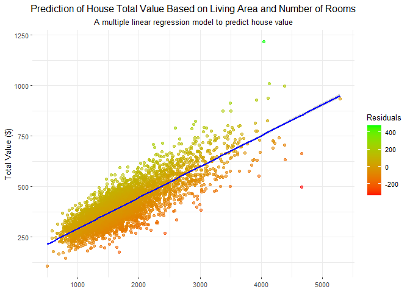

# Data Visualization Project 02

# Initial Plans

I was initially planning to explore the Florida Lakes spatial dataset more. I wanted to highlight the counties with the most area of lakes. I found it hard to try to merge the geoms and find the intersections to get this to work. I also wanted to try to show the correlation of house prices to certain futures of houses, I figured scatter plots would be the best way to visualize this.

# Narrative

We load in all of the different packages and data for our analysis in this first chunk. Sadley nothing too fun here…


``` r
library(tidyverse)
```

```
## ── Attaching core tidyverse packages ──────────────────────── tidyverse 2.0.0 ──
## ✔ dplyr     1.1.4     ✔ readr     2.1.5
## ✔ forcats   1.0.0     ✔ stringr   1.5.1
## ✔ ggplot2   3.5.1     ✔ tibble    3.2.1
## ✔ lubridate 1.9.3     ✔ tidyr     1.3.1
## ✔ purrr     1.0.2     
## ── Conflicts ────────────────────────────────────────── tidyverse_conflicts() ──
## ✖ dplyr::filter() masks stats::filter()
## ✖ dplyr::lag()    masks stats::lag()
## ℹ Use the conflicted package (<http://conflicted.r-lib.org/>) to force all conflicts to become errors
```

``` r
library(sf)
```

```
## Linking to GEOS 3.12.1, GDAL 3.8.4, PROJ 9.3.1; sf_use_s2() is TRUE
```

``` r
library("rnaturalearth")
library("rnaturalearthdata")
```

```
## 
## Attaching package: 'rnaturalearthdata'
## 
## The following object is masked from 'package:rnaturalearth':
## 
##     countries110
```

``` r
library(plotly)
```

```
## 
## Attaching package: 'plotly'
## 
## The following object is masked from 'package:ggplot2':
## 
##     last_plot
## 
## The following object is masked from 'package:stats':
## 
##     filter
## 
## The following object is masked from 'package:graphics':
## 
##     layout
```

``` r
library(broom)
library(units)
```

```
## udunits database from C:/Users/Admin/AppData/Local/R/win-library/4.4/units/share/udunits/udunits2.xml
```

``` r
library("tools")
library("maps")
```

```
## 
## Attaching package: 'maps'
## 
## The following object is masked from 'package:purrr':
## 
##     map
```

``` r
states <- st_as_sf(map("state", plot = FALSE, fill = TRUE))
counties <- st_as_sf(map("county", plot = FALSE, fill = TRUE))


setwd( "..")
florida_lakes <- read_sf("data/Florida_Lakes/Florida_Lakes.shp")

houses <- read_csv("data/WestRoxbury.csv")
```

```
## Rows: 5802 Columns: 14
## ── Column specification ────────────────────────────────────────────────────────
## Delimiter: ","
## chr  (1): REMODEL
## dbl (13): TOTAL VALUE, TAX, LOT SQFT, YR BUILT, GROSS AREA, LIVING AREA, FLO...
## 
## ℹ Use `spec()` to retrieve the full column specification for this data.
## ℹ Specify the column types or set `show_col_types = FALSE` to quiet this message.
```

Next, we can begin to take a look at the houses dataset. I found it very interesting that the largest average house sizes per year were in the 1800s. I would like to dive more into this in the future.


``` r
houses %>%
  group_by(`YR BUILT`) %>%
  summarise(Average_Size = mean(`LIVING AREA`, na.rm = TRUE),
            Average_Value = min(`TOTAL VALUE`, na.rm = TRUE),
            Average_Users_Rooms = max(ROOMS, na.rm = TRUE)) %>%
  arrange(desc(Average_Size))
```

```
## # A tibble: 149 × 4
##    `YR BUILT` Average_Size Average_Value Average_Users_Rooms
##         <dbl>        <dbl>         <dbl>               <dbl>
##  1       1881        3653           737.                  11
##  2       1851        3527           705.                   9
##  3       1848        3168           689.                  12
##  4       1884        3039.          418.                  12
##  5       1798        2953           438.                  11
##  6       2010        2952.          534                    9
##  7       1976        2944           398.                   9
##  8       2011        2885.          458.                  10
##  9       1874        2884           714.                  10
## 10       1998        2806           365.                   9
## # ℹ 139 more rows
```

Below is an interactive plot that you can use to look at the houses dataset comparing the total value of a house to its living area. Feel free to explore it and take a look at some of the outliers.


``` r
plot <- ggplot(houses, aes(x = `LIVING AREA`, y = `TOTAL VALUE`, size = BEDROOMS, color = BEDROOMS)) +
  geom_point(alpha = 0.7) +
  labs(title = "Total Value vs Living Area",
       x = "Living Area (sqft)",
       y = "Total Value (in $1000s)",
       size = "Number of Bedrooms",
       color = "Number of Bedrooms") +
  scale_size_continuous(range = c(.1, 3)) +
  theme_minimal()

inter_plot <- ggplotly(plot)

htmlwidgets::saveWidget(inter_plot, "value_vs_area.html")
```


``` r
widgetframe::frameWidget(inter_plot)
```

```{=html}
<div id="htmlwidget-2e10e633aac63ee51a4d" style="width:100%;height:480px;" class="widgetframe html-widget"></div>
<script type="application/json" data-for="htmlwidget-2e10e633aac63ee51a4d">{"x":{"url":"lewis_project_02_files/figure-html//widgets/widget_unnamed-chunk-4.html","options":{"xdomain":"*","allowfullscreen":false,"lazyload":false}},"evals":[],"jsHooks":[]}</script>
```


Next we move to the Florida lakes data, we can see how lakes are spread through different counties. I limited this to central Florida so we can see lakes we are familiar with and pointed out the largest one.


``` r
invalid_geometries <- !st_is_valid(florida_lakes)

florida_lakes <- st_make_valid(florida_lakes)

florida_lakes <- florida_lakes %>%
  mutate(area = st_area(geometry)) %>%
  arrange(desc(area))

florida_lakes$area <- as.numeric(florida_lakes$area)

lake_summary <- florida_lakes %>%
  group_by(COUNTY) %>%
  summarise(Average_Area = mean(area, na.rm = TRUE),
    total_lakes = n(),
    total_area = sum(area, na.rm = TRUE),
    mean_area = mean(area, na.rm = TRUE),
    median_area = median(area, na.rm = TRUE),
    max_area = max(area, na.rm = TRUE),
    min_area = min(area, na.rm = TRUE)) %>%
  arrange(desc(Average_Area))

lake_summary
```

```
## Simple feature collection with 67 features and 8 fields
## Geometry type: GEOMETRY
## Dimension:     XY
## Bounding box:  xmin: -87.42774 ymin: 25.02625 xmax: -80.03097 ymax: 31.00254
## Geodetic CRS:  WGS 84
## # A tibble: 67 × 9
##    COUNTY     Average_Area total_lakes total_area mean_area median_area max_area
##    <chr>             <dbl>       <int>      <dbl>     <dbl>       <dbl>    <dbl>
##  1 PALM BEACH    70315565.          19     1.34e9 70315565.     239690.   1.30e9
##  2 INDIAN RI…    13515194.           2     2.70e7 13515194.   13515194.   2.70e7
##  3 OSCEOLA        6920741.          56     3.88e8  6920741.     818668.   1.27e8
##  4 GULF           2767325.          11     3.04e7  2767325.      76240.   1.63e7
##  5 HIGHLANDS      2463776.          78     1.92e8  2463776.     277742.   1.07e8
##  6 BAKER          2436310.           3     7.31e6  2436310.       1649.   7.31e6
##  7 CITRUS         2222842.          27     6.00e7  2222842.     155148.   3.26e7
##  8 ALACHUA        2061077.          68     1.40e8  2061077.     175969.   2.95e7
##  9 UNION          2031957.           4     8.13e6  2031957.    2066163.   3.74e6
## 10 MONROE         2026182.          26     5.27e7  2026182.     214442.   1.54e7
## # ℹ 57 more rows
## # ℹ 2 more variables: min_area <dbl>, geometry <MULTIPOLYGON [°]>
```


``` r
largest_lake <- florida_lakes[1, ]
centroid <- st_centroid(largest_lake$geometry)
label <- largest_lake$NAME

x_shift <- -.7
y_shift <- -.3

ggplot(data = florida_lakes) +
  geom_sf(data = states) +
  geom_sf(data = counties) +
  geom_sf(aes(fill = area)) +
  scale_fill_viridis_c(option = "plasma",name = "Area (sq units)") +
  coord_sf(xlim = c(-83, -80), ylim = c(26.5, 29), expand = FALSE) +
  ggtitle("Map of Central Florida Lakes by Area") +
  theme_bw() +
  theme(axis.title.x=element_blank(),
        panel.border = element_blank(),
        axis.title.y=element_blank()) +
  annotate("text", x = st_coordinates(centroid)[, "X"] + x_shift , 
             y = st_coordinates(centroid)[, "Y"] + y_shift, 
             label = label, color = "red", size = 5, hjust = 0)
```

<!-- -->
Below is the houses dataset again mapped with a linear model correlation. Much to our expectation we can visualize that house size, bedroom counts, and room count has large correlation to the price. 


``` r
house_model <- lm(`TOTAL VALUE` ~ `LIVING AREA` + ROOMS + BEDROOMS, data = houses)

houses <- houses %>%
  mutate(predicted_value = predict(house_model, houses),
         residuals = `TOTAL VALUE` - predicted_value)

ggplot(houses, aes(x = `LIVING AREA`, y = `TOTAL VALUE`)) +
  geom_point(aes(color = residuals), alpha = 0.6) +  # Color points by residuals
  geom_smooth(method = "lm", formula = y ~ x, color = "blue") +
  labs(title = "Prediction of House Total Value Based on Living Area and Number of Rooms",
       x = "Living Area (sq ft)",
       y = "Total Value ($)",
       subtitle = "A multiple linear regression model to predict house value") +
  scale_color_gradient(low = "red", high = "green", name = "Residuals") +
  theme_bw(base_size = 10) +
  theme(axis.title.x=element_blank(),
        panel.border = element_blank(),
        plot.title = element_text(hjust = 0.5),
        plot.subtitle = element_text(hjust = 0.5))
```

<!-- -->

We can see the the data follow the LM model well with only some outliters and residuals being close to 0.


``` r
houses_coefs <- tidy(house_model, conf.int = TRUE) %>% 
  filter(term != "(Intercept)")
houses_coefs
```

```
## # A tibble: 3 × 7
##   term          estimate std.error statistic      p.value conf.low conf.high
##   <chr>            <dbl>     <dbl>     <dbl>        <dbl>    <dbl>     <dbl>
## 1 `LIVING AREA`    0.143   0.00196     72.9  0               0.139     0.147
## 2 ROOMS            4.52    0.805        5.61 0.0000000211    2.94      6.09 
## 3 BEDROOMS         1.78    1.23         1.44 0.149          -0.639     4.20
```
Overall, this project should highlight some of the basic ways to look at data. While this is just the surface these visualizations could be improved upon to add in more factors. I found the spatial data difficult to work with and would like to dive into this more. I find it to be a very interesting topic as well.
