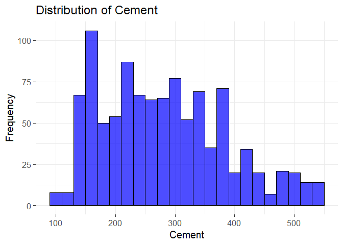
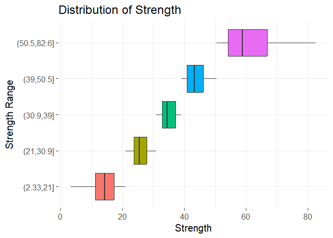
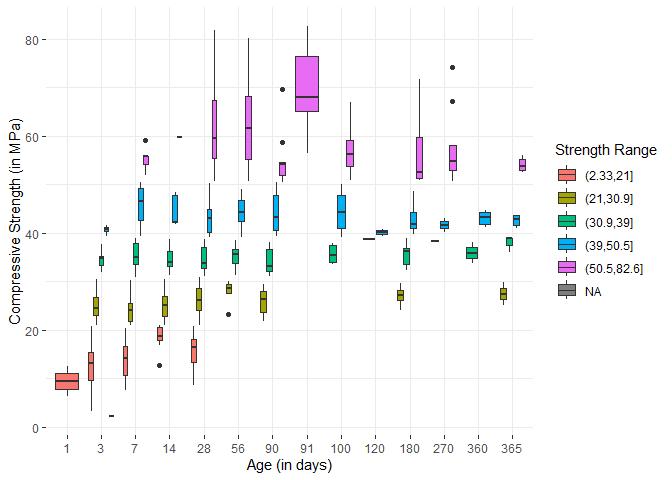
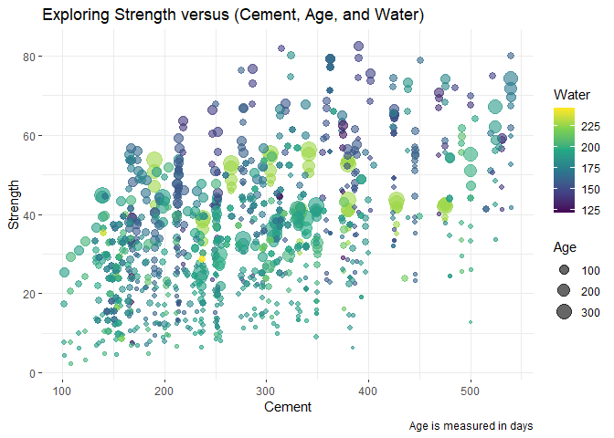

# Data Visualization Project 03


In this exercise you will explore methods to create different types of data visualizations (such as plotting text data, or exploring the distributions of continuous variables).


## PART 1: Density Plots

Using the dataset obtained from FSU's [Florida Climate Center](https://climatecenter.fsu.edu/climate-data-access-tools/downloadable-data), for a station at Tampa International Airport (TPA) for 2022, attempt to recreate the charts shown below which were generated using data from 2016. You can read the 2022 dataset using the code below: 


``` r
library(tidyverse)
library(ggridges)
library(lubridate)

setwd( "..")
weather_tpa <- read_csv("https://raw.githubusercontent.com/reisanar/datasets/master/tpa_weather_2022.csv")
# random sample 
sample_n(weather_tpa, 4)
```

```
## # A tibble: 4 × 7
##    year month   day precipitation max_temp min_temp ave_temp
##   <dbl> <dbl> <dbl>         <dbl>    <dbl>    <dbl>    <dbl>
## 1  2022     7    24          0          95       79     87  
## 2  2022    10    21          0          77       54     65.5
## 3  2022    10    12          0.02       85       74     79.5
## 4  2022     4    15          0.02       87       73     80
```

See https://www.reisanar.com/slides/relationships-models#10 for a reminder on how to use this type of dataset with the `lubridate` package for dates and times (example included in the slides uses data from 2016).

Using the 2022 data: 

(a) Create a plot like the one below:


Hint: the option `binwidth = 3` was used with the `geom_histogram()` function.


``` r
tpa_clean <- weather_tpa %>% 
  unite("doy", year, month, day, sep = "-") %>% 
  mutate(doy = ymd(doy), 
         max_temp = as.double(max_temp), 
         min_temp = as.double(min_temp), 
         precipitation = as.double(precipitation))

tpa_clean$month <- factor(month(tpa_clean$doy, label=TRUE, abbr=FALSE))

ggplot(tpa_clean, aes(x = max_temp, fill = month)) +
  geom_histogram(binwidth = 3, show.legend = FALSE, color = "white") +
  facet_wrap(~ month) +
  labs(x = "Maximum temperatures",
       y = "Number of Days") +
  theme_bw(base_size = 15)
```

<!-- -->


(b) Create a plot like the one below:


Hint: check the `kernel` parameter of the `geom_density()` function, and use `bw = 0.5`.


``` r
ggplot(tpa_clean, aes(x = max_temp)) +
  geom_density(kernel = "epanechnikov", bw = 0.5, fill = "darkgray", size = 1) +
  labs(x = "Maximum Temperature",
       y = "density") +
  theme_bw(base_size = 15) +
  theme(panel.border = element_blank())
```

```
## Warning: Using `size` aesthetic for lines was deprecated in ggplot2 3.4.0.
## ℹ Please use `linewidth` instead.
## This warning is displayed once every 8 hours.
## Call `lifecycle::last_lifecycle_warnings()` to see where this warning was
## generated.
```

<!-- -->


(c) Create a plot like the one below:


Hint: default options for `geom_density()` were used. 


``` r
ggplot(tpa_clean, aes(x = max_temp, fill = month)) +
  geom_density(alpha = 0.5, size = 1, show.legend = FALSE) +
  facet_wrap(~ month) +
  labs(title = "Density plots for each month in 2022",
       x = "Maximum Temperature") +
  theme_bw(base_size = 15) +
  theme(axis.title.y.left = element_blank())
```

<!-- -->


(d) Generate a plot like the chart below:


Hint: use the`{ggridges}` package, and the `geom_density_ridges()` function paying close attention to the `quantile_lines` and `quantiles` parameters. The plot above uses the `plasma` option (color scale) for the _viridis_ palette.


``` r
ggplot(tpa_clean, aes(x = max_temp, y = month, fill = stat(x))) +
  geom_density_ridges_gradient(quantile_lines=TRUE, quantiles = 2,lwd = 1) +
  scale_fill_viridis_c(option = "C") +
  labs(x = "Maximum temperature (in Farhenheit degrees)") +
  theme_bw(base_size = 15) +
  theme(axis.title.y.left = element_blank(),
        panel.border = element_blank(),
        legend.title = element_blank())
```

```
## Warning: `stat(x)` was deprecated in ggplot2 3.4.0.
## ℹ Please use `after_stat(x)` instead.
## This warning is displayed once every 8 hours.
## Call `lifecycle::last_lifecycle_warnings()` to see where this warning was
## generated.
```

```
## Picking joint bandwidth of 1.93
```

<!-- -->


(e) Create a plot of your choice that uses the attribute for precipitation _(values of -99.9 for temperature or -99.99 for precipitation represent missing data)_.


``` r
tpa_precipitation <- tpa_clean %>% mutate(precipitation = ifelse(precipitation == -99.99, NA, precipitation))

monthly_avg_precip <- tpa_precipitation %>%
  group_by(month) %>%
  summarise(avg_precipitation = mean(precipitation, na.rm = TRUE),
            max_temp = max(max_temp, na.rm = TRUE))

ggplot(monthly_avg_precip, aes(x = month, y = avg_precipitation, fill = max_temp)) +
  geom_bar(stat = "identity") +
  labs(title = "Monthly Average Precipitation in 2022",
       x = "Month",
       y = "Average Precipitation (mm)") +
  scale_fill_viridis_c(option = "A", na.value = "transparent", name = "Max Temperature") +
  theme_bw(base_size = 15) +
  theme(axis.text.x = element_text(angle = 45, hjust = 1),
        panel.border = element_blank())
```

<!-- -->


## PART 2 


### Data on Concrete Strength 

Concrete is the most important material in **civil engineering**. The concrete compressive strength is a highly nonlinear function of _age_ and _ingredients_. The dataset used here is from the [UCI Machine Learning Repository](https://archive.ics.uci.edu/ml/index.php), and it contains 1030 observations with 9 different attributes 9 (8 quantitative input variables, and 1 quantitative output variable). A data dictionary is included below: 


Variable                      |    Notes                
------------------------------|-------------------------------------------
Cement                        | kg in a $m^3$ mixture             
Blast Furnace Slag            | kg in a $m^3$ mixture  
Fly Ash                       | kg in a $m^3$ mixture             
Water                         | kg in a $m^3$ mixture              
Superplasticizer              | kg in a $m^3$ mixture
Coarse Aggregate              | kg in a $m^3$ mixture
Fine Aggregate                | kg in a $m^3$ mixture      
Age                           | in days                                             
Concrete compressive strength | MPa, megapascals


Below we read the `.csv` file using `readr::read_csv()` (the `readr` package is part of the `tidyverse`)


``` r
concrete <- read_csv("../data/concrete.csv", col_types = cols())
```


Let us create a new attribute for visualization purposes, `strength_range`: 


``` r
new_concrete <- concrete %>%
  mutate(strength_range = cut(Concrete_compressive_strength, 
                              breaks = quantile(Concrete_compressive_strength, 
                                                probs = seq(0, 1, 0.2))) )
```


1. Explore the distribution of 2 of the continuous variables available in the dataset. Do ranges make sense? Comment on your findings.


``` r
head(new_concrete)
```

```
## # A tibble: 6 × 10
##   Cement Blast_Furnace_Slag Fly_Ash Water Superplasticizer Coarse_Aggregate
##    <dbl>              <dbl>   <dbl> <dbl>            <dbl>            <dbl>
## 1   540                  0        0   162              2.5            1040 
## 2   540                  0        0   162              2.5            1055 
## 3   332.               142.       0   228              0               932 
## 4   332.               142.       0   228              0               932 
## 5   199.               132.       0   192              0               978.
## 6   266                114        0   228              0               932 
## # ℹ 4 more variables: Fine_Aggregate <dbl>, Age <dbl>,
## #   Concrete_compressive_strength <dbl>, strength_range <fct>
```

``` r
new_concrete %>%
  summarise(Max_Cement = max(Cement, na.rm = TRUE),
            Average_Cement = mean(Cement, na.rm = TRUE),
            Min_Cement = min(Cement, na.rm = TRUE),
            Max_Water = max(Water, na.rm = TRUE),
            Average_Water = mean(Water, na.rm = TRUE),
            Min_Water = min(Water, na.rm = TRUE),
            Max_Age = max(Age, na.rm = TRUE),
            Average_Age = mean(Age, na.rm = TRUE),
            Min_Age = min(Age, na.rm = TRUE),
            )
```

```
## # A tibble: 1 × 9
##   Max_Cement Average_Cement Min_Cement Max_Water Average_Water Min_Water Max_Age
##        <dbl>          <dbl>      <dbl>     <dbl>         <dbl>     <dbl>   <dbl>
## 1        540           281.        102       247          182.      122.     365
## # ℹ 2 more variables: Average_Age <dbl>, Min_Age <dbl>
```

``` r
ggplot(new_concrete, aes(x = Cement)) +
  geom_histogram(binwidth = 20, fill = "blue", alpha = 0.7, color = "black") +
  labs(title = "Distribution of Cement", x = "Cement", y = "Frequency") +
  theme_bw(base_size = 15) +
  theme(panel.border = element_blank())
```

<!-- -->

``` r
ggplot(drop_na(new_concrete), aes(x = Concrete_compressive_strength, y = strength_range, fill = strength_range)) +
  geom_boxplot(show.legend = FALSE) +
  labs(title = "Distribution of Strength", x = "Strength", y = "Strength Range") +
  theme_bw(base_size = 15) +
    theme(panel.border = element_blank())
```

<!-- -->
The above boxplots show us the ranges of strength of concrete. We can use this to verify the strength range given to us within the dataset and look at the IQR for each of the ranges. This gives us more details as to where most of the observations within each range lie.

2. Use a _temporal_ indicator such as the one available in the variable `Age` (measured in days). Generate a plot similar to the one shown below. Comment on your results.


``` r
ggplot(new_concrete, aes(x = factor(Age), y = Concrete_compressive_strength, fill = strength_range)) +
  geom_boxplot() +
  theme_bw() +
  labs(
    x = "Age (in days)",
    y = "Compressive Strength (in MPa)",
    fill = "Strength Range") +
  theme(panel.border = element_blank())
```

<!-- -->
We can see in the plot above that the older cement is the stronger it tends to be. While there are some exections to this, the boxplots do trend upwards with time.

3. Create a scatterplot similar to the one shown below. Pay special attention to which variables are being mapped to specific aesthetics of the plot. Comment on your results. 


``` r
ggplot(new_concrete, aes(x = Cement, y = Concrete_compressive_strength, color = Water,  size = Age)) +
  geom_point(alpha = 0.6) +
  scale_color_viridis_c() +
  theme_bw()+
  labs(
    title = "Exploring Strength versus (Cement, Age, and Water)",
    x = "Cement",
    y = "Strength",
    size = "Age",
    color = "Water",
    caption="Age is measured in days") +
  theme(panel.border = element_blank())
```

<!-- -->


The scatter plot shows that material strength generally increases with higher cement content, though there is significant variability. Higher water content is associated with lower strength, while lower water content correlates with higher strength. Larger, older samples tend to exhibit higher strength values, indicating that strength increases over time. Despite these trends, the variability in strength suggests the influence of additional factors beyond cement and water content and age.


